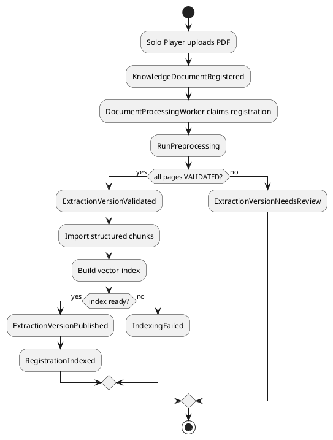
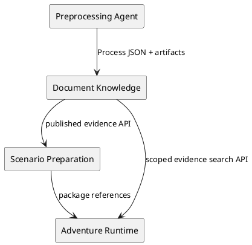

# Architecture Spec: 검증된 전처리 기반 RAG 적재

## 1. Design Scope

| 항목 | 대상 |
| --- | --- |
| Product Spec | `docs/specs/product-spec.md` |
| Use Cases | UC-RAG-PRE-001~003 |
| Bounded Contexts | Document Knowledge, Scenario Preparation, Adventure Runtime |
| Existing Services | `rule-knowledge-service`, `adventure-service`, `preprocessing_agent` |
| Affected Data | 등록 문서, 추출 버전·페이지·청크·벡터 인덱스, 검색 근거 |

| Product Spec | Architecture 요소 |
| --- | --- |
| 새 전처리 기반 적재 | Java worker → Python process port → artifact import → vector publication |
| 페이지 복구 | `RagExtractionVersion`, page status, targeted retry, publication gate |
| 개발 DB 초기화 | development-profile-only reset command |

## 2. Domain Flow



| Command | Actor | Preconditions | Result |
| --- | --- | --- | --- |
| RegisterKnowledgeDocument | Solo Player | authorized PDF | QUEUED registration |
| RunPreprocessing | worker | claimed registration | validated artifact or review state |
| PublishExtractionVersion | indexing policy | every page VALIDATED | current published version and INDEXED registration |
| RetryExtractionPages | owner retry flow | retryable page diagnostics | new candidate version |
| ResetDevelopmentRagData | development operator | development profile, explicit confirmation | DB RAG data removed |

| Event | Producer | Consumer policy | Outcome |
| --- | --- | --- | --- |
| KnowledgeDocumentRegistered | registration | enqueue processing | RunPreprocessing |
| ExtractionVersionValidated | artifact importer | build vectors | publish on success |
| ExtractionVersionNeedsReview | artifact importer | block publication | diagnostics and retry |
| ExtractionVersionPublished | publication service | retrieval/scenario readers | evidence searchable |

## 3. DDD Architecture

| Context | Responsibility | Owned data |
| --- | --- | --- |
| Document Knowledge | original files, preprocessing execution, extraction publication, RAG vectors | KnowledgeDocument, RagExtractionVersion, RagExtractionPage, chunks/vectors |
| Scenario Preparation | package construction from published evidence | bundle/package references |
| Adventure Runtime | session-scoped retrieval and plan generation | Session Knowledge Set, plan citations |
| Preprocessing Agent | PDF layout extraction and artifact generation | request-scoped transient artifacts only |



| Aggregate | Root | Invariants |
| --- | --- | --- |
| Knowledge Document Processing | `RagExtractionVersion` | only fully validated version can publish; published version immutable |
| Knowledge Document | existing registration | pointer refers to INDEXED version of same document/hash |

| Entity / value | Responsibility |
| --- | --- |
| `RagExtractionPage` | page status, diagnostics, retry provenance |
| `PublishedRagChunk` | embedding payload and immutable source provenance |
| `PreprocessingOperationId` | unique process correlation |
| `ExtractionPublicationStatus` | PROCESSING, NEEDS_REVIEW, VALIDATED, INDEXING, INDEXED, FAILED |
| `PublishedSourceSpan` | document/version/page/coordinates or structural locator |

## 4. Program Design

| Component | Responsibility | Must not do |
| --- | --- | --- |
| `PreprocessingProcessPort` | invoke JSON stdin/stdout Python contract | own DB state or expose artifact paths |
| `ProcessCliPreprocessingAdapter` | launch `preprocessing_agent.adapters.process_cli`, timeout and parse | silently fallback to Docling/plain text |
| `PreprocessingArtifactImporter` | validate/import page and chunk artifacts | publish vectors |
| `RagExtractionPublicationService` | coordinate validation, vectors and pointer publication | infer source content |
| existing pipeline worker | claim/orchestrate registration | bypass publication gate |
| `PublishedEvidenceSearchRepository` | published chunk search with source spans | read candidates/legacy flattened chunks |

```java
interface PreprocessingProcessPort {
    PreprocessingRunResult preprocess(PreprocessingRunRequest request);
    PreprocessingRunResult retryPages(PreprocessingRetryRequest request);
    PreprocessingRunStatus status(PreprocessingOperationId operationId);
}
```

The request/response carries operation id, source hash, policy version, candidate version, manifest and artifact references. Import rejects a mismatched id/hash/version/page count/schema. Process failure, malformed response, missing artifact and unsupported file are terminal candidate failures; PDF publication never falls back to the legacy extractor.

| Existing seam | Change |
| --- | --- |
| `RulebookPipelineApplicationService.java` | replace flattened PDF indexing with candidate-version orchestration |
| `RulebookProcessingWorker.java` | retain claims, persist review states |
| `DoclingPdfRulebookContentExtractor.java` | remove from PDF RAG publication path |
| `tools/storybook_indexing/indexer.py` | retire from product ingestion after replacement tests exist |
| `process_cli.py` | sole Python boundary, versioned schema only |
| `PostgresRulebookIndexRepository.java` | persist processor chunk id, section path, source span and version |
| `CrossContextHttpScenarioSourceExcerptGateway.java` | use published chunks for RULEBOOK and STORYBOOK |

## 5. Technical Architecture

| Data | Owner | Change |
| --- | --- | --- |
| `rulebook_registration` | Document Knowledge | candidate/publication state and current published extraction reference |
| `rag_extraction_version` | Document Knowledge | version, source hash, policy, status, operation, manifest, timestamps |
| `rag_extraction_page` | Document Knowledge | page status, diagnostics, retry and artifact identity |
| vector index/chunk tables | Document Knowledge | extraction version, processor chunk id, section path, source span |

Candidate versions are immutable after `INDEXED`. The current published pointer and vector readiness are switched atomically after all vectors succeed. Search joins the published pointer, never merely a READY candidate index.

Public upload/status/retry APIs retain their entry points but expose safe candidate/page diagnostics, never filesystem paths. Page retry is owner-scoped. Non-PDF input is explicitly rejected from this RAG flow.

Development reset is an explicit development-only DB command. It removes registrations, extraction versions/pages, vector indexes/chunks and processing rows in dependency order; it refuses non-development profiles and never deletes repository docs or source assets.

| Allowed dependency | Contract |
| --- | --- |
| Java Document Knowledge → Python | `PreprocessingProcessPort` JSON process contract |
| Adventure Service → Document Knowledge | published evidence/search HTTP contract |
| Python → artifact directory | request-scoped only |

| Forbidden dependency | Rule |
| --- | --- |
| Adventure Service → artifact files | forbidden |
| Python → product DB | forbidden |
| PDF ingestion → legacy fallback | forbidden |
| retrieval → candidate vectors | forbidden |

## 6. Runtime and Recovery

| Situation | Persisted result | Recovery |
| --- | --- | --- |
| layout validation fails | `NEEDS_REVIEW`, page diagnostics, no vectors | targeted retry creates new candidate |
| timeout/malformed output | `FAILED` with safe diagnostic | full retry from stored source |
| artifact mismatch | candidate rejected | new operation id |
| vector creation fails | pointer unchanged | retry index from imported chunks |
| duplicate claim | operation reused/rejected | no duplicate publication |

Ordering is per Knowledge Document. Publication is idempotent by document id, extraction version, source hash and policy version.

## 7. Security and Observability

- Process adapter only resolves files from Document Knowledge storage; user command/path/module inputs are forbidden.
- Logs carry document id, candidate version, operation id, hash and page count, not file content or secrets.
- Metrics: duration, pages by status, retries, publication blocks, importer failures, vector duration and searches by extraction version.
- Trace: upload → worker → process → import → vector publication → evidence search → story plan.

## 8. Verification Requirements

| Level | Proof |
| --- | --- |
| Python | layout/table/manifest/retry/publication-block tests |
| Java unit | process validation, state transitions, no fallback, idempotency |
| Persistence | page/chunk provenance and atomic pointer switch |
| API | upload/status/retry/published-only search |
| Cross-service E2E | upload → process → vectors → search → scenario/plan citation |
| Negative E2E | NEEDS_REVIEW blocks RAG and plan; successful retry publishes only new version |
| Development reset | DB rows gone, source files retained, re-upload only returns new-version evidence |

## 9. Change Boundaries and Risks

- Allowed: rule-knowledge processing/persistence/vector provenance/API status; adventure evidence gateway; process contract; development-only reset tooling.
- Forbidden: direct Python DB writes, partial RAG publication, legacy PDF fallback, `docs/`/asset deletion as reset.
- Risk: runtime paths, process/schema drift, partial embedding failures, and future non-PDF demand. Mitigate with startup preflight, schema contracts, atomic pointer switching, and future adapters that satisfy the same artifact contract.

No blocking architecture questions remain.
