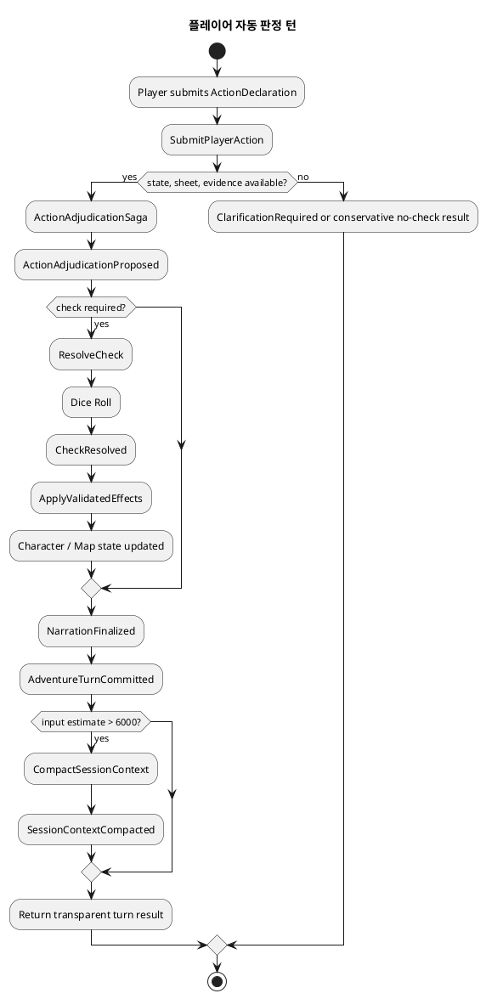
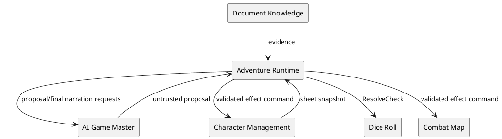
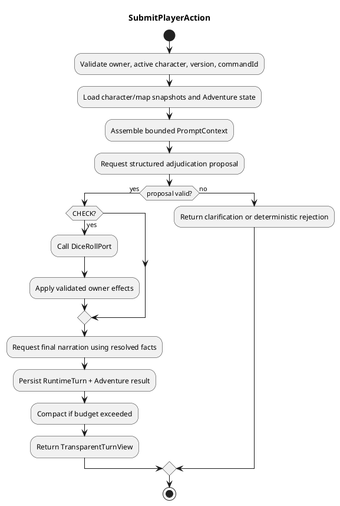

# Architecture Spec — 근거 기반 자동 판정 GM과 장기 세션 메모리

## 1. Design Scope

### 1.1 Target

| 항목 | 대상 |
| --- | --- |
| Product Spec | `docs/specs/product-spec.md` |
| Use Cases | UC-01~04 |
| Domain | Adventure Runtime, Dice Roll, Character Management, AI Game Master |
| Bounded Contexts | Adventure Runtime, AI Game Master, Dice Roll, Character Management, Combat Map, Document Knowledge |
| Existing Services | adventure-service, ai-game-master-service, dice-roll-service, character-management-service, combat-map-service |
| External Dependencies | Ollama, PostgreSQL |
| Affected Data | Adventure, RuntimeTurn, conversation, roll, character state, session memory |

### 1.2 Product Spec Mapping

| Product Spec 항목 | Architecture 요소 |
| --- | --- |
| UC-01 자동 행동 판정 | `ActionAdjudicationSaga`, 구조화 `AdjudicationProposal`, `ResolvedCheck` |
| UC-02 투명 판정 | `CheckBreakdown` 읽기 모델과 응답 계약 |
| UC-03 장기 세션 유지 | `SessionMemory`, `ContextCompactionPolicy`, `PromptContextAssembler` |
| UC-04 보수 진행 | 근거 검증기와 `ClarificationRequired` 결과 |
| BR-01 정본 계산 | Dice Roll·Character Management 소유권, Adventure Saga |
| BR-05 제한 창작 | AI GM 제안 검증과 narration safety |

---

## 2. Domain Flow

### 2.1 Event Storming Flow



### 2.2 Commands

| Command | Actor | Target | Preconditions | Result |
| --- | --- | --- | --- | --- |
| `SubmitPlayerAction` | Player | Adventure Runtime | owner, active direct turn, expected version | `ActionAdjudicationProposed` or clarification |
| `ResolveCheck` | Runtime Saga | Dice Roll | validated proposal, command ID | `CheckResolved` |
| `ApplyValidatedEffects` | Runtime Saga | Character/Map owners | resolved rule effect, expected versions | state-owner results |
| `FinalizeNarration` | Runtime Saga | AI GM | committed outcome and citations | safe narration proposal |
| `CompactSessionContext` | Runtime policy | Session Memory | estimated input > 6,000 tokens | new summary checkpoint |

### 2.3 Domain Events

| Event | Producer | Payload | Consumers |
| --- | --- | --- | --- |
| `ActionAdjudicationProposed` | AI GM / validation boundary | check kind, formula inputs, DC, evidence, no-check/clarify reason | Runtime Saga |
| `CheckResolved` | Dice Roll | immutable roll ID, d20s, modifiers, total, DC, outcome | Runtime Saga, UI |
| `StateEffectsApplied` | Character/Map contexts | owner version, applied effects | Runtime Saga |
| `AdventureTurnCommitted` | Adventure Runtime | context, citations, narration, result references | UI, Session Memory |
| `SessionContextCompacted` | Session Memory | checkpoint, covered turn range, summary | prompt assembler |

### 2.4 Policies

| Policy | Trigger | Decision | Owner |
| --- | --- | --- | --- |
| Evidence-bound adjudication | action submitted | reject game-effect proposal lacking cited rule/state evidence | Adventure Runtime |
| System-owned roll | validated check proposal | issue idempotent dice command; never ask model to roll | Adventure Runtime |
| Final narration | all required state effects applied | call GM with immutable outcome only | Adventure Runtime |
| Conservative progress | incomplete information | allow no-effect narration only; otherwise request clarification | Adventure Runtime |
| Context compaction | estimated prompt > 6,000 | retain latest 6 turns, summarize older turns | Session Memory |

### 2.5 Read Models

| Read Model | Consumer | Fields | Owner |
| --- | --- | --- | --- |
| `TransparentTurnView` | Player UI | check type, ability/skill, modifier breakdown, advantage, DC, dice, outcome, citations, narration | Adventure Runtime |
| `PromptContext` | AI GM | current state references, session summary, recent six turns, retrieved evidence | Adventure Runtime |

### 2.6 Hotspots

| Hotspot | Decision |
| --- | --- |
| Dice `PLAYER_ACTION` authority | Runtime Saga is trusted system caller for the player's active turn; player still cannot supply a roll result. |
| Incomplete Resolution Unit | Do not invent a DC/effect. Permit only no-effect conservative narration or clarification. |
| Summary accuracy | Summary is non-authoritative; state owners and raw turns remain recoverable truth. |

---

## 3. DDD Architecture

### 3.1 Bounded Contexts

| Context | Responsibility | Owned model/data |
| --- | --- | --- |
| Adventure Runtime | turn lifecycle, evidence scope, orchestration, memory checkpoints, player result projection | Adventure, RuntimeTurn, SessionMemory |
| AI Game Master | grounded analysis and limited narration proposals, no writes | proposal/narration request-response only |
| Dice Roll | immutable random outcomes and expression evaluation | DiceRoll |
| Character Management | ability modifiers, proficiency, HP, inventory, conditions, resources | CharacterSheet |
| Combat Map | combat position/map effects | map and token state |
| Document Knowledge | immutable rule/story evidence retrieval | KnowledgeDocument, evidence index |

### 3.2 Context Map



All cross-context references carry IDs, versions, `turnId`, and `commandId`. Existing ADR-003 remains governing: no distributed transaction; resume the idempotent Runtime Command Saga.

### 3.3 Aggregates and Rule Ownership

| Aggregate / service | Owner | Invariants |
| --- | --- | --- |
| `Adventure` | Adventure Runtime | owner, version, turn cursor, ordered conversation |
| `RuntimeTurn` | Adventure Runtime | one immutable committed outcome per command ID; resumable saga state |
| `SessionMemory` | Adventure Runtime | checkpoint range contiguous; summary cannot overwrite authoritative game facts; latest six turns excluded from compaction |
| `DiceRoll` | Dice Roll | one immutable result per command ID; expression and scope authorized |
| `CharacterSheet` | Character Management | state changes version-conditional and rule-authorized |
| `ActionAdjudicationPolicy` | Adventure Runtime domain service | only evidence-backed checks/effects may proceed |
| `ContextCompactionPolicy` | Adventure Runtime domain service | compaction only beyond 6,000 estimated input tokens |

### 3.4 Value Objects

| Value object | Meaning |
| --- | --- |
| `AdjudicationProposal` | structured, untrusted GM analysis: `NO_CHECK`, `CHECK`, `CLARIFY`; cited evidence; no state mutation |
| `CheckSpecification` | check category, ability, skill/tool, proficiency applicability, advantage state, DC, dice expression, citations |
| `ResolvedCheck` | roll ID and complete immutable calculation breakdown |
| `ValidatedEffect` | rule-derived state operation addressed to its owning context and evidence |
| `SessionMemoryCheckpoint` | covered historical turn range, summary text, cited fact references, source version |
| `PromptContext` | fixed policy + state snapshot + summary + latest six turns + selected evidence |

### 3.5 Aggregate State Transitions

| Current state | Command/event | Next state | Enforcement |
| --- | --- | --- | --- |
| action pending | `SubmitPlayerAction` | planned | Adventure version/owner/turn checks |
| planned | validated `CHECK` | roll pending | proposal and evidence validation |
| roll pending | `CheckResolved` | effects pending/finalization pending | dice result matches command/spec |
| effects pending | all state-owner acknowledgements | narration pending | each required effect applied exactly once |
| narration pending | safe narration | committed | persist turn, context, conversation atomically within Adventure store |
| any resumable state | duplicate command | same terminal result | RuntimeTurn command-id idempotency |

---

## 4. Program Design

### 4.1 Major Components

| Component | Responsibility | Must not do |
| --- | --- | --- |
| `PlayerActionApplicationService` | load active player sheet/state, run saga, produce `TransparentTurnView` | calculate random result or trust GM state changes |
| `ActionAdjudicationPolicy` | validate proposal against evidence, sheet, and compiled Resolution Units | narrate or persist external state |
| `DiceRollPort` | request immutable system roll and return `ResolvedCheck` | expose dice implementation to domain |
| `CharacterStatePort` / `CombatStatePort` | read snapshots and apply validated owner commands | accept arbitrary GM text as effect |
| `PromptContextAssembler` | assemble bounded prompt and retrieve relevant historical facts | treat summary as truth |
| `SessionCompactionApplicationService` | produce/save checkpoint after committed turn | delete raw conversation |
| `TransparentTurnMapper` | return fully public adjudication details | hide DC or citations |

### 4.2 Application Flow



### 4.3 Component Call Contracts

| # | Caller | Callee | Operation | Output |
| ---: | --- | --- | --- | --- |
| 1 | Controller | PlayerActionApplicationService | `submit` | terminal turn or clarification |
| 2 | Application service | Character/Map ports | read current snapshots | versioned state |
| 3 | Application service | AI GM port | `proposeAdjudication` | `AdjudicationProposal` |
| 4 | Application service | Dice Roll port | `resolve` | `ResolvedCheck` |
| 5 | Application service | state-owner ports | `apply` | owner acknowledgements |
| 6 | Application service | AI GM port | `finalizeNarration` | evidence-cited narration |
| 7 | Application service | repositories | commit / checkpoint | durable result |

### 4.4 Interface Contracts

```java
interface AdjudicationPort {
    AdjudicationProposal propose(AdjudicationRequest request);
    FinalNarration finalizeNarration(FinalNarrationRequest request);
}

interface DiceRollPort {
    ResolvedCheck resolve(ResolveCheckCommand command);
}

interface SessionMemoryRepository {
    Optional<SessionMemory> findByAdventureId(AdventureId adventureId);
    void save(SessionMemory memory);
}
```

`ResolveCheckCommand` includes `commandId`, `turnId`, active `CharacterSheetId`, `CheckSpecification`, and authoritative modifier inputs. `FinalNarrationRequest` has no writable state fields; it carries only resolved facts, state-owner acknowledgements, and citations.

### 4.5 Errors

| Failure | Result | Retry |
| --- | --- | --- |
| missing/stale sheet or map snapshot | conflict; reload and resubmit | client-controlled |
| unsupported/uncited proposal | clarification or safe rejection | no |
| dice timeout | resumable pending RuntimeTurn | yes, same command ID |
| state-owner partial failure | pending saga; no final narration | yes |
| AI malformed/unsafe narration | preserve resolved state, use deterministic grounded fallback | AI retry then fallback |
| compaction failure | committed turn succeeds; retry compaction separately | yes |

### 4.6 Dependency Rules

| Allowed | Contract |
| --- | --- |
| Adventure app → AI GM | `AdjudicationPort` only |
| Adventure app → Dice/Character/Map | outbound ports only |
| Adventure domain → external services | forbidden |
| AI GM → state stores | forbidden |
| Dice → Adventure state | forbidden |

---

## 5. Technical Architecture

### 5.1 Service and Module Mapping

| Context | Service | Target areas |
| --- | --- | --- |
| Adventure Runtime | `adventure-service` | `application/runtime`, `domain/adventure`, integration/persistence adapters |
| AI Game Master | `ai-game-master-service` | structured adjudication and final narration APIs |
| Dice Roll | `dice-roll-service` | trusted runtime roll endpoint and expression/result mapping |
| Character Management | `character-management-service` | richer internal state snapshot and versioned effect commands |
| Combat Map | `combat-map-service` | optional position/effect snapshot and commands |

### 5.2 Synchronous Communication

| Caller | Provider | Operation | Request / response |
| --- | --- | --- | --- |
| Adventure | Character | read active sheet | full rule-relevant snapshot with version |
| Adventure | AI GM | propose/finalize | versioned structured JSON, cited evidence |
| Adventure | Dice | resolve | idempotent command → immutable breakdown |
| Adventure | Character/Map | apply effect | idempotent versioned command → acknowledgement |
| Adventure | Rule Knowledge | evidence search | scoped evidence only |

### 5.3 API Contract

`POST /api/v1/adventures/{adventureId}/messages` evolves into a direct-player-turn endpoint. Request adds `characterSheetId`, `expectedVersion`, `turnId`, and `commandId`; authenticated player identity is taken from the security context, never trusted from the body.

Response includes:

```json
{
  "status": "RESOLVED",
  "check": {
    "kind": "ABILITY_CHECK",
    "ability": "CHARISMA",
    "skill": "PERSUASION",
    "proficiencyBonus": 2,
    "abilityModifier": 3,
    "advantage": "NONE",
    "dc": 13,
    "d20": [14],
    "total": 19,
    "outcome": "SUCCESS",
    "citations": []
  },
  "narration": "...",
  "nextVersion": 42
}
```

`CLARIFICATION_REQUIRED` has no `check` and carries the exact missing information. `NO_CHECK` carries no dice values and has only citations/narration.

### 5.4 Data Ownership and Schema Changes

| Data | Owner | Change |
| --- | --- | --- |
| raw conversation | Adventure Runtime | retain; add indexed sequence/range retrieval if absent |
| session memory/checkpoints | Adventure Runtime | new table keyed by adventure and checkpoint version |
| runtime saga plan/result | Adventure Runtime | evolve `RuntimeTurn` to store proposal, resolved check refs, effect acknowledgements, terminal phase—not a full mutable conversation copy |
| roll result | Dice Roll | retain immutable source of truth; no duplicate random fields as authority |
| character/map state | owning services | no Adventure duplication; retain version and command reference |

Schema migration is additive. Existing saved adventures without a checkpoint start with an empty summary and derive the recent six-turn window from existing conversation.

### 5.5 File Change Map

| Path / area | Action | Responsibility |
| --- | --- | --- |
| `adventure/.../application/runtime/RuntimeTurnApplicationService` | replace/split | explicit adjudication saga phases |
| `adventure/.../application/runtime/RuntimePlan` | modify | replace text-only judgment with structured proposal/result references |
| `adventure/.../domain/adventure` | add | SessionMemory, proposal/check/effect value objects and policies |
| `adventure/.../infrastructure/integration` | add/modify | Dice, full character state, AI GM adapters |
| `adventure/.../api/AdventureController` | modify | authenticated direct-turn request and transparent response |
| `adventure/.../persistence` + migration | add/modify | memory checkpoint and expanded saga persistence |
| `ai-game-master-service/...` | modify | proposal/finalize JSON contracts and validation |
| `dice-roll-service/...` | modify | trusted runtime caller authorization and transparent breakdown |
| `character-management-service/...` | modify | rule-relevant snapshot and versioned effect command |
| `web-ui/...` | modify | action input, roll breakdown, clarification display |
| runtime/dice/character/AI/system tests | add/modify | policies, idempotency, migration, end-to-end flow |

---

## 6. Runtime Design

### 6.1 Context Assembly

`PromptContextAssembler` builds every GM call in this order:

1. fixed GM policy and response schema;
2. current authoritative Adventure facts and versioned external state snapshots;
3. latest valid `SessionMemoryCheckpoint`;
4. most recent six committed turns in original form;
5. action-scoped Storybook, Rulebook, and Resolution Unit evidence.

`ContextBudgetEstimator` estimates the complete input using one deterministic model-specific estimator. At over 6,000 input tokens, it selects the latest six turns, compacts only older covered turns, saves a new checkpoint, then rebuilds. If still over budget, it reduces evidence by relevance but never drops active game state or the current action. The configured 8,192-token model window retains output headroom.

### 6.2 Concurrency, Transactions, and Idempotency

| Concern | Strategy |
| --- | --- |
| same player command retry | `commandId` returns the same RuntimeTurn/result |
| turn ordering | Adventure optimistic version + active turn cursor |
| dice retry | same dice command ID returns same immutable roll |
| character/map retry | owner command IDs and expected state versions |
| partial external effects | RuntimeTurn phase records completion; resume from first incomplete step |
| final narration | only after every required owner acknowledgement; duplicate requests use operation ID |
| compaction | checkpoint version compare-and-swap; never blocks terminal turn success |

### 6.3 Failure Recovery

No final narration is committed before required state-owner commands succeed. If a dice or state call fails after a RuntimeTurn is created, resume using the same IDs. If narration fails after resolved effects, return/store deterministic grounded narration; do not re-roll or roll back immutable dice. If a checkpoint write fails, preserve raw history and retry asynchronously/on next bounded-context assembly.

---

## 7. Security

| Area | Rule |
| --- | --- |
| player identity | direct-turn controller resolves authenticated player; body cannot impersonate owner |
| cross-service actions | internal service authentication; Adventure may issue only commands for its owned active session/turn |
| model input | evidence/state fields size-limited and escaped; no model instruction can grant state-write authority |
| output | validate enum/schema, citation IDs, action ownership, effect authorization before persistence |
| audit | store command IDs, evidence citations, roll IDs, state owner acknowledgements; redact model logs as existing policy requires |

## 8. Verification Strategy

- unit: `ActionAdjudicationPolicy` rejects uncited effects, exposes all check fields, and handles no-check/clarification.
- unit: `ContextCompactionPolicy` compacts at 6,001 estimated tokens, keeps six raw turns, and never treats summary as game-state truth.
- integration: dice/character/map adapters preserve command idempotency and expected-version conflicts.
- integration: checkpoint migration preserves existing adventure history.
- system: direct player action → transparent roll → owner state effect → narration → resume after failure.
- system: 100+ turn adventure retains current quests/resources/NPC facts after repeated compaction and retrieves relevant old evidence.

## 9. Decision Record

No new ADR. This design applies existing ADR-002 (AI proposals only) and ADR-003 (Runtime Command Saga and state ownership); it makes their unfinished direct-player adjudication and memory implications concrete.
