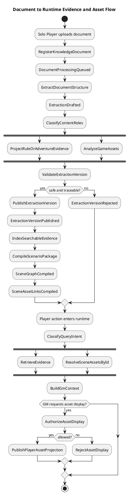
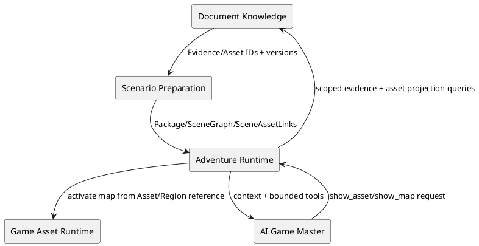
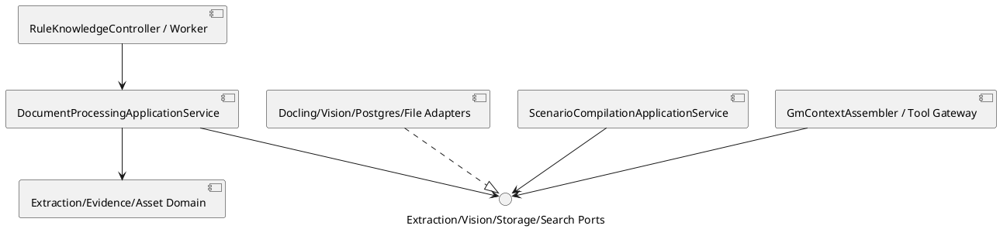

# Architecture Spec: GM Knowledge Base, Retrieval, and Game Assets

# 1. Design Scope

## 1.1 Target

| 항목 | 대상 |
|---|---|
| Product Spec | `docs/specs/product-spec.md` |
| Use Cases | UC-001~UC-009 |
| Domain | 문서 지식, 시나리오 의미 구조, 시각 자산, 런타임 근거 조립 |
| Bounded Contexts | Document Knowledge, Scenario Preparation, Adventure Runtime, Game Asset Runtime, AI Game Master |
| Existing Services | `rule-knowledge-service`, `adventure-service`, `combat-map-service`, `ai-game-master-service`, `web-ui` |
| External Dependencies | Docling extraction worker, vision model, OCR, PostgreSQL/pgvector, Ollama embedding, local file storage |
| Affected Data | Extraction Version, Source Span, Evidence Unit, semantic edge, Game Asset, Map Region, Scene Graph, Scene Asset Link, search index |

## 1.2 Product Spec Mapping

| Product Spec 항목 | Architecture 요소 |
|---|---|
| UC-001 | `DocumentProcessingJob`, `ExtractionVersion`, `DocumentExtractionPort` |
| UC-002 | `RuleEvidenceProjector`, `EvidenceHierarchy`, ancestor expansion |
| UC-003 | `AdventureEvidenceProjector`, `SceneGraph` |
| UC-004 | `GameAsset`, role-specific asset analyzers |
| UC-005 | `MapRegion`, `SceneAssetLink`, exact-ID lookup |
| UC-006 | separate `PlayerAssetProjection` and `GmMaterialEvidence` |
| UC-007 | `RetrievalEvidencePack`, normalized intent router, `AssetReferencePack` |
| UC-008 | `PlannerEvidencePack`, whole-adventure graph query |
| UC-009 | immutable extraction publication and per-document retry |
| BR-001, BR-015, BR-017 | immutable `ExtractionVersion` and source lineage |
| BR-007, BR-008, BR-021~BR-024 | visibility policy and fail-closed player projection |
| BR-011~BR-014 | exact version scope and Knowledge/Plan/State separation |

현재 코드 차이:

- preview에는 layout/asset 신호가 있으나 canonical extraction과 index는 text chunk 중심이다.
- `rulebook_vector_chunk`에는 visibility, evidence kind, parent, scene, asset link가 없다.
- runtime HTTP adapter가 일부 extraction version을 `1L`로 대체한다.
- story evidence는 GM/player visibility를 갖지 않는다.
- `MapDefinition`/`StoryMapBinding`과 Combat Map projection은 재사용 가능하지만 durable Game Asset, Map Region, Handout 모델은 없다.

---

# 2. Domain Flow

## 2.1 Event Storming Flow



## 2.2 Commands

| Command | Actor | Target | Input | Preconditions | Result |
|---|---|---|---|---|---|
| `RegisterKnowledgeDocument` | Solo Player | Knowledge Document | files, asserted type | owner, supported format | document/job queued |
| `ProcessDocument` | worker | Processing Job | document ID | claimable job | extraction draft/failure |
| `PublishExtractionVersion` | Document Knowledge | Extraction Version | validated projections | complete lineage, safe classification | immutable version |
| `CompileScenarioPackage` | Solo Player/system | Scenario Preparation | exact document versions | all published | graph and asset links |
| `RetrieveEvidence` | Adventure Runtime | Document Knowledge | scope, intent, scene, visibility | exact session versions | evidence pack |
| `ResolveSceneAssets` | Adventure Runtime | Scenario Package | package/scene ID | active binding | asset references |
| `ShowAsset` | AI GM via gateway | Adventure Runtime | asset ID/version | capability, link, visibility | player projection/refusal |
| `ShowMap` | AI GM via gateway | Adventure Runtime | map/region ID/version | capability, active scene, safety | map activation/refusal |

## 2.3 Domain Events

| Domain Event | Producer | Trigger | Payload | Consumers |
|---|---|---|---|---|
| `DocumentProcessingQueued` | Document Knowledge | registration | document/job/type | worker |
| `ExtractionVersionDrafted` | Processing Job | extraction complete | version/source spans/warnings | projectors |
| `ExtractionVersionPublished` | Extraction Version | validation success | document/version/hash | indexer, Scenario Preparation |
| `EvidenceIndexed` | indexer | searchable projections stored | version/index version | status projection |
| `SceneGraphCompiled` | Scenario Package | scenario compile | graph/package version | Planner, Runtime |
| `SceneAssetLinksCompiled` | Scenario Package | asset link validation | scene/asset/region/visibility | Runtime |
| `AssetDisplayAuthorized` | Adventure Runtime | valid tool request | session/scene/asset projection | player UI |
| `AssetDisplayRejected` | Adventure Runtime | invalid request | safe reason code | GM loop/audit |

## 2.4 Policies

| Policy | Trigger Event | Decision | Emitted Command | Owner |
|---|---|---|---|---|
| `ContentRoleClassificationPolicy` | extraction drafted | KNOWLEDGE/GAME_ASSET/GM_MATERIAL; multi-role allowed | project/analyze | Document Knowledge |
| `EvidenceProjectionPolicy` | role classified | typed evidence or raw fallback | persist evidence | Document Knowledge |
| `ExtractionPublicationPolicy` | projections ready | lineage complete and unsafe ambiguity absent | publish/reject | Document Knowledge |
| `RetrievalRoutingPolicy` | query received | RULE/STORY/MIXED/UNKNOWN weighting | typed searches | Document Knowledge |
| `AncestorExpansionPolicy` | leaf rule found | bounded parent context | load ancestors | Document Knowledge |
| `AssetDisplayPolicy` | show request | exact version, scene link, player visibility, safe projection | show/refuse | Adventure Runtime |
| `MapActivationPolicy` | show map/current scene | safe definition and region binding | create/activate runtime map | Adventure Runtime |

## 2.5 Read Models

| Read Model | Consumer | Source | Fields | Owner |
|---|---|---|---|---|
| `DocumentProcessingProjection` | Solo Player | job/version | status, warnings, failure, version | Document Knowledge |
| `RetrievalEvidencePack` | AI GM | evidence/index/hierarchy | typed evidence, ancestors, citations, confidence | Document Knowledge |
| `PlannerEvidencePack` | Adventure Planner | adventure graph/evidence | premise, scenes, actors, secrets, endings, rewards | Scenario Preparation |
| `PlayerAssetProjection` | Player UI | Game Asset + policy | safe URL/bytes, title, MIME, region | Document Knowledge/Runtime |
| `TacticalMapProjection` | Player UI | Combat Map | visible grid, tokens, fog, current region | Game Asset Runtime |

## 2.6 External Interactions

| External System | Trigger | Input | Output | Failure |
|---|---|---|---|---|
| Docling worker | process document | immutable source bytes | tree, layout, tables, images | timeout/malformed/unsupported |
| Vision model | analyze asset | extracted image + schema | role/description/regions/features | low confidence/malformed |
| OCR | image/scan extraction | page/asset image | text/bounds/confidence | empty/low confidence |
| Embedding provider | index/search | Evidence text | fixed-dimension vector | provider/dimension failure |
| PostgreSQL/pgvector | persist/search | metadata/vector/query | scoped candidates | conflict/unavailable |

## 2.7 Hotspots

| Hotspot | Options | Decision |
|---|---|---|
| asset ownership | Document Knowledge / Scenario / Combat Map | Document Knowledge owns immutable asset; Scenario owns links; Combat Map owns runtime |
| map access | vector lookup / direct link | direct Scene→Asset/Region; vector secondary |
| handout security | combined chunk / split projection | player asset and GM material split |
| extraction engine | replace domain with Docling / adapter | Docling behind `DocumentExtractionPort`; domain stays engine-neutral |
| semantic graph storage | external graph DB / relational adjacency | PostgreSQL node/edge tables first |
| vector schema | extend old chunks indefinitely / new evidence index | new Evidence index; compatibility adapter during migration |
| publication | mutate registration / immutable versions | append-only Extraction Version with current pointer |

---

# 3. DDD Architecture

## 3.1 Bounded Contexts

| Bounded Context | Responsibility | Ubiquitous Language | Owned Model | Owned Data |
|---|---|---|---|---|
| Document Knowledge | source, extraction, Evidence, Game Asset, indexing | Source Span, Evidence Unit, Game Asset | document/version/job/evidence/asset | source files and knowledge tables |
| Scenario Preparation | scenario meaning and compiled links | Scene Graph, Scene Asset Link | Scenario Package, Scene Graph | package graph/link versions |
| Adventure Runtime | scope/context/tool authorization | Evidence Pack, Asset Reference | session scope, tool request | runtime refs/audit |
| Game Asset Runtime | tactical map session state | Combat Map, Fog of War | CombatMap | runtime grid/tokens/visibility |
| AI Game Master | candidate decisions | show action, retrieval intent | stateless DTOs | no source/runtime truth |

## 3.2 Context Map



| Upstream | Downstream | Relationship | Contract | Translation |
|---|---|---|---|---|
| Document Knowledge | Scenario Preparation | Customer/Supplier | versioned evidence/asset API | IDs and versions |
| Scenario Preparation | Adventure Runtime | Published Language | Scenario Package | binding adapter |
| Document Knowledge | Adventure Runtime | Customer/Supplier | retrieval/player asset projection | runtime context adapter |
| Adventure Runtime | Game Asset Runtime | ACL | map activation/command | asset-region to prepared map |
| Adventure Runtime | AI Game Master | Customer/Supplier | typed context/tools | provider-neutral DTO |

## 3.3 Aggregates

| Aggregate | Root | Responsibility | Commands | Events | Invariants |
|---|---|---|---|---|---|
| Knowledge Document | `KnowledgeDocument` | source identity/type/current publication | register, queue processing | queued | owner/type/hash stable |
| Processing Job | `DocumentProcessingJob` | per-document retry and state | claim, fail, retry, complete | drafted/failed | one claim; independent batch failure |
| Extraction Version | `ExtractionVersion` | immutable source-derived snapshot | add projection, validate, publish | published/rejected | all items trace to Source Span; published immutable |
| Game Asset Catalog | `GameAssetCatalog` | assets within one extraction version | register asset/region/representation | asset classified | original retained; role/visibility explicit |
| Scenario Package | existing `ScenarioPackage` | scene graph and versioned links | compile graph/link | graph/links compiled | exact extraction versions; IDs resolve |
| Combat Map | existing `CombatMap` | runtime tactical state | activate/move/reveal | map changed | owner/version/visibility |

`EvidenceUnit`은 Extraction Version 내부 entity다. 검색 인덱스 row는 aggregate가 아니라 재생성 가능한 projection이다.

## 3.4 Entities

| Entity | Aggregate | Identity | Responsibility | State |
|---|---|---|---|---|
| `SourceSpan` | Extraction Version | span ID | exact text/visual location | page/bbox/order/char range |
| `EvidenceUnit` | Extraction Version | evidence ID | typed semantic evidence | kind/content/visibility/confidence/source IDs |
| `EvidenceEdge` | Extraction Version | edge ID | hierarchy/semantic relation | from/to/type/confidence/source |
| `GameAsset` | Game Asset Catalog | asset ID | original + representations | role/MIME/storage key/description/visibility |
| `MapRegion` | Game Asset Catalog | region ID | spatial subarea | geometry/scale/features/label |
| `SceneNode` | Scenario Package | scene ID | playable semantic scene | title/summary/source refs |
| `SceneTransition` | Scenario Package | transition ID | conditional graph edge | source/target/condition/confidence |
| `SceneAssetLink` | Scenario Package | link ID | scene→asset/region/use relation | usage/trigger/visibility/source refs |

## 3.5 Value Objects

| Value Object | Aggregate | Values | Validation | Behavior |
|---|---|---|---|---|
| `ExtractionVersionId` | all knowledge refs | document ID + version | positive, exact | stable reference |
| `ContentRole` | Extraction Version | KNOWLEDGE/GAME_ASSET/GM_MATERIAL | non-empty set | role predicates |
| `EvidenceKind` | Extraction Version | RULE/SCENE/NPC/ENCOUNTER/CHECK/SECRET/... | supported value | routing group |
| `EvidenceVisibility` | Extraction Version | PLAYER_VISIBLE/GM_ONLY/UNKNOWN | UNKNOWN fail-closed | canExpose |
| `AssetRole` | Asset Catalog | MAP/PLAYER_HANDOUT/ILLUSTRATION/PORTRAIT/PUZZLE | supported | display policy |
| `AssetGeometry` | Asset Catalog | normalized bbox/polygon | bounds and finite values | contains/intersects |
| `MapScale` | Asset Catalog | square size/unit | positive | distance conversion |
| `DocumentScope` | retrieval | owner + document/version pairs | published only | membership |
| `QueryIntent` | retrieval | RULE/STORY/MIXED/UNKNOWN | single shared enum | weights |

## 3.6 Domain Services

| Domain Service | Responsibility | Input | Output | Collaborators |
|---|---|---|---|---|
| `ExtractionPublicationPolicy` | validate lineage/classification | draft version | decision/errors | evidence/asset catalogs |
| `RuleEvidenceProjector` | create rule hierarchy | document tree | evidence/edges | Source Span |
| `AdventureEvidenceProjector` | create adventure semantics | document tree | evidence/scene candidates | Source Span |
| `GameAssetAnalysisService` | classify/analyze visual assets | extracted asset | asset/regions/warnings | vision/OCR ports |
| `HybridRetrievalService` | dense + lexical + metadata merge/rerank | scoped query | candidates | search ports |
| `AncestorExpansionPolicy` | bounded rule context expansion | leaf/budget | evidence tree slice | evidence repository |
| `AssetDisplayAuthorizationPolicy` | prevent asset/GM leakage | scene link, asset, runtime facts | authorization | Scenario Package |

## 3.7 Business Rule Ownership

| Business Rule | Owner | Enforcement Point |
|---|---|---|
| every projection traces to source | Extraction Version | `publish()` |
| published version immutable | Extraction Version | all mutators/repository append |
| unknown visibility never player-visible | `EvidenceVisibility` | `canExpose()` |
| direct scene link is asset lookup truth | Scenario Package | `resolveAssets(sceneId)` |
| handout solution excluded from player projection | Asset Display Policy | `authorize/project()` |
| search cannot mutate plan/state | Retrieval application boundary | read-only ports |
| exact session versions only | `DocumentScope` | constructor/search validation |

## 3.8 Aggregate State Transitions

| Current State | Command/Event | Next State | Owner | Preconditions | Emitted Event |
|---|---|---|---|---|---|
| none | register | QUEUED | Processing Job | source stored | queued |
| QUEUED | claim | PROCESSING | Processing Job | lease available | claimed |
| PROCESSING | extraction complete | DRAFT | Extraction Version | source hash matches | drafted |
| DRAFT | validate | VALIDATING | Extraction Version | projections complete | none |
| VALIDATING | publish | PUBLISHED | Extraction Version | no blocking errors | published |
| VALIDATING | reject | REJECTED | Extraction Version | blocking errors | rejected |
| FAILED | retry | QUEUED | new Processing Job attempt | retryable | queued |

## 3.9 Repository Boundaries

| Repository | Aggregate | Operations | Consistency Boundary |
|---|---|---|---|
| `KnowledgeDocumentRepository` | Knowledge Document | create/load/set current version | document transaction |
| `DocumentProcessingJobRepository` | Processing Job | queue/claim/complete/fail | leased job transaction |
| `ExtractionVersionRepository` | Extraction Version | create draft/load/publish | version transaction |
| `EvidenceUnitRepository` | version projection | append/query graph | extraction version |
| `GameAssetRepository` | Game Asset Catalog | append/load asset/regions | extraction version |
| `EvidenceSearchIndexRepository` | projection | replace version/search | index version |
| `ScenarioPackageRepository` | Scenario Package | existing save/load | package version |

---

# 4. Program Design

## 4.1 Program Structure



## 4.2 Major Components and Responsibilities

| Component | Responsibility | Input | Output | Dependencies | Must Not Do |
|---|---|---|---|---|---|
| `DocumentProcessingApplicationService` | job orchestration and publication | document/job | published version/status | extraction/projector/index ports | embed domain policy in adapter |
| `DoclingDocumentExtractionAdapter` | convert file to normalized tree/assets | immutable bytes | extracted document DTO | Docling worker | publish domain objects directly |
| `EvidenceProjectionApplicationService` | invoke type-specific projectors | normalized tree | evidence draft | domain projectors | mutate source |
| `GameAssetApplicationService` | persist originals and analyzed representations | extracted images | asset catalog | storage/vision/OCR | expose storage key |
| `RetrievalApplicationService` | validate scope, route, merge, expand | retrieval request | evidence pack | indices/repos | decide game outcome |
| `ScenarioKnowledgeCompilationService` | build graph and scene asset links | exact knowledge refs | package additions | knowledge query port | copy source truth |
| `GmContextAssembler` | combine evidence refs with runtime state | action/session | GM context | retrieval/scenario ports | merge authority models |
| `AssetToolApplicationService` | authorize show tool and project asset | capability/request | display event/refusal | package/asset/map ports | return GM material |

## 4.3 Application Flows

### Ingestion

1. Existing upload API stores source and queues one job per document.
2. Worker creates a new draft Extraction Version and calls `DocumentExtractionPort`.
3. Adapter maps Docling layout/tree/table/image output into engine-neutral DTOs with Source Span IDs.
4. Type-specific projectors create Evidence Units/edges; asset analyzer stores originals before vision enrichment.
5. Publication policy rejects blocking lineage/visibility/type ambiguity. Non-blocking uncertainty becomes warning/raw evidence fallback.
6. Published version commits before asynchronous dense/lexical index projection. Current document pointer changes only after index readiness.

### Runtime retrieval and asset display

1. Adventure Runtime builds exact `(documentId, extractionVersion)` scope from locked session/package.
2. One normalized intent is passed end-to-end. Hybrid retrieval applies type/scene/visibility filters before reranking.
3. Rule leaves expand ancestors within token budget. Story results remain typed and GM-only unless player projection explicitly requested.
4. Scenario Package resolves current Scene Asset Links by ID; no vector lookup required.
5. AI GM receives opaque Asset References. `show_asset`/`show_map` goes through capability tool gateway.
6. Asset policy verifies owner, package/version, current scene, trigger, visibility, safety. Player projection or structured refusal results.

## 4.4 Component Call Contracts

| Order | Caller | Callee | Operation | Input | Output | Failure |
|---:|---|---|---|---|---|---|
| 1 | pipeline worker | extraction port | `extract` | source ref/version | document tree | unsupported/provider fault |
| 2 | processing app | projectors | `project` | tree/source spans | evidence/edges | blocking ambiguity |
| 3 | processing app | asset service | `analyzeAndStore` | extracted asset | asset/regions | warning/blocking safety |
| 4 | processing app | version | `publish` | validation report | published ID | invariant violation |
| 5 | runtime | retrieval API | `retrieve` | scope/intent/scene/query | evidence pack | scope/insufficient evidence |
| 6 | runtime | scenario package | `resolveSceneAssets` | package/scene | asset refs | no/ambiguous link |
| 7 | GM tool gateway | asset tool app | `show` | capability/asset/region | projection/refusal | forbidden/stale/unsafe |
| 8 | asset tool app | Combat Map | `activate` | map asset/region ref | runtime map view | incompatible geometry |

## 4.5 Major Types

| Type | Kind | Responsibility | State | Dependencies |
|---|---|---|---|---|
| `ExtractedDocument` | DTO | engine-neutral layout tree | nodes/assets/warnings | none |
| `ExtractionVersion` | Aggregate | immutable publication | status/hash/items | none |
| `EvidenceUnit` | Entity | semantic searchable unit | kind/content/visibility/source | none |
| `GameAsset` | Entity | immutable original and representations | role/storage/metadata | none |
| `RetrievalRequest` | DTO | exact scoped query | versions/intent/scene/visibility/budget | none |
| `RetrievalEvidencePack` | DTO | typed grounded context | rule/story/entity groups | none |
| `AssetDisplayRequest` | Command DTO | bounded show action | asset/region/session/turn | capability |

## 4.6 Type Design

### `ExtractionVersion`

| 항목 | 정의 |
|---|---|
| Kind | Aggregate Root |
| Responsibility | source-derived knowledge snapshot publication |
| Dependencies | domain values only |
| Must Not Depend On | Docling, pgvector, Spring, storage adapter |

#### State

| Field | Type | Meaning | Constraint |
|---|---|---|---|
| `id` | `ExtractionVersionId` | exact version | immutable |
| `sourceHash` | `ContentHash` | source identity | document source match |
| `status` | enum | lifecycle | valid transition |
| `sourceSpanIds` | IDs | lineage set | non-empty |
| `warnings` | list | non-blocking uncertainty | immutable at publish |

#### Behavior

| Method | Input | Output | Responsibility | State Change |
|---|---|---|---|---|
| `beginValidation` | projection summary | validation request | freeze draft | DRAFT→VALIDATING |
| `publish` | validation report | event | enforce lineage/safety | VALIDATING→PUBLISHED |
| `reject` | blocking errors | event | record immutable rejection | VALIDATING→REJECTED |

### `GameAsset`

| 항목 | 정의 |
|---|---|
| Kind | Entity in Game Asset Catalog |
| Responsibility | retain original visual asset and safe derived representations |
| Dependencies | domain values only |
| Must Not Depend On | scene/runtime/combat state |

#### Behavior

| Method | Input | Output | Responsibility | State Change |
|---|---|---|---|---|
| `addRepresentation` | description/metadata/source | updated asset | attach traced derivation | draft only |
| `addRegion` | geometry/scale/features | region ID | validate spatial metadata | draft only |
| `playerProjection` | visibility decision | safe projection | omit storage and GM fields | none |

## 4.7 Interfaces and Function Signatures

```java
interface DocumentExtractionPort {
    ExtractedDocument extract(StoredDocument source, ExtractionVersionId version);
}

interface KnowledgeRetrievalPort {
    RetrievalEvidencePack retrieve(RetrievalRequest request);
}

interface GameAssetQueryPort {
    GameAssetView load(GameAssetRef ref);
    PlayerAssetProjection projectForPlayer(GameAssetRef ref, AssetDisplayGrant grant);
}

interface SceneAssetQueryPort {
    List<SceneAssetReference> resolve(ScenarioPackageVersion packageVersion, SceneId sceneId);
}
```

Contracts:

- retrieval requires owner and non-empty exact document/version scope;
- asset reads require opaque IDs, never paths;
- player projection requires authorization grant created for one session/turn/scene;
- all read operations are idempotent; display publication uses GM tool command ID.

## 4.8 Error Propagation

| Failure Point | Source Error | Converted Error | Handler | Result |
|---|---|---|---|---|
| extraction | Docling timeout/malformed | `DOCUMENT_EXTRACTION_FAILED` | job retry policy | document FAILED/retryable |
| projection | missing lineage | `EXTRACTION_LINEAGE_INVALID` | publication policy | version REJECTED |
| vision | low confidence | `ASSET_ANALYSIS_UNCERTAIN` | asset policy | warning, no auto display |
| retrieval | stale/wrong scope | `KNOWLEDGE_SCOPE_INVALID` | API boundary | fail closed |
| retrieval | no evidence | `EVIDENCE_INSUFFICIENT` | GM context | no unsupported claim |
| asset tool | unlinked/GM-only | `ASSET_DISPLAY_FORBIDDEN` | tool gateway | structured refusal/audit |
| map activation | bad region/grid | `MAP_ASSET_INCOMPATIBLE` | runtime | text play continues |

## 4.9 State Transition Implementation

| State Transition | Domain Owner | Method | Persistence Point | Published Event |
|---|---|---|---|---|
| QUEUED→PROCESSING | Processing Job | `claim` | job repository transaction | none |
| PROCESSING→DRAFT | Extraction Version | factory | version/source transaction | drafted |
| VALIDATING→PUBLISHED | Extraction Version | `publish` | version + current pointer transaction | published |
| FAILED→QUEUED | Processing Job | `retry` | new attempt transaction | queued |

## 4.10 Dependency Rules

### Allowed Dependencies

| Source | Target | Contract |
|---|---|---|
| `ui` | `app` | commands/queries |
| `app` | `domain` | aggregate/domain service |
| `app` | ports | extraction/storage/search/model interfaces |
| `infra` | ports/domain DTO | adapters |
| Scenario Preparation | Document Knowledge | versioned API only |
| Adventure Runtime | Scenario/Knowledge/Combat Map | published ports only |

### Forbidden Dependencies

| Source | Forbidden Target |
|---|---|
| domain | Docling/Spring/JDBC/pgvector/model SDK |
| Document Knowledge | Adventure Story Plan/runtime state |
| Combat Map | source document or GM Material ownership |
| AI Game Master | DB/file path/general HTTP |
| player projection | GM-only evidence/raw storage key/hidden region |
| vector index | aggregate truth ownership |

---

# 5. Codebase Impact

## 5.1 Package and File Seams

### `rule-knowledge-service`

- Add `domain/document/ExtractionVersion`, `DocumentProcessingJob`, `SourceSpan` extensions.
- Add `domain/evidence/EvidenceUnit`, `EvidenceEdge`, kinds and visibility.
- Add `domain/asset/GameAsset`, `MapRegion`, `AssetRole`, safe projection.
- Add `application/extraction/DocumentExtractionPort` and Docling adapter under `infrastructure/extraction/docling`.
- Replace rule/story-specific public search internals with `application/retrieval/RetrievalApplicationService`; keep current endpoints as compatibility adapters.
- Generalize `RulebookFileStorage` to an opaque document/asset blob port; retain local filesystem adapter initially.
- Add migrations for extraction versions, source spans, evidence nodes/edges, assets/regions/representations, evidence index.

### `adventure-service`

- Extend `ScenarioPackage` with stable `SceneNode`, `SceneTransition`, `SceneAssetLink` IDs.
- Evolve `MapDefinitionCompiler` from text-marker-only input to versioned Game Asset/Map Region refs; keep legacy marker adapter.
- Replace runtime `1L` extraction fallback in `CrossContextHttpRuntimeEvidenceSearchGateway` with exact version contract.
- Add normalized intent to runtime evidence request and typed `RetrievalEvidencePack` mapping.
- Add `show_asset`/`show_map` definitions to `OfficialGmToolRegistry` and `AssetToolApplicationService` behind existing capability gateway.
- Add planner evidence port to `AdventureStoryPlanApplicationService`.

### `combat-map-service`

- Add activation input carrying opaque `GameAssetRef`/`MapRegionRef`, package/scene authorization proof.
- Reuse `CombatMap`, `VisibilityPolicy`, `CombatMapViewService`; do not store source asset or GM material.

### `web-ui` and contracts

- Add player asset display event/schema and Handout viewer.
- Extend map activation contract with region identity but return only player-safe projection.
- Keep raw source preview endpoint preparation-only and owner-only.

## 5.2 Required Tests

- Domain: publication immutability, lineage, unknown visibility fail-closed, parent expansion budget, region geometry.
- Pipeline: independent retry, Docling mapping, original asset retention, vision/OCR warning downgrade.
- Persistence: exact extraction version, graph edges, asset/region round trip, old/new index coexistence.
- Retrieval: dense+lexical merge, intent routing, session scope, ancestor expansion, GM-only exclusion, insufficient evidence.
- Scenario: Scene Graph compile, scene↔region, Handout↔GM Material, ambiguous link rejection.
- Runtime: exact version propagation, capability authorization, `show_*` idempotency/refusal, no solution leakage.
- Combat Map/UI: safe activation and projection, region focus, text fallback.

## 5.3 Migration and Compatibility

1. Introduce immutable extraction/evidence/asset tables beside existing registration/vector tables.
2. Dual-write new processing results; old published documents remain searchable through compatibility adapter.
3. Backfill exact extraction version references; eliminate runtime `1L` fallback before new retrieval becomes authoritative.
4. Switch rule/story APIs to new retrieval projection behind unchanged external endpoints.
5. Enable Scene Graph and asset tools only for packages compiled from new published versions.
6. Retire flat chunk truth after replay/backfill validation; pgvector rows remain disposable projections.

No new deployable service initially. Boundaries remain packages/modules inside existing services. Docling is an external extraction adapter, replaceable through port.
