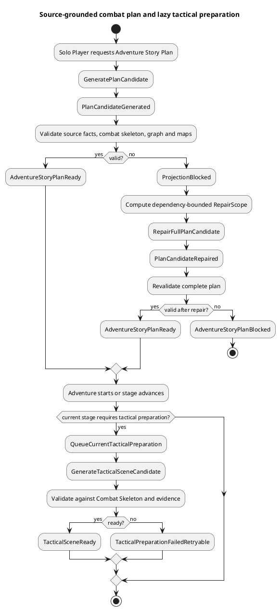
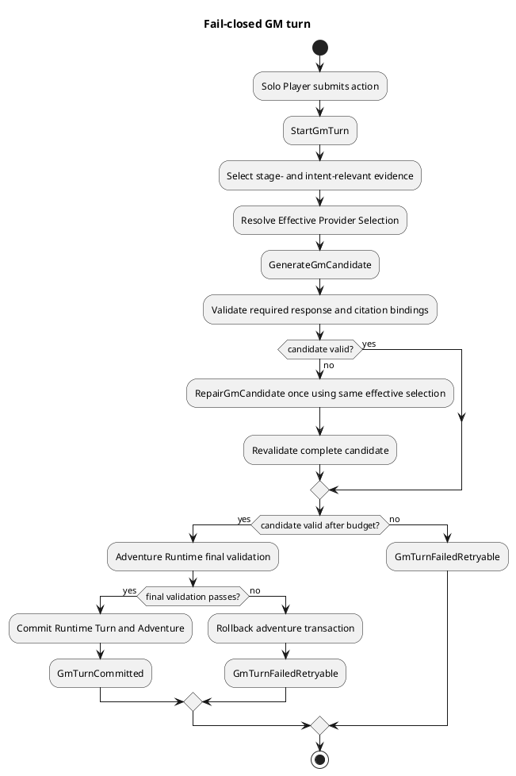
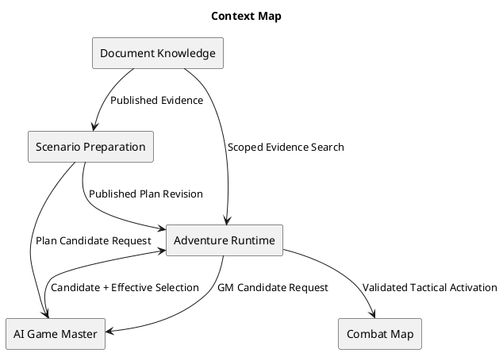
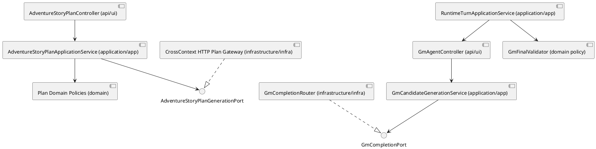

# Architecture Spec: 근거 기반 전투 계획과 실패 폐쇄형 GM 응답

# 1. Design Scope

## 1.1 Target

| 항목 | 대상 |
| --- | --- |
| Product Spec | `docs/specs/product-spec.md` |
| Use Cases | UC-COMBAT-001~002, UC-REPAIR-001, UC-GM-001~002, UC-PROVIDER-001, UC-QUALITY-001 |
| Domain | Adventure Story Planning, Tactical Preparation, Adventure Runtime, AI Game Master |
| Bounded Contexts | Scenario Preparation, Adventure Runtime, AI Game Master, Document Knowledge |
| Existing Services | `adventure-service`, `ai-game-master-service`, `rule-knowledge-service`, `combat-map-service` |
| Architecture Baseline | `/home/jiwoo/workspace/dnd-rag-product-plan`, branch `codex/rag-preprocessing-product-integration`, inspected at `263a28da` |
| Related ADRs | ADR-001 Source Span truth, ADR-002 document/scenario/AI boundaries, ADR-003 Runtime Command Saga, ADR-015 complete Adventure Story Plan, ADR-016 bounded generation handoff |
| Affected Data | Adventure Story Plan stage JSON, tactical preparation jobs, GM turn lifecycle, runtime turn provider metadata, quality evaluation results |
| External Dependencies | GM provider endpoints, Codex app-server, Ollama/OpenAI-compatible APIs, published RAG evidence |

이 설계는 기존 전처리와 RAG 발행 파이프라인을 변경하지 않는다. Document Knowledge가 공개한 immutable document/extraction/locator provenance를 소비하는 지점부터 계획과 런타임 품질 계약을 강화한다.

## 1.2 Product Spec Mapping

| Product Spec 항목 | Architecture 요소 |
| --- | --- |
| UC-COMBAT-001, BR-COMBAT-001~005 | `CombatRequirement`, `CombatSkeleton`, `SourceFactClaim`, `AdventureStoryPlanCombatValidator` |
| UC-COMBAT-002, BR-COMBAT-006~007 | `TacticalPreparationRequirement`과 기존 tactical preparation job/scene snapshot의 합성 상태 |
| UC-REPAIR-001, BR-REPAIR-001~003 | `ProjectionDependencyPolicy`, bounded `RepairScope`, full-candidate repair와 전체 재검증 |
| UC-GM-001, BR-GM-001~003 | strict GM candidate schema, `GmCitationBinding`, `GmFinalValidator`, bounded evidence selection |
| UC-GM-002, BR-GM-004~005 | one-repair `GmCandidateGenerationService`, `FAILED_RETRYABLE` GM turn lifecycle, transaction rollback |
| UC-PROVIDER-001, BR-PROVIDER-001~002 | `RequestedGmProviderSelection`, `EffectiveGmProviderSelection`, invocation-bound `GmCompletionResult` |
| UC-QUALITY-001, BR-QUALITY-001 | executable golden scenarios and computed relevance/fallback/provider metrics |

---

# 2. Domain Flow

## 2.1 Event Storming Flow

### Story Plan and Tactical Preparation



### Runtime GM Turn



## 2.2 Commands

| Command | Actor | Target | Input | Preconditions | Result |
| --- | --- | --- | --- | --- | --- |
| GenerateAdventureStoryPlan | Solo Player | AdventureStoryPlan | package revision, party revision, configuration, published evidence | draft session, complete party/package | READY or BLOCKED plan |
| RepairAdventureStoryPlanProjection | Projection repair policy | AdventureStoryPlan candidate | full candidate, structured blockers, repair scope, evidence registry | repairable blocker and remaining budget | repaired full candidate |
| PrepareCurrentTacticalScene | stage-entry policy | Tactical preparation job | current stage, Combat Skeleton, map, party, evidence | started adventure, tactical required | READY or FAILED_RETRYABLE |
| SubmitGmTurn | Solo Player/agent | GmTurn and Adventure | action, expected version, command id | started adventure, owner and turn valid | COMMITTED or FAILED_RETRYABLE |
| RepairGmCandidate | GM candidate policy | GM candidate attempt | rejected candidate, violations, bounded context | first attempt failed and repair unused | repaired candidate or retryable failure |
| EvaluateGmQualityJourney | development verifier | Quality Evaluation | fixed scenario, actions, expected evidence | fresh published evidence and ready plan | computed quality report |

## 2.3 Domain Events

| Domain Event | Producer | Trigger | Payload | Consumers |
| --- | --- | --- | --- | --- |
| PlanCandidateGenerated | AI Game Master candidate provider | first generation completes | operation id, candidate schema version | Scenario Preparation validators |
| ProjectionBlocked | AdventureStoryPlan validation | any blocking violation | violation codes, field paths, affected paths | repair policy, generation job |
| AdventureStoryPlanReady | AdventureStoryPlan aggregate | complete validation succeeds | plan id/version/package/party revisions | session start lock |
| CurrentStageEntered | AdventureStoryPlan progress | start or stage advancement | session id, stage position, plan version | tactical preparation policy |
| TacticalSceneReady | tactical preparation service | scene validation succeeds | session/stage/scene schema version | combat map activation |
| GmCandidateRejected | candidate validation | required/relevance/grounding failure | violation codes, attempt number | one-repair policy |
| GmTurnCommitted | GmTurn lifecycle | runtime transaction commits | turn id, adventure version, effective selection | conversation/read models/compaction |
| GmTurnFailedRetryable | GmTurn lifecycle | provider or validation budget fails | turn id, safe failure category | retry UI and metrics |

## 2.4 Policies

| Policy | Trigger Event | Decision | Emitted Command | Owner |
| --- | --- | --- | --- | --- |
| Combat completeness policy | PlanCandidateGenerated | combat clues require a complete Combat Skeleton | RepairAdventureStoryPlanProjection or reject | Scenario Preparation |
| Dependency repair policy | ProjectionBlocked | calculate same-stage dependent field closure without widening to unrelated stages | RepairAdventureStoryPlanProjection | Scenario Preparation |
| Tactical entry policy | CurrentStageEntered | queue preparation only when tactical requirement is REQUIRED | PrepareCurrentTacticalScene | Adventure Runtime |
| GM candidate repair policy | GmCandidateRejected | allow exactly one repair with same effective provider selection | RepairGmCandidate | AI Game Master |
| GM commit policy | validated GM candidate | commit only after runtime grounding, safety, command and relevance checks | Commit Runtime Turn | Adventure Runtime |

## 2.5 Read Models

| Read Model | Consumer | Source | Required fields | Owner |
| --- | --- | --- | --- | --- |
| GM Story Plan view | internal GM API | AdventureStoryPlan aggregate | Combat Requirement/Skeleton, blockers, tactical composed state, evidence keys | Scenario Preparation |
| Player Story Plan projection | Solo Player API | AdventureStoryPlan aggregate | current-stage-safe fields only; no hidden combat/ending data | Adventure Runtime API |
| Tactical Preparation view | map UI/runtime | stage intent + job + scene snapshot | NOT_REQUIRED, REQUIRED_PENDING, PREPARING, READY, FAILED_RETRYABLE | Adventure Runtime |
| GM Turn audit view | operator/quality evaluator | GmTurn and RuntimeTurn | requested/effective selection, attempts, violations, citations, commit/failure | Adventure Runtime |
| GM Quality report | release/development verifier | executed scenarios | action acknowledgement, fallback, citation, provider, latency metrics | Adventure Runtime |

## 2.6 External Interactions

| External System | Trigger | Input | Output | Failure |
| --- | --- | --- | --- | --- |
| Document Knowledge | plan/turn evidence selection | document ids, extraction versions, intent, current-stage scope | immutable published evidence | no evidence or provenance mismatch |
| GM Provider | plan or GM candidate generation | bounded prompt, schema, evidence, effective selection | raw candidate plus invocation metadata | timeout, protocol, malformed or empty response |
| Combat Map | tactical activation | validated TacticalScenePlan and map definition | active combat map id | version conflict or scene not ready |

## 2.7 Hotspots

| Hotspot | Options | Decision |
| --- | --- | --- |
| Complete plan vs future tactical coordinates | generate all coordinates early / lazy current stage | keep complete narrative/combat skeleton, lazy tactical coordinates |
| Tactical state location | overload TacticalScenePlanStatus / separate plan intent and job state | separate `TacticalPreparationRequirement`; compose with existing job/scene states |
| Provider identity | persist requested value / persist actual value / both | persist both, use effective value for quality and execution audit |
| Missing response data | semantic defaults / fail and repair once | no semantic defaults; one bounded repair then retryable failure |
| Citation relevance | evidence-pack membership only / field and claim binding | require exact membership plus claim binding and support validation |

---

# 3. DDD Architecture

## 3.1 Bounded Contexts

| Bounded Context | Responsibility | Ubiquitous Language | Owned Model | Owned Data |
| --- | --- | --- | --- | --- |
| Document Knowledge | publish immutable evidence and scoped retrieval | Knowledge Document, Extraction Version, Source Span | published evidence | document/chunk/vector provenance |
| Scenario Preparation | create and validate complete story/combat plans | Combat Skeleton, Source Fact, Projection Blocker, Repair Scope | AdventureStoryPlan | plan revisions and history |
| Adventure Runtime | current stage, tactical readiness and atomic GM turn | Tactical Preparation, GM Turn, Evidence Pack | Adventure, GmTurn, RuntimeTurn | adventure state, turns, preparation jobs |
| AI Game Master | resolve provider invocation and produce non-persistent candidates | Requested/Effective Selection, GM Candidate, Candidate Violation | candidate lifecycle within one request | no product aggregate data |
| Combat Map | activate and own map/token state | Combat Map, token, version | CombatMap | map runtime state |

## 3.2 Context Map



| Upstream | Downstream | Relationship | Contract | Translation |
| --- | --- | --- | --- | --- |
| Document Knowledge | Scenario Preparation | Customer/Supplier | published citation key and quote | evidence gateway ACL |
| Document Knowledge | Adventure Runtime | Customer/Supplier | scoped search result | RuntimeEvidence adapter |
| Scenario Preparation | Adventure Runtime | Published Language | immutable plan revision | runtime plan context |
| AI Game Master | Scenario Preparation | Supplier of untrusted candidates | plan candidate envelope | generation gateway ACL |
| AI Game Master | Adventure Runtime | Supplier of untrusted candidates | GM candidate envelope | GmAgentPort ACL |
| Adventure Runtime | Combat Map | Customer/Supplier | versioned map command | tactical map adapter |

## 3.3 Aggregates

| Aggregate | Root | Responsibility | Commands | Events | Invariants |
| --- | --- | --- | --- | --- | --- |
| Adventure Story Plan | `AdventureStoryPlan` | complete stage graph, combat readiness, immutable revisions | generate, repair, publish, advance/revise future | ProjectionBlocked, AdventureStoryPlanReady | READY requires graph, evidence, Combat Skeleton and tactical intent consistency |
| Adventure | `Adventure` | committed scene, conversation, version and stage effects | submit/commit runtime turn | GmTurnCommitted | only validated turn changes version/state |
| GM Turn Lifecycle | `GmTurn` | attempt identity, idempotency, requested/effective provider, terminal result | start, process, commit, failRetryable | GmTurnCommitted, GmTurnFailedRetryable | same command payload; terminal attempt cannot reopen |
| Tactical Preparation Job | job id | prepare exactly the current required stage | claim, complete, fail, retry | TacticalSceneReady, TacticalPreparationFailedRetryable | one current-stage job per session/stage |

## 3.4 Entities

| Entity | Aggregate | Identity | Responsibility | State |
| --- | --- | --- | --- | --- |
| AdventureStoryPlanStage | Adventure Story Plan | stage position within plan revision | own stage narrative, Combat Skeleton, evidence and tactical requirement | validated immutable stage snapshot |
| CombatParticipant | Adventure Story Plan | stable participant key within stage | enemy/boss role, source name, count range and evidence references | source-grounded |
| GmTurnAttempt | GM Turn Lifecycle | turn id/command id | track attempts and failure category | STARTED, PROCESSING, COMMITTED, FAILED_RETRYABLE |

## 3.5 Value Objects

| Value Object | Aggregate | Values | Validation | Behavior |
| --- | --- | --- | --- | --- |
| CombatRequirement | Adventure Story Plan | NONE, POSSIBLE, REQUIRED | REQUIRED implies complete skeleton | classify stage |
| CombatSkeleton | Adventure Story Plan | objective, trigger, participants, success, failure/fail-forward, rewards | required values nonblank; source facts bound | expose execution outline |
| SourceFactClaim | Adventure Story Plan | field path, normalized claim, citation keys | every key belongs to stage evidence | field-specific grounding |
| RepairScope | Adventure Story Plan | violation paths, dependency paths | same stage or explicit root graph scope only | authorize candidate diff |
| TacticalPreparationRequirement | Adventure Story Plan | NOT_REQUIRED, REQUIRED | mapped/spatial stage consistency | derive composed preparation state |
| RequestedGmProviderSelection | GM Turn | endpoint id optional for legacy, provider, model, reasoning | nonblank requested values | preserve user intent |
| EffectiveGmProviderSelection | GM Turn | endpoint id, endpoint version, provider, model, reasoning | exactly what adapter uses | audit actual invocation |
| GmCitationBinding | GM candidate | claim text, citation key | claim appears in narration/judgment; citation selected | bind response claim to evidence |
| GmCandidateViolation | GM candidate | code, field path, repairability, safe message | no hidden/raw evidence in logs | drive one repair |

## 3.6 Domain Services

| Domain Service | Responsibility | Input | Output | Collaborators |
| --- | --- | --- | --- | --- |
| AdventureStoryPlanCombatValidator | enforce combat and cross-field invariants | stages and stage evidence | structured blockers | source-claim support |
| ProjectionDependencyPolicy | calculate bounded dependent repair paths | blockers and full candidate | RepairScope | projection diff policy |
| GmResponseQualityPolicy | reject semantic defaults, stale-action responses and unsupported citations | action, context, candidate, evidence | candidate violations | evidence claim support |
| TacticalSceneCombatConsistencyPolicy | match tactical entities/outcomes to Combat Skeleton | stage and scene candidate | violations | tactical validator |

## 3.7 Business Rule Ownership

| Business Rule | Owner | Enforcement Point |
| --- | --- | --- |
| BR-COMBAT-001~004 | Adventure Story Plan aggregate/domain services | plan candidate validation before READY |
| BR-COMBAT-005 | TacticalSceneCombatConsistencyPolicy | tactical candidate validation |
| BR-COMBAT-006 | AdventureStoryPlanStage | tactical requirement plus absent snapshot compatibility |
| BR-COMBAT-007 | Adventure Runtime | preparation and map activation guard |
| BR-REPAIR-001~003 | ProjectionDependencyPolicy and repair diff guard | before accepting repaired candidate |
| BR-GM-001~003 | GmResponseQualityPolicy and GmFinalValidator | candidate and final validation |
| BR-GM-004~005 | GmTurn and RuntimeTurnApplicationService | transaction/failure recorder/idempotency |
| BR-PROVIDER-001~002 | provider selection resolver and GmTurn | invocation resolution and persistence |

## 3.8 Aggregate State Transitions

| Current State | Command/Event | Next State | Owner | Preconditions | Emitted Event |
| --- | --- | --- | --- | --- | --- |
| plan VALIDATING | validation success | READY | AdventureStoryPlan | all validators empty | AdventureStoryPlanReady |
| plan VALIDATING | blocker | BLOCKED | AdventureStoryPlan | any blocking violation | ProjectionBlocked |
| plan BLOCKED | repair candidate | VALIDATING | AdventureStoryPlan | bounded scope and budget | PlanCandidateRepaired |
| tactical REQUIRED_PENDING | prepare current stage | PREPARING | preparation job | current stage and started | preparation claimed |
| tactical PREPARING | valid scene | READY | preparation job/plan revision | scene consistency passes | TacticalSceneReady |
| GM STARTED | begin provider work | PROCESSING | GmTurn | same command fingerprint | none |
| GM PROCESSING | final commit | COMMITTED | GmTurn | adventure version exactly advances | GmTurnCommitted |
| GM PROCESSING | provider/validation failure | FAILED_RETRYABLE | GmTurn | adventure transaction unchanged | GmTurnFailedRetryable |

## 3.9 Repository Boundaries

| Repository | Aggregate | Operations | Consistency Boundary |
| --- | --- | --- | --- |
| AdventureStoryPlanRepository | Adventure Story Plan | save current/revision, history, find by session | one immutable plan revision |
| AdventureRepository | Adventure | load/save optimistic version | one runtime turn transaction |
| GmTurnRepository | GM Turn Lifecycle | start/process/terminal result by command id | one attempt lifecycle |
| RuntimeTurnRepository | committed RuntimeTurn | save pending/committed audit | adventure transaction |
| TacticalScenePreparationJobRepository | Tactical Preparation Job | create-or-get, claim, complete/fail/reset | session + stage position |

---

# 4. Program Design

## 4.1 Program Structure



기존 패키지명 `api/application/domain/infrastructure`를 각각 `ui/app/domain/infra` 역할로 유지한다. 이 기능을 위해 전 저장소 패키지명을 바꾸지 않는다.

## 4.2 Major Components and Responsibilities

| Component | Responsibility | Input | Output | Dependencies | Must Not Do |
| --- | --- | --- | --- | --- | --- |
| AdventureStoryPlanApplicationService | generation/repair budget and full validation orchestration | plan request | READY/BLOCKED plan | generation port, validators, repositories | source facts invent or partial validate |
| AdventureStoryPlanCombatValidator | combat and field-evidence invariants | full stage candidate | structured violations | SourceClaimSupport | call provider or persist |
| ProjectionDependencyPolicy | blocker dependency closure | violations | RepairScope | static dependency map | allow unrelated mutation |
| TacticalScenePreparationApplicationService | current-stage lazy preparation | current stage/party/map | preparation view | generator, validator, job repo | prepare future stages eagerly |
| GmCandidateGenerationService | effective selection, first attempt, one response repair | complete GM context | valid candidate envelope | completion port, response policy | mutate product state |
| GmCompletionRouter | execute exactly resolved endpoint/model | raw prompt and selection | completion with effective selection | endpoint registry/adapters | relabel result with request metadata |
| RuntimeEvidenceSelector | bound context by stage and intent | action/current stage/search results | EvidencePack max 8 | search port | include unrelated full candidate set |
| GmFinalValidator | authoritative pre-commit checks | candidate/context/evidence | validated RuntimePlan | claim support policy | add narration, judgment or citation |
| RuntimeTurnApplicationService | atomic runtime commit | submit command | committed turn | repositories/saga/planning | commit failed candidate |
| GmTurnFailureRecorder | persist failure outside rolled-back adventure transaction | attempt and safe category | FAILED_RETRYABLE audit | turn/event repositories | change adventure version |

## 4.3 Application Flow

### GM Turn Program Flow

1. `AdventureController` creates or resumes a `GmTurn` by command id and expected version.
2. `RuntimeTurnApplicationService` loads Adventure, Runtime Binding, current plan stage and Session Knowledge Set.
3. `RuntimeEvidenceSelector` builds at most eight evidence items: current-stage STORYBOOK first, RULEBOOK only for RULE/MIXED intent, and stage-linked resolution evidence.
4. `GmAgentPort` calls AI Game Master with Requested Provider Selection and bounded context.
5. `GmCandidateGenerationService` resolves one Effective Provider Selection and uses it for initial and optional repair attempts.
6. Parsing performs representation-only normalization; it never fills narration, judgment, citations, provider or model.
7. Candidate policy returns violations. One repair may use the rejected full candidate, violations and the same bounded evidence.
8. AI Game Master returns candidate plus requested/effective selection or a retryable structured failure.
9. `GmFinalValidator` rechecks exact evidence membership, claim bindings, current action acknowledgement, hidden data and read-only constraints.
10. Required tool commands complete through Runtime Command Saga before success narration is committed.
11. Adventure, RuntimeTurn and GmTurn COMMITTED state are persisted atomically. Any exception rolls back them and `GmTurnFailureRecorder` records FAILED_RETRYABLE separately.

## 4.4 Component Call Contracts

| Order | Caller | Callee | Operation | Input | Output | Failure |
| ---: | --- | --- | --- | --- | --- | --- |
| 1 | AdventureStoryPlanApplicationService | generation port | generate/repair | full request or RepairRequest | ProjectionCandidate | provider/contract failure |
| 2 | plan application | combat/source/graph validators | validate | complete stages + registries | structured violations | none; violations are data |
| 3 | plan application | dependency policy | scope | candidate + violations | RepairScope | system-contract violation |
| 4 | RuntimeTurnApplicationService | RuntimeEvidenceSelector | select | stage, intent, action | bounded EvidencePack | missing STORYBOOK |
| 5 | GmAgentPort adapter | AI GM API | generate candidate | complete context + requested selection | candidate envelope | retryable provider/candidate failure |
| 6 | GmCandidateGenerationService | GmCompletionPort | complete | prompt + resolved selection | raw completion + effective selection | timeout/protocol/malformed |
| 7 | RuntimeTurnApplicationService | GmFinalValidator | validate | candidate/evidence/context | RuntimePlan | final validation exception |
| 8 | RuntimeTurnApplicationService | repositories | commit | versioned result | committed version | optimistic conflict/rollback |

## 4.5 Major Types

| Type | Kind | Responsibility | State | Dependencies |
| --- | --- | --- | --- | --- |
| CombatSkeleton | Domain Value Object | source-grounded encounter outline | immutable | SourceFactClaim |
| RepairScope | Domain Value Object | authorize dependent projection changes | immutable paths | ProjectionViolation |
| GmCandidateEnvelope | DTO | candidate plus requested/effective selection and attempt count | immutable | internal API schema |
| GmCompletionResult | Port result | raw provider output plus actual selection | immutable | provider adapter |
| RuntimeEvidenceSelector | Application Service | bounded stage/intent context | stateless | search port |
| GmResponseQualityPolicy | Domain Service | candidate quality violations | stateless | SourceClaimSupport |

## 4.6 Type Design

### CombatSkeleton

| Field | Type | Meaning | Constraint |
| --- | --- | --- | --- |
| objective | String | combat purpose | nonblank when combat REQUIRED |
| startTrigger | String | operational start condition | nonblank; unsupported source nouns forbidden |
| participants | List<CombatParticipant> | enemies and bosses | at least one for REQUIRED |
| successOutcome | String | completion/follow-up | nonblank |
| failureOutcome | String | failure or fail-forward | nonblank |
| rewards | List<SourceFactClaim> | evidenced rewards | every item field-bound |

### EffectiveGmProviderSelection

| Field | Type | Meaning | Constraint |
| --- | --- | --- | --- |
| endpointId | UUID | actual endpoint | required for new invocations |
| endpointVersion | Instant or monotonic version | exact endpoint configuration | required |
| provider | String | adapter kind actually used | nonblank |
| model | String | model actually requested from adapter | nonblank |
| reasoning | String | actual reasoning option | nonblank/defaulted before invocation |

### GmCandidateEnvelope

| Field | Type | Meaning | Constraint |
| --- | --- | --- | --- |
| candidate | RuntimePlan candidate | player response proposal | all required fields nonblank |
| citationBindings | List<GmCitationBinding> | output claims to evidence | required when candidate makes source claims |
| requestedSelection | RequestedGmProviderSelection | user/session intent | unchanged |
| effectiveSelection | EffectiveGmProviderSelection | actual invocation | returned by router, never rewritten |
| attemptCount | int | provider attempts | 1 or 2 only |

## 4.7 Interfaces and Function Signatures

### GmCompletionPort

```java
interface GmCompletionPort {
    GmCompletionResult complete(
        String operationId,
        String prompt,
        RequestedGmProviderSelection requested,
        EffectiveGmProviderSelection resolved);
}
```

The provider-selection resolver runs before this call. The adapter must use `resolved` exactly and return the same effective selection with the raw response. It may not choose another active endpoint.

### GmAgentPort

```java
interface GmAgentPort {
    GmCandidateEnvelope plan(GmContextEnvelope context);
}
```

The remote AI Game Master owns the initial/one-repair provider loop. The Adventure Runtime remains the final authority and does not perform a second response repair after final validation.

### ProjectionDependencyPolicy

```java
interface ProjectionDependencyPolicy {
    RepairScope scope(
        String fullSerializedCandidate,
        List<AdventureStoryPlanProjectionViolation> violations);
}
```

The scope contains exact blocker paths plus a deterministic same-stage dependency closure. Root graph violations may authorize regeneration but never unrestricted repair.

## 4.8 Error Propagation

| Failure Point | Source Error | Converted Error | Handler | Result |
| --- | --- | --- | --- | --- |
| plan provider | timeout/protocol | provider generation unavailable | generation job | BLOCKED/failed job; no fallback plan |
| plan validation | structured blockers | ProjectionBlocked | repair budget policy | repair or BLOCKED plan |
| response provider | timeout/Codex RPC/Ollama error | GM_PROVIDER_UNAVAILABLE | candidate service/runtime API | FAILED_RETRYABLE |
| response parse | missing/invalid required field | GM_CANDIDATE_MALFORMED | one-repair policy | repair once then FAILED_RETRYABLE |
| response relevance | stale action/unsupported citation | GM_CANDIDATE_UNGROUNDED | one-repair policy | repair once then FAILED_RETRYABLE |
| final runtime validation | hidden data/state/citation mismatch | GM_FINAL_VALIDATION_FAILED | transaction rollback/failure recorder | FAILED_RETRYABLE |
| commit | optimistic version conflict | GM_TURN_CONFLICT | API exception handler | no retry under stale expected version |

## 4.9 State Transition Implementation

| State Transition | Domain Owner | Method | Persistence Point | Published Event |
| --- | --- | --- | --- | --- |
| plan VALIDATING → READY/BLOCKED | AdventureStoryPlan | ready/blocked factory or transition | AdventureStoryPlanRepository | ready/blocked |
| tactical pending → preparing → ready/failure | preparation job | claim/update/reset | TacticalScenePreparationJobRepository | TacticalSceneReady/failure |
| GM STARTED → PROCESSING → COMMITTED | GmTurn | process/commit | GmTurnRepository in runtime transaction | GmTurnCommitted |
| GM PROCESSING → FAILED_RETRYABLE | GmTurn | failRetryable | failure recorder transaction | GmTurnFailedRetryable |

## 4.10 Dependency Rules

### Allowed Dependencies

| Source | Target | Contract |
| --- | --- | --- |
| Adventure Runtime | Document Knowledge | scoped published evidence port |
| Scenario Preparation | AI Game Master | plan generation port |
| Adventure Runtime | AI Game Master | GM candidate port |
| AI Game Master application | provider infrastructure | GmCompletionPort |
| Adventure Runtime | Combat Map | versioned tactical command adapter |

### Forbidden Dependencies

| Source | Forbidden Target |
| --- | --- |
| AI Game Master | Adventure/plan/turn repositories |
| GmFinalValidator | provider adapters or repositories |
| story-plan domain validators | HTTP, DB or model clients |
| provider adapter | active endpoint re-resolution after invocation starts |
| response normalization | semantic fallback narration/judgment/citation |
| tactical preparation | eager future-stage coordinate generation |

---

# 5. Technical Architecture

## 5.1 Service and Module Mapping

| Bounded Context | Program Component | Service | Module | Runtime |
| --- | --- | --- | --- | --- |
| Scenario Preparation | plan generation/validation/repair | adventure-service | application/storyplan + domain/adventure | JVM |
| Adventure Runtime | turn/evidence/tactical lifecycle | adventure-service | application/runtime + domain/runtime | JVM |
| AI Game Master | candidate and provider invocation | ai-game-master-service | api/application/infrastructure/ai | JVM + external/local model |
| Document Knowledge | published evidence search | rule-knowledge-service | existing RAG search | JVM/PostgreSQL/pgvector |
| Combat Map | tactical activation | combat-map-service | existing map command/view | JVM/PostgreSQL |

## 5.2 Service and Module Boundaries

| Service / Module | Responsibility | Public Contract | Internal Components | Dependencies |
| --- | --- | --- | --- | --- |
| adventure storyplan | source-grounded full plan | existing plan APIs/internal generation port | combat/source/graph/repair policies | AI GM, repositories |
| adventure runtime | atomic turn and tactical entry | adventure/runtime APIs | evidence selector, final validator, sagas | Document Knowledge, AI GM, map |
| AI GM | untrusted candidate generation | internal agent-turn and plan endpoints | candidate service, selection resolver, router | configured providers |
| rule knowledge | immutable evidence | evidence search API | retrieval/reranking | published index |

## 5.3 System Interaction Flow

1. Adventure Runtime derives current stage and intent before evidence search.
2. Document Knowledge returns only session-scoped published evidence.
3. RuntimeEvidenceSelector caps the final handoff at eight items and preserves exact document/extraction/locator identity.
4. AI Game Master resolves the endpoint once and returns candidate plus effective selection.
5. Adventure Runtime performs final deterministic validation and commits or records failure.

## 5.4 Synchronous Communication

| Caller | Provider | Protocol | Operation | Request | Response | Timeout |
| --- | --- | --- | --- | --- | --- | --- |
| adventure-service | rule-knowledge-service | internal HTTP | scoped evidence search | session docs, versions, query, intent, stage keys | ranked evidence | existing configured timeout |
| adventure-service | ai-game-master-service | internal HTTP/token | GM candidate | context, max-8 evidence, requested selection | candidate envelope/effective selection | provider-aware configured timeout |
| ai-game-master-service | provider | HTTP or Codex JSON-RPC | completion | strict JSON prompt/schema | raw completion | endpoint configured timeout |
| adventure-service | combat-map-service | internal HTTP/token | tactical activation | map/scene/version command | combat map id | existing configured timeout |

## 5.5 API Contracts

### POST /internal/v2/gm/agent-turns

The v2 request extends the current contract with a stable requested endpoint reference and bounded evidence. The response uses an explicit candidate envelope:

```json
{
  "candidate": {
    "scene": "string",
    "npcState": "string",
    "judgment": "string",
    "narration": "string",
    "citedEvidence": [],
    "citationBindings": [],
    "stateDelta": [],
    "toolCalls": []
  },
  "requestedSelection": {
    "endpointId": "uuid-or-null-for-legacy",
    "provider": "string",
    "model": "string",
    "reasoning": "string"
  },
  "effectiveSelection": {
    "endpointId": "uuid",
    "endpointVersion": "timestamp-or-version",
    "provider": "string",
    "model": "string",
    "reasoning": "string"
  },
  "attemptCount": 1
}
```

| Condition | Status / Code | Response |
| --- | --- | --- |
| invalid internal token/action | 400/401/403 | existing safe API error |
| no resolvable endpoint | 409 GM_PROVIDER_SELECTION_UNRESOLVED | requested selection summary |
| provider unavailable | 503 GM_PROVIDER_UNAVAILABLE | retryable=true |
| first and repair candidates invalid | 422 GM_CANDIDATE_REJECTED | retryable=true, violation codes only |

The API never returns semantic defaults. It never logs raw rejected candidate text or full evidence.

The existing "/internal/v1/gm/agent-turns" contract remains available only during migration and keeps its flat response shape. Adventure Runtime switches atomically to v2 after contract tests pass. v1 must not be enhanced with the new acceptance semantics and is removed only after no caller references it; compatibility must never route a v2 failure through the old neutral-fallback behavior.

### Story Plan Projection Contract

The existing plan projection JSON adds `schemaVersion`, `combatRequirement`, `combatSkeleton`, `sourceFactClaims`, and `tacticalPreparationRequirement`. New schema candidates require these fields. Repair requests add a deterministic `repairScope` containing allowed and dependent JSON paths. The response remains a complete candidate, never a patch.

## 5.6 Asynchronous Communication

No broker is introduced. Existing durable generation and tactical preparation job repositories remain the asynchronous execution mechanism. Stage entry queues or creates exactly one tactical preparation job per session/stage.

## 5.7 Message Contracts

No new cross-service message bus contract is required. Internal session events add safe event types for `GM_TURN_FAILED_RETRYABLE` and tactical preparation lifecycle without carrying narration, hidden plan data or raw evidence.

## 5.8 Data Ownership

| Data | Owner | Storage | Key / Schema | Readers | Writers |
| --- | --- | --- | --- | --- | --- |
| Combat Skeleton and SourceFactClaims | Scenario Preparation | story-plan stage JSON/history | plan id + version + stage position | runtime/GM internal | plan application only |
| tactical requirement | Scenario Preparation | story-plan stage JSON | plan revision/stage | runtime/map activation | plan/revision services |
| tactical job/scene snapshot | Adventure Runtime | tactical job + plan scene snapshot | session/stage/job | runtime/map | tactical preparation |
| requested/effective selection | Adventure Runtime audit | gm_turn/runtime_turn | turn/command id | quality/operator | runtime commit/failure |
| provider endpoint definition | AI Game Master | agent endpoint store | endpoint id/version | selection resolver | backoffice |
| published evidence | Document Knowledge | existing extraction/vector tables | document/extraction/locator | plan/runtime | Document Knowledge only |

## 5.9 Schema Changes

| Target | Action | Schema Change | Migration | Compatibility |
| --- | --- | --- | --- | --- |
| story-plan stage JSON | modify additive versioned JSON | combat, source-claim and tactical requirement fields | next adventure Flyway/application schema version | legacy reader; new READY writes require new schema |
| gm_turn | add | requested/effective provider fields, endpoint id/version, retryable failure category, attempt count | next adventure Flyway migration | legacy providerMetadata remains readable |
| runtime_turn | add | effective invocation metadata and candidate attempt count | next adventure Flyway migration | old rows mapped to LEGACY_UNKNOWN |
| provider binding | add optional endpoint identity/version | bind new sessions to stable endpoint | next adventure Flyway migration | legacy rows resolve once and record mismatch |
| quality result storage/artifact | modify | computed relevance/fallback/provider metrics | test artifact or existing quality table | prefilled human score no longer gates |

Legacy unstarted plans without the new plan schema must regenerate before READY/start. Already-started immutable plan revisions remain readable through a compatibility adapter; they are not rewritten. New turn writes require effective selection, while historical rows expose `LEGACY_UNKNOWN`.

## 5.10 Consistency Model

| Operation | Consistency | Source of Truth | Synchronization | Recovery |
| --- | --- | --- | --- | --- |
| plan publication | strong per plan revision | validated AdventureStoryPlan | application transaction | BLOCKED revision/retry |
| tactical preparation | durable job, eventual scene readiness | job + validated scene snapshot | create-or-get/claim | FAILED_RETRYABLE |
| GM invocation identity | immutable per invocation | EffectiveGmProviderSelection returned by router | single resolver call | fail request; no reroute |
| GM turn commit | strong | Adventure and GmTurn expected versions | one application transaction | rollback + failure recorder |

## 5.11 Infrastructure Dependencies

| Dependency | Responsibility | Accessed By | Isolation Boundary |
| --- | --- | --- | --- |
| PostgreSQL | plans, jobs, turns, provider binding | repositories | repository adapters |
| pgvector/RAG HTTP | evidence retrieval | RuntimeEvidenceSearchPort | Document Knowledge ACL |
| Codex app-server | local Codex completion | Codex adapter | GmCompletionPort |
| Ollama/OpenAI-compatible | model completion | provider adapters | GmCompletionPort |

## 5.12 External Dependency Isolation

| External Dependency | Port | Adapter | Internal Model | Conversion Point |
| --- | --- | --- | --- | --- |
| provider endpoints | GmCompletionPort | GmCompletionRouter/provider adapters | GmCompletionResult | candidate generation service |
| RAG search | RuntimeEvidenceSearchPort | cross-context HTTP adapter | RuntimeEvidence | evidence selector |
| Combat Map | tactical map port | cross-context map gateway | tactical activation command | runtime application |

## 5.13 File and Module Structure

### Existing Structure

```text
adventure-service/
  api/
  application/storyplan/
  application/runtime/
  domain/adventure/
  domain/runtime/
  infrastructure/integration/
  infrastructure/persistence/
ai-game-master-service/
  api/
  application/endpoint/
  infrastructure/ai/
```

### Target Structure

```text
adventure-service/
  api/                                  # unchanged outward boundary
  application/storyplan/               # orchestration, projection scope
  application/runtime/                 # turn/tactical/evidence orchestration
  domain/adventure/                    # Combat Skeleton and plan invariants
  domain/runtime/                      # GM turn lifecycle and provider selections
  infrastructure/integration/          # AI/RAG/map ACLs
  infrastructure/persistence/          # additive compatibility mappings
ai-game-master-service/
  api/                                  # internal DTO boundary
  application/candidate/               # new generation/repair policy orchestration
  application/endpoint/                # endpoint definitions/resolution
  infrastructure/ai/                   # exact resolved-provider adapters
```

### File Change Map

| Path | Action | Type / Component | Responsibility |
| --- | --- | --- | --- |
| `adventure-service/.../domain/adventure/AdventureStoryPlanStage.java` | modify | entity snapshot | own Combat Skeleton and tactical requirement |
| `adventure-service/.../domain/adventure/Combat*.java` | add | value objects | combat requirement/skeleton/participant |
| `adventure-service/.../application/storyplan/AdventureStoryPlanStageSourceValidator.java` | modify | validator | field-specific selected evidence |
| `AdventureStoryPlanProjectionRepairPolicy.java` | modify | repair guard | accept deterministic RepairScope |
| `AdventureStoryPlanApplicationService.java` | modify | application service | combat validation and dependency repair loop |
| `TacticalScenePlanValidator.java` | modify | domain policy | Combat Skeleton consistency |
| `TacticalScenePreparationApplicationService.java` | modify | application service | composed required-pending/current state |
| `RuntimeEvidenceSearchRequest.java` and selector seam | modify/add | runtime context | stage/intent scope and max-eight handoff |
| `GmAgentRuntimePlanningAdapter.java` | modify | ACL/application adapter | remove auto citation and consume candidate envelope |
| `GmFinalValidator.java` | modify | final policy | action/citation claim relevance |
| `domain/runtime/GmTurn.java` | modify | aggregate | retryable failure and typed provider metadata |
| `RuntimeTurnApplicationService.java` | modify | transaction owner | strict candidate commit |
| `ai-game-master-service/.../api/GmAgentController.java` | modify | internal API | no semantic defaults; envelope response |
| `ai-game-master-service/.../application/candidate/*` | add | application/policy | one bounded response repair |
| `GmCompletionRouter.java` | modify | infrastructure router | execute one resolved selection and return actual metadata |
| relevant Postgres repositories/migrations | modify/add | persistence | additive schema and compatibility |
| existing storyplan/runtime/provider tests | modify/add | verification | new invariants and negative paths |

---

# 6. Runtime Design

## 6.1 Runtime Flow

Duplicate command detection occurs before provider invocation. Provider selection and evidence selection are immutable for one GM turn attempt. Initial and repair calls reuse the same Effective Provider Selection and Evidence Pack. No fallback endpoint or model is chosen inside an attempt.

On success, RuntimeTurn, Adventure progress and GmTurn COMMITTED state share the application transaction. On failure, the transaction rolls back and a separate failure transaction stores only the safe failure category and invocation metadata.

## 6.2 Concurrent Access

| Shared Resource | Concurrent Actors | Conflict |
| --- | --- | --- |
| Adventure version | player/agent turns | lost update or duplicate turn |
| plan generation/revision | generation jobs/runtime revision | stale package/party or overwrite |
| tactical job | repeated prepare/retry/map activation | duplicate provider work |
| provider endpoint | backoffice update/current turn | execution metadata drift |

## 6.3 Concurrency Control

| Target | Control Unit | Strategy | Owner | Timeout |
| --- | --- | --- | --- | --- |
| Adventure | adventure id/version | optimistic expected version | RuntimeTurnApplicationService | transaction timeout |
| plan revision | session + package/party revision | immutable version and repository check | plan application | generation job timeout |
| tactical preparation | session + stage | create-or-get plus claim | job repository | provider timeout |
| provider invocation | turn attempt | immutable Effective Selection snapshot | candidate service | provider timeout |

## 6.4 Ordering

| Operation | Ordering Scope | Ordering Key | Enforcement |
| --- | --- | --- | --- |
| GM turns | Adventure | expected adventure version/command id | transaction and fingerprint |
| stage progression | plan revision | current stage cursor | commit after validated turn |
| tactical preparation | session/stage | stage position | only current stage may claim |
| response attempts | GM turn | attempt number | max 2, sequential, same selection |

## 6.5 Transaction Boundaries

| Transaction | Owner | Operations | Commit Condition | Rollback Condition |
| --- | --- | --- | --- | --- |
| story plan save | AdventureStoryPlanApplicationService | validate and save READY/BLOCKED revision | complete validation outcome | repository conflict |
| runtime turn | RuntimeTurnApplicationService | tool outcomes, plan progress, adventure, runtime turn, GM commit | final validation and versions pass | any provider/final/command/persistence failure |
| failure audit | GmTurnFailureRecorder | failed turn and safe session event | runtime transaction already rolled back | audit persistence failure |

## 6.6 Idempotency

| Operation | Idempotency Key | Detection Point | Duplicate Result |
| --- | --- | --- | --- |
| plan generation job | operation/job id | generation job repository | current job/result |
| GM turn | command id + input fingerprint | GmTurnRepository | existing committed/failure result |
| runtime command | command id | Runtime Command Journal | existing outcome |
| tactical preparation | session id + stage position | job repository | current job/view |

## 6.7 Partial Failure

| Failure Situation | Persisted State | External State | Recovery |
| --- | --- | --- | --- |
| initial GM candidate invalid | none yet | one provider response | one repair same selection |
| repair invalid | FAILED_RETRYABLE audit only | two provider responses | user retry with new attempt |
| tool command partially applied | saga journal | owning service may have applied result | resume/query saga; do not commit narration early |
| tactical generation fails | FAILED_RETRYABLE job | no active map | explicit retry |
| provider endpoint changes mid-turn | original Effective Selection retained | active registry may differ | next turn sees new version |

---

# 7. Error Handling and Recovery

## 7.1 Error Classification

| Error | Category | Retryable | Handler | Caller Result |
| --- | --- | --- | --- | --- |
| ProjectionBlocker repairable | Validation | yes within budget | plan repair policy | retry/READY/BLOCKED |
| insufficient source fact | Domain evidence | no automatic invention | plan application | BLOCKED |
| provider timeout/protocol | Infrastructure | yes | candidate service/runtime | FAILED_RETRYABLE |
| malformed/missing GM fields | Validation | one repair | candidate service | candidate or FAILED_RETRYABLE |
| unsupported/irrelevant citation | Domain validation | one repair before final | candidate policy | candidate or FAILED_RETRYABLE |
| final hidden/state violation | Security/domain | no in-attempt retry | final validator | FAILED_RETRYABLE |
| stale expected version | Conflict | retry with refreshed state | API | conflict, no provider replay |

## 7.2 Retry Policy

| Operation | Retry Condition | Max Attempts | Backoff | Exhausted Result |
| --- | --- | ---: | --- | --- |
| story-plan bounded repair | all blockers repairable and progress changes | existing budget: 2 repairs | none between model calls | regeneration once or BLOCKED |
| story-plan regeneration | regeneration-required | 1 | none | BLOCKED |
| GM response repair | candidate contract/quality violation | 1 repair after initial | none | FAILED_RETRYABLE |
| tactical preparation | candidate/temporary provider failure | existing 3 per job execution | existing job behavior | FAILED_RETRYABLE |
| user GM retry | explicit new attempt after retryable failure | user controlled | none | new idempotent command |

## 7.3 Compensation and Recovery

- GM provider responses do not mutate product state, so failed candidates require no compensation.
- Runtime Command Saga remains the compensation/recovery authority for external tool commands.
- GmTurn failure audit is written only after Adventure transaction rollback.
- Tactical preparation failure preserves the previous immutable plan and map state.
- Legacy plan/provider rows are read through compatibility adapters; no destructive rewrite is performed.

## 7.4 Rollback

| Target | Rollback Strategy | Data Handling | Compatibility |
| --- | --- | --- | --- |
| new plan schema | disable new generation path; retain versioned reader | existing revisions immutable | v1 reader retained |
| strict GM response | feature-toggle candidate service only during rollout, never restore auto-citation as accepted quality | failures remain auditable | legacy committed turns readable |
| provider metadata schema | stop new writes after migration rollback decision | preserve additive columns | legacy metadata retained |

---

# 8. Security

## 8.1 Authentication and Authorization

| Entry Point | Authentication | Authorization | Failure |
| --- | --- | --- | --- |
| player plan/turn API | existing authenticated player | session/adventure owner | existing 401/403 |
| internal AI GM API | INTERNAL_SERVICE_TOKEN | internal caller only | 401/403 |
| endpoint backoffice | existing admin policy | configured admin player | 403 |
| tactical activation/retry | authenticated owner/internal token where existing | current stage and owner | 403/409 |

## 8.2 Input Validation

| Input | Validation | Sanitization | Size Limit |
| --- | --- | --- | --- |
| full plan candidate | schema version, stage count, JSON paths | structured safe blocker messages | existing generation limits |
| GM action/context | nonblank, ownership, versions | no secrets in error/log | existing request limits |
| rejected candidate | internal only, exact attempt association | never logged; safe hash/violations only | provider prompt budget |
| citation bindings | exact evidence key and claim presence | normalize text for support check | max bounded evidence count |

## 8.3 Sensitive Data

Hidden plan stages, secrets, full evidence quotes and rejected provider text are never included in player APIs, metrics or ordinary logs. Logs use IDs, versions, counts, safe violation codes and hashes.

## 8.4 Secrets

Provider secret environment-variable references remain endpoint-owned. Requested/Effective selections persist endpoint identity and model metadata, never API keys or secret values.

---

# 9. Observability

## 9.1 Logs

| Component | Event | Level | Context |
| --- | --- | --- | --- |
| plan application | candidate accepted/rejected/repaired | INFO/WARN | operation, attempt, violation codes, plan schema |
| provider resolver/router | invocation resolved/completed/failed | INFO/ERROR | turn, requested/effective endpoint/model, endpoint version, duration |
| candidate service | repair attempted/exhausted | WARN | turn, attempt, violation codes; no raw text |
| runtime final validator | final rejection | WARN | turn, safe code, evidence counts |
| tactical preparation | required/ready/failure | INFO/WARN | session, stage, job, attempts |

## 9.2 Metrics

| Metric | Type | Labels | Trigger Point |
| --- | --- | --- | --- |
| story_plan_combat_validation_failures | Counter | code, field family | plan validator |
| story_plan_projection_repairs | Counter | outcome, attempt | repair loop |
| gm_candidate_attempts | Counter | effective provider/model, outcome | candidate service |
| gm_neutral_fallback_total | Counter | field | must remain zero on new path |
| gm_action_acknowledgement_ratio | Gauge/report | effective provider/model | quality evaluator |
| gm_citation_identity_ratio | Gauge/report | document type | final validator/evaluator |
| gm_citation_support_ratio | Gauge/report | document type | claim support policy |
| gm_provider_selection_mismatch | Counter | requested/effective provider/model | resolver |
| gm_turn_failed_retryable | Counter | safe category | failure recorder |
| gm_turn_latency | Histogram | effective provider/model, attempt count | runtime turn |

## 9.3 Tracing

Trace chain: player turn → evidence search → effective provider resolution → initial completion → optional repair → final validation → command saga → runtime commit/failure. Required attributes are session/turn/command IDs, plan/stage version, evidence counts and requested/effective selection.

## 9.4 Alerts

| Alert | Condition | Severity | Action |
| --- | --- | --- | --- |
| neutral fallback nonzero | any accepted new-path turn | Critical | block rollout and inspect normalization |
| provider mismatch spike | mismatch above configured threshold | Warning | inspect binding/endpoint versions |
| citation support drop | golden/live sampled ratio below gate | Critical | disable affected provider configuration |
| retryable failure spike | provider/model baseline exceeded | Warning | provider health and prompt budget review |

---

# 10. Change Boundaries

## 10.1 Allowed Changes

| Target | Allowed Change |
| --- | --- |
| story-plan domain/application/internal AI contract | Combat Skeleton, source claims, repair scope and schema compatibility |
| runtime GM candidate/evidence/finalization flow | strict candidate and failure lifecycle |
| provider routing/binding metadata | requested/effective selection and endpoint version |
| tactical preparation read model/guards | required-pending distinction and skeleton consistency |
| persistence and tests | additive migrations, compatibility readers, quality artifacts |

## 10.2 Forbidden Changes

| Target | Forbidden Change |
| --- | --- |
| Document Knowledge publication | bypass published Extraction Version or change preprocessing ownership |
| future tactical stages | eager coordinates, fog or token placement for every future stage |
| AI Game Master | direct Adventure/plan/map/character persistence |
| GM response normalization | accepted neutral narration, judgment or auto citation |
| player APIs | hidden plan, blockers, endings or secrets exposure |
| provider selection | silent reroute or metadata relabeling |

## 10.3 Conditional Changes

| Target | Condition | Required Decision |
| --- | --- | --- |
| legacy active sessions | new schema cannot be inferred safely | retain compatibility path; never rewrite immutable plan |
| evidence relevance algorithm | existing SourceClaimSupport proves insufficient on golden Korean paraphrases | introduce a separately evaluated EvidenceClaimSupportPort without changing ownership |
| UI retry display | product needs a new player-visible state | expose safe FAILED_RETRYABLE only, no provider/raw details |

---

# 11. Verification Requirements

## 11.1 Domain Verification

| Target | Verification |
| --- | --- |
| required combat stage completeness | unit tests reject empty participants, objective, success or failure outcome |
| field-specific source facts | unrelated stage/general rulebook evidence cannot support enemy/boss/reward |
| dependency repair scope | related same-stage fields allowed; unrelated stage mutation rejected |
| tactical requirement composition | NOT_REQUIRED, REQUIRED_PENDING, PREPARING, READY, FAILED_RETRYABLE cases |
| GM turn lifecycle | failed attempt cannot commit or reopen under same command |

## 11.2 Program Verification

| Target | Verification |
| --- | --- |
| plan application repair loop | full candidate and complete validation after every repair |
| candidate generation | same Effective Selection and evidence for attempt 1 and repair |
| strict parsing | missing narration/judgment/citation produces violation, never semantic default |
| final validator | exact evidence membership and claim support required |
| runtime transaction | final/provider failure leaves adventure version, conversation and stage unchanged |

## 11.3 Technical Contract Verification

| Contract | Test Level | Verification |
| --- | --- | --- |
| story-plan projection v2 | JSON contract | required combat/source/tactical fields and legacy reader |
| internal GM candidate v2 envelope | cross-service contract | requested/effective metadata, flat-v1 isolation and structured retryable errors |
| provider adapters | integration contract | actual model equals Effective Selection; Codex/Ollama protocol fixtures |
| persistence | integration | additive columns, legacy rows, exact turn metadata |
| RAG evidence | cross-service integration | document/extraction/locator preserved and max-eight handoff |

## 11.4 Runtime Verification

| Condition | Execution Model | Expected Result |
| --- | --- | --- |
| endpoint changes during turn | initial call, config update, repair | repair uses original Effective Selection; next turn uses new version |
| duplicate command | same command id and payload | existing committed/failure result; no second provider call |
| final validator fails after provider repair | transactional turn | FAILED_RETRYABLE audit only; no adventure mutation |
| current mapped combat stage entered | stage advance/start | preparation job queued; activation waits for READY |

## 11.5 Recovery Verification

| Failure | Injection Method | Expected Recovery |
| --- | --- | --- |
| provider empty object | adapter fixture | one repair then success/failure; no neutral text |
| invalid citation | out-of-pack or unsupported binding fixture | rejection and unchanged adventure |
| Codex protocol incompatibility | RPC error fixture such as missing required name | safe provider failure, process reset as adapter policy, no turn commit |
| tactical generation failure | generator exception/invalid scene | FAILED_RETRYABLE job and explicit retry |

## 11.6 Golden Journey

The mandatory development E2E starts from a DB-only RAG reset, republishes the shared RULEBOOK and Potent Brew STORYBOOK through the new preprocessing publication pipeline, compiles a new Scenario Package, generates a new plan, starts the adventure and submits five distinct questions/actions.

The journey passes only when:

- rat and final-spider combat stages contain source-grounded participants and explicit success/fail-forward outcomes;
- mapped future combat stages are REQUIRED_PENDING rather than indistinguishable ABSENT;
- no stage-specific fact is grounded only by a generic rulebook chapter;
- all five responses acknowledge the latest action in natural Korean;
- no accepted response contains omitted-narration, omitted-judgment or auto-citation warnings;
- every citation exactly matches a published chunk and supports the bound output claim;
- requested/effective provider data and actual adapter invocation agree;
- a forced provider failure does not increment the adventure version or append conversation.

## 11.7 Agent Verifier Criteria

### Domain

- [ ] Combat Skeleton and Source Fact invariants enforced
- [ ] tactical intent separated from lazy scene snapshot
- [ ] dependency repair scope bounded and fully revalidated
- [ ] GM failure lifecycle atomic

### Program Design

- [ ] no semantic fallback in parser/normalizer
- [ ] one response repair only
- [ ] final validator remains authoritative
- [ ] application service owns transactions

### Technical Architecture

- [ ] requested/effective selection persisted separately
- [ ] additive migration and legacy compatibility verified
- [ ] RAG publication/provenance boundary unchanged
- [ ] hidden plan data absent from player APIs/logs

### Evidence

- 실행 명령: implementation ticket에서 WSL Gradle, contract, persistence and Playwright commands 기록
- 테스트 결과: spec 단계에서는 미실행; 구현 검증에서 첨부
- 변경 파일: 이 Architecture Spec의 File Change Map과 실제 diff 비교
- Architecture 위반: 금지 의존성과 fallback 검색
- Contract 위반: projection v2/GM envelope fixture 비교
- 미검증 항목: 실제 provider별 latency와 Korean claim-support threshold
- Human Review 항목: 5-turn narration naturalness and non-leading choices

---

# 12. Alternatives and Trade-offs

| Decision | Option | Advantages | Disadvantages | Result |
| --- | --- | --- | --- | --- |
| combat plan detail | prose only | simple compatibility | execution fields remain empty | Reject |
| combat plan detail | full future tactical scene | immediately activatable | stale future state, high generation failure | Reject |
| combat plan detail | Combat Skeleton + lazy tactical scene | executable intent and adaptable placement | composed state required | Adopt |
| repair authorization | exact blocker paths only | strict diff | cannot repair dependent inconsistency | Reject |
| repair authorization | unrestricted full rewrite | high repair success | unrelated regression and source drift | Reject |
| repair authorization | deterministic dependency closure | coupled repair with bounded scope | dependency map maintenance | Adopt |
| missing GM fields | neutral fallback/auto citation | fewer visible errors | masks provider failure and fabricates grounding | Reject |
| missing GM fields | one strict repair then retryable failure | truthful and recoverable | more visible failures | Adopt |
| provider metadata | requested only | simple | cannot audit actual model | Reject |
| provider metadata | requested + effective immutable selection | auditable and testable | additive contract/storage | Adopt |
| citation validation | pack membership only | cheap | irrelevant citation passes | Reject |
| citation validation | claim binding + support | specific quality proof | provider schema and evaluator complexity | Adopt |

---

# 13. Risks and Open Questions

## 13.1 Risks

| Risk | Impact | Probability | Mitigation |
| --- | --- | --- | --- |
| existing Korean SourceClaimSupport rejects valid paraphrases | High | Medium | golden cases first; isolate EvidenceClaimSupportPort before changing threshold |
| plan JSON additions break legacy revisions | High | Medium | schema version, compatibility reader, no immutable rewrite |
| stricter GM contract increases visible failures | Medium | High | one bounded repair, clear retry UI, provider-specific fixtures |
| endpoint changes race with a turn | High | Medium | immutable Effective Selection snapshot per attempt |
| evidence cap omits necessary multi-hop context | Medium | Medium | max-eight policy with stage-linked required items and measured abstention |
| tactical requirement duplicates job status | Medium | Medium | treat plan requirement as intent and job/scene as execution; one composed read model |
| quality evaluator becomes another model judge | High | Low | compute deterministic metrics; human review remains explicit and separate |

## 13.2 Open Questions

| Question | Blocking | Resolution |
| --- | --- | --- |
| Is a new ADR required? | No | No new ADR: the design refines ADR-002, ADR-003 and ADR-015 without reversing them. |
| Should future tactical coordinates be generated with the plan? | No | Rejected; only Combat Skeleton and requirement are precomputed. |
| May a second provider/model be used when repair fails? | No | Rejected within the same attempt; return FAILED_RETRYABLE. |
| What is the default evidence budget? | No | Eight total items, with current-stage STORYBOOK priority and intent-conditional RULEBOOK. Measure before changing. |
| How are legacy provider rows displayed? | No | `LEGACY_UNKNOWN`; never infer and present an unverified effective model. |

There are no unresolved blocking architecture decisions. The next workflow step is `to-ticket`; it must split provider identity, strict GM candidate lifecycle, combat-plan schema/validation, dependency repair, tactical composition, and golden E2E into dependency-safe vertical slices before any implementation.
