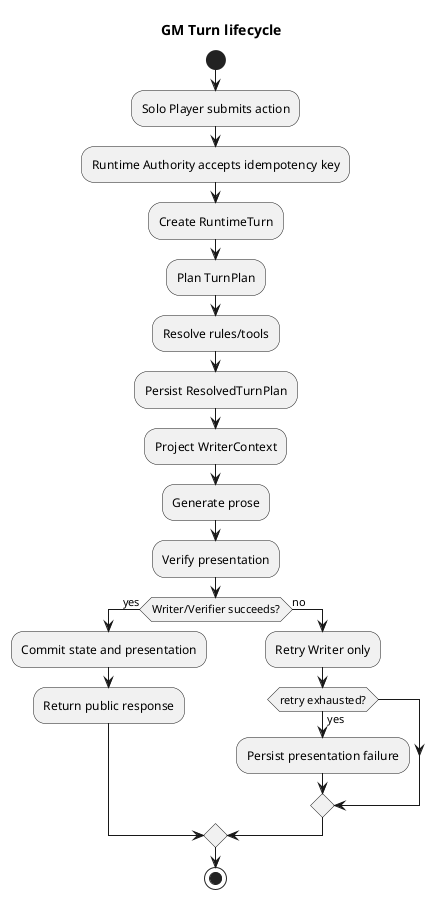
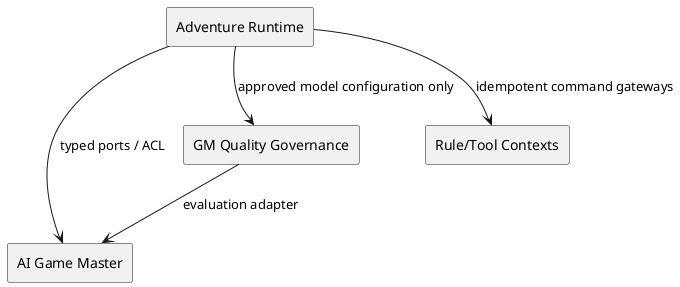
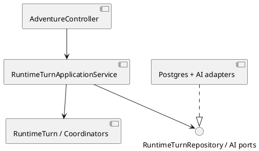
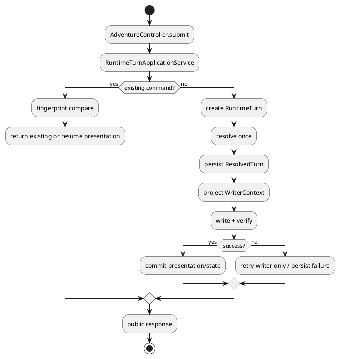

# Architecture Spec

# 1. Design Scope

## 1.1 Target

| 항목 | 대상 |
|---|---|
| Product Spec | `docs/specs/product-spec.md` |
| Use Cases | UC-218-1/2, UC-219-1, UC-220-1/2, UC-210-1, UC-211-1 |
| Domain | GM Turn lifecycle, bounded presentation, prompt/model evaluation governance |
| Bounded Contexts | Adventure Runtime, AI Game Master, GM Quality Governance |
| Existing Services | `adventure-service`, `ai-game-master-service`, `system-tests` |
| External Dependencies | rule/tool gateways, AI providers, PostgreSQL, Eval datasets |
| Affected Data | RuntimeTurn, TurnPlan/ResolvedTurnPlan, writer artifacts, diagnostics, prompt/model registry, eval runs |

## 1.2 Product Spec Mapping

| Product Spec | Architecture |
|---|---|
| Resolved Turn 저장 | `RuntimeTurn` aggregate + `ResolvedTurnRepository` |
| Writer isolation | `WriterContext` + `TurnWriterPort` |
| bounded retry | `PresentationCoordinator` + lifecycle transition |
| legacy replay | `LegacyTurnProjection` + compatibility adapter |
| diagnostics | authenticated read-only `RuntimeTurnDiagnosticsController` |
| prompt optimization | offline `PromptOptimizationRun` and role registry |
| fine-tuning gate | `TuningProposal` quality gate, no runtime coupling |

# 2. Domain Flow

## 2.1 Event Storming Flow



## 2.2 Commands

| Command | Actor | Target | Input | Preconditions | Result |
|---|---|---|---|---|---|
| `SubmitRuntimeTurn` | Solo Player | RuntimeTurn | action, session, commandId, expectedVersion | adventure active, owner, fingerprint unused | planning started or existing result |
| `ResolveRuntimeTurn` | Runtime Authority | RuntimeTurn | TurnPlan, rule/tool results | turn planning/resolution valid | `ResolvedTurnPersisted` |
| `PresentRuntimeTurn` | Runtime Authority | RuntimeTurn | resolved turn, WriterContext | resolved and not presented | public response or retryable failure |
| `RetryPresentation` | Runtime Authority | RuntimeTurn | commandId | resolved, not presented, retry budget | presented or exhausted |
| `ReadTurnDiagnostics` | Developer | Diagnostics projection | session/turn id | authenticated internal access | read-only artifact view |
| `RunPromptOptimization` | Operator | Quality Governance | role, candidates, datasets, model | Eval version and split valid | run report |
| `ApprovePromptCandidate` | Reviewer | Prompt Registry | candidate/run id | hard gates and review complete | active version |
| `EvaluateTuningProposal` | Reviewer | Quality Governance | proposal, train/dev/holdout | tuning gate satisfied | approve/reject |

## 2.3 Domain Events

| Event | Producer | Trigger | Payload | Consumers |
|---|---|---|---|---|
| `RuntimeTurnRequested` | RuntimeTurn | accepted new command | turnId, commandId, fingerprint | runtime coordinator |
| `TurnPlanResolved` | RuntimeTurn | plan and rules resolved | planId, version, delta fingerprint | presentation coordinator |
| `ResolvedTurnPersisted` | RuntimeTurn | atomic save succeeds | turnId, resolved fingerprint | diagnostics, replay |
| `PresentationAttempted` | Presentation coordinator | writer call | attempt, prompt/model versions | diagnostics |
| `RuntimeTurnPresented` | RuntimeTurn | verified prose and commit | public response ref, versions | conversation/read models |
| `PresentationFailed` | RuntimeTurn | retry exhausted | failure category, resolved ref | diagnostics/alerting |
| `PromptRunCompleted` | Quality Governance | offline eval ends | runId, metrics, candidates | reviewer |
| `PromptVersionActivated` | Quality Governance | reviewer approval | role, version, runId | provider config |

## 2.4 Policies

| Policy | Trigger | Decision | Command | Owner |
|---|---|---|---|---|
| Resolve-before-present | requested turn | no prose before resolved persistence | `ResolveRuntimeTurn` | Adventure Runtime |
| Writer-only retry | presentation failure | never rerun planner/rules/tools | `RetryPresentation` | Adventure Runtime |
| Idempotent replay | duplicate command/fingerprint | return existing result or conflict | none / resume presentation | RuntimeTurn |
| Context boundary | writer projection | reject hidden/future/raw reasoning | `PresentRuntimeTurn` rejection | Runtime Runtime |
| Prompt hard gate | candidate evaluated | hard regression always rejects | review candidate | Quality Governance |
| Tuning gate | proposal submitted | no tuning without evidence and holdout | evaluate proposal | Quality Governance |

## 2.5 Read Models

| Read Model | Consumer | Source | Fields | Owner |
|---|---|---|---|---|
| `RuntimeTurnDiagnosticsView` | developer | lifecycle/artifacts | states, fingerprints, attempts, versions, errors | Adventure Runtime |
| `PublicTurnResult` | player | presented event | prose, public state, citations | Adventure Runtime |
| `PromptRunReport` | reviewer | eval results | dataset/model/candidate metrics, deltas, gates | Quality Governance |
| `ModelConfigurationView` | runtime | approved registry | role, active prompt/model version | Quality Governance |

## 2.6 External Interactions

| System | Trigger | Input | Output | Failure |
|---|---|---|---|---|
| Rule/Tool gateways | resolve | selected plan, idempotency | resolved effects | retry via existing saga; no duplicate effect |
| Knowledge service | plan/context | scoped evidence query | grounded evidence | empty/timeout becomes typed failure |
| AI provider | plan/write/eval | role-specific prompt/context | typed candidate/prose | bounded role-specific retry |
| PostgreSQL | lifecycle commit | aggregate/artifacts | versioned rows | transaction rollback/conflict |
| Eval dataset store | optimization | versioned cases/splits | cases and metadata | run invalidated |

## 2.7 Hotspots

| Hotspot | Decision |
|---|---|
| presentation commit boundary | `PRESENTED` transition owns public conversation and runtime state commit |
| legacy shape | read adapter/projection; no destructive migration required for first slice |
| lifecycle durability | persist every externally meaningful lifecycle state; intermediate saves are idempotent |
| runtime JSON evolution | add explicit payload schema version and tolerant reader; malformed data is a compatibility error |
| prompt storage | registry metadata is durable; prompt content/config is versioned artifact |
| tuning execution | offline governance boundary; runtime only consumes approved model config |

# 3. DDD Architecture

## 3.1 Bounded Contexts

| Context | Responsibility | Owned Model | Owned Data |
|---|---|---|---|
| Adventure Runtime | turn ordering, resolution, presentation, public commit | RuntimeTurn, TurnPlan, ResolvedTurnPlan, WriterContext | runtime turns, artifacts, conversation refs |
| AI Game Master | provider-specific planning/writing/evaluation calls | provider DTOs, completion result | provider operation audit |
| GM Quality Governance | offline prompt/model/dataset evaluation and approval | PromptCandidate, OptimizationRun, TuningProposal | registry, eval runs, reports |

## 3.2 Context Map



| Upstream | Downstream | Relationship | Contract | Translation |
|---|---|---|---|---|
| Adventure Runtime | AI Game Master | Customer/Supplier | `RuntimePlanningPort`, `TurnWriterPort` | typed context/result ACL |
| Rule/Tool Contexts | Adventure Runtime | Customer/Supplier | existing command saga ports | command/result translation |
| Quality Governance | Adventure Runtime | Published Language | approved role config | registry projection |
| AI providers | AI Game Master | ACL | completion client | provider result to domain DTO |

## 3.3 Aggregates

| Aggregate | Root | Responsibility | Commands | Events | Invariants |
|---|---|---|---|---|---|
| `RuntimeTurn` | RuntimeTurn | lifecycle and single-turn idempotency | submit, resolve, present, retry | requested, resolved, presented, failed | legal transitions; one resolution; one presentation commit |
| `ResolvedTurn` | ResolvedTurnPlan | immutable resolved meaning/effects | create | resolved persisted | no prose; fingerprint stable |
| `PromptOptimizationRun` | run | candidate evaluation and gate result | run, review, activate, rollback | run completed, version activated | split isolation; hard gate |
| `TuningProposal` | proposal | evidence-based tuning decision | gate, evaluate, approve | tuning approved/rejected | role-scoped; baseline comparable |

## 3.4 Entities

| Entity | Aggregate | Identity | Responsibility | State |
|---|---|---|---|---|
| `RuntimeTurnAttempt` | RuntimeTurn | turnId + attempt | record writer/verifier attempt | status, error, output ref |
| `PlannerArtifact` | RuntimeTurn | artifactId | preserve plan candidate/selection | version, fingerprint |
| `WriterArtifact` | RuntimeTurn | artifactId + attempt | preserve bounded output | prompt/model, output, verification |
| `PromptCandidate` | OptimizationRun | role + version | candidate metadata/metrics | draft/evaluated/approved/active |
| `DatasetSplit` | OptimizationRun | dataset + version | train/dev/holdout identity | immutable |

## 3.5 Value Objects

| Value Object | Values / validation | Behavior |
|---|---|---|
| `TurnFingerprint` | canonical input hash, nonblank | equality for conflict detection |
| `IdempotencyKey` | command-scoped nonblank | duplicate detection |
| `ResolvedTurnFingerprint` | canonical plan/effect hash | replay identity |
| `WriterContext` | only public-safe fields | rejects forbidden context |
| `PromptVersion` | role + semantic version | registry identity |
| `MetricVector` | hard/soft metrics | gate comparison |

## 3.6 Domain Services

| Service | Responsibility | Input | Output |
|---|---|---|---|
| `TurnResolutionCoordinator` | plan and resolve once | runtime request | ResolvedTurnPlan |
| `PresentationCoordinator` | project, write, verify, bounded retry | resolved turn | presentation result |
| `LegacyTurnProjectionService` | read old rows safely | legacy record | new read model |
| `PromptCandidateGate` | hard-first metric gate | run metrics | accepted/rejected |
| `TuningEligibilityPolicy` | enforce preconditions | proposal evidence | eligible/ineligible |

## 3.7 Business Rule Ownership

| Rule | Owner | Enforcement |
|---|---|---|
| legal lifecycle transition | RuntimeTurn | `transitionTo` |
| no duplicate resolution/effect | RuntimeTurn + repository | fingerprint uniqueness and command lookup |
| writer context safety | WriterContext factory | projection validation |
| writer-only retry | PresentationCoordinator | retry policy |
| legacy read-only conversion | LegacyTurnProjectionService | adapter boundary |
| hard metric precedence | PromptCandidateGate | gate method |
| tuning prerequisites | TuningEligibilityPolicy | eligibility method |

## 3.8 Aggregate State Transitions

| Current | Command/Event | Next | Owner | Preconditions |
|---|---|---|---|---|
| REQUESTED | submit accepted | PLANNING | RuntimeTurn | owner/active adventure |
| PLANNING | plan accepted | RESOLVING | coordinator | valid plan |
| RESOLVING | effects persisted | RESOLVED_UNCOMMITTED | RuntimeTurn | idempotent resolution |
| RESOLVED_UNCOMMITTED | present | WRITING | coordinator | safe projection |
| WRITING | verified + commit | PRESENTED | RuntimeTurn | same resolved fingerprint |
| WRITING | writer/verifier failure | PRESENTATION_FAILED_RETRYABLE | RuntimeTurn | attempts remain/exhausted marker |
| PRESENTATION_FAILED_RETRYABLE | retry | WRITING | coordinator | no state commit |

## 3.9 Repository Boundaries

| Repository | Aggregate | Operations | Consistency |
|---|---|---|---|
| `RuntimeTurnRepository` | RuntimeTurn | find by id/command, save versioned | RuntimeTurn transaction |
| `ResolvedTurnRepository` | ResolvedTurn | save/find by fingerprint | resolution uniqueness |
| `RuntimeArtifactRepository` | artifacts | append/read | same turn, immutable artifacts |
| `PromptRegistry` | PromptCandidate | register/activate/rollback | role + version |
| `OptimizationRunRepository` | OptimizationRun | save/read report | run immutable after completion |

# 4. Program Design

## 4.1 Program Structure



## 4.2 Major Components and Responsibilities

| Component | Responsibility | Must Not Do |
|---|---|---|
| `AdventureController` | public turn/retry API | domain transition or provider call |
| `RuntimeTurnApplicationService` | transaction orchestration | own prompt text or provider semantics |
| `RuntimeTurn` | lifecycle/invariant enforcement | load repositories |
| `PresentationCoordinator` | writer/verifier bounded flow | resolve rules/tools |
| `WriterContext` | safe input boundary | expose raw RAG/hidden state |
| `RuntimeTurnDiagnosticsController` | authenticated read-only projection | mutate/retry turn |
| AI adapters | provider translation and timeout | commit runtime state |
| Quality Governance runner | offline eval/registry | execute in player request path |

## 4.3 Application Flow



## 4.4 Component Call Contracts

| # | Caller | Callee | Operation | Failure |
|---:|---|---|---|---|
| 1 | Controller | RuntimeTurnApplicationService | `submitTurn(command)` | validation/conflict |
| 2 | Application | RuntimeTurnRepository | `findByCommandId` | persistence failure |
| 3 | ResolutionCoordinator | planning/rule ports | `resolve` | typed resolution failure |
| 4 | Application | ResolvedTurnRepository | `saveIfAbsent` | duplicate/version conflict |
| 5 | PresentationCoordinator | WriterContextFactory | `project` | boundary violation |
| 6 | PresentationCoordinator | TurnWriterPort | `write(context)` | provider/shape error |
| 7 | PresentationCoordinator | NarrativeVerifierPort | `verify(context, prose)` | verifier error |
| 8 | Application | RuntimeTurnRepository | `savePresented` | transaction failure |
| 9 | DiagnosticsController | DiagnosticsService | `read(session, turn)` | auth/not found |
| 10 | QualityRunner | Eval adapters | `evaluate(candidate, split)` | invalid run |

## 4.5 Major Types

| Type | Kind | Responsibility |
|---|---|---|
| `RuntimeTurnLifecycle` | domain enum | legal lifecycle |
| `ResolvedTurnPlan` | domain value/object | immutable resolved meaning |
| `WriterContext` | domain value/object | safe writer boundary |
| `TurnWriterPort` | output port | prose generation |
| `NarrativeVerifierPort` | output port | presentation validation |
| `RuntimeTurnDiagnosticsApplicationService` | app service | read-only diagnostics |
| `PromptRegistry` | quality port | approved prompt versions |
| `PromptCandidateGate` | domain service | metric gate |

## 4.6 Type Design

### `RuntimeTurn`

| 항목 | 정의 |
|---|---|
| Kind | aggregate root |
| Responsibility | lifecycle, idempotency, immutable resolved reference |
| Dependencies | value objects only |
| Must Not Depend On | Spring, repositories, AI clients |

| Field | Meaning | Constraint |
|---|---|---|
| `turnId` | stable identity | immutable |
| `commandId` | request identity | unique per turn request |
| `turnFingerprint` | request payload identity | conflict on mismatch |
| `lifecycle` | current state | legal transitions only |
| `resolvedFingerprint` | resolved result identity | immutable after resolve |
| `presentationAttempts` | writer attempts | bounded |

| Method | Responsibility |
|---|---|
| `resolve(resolved)` | attach once and transition |
| `beginPresentation()` | transition to writing |
| `failPresentation(error)` | mark retryable failure |
| `presented(result)` | commit boundary transition |
| `canReplay(fingerprint)` | duplicate decision |

## 4.7 Interfaces and Function Signatures

```java
interface ResolvedTurnRepository {
    Optional<ResolvedTurnPlan> findByTurnId(TurnId turnId);
    ResolvedTurnPlan saveIfAbsent(ResolvedTurnPlan resolved);
}

interface TurnWriterPort {
    WriterProse write(WriterContext context, ResolvedTurnPlan resolved);
}

interface RuntimeTurnDiagnosticsQuery {
    RuntimeTurnDiagnosticsView get(TurnId turnId, DiagnosticsPrincipal principal);
}
```

`TurnWriterPort` must not accept raw RAG, hidden future state, planner reasoning, State Delta, or tool command objects.

## 4.8 Error Propagation

| Failure Point | Source | Converted Error | Handler | Result |
|---|---|---|---|---|
| command lookup | DB | persistence error | application | retryable server failure |
| fingerprint mismatch | domain | idempotency conflict | controller | conflict response |
| resolution | gateway/provider | resolution failure | coordinator | no resolved turn |
| writer | provider/schema | presentation attempt failure | coordinator | writer-only retry |
| verifier | policy/provider | presentation rejection | coordinator | rewrite/retry or failure |
| diagnostics | auth | forbidden/not found | controller | no mutation |
| eval split | dataset | invalid run | runner | run rejected |

## 4.9 Dependency Rules

Allowed: `api → app → domain`; `app → ports`; `infra → ports`; quality runner → AI evaluation adapter.

Forbidden: `domain → Spring/DB/AI client`; `writer → repository/state mutation`; `runtime request → tuning runner`; `diagnostics → mutation command`.

# 5. Technical Architecture

## 5.1 Service and Module Mapping

| Context | Component | Service | Runtime |
|---|---|---|---|
| Adventure Runtime | lifecycle/application | `adventure-service` | synchronous HTTP + DB transaction |
| AI Game Master | planning/writing adapters | `ai-game-master-service` | provider-bound HTTP/client |
| Quality Governance | eval/registry | `ai-game-master-service` offline module or dedicated worker | batch/offline |

## 5.2 Service and Module Boundaries

| Service | Public Contract | Internal Components |
|---|---|---|
| adventure | existing turn API + internal diagnostics | runtime app/domain/infra |
| ai-game-master | typed provider operations | provider ACL, prompt/model selection |
| quality runner | run report/registry contract | dataset, metrics, gate, review |

## 5.3 System Interaction Flow

Runtime request remains synchronous through resolution and presentation. Prompt optimization/tuning never runs in player request path. Approved model configuration is read-only runtime input.

## 5.4 Synchronous Communication

| Caller | Provider | Protocol | Operation | Timeout |
|---|---|---|---|---|
| adventure | AI GM | internal HTTP/port | plan/write/verify | existing provider deadline |
| diagnostics client | adventure | internal authenticated HTTP | read diagnostics | standard API timeout |

## 5.5 API Contracts

### Existing public turn endpoint

Preserve current request/response shape. Internally attach `commandId`, lifecycle, and artifact references; do not expose hidden artifacts.

### `GET /internal/v1/runtime-turns/{turnId}/diagnostics`

Response contains lifecycle, turn/resolved fingerprints, artifact metadata, attempt statuses, prompt/model versions, verifier result, and compatibility flags. It excludes raw secrets, hidden narrative facts, planner chain-of-thought, and mutable commands.

| Property | Value |
|---|---|
| Authentication | internal service auth + developer authorization |
| Authorization | read-only diagnostics |
| Idempotency | not applicable |
| Compatibility | additive internal endpoint |

## 5.6 Asynchronous Communication

Offline Eval and tuning are batch jobs. Runtime does not await them. Registry activation publishes a versioned configuration update or is read on next request with cache invalidation.

## 5.7 Message Contracts

`PromptVersionActivated`: `{messageId, role, promptVersion, modelVersion, optimizationRunId, evalVersion, occurredAt}`. Duplicate activation is harmless; older version cannot overwrite newer active version without explicit rollback.

## 5.8 Data Ownership

| Data | Owner | Storage | Readers | Writers |
|---|---|---|---|---|
| RuntimeTurn/resolved/artifacts | Adventure Runtime | PostgreSQL | runtime, diagnostics | runtime app |
| public conversation/state | Adventure Runtime | existing stores | player runtime | presentation commit |
| prompt registry | Quality Governance | versioned registry/DB | AI adapters, reviewers | governance |
| eval reports/datasets | Quality Governance | artifact store/DB | reviewers | offline runner |

## 5.9 Schema Changes

| Target | Change | Migration | Compatibility |
|---|---|---|---|
| runtime turn table | add resolved/presentation lifecycle and fingerprints if absent | additive migration/backfill legacy projection | old rows readable |
| runtime artifact table | append planner/resolved/writer metadata | additive | no old row rewrite required |
| runtime JSON payload | add explicit schema version | tolerant reader plus fixture migration tests | legacy defaults only where semantics are provable |
| prompt registry | role/version/model/run/metrics/status | new schema | no runtime fallback to unapproved candidate |

## 5.10 Consistency Model

| Operation | Consistency | Source of Truth | Recovery |
|---|---|---|---|
| resolve once | strong per turn | RuntimeTurn + resolved row | replay saved result |
| presentation commit | strong transaction | RuntimeTurn + runtime state | retry presentation only |
| diagnostics | read committed | persisted artifacts | eventual index acceptable |
| prompt optimization | immutable run | run report | rerun with new run id |
| active prompt config | versioned published | registry | explicit rollback |

## 5.11 Infrastructure Dependencies

PostgreSQL through repositories; existing AI provider clients through ports; existing rule/tool gateways through saga ports; dataset/artifact storage through quality adapters.

## 5.12 External Dependency Isolation

Provider-specific response, model id, retry, and prompt formatting remain in `ai-game-master-service` adapters. Adventure Runtime receives domain DTOs only. Dataset runner receives an `EvaluationPort`, not a concrete provider.

## 5.13 File and Module Structure

### Existing relevant structure

```text
src/adventure-service/.../application/runtime/
  RuntimeTurnApplicationService.java
  RuntimeTurnLifecycle.java
  RuntimeTurnRepository.java
  ResolvedTurnPlan.java
  WriterContext.java
  TurnWriterPort.java
  RuntimeTurnDiagnosticsApplicationService.java
src/adventure-service/.../test/
  RuntimeTurnApplicationServiceTest.java
  RuntimeTurnPostgresIntegrationTest.java
  RuntimeTurnDiagnosticsApplicationServiceTest.java
  TurnWriterContractTest.java
src/ai-game-master-service/.../infrastructure/ai/
  GmCompletionAdapter.java
  SpringAiChatAdapter.java
```

### Target structure

```text
adventure/application/runtime/
  RuntimeTurnApplicationService
  TurnResolutionCoordinator
  PresentationCoordinator
  RuntimeTurnDiagnosticsApplicationService
  ports/*
adventure/domain/runtime/
  RuntimeTurn
  ResolvedTurnPlan
  WriterContext
  lifecycle/*
adventure/infra/runtime/
  PostgresRuntimeTurnRepository
  PostgresResolvedTurnRepository
  LegacyTurnProjectionAdapter
ai-game-master/quality/
  PromptRegistry
  PromptOptimizationRunner
  PromptCandidateGate
  TuningEligibilityPolicy
```

## 5.14 File Change Map

| Path | Action | Responsibility |
|---|---|---|
| `adventure/application/runtime/RuntimeTurnApplicationService.java` | modify/split orchestration | call coordinators, preserve API |
| `adventure/application/runtime/RuntimeTurnLifecycle.java` | modify | canonical transitions and failed state semantics |
| `adventure/application/runtime/ResolvedTurnPlan.java` | modify | immutable persistence contract |
| `adventure/application/runtime/WriterContext.java` | modify | strict safe projection |
| `adventure/application/runtime/RuntimeTurnRepository.java` | extend | resolved/artifact/idempotency queries |
| `adventure/application/runtime/RuntimeTurnDiagnosticsApplicationService.java` | extend | read-only projection |
| `adventure/api/*` | modify/add | internal diagnostics, public compatibility |
| `adventure` migrations/adapters | add/modify | additive lifecycle/artifact schema |
| `ai-game-master` quality module | add | offline registry, run, gate, tuning proposal |
| existing runtime tests | extend | lifecycle, concurrency, legacy, writer boundary |

# 6. Runtime Design

## 6.1 Runtime Flow

Use optimistic versioning on RuntimeTurn and adventure state. On duplicate command, return existing result; on same command id with different fingerprint, reject. Save resolution before any presentation commit. `PRESENTED` is the only state allowed to commit public conversation and state delta.

## 6.2 Concurrent Access

| Resource | Actors | Conflict |
|---|---|---|
| RuntimeTurn | duplicate player requests/retry worker | duplicate resolution or lost update |
| adventure state | concurrent turns | stale expected version |
| active prompt role | reviewer/runtime reads | stale config |

## 6.3 Concurrency Control

| Target | Unit | Strategy | Owner |
|---|---|---|---|
| RuntimeTurn | turnId/commandId | unique key + optimistic lock | RuntimeTurn repository |
| adventure state | adventure version | existing optimistic lock | Runtime Authority |
| prompt activation | role/version | compare-and-set + explicit rollback | registry |

## 6.4 Ordering

Runtime operations ordered per adventure/turn. Writer attempts ordered per resolved turn. Eval candidates may run parallel but report aggregation is deterministic by candidate id and seed.

## 6.5 Transaction Boundaries

| Transaction | Operations | Commit |
|---|---|---|
| resolution | create/request, lifecycle saves, resolve result, persist resolved | resolved row durable; no public commit |
| presentation | writer artifact, verifier result, public state/conversation, presented lifecycle | verified result committed |
| retry | load resolved, writer attempt, presentation commit | presented or failure marker |
| diagnostics | read only | no writes |

## 6.6 Idempotency

| Operation | Key | Detection | Duplicate |
|---|---|---|---|
| submit | commandId + fingerprint | RuntimeTurnRepository | existing result/resume |
| resolve | turnId + resolved fingerprint | resolved repository | existing resolved |
| tool saga | existing command key | gateway journal | stored tool result |
| present | turnId + resolved fingerprint | lifecycle row | existing prose/attempt |

## 6.7 Partial Failure

| Situation | Persisted | External | Recovery |
|---|---|---|---|
| provider fails before resolution | last durable lifecycle state | no committed effect | retry planning if safe |
| tool partially executes | saga journal | effect may exist | existing saga recovery, never blind rerun |
| writer fails | resolved + attempt | no runtime commit | Writer-only retry |
| DB commit fails after provider output | artifact may be absent | no state commit | replay from idempotent resolution |

# 7. Error Handling and Recovery

## 7.1 Failure Classification

| Error | Category | Retryable | Result |
|---|---|---|---|
| fingerprint mismatch | conflict | no | 409/conflict |
| stale version | concurrency | bounded | retry with current result or conflict |
| provider timeout in writer | infrastructure | yes | writer retry |
| writer schema violation | validation | yes, bounded | presentation failure |
| context leak | security/domain | no automatic expansion | reject and audit |
| legacy decode failure | compatibility | no blind retry | diagnostic error |
| hard metric regression | policy | no | candidate rejected |

## 7.2 Retry Policy

| Operation | Condition | Max | Exhausted |
|---|---|---:|---|
| writer | provider transient/schema/verifier rewrite | configured bounded count; default existing one-rewrite policy | `PRESENTATION_FAILED_RETRYABLE` |
| resolved replay | persisted resolved exists | 0 resolution retries | presentation only |
| tool saga | existing gateway policy | existing bound | saga failure |
| eval | deterministic runner error | 0 candidate substitution | run invalid |

## 7.3 Compensation / Rollback

No compensation for prose. State/tool compensation remains owned by existing command saga. Prompt/model activation uses explicit previous-version rollback. Tuning never mutates active config during evaluation.

# 8. Security

## 8.1 Authentication and Authorization

| Entry | Authentication | Authorization |
|---|---|---|
| public turn API | existing player auth | adventure owner/member policy |
| internal diagnostics | internal token + authenticated developer | read-only diagnostics role |
| registry approval | operator/reviewer auth | quality governance role |

## 8.2 Sensitive Data

Hidden facts, raw RAG, planner reasoning, provider secrets, and training data with unclear rights are excluded from Writer output, diagnostics, logs, and tuning datasets as applicable. Logs use IDs/fingerprints, not secret content.

# 9. Observability

## 9.1 Logs and Metrics

Log lifecycle transitions, command/fingerprint, attempt, provider/model version, verifier category, and compatibility result. Never log hidden context or full prompt by default.

Metrics: resolution duplicate rate, writer retry rate, presentation failure rate, commit conflict rate, legacy decode failure rate, prompt hard violation rate, soft quality delta, holdout delta, tuning cost/latency.

## 9.2 Tracing

Trace spans: `runtime.submit`, `runtime.resolve`, `runtime.persist_resolved`, `runtime.write`, `runtime.verify`, `runtime.commit_presented`, `quality.eval_candidate`. Attributes include turnId, runId, role, version, and attempt.

# 10. Change Boundaries

## 10.1 Allowed Changes

- Additive RuntimeTurn lifecycle/artifact persistence and adapters.
- Split application orchestration while preserving public API.
- Strict WriterContext and port contracts.
- Internal authenticated diagnostics.
- Offline quality registry/eval/tuning governance.

## 10.2 Forbidden Changes

- Writer direct access to repositories, state mutation, tool invocation, raw RAG, hidden state, or planner reasoning.
- Re-running rule/tool resolution during Writer retry.
- Exposing internal artifacts or secrets through public turn API.
- Activating prompt/model candidates without hard gate and review.
- Running fine-tuning in synchronous player request path.

## 10.3 Conditional Changes

| Target | Condition | Decision |
|---|---|---|
| legacy schema migration | existing rows cannot project safely | additive backfill only after compatibility test |
| fine-tuning runtime config | tuning passes all gates | role-scoped activation, default remains rollbackable |
| dedicated quality service | offline workload exceeds current module boundary | extract behind same registry/eval ports |

# 11. Verification Requirements

- Unit: lifecycle transition, fingerprint conflict, resolved immutability, WriterContext rejection, writer-only retry, hard metric gate, tuning eligibility.
- Integration: PostgreSQL resolved/artifact persistence, optimistic concurrency, duplicate replay, legacy row/JSON projection, public API compatibility.
- Contract: `TurnWriterContractTest`, diagnostics response redaction, AI provider typed port, prompt registry schema.
- System/E2E: submit → resolve → writer failure → retry → presented; duplicate request; legacy replay; diagnostics read-only authorization.
- Quality: fixed seed Eval run, train/dev/holdout isolation, hard regression rejection, baseline comparison, approval and rollback.
- Required existing seams to extend: `RuntimeTurnApplicationServiceTest`, `RuntimeTurnPostgresIntegrationTest`, `RuntimeCompatibilityPostgresIntegrationTest`, `PostgresGmTurnConcurrencyIntegrationTest`, `RuntimeTurnDiagnosticsApplicationServiceTest`, `TurnWriterContractTest`.
