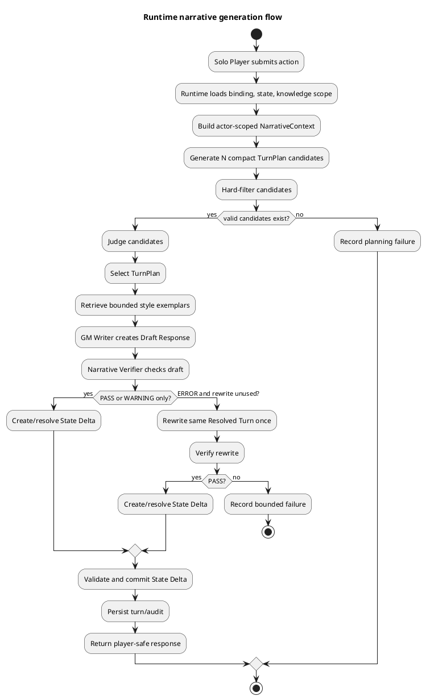
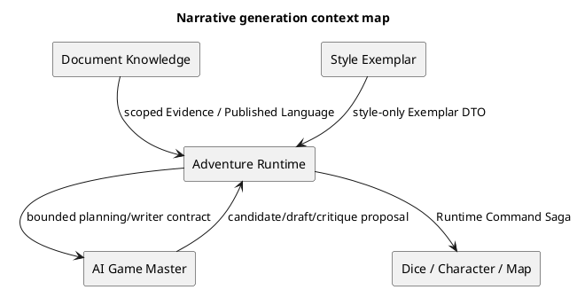
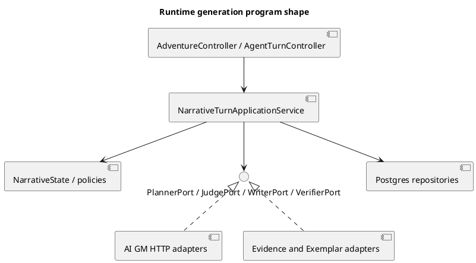
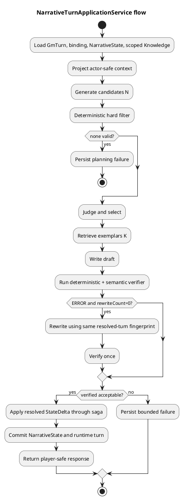
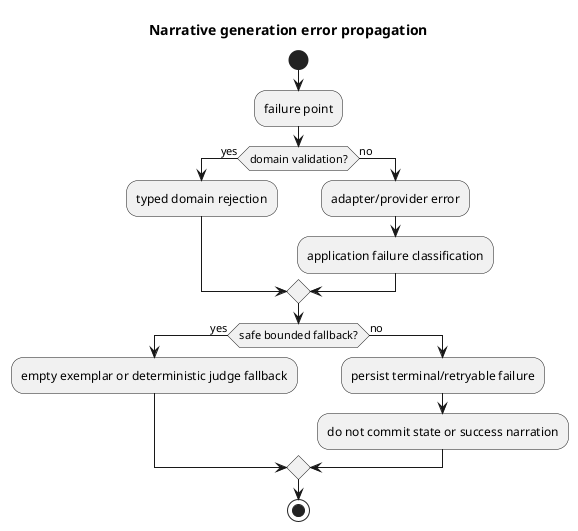

# Architecture Spec: Runtime narrative state, verifier, Best-of-N planning, and style exemplars

# 1. Design Scope

## 1.1 Target

| 항목 | 대상 |
| --- | --- |
| Product Spec | `docs/specs/product-spec.md` |
| Use Cases | UC-RN-206-1~2, UC-RN-207-1, UC-RN-208-1, UC-RN-209-1 |
| Domain | Adventure Runtime와 AI Game Master 생성 경계 |
| Bounded Contexts | Adventure Runtime, AI Game Master, Document Knowledge |
| Existing Services | `adventure-service`, `ai-game-master-service`, `rule-knowledge-service`, `preprocessing_agent` |
| External Dependencies | GM provider, rule/story retrieval, exemplar index |
| Affected Data | adventure context/turn, runtime state, candidate/verification audit, exemplar metadata |

## 1.2 Product Spec Mapping

| Product Spec | Architecture 요소 |
| --- | --- |
| G-RN-001~002 | Adventure Runtime 소유 `NarrativeState`와 actor-scoped projection |
| G-RN-003~004 | `NarrativeVerifier`, `RewritePolicy`, `VerificationResult` |
| G-RN-005~006 | `TurnPlanCandidateGenerator`, hard filter, `PlanJudge` |
| G-RN-007 | Knowledge/Exemplar 별도 port와 `ContextItem.provenance` |
| BR-RN-001~005 | `NarrativeState` aggregate + `StateDeltaValidator` |
| BR-RN-007~009 | `VerificationPolicy` 및 bounded rewrite application service |
| BR-RN-010~013 | `CandidateFilter`, `PlanJudge`, `PlanningPolicy` |
| BR-RN-014~016 | `ExemplarRetriever`와 별도 corpus contract |
| BR-RN-017 | flow별 immutable audit record |

## 1.3 Existing Constraints

- `adventure-service`가 Runtime Binding, Runtime Turn, command saga와 세션 상태의 권위자다. `ai-game-master-service`는 후보·제안만 만든다. 근거: `docs/adr/002-document-scenario-ai-boundaries.md`, `docs/adr/003-runtime-command-saga.md`.
- `RuntimeTurnApplicationService`는 현재 evidence → planning → writing → safety → commit을 함께 조정한다: `src/adventure-service/src/main/java/com/dndmaster/adventure/application/runtime/RuntimeTurnApplicationService.java`.
- AI GM에는 이미 typed TurnPlan이 있으나 runtime에는 축약 호환 TurnPlan이 따로 있다: `src/ai-game-master-service/src/main/java/com/dndmaster/aigamemaster/domain/turnplan/TurnPlan.java`, `src/adventure-service/src/main/java/com/dndmaster/adventure/application/runtime/TurnPlan.java`.
- Writer port와 final validator가 이미 존재한다: `TurnWriterPort`, `WriterContext`, `GmFinalValidator`.
- 기존 runtime 영속화는 JSON 중심이며 runtime turn lifecycle·command journal·context checkpoint가 별도다: `PostgresRuntimeTurnRepository`, `PostgresGmTurnRepository`, `PostgresRuntimeCommandJournal`, `PostgresGmContextCheckpointRepository`.

# 2. Domain Flow

## 2.1 Event Storming Flow



## 2.2 Commands

| Command | Actor | Target | Input | Preconditions | Result |
| --- | --- | --- | --- | --- | --- |
| `BuildNarrativeContext` | Runtime | Narrative State | session, actor, turn | binding/version valid | scoped context |
| `GenerateTurnPlanCandidates` | Runtime → AI GM | Candidate Generator | intent, state, constraints, N | N within policy | candidate plans |
| `FilterTurnPlanCandidates` | Runtime | Hard Filter | candidates, state, policy | candidate schema valid | valid/invalid split |
| `JudgeTurnPlans` | Runtime → AI GM | Plan Judge | valid candidates | at least one valid | selected plan + scores |
| `WriteDraftResponse` | Runtime → AI GM | Writer | selected plan, resolved context, exemplars | selected plan exists | Draft Response |
| `VerifyDraftResponse` | Runtime | Verifier | draft, verification context | draft nonblank | VerificationResult |
| `RewriteDraftResponse` | Runtime → AI GM | Rewrite port | original draft, violations, same turn | ERROR, rewrite unused | revised draft |
| `CommitStateDelta` | Runtime | Narrative State | validated delta, expected version | version matches | committed state/event |

## 2.3 Domain Events

| Event | Producer | Trigger | Payload | Consumers |
| --- | --- | --- | --- | --- |
| `NarrativeContextBuilt` | Runtime app | actor-scoped projection complete | session, actor, state version, fact IDs | planner/writer audit |
| `TurnPlanCandidatesGenerated` | Planner | candidate generation complete | candidate IDs, N, model metadata | filter/audit |
| `TurnPlanCandidateRejected` | Hard Filter | hard violation | candidate ID, violation types | planning audit |
| `TurnPlanSelected` | Plan Judge | valid candidate selected | selected ID, scores, policy | writer |
| `DraftVerified` | Verifier | draft check complete | status, violations, model metadata | rewrite policy/audit |
| `DraftRewritten` | Rewrite coordinator | one rewrite completed | source draft ID, result status | verifier/audit |
| `NarrativeStateCommitted` | State aggregate | validated delta committed | session, turn, new version, changed IDs | runtime turn, compaction |
| `PlanningOrPresentationFailed` | Runtime app | bounded failure | stage, retryability, diagnostics | failure persistence |

Events are internal audit/domain records first. Cross-service publication is deferred until contract stability; state authority remains `adventure-service`.

## 2.4 Policies

| Policy | Trigger | Decision | Owner |
| --- | --- | --- | --- |
| `EpistemicProjectionPolicy` | context build | expose only actor-known/revealable facts | Adventure Runtime |
| `StateDeltaCommitPolicy` | delta submit | validate, expected-version check, atomic commit | Adventure Runtime |
| `CandidateHardFilterPolicy` | candidates generated | remove secret leak, invalid entity/state, agency/rule violations | AI GM contract + Runtime |
| `PlanSelectionPolicy` | valid candidates | safety/continuity/agency first, then usefulness/interest, then simplicity | Plan Judge |
| `BoundedRewritePolicy` | verifier ERROR | rewrite once; never alter resolved meaning | Runtime application service |
| `ExemplarAdmissionPolicy` | response corpus ingest | reject verifier ERROR and secret/factual pollution | Exemplar catalog |

## 2.5 Read Models

| Read Model | Consumer | Source | Fields | Owner |
| --- | --- | --- | --- | --- |
| `ActorNarrativeContext` | Planner/Writer/Verifier | Narrative State + policy | visible scene, actor facts, knowledge, relationships, threads | Adventure Runtime |
| `PlanSelectionReport` | diagnostics/eval | candidate/filter/judge records | candidate IDs, violations, scores, selected ID | AI GM/Runtime |
| `VerificationReport` | diagnostics/eval | verifier results | status, violations, rewrite status, model/version | Adventure Runtime |
| `ExemplarSearchReport` | diagnostics/eval | retrieval results | query metadata, IDs, scores, provenance | Exemplar adapter |

## 2.6 External Interactions

| External System | Trigger | Input | Output | Failure |
| --- | --- | --- | --- | --- |
| `ai-game-master-service` | plan/write/judge/rewrite | versioned bounded DTO | typed candidate, draft, scores | schema/provider failure; bounded failure |
| `rule-knowledge-service` | knowledge context | session document scope + query | rule/story evidence with provenance | empty/error; no runtime overwrite |
| Exemplar index | style retrieval | ExemplarQuery + metadata + K | ranked exemplar DTOs | empty fallback |
| Dice/Character/Map services | State Delta effects | command saga command | authoritative effect result | saga pending/failure; no success narration |

## 2.7 Hotspots

| Hotspot | Options | Decision |
| --- | --- | --- |
| State owner | AI GM / Adventure Runtime | Adventure Runtime owns and commits; AI sees projection only |
| TurnPlan contract | duplicate local types / shared module / versioned DTO | keep domain models local; define explicit versioned boundary DTO and anti-corruption mapping |
| Verifier owner | AI GM / Adventure Runtime | Runtime owns final gate because it knows authority and commit semantics; semantic provider behind port |
| Best-of-N location | writer service / runtime orchestration | Runtime application orchestration with AI GM candidate/judge ports |
| Exemplar storage | Knowledge index shared / separate index | separate collection/index and provenance |
| Persistence | normalize all fields / JSON aggregate | new versioned state snapshot + audit JSON initially; normalized fact projections only when query load requires |
| Retry | unbounded loop / one rewrite | one verification and optional one rewrite, then terminal bounded failure |

# 3. DDD Architecture

## 3.1 Bounded Contexts

| Context | Responsibility | Owned Model | Owned Data |
| --- | --- | --- | --- |
| Adventure Runtime | state authority, actor projection, delta validation/commit, turn orchestration | `NarrativeState`, `StateDelta`, `NarrativeContext`, `RuntimeNarrativeCoordinator` | state snapshot/version, state events, verification/planning audit |
| AI Game Master | candidate plan, judge, writer, semantic critique proposals | `TurnPlanCandidate`, `PlanEvaluation`, `DraftResponse`, provider DTOs | provider request/result metadata; no runtime state |
| Document Knowledge | rule/story evidence and source provenance | `RuntimeEvidence`, `KnowledgeScope` | document/extraction/index data |
| Style Exemplar (logical subcontext) | curated response examples and retrieval | `StyleExemplar`, `ExemplarQuery`, `ExemplarResult` | separate exemplar corpus/index and admission metadata |

## 3.2 Context Map



| Upstream | Downstream | Relationship | Contract | Translation |
| --- | --- | --- | --- | --- |
| Adventure Runtime | AI Game Master | Customer/Supplier | `PlanningContextV2`, `WriterContextV2`, `VerificationContextV1` | runtime projection → provider DTO |
| AI Game Master | Adventure Runtime | Published Language | `TurnPlanCandidateV1`, `DraftResponseV1`, `PlanEvaluationV1` | strict parsing + validation |
| Document Knowledge | Adventure Runtime | Published Language | scoped evidence with document/extraction provenance | existing gateway/ACL |
| Style Exemplar | Adventure Runtime | Customer/Supplier | `ExemplarResultV1` | factual fields stripped; style provenance retained |
| Adventure Runtime | state services | Saga coordinator | commandId/sessionId/turnId/expectedVersion | existing command gateway |

## 3.3 Aggregates

| Aggregate | Root | Responsibility | Commands | Events | Invariants |
| --- | --- | --- | --- | --- | --- |
| `NarrativeState` | `NarrativeState` | canonical session narrative reality and epistemic boundaries | apply delta, reveal fact, record knowledge, update relationship/thread | `NarrativeStateCommitted` | monotonic reveal, actor isolation, versioned atomic commit |
| `GmTurnLifecycle` | existing `GmTurn` | bounded processing/presentation lifecycle | start/process/commit/fail/retryable fail | existing lifecycle events | no success before required effects; idempotent command |
| `GenerationAttempt` | `GenerationAttempt` | candidate, judge, draft, verifier audit for one turn | record candidate/filter/judge/verify/rewrite | audit events | max one rewrite; immutable attempt stages |

`NarrativeState` references characters, facts, and threads by IDs. It does not embed Character Management, Map, full transcript, or static documents.

## 3.4 Entities

| Entity | Aggregate | Identity | Responsibility | State |
| --- | --- | --- | --- | --- |
| `WorldFact` | NarrativeState | `factId` | represent canonical fact | value/status/source |
| `CharacterKnowledge` | NarrativeState | `characterId` | hold known fact IDs and beliefs | known facts, beliefs, version |
| `RevealedFact` | NarrativeState | `factId` | monotonic player disclosure | revealed turn/source |
| `RelationshipState` | NarrativeState | `(from,to)` | relationship projection | attitude/trust |
| `ActiveNarrativeThread` | NarrativeState | `threadId` | unresolved story element | type/status/fact IDs |
| `RecentEvent` | NarrativeState | `eventId` | bounded working memory | summary/turn/order |
| `GenerationAttempt` | GenerationAttempt | `attemptId` | audit a bounded generation pipeline | stages, IDs, metadata |

## 3.5 Value Objects

| Value Object | Values | Validation | Behavior |
| --- | --- | --- | --- |
| `FactId` | normalized ID | nonblank, stable | equality only |
| `ActorId` | player/NPC ID | nonblank | equality only |
| `Belief` | subject, belief, confidence/source | does not mutate WorldFact | actor-local projection |
| `StateDelta` | fact/scene/relationship/thread changes | expected version, known IDs, allowed mutation | deterministic validate |
| `NarrativeContext` | actor-scoped state + evidence | no forbidden facts | projection only |
| `VerificationResult` | status, violations, rewriteRequired | structured status/severity | error policy decision input |
| `ExemplarQuery` | scene metadata, K | bounded K, normalized metadata | retrieval input |
| `Provenance` | source, purpose, version | required source/purpose | prevents Knowledge/Exemplar mixing |

## 3.6 Domain Services

| Service | Input | Output | Responsibility |
| --- | --- | --- | --- |
| `NarrativeContextProjector` | state, actor, policy | `NarrativeContext` | epistemic-safe projection |
| `StateDeltaValidator` | state, delta | validation errors | reject stale/unknown/contradictory changes |
| `CandidateHardFilter` | candidate, context | violations | deterministic hard constraints |
| `PlanSelectionPolicy` | valid candidates, scores | selected candidate | deterministic tie-break and priority |
| `VerificationPolicy` | result, rewrite count | PASS/rewrite/fail | bounded error handling |
| `ExemplarAdmissionPolicy` | candidate response metadata | admitted/rejected | quality and pollution gate |

## 3.7 Business Rule Ownership

| Rule | Owner | Enforcement Point |
| --- | --- | --- |
| World Fact ≠ actor knowledge/belief | NarrativeState | `recordKnowledge`, projection |
| Revealed fact monotonic | NarrativeState | `revealFact` |
| Delta only from resolved/validated turn | Runtime app + validator | `commitStateDelta` |
| Static evidence cannot overwrite runtime | Runtime coordinator | merge boundary |
| forbidden facts absent from actor context | ContextProjector | `project(actorId)` |
| hard-invalid plan excluded before judge | CandidateHardFilter | `filter` |
| plan safety/agency priority | PlanSelectionPolicy | `select` |
| rewrite cannot change meaning | Rewrite coordinator | same resolved-turn fingerprint |
| max one rewrite | VerificationPolicy | attempt counter |
| ERROR exemplar excluded | ExemplarAdmissionPolicy | `admit` |

## 3.8 Aggregate State Transitions

| Current | Command/Event | Next | Owner | Preconditions | Event |
| --- | --- | --- | --- | --- | --- |
| loaded state v | validated delta | committed state v+1 | NarrativeState | expected version matches | NarrativeStateCommitted |
| candidate set | hard filter | valid candidate set | GenerationAttempt | schema/context valid | CandidateRejected |
| valid candidates | judge | selected plan | GenerationAttempt | non-empty | TurnPlanSelected |
| selected plan | writer | draft | GenerationAttempt | plan valid | DraftCreated |
| draft | verifier PASS/WARNING | verified draft | GenerationAttempt | context valid | DraftVerified |
| draft + ERROR | one rewrite | revised draft or failure | GenerationAttempt | rewrite count 0 | DraftRewritten |
| any processing | bounded failure | terminal failure | GmTurnLifecycle | failure recorded | Planning/PresentationFailed |

## 3.9 Repository Boundaries

| Repository | Aggregate | Operations | Consistency Boundary |
| --- | --- | --- | --- |
| `NarrativeStateRepository` | NarrativeState | load/save expected version | one session/turn commit |
| existing `RuntimeTurnRepository` | Gm/runtime turn | idempotent save/find | commandId + turn lifecycle |
| `GenerationAuditRepository` | GenerationAttempt | append stage/audit | one generation attempt |
| `ExemplarCatalog` | Style Exemplar | admit/search | exemplar corpus/index |

# 4. Program Design

## 4.1 Program Structure



## 4.2 Major Components and Responsibilities

| Component | Responsibility | Input | Output | Must Not Do |
| --- | --- | --- | --- | --- |
| `NarrativeTurnApplicationService` (`adventure-service`) | orchestration and transaction boundary | command + binding | committed result/failure | own provider prompt semantics |
| `NarrativeState` | canonical state and invariants | validated delta | new state/version | call HTTP/DB |
| `RuntimePlanningPort` | compatibility seam for planning | scoped planning request | candidate/selected result | mutate state |
| `PlanCandidatePort` | generate N compact plans | planning context | candidates | generate prose |
| `PlanJudgePort` | judge valid plans | candidates | scores/selection | bypass hard filter |
| `TurnWriterPort` | generate prose only | writer context | DraftResponse | create state effects |
| `NarrativeVerifierPort` | semantic critique proposal | verification context | structured result | commit state |
| `DeterministicNarrativeValidator` | hard deterministic checks | draft/context/plan | violations | use LLM for exact checks |
| `ExemplarRetrieverPort` | retrieve style-only examples | ExemplarQuery | ranked exemplars | provide facts as evidence |
| `GenerationAuditRepository` | persist bounded diagnostics | audit records | saved ID | become runtime authority |

## 4.3 Application Flow



## 4.4 Component Call Contracts

| Order | Caller | Callee | Operation | Input | Output | Failure |
| ---: | --- | --- | --- | --- | --- | --- |
| 1 | NarrativeTurnApplicationService | NarrativeStateRepository | `load(sessionId)` | session/version | state | not found/stale |
| 2 | application | EvidencePort | `search(scope, query)` | Session Knowledge Set | grounded evidence | empty/retryable |
| 3 | application | ContextProjector | `project(state, actor)` | state + policy | safe context | boundary rejection |
| 4 | application | PlanCandidatePort | `generate(context,N)` | compact planning DTO | candidates | schema/provider error |
| 5 | application | CandidateHardFilter | `filter(candidates, context)` | candidates | valid/rejected | deterministic violations |
| 6 | application | PlanJudgePort | `judge(valid)` | plans + rubric | selection | timeout/fallback |
| 7 | application | ExemplarRetrieverPort | `retrieve(query,K)` | style metadata | exemplars/empty | empty/retryable |
| 8 | application | TurnWriterPort | `write(writerContext)` | selected plan + safe context | draft | provider error |
| 9 | application | DeterministicNarrativeValidator + VerifierPort | `verify(context,draft)` | bounded verification context | result | timeout/failure |
| 10 | application | RewritePort | `rewrite(sameTurn,draft,violations)` | original meaning | revised draft | failure |
| 11 | application | StateDeltaValidator/Saga | `commit(delta)` | expected version | new state/effects | conflict/pending |
| 12 | application | repositories | `save(turn,audit,state)` | final records | committed response | persistence failure |

## 4.5 Major Types

| Type | Kind | Responsibility | Dependencies |
| --- | --- | --- | --- |
| `NarrativeState` | domain aggregate | canonical runtime narrative state | none |
| `NarrativeContext` | domain value object | actor-safe projection | state IDs, provenance |
| `StateDelta` | domain value object | proposed runtime changes | resolved-turn fingerprint |
| `TurnPlanCandidate` | AI GM DTO/domain type | compact plan proposal | schema v1 |
| `PlanEvaluation` | DTO | judge scores/fatal violations | candidate ID |
| `DraftResponse` | domain value object | prose plus turn fingerprint | no state mutation |
| `VerificationResult` | domain value object | structured quality gate | violation types |
| `GenerationAttempt` | audit aggregate | stage lifecycle and metadata | repository |
| `ExemplarQuery`/`Exemplar` | retrieval DTO | style-only retrieval | separate provenance |

## 4.6 Type Design

### `NarrativeState`

| 항목 | 정의 |
| --- | --- |
| Kind | domain aggregate |
| Responsibility | world state와 actor epistemic state의 정본 |
| Dependencies | none |
| Must Not Depend On | Spring, HTTP, LLM, transcript repository |

#### State

| Field | Type | Constraint |
| --- | --- | --- |
| `sessionId` | SessionId | immutable |
| `version` | long | monotonic |
| `worldFacts` | FactId → WorldFact | canonical only |
| `revealedFacts` | FactId → RevealedFact | monotonic |
| `characterKnowledge` | ActorId → CharacterKnowledge | actor isolated |
| `relationships` | pair → RelationshipState | normalized pair key |
| `activeThreads` | ThreadId → Thread | status valid |
| `recentEvents` | bounded list | working memory only |

#### Behavior

| Method | Input | Output | State Change |
| --- | --- | --- | --- |
| `project(actorId, policy)` | actor/policy | NarrativeContext | none |
| `apply(delta, expectedVersion)` | validated delta | new state | version +1 |
| `reveal(factId, turnId)` | fact ID | new state | never un-reveals |
| `recordKnowledge(actorId, factId)` | actor/fact | new state | actor-local knowledge |
| `recordBelief(actorId, belief)` | belief | new state | never changes world fact |

#### Invariants

| Invariant | Enforcement |
| --- | --- |
| stale expected version rejected | `apply` |
| forbidden fact absent from projection | `project` |
| revealed fact cannot become hidden | `reveal`/merge |
| belief cannot mutate WorldFact | `recordBelief` |

### `VerificationResult`

| Field | Type | Constraint |
| --- | --- | --- |
| `status` | PASS/FAIL | required |
| `violations` | list | type/severity/evidence/instruction |
| `rewriteRequired` | boolean | true only for ERROR policy |
| `rewriteCount` | int | 0 or 1 |
| `modelMetadata` | value object | provider/model/version |

### `GenerationAttempt`

| Method | Input | Output | State Change |
| --- | --- | --- | --- |
| `recordCandidates` | candidate list | attempt | stage recorded |
| `reject` | candidate ID/violations | attempt | immutable rejection |
| `select` | candidate/evaluation | attempt | one selected ID |
| `verify` | result | attempt | draft status |
| `rewriteOnce` | revised draft | attempt | count 0→1 only |

## 4.7 Interfaces and Function Signatures

```java
interface NarrativeStateRepository {
    Optional<NarrativeState> findBySessionId(SessionId sessionId);
    NarrativeState save(NarrativeState state, long expectedVersion);
}

interface PlanCandidatePort {
    List<TurnPlanCandidate> generate(PlanningContext context, int candidateCount);
}

interface PlanJudgePort {
    PlanSelection judge(List<TurnPlanCandidate> candidates, PlanJudgingContext context);
}

interface NarrativeVerifierPort {
    VerificationResult verify(NarrativeVerificationContext context, DraftResponse draft);
}

interface RewritePort {
    DraftResponse rewrite(RewriteContext context);
}

interface ExemplarRetrieverPort {
    List<ExemplarResult> retrieve(ExemplarQuery query, int limit);
}
```

| Port | Preconditions | Postconditions | Errors | Idempotency |
| --- | --- | --- | --- | --- |
| `PlanCandidatePort` | bounded N, valid context | candidates share hard constraints | provider/schema | request key per turn/stage |
| `PlanJudgePort` | non-empty valid candidates | exactly one selection or fallback | timeout/invalid score | deterministic input key |
| `NarrativeVerifierPort` | nonblank draft, bounded context | structured result | timeout/provider failure | verification attempt key |
| `RewritePort` | ERROR, rewrite count 0 | same turn fingerprint | provider/schema | rewrite attempt key |
| `ExemplarRetrieverPort` | bounded K/query | style-only provenance | empty/search error | query hash |

## 4.8 Error Propagation



| Failure Point | Converted Error | Handler | Result |
| --- | --- | --- | --- |
| state load/version conflict | `RuntimeStateConflict` | application | retryable failure, no commit |
| candidate schema/hard filter | `NoValidTurnPlanCandidates` | application | no writer call |
| judge timeout | `PlanJudgeUnavailable` | selection policy | deterministic safe fallback or failure |
| writer failure | `DraftGenerationFailed` | lifecycle | no verification/commit |
| verifier timeout | `VerificationUnavailable` | bounded policy | no unverified success |
| rewrite failure/second ERROR | `BoundedRewriteFailed` | lifecycle | terminal presentation failure |
| delta/saga failure | `StateCommitPending/Failed` | existing saga | no success narration |
| exemplar search failure | `ExemplarUnavailable` | retrieval adapter | empty exemplar context |

## 4.9 State Transition Implementation

| Transition | Domain Owner | Method | Persistence Point | Event |
| --- | --- | --- | --- | --- |
| state v → v+1 | NarrativeState | `apply(delta, expectedVersion)` | NarrativeStateRepository + runtime turn transaction | NarrativeStateCommitted |
| candidates → filtered | GenerationAttempt | `reject` | GenerationAuditRepository | TurnPlanCandidateRejected |
| filtered → selected | PlanSelectionPolicy | `select` | GenerationAuditRepository | TurnPlanSelected |
| draft → verified | VerificationPolicy | `accept/fail` | audit + runtime turn | DraftVerified |
| draft → rewritten | GenerationAttempt | `rewriteOnce` | audit | DraftRewritten |

## 4.10 Persistence and Migration Strategy

- Keep existing `AdventureContext` and legacy runtime JSON readable during transition. Map old `npcState` into a legacy `CharacterKnowledge`/working-memory projection; never infer durable facts from free prose.
- Add versioned narrative-state payload/version to the runtime/session persistence owned by `adventure-service`. Prefer one immutable snapshot plus append-only state/audit records initially; use optimistic expected-version checks.
- Extend runtime-turn JSON/audit with generation attempt ID, candidate/filter/judge report, verification result, rewrite count, and exemplar IDs/provenance. Do not store full unbounded prompts/transcripts in canonical state.
- Add Flyway migration only after the aggregate payload and compatibility defaults are fixed. Existing rows load as version 0 and project empty knowledge/revealed facts safely.
- Do not add runtime state tables to `ai-game-master-service` or `rule-knowledge-service`.

## 4.11 Test Design

| Test Layer | Required Coverage | Existing Seam |
| --- | --- | --- |
| domain unit | monotonic reveal, actor isolation, belief separation, delta validation, tie-break, max rewrite | new `adventure-service` domain tests |
| application unit | N=1/N=3, zero valid candidates, writer only selected plan, bounded rewrite, no commit on failure | `RuntimeTurnApplicationServiceTest`, `TurnWriterContractTest` |
| contract | versioned candidate/writer/verifier/exemplar DTOs, unknown/malformed fields | `GmAgentControllerContractTest` style |
| persistence integration | snapshot compatibility, optimistic version, audit durability, legacy row projection | `RuntimeTurnPostgresIntegrationTest`, compatibility tests |
| cross-context integration | evidence provenance and separate exemplar handoff | `CrossContextHttpRuntimeEvidenceSearchGatewayTest` pattern |
| security/regression | secret leak, NPC knowledge leak, player agency, RAG overwrite, exemplar pollution | `GmFinalValidator`/runtime regression fixtures |

## 4.12 Dependency Rules

### Allowed Dependencies

| Source | Target | Contract |
| --- | --- | --- |
| `ui` | `app` | application command |
| `app` | `domain` | domain methods/services |
| `app` | ports | interfaces |
| `infra` | ports | adapter implementation |
| Adventure Runtime | AI GM | versioned DTO/HTTP port |
| Adventure Runtime | Knowledge | scoped evidence port |

### Forbidden Dependencies

| Source | Forbidden Target |
| --- | --- |
| AI Game Master | NarrativeState repository/DB |
| AI Game Master | Character/Map/Dice direct mutation |
| Writer | StateDelta commit or tool command |
| Exemplar | canonical fact/evidence store |
| NarrativeState domain | HTTP, Spring, LLM, persistence adapter |
| Plan Judge | invalid candidates before hard filter |
| Rewrite | TurnPlan/ResolvedTurn/Story Stage mutation |
| Transcript | canonical state authority |

# 5. Implementation Boundary and Sequencing

1. Introduce versioned DTOs and typed runtime projection without changing player API.
2. Add `NarrativeState` aggregate, repository, compatibility projection, and domain tests.
3. Split deterministic hard filter and plan-level candidate/judge ports around existing `RuntimePlanningPort`.
4. Complete independent Writer → Verifier → bounded Rewrite flow; retain legacy writer only as explicit compatibility adapter.
5. Add separate exemplar port/index adapter and provenance-aware writer context.
6. Add persistence audit, metrics, compatibility migration, and cross-service contracts.

No implementation ticket or plan is created here. Next recommended step: `to-ticket` using this Product Spec and Architecture Spec.
