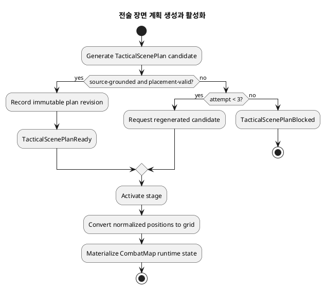
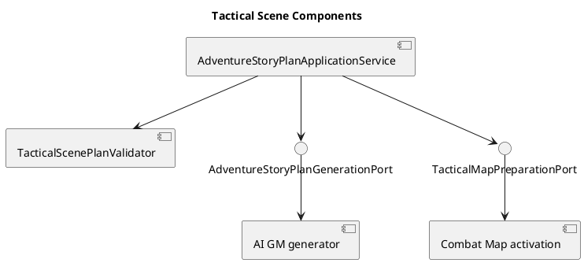

# Architecture Spec: 모험 단계 계획의 전술 장면 세밀화

## 1. Design Scope

| 항목 | 대상 |
| --- | --- |
| Product Spec | `docs/specs/product-spec.md` |
| Use Cases | UC-TSP-01 ~ UC-TSP-04 |
| Domain | 모험 계획, 전술 장면, 전술 맵 활성화, 가시성 |
| Bounded Contexts | Adventure, AI Game Master, Combat Map, Rule Knowledge |
| Existing Services | `adventure-service`, `ai-game-master-service`, `combat-map-service`, `rule-knowledge-service` |
| Affected Data | 모험 플랜 단계 JSON·이력, 전술 맵 토큰·레이어·가시성 |

| Product requirement | Architecture element |
| --- | --- |
| 전술 장면 생성 | `AdventureStoryPlan`의 불변 `TacticalScenePlan` |
| 3회 재생성 | `TacticalPlacementRetryPolicy` |
| 정규화 좌표 | activation-time `NormalizedCoordinate → GridPlacement` 변환 |
| 숨겨진 정보 | GM/internal 및 player-safe projection 분리 |

## 2. Domain Flow

| Command | Target | Preconditions | Result |
| --- | --- | --- | --- |
| `GenerateTacticalScenePlan` | `AdventureStoryPlan` | stage has map or is explicitly non-tactical | candidate scene |
| `ValidateTacticalScenePlan` | `TacticalScenePlan` | candidate exists | ready, retry or blocked |
| `RegenerateTacticalScenePlan` | `AdventureStoryPlan` | attempt < 3; stage unrevealed | new plan revision |
| `ActivateTacticalScene` | `CombatMap` | plan revision ready | materialized map state |
| `ApplyTacticalTrigger` | `CombatMap` | planned trigger matches | state, visibility or transition change |
| `ReviseFutureTacticalScene` | `AdventureStoryPlan` | stage unrevealed | successor plan revision |

## 3. DDD Architecture

| Context | Responsibility | Owned model |
| --- | --- | --- |
| Adventure | immutable plan revisions, tactical intent, validation and regeneration | `AdventureStoryPlan`, `TacticalScenePlan` |
| AI Game Master | typed source-grounded tactical candidates | generation request/response |
| Combat Map | mutable grid positions, visibility and trigger effects | `CombatMap`, tokens, layers |
| Rule Knowledge | source excerpts, citations and map geometry | citations, `MapDefinition` |

| Aggregate / model | Owner | Invariants |
| --- | --- | --- |
| `AdventureStoryPlan` | Adventure | revealed stages are never replaced; tactical stage is ready before activation |
| `TacticalScenePlan` | Adventure stage child | mandatory categories explicit; placement grounded/inferred; all placement valid |
| `CombatMap` | Combat Map | runtime changes never mutate plan intent; player projection hides secret state |
| `MapDefinition` | Rule Knowledge | immutable source-pinned geometry/calibration |

| Value object | Values / validation |
| --- | --- |
| `NormalizedCoordinate` | x/y in [0, 1], independent of grid resolution |
| `TacticalPlacement` | stable ID, token/object/environment kind, normalized position, visibility, grounding |
| `TacticalEnvironment` | obstacle, cover, hazard, door, loot, interactive object |
| `FogPlan` | hidden regions and planned reveal triggers |
| `TacticalTrigger` | entry, reveal, boss, reinforcement, reward, success/failure/exit effects |
| `PlacementGrounding` | source citation or `AI_INFERENCE` rationale |

| Rule | Owner | Enforcement point |
| --- | --- |
| complete tactical state | `TacticalScenePlan` | factory and validator |
| source overrides inference | `TacticalScenePlanValidator` | candidate reconciliation |
| no collision/out-of-bounds/blocked position | validator and activation | persistence and activation |
| three-attempt limit | retry policy | generation orchestration |
| player secrecy | projection assembler | API/read boundary |
| revealed-stage immutability | plan revision policy | revision command |

## 4. Program Design

| Component | Responsibility | Must not do |
| --- | --- | --- |
| `AdventureStoryPlanApplicationService` | construct source/map request, coordinate retries, persist accepted revision | own mutable grid tokens |
| `TacticalScenePlanValidator` | validate categories, source precedence, positions and trigger references | call AI or persist |
| `AdventureStoryPlanGenerationPort` | carry typed tactical candidate | flatten tactical state into prose notes |
| AI GM generator | return candidate and citations | invent unsupported core facts |
| `TacticalMapActivationApplicationService` | transform normalized coordinates, apply scene | regenerate/revise plan |
| Combat Map activation | create mutable hidden/public layers | expose GM plan |

| Order | Caller | Callee | Contract |
| ---: | --- | --- | --- |
| 1 | Adventure | AI GM | typed plan request with stage/map/citations/schema |
| 2 | Adventure | validator | candidate → violations or ready |
| 3 | Adventure | AI GM | retry request with violation feedback |
| 4 | Adventure | Combat Map | `PrepareTacticalScene(MapDefinition, TacticalScenePlan)` |
| 5 | runtime turn | Combat Map | evaluate planned trigger |

## 5. Persistence, Projections, and Failure Contract

- Persist `TacticalScenePlan` inside a stage of the existing versioned `stages_json` snapshot, with a schema version. Older plans deserialize as `ABSENT` and cannot activate a tactical stage before regeneration.
- Reuse append-only story-plan history for regeneration and future-stage revisions. Persist activated grid entities only in Combat Map storage.
- GM/internal projections contain full tactical state, citations, inference labels, hidden placements and triggers. Player projections contain only revealed regions, visible tokens, discovered objects, resolved rewards and actionable information.

| Failure | Response |
| --- | --- |
| missing category or explicit collection | validation violation; retry |
| collision, blocked or out-of-bounds conversion | validation violation; retry |
| source conflict or invented core fact | reject inference; retry |
| three failures | blocked plan; prevent adventure start |
| revision of revealed stage | conflict; retain current plan/runtime state |
| player request for hidden plan data | omit at projection boundary |

## 6. Test Strategy

- Domain: coordinate bounds, completeness, collision, source precedence and trigger validity.
- Application: retry ceiling, blocked state and revealed-stage immutability.
- Adapter: typed AI parsing, citation reconciliation and violation feedback.
- Integration: normalized-to-grid conversion, map materialization and player-safe fog/token projection.
- Fresh Playwright: Potent Brew produces a grounded tactical scene while player UI excludes hidden placement.
