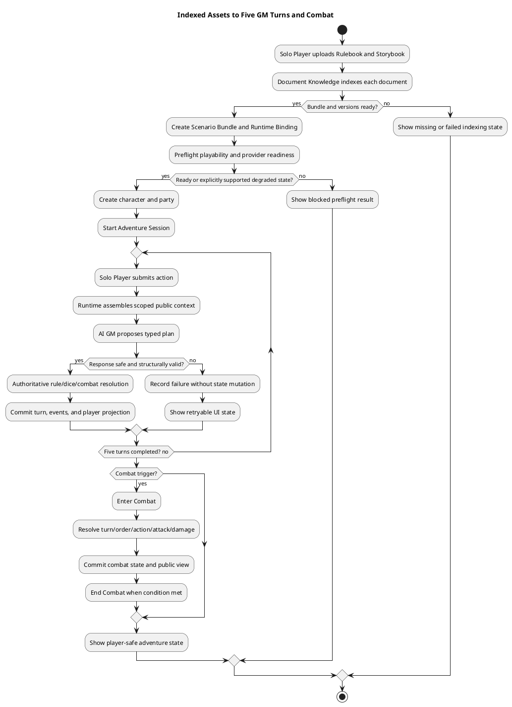
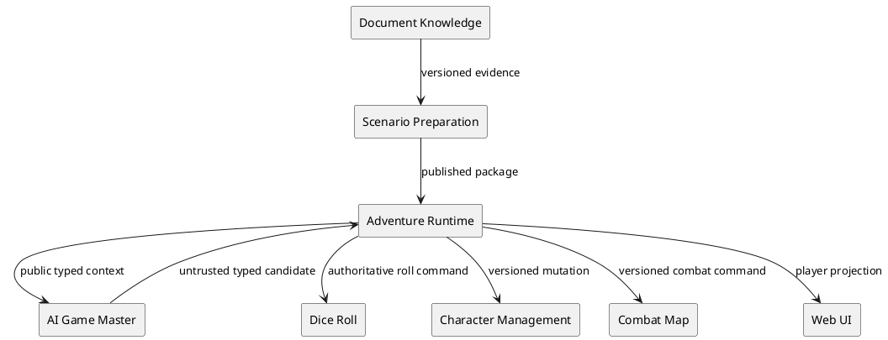
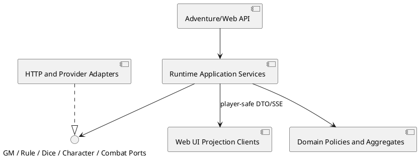
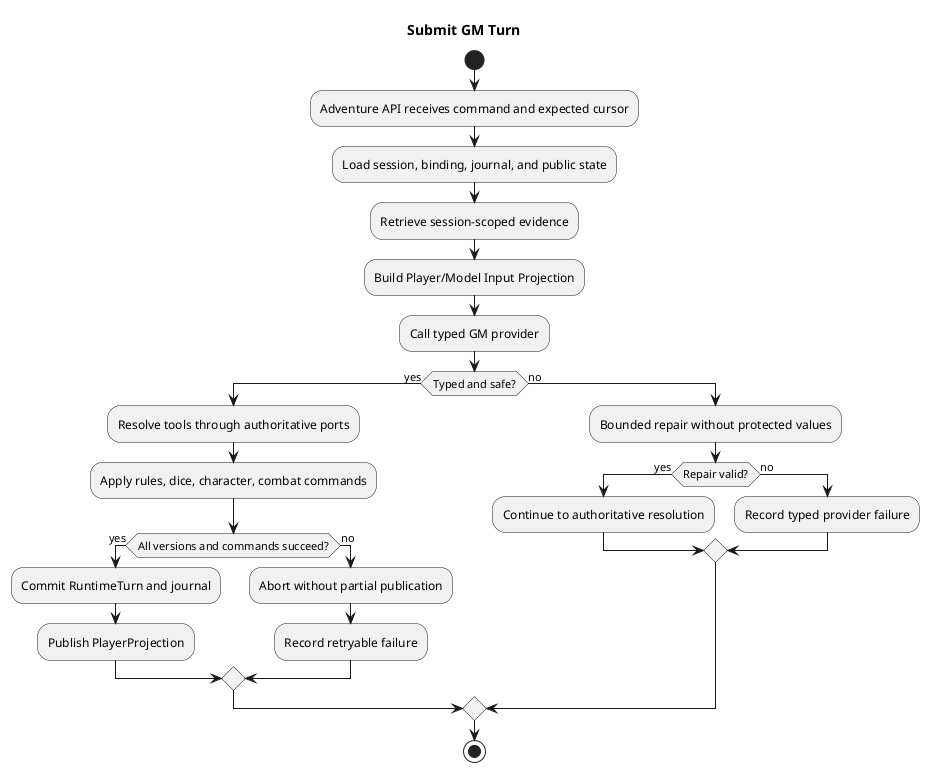

# Architecture Spec

# 1. Design Scope

## 1.1 Target

| 항목 | 대상 |
|---|---|
| Product Spec | `docs/specs/product-spec.md` |
| Use Cases | UC-001 자료에서 모험 시작, UC-002 GM 5턴, UC-003 룰 판정, UC-004 전투, UC-005 실패 복구 |
| Domain | Adventure Runtime, AI Game Master, Rule Knowledge, Dice Roll, Character Management, Combat Map |
| Bounded Contexts | Document Knowledge, Scenario Preparation, Adventure Runtime, AI Game Master, Dice Roll, Character Management, Combat Map |
| Existing Services | `adventure-service`, `ai-game-master-service`, `rule-knowledge-service`, `dice-roll-service`, `combat-map-service`, `web-ui` |
| External Dependencies | Ollama/OpenAI provider, PostgreSQL, browser runtime |
| Affected Data | Runtime turn/journal/version, provider binding, story/rule evidence, dice result, combat command fingerprint, player projection |

## 1.2 Product Spec Mapping

| Product Spec 항목 | Architecture 요소 |
|---|---|
| UC-001 | Runtime preflight + binding readiness + UI setup flow |
| UC-002 | `RuntimeTurnApplicationService` → typed GM plan → final validation → atomic commit |
| UC-003 | `DeterministicAdjudicationService` → `GmToolGatewayService` → dice/rule ports |
| UC-004 | `AdventureCombatApplicationService`와 Runtime Command Saga의 명령 조정 |
| UC-005 | typed failure taxonomy, bounded repair, command journal idempotency, UI retry state |
| BR-001/002 | 단일 Player Projection Policy와 story/combat/map 공개 경계 |
| BR-003/009 | AI response contract, `GmFinalValidator`, provider adapter boundary |
| BR-004/005/006/008 | authoritative resolution/mutation ports, runtime transaction boundary, command identity |
| BR-007 | Runtime Binding의 package/document/version scope 검증 |

---

# 2. Domain Flow

## 2.1 Event Storming Flow



## 2.2 Commands

| Command | Actor | Target | Input | Preconditions | Result |
|---|---|---|---|---|---|
| `PrepareScenarioBundle` | Solo Player | Scenario Preparation | indexed document IDs + versions | each required document is indexed | bundle revision |
| `CheckRuntimeReadiness` | UI/runtime | Adventure Runtime | bundle, provider, engine/tool versions | binding references are scoped | ready/blocked/degraded result |
| `StartAdventureSession` | Solo Player | Adventure Session | party + locked binding | party and runtime ready | started session/prologue |
| `SubmitGmTurn` | Solo Player | Adventure Runtime | session, action, expected cursor | session started; cursor matches | committed turn or typed failure |
| `ResolveRuleAction` | Runtime | Rule/Dice/Character | canonical resolution request | rule supported; actor authorized | authoritative resolution |
| `ResolveCombatAction` | Solo Player | Combat/Adventure Runtime | combat action + expected version | active combat turn | combat event/state |
| `RetryFailedTurn` | Solo Player | Adventure Runtime | failed command identity | prior attempt was uncommitted | one reprocessable turn |

## 2.3 Domain Events

| Domain Event | Producer | Trigger | Payload | Consumers |
|---|---|---|---|---|
| `KnowledgeDocumentIndexed` | Document Knowledge | indexing completed | document/version/type | bundle preparation |
| `RuntimeReadinessEvaluated` | Adventure Runtime | preflight completed | binding version + checks | UI/session start |
| `AdventureStarted` | Adventure Runtime | valid start command | session/binding/party IDs | prologue/UI |
| `GmTurnReceived` | Adventure Runtime | player action accepted | command ID + cursor | runtime processing |
| `GmTurnCommitted` | Adventure Runtime | validation and mutations succeed | turn/version/public projection | stream/UI |
| `GmTurnRejected` | AI/Adventure Runtime | malformed/unsafe/unsupported result | category + retryability, no protected value | UI/metrics |
| `AuthoritativeRollRecorded` | Dice Roll | idempotent roll command | roll ID, command ID, result | adjudication/runtime |
| `CombatEntered` / `CombatEnded` | Adventure Runtime | trigger/termination condition | combat ID + version | combat UI/story |
| `CombatActionResolved` | Combat/Adventure Runtime | valid action | public outcome + version | map/UI/runtime |

## 2.4 Policies

| Policy | Trigger Event | Decision | Emitted Command | Owner |
|---|---|---|---|---|
| `PlayerProjectionSafetyPolicy` | candidate response/state | disclose only public facts and allowed evidence | `PublishPlayerProjection` | Adventure Runtime |
| `GmResponseGatePolicy` | provider response | validate schema, citations, facts, tools, secrets | `ResolveRuleAction` or `RejectGmTurn` | AI GM + Runtime boundary |
| `AtomicTurnCommitPolicy` | validated resolution | commit all runtime effects or none | `CommitGmTurn` | Adventure Runtime |
| `IdempotentCommandPolicy` | repeated command ID | return prior result without reapplying effects | `ReplayCommandResult` | Runtime/Dice/Combat |
| `RuntimeReadinessPolicy` | binding/preflight result | block start unless required checks pass | `StartAdventureSession` | Adventure Runtime |

## 2.5 Read Models

| Read Model | Consumer | Source | Fields | Owner |
|---|---|---|---|---|
| `RuntimeReadinessView` | setup UI | binding/preflight checks | status, blockers, warnings, retryability | Adventure Runtime |
| `PlayerAdventureView` | adventure UI | committed events/projection | scene, public NPC state, public evidence, cursor | Adventure Runtime |
| `PlayerCombatView` | combat UI | combat events/map visibility | turn, visible tokens, legal actions, public outcomes | Combat Map/Adventure |
| `TurnFailureView` | adventure UI | rejected turn record | category, safe message, retryability, cursor | Adventure Runtime |

## 2.6 External Interactions

| External System | Trigger | Input | Output | Failure |
|---|---|---|---|---|
| AI provider | typed GM planning | versioned public projection + schema | typed candidate or provider failure | bounded repair then safe rejection |
| Rule Knowledge | context/rule lookup | session-scoped document IDs + intent | evidence with stable identity | no evidence / scope mismatch |
| Dice Roll | resolution tool | idempotent roll command | immutable roll result | timeout/failure, no partial commit |
| Character Management | HP/resource/effect mutation | authorized versioned command | updated character state | conflict, no turn commit |
| Combat Map | combat action/movement | authorized command + expected version | visible map state | conflict/forbidden action |

## 2.7 Hotspots

| Hotspot | Options | Decision |
|---|---|---|
| malformed provider response | free-form repair / typed parser+bounded repair / deterministic fiction fallback | typed response contract, one bounded repair, fail closed; no fabricated fallback |
| hidden info protection | per-feature filters / one player projection boundary | one policy contract consumed by story, runtime, tool result, and combat views |
| rule/combat ownership | GM decides / runtime authoritative resolution | AI proposes; rule/dice/character/combat owners decide and mutate |
| missing game-system definition | hard block / silent degraded mode | readiness result explicitly distinguishes blocking vs supported degraded mode; UI must show it |
| acceptance environment | backend fake / browser-only real UI / both | browser path is required acceptance; focused backend tests remain supporting evidence |

---

# 3. DDD Architecture

## 3.1 Bounded Contexts

| Context | Responsibility | Owned Model | Owned Data |
|---|---|---|---|
| Document Knowledge | upload, extraction, indexing, evidence | KnowledgeDocument, Evidence | documents, chunks, indexes |
| Scenario Preparation | bundle/package compilation | ScenarioBundle, Package | package revisions, source spans |
| Adventure Runtime | session, turns, binding, public projection | RuntimeBinding, AdventureSession, GmTurn | turns, journal, cursors, public views |
| AI Game Master | candidate plan generation and response contract | GmPlanCandidate | provider interaction telemetry |
| Dice Roll | immutable dice execution | Roll | roll commands/results |
| Character Management | character state | CharacterSheet | HP/resources/effects |
| Combat Map | tactical visibility and map commands | CombatMap | map versions/tokens/fingerprints |

## 3.2 Context Map



| Upstream | Downstream | Relationship | Contract | Translation |
|---|---|---|---|---|
| Document Knowledge | Scenario Preparation | Customer/Supplier | indexed document/version/evidence | scenario source adapter |
| Scenario Preparation | Adventure Runtime | Published Language | published package revision | binding validator |
| Adventure Runtime | AI Game Master | Customer/Supplier | `RuntimePlanningRequest` + response schema | model input projection / candidate mapper |
| Adventure Runtime | Dice/Character/Combat | Orchestrated integration | versioned commands | cross-context ACL adapters |
| Adventure Runtime | Web UI | Published Language | player/readiness/failure views | API DTO projection |

## 3.3 Aggregates

| Aggregate | Root | Responsibility | Commands | Invariants |
|---|---|---|---|---|
| `AdventureSession` | session | lifecycle, locked binding, party | start, submit turn | valid state/cursor/party |
| `RuntimeTurn` | turn | candidate, resolution, commit result | receive, validate, commit | atomic and ordered |
| `RuntimeBinding` | binding | package/provider/engine readiness | evaluate, lock | scope/version compatibility |
| `CombatEncounter` | combat | turn/order/action lifecycle | enter, resolve, end | actor/version/legal action |
| `Roll` | roll | immutable dice result | execute/replay | command idempotency |

## 3.4 Entities

| Entity | Aggregate | Identity | Responsibility |
|---|---|---|---|
| `GmTurn` | RuntimeTurn | turn ID + command ID | lifecycle and failure/commit state |
| `EvidenceReference` | RuntimeTurn | document/version/locator/type | stable grounding identity |
| `CombatActor` | CombatEncounter | actor ID | legal action and visible state |
| `CommandJournalEntry` | RuntimeTurn | command ID | replay/concurrency record |

## 3.5 Value Objects

| Value Object | Values | Validation |
|---|---|---|
| `PlayerProjection` | public scene/NPC/evidence/outcome | no hidden fact/internal ID |
| `GmResponseCandidate` | schema fields, citations, tools, state proposal | typed schema and allowed tool set |
| `ReadinessResult` | ready/blocked/degraded + reasons | all blockers/warnings explicit |
| `RollCommandId` | stable command identity | nonblank and scoped to session |
| `RuntimeCursor` | session version/turn sequence | optimistic concurrency |

## 3.6 Domain Services

| Service | Responsibility | Input | Output |
|---|---|---|---|
| `PlayerProjectionPolicy` | filter all player-visible facts and fields | candidate + authoritative state | safe projection or rejection |
| `GmResponseGate` | validate candidate before execution | typed provider response + context | accepted candidate or typed failure |
| `DeterministicAdjudicationService` | apply supported rule operations | resolution request + roll results | authoritative resolution |
| `RuntimeReadinessPolicy` | evaluate start blockers/degraded capabilities | binding and provider checks | readiness result |
| `TurnCommitPolicy` | enforce all-or-nothing turn commit | validated resolution and cursor | commit decision |

## 3.7 Business Rule Ownership

| Rule | Owner | Enforcement Point |
|---|---|---|
| BR-001/002 | `PlayerProjectionPolicy` | before API/event publication |
| BR-003/009 | `GmResponseGate` | AI boundary and runtime boundary |
| BR-004/006 | Dice/Character/Combat aggregates | command handlers and repositories |
| BR-005 | `AdventureSession` + `TurnCommitPolicy` | runtime transaction boundary |
| BR-007 | `RuntimeBinding` | binding creation/start preflight |
| BR-008 | `CombatEncounter` | combat action command |

## 3.8 Aggregate State Transitions

| Current | Command/Event | Next | Owner | Preconditions |
|---|---|---|---|---|
| `PREPARING` | `RuntimeReadinessEvaluated(ready)` | `STARTING` | AdventureSession | party/binding valid |
| `STARTING` | `AdventureStarted` | `STARTED` | AdventureSession | prologue/public projection succeeds |
| `STARTED` | `GmTurnReceived` | `CONTEXT_READY` | GmTurn | cursor matches |
| `CONTEXT_READY` | valid candidate | `VALIDATED` | GmResponseGate | safe/grounded |
| `VALIDATED` | authoritative resolution | `COMMITTED` | TurnCommitPolicy | all commands succeed |
| `STARTED` | combat trigger | `COMBAT_ENTERED` | CombatEncounter | encounter valid |
| `COMBAT_ENTERED` | combat end condition | `COMBAT_END` | CombatEncounter | termination rule |

## 3.9 Repository Boundaries

| Repository | Aggregate | Operations | Consistency Boundary |
|---|---|---|---|
| `RuntimeTurnRepository` | RuntimeTurn | load/append/commit | one session cursor |
| `RuntimeCommandJournal` | RuntimeTurn | claim/replay/record | command identity |
| `RuntimeBindingRepository` | RuntimeBinding | load/evaluate/lock | binding revision |
| `DiceRollRepository` | Roll | execute/find by command ID | one roll command |
| `CombatMapViewStore` | CombatEncounter | apply/replay/version check | one combat map version |

---

# 4. Program Design

## 4.1 Program Structure



## 4.2 Major Components and Responsibilities

| Component | Responsibility | Must Not Do |
|---|---|---|
| `GmAgentController` / adapter | provider request, typed parse, bounded repair, failure mapping | persist game state or expose protected context |
| `RuntimeTurnApplicationService` | orchestration and transaction boundary | trust provider state delta or bypass gate |
| `GmResponseGate` / `GmFinalValidator` | schema, citation, fact, tool, secret checks | mutate character/dice/combat state |
| `PlayerProjectionPolicy` | one public view contract across story/runtime/combat | infer new rules or reveal hidden values |
| `DeterministicAdjudicationService` | resolve supported rules using authoritative results | accept prose as a roll result |
| `AdventureCombatApplicationService` | coordinate legal combat commands | accept a stale/versionless command |
| `RuntimeReadinessPolicy` | produce explicit ready/blocked/degraded result | silently downgrade blockers |
| `AdventureStream` / API client | render public view and retryable failures | parse or sanitize hidden server data locally as authority |

## 4.3 Application Flow



## 4.4 Component Call Contracts

| Order | Caller | Callee | Operation | Failure |
|---:|---|---|---|---|
| 1 | Adventure API | RuntimeTurnApplicationService | `submitTurn(command)` | invalid session/cursor |
| 2 | RuntimeTurnApplicationService | Evidence gateways | `searchScoped(request)` | scope/no evidence |
| 3 | RuntimeTurnApplicationService | GmCompletionAdapter | `complete(typedRequest)` | timeout/malformed/provider |
| 4 | RuntimeTurnApplicationService | GmResponseGate | `validate(candidate)` | secret/schema/grounding |
| 5 | RuntimeTurnApplicationService | resolution/tool ports | `resolve(command)` | unsupported/timeout/conflict |
| 6 | RuntimeTurnApplicationService | RuntimeTurnRepository + Journal | `commit(result)` | optimistic conflict |
| 7 | Adventure API | PlayerProjectionPolicy | `toView(committedState)` | projection safety rejection |

## 4.5 Major Types

| Type | Kind | Responsibility |
|---|---|---|
| `TypedGmResponse` | DTO/value object | provider output with closed fields |
| `GmFailure` | value object | category, retryability, safe message, correlation ID |
| `PlayerProjectionPolicy` | domain service | public disclosure invariant |
| `RuntimeReadinessView` | read model | setup/start capability status |
| `AuthoritativeResolution` | domain result | rule result and mutation commands |
| `QualityScenario` | test fixture | UI-only indexed asset and five-turn/combat path |

## 4.6 Type Design

### `TypedGmResponse`

| 항목 | 정의 |
|---|---|
| Kind | immutable response contract |
| Responsibility | constrain and transport scene, NPC state, judgment, narration, citations, tools, provider metadata |
| Must Not Depend On | persistence, UI, raw provider-specific JSON |

#### Invariants

| Invariant | Enforcement Point |
|---|---|
| unknown fields/tools are rejected or ignored by explicit policy | parser + gate |
| state delta is empty unless an approved typed command exists | gate |
| citations identify selected evidence exactly | gate |
| protected values do not appear in player-facing fields | projection policy |

### `GmFailure`

| Field | Meaning | Constraint |
|---|---|---|
| `category` | provider/schema/grounding/rule/dependency/concurrency | finite enum |
| `retryable` | whether retry can succeed without user repair | explicit |
| `safeMessage` | player-visible explanation | no protected value/prompt/raw output |
| `correlationId` | support/telemetry identity | opaque |

### `PlayerProjection`

| Field | Meaning | Constraint |
|---|---|---|
| `scene` | current public scene | derived from committed state |
| `narration` | public GM narration | safety gate passed |
| `judgment` | public result/explanation | no unrevealed DC/secret |
| `evidence` | public citations | session/version/disclosure match |
| `combat` | visible legal combat state | map visibility and version match |
| `cursor` | next expected command version | monotonic |

## 4.7 Interfaces and Function Signatures

```java
interface GmCompletionAdapter {
    TypedGmResponse complete(TypedGmRequest request, DeadlineBudget budget);
}

interface PlayerProjectionPolicy {
    PlayerProjection project(AuthoritativeState state, CandidateResponse candidate);
}

interface AuthoritativeResolutionPort {
    AuthoritativeResolution resolve(ResolutionRequest request);
}

interface RuntimeReadinessPort {
    ReadinessResult evaluate(RuntimeBinding binding);
}
```

No new ADR is required for this planning set: the design extends existing Runtime Binding, `ModelInputProjection`, `GmFinalValidator`, authoritative resolution, and command-journal decisions. A follow-up ADR is warranted only if the project chooses a deliberate degraded-mode contract that permits play without a published Game System Definition.

