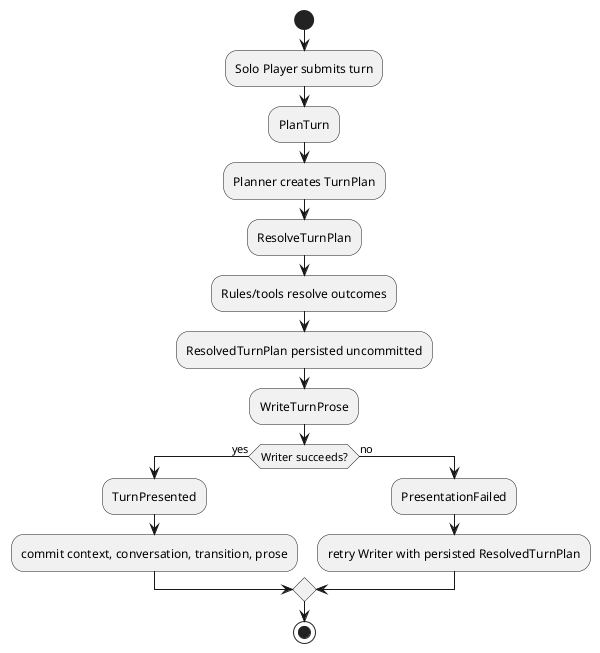

# Architecture Spec: Planner와 Writer 분리 GM 턴 생성

## 1. Design Scope

| 항목 | 대상 |
| --- | --- |
| Product Spec | `docs/specs/product-spec.md` |
| Use Cases | UC-PLAN-001, UC-WRITE-001, UC-WRITE-002 |
| Domain | Adventure Runtime / AI Game Master |
| Bounded Contexts | Adventure Runtime, AI Game Master, Dice Roll, Character Management, Combat Map |
| Existing Services | `adventure-service`, `ai-game-master-service` |
| External Dependencies | AI provider, rule knowledge, tool saga |
| Affected Data | `RuntimeTurn`, `runtime_turn_json`, conversation, adventure context |

### 1.1 Current-state delta

- 현재 `RuntimePlanningPort.plan(RuntimePlanningRequest)`와 `GmAgentPort.plan(GmContextEnvelope)`는 decision fields와 `narration`을 하나의 `RuntimePlan`으로 생성한다.
- `RuntimePlanningRequest`/HTTP `GmContextEnvelope`는 story plan, evidence, scene, NPC state, conversation을 하나로 전달한다.
- `RuntimeTurnApplicationService`는 plan 검증, story progression, context/conversation 생성, `RuntimeTurn` 저장, world progress commit을 단일 흐름으로 수행한다.
- 목표는 public turn API·기존 replay contract를 유지하면서 내부 decision/presentation boundary를 추가하는 것이다.

## 2. Domain Flow

### 2.1 Event Storming Flow



### 2.2 Commands, Events, Policies

| 종류 | 이름 | Owner / Producer | 핵심 규칙 |
| --- | --- | --- | --- |
| Command | `PlanTurn` | Adventure Runtime | PlannerContext만 Planner에 제공 |
| Event | `TurnPlanned` | Planner | prose 없음 |
| Command | `ResolveTurnPlan` | Adventure Runtime | rules/tools·branch·tactical preparation 해결 |
| Event | `TurnResolved` | Adventure Runtime | immutable ResolvedTurnPlan 저장, 아직 미커밋 |
| Command | `WriteTurnProse` | Adventure Runtime → Writer | WriterContext만 제공 |
| Event | `TurnPresented` | Adventure Runtime | prose와 transition 원자 커밋 |
| Event | `TurnPresentationFailed` | Adventure Runtime | state 변화 없음 |
| Policy | `RetryPresentation` | Adventure Runtime | 같은 persisted plan으로 Writer만 retry |

### 2.3 Context visibility

| Context | 허용 데이터 | 금지 데이터 |
| --- | --- | --- |
| PlannerContext | input, world/scene/story/NPC/player knowledge, relevant memory, RAG, rule operations | 없음; Planner 판단 필요 범위 |
| WriterContext | ResolvedTurnPlan의 revealable facts/results, visible scene, relevant style/character, writing config | unrevealed StoryPlan, future events, hidden facts, hidden NPC motives, raw RAG, Planner reasoning |

## 3. DDD Architecture

### 3.1 Bounded Contexts

| Context | 책임 | Owned model/data |
| --- | --- | --- |
| Adventure Runtime | turn orchestration, resolution, persistence, commit/retry | RuntimeTurn, TurnPlan lifecycle |
| AI Game Master | Planner/Writer AI boundary, prompt/model invocation | Planner input/output, Writer prose |
| Dice Roll / Character / Combat Map | authoritative tool mutations | existing external state |

### 3.2 Aggregates and invariants

| Aggregate | Root | Commands | Invariants |
| --- | --- | --- | --- |
| Runtime Turn | `RuntimeTurn` | plan, resolve, present, retry presentation | one command id; resolved plan immutable; only presented turn commits transition/conversation |
| Adventure Session | existing adventure/context | preserve progress | Writer cannot mutate it |

| Rule | Owner | Enforcement |
| --- | --- | --- |
| Writer gets no hidden/future data | WriterContext factory | construction whitelist |
| Writer cannot cause tools/state mutation | Runtime orchestration | Writer port has prose-only output |
| retry never replans | RuntimeTurn state machine | retry loads persisted resolved plan |
| duplicate request returns existing result | RuntimeTurn repository/service | existing command-id replay |

### 3.3 State transitions

| Current | Command | Next | Persistence / effect |
| --- | --- | --- | --- |
| REQUESTED | PlanTurn | PLANNED | plan held for resolution |
| PLANNED | ResolveTurnPlan | RESOLVED_UNCOMMITTED | persist immutable resolved plan |
| RESOLVED_UNCOMMITTED | WriteTurnProse | PRESENTED | atomically persist prose + context/conversation/world transition |
| RESOLVED_UNCOMMITTED | Writer failure | PRESENTATION_FAILED_RETRYABLE | persist failure metadata; no transition |
| PRESENTATION_FAILED_RETRYABLE | retry Writer | PRESENTED or same failure | no Planner/Engine call |

## 4. Program Design

### 4.1 Components

| Component | Responsibility | Must not do |
| --- | --- | --- |
| `RuntimeTurnApplicationService` | lifecycle orchestration, idempotency, transaction boundary | build Writer prompt or allow Writer tools |
| `TurnPlannerPort` | produce decision-only `TurnPlan` | prose generation |
| `TurnPlanResolver` | execute authorized rule/tool saga; produce `ResolvedTurnPlan` | prose creation |
| `TurnWriterPort` | produce prose from `WriterContext` | see PlannerContext, mutate state, invoke tools |
| `WriterContextFactory` | whitelist Writer input | expose raw source/planner reasoning |
| AI GM Planner service | model-backed planning | writer presentation |
| AI GM Writer service | model-backed prose | planning or state actions |

### 4.2 Contracts

```java
interface TurnPlannerPort {
    TurnPlan plan(PlannerContext context);
}

interface TurnWriterPort {
    WriterProse write(WriterContext context);
}
```

| Contract | Input | Output | Error |
| --- | --- | --- | --- |
| `TurnPlannerPort.plan` | full PlannerContext | decision-only TurnPlan | retryable planning failure |
| `TurnPlanResolver.resolve` | TurnPlan + runtime state | ResolvedTurnPlan | tool/rule/branch failure |
| `TurnWriterPort.write` | minimal WriterContext | narration/dialogue prose only | PresentationFailure |

`TurnPlan` retains existing decision fields now spread across `RuntimePlan`: scene, NPC state, judgment/tool intent, branch/source selection, information policy, narrative intent. It excludes narration. `ResolvedTurnPlan` adds resolved tool/rule outcomes and commit-ready transition. `WriterProse` contains only presentation fields; no state delta, tool calls, citations chosen from raw evidence, or decision fields.

### 4.3 Compatibility projection

`RuntimePlan` remains API/persistence compatibility projection during migration:

| Existing consumer | Source after split |
| --- | --- |
| controller response narration | `WriterProse` |
| scene/NPC/judgment/branch fields | `ResolvedTurnPlan` |
| citations/warnings | resolved allowed facts / existing validation projection |
| idempotent replay | persisted presented `RuntimeTurn` |

Existing public `/messages`, `/gm-turns`, `/turns` contracts remain unchanged. No public Planner/Writer endpoint. Development-only authenticated internal read endpoints may expose persisted Planner/Writer artifacts for diagnosis; they are read-only and excluded from normal flow.

### 4.4 Dependency rules

| Allowed | Contract |
| --- | --- |
| Adventure app → AI GM | Planner/Writer ports |
| Adventure app → Dice/Character/Map | existing saga ports |
| AI GM Writer → model provider | Writer-only adapter |

| Forbidden | Reason |
| --- | --- |
| Writer → Runtime repositories/tool saga | no canonical mutation |
| WriterContextFactory → raw StoryPlan/RAG | hidden context isolation |
| public controller → Planner/Writer direct calls | preserve existing public turn API |

## 5. Technical Architecture

### 5.1 Service/module mapping

| Context | Service | Target package shape |
| --- | --- | --- |
| Adventure Runtime | adventure-service | `application.runtime`, `domain.runtime`, `infrastructure.integration` |
| AI Game Master | ai-game-master-service | Planner/Writer application services, API adapter, model adapters |

### 5.2 Synchronous flow

```plantuml
@startuml
actor Player
participant Adventure as adventure-service
participant Planner as AI Planner
participant Rules as Tool Saga
participant Writer as AI Writer
database DB
Player -> Adventure: existing turn API
Adventure -> Planner: PlannerContext
Planner --> Adventure: TurnPlan
Adventure -> Rules: resolve authorized operations
Rules --> Adventure: resolved outcomes
Adventure -> DB: save RESOLVED_UNCOMMITTED
Adventure -> Writer: WriterContext
Writer --> Adventure: WriterProse
Adventure -> DB: atomically commit turn/context/prose
Adventure --> Player: existing response
@enduml
```

### 5.3 Data ownership and schema

| Data | Owner | Change |
| --- | --- | --- |
| `runtime_turn_json` | Adventure Runtime | add versioned planner/resolved/presentation fields; support old combined RuntimePlan rows |
| command-id/replay metadata | Adventure Runtime | retain existing behavior |
| adventure context/conversation | Adventure Runtime | write only at presentation commit |
| Planner/Writer artifacts | Adventure Runtime | read-only development diagnostic projection |

Migration strategy: additive, versioned JSON fields. Legacy row deserialization maps existing `RuntimePlan` to presented compatibility projection. Do not remove old fields until all readers migrate.

## 6. Runtime Design

### 6.1 Transaction and recovery

| Transaction | Owner | Commit condition | Rollback / recovery |
| --- | --- | --- | --- |
| plan resolution | application service | ResolvedTurnPlan saved as uncommitted | tool/rule error → existing retryable failure |
| presentation commit | application service | WriterProse validates | atomically commit state/context/conversation/prose |
| presentation retry | application service | same command + resolved plan | no Planner/Engine invocation |

Tool saga ordering remains before Writer. Its existing idempotency/capability behavior remains authoritative. Writer does not receive tool capabilities.

### 6.2 Concurrency and idempotency

| Risk | Control |
| --- | --- |
| duplicate player command | existing command-id lookup returns persisted presented turn or resumes same uncommitted turn |
| concurrent Writer retry | turn-level ownership/optimistic state transition; one presentation commit |
| process crash after resolve | reload `RESOLVED_UNCOMMITTED`; invoke Writer only |
| process crash after commit | existing replay returns persisted completed result |

## 7. Error Handling

| Failure | Handling | State effect |
| --- | --- | --- |
| Planner invalid/fails | retryable planning failure | no resolved plan, no transition |
| resolver/tool failure | preserve existing saga error contract | no presentation |
| Writer timeout/invalid prose | `PRESENTATION_FAILED_RETRYABLE` | no context/conversation/world commit |
| Writer leaks impossible data | out of scope for Critic; prevent source exposure by context construction | no automatic fact promotion |
| legacy JSON failure | explicit migration/deserialization error; never silently discard turn | operator-visible failure |

## 8. Test Contract

- Planner contract test: no narration field; receives PlannerContext only.
- Writer contract test: serialized WriterContext lacks future StoryPlan, hidden facts/motives, raw RAG, Planner reasoning.
- Writer output test: output type cannot represent state delta/tool invocation.
- orchestration test: Planner → resolver → persist uncommitted → Writer → atomic commit.
- retry test: Writer failure then retry calls Writer only; same resolved plan; no duplicated tool saga/state/conversation.
- replay test: presented turn remains idempotent; legacy `RuntimePlan` row deserializes.
- AI GM endpoint test: separate Planner/Writer prompt payloads; Writer never receives prohibited fields.

## 9. File Change Map

| Path / area | Action | Responsibility |
| --- | --- | --- |
| `adventure/.../application/runtime/RuntimeTurnApplicationService.java` | Modify | split orchestration and commit sequence |
| `adventure/.../application/runtime/RuntimePlan.java` | Modify/deprecate projection | compatibility only |
| `adventure/.../application/runtime/TurnPlan*.java` | Add | decision/resolved/context models |
| `adventure/.../application/runtime/*PlannerPort.java`, `*WriterPort.java` | Add | separate seams |
| `adventure/.../infrastructure/integration/GmAgentRuntimePlanningAdapter.java` | Replace/split | Planner/Writer adapters; resolver remains Adventure-side |
| `adventure/.../domain/runtime/RuntimeTurn.java` | Modify | unresolved/presentation lifecycle persistence |
| `adventure/.../persistence/PostgresRuntimeTurnRepository.java` + migration | Modify/Add | additive versioned JSON storage |
| `ai-game-master-service/.../GmAgentController.java` | Modify | internal Planner/Writer handling; no public change |
| `ai-game-master-service/.../application` | Add | separate planner/writer services and prompts |
| runtime + AI GM tests | Modify/Add | context isolation, retry, replay, compatibility |

## 10. ADR Decision

No ADR. This is feature-local implementation architecture; durable system boundary remains existing Adventure Runtime → AI Game Master relationship.
