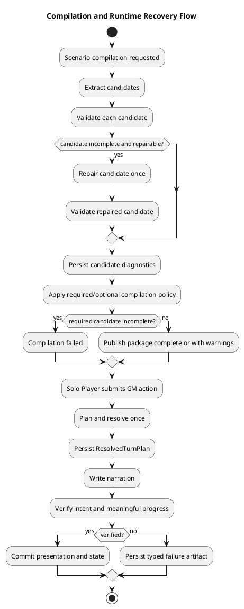
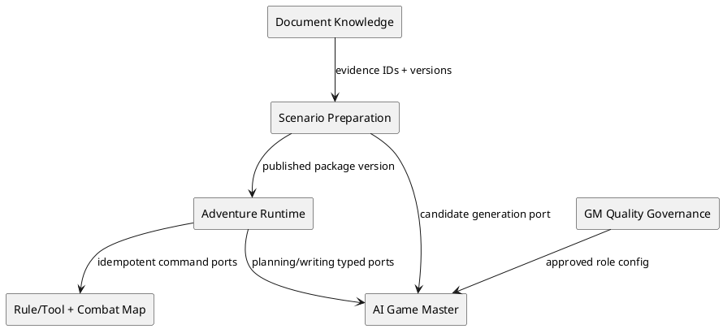
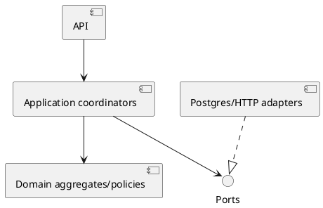

# Architecture Spec

# 1. Design Scope

## 1.1 Target

| 항목 | 대상 |
| --- | --- |
| Product Spec | `docs/specs/product-spec.md` |
| Use Cases | UC-001–UC-010 |
| Domain | Scenario compilation diagnostics/recovery, GM Turn lifecycle/failure/quality, tactical readiness/progress, prompt/model governance |
| Bounded Contexts | Scenario Preparation, Adventure Runtime, AI Game Master, GM Quality Governance |
| Existing Services | `adventure-service`, `ai-game-master-service`, `gm-eval-service`, `web-ui` |
| External Dependencies | Document Knowledge, Rule/Tool gateways, Combat Map, AI providers, PostgreSQL, Eval datasets |
| Affected Data | compilation jobs/candidates/packages, runtime turns/failures/artifacts, tactical jobs, prompt/model lineage |

## 1.2 Product Spec Mapping

| Product requirement | Architecture element |
| --- | --- |
| UC-001 candidate diagnostics | `ScenarioCompilation` + `CompilationCandidate` + `CandidateValidation` |
| UC-002 GM failure diagnostics | `RuntimeTurnFailureArtifact` + typed failure mapping |
| UC-003 Meaningful Progress | `MeaningfulProgressPolicy` + `NarrativeVerifierPort` |
| UC-004 tactical lazy preparation | `TacticalPreparationJob` + asynchronous worker + readiness policy |
| UC-005 progress | `PreparationProgress` value object + player projection |
| UC-006/007 resolved/presentation split | `RuntimeTurn` + `TurnResolutionCoordinator` + `PresentationCoordinator` |
| UC-008 diagnostics/legacy | read-only diagnostics + compatibility adapters |
| UC-009/010 quality governance | existing `gm-eval-service` registry, gates, tuning eligibility |

# 2. Domain Flow

## 2.1 Event Storming Flow



## 2.2 Commands

| Command | Actor | Target | Result |
| --- | --- | --- | --- |
| `CompileScenario` | Scenario worker | `ScenarioCompilation` | candidate diagnostics and outcome |
| `RepairCompilationCandidate` | repair policy | `CompilationCandidate` | one revised candidate or unchanged failure |
| `PublishScenarioPackage` | compiler | `ScenarioPackage` | immutable package version |
| `SubmitRuntimeTurn` | Solo Player | `RuntimeTurn` | existing/replayed or new lifecycle |
| `ResolveRuntimeTurn` | Runtime Authority | `RuntimeTurn` | persisted ResolvedTurnPlan |
| `PresentRuntimeTurn` | Runtime Authority | `RuntimeTurn` | verified response or typed failure |
| `EnsureTacticalPreparation` | stage-entry policy | `TacticalPreparationJob` | queued existing/new job |
| `ActivateTacticalScene` | Solo Player | current stage | activation or typed not-ready conflict |

## 2.3 Domain Events and Policies

| Event | Policy | Follow-up |
| --- | --- | --- |
| `CompilationCandidateValidated` | recoverability policy | repair once or finalize candidate |
| `CompilationCandidatesFinalized` | compilation outcome policy | publish, publish with warnings, or fail |
| `RuntimeTurnResolved` | resolve-before-present | start presentation from persisted result |
| `PresentationRejected` | retry classification | retry transient provider once; otherwise persist failure |
| `RuntimeTurnVerified` | commit policy | atomically commit player-visible result |
| `StoryPlanStageEntered` | tactical preparation policy | enqueue current-stage preparation |
| `TacticalPreparationCompleted` | readiness policy | allow activation |

## 2.4 External Interactions

| System | Boundary | Failure handling |
| --- | --- | --- |
| Document Knowledge | ID/version/source evidence | missing evidence is typed non-repairable validation |
| AI Game Master | candidate/prose provider port | provider-specific errors translated at adapter |
| Rule/Tool contexts | Runtime Command Saga | commandId idempotency; no blind replay |
| Combat Map | tactical preparation/activation ports | readiness and provider failure remain typed |
| Eval datasets/providers | offline quality ports | never execute in player request path |

# 3. DDD Architecture

## 3.1 Bounded Contexts

| Context | Responsibility | Owned model/data |
| --- | --- | --- |
| Scenario Preparation | candidate validation, repair, compilation policy, package publication | `ScenarioCompilation`, candidates, diagnostics, packages |
| Adventure Runtime | turn lifecycle, failure artifacts, meaningful progress, tactical readiness | runtime turns/artifacts, tactical jobs/read models |
| AI Game Master | stateless typed proposals and provider translation | provider DTO/audit only |
| GM Quality Governance | prompt/model Eval, approval, rollback, tuning gate | registry, immutable runs/reports |

## 3.2 Context Map



## 3.3 Aggregates

| Aggregate | Root | Entities | Invariants |
| --- | --- | --- | --- |
| Scenario Compilation | `ScenarioCompilation` | `CompilationCandidate` | one repair/candidate; outcome only after all candidates final |
| Scenario Package | `ScenarioPackage` | accepted resolution units/report projection | only final candidate data; immutable published version |
| Runtime Turn | `RuntimeTurn` | lifecycle/failure/presentation artifacts | resolve once; commit only verified presentation; replay by fingerprint |
| Tactical Preparation | `TacticalPreparationJob` | attempts/progress | one durable job per session+stage; only READY activates |
| Prompt Optimization | existing `PromptOptimizationRun` | candidates/splits/results | hard-first gate; immutable completed run |

## 3.4 Entities and Value Objects

| Type | Kind | Key fields/behavior |
| --- | --- | --- |
| `CompilationCandidate` | entity | candidateId/key, required, completeness, validation, recoverability, repairCount, raw/final refs |
| `CandidateValidation` | value object | stable code, message, recoverability |
| `CompilationOutcome` | value object/enum | COMPLETE, COMPLETE_WITH_WARNINGS, FAILED |
| `RuntimeTurnFailureArtifact` | append-only entity | failureCode, stage, retryable, rootCauseClass, correlationId, attempt |
| `MeaningfulProgress` | value object | non-empty set of accepted progress categories |
| `PreparationProgress` | value object | phase, completedUnits, optional totalUnits; derives optional percentage |
| `TacticalReadiness` | value object | state, stageId/position, activationAllowed, player-safe message |

## 3.5 Domain Services and Rule Ownership

| Service/policy | Responsibility |
| --- | --- |
| `CandidateValidator` | produce stable validation codes and candidate completeness |
| `CandidateRepairPolicy` | map codes to recoverability and permit one repair |
| `CompilationOutcomePolicy` | apply required/optional rules after all candidates finalize |
| `MeaningfulProgressPolicy` | verify player intent resolution and one progress category |
| `RuntimeTurnFailureClassifier` | convert stage-specific failures to internal artifact/retry decision |
| `TacticalPreparationStatePolicy` | compose job+scene state into readiness |

## 3.6 Aggregate State Transitions

| Aggregate | Transition | Guard |
| --- | --- | --- |
| Candidate | EXTRACTED → VALIDATED → REPAIRING → FINAL | repairCount ≤ 1 |
| Compilation | REQUESTED → RUNNING → PUBLISHED/WARNED/FAILED | outcome finalized; lease valid |
| RuntimeTurn | REQUESTED → PLANNING → RESOLVING → RESOLVED_UNCOMMITTED → WRITING → PRESENTED | public commit only at PRESENTED |
| RuntimeTurn | WRITING → PRESENTATION_FAILED_RETRYABLE → WRITING | only transient provider retry budget remains |
| TacticalJob | QUEUED → RUNNING → COMPLETE/FAILED_RETRYABLE | stage job identity stable |

# 4. Program Design

## 4.1 Program Structure



Dependency rule remains `ui → app → domain`; `app → ports`; `infra → ports`. Domain must not depend on Spring, DB, HTTP, provider DTOs, or UI percentage conventions.

## 4.2 Major Components

| Component | Responsibility | Must not do |
| --- | --- | --- |
| `ScenarioPackageCompilationService` | orchestrate validation and package projection | infer recoverability from message text |
| `ScenarioCompilationWorker` | claim/deliver job and classify infrastructure retry | retry deterministic package outcome |
| `TurnResolutionCoordinator` | plan and resolve once | generate narration |
| `PresentationCoordinator` | write, verify, safety-check, classify failure | rerun rules/tools |
| `RuntimeTurnApplicationService` | transaction orchestration and compatibility facade | contain provider-specific exception tree |
| `TacticalScenePreparationApplicationService` | enqueue/query/retry jobs | execute generation inline in request thread |
| `TacticalScenePreparationWorker` | claim and execute durable preparation | expose raw failure to player |

## 4.3 Interfaces and Signatures

```java
interface CompilationCandidateRepository {
    List<CompilationCandidate> findByCompilationId(UUID compilationId);
    void saveAll(UUID compilationId, List<CompilationCandidate> candidates);
}

interface CandidateRepairPort {
    ResolutionCandidate repair(ResolutionCandidate candidate, List<CandidateValidation> validation);
}

interface RuntimeTurnFailureRepository {
    void append(RuntimeTurnFailureArtifact failure);
    List<RuntimeTurnFailureArtifact> findByTurnId(UUID turnId);
}

interface TacticalPreparationCommandPort {
    TacticalReadiness ensure(UUID sessionId, int stagePosition);
    TacticalReadiness retry(UUID sessionId, int stagePosition);
}
```

## 4.4 Error Propagation

| Source | Internal failure | Retry | External result |
| --- | --- | ---: | --- |
| candidate validation | stable validation code | candidate repair ≤1 | package warning/failure |
| provider timeout/unavailable | `PROVIDER_*` at stage | 1 | stable retryable GM error |
| JSON/citation/judgment/narration | typed validation failure | 0 | stable non-auto-retried error |
| safety | safety failure artifact | 0 | safe alternative only if separately verified |
| version conflict | conflict artifact | 0 | refresh/retry instruction |
| tactical not ready | readiness conflict | 0 | structured 409 |

# 5. Technical Architecture

## 5.1 Service and Module Mapping

| Context | Service/module |
| --- | --- |
| Scenario Preparation | `adventure-service` scenario packages |
| Adventure Runtime | `adventure-service` runtime/storyplan packages |
| AI Game Master | `ai-game-master-service` |
| GM Quality Governance | existing `gm-eval-service` |
| Player projection | `web-ui` adventure-session feature |

No new deployment service. Scenario Preparation and Adventure Runtime remain separate internal boundaries inside `adventure-service` per ADR-002.

## 5.2 Data Ownership and Schema Changes

| Target | Change | Compatibility |
| --- | --- | --- |
| `scenario_compilation_candidate` | new additive table for candidate state/diagnostics/refs | old compilations have no candidate rows; report remains readable |
| scenario package report | add `CompilationOutcome`; retain tolerant reader for legacy `ResolutionStatus` | map legacy COMPLETE directly; preserve legacy PARTIAL/INVALID as historical outcome |
| runtime failure artifact | new append-only table or versioned JSON child collection | legacy GmTurn failure fields projected into typed read model where provable |
| tactical job | add phase/completed_units/nullable total_units; retain legacy progress reader | old integer progress maps to known-percent legacy phase |
| runtime/provider lineage | additive approved prompt/model/run references | absent lineage remains explicit legacy/unknown |

Candidate rows minimally contain: id, compilation_id, candidate_type/key, required, completeness, validation JSON, recoverability, repair_attempt_count, raw/final resolution refs, timestamps. Raw provider content is referenced, not duplicated into logs.

## 5.3 API Contracts

### Tactical activation conflict

```json
{
  "code": "TACTICAL_SCENE_NOT_READY",
  "stageId": "...",
  "stagePosition": 1,
  "state": "PREPARING"
}
```

### Progress projection

```json
{
  "phase": "TACTICAL_MAP_PREPARATION",
  "completedUnits": 2,
  "totalUnits": null,
  "percentage": null
}
```

Player APIs expose stable code, state, safe message, retry action. Internal diagnostics expose stage, recoverability/retryability, correlation and artifact metadata under existing internal authorization.

## 5.4 File Change Map

| Path/area | Action | Responsibility |
| --- | --- | --- |
| `domain/scenario/ScenarioCompilation.java` | modify | candidate/outcome lifecycle identity |
| `domain/scenario/ScenarioCompilationReport.java` | modify | package-level outcome only |
| `domain/scenario/CompilationCandidate*.java` | add | candidate entity, completeness, validation, recoverability |
| `application/scenario/compilation/ScenarioPackageCompilationService.java` | split/modify | validator + outcome policy orchestration |
| `application/scenario/compilation/ScenarioCompilationWorker.java` | modify | transient delivery retry only |
| `infrastructure/persistence/PostgresScenarioCompilation*` | extend | candidate diagnostics storage |
| `application/runtime/RuntimeTurn.java` | evolve | canonical aggregate/failure references |
| `application/runtime/TurnResolutionCoordinator.java` | add/extract | resolve once |
| `application/runtime/PresentationCoordinator.java` | add/extract | writer/verifier/failure classification |
| `application/runtime/RuntimeTurnFailure*.java` | add/modify | typed append-only failures |
| `application/runtime/MeaningfulProgress*.java` | add | verifier policy/value object |
| `api/RuntimeTurnDiagnosticsController.java` | extend | typed read-only diagnostics/redaction |
| `api/AdventureController.java` | modify | route canonical RuntimeTurn; legacy projection only |
| `application/runtime/TacticalScenePreparationApplicationService.java` | modify | enqueue/query, no inline execution |
| `application/runtime/TacticalScenePreparationWorker.java` | add | durable async processing |
| `application/runtime/TacticalPreparationReadModel.java` | modify | phase/count/nullable total projection |
| `api/AdventureStoryPlanController.java` | modify | structured readiness error |
| `web-ui/.../AdventureSessionApi.ts` | modify | typed phase/readiness contracts |
| `web-ui/.../AdventureStoryPlanPage.tsx` | modify | determinate/indeterminate rendering |
| `gm-eval-service` registry/runtime adapter seam | extend | approved role lineage consumed by provider router |

# 6. Runtime Design

## 6.1 Transactions, Idempotency, Ordering

| Operation | Boundary | Idempotency/order |
| --- | --- | --- |
| candidate finalize | one compilation | candidate key + repair count; diagnostics saved before outcome |
| package publish | one compilation/package | publish once after final outcome |
| runtime resolve | one RuntimeTurn | commandId + turn fingerprint; persisted before presentation |
| presentation commit | RuntimeTurn + owned runtime state transaction | resolved fingerprint; one public commit |
| tactical ensure | session+stage | create-or-get durable job |
| tactical worker | job lease | claim token; restart unfinished jobs |

Compilation worker attempts count infrastructure delivery only. Candidate repair count lives on candidate and never increments compilation delivery attempt.

## 6.2 Partial Failure

| Failure | Persisted state | Recovery |
| --- | --- | --- |
| candidate repair provider fails | original candidate + repair artifact | transient provider retry once inside repair; then finalize incomplete |
| required candidate incomplete | all diagnostics + FAILED outcome | new compilation only after input/policy change |
| writer fails | ResolvedTurnPlan + failure artifact | transient provider retry once, no re-resolution |
| verifier rejects | resolved + typed failure | no automatic retry unless explicit safe rewrite policy applies |
| tactical worker stops | leased job/progress | lease recovery and resume/retry |

# 7. Error Handling and Recovery

## 7.1 Typed Failure Taxonomy

`RuntimeFailureStage`: PLANNING, RESOLUTION, PRESENTATION, CITATION_VERIFICATION, JUDGMENT_VERIFICATION, NARRATION_SAFETY, NARRATIVE_VERIFICATION, COMMIT.

`RuntimeFailureCode`: PROVIDER_TIMEOUT, PROVIDER_UNAVAILABLE, INVALID_PLANNER_RESPONSE, CITATION_VALIDATION_FAILED, JUDGMENT_VALIDATION_FAILED, NARRATION_SAFETY_FAILED, NARRATIVE_VERIFICATION_FAILED, NO_MEANINGFUL_PROGRESS, ADVENTURE_VERSION_CONFLICT.

Root-cause class is diagnostic metadata, not public contract. Raw exception messages/provider bodies are redacted.

## 7.2 Retry Policy

| Operation | Retry condition | Max additional attempts |
| --- | --- | ---: |
| candidate repair | `REPAIRABLE`/approved `MAYBE_REPAIRABLE` | 1 per candidate |
| compilation delivery | lease/DB/transient infrastructure only | existing bounded worker policy |
| GM provider call | timeout/unavailable | 1 |
| validation/verifier/safety/conflict | never automatic | 0 |
| tactical job | player/operator retry after FAILED_RETRYABLE | one new claimed attempt per explicit retry |

# 8. Security

- Public responses never include raw provider response, root-cause message, hidden story facts, raw RAG, planner reasoning, or internal failure artifact.
- Candidate diagnostics and runtime diagnostics require existing internal-service authentication and developer/operator authorization.
- WriterContext remains allow-list based. Writer and AI candidate providers have no persistence or domain-command authority.
- Prompt/tuning data requires provenance and quality gate; secrets and unclear-rights data are excluded.

# 9. Observability

| Signal | Required attributes |
| --- | --- |
| candidate validation metric | type, validationCode, completeness, recoverability, required |
| compilation outcome metric | outcome, requiredIncompleteCount, optionalIncompleteCount, repairCount |
| runtime failure metric | failureCode, stage, retryable, provider/model version |
| meaningful progress metric | category or NO_MEANINGFUL_PROGRESS |
| tactical preparation metric | phase, state, attempt, duration |
| trace correlation | compilationId/candidateId or sessionId/turnId/correlationId |

Alerts target repeated required candidate failures, provider transient exhaustion, no-meaningful-progress rate, tactical job lease stalls, and legacy/canonical GM lifecycle divergence.

# 10. Change Boundaries

## 10.1 Allowed

- Additive candidate/failure/progress persistence and compatibility readers.
- Internal application-service splits preserving public APIs.
- Typed internal failure and player-safe error projections.
- Canonical RuntimeTurn routing with explicit legacy adapter.

## 10.2 Forbidden

- Message-text-based recoverability.
- Deterministic candidate/validation failure as worker delivery retry.
- Writer or AI provider direct persistence/state mutation.
- Rule/tool replay during presentation retry.
- StoryPlan READY implying Tactical READY.
- Invented percentage when total is unknown.
- Eval/tuning execution in synchronous runtime path.

## 10.3 Conditional

- Legacy GmTurn schema deletion only after all readers/writers route through canonical RuntimeTurn and compatibility coverage passes.
- Dedicated quality deployment only if existing `gm-eval-service` boundary cannot meet offline workload.
- Backfill candidate diagnostics only when historical source artifacts make values provable; otherwise mark legacy unknown.

# 11. Verification Requirements

- Unit: validation-code/recoverability mapping, one-repair invariant, required/optional outcome matrix, MeaningfulProgress categories, failure classifier/retry matrix, tactical readiness/progress projection.
- Integration: candidate diagnostics schema/repository, package legacy compatibility, runtime failure artifact append/read, canonical/legacy runtime projection, tactical lease recovery.
- Contract: candidate/provider typed ports, public GM error redaction, structured tactical 409, nullable progress total/percentage, diagnostics authorization.
- System/E2E: partial optional package publishes with warnings; required incomplete fails without worker loop; provider transient retries once; deterministic GM failure does not retry; empty-progress narration rejects; stage entry prepares then activates when READY; unknown total renders indeterminate.
- Existing tests to extend: `ScenarioPackageCompilationServiceTest`, `ScenarioCompilationWorkerTest`, `PostgresScenarioCompilationRepositoryIntegrationTest`, `RuntimeTurnApplicationServiceTest`, `RuntimeTurnFailurePersistenceTest`, `RuntimeTurnCompatibilityTest`, `TurnWriterContractTest`, `TacticalPreparationStatePolicyTest`, `TacticalScenePreparationApplicationServiceTest`, `TacticalMapActivationApplicationServiceTest`, `AdventureSessionControllerTacticalStartTest`, `TacticalScenePreparationProgress.test.tsx`, `backend-potent-brew-tactical.spec.ts`.
- Compatibility: existing public turn response, old ScenarioPackage report JSON, legacy RuntimeTurn/GmTurn rows, and old integer tactical progress remain readable during migration.
