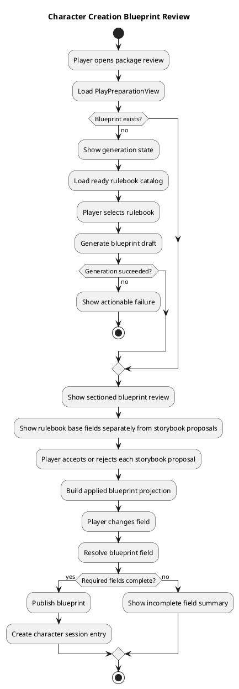
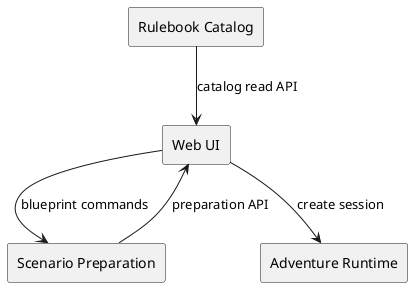
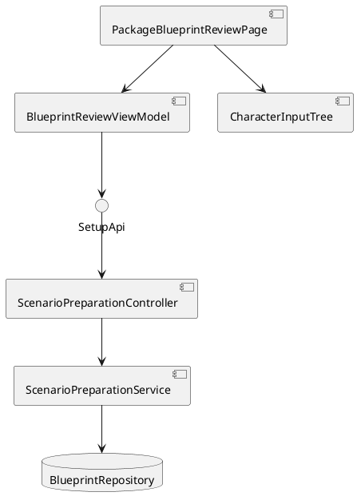
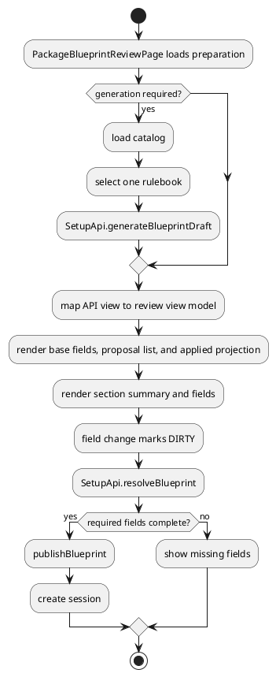

# Architecture Spec

# 1. Design Scope

## 1.1 Target

| 항목 | 대상 |
|---|---|
| Product Spec | `docs/specs/product-spec.md` |
| Use Cases | UC-01~UC-07 |
| Domain | 캐릭터 생성 설정 검토·저장·게시 |
| Bounded Contexts | Scenario Preparation, Rulebook Catalog, Web UI |
| Existing Services | `adventure-service`, `web-ui` |
| External Dependencies | PostgreSQL, rulebook catalog API |
| Affected Data | `CharacterCreationBlueprint`, `PlayPreparationView`, blueprint revision |

## 1.2 Product Spec Mapping

| Product Spec 항목 | Architecture 요소 |
|---|---|
| 3단계 흐름 | `PackageBlueprintReviewPage` 상태 기반 화면 단계 |
| 룰북 자동 선택 | `/api/v1/rulebook-catalog` read model |
| 룰북·스토리북 분리 검토 | `BlueprintReviewViewModel`의 base fields/proposals/applied projection |
| 제안별 적용·제외 | `StorybookProposalView`와 proposal decision adapter |
| 설정 생성 실패 일관성 | `CharacterCreationBlueprint` 상태와 UI rendering gate |
| 섹션별 완료율 | `CharacterInputTree` 입력 상태 집계 |
| 항목 저장 상태 | `resolveBlueprint` 호출 상태 어댑터 |
| 게시 전 검증 | `publishBlueprint` precondition과 UI validation summary |
| 내부 용어 제거 | UI view-model label mapper |

# 2. Domain Flow

## 2.1 Event Storming Flow

## 2.2 Commands

| Command | Actor | Target | Input | Preconditions | Result |
|---|---|---|---|---|---|
| GenerateBlueprintDraft | Player | Scenario Preparation | package ID, catalog rulebook ID, extraction version | package owned, rulebook READY | blueprint draft or failure |
| ResolveBlueprintField | Player | CharacterCreationBlueprint | package ID, field key, value, expected revision | field exists, revision matches | updated blueprint revision |
| AddBlueprintChild | Player | CharacterCreationBlueprint | parent ID, key, label, expected revision | parent editable, key valid | updated blueprint revision |
| PublishBlueprint | Player | CharacterCreationBlueprint | package ID | all required fields resolved, blueprint READY | PUBLISHED blueprint |
| CreateCharacterSession | Player | Adventure Session | package ID, blueprint revision | blueprint PUBLISHED | session draft |

## 2.3 Domain Events

| Domain Event | Producer | Trigger | Payload | Consumers |
|---|---|---|---|---|
| BlueprintDraftGenerated | Scenario Preparation | draft generation succeeds | package ID, revision, status | web UI |
| BlueprintFieldResolved | CharacterCreationBlueprint | field value accepted | field key, revision | web UI |
| BlueprintPublished | CharacterCreationBlueprint | publish succeeds | package ID, revision | session flow |

## 2.4 Policies

| Policy | Trigger Event | Decision | Emitted Command | Owner |
|---|---|---|---|---|
| AutoSelectSingleRulebook | catalog loaded | exactly one READY rulebook | GenerateBlueprintDraft after user confirmation or automatic start | web UI |
| KeepStorybookProposalsUnapplied | storybook candidates loaded | proposal has not been accepted | keep proposal outside applied blueprint | Web UI / Scenario Preparation |
| RequireProposalDecisionBeforePublish | publish requested | undecided proposals exist | block publish and show undecided list | Scenario Preparation |
| ShowStorybookEmptyOrFailureState | extraction completed or failed | no proposals or unusable evidence | show document-scoped empty/failure state | Web UI |
| BlockPublishWithMissingRequiredFields | publish requested | unresolved required fields exist | none; return validation failure | Scenario Preparation |
| RefreshAfterRevisionConflict | revision conflict | server has newer revision | reload preparation and mark local dirty fields | web UI |

## 2.5 Read Models

| Read Model | Consumer | Source | Fields | Owner |
|---|---|---|---|---|
| PlayPreparationView | review page | scenario package preparation API | status, blockers, blueprint, character limit | adventure-service |
| RulebookCatalogView | rulebook selector | catalog API | display name, edition, ID, extraction version, status | rulebook catalog |
| StorybookProposalView | review page | preparation API / adapter | proposal ID, source document, label, description, quote, evidence, decision | adventure-service + web-ui |
| BlueprintReviewViewModel | UI | PlayPreparationView + proposal state | base fields, proposals, applied fields, sections, labels, completion counts, save states | web-ui |

## 2.6 External Interactions

| External System | Trigger | Input | Output | Failure |
|---|---|---|---|---|
| Rulebook Catalog API | page load | none | READY rulebooks | empty state |
| Scenario Preparation API | generate/resolve/publish | package and blueprint command | updated blueprint | localized error state |
| Adventure Session API | create character flow | package and blueprint revision | session ID | retryable message |

## 2.7 Hotspots

| Hotspot | Options | Decision |
|---|---|---|
| Completion percentage source | backend exact progress / UI aggregate | UI aggregate from required and visible fields for initial version |
| Save strategy | per-field / whole form | retain per-field API and expose explicit per-field state |
| Proposal persistence | merge immediately / stage decision | stage proposal decisions and include only accepted proposals in applied projection; publish remains the server authority |
| Add custom child UI | browser prompt / inline dialog | replace prompt with accessible dialog in a later P1 slice |
| Section navigation | nested accordion only / summary navigation | summary navigation plus collapsible sections |

# 3. DDD Architecture

## 3.1 Bounded Contexts

| Bounded Context | Responsibility | Owned Model | Owned Data |
|---|---|---|---|
| Scenario Preparation | generate, resolve, validate, publish blueprint | `CharacterCreationBlueprint`, `PlayPreparationView` | blueprint and revision tables |
| Rulebook Catalog | expose usable rulebook revisions | catalog read model | catalog revision metadata |
| Web UI | compose review flow and local interaction state | `BlueprintReviewViewModel` | none; transient browser state |
| Adventure Runtime | create session after publication | adventure session | session data |

## 3.2 Context Map

## 3.3 Aggregates

| Aggregate | Root | Responsibility | Commands | Invariants |
|---|---|---|---|---|
| CharacterCreationBlueprint | blueprint | own fields, revision, diagnostics, publication state | resolve, add child, publish | revision match; required fields before publish; published immutable |
| ScenarioPackage | package | provide preparation context and blockers | read preparation | package owned and available |
| AdventureSession | session | start character creation/play flow | create draft | blueprint must be published |

## 3.4 Entities and Value Objects

| Type | Kind | Responsibility |
|---|---|---|
| `CharacterInputNode` | Entity | field identity, parent, value, input mode, diagnostics |
| `StorybookProposal` | Entity | storybook-derived candidate, source evidence, and user decision |
| `ProposalDecision` | Value/state | `UNDECIDED`, `APPLIED`, `EXCLUDED`, `NEEDS_EVIDENCE` |
| `CharacterCreationBlueprintStatus` | Value/state | `DRAFT`, `NEEDS_REVIEW`, `READY`, `PUBLISHED` semantics |
| `BlueprintRevision` | Value object | optimistic concurrency boundary |
| `BlueprintReviewViewModel` | UI model | translate internal node state into labels, sections, completion, save status |

## 3.5 Business Rule Ownership

| Business Rule | Owner | Enforcement Point |
|---|---|---|
| only owned package can be edited | application service | `ScenarioPreparationController` + service |
| expected revision must match | aggregate/service | `resolveBlueprint`, `addBlueprintChild` |
| required fields must be resolved before publish | aggregate | `publishBlueprint` |
| only accepted storybook proposals enter applied configuration | application service/aggregate | proposal decision projection and `publishBlueprint` |
| proposal without source evidence cannot be applied | application service | proposal validation before apply/publish |
| published blueprint is immutable | aggregate | blueprint transition methods |
| only published blueprint starts session | runtime application service | session creation command |

## 3.6 State Transitions

| Current | Command/Event | Next | Owner | Preconditions |
|---|---|---|---|---|
| absent | GenerateBlueprintDraft | NEEDS_REVIEW or failure | Scenario Preparation | usable rulebook |
| NEEDS_REVIEW | ResolveBlueprintField | NEEDS_REVIEW | Blueprint | revision matches |
| NEEDS_REVIEW | PublishBlueprint | PUBLISHED | Blueprint | required fields complete |
| PUBLISHED | CreateCharacterSession | session DRAFT | Adventure Runtime | published revision |

# 4. Program Design

## 4.1 Program Structure

## 4.2 Major Components and Responsibilities

| Component | Responsibility | Must Not Do |
|---|---|---|
| `PackageBlueprintReviewPage.tsx` | page state, step rendering, user messages, command orchestration | domain validation or raw API error rendering |
| `StorybookProposalList.tsx` | source-grouped proposal cards, evidence, apply/exclude actions, empty/failure states | direct persistence or blueprint publication decisions |
| `CharacterInputTree.tsx` | section and field presentation, value events | persistence or publication decisions |
| `SetupApi.ts` | typed HTTP contracts and error translation | UI layout decisions |
| `ScenarioPreparationController` | authenticated command boundary | label formatting |
| `ScenarioPreparationApplicationService` | load aggregate, apply command, persist | browser-specific state |
| `CharacterCreationBlueprint` | transitions and invariants | HTTP or UI concerns |

## 4.3 Application Flow

## 4.4 Component Call Contracts

| Order | Caller | Callee | Operation | Output | Failure |
|---:|---|---|---|---|---|
| 1 | page | `getPlayPreparation` | load package state | preparation view | translated load error |
| 2 | page | catalog API | load READY rulebooks | catalog list | empty/error state |
| 3 | page | `generateBlueprintDraft` | create settings | blueprint view | actionable generation error |
| 4 | field | `resolveBlueprint` | save value + revision | updated blueprint | field save error or conflict |
| 5 | page | `publishBlueprint` | publish settings | published blueprint | missing field/conflict error |
| 6 | page | session API | create draft session | session ID | retryable session error |

## 4.5 Major Types

| Type | Kind | Responsibility |
|---|---|---|
| `PlayPreparationView` | DTO | package readiness and blueprint payload |
| `CharacterCreationBlueprintView` | DTO | status, roots, diagnostics, revision |
| `CharacterInputNodeView` | DTO | field metadata and nested children |
| `StorybookProposalView` | DTO/UI type | source document, proposal content, evidence, decision, applyability |
| `BlueprintReviewViewModel` | UI type | base fields, proposals, applied fields, user labels, section counts, dirty/save states |
| `SaveState` | UI state | DIRTY, SAVING, SAVED, ERROR |

## 4.6 File and Test Seams

- Page: `src/web-ui/src/features/character/PackageBlueprintReviewPage.tsx`
- Tree: `src/web-ui/src/features/character/CharacterInputTree.tsx`
- API: `src/web-ui/src/features/rulebooks/SetupApi.ts`
- Backend boundary: `src/adventure-service/src/main/java/com/dndmaster/adventure/api/ScenarioPreparationController.java`
- Blueprint domain: `src/adventure-service/src/main/java/com/dndmaster/adventure/domain/scenario/CharacterCreationBlueprint.java`
- Existing page tests: `src/web-ui/src/features/character/PackageBlueprintReviewPage.test.tsx`

## 4.7 Risks and Migration Notes

- Existing API exposes raw status and diagnostics; label translation must remain UI-only and preserve machine-readable values for logic.
- Existing API does not currently expose a first-class proposal collection; the adapter or preparation DTO must provide source-grouped proposals without forcing the UI to infer them from diagnostic strings.
- Proposal decisions must be represented separately from resolved blueprint values so an unapplied suggestion cannot leak into the published configuration.
- Existing per-field commands use revision numbers; a central form submit would weaken the current concurrency boundary and is out of scope.
- The current add-child flow uses `window.prompt`; replacing it requires a focused dialog component and validation contract.
- Completion counts depend on node metadata. Required/optional semantics must be explicit before blocking publish.
- A storybook with no candidates, failed extraction, or missing evidence must be distinguishable; an empty proposal list must not be treated as successful extraction without a status and source-document summary.
- Existing character creation routes and published blueprint contracts remain unchanged.

## 4.8 Existing Route and Persistence Constraints

- `/scenario-packages/{packageId}/character-blueprint` is the package-level review entry point wired to `PackageBlueprintReviewPage`.
- `/sessions/{sessionId}/character-blueprint` currently enters the session-level character flow; the redesign must not silently change this route's session ownership semantics.
- `CharacterBlueprintReviewPage.tsx` is an alternate, currently unrouted review implementation. It must either be retired or explicitly made the shared review component before implementation tickets are created.
- `CharacterInputTree.tsx` currently infers grouping from field-key prefixes. Section completion counts require either a stable UI grouping adapter or explicit section metadata in `CharacterInputNodeView`; the first implementation should prefer an adapter to avoid changing blueprint persistence.
- Blueprint JSON and revision history are persisted by `PostgresScenarioPackageRepository` in the existing scenario package blueprint tables. The UX redesign does not introduce a second draft store.
- Existing API contracts remain the source of truth: `getPlayPreparation`, `generateBlueprintDraft`, `resolveBlueprint`, `addBlueprintChild`, and `publishBlueprint`.
