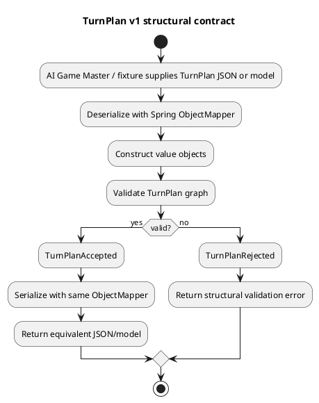
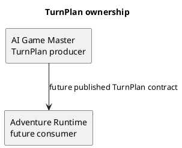
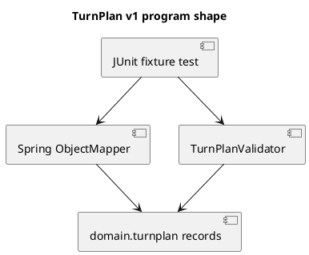

# Architecture Spec: TurnPlan structured narrative IR

## 1. Design Scope

### 1.1 Target

| Item | Target |
| --- | --- |
| Product Spec | `docs/specs/product-spec.md` |
| Use cases | UC-TP-001~004 |
| Domain | GM Turn planning |
| Bounded context | AI Game Master |
| Existing service | `ai-game-master-service` |
| External dependencies | Spring-managed Jackson `ObjectMapper` only |
| Affected data | in-memory TurnPlan JSON; test fixtures only |

TurnPlan belongs to AI Game Master: GM creates it after receiving a player action and before producing a player-facing response. It is a candidate/proposal model, consistent with ADR-002 and ADR-003. This slice creates neither endpoint nor runtime handoff, persistence, API projection, provider prompt flow, nor state mutation.

### 1.2 Product Spec Mapping

| Product item | Architecture |
| --- | --- |
| UC-TP-001 | immutable `TurnPlan` record graph; empty `resolutionRequests` valid |
| UC-TP-002 | `ResolutionRequest` expresses request only; no result fields/types |
| UC-TP-003, BR-TP-005~006 | `InformationPolicy` + `TurnPlanValidator` set disjointness/duplicate checks |
| UC-TP-004, BR-TP-010 | `StateEffect`, `StoryProgress` value objects; no command/persistence |
| BR-TP-002 | `schemaVersion` required exact string `"1"` |
| BR-TP-003, BR-TP-007~009 | record constructors validate local shape; validator checks graph invariants |
| acceptance fixtures | Jackson `ObjectMapper` fixture deserialize/validate/serialize tests |

---

## 2. Domain Flow

### 2.1 Event Storming Flow



### 2.2 Commands

No persisted command. `validate(TurnPlan)` is pure in-memory domain operation.

| Command | Actor | Target | Preconditions | Result |
| --- | --- | --- | --- | --- |
| ValidateTurnPlan | AI Game Master / test | TurnPlan | model constructed | accepted plan or structural errors |

### 2.3 Domain Events

None. This slice has no state transition, persistence, or integration event.

### 2.4 Policies

| Policy | Trigger | Decision | Owner |
| --- | --- | --- | --- |
| Information boundary | validation | reject forbidden/required or forbidden/revealable overlap | `TurnPlanValidator` |
| Representation boundary | construction/validation | reject prose/result-bearing contract fields by absence from typed model | typed records + Jackson binding |

### 2.5 Read Models

None. TurnPlan is a domain value graph, not persisted read model.

### 2.6 External Interactions

None. Spring `ObjectMapper` is injected test/application infrastructure, not remote interaction.

### 2.7 Hotspots

| Hotspot | Options | Decision |
| --- | --- | --- |
| Ownership | Adventure Runtime / AI Game Master | AI Game Master owns model |
| JSON | custom serializer/schema library / Jackson | Spring-injected Jackson `ObjectMapper` |
| Validation | controller / record constructors + validator | local shape in constructors; graph invariants in validator |
| State effects | close all D&D states / issue-shaped generic fields | `type`, `target`, `from`, `to`; no exhaustive enum |

---

## 3. DDD Architecture

### 3.1 Bounded Contexts

| Bounded Context | Responsibility | Owned Model | Owned Data |
| --- | --- | --- | --- |
| AI Game Master | create and structurally validate proposed per-turn meaning | `TurnPlan` and child value objects | in-memory candidate/JSON only |
| Adventure Runtime | later consumer; validates/commits runtime results | unchanged | unchanged |

### 3.2 Context Map



| Upstream | Downstream | Relationship | Contract | Translation |
| --- | --- | --- | --- | --- |
| AI Game Master | Adventure Runtime | future Published Language | TurnPlan JSON v1 | deferred |

### 3.3 Aggregates

No aggregate. TurnPlan has no identity lifecycle, repository, transaction, or persistence. It is immutable validated value graph.

### 3.4 Entities

No entities. `turnId` identifies source Turn context but does not create TurnPlan entity lifecycle.

### 3.5 Value Objects

| Value Object | Values | Validation | Behavior |
| --- | --- | --- | --- |
| `TurnPlan` | schema version, turn ID, six areas | required graph roots, version `"1"` | immutable composition |
| `PlayerIntent` | action, goal, targets | nonblank action/goal; nonempty targets | represents only player attempt |
| `ResolutionRequest` | type, ability/skill, target, reason | nonblank type/target/reason; optional ability/skill nonblank when present | expresses request, never result |
| `NarrativeIntent` | scene purpose, tone, pacing | non-null closed enums | expresses scene function, not prose |
| `InformationPolicy` | required/revealable/forbidden Fact IDs | nonblank and unique per collection | exposes policy collections |
| `StateEffect` | type, target, from, to | nonblank `type`/`target`; nullable `from`/`to` normalized/validated when present | describes intended effect only |
| `StoryProgress` | advance stage, triggered conditions | nonblank unique condition IDs | exposes current-plan signal |

`PlayerIntent.action`, target IDs, Fact IDs, state effect `type`, and Story condition IDs remain open normalized strings. `ResolutionType`, `ScenePurpose`, `NarrativeTone`, and `NarrativePacing` are small closed enums. No universal D&D action/state enum is introduced.

### 3.6 Domain Services

| Service | Responsibility | Input | Output |
| --- | --- | --- | --- |
| `TurnPlanValidator` | cross-object structural validation | `TurnPlan` | valid plan or deterministic validation exception/errors |

### 3.7 Business Rule Ownership

| Rule | Owner | Enforcement |
| --- | --- | --- |
| mandatory/nonblank local fields | each record | compact constructor |
| v1 schema version | `TurnPlan` | compact constructor |
| fact duplicates | `InformationPolicy` | compact constructor |
| fact set disjointness | `TurnPlanValidator` | `validate` |
| Story condition duplicates | `StoryProgress` | compact constructor |
| no resolution result / prose | TurnPlan type contract | no matching field; fixture JSON must not deserialize unknown fields |
| external reference existence excluded | no owner in v1 | deferred runtime integration |

### 3.8 Aggregate State Transitions

None.

### 3.9 Repository Boundaries

None. `RuntimeTurn`, `PostgresRuntimeTurnRepository`, and Story Plan persistence are explicit non-targets.

---

## 4. Program Design

### 4.1 Program Structure



### 4.2 Major Components and Responsibilities

| Component | Responsibility | Must Not Do |
| --- | --- | --- |
| `domain.turnplan` records/enums | immutable typed IR and local validation | generate prose, call provider, persist, mutate runtime state |
| `TurnPlanValidator` | graph invariants | evidence lookup, target lookup, Story Plan mutation |
| Spring `ObjectMapper` | standard JSON bind/serialize | custom semantic normalization/defaulting |
| fixture tests | contract regression | invoke GM provider or runtime flow |

### 4.3 Application Flow

No production application flow added. Fixture contract flow: load JSON → `ObjectMapper.readValue` → `TurnPlanValidator.validate` → `ObjectMapper.writeValueAsString` → deserialize/validate equivalent result.

### 4.4 Component Call Contracts

| Order | Caller | Callee | Operation | Output |
| ---: | --- | --- | --- | --- |
| 1 | test/future GM planner | Spring `ObjectMapper` | `readValue(json, TurnPlan.class)` | typed TurnPlan or Jackson error |
| 2 | test/future GM planner | `TurnPlanValidator` | `validate(plan)` | plan or structural validation error |
| 3 | test/future GM planner | Spring `ObjectMapper` | `writeValueAsString(plan)` | JSON v1 |

### 4.5 Major Types

| Type | Kind | Responsibility |
| --- | --- | --- |
| `TurnPlan` | domain record | v1 root contract |
| six child records | domain value objects | separated planning meanings |
| four enums | domain enums | limited stable categories |
| `TurnPlanValidator` | domain service | cross-value invariants |
| `TurnPlanValidationException` | domain error | deterministic invalid-plan report |

### 4.6 Type Design

#### `TurnPlan`

| Field | Type | Constraint |
| --- | --- | --- |
| `schemaVersion` | `String` | exact `"1"` |
| `turnId` | `String` | nonblank normalized ID |
| `playerIntent` | `PlayerIntent` | required |
| `resolutionRequests` | `List<ResolutionRequest>` | required, may be empty |
| `narrativeIntent` | `NarrativeIntent` | required |
| `informationPolicy` | `InformationPolicy` | required |
| `stateEffects` | `List<StateEffect>` | required, may be empty |
| `storyProgress` | `StoryProgress` | required |

#### `TurnPlanValidator`

| Behavior | Result |
| --- | --- |
| compare required vs forbidden Fact IDs | reject intersection |
| compare revealable vs forbidden Fact IDs | reject intersection |
| call/assume child local validation | no duplicate cross-logic |
| inspect external system | forbidden |

### 4.7 Interfaces and Function Signatures

```java
public final class TurnPlanValidator {
    public void validate(TurnPlan plan);
}
```

No port, controller, adapter, repository, message, or API interface added.

### 4.8 Error Propagation

| Failure Point | Source Error | Converted Error | Handler | Result |
| --- | --- | --- | --- | --- |
| Jackson fixture bind | malformed/type/unknown JSON field | Jackson exception | test | failing contract test |
| record construction | local shape violation | `IllegalArgumentException` | test/future caller | rejected candidate |
| validator | cross-field invariant violation | `TurnPlanValidationException` | test/future caller | rejected candidate |

### 4.9 State Transition Implementation

None. Validation is pure and does not persist/publish.

### 4.10 Dependency Rules

| Source | Target | Contract |
| --- | --- | --- |
| `api` / future application code | `domain.turnplan` | direct domain types |
| tests | Spring `ObjectMapper` | existing injected framework bean |
| `domain.turnplan` | Java standard library | collections/records/enums only |

`domain.turnplan` must not depend on Spring, Jackson, `RuntimePlan`, persistence, HTTP, provider adapters, or Adventure Story Plan repositories.

---

## 5. Technical Architecture

### 5.1 Service and Module Mapping

| Context | Component | Service | Module |
| --- | --- | --- | --- |
| AI Game Master | TurnPlan domain model/validator | `ai-game-master-service` | new `domain/turnplan` package |
| AI Game Master | fixtures/tests | `ai-game-master-service` | existing test module |

### 5.2 Service and Module Boundaries

| Module | Responsibility | Public Contract | Dependencies |
| --- | --- | --- | --- |
| `domain.turnplan` | stable internal v1 IR | Java typed model | JDK only |
| test resources | five canonical JSON examples | Jackson fixture payload | none |

### 5.3 System Interaction Flow

No service-to-service interaction added. Existing `/internal/v2/gm/agent-turns`, `GmAgentController`, `HttpGmAgentPort`, and `RuntimePlan` remain unchanged.

### 5.4 API, Messages, Persistence, Data Ownership

No API, message, storage schema, migration, data ownership, transaction, concurrency, idempotency, or external dependency change. `TurnPlan` data owner is AI Game Master only in memory/test assets.

### 5.5 File and Module Structure

```text
src/ai-game-master-service/
  src/main/java/com/dndmaster/aigamemaster/domain/turnplan/
    TurnPlan.java
    PlayerIntent.java
    ResolutionRequest.java
    NarrativeIntent.java
    InformationPolicy.java
    StateEffect.java
    StoryProgress.java
    ResolutionType.java
    ScenePurpose.java
    NarrativeTone.java
    NarrativePacing.java
    TurnPlanValidator.java
    TurnPlanValidationException.java
  src/test/java/com/dndmaster/aigamemaster/domain/turnplan/
    TurnPlanTest.java
    TurnPlanJsonContractTest.java
  src/test/resources/turnplan/
    observation.json
    perception-check.json
    information-asymmetry.json
    state-effect.json
    story-progress.json
```

| Path | Action | Responsibility |
| --- | --- | --- |
| `.../domain/turnplan/*.java` | add | model, enums, validation |
| `.../test/.../turnplan/*.java` | add | invariant/Jackson tests |
| `.../test/resources/turnplan/*.json` | add | five canonical fixtures |

---

## 6. Runtime Design

No runtime integration. No lock, transaction, retry, saga, ordering, or state commit. Future turn pipeline may create and consume TurnPlan, but this issue must not alter `GmAgentController` or call path.

---

## 7. Error Handling and Recovery

Structural errors are non-retryable input/contract failures in v1. No automatic correction, provider retry, persistence rollback, or compensation added. Future Planner orchestration owns retry/repair policy.

---

## 8. Security

No new entry point, auth, authorization, secret, or sensitive-data handling. Fact IDs must not be mistaken for player-visible prose; only later Writer/runtime policy may reveal text.

---

## 9. Observability

No production execution path added → no log, metric, trace, or alert change. Tests report invalid fixture path and invariant failure.

---

## 10. Change Boundaries

### 10.1 Allowed Changes

| Target | Allowed change |
| --- | --- |
| `ai-game-master-service/domain/turnplan` | add v1 model, enums, validator/error |
| ai-game-master-service tests/resources | add fixture and Jackson/invariant tests |

### 10.2 Forbidden Changes

| Target | Forbidden change |
| --- | --- |
| `adventure-service` RuntimePlan/runtime flow | any TurnPlan integration |
| `GmAgentController` and existing HTTP contracts | endpoint/request/response changes |
| migrations/repositories | persistence change |
| provider adapters/prompts | planner/writer orchestration |
| Rule Engine/character/map services | execution handoff/state commit |

### 10.3 Conditional Changes

| Target | Condition | Required decision |
| --- | --- | --- |
| `adventure-service` | consuming TurnPlan | separate handoff issue/spec |
| JSON version | v2 needed | explicit compatibility/migration policy |
| Fact/target resolution | runtime lookup needed | owning context contract |

---

## 11. Verification Requirements

### 11.1 Domain Verification

| Target | Verification |
| --- | --- |
| required root/child fields | constructor unit tests |
| schema version | reject absent/non-`"1"` values |
| information boundary | reject required∩forbidden and revealable∩forbidden |
| collection uniqueness | reject duplicate Fact/condition IDs |
| PlayerIntent boundary | model has no success/result/extra-action fields |
| resolution boundary | model has no roll/result/damage/status fields |
| Story boundary | only `advanceStage`/conditions; no Story Plan mutation API |

### 11.2 Program Verification

| Target | Verification |
| --- | --- |
| package isolation | domain source imports no Spring/Jackson/runtime classes |
| validator purity | tests show no external collaborator needed |
| no scope leakage | changed-file review excludes controllers/persistence/adventure-service |

### 11.3 Technical Contract Verification

| Contract | Test level | Verification |
| --- | --- | --- |
| five fixtures | JUnit + Spring `ObjectMapper` | deserialize → validate → serialize → deserialize equivalently |
| JSON field names | JSON contract test | lower camel case stable fields, `schemaVersion: "1"` |
| unknown final-prose/result fields | Jackson contract test | reject unknown fields; no silent acceptance |

### 11.4 Runtime and Recovery Verification

Not applicable. No production runtime path or recovery behavior changes.

---

## 12. Alternatives and Trade-offs

| Decision | Option | Result |
| --- | --- | --- |
| owner | put model in adventure runtime | Reject: conflates proposal with authoritative execution |
| owner | AI Game Master domain | Adopt: GM makes pre-response plan |
| reuse | extend `RuntimePlan` | Reject: requires prose and carries provider/citation/runtime fields |
| JSON | custom serializer/adapter | Reject: Spring Jackson already standard |
| validation | controller-only | Reject: non-HTTP fixtures/future planner need pure domain contract |
| state effects | exhaustive state enum | Reject: premature closure; runtime states not integrated |

---

## 13. Risks and Open Questions

### 13.1 Risks

| Risk | Impact | Mitigation |
| --- | --- | --- |
| future endpoint accidentally treats TurnPlan as player response | High | forbid controller/API integration in #203 |
| Jackson accepts unknown prohibited fields due to mapper config | High | explicit strict-deserialization fixture test; configure only if existing mapper is permissive |
| Fact IDs lack source ownership | Medium | scope preserves ID-only contract; define Fact registry/evidence mapping later |
| generic StateEffect grows uncontrolled | Medium | use only issue fields; add typed effects only with runtime owner decision |

### 13.2 Open Questions

| Question | Blocking | Resolution |
| --- | --- | --- |
| Who creates Fact IDs and resolves them to evidence/text? | No | Planner/runtime integration issue |
| How is TurnPlan handed to Rule Engine/Writer? | No | dedicated handoff issue |
| v2 compatibility/migration policy? | No | decide before v2 |

No blocking architecture question remains for #203.
