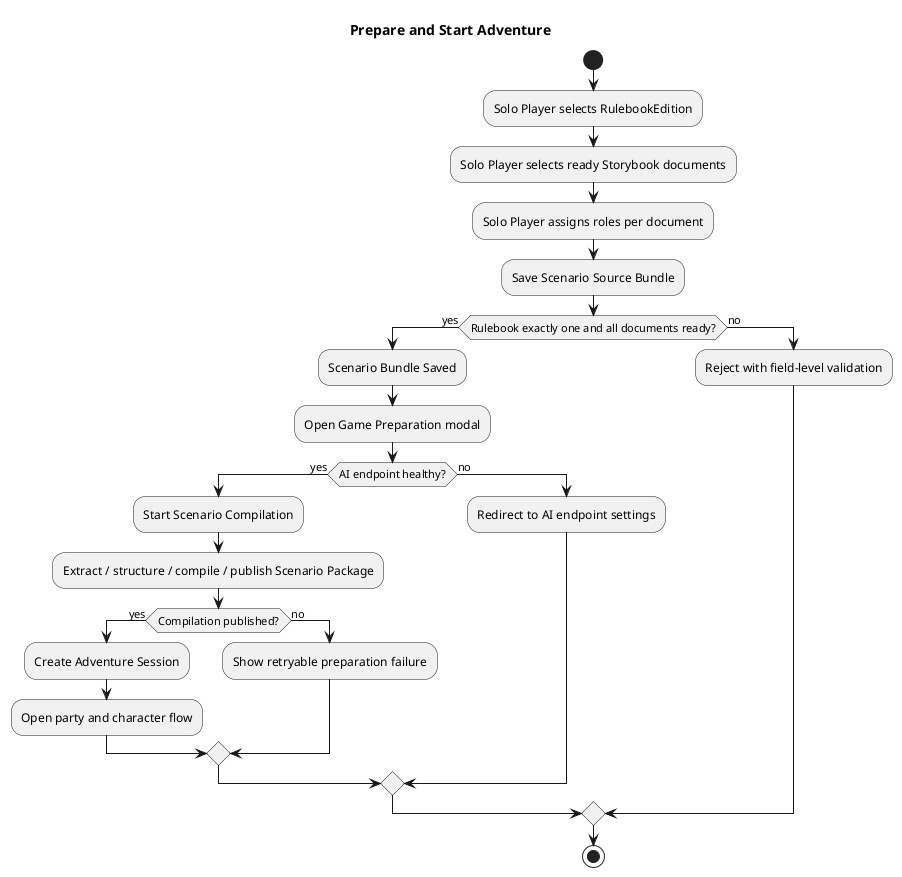
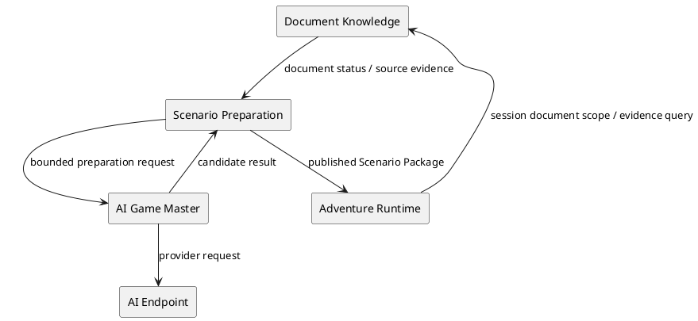
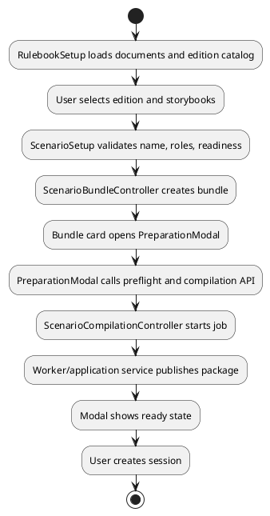

# Architecture Spec

# 1. Design Scope

## 1.1 Target

| 항목 | 대상 |
|---|---|
| Product Spec | `docs/specs/product-spec.md` |
| Use Cases | UC-01~UC-08 |
| Domain | 자료 준비, 모험 자료 구성, 게임 준비, 모험 세션 보호 |
| Bounded Contexts | Document Knowledge, Scenario Preparation, Adventure Runtime, AI Game Master |
| Existing Services | `rule-knowledge-service`, `adventure-service`, `web-ui` |
| External Dependencies | AI endpoint, PostgreSQL, 파일 저장소, 임베딩/추출 어댑터 |
| Affected Data | Knowledge Document, Scenario Source Bundle, Scenario Package, Adventure Session |

## 1.2 Product Spec Mapping

| Product Spec 항목 | Architecture 요소 |
|---|---|
| 룰북 별도 선택 | `RulebookEdition` 입력과 `ScenarioSourceBundle` 연결 |
| 파일별 역할 선택 | `ScenarioBundleDocumentSelection` |
| 비동기 자료 처리 | `RulebookProcessingWorker` 및 문서 상태 조회 |
| shadcn Progress | 웹 UI 상태 어댑터와 자료 처리 read model |
| 이름 있는 모험 자료 | `ScenarioSourceBundle.name` 및 API DTO |
| 게임 준비 팝업 | `ScenarioCompilation` 조회/폴링 상태 |
| 삭제 보호 | Scenario Bundle과 Adventure Session 간 참조 검사 |
| AI 연결 지연 | 게임 준비 명령의 preflight 검증 |

# 2. Domain Flow

## 2.1 Event Storming Flow



## 2.2 Commands

| Command | Actor | Target | Input | Preconditions | Result |
|---|---|---|---|---|---|
| `UploadStorybooks` | Solo Player | Document Knowledge | files, owner | accepted file type/size | documents queued |
| `SelectRulebookEdition` | Solo Player | Web UI draft | 5e/5.5e | exactly one | draft updated |
| `SelectScenarioDocuments` | Solo Player | Web UI draft | document IDs | document ready | draft updated |
| `AssignDocumentRole` | Solo Player | Web UI draft | document ID, role | document selected | draft updated |
| `CreateScenarioBundle` | Solo Player | Scenario Bundle | name, edition, selections | all invariants | bundle revision saved |
| `StartGamePreparation` | Solo Player | Scenario Package | bundle ID, endpoint | endpoint healthy | compilation started |
| `RetryDocumentProcessing` | Solo Player | Knowledge Document | document ID | retryable failure | document requeued |
| `DeleteScenarioBundle` | Solo Player | Scenario Bundle | bundle ID | no active session | bundle deleted |
| `ResumeAdventure` | Solo Player | Adventure Session | session ID | owner and resumable | session opened |

## 2.3 Domain Events

| Domain Event | Producer | Trigger | Payload | Consumers |
|---|---|---|---|---|
| `StorybookUploadAccepted` | Document Knowledge | upload accepted | document IDs | web UI |
| `DocumentProcessingStatusChanged` | Document Knowledge | worker state change | document ID, status, progress | web UI |
| `ScenarioBundleSaved` | Scenario Preparation | valid save | bundle ID, revision, name | setup UI, bundle list |
| `ScenarioCompilationStarted` | Scenario Preparation | preparation command | bundle ID, compilation ID | preparation modal |
| `ScenarioPackagePublished` | Scenario Preparation | compilation completed | package ID, bundle revision | session creation |
| `ScenarioBundleDeletionRejected` | Scenario Preparation | active session exists | bundle ID, session IDs | setup UI |

## 2.4 Policies

| Policy | Trigger Event | Decision | Emitted Command | Owner |
|---|---|---|---|---|
| `DocumentReadyForSelection` | processing status changed | only ready statuses are selectable | none | Document Knowledge contract |
| `MainScenarioCardinality` | role assignment | at most one main scenario | reject/update selection | Scenario Preparation |
| `BundleDeletionProtection` | delete request | reject when active session references bundle | `ScenarioBundleDeletionRejected` | Scenario Preparation |
| `PreparationEndpointPreflight` | preparation request | endpoint must be connected | redirect/failure | Scenario Preparation |

## 2.5 Read Models

| Read Model | Consumer | Source | Fields | Owner |
|---|---|---|---|---|
| `KnowledgeDocumentPreparationView` | setup UI | document registration/worker state | filename, type, status, progress, error, version | Document Knowledge |
| `ScenarioBundleSummaryView` | setup UI | scenario bundle | name, edition, revision, document count, preparation status | Scenario Preparation |
| `PreparationStatusView` | modal | compilation/package | stage, progress, retryability, failure message | Scenario Preparation |
| `AdventureSummaryView` | adventure list | adventure session | name, status, last activity, resumable | Adventure Runtime |

## 2.6 External Interactions

| External System | Trigger | Input | Output | Failure |
|---|---|---|---|---|
| File storage | upload/delete document | owner, document bytes | stored file/delete result | storage error |
| Extraction adapter | document queued | file reference | extracted spans/assets | extraction failure |
| Embedding/index adapter | extraction complete | chunks | index result | index failure |
| AI endpoint | game preparation preflight/compile | bounded preparation request | candidate/compile result | unavailable/auth expired |
| PostgreSQL | all durable commands | domain state | persisted state | conflict/constraint error |

## 2.7 Hotspots

| Hotspot | Options | Decision |
|---|---|---|
| Rulebook identity | catalog revision vs fixed edition value | Keep catalog revision as technical identity; expose only 5e/5.5e in UI and persist explicit edition on bundle. |
| Progress source | client estimate vs server stage | Server reports stage/status; UI maps stage to shadcn Progress. |
| Delete behavior | cascade vs block | Block when an active adventure references the bundle. |
| Preparation UI | route vs modal | Modal from each bundle card; preparation state remains server-owned. |

# 3. DDD Architecture

## 3.1 Bounded Contexts

| Bounded Context | Responsibility | Owned Model | Owned Data |
|---|---|---|---|
| Document Knowledge | 원본 파일, 추출, 인덱싱, 준비 상태 | Knowledge Document, Processing Job | rulebook/document, chunks, index |
| Scenario Preparation | 룰북·스토리북 조합, 역할, 컴파일, 패키지 발행 | Scenario Source Bundle, Scenario Package, Compilation | bundle, bundle revision, package, compilation |
| Adventure Runtime | 세션 생성·재개·진행, bundle 참조 보호 | Adventure Session, Runtime Binding | sessions, adventure state |
| AI Game Master | 제한된 자료를 사용한 후보/서술 생성 | provider request/result | provider-owned state only |

## 3.2 Context Map



## 3.3 Aggregates

| Aggregate | Root | Responsibility | Commands | Invariants |
|---|---|---|---|---|
| `KnowledgeDocument` | document registration | document lifecycle and readiness | upload, retry, delete | owner authorization; status transitions |
| `ScenarioSourceBundle` | bundle | named, revisioned source selection | create, revise, delete | exactly one rulebook edition; at least one storybook; one main scenario max; all selected docs ready |
| `ScenarioCompilation` | compilation | preparation job lifecycle | start, poll, retry | one active compilation per bundle revision; published package immutable |
| `AdventureSession` | session | playable adventure ownership and lifecycle | create, resume, complete | references immutable bundle/package; active session protects bundle deletion |

## 3.4 Entities and Value Objects

| Type | Kind | Constraint |
|---|---|---|
| `RulebookEdition` | value object/enum | `DND_5E_2014` or `DND_5E_2024`, UI labels `D&D 5판`/`D&D 5.5판` |
| `ScenarioBundleName` | value object | required, trimmed, length-limited |
| `ScenarioBundleDocumentSelection` | entity | document ID, role, source extraction version |
| `DocumentRole` | value object/enum | allowed scenario roles; RULEBOOK is not a storybook role |
| `PreparationStatus` | value object/enum | preparing, ready, failed, retryable |

## 3.5 Business Rule Ownership

| Business Rule | Owner | Enforcement Point |
|---|---|---|
| Exactly one rulebook edition | `ScenarioSourceBundle` | create/revise application service and domain validation |
| Main scenario max one | `ScenarioSourceBundle` | role selection validation |
| Selected documents must be ready | Scenario Preparation | document lookup gateway + bundle command |
| Active session blocks deletion | Scenario Preparation/Runtime policy | bundle application service before repository delete |
| Endpoint required for preparation | Scenario Preparation | preparation preflight |

## 3.6 Aggregate State Transitions

| Current | Command/Event | Next | Owner | Preconditions |
|---|---|---|---|---|
| queued | worker starts | processing | Knowledge Document | job accepted |
| processing | extraction/index succeeds | indexed/ready | Knowledge Document | all required stages succeed |
| processing | failure | failed | Knowledge Document | failure recorded |
| draft | create bundle | saved | Scenario Source Bundle | valid name, edition, selections |
| saved | start preparation | preparing | Scenario Compilation | endpoint preflight passes |
| preparing | publish | ready | Scenario Compilation | package validation passes |
| preparing | failure | failed | Scenario Compilation | retryability recorded |
| saved/ready | delete request + active session | unchanged | Scenario Bundle | deletion rejected |

## 3.7 Repository Boundaries

| Repository | Aggregate | Operations | Consistency Boundary |
|---|---|---|---|
| `KnowledgeDocumentRepository` | KnowledgeDocument | list, find, save, delete, status | document lifecycle |
| `ScenarioBundleRepository` | ScenarioSourceBundle | create, revise, find, list, delete | bundle revision |
| `ScenarioCompilationRepository` | ScenarioCompilation | start, find, update | compilation job |
| `AdventureSessionRepository` | AdventureSession | create, list, find, active references | session lifecycle |

# 4. Program Design

## 4.1 Major Components and Responsibilities

| Component | Responsibility | Must Not Do |
|---|---|---|
| `RulebookSetup` | 자료 목록, 룰북 선택, 업로드, Progress, 파일 선택 | bundle 규칙을 자체적으로 재구현하지 않음 |
| `ScenarioSetup` | 파일별 역할, 이름, 저장 검증 | 업로드/인덱싱 작업을 직접 실행하지 않음 |
| `PreparationModal` | 준비 상태 표시와 명령 실행 | 서버 상태를 임의 추정하지 않음 |
| `RuleKnowledgeController` | 문서 API 경계 | 시나리오 bundle 생성하지 않음 |
| `ScenarioBundleController` | bundle CRUD API 경계 | 파일 추출을 직접 수행하지 않음 |
| `ScenarioCompilationController` | 준비 시작/상태 조회 | 클라이언트용 상태 문구를 직접 조합하지 않음 |
| `ScenarioBundleApplicationService` | bundle 규칙과 삭제 보호 | UI 표현을 결정하지 않음 |
| `RulebookProcessingWorker` | 비동기 문서 처리 | bundle 저장을 수행하지 않음 |

## 4.2 Target Application Flow



## 4.3 Component Call Contracts

| Order | Caller | Callee | Operation | Failure |
|---:|---|---|---|---|
| 1 | `RulebookSetup` | Knowledge API | list/upload/status/delete | auth, validation, processing |
| 2 | `ScenarioSetup` | Bundle API | create/revise | invalid edition/role/readiness |
| 3 | `PreparationModal` | Preparation API | preflight/start/status | endpoint unavailable, compilation failed |
| 4 | `ScenarioBundleApplicationService` | Session repository | find active references | repository failure |
| 5 | Session UI | Adventure Session API | create/resume | package not playable |

## 4.4 API Contract Direction

### `POST /api/v1/scenario-bundles`

```json
{
  "name": "Most Potent Brew",
  "rulebookEdition": "DND_5E_2014",
  "documents": [
    {"knowledgeDocumentId": "...", "role": "MAIN_SCENARIO"},
    {"knowledgeDocumentId": "...", "role": "MAP"}
  ]
}
```

Errors:

- `400 BUNDLE_NAME_REQUIRED`
- `400 RULEBOOK_EDITION_REQUIRED`
- `400 INVALID_DOCUMENT_ROLE`
- `409 DOCUMENT_NOT_READY`
- `409 MAIN_SCENARIO_ALREADY_SELECTED`

### `DELETE /api/v1/scenario-bundles/{bundleId}`

Errors:

- `403 FORBIDDEN`
- `404 NOT_FOUND`
- `409 ACTIVE_ADVENTURE_REFERENCES_BUNDLE`

### `GET /api/v1/knowledge-documents/{id}/status`

The response must provide canonical processing status and, when available, stage and progress fields. The UI maps these to Korean labels and shadcn Progress without exposing backend enums as primary copy.

## 4.5 Status Mapping

| Backend state | UI state | Selectable | Save-eligible |
|---|---|---:|---:|
| `QUEUED` | 준비 대기 중 | no | no |
| `PROCESSING` | 자료 준비 중 | no | no |
| `EXTRACTED` | 내용 확인 필요 | no/confirmation path | no |
| `INDEXED` | 사용 준비 완료 | yes | yes |
| `PARTIAL_CONFIRMED` | 사용 준비 완료 | yes | yes |
| `FAILED` | 자료 준비 실패 | no | no |
| `REJECTED` | 자료 사용 불가 | no | no |

## 4.6 UI State Ownership

- Server owns document, bundle, compilation, package, and session states.
- `RulebookSetup` owns only current selection and upload draft state.
- `ScenarioSetup` owns only bundle draft state and field validation.
- `PreparationModal` owns open/closed presentation state; it reads preparation state from the API.
- Polling resumes whenever the server reports a non-terminal status, including after page reload.
- A closed modal does not cancel server-side preparation.

# 5. Technical Architecture

## 5.1 Service and Module Mapping

| Bounded Context | Program Component | Service | Module |
|---|---|---|---|
| Document Knowledge | upload/status UI and worker | `rule-knowledge-service` | `src/rule-knowledge-service` |
| Scenario Preparation | bundle and compilation APIs | `adventure-service` | `src/adventure-service` |
| Adventure Runtime | session list/resume/start | `adventure-service` | adventure/session modules |
| Presentation | setup/profile/adventure UI | `web-ui` | `src/web-ui` |

## 5.2 Existing Touchpoints

- UI: `RulebookSetup.tsx`, `ScenarioSetup.tsx`, `SetupApi.ts`, `SavedAdventurePanel.tsx`, `AiEndpointSettings.tsx`.
- Document API: `RuleKnowledgeController.java`, `RulebookPipelineApplicationService.java`, `RulebookProcessingWorker.java`.
- Bundle API: `ScenarioBundleController.java`, `ScenarioBundleApplicationService.java`, `ScenarioSourceBundle.java`, `ScenarioBundleRepository.java`.
- Preparation API: `ScenarioCompilationController.java`, `ScenarioPreparationController.java`, `ScenarioPreparationApplicationService.java`.
- Runtime protection: `AdventureSessionRepository` and its PostgreSQL implementation.

## 5.3 Data Changes

| Target | Action | Change |
|---|---|---|
| Scenario bundle aggregate | Modify | add required user-facing name and explicit rulebook edition |
| Bundle create/revise DTO | Modify | accept name, edition, storybook selections and roles |
| Bundle summary DTO | Modify | return name, edition label, status, document count |
| Bundle delete application service | Modify | check active adventure/session references before delete |
| Document status DTO | Modify | expose canonical stage/progress where available |
| API error contract | Modify | stable user-actionable error codes for readiness/conflict/preflight |

## 5.4 External Dependency Isolation

| Dependency | Port | Adapter | Conversion |
|---|---|---|---|
| Extraction engine | `RulebookContentExtractor` | extractor adapters | to document processing result |
| Embedding/index | `EmbeddingPort`/index port | vector adapters | to processing status |
| AI provider | agent endpoint port | Ollama/OpenAI/Codex adapters | to preflight/compile result |
| Storage | file storage port | local/filesystem adapter | to document file reference |

# 6. Runtime Design

## 6.1 Document Processing

1. Upload endpoint persists each file and returns a document ID immediately.
2. Worker transitions the document through queued and processing stages.
3. Extraction, chunking, embedding, and indexing update the document status.
4. UI polls all non-terminal documents, not only documents uploaded in the current browser session.
5. Terminal state is ready, failed, or rejected.

## 6.2 Game Preparation

1. UI requests endpoint preflight.
2. Server validates owner, bundle revision, document readiness, and endpoint availability.
3. Server creates or reuses an idempotent compilation for the bundle revision.
4. UI polls the compilation status until published or failed.
5. Published package is immutable and becomes the only input for session creation.

## 6.3 Idempotency and Concurrency

| Operation | Key/Control | Requirement |
|---|---|---|
| Upload | per-file idempotency key | duplicate upload must not create duplicate document |
| Bundle save | bundle revision/command key | repeated submission must not create unintended duplicate revision |
| Preparation | `bundleId + revision + endpoint configuration` | one active compilation per revision |
| Delete bundle | transaction plus active reference check | no deletion race with session creation |

# 7. Error Handling and Recovery

| Failure | Category | Retryable | Caller Result |
|---|---|---:|---|
| extraction/index failure | processing | yes | file-level `다시 처리` |
| document not ready | domain conflict | no until ready | save blocked with reason |
| endpoint unavailable | external/preflight | yes after settings fix | preparation blocked with settings action |
| compilation failure | preparation | usually yes | modal shows retry and detail |
| active adventure reference | domain conflict | no | deletion blocked with linked adventure summary |
| stale page state | consistency | yes | refresh/poll current server state |

All API failures require a stable error code, a Korean user message, and an optional technical detail that is hidden by default.

# 8. Security

| Entry Point | Authentication | Authorization |
|---|---|---|
| document upload/list/delete | player session | document owner |
| bundle create/revise/list/delete | player session | bundle owner |
| compilation start/status | player session | bundle owner |
| session create/resume | player session | session owner |
| AI endpoint settings | player session | profile owner |

Raw provider secrets must not be returned to the browser. Codex OAuth tokens remain server-side/local-runtime managed according to the existing endpoint boundary.

# 9. Observability

| Metric | Type | Labels |
|---|---|---|
| document processing duration | histogram | document type, file format, terminal status |
| document processing failures | counter | stage, reason |
| bundle save rejections | counter | reason |
| compilation duration | histogram | edition, result |
| compilation failures | counter | stage, retryable |
| deletion rejections | counter | active session count |

Every long-running operation should log owner-safe IDs, status transitions, attempt number, and correlation ID without logging document contents or secrets.

# 10. Change Boundaries

## 10.1 Allowed Changes

- Add bundle name and explicit rulebook edition to scenario bundle contracts and persistence.
- Add canonical processing/preparation status mappings.
- Replace native progress presentation with shadcn Progress.
- Move selection and preparation orchestration behind clear UI components.
- Add active-session reference check before bundle deletion.
- Add API errors for readiness, preflight, and deletion conflicts.

## 10.2 Forbidden Changes

- Do not merge multiple rulebooks into one bundle.
- Do not allow client-side rule resolution or package mutation.
- Do not delete active adventures as a side effect of bundle deletion.
- Do not make AI endpoint configuration a prerequisite for file upload or bundle save.
- Do not expose provider secrets, raw document contents, or raw internal error payloads by default.

# 11. Verification Requirements

## 11.1 Domain Verification

- Bundle rejects zero or multiple rulebook editions.
- Bundle rejects unready selected documents.
- Bundle rejects more than one main scenario.
- Bundle requires a nonblank name.
- Bundle deletion rejects an active adventure reference.

## 11.2 Program Verification

- UI selection state includes the fixed rulebook edition and storybook selections in the save request.
- File role changes remain per-document and survive save/reload.
- Polling resumes for pre-existing non-terminal documents after reload.
- shadcn Progress reflects server-reported processing stage/progress.
- Preparation modal can close and reopen without losing the server job.
- User-facing error mapping hides raw backend fields.

## 11.3 Technical Contract Verification

- Controller tests cover bundle name/edition request and validation errors.
- Repository/application tests cover active-session deletion conflict.
- Pipeline tests cover status progression and retry.
- Web tests cover save gating, role cardinality, progress rendering, and deletion messages.
- Integration tests cover published package to session creation.

## 11.4 Agent Verifier Criteria

- [ ] Product Spec IDs are implemented without widening scope.
- [ ] Rulebook cardinality is enforced in the domain/application boundary.
- [ ] Document readiness is checked server-side, not only by UI disabling.
- [ ] Active adventure deletion protection is server-side and transactional.
- [ ] Status and error contracts have stable mappings.
- [ ] Bundle revision/package immutability is preserved.
- [ ] Existing document processing and runtime bounded contexts remain separated.

# 12. Alternatives and Trade-offs

| Decision | Option | Result |
|---|---|---|
| Rulebook UI | merge into file roles | rejected: fixed game system should remain explicit |
| Rulebook identity | expose catalog revision | rejected for primary UI; retain internally |
| Progress | native progress estimate | rejected; use server stage and shadcn Progress |
| Bundle naming | UUID only | rejected; add required user-facing name |
| Delete protection | cascade active adventures | rejected; unsafe data loss |
| Delete protection | block with explanation | adopted |
| Endpoint timing | require before upload | rejected; unnecessary coupling |
| Endpoint timing | check at game preparation | adopted |

# 13. Risks and Open Questions

## 13.1 Risks

| Risk | Impact | Probability | Mitigation |
|---|---|---|---|
| edition identity differs between catalog and runtime | High | Medium | one explicit bundle edition plus adapter mapping |
| status mapping drifts | Medium | High | canonical contract and mapping tests |
| delete/session race | High | Medium | transactional reference check and integration test |
| UI remains an orchestration monolith | Medium | High | separate selection, upload status, bundle card, preparation modal components |
| existing bundles lack names | Medium | High | migration/default generated name and editable label |

## 13.2 Open Questions

| Question | Blocking | Resolution |
|---|---|---|
| Existing bundle name migration | No | generate a readable fallback from first main scenario filename |
| Exact 5e/5.5e catalog mapping | Yes for implementation | map UI edition to approved catalog revision server-side |
| Server progress granularity | No | start with stage-based percentage; add byte/page progress only if available |
| Active adventure definition | Yes for deletion | treat `CREATED`, `IN_PROGRESS`, and resumable non-terminal sessions as active |
