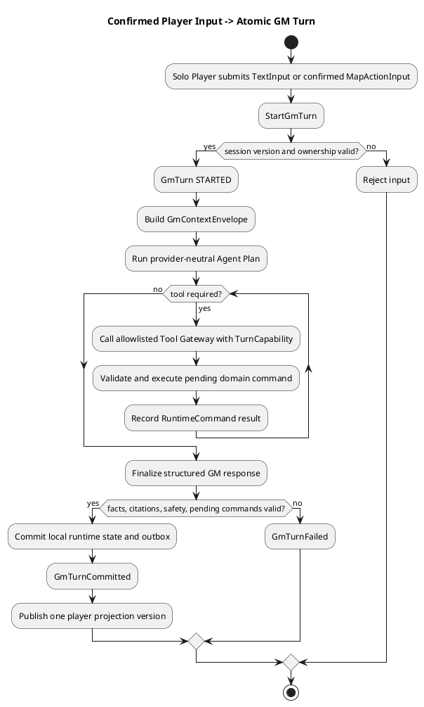
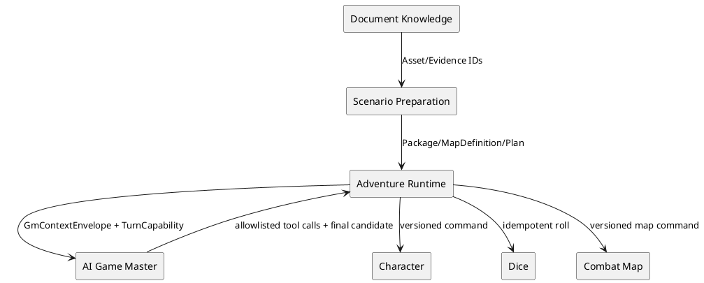
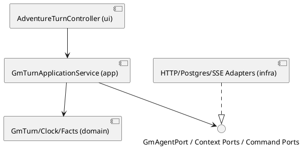

# Architecture Spec: AI Game Master Runtime

# 1. Design Scope

## 1.1 Target

| 항목 | 대상 |
|---|---|
| Product Spec | `docs/specs/product-spec.md` |
| Use Cases | UC-001~UC-011 |
| Domain | AI Game Master 기반 Solo Adventure Runtime |
| Bounded Contexts | Adventure Runtime, AI Game Master, Scenario Preparation, Document Knowledge, Character Management, Dice Roll, Combat Map |
| Existing Services | `adventure-service`, `ai-game-master-service`, `rule-knowledge-service`, `character-management-service`, `dice-roll-service`, `combat-map-service`, `web-ui` |
| External Dependencies | PostgreSQL, Ollama local model, OpenAI GPT provider, SSE client |
| Affected Data | runtime turn, story plan revision, committed facts, adventure clock, context checkpoint, map definition/binding, combat map visibility, session events |

## 1.2 Product Spec Mapping

| Product Spec 항목 | Architecture 요소 |
|---|---|
| UC-001, UC-002 | `GmTurnApplicationService`, provider-neutral `GmAgentPort`, `AdventureStoryPlanRevision` |
| UC-003 | `MapDefinition`, `StoryMapBinding`, `TacticalMapActivationPolicy` |
| UC-004, UC-005 | typed `MapActionInput`, `GmTurn` Saga, `CombatMapCommandPort` |
| UC-006 | `CombatMap` aggregate, `VisibilityPolicy`, player-safe `TacticalMapProjection` |
| UC-007 | `AdventureClock`, `GameTimePolicy`, `GameTimeAdvanced` |
| UC-008 | `GmTurn` commit marker, versioned projections, idempotent command journal |
| UC-009 | `GmContextCheckpointApplicationService`, `GmContextCheckpoint` |
| UC-010 | `MetaQuestionInput`; state-free GM outcome |
| UC-011 | `AdventureSession` ending transition |
| BR-001~BR-008 | `CommittedWorldFact`, evidence pack, response validator, narration safety |
| BR-009~BR-022 | `CombatMap`, map definitions, visibility and activation policies |
| BR-023~BR-026 | checkpoint barrier, provider-neutral model port, model quality gate |
| FR-001, FR-002 | pending Runtime Command Saga + player-visible atomic commit |
| FR-003~FR-007 | map fallback, projection guard, domain rejection, evidence failure mapping |
| FR-008~FR-010 | checkpoint rollback, command idempotency, ending confirmation |

---

# 2. Domain Flow

## 2.1 Event Storming Flow



## 2.2 Commands

| Command | Actor | Target | Input | Preconditions | Result |
|---|---|---|---|---|---|
| `StartGmTurn` | Solo Player | `GmTurn` | typed input, expected session version | owner, active session, no active turn | `GmTurnStarted` |
| `InvokeGmTool` | AI Game Master | Tool Gateway | capability, tool name, typed args | active turn, allowlist, scope | `RuntimeCommandPlanned/Rejected` |
| `ApplyCharacterCommand` | Adventure Runtime | Character Management | command/version | Saga step pending | applied/rejected outcome |
| `ExecuteDiceRoll` | Adventure Runtime | Dice Roll | immutable roll command | authorized turn | `DiceRolled` |
| `ApplyMapCommand` | Adventure Runtime | Combat Map | move/interact/reveal/time command | map/version valid | map outcome |
| `AdvanceGameTime` | AI Game Master via gateway | `AdventureClock` | proposed turns + evidence | rule-time validation | `GameTimeAdvanced` |
| `ReviseStoryPlan` | AI Game Master via gateway | `AdventureStoryPlanRevision` | unrevealed revision candidate | fact/source/rule validation | `StoryPlanRevised` |
| `CommitGmTurn` | Adventure Runtime | `GmTurn` | finalized response + command outcomes | all required steps terminal/successful | `GmTurnCommitted` |
| `CreateContextCheckpoint` | Compaction policy | `GmContextCheckpoint` | summary candidate + exact tail | no active turn, versions fresh | `ContextCheckpointCreated` |

## 2.3 Domain Events

| Domain Event | Producer | Trigger | Payload | Consumers |
|---|---|---|---|---|
| `GmTurnStarted` | `GmTurn` | accepted input | turn/session/input/version | Agent loop, observability |
| `RuntimeCommandCompleted` | Saga | tool command terminal | command/result/version | `GmTurn` |
| `GameTimeAdvanced` | `AdventureClock` | validated time change | before/after/turns/rule ref | Character, Combat Map, effects |
| `StoryPlanRevised` | Plan aggregate | valid revision | old/new revision, cause turn | Runtime planner |
| `WorldFactsCommitted` | Fact ledger | accepted outcome | facts + provenance | plan validator, checkpoint |
| `TacticalMapActivated` | Map binding policy | scene condition met | map definition/runtime map | UI projection |
| `GmTurnCommitted` | `GmTurn` | all invariants satisfied | response and projection versions | SSE outbox, compaction policy |
| `GmTurnFailed` | `GmTurn` | non-recoverable/retry exhausted | stable error, recovery state | UI, operations |
| `ContextCheckpointCreated` | Checkpoint aggregate | validated compaction | checkpoint/version/tail turn | next prompt builder |

## 2.4 Policies

| Policy | Trigger Event | Decision | Emitted Command | Owner |
|---|---|---|---|---|
| `PlanAdaptationPolicy` | unexpected input | revise only unrevealed plan, preserve facts | `ReviseStoryPlan` | Adventure Runtime |
| `GameTimePolicy` | resolved action | rulebook duration else 12 seconds/turn | `AdvanceGameTime` | Adventure Runtime |
| `MapActivationPolicy` | scene/fact/plan transition | activate matching map definition | `ActivateTacticalMap` | Adventure Runtime |
| `VisibilityPolicy` | map/time/fact change | compute current/explored/hidden + last seen | `UpdateMapVisibility` | Combat Map |
| `AtomicPublicationPolicy` | all Saga steps completed | publish only committed projection | `CommitGmTurn` | Adventure Runtime |
| `CompactionPolicy` | prompt estimate >= 70% | compact after turn barrier | `CreateContextCheckpoint` | Adventure Runtime |
| `ModelQualityPolicy` | evaluation report | local pass or configured provider switch | config change, not runtime command | Operations |

## 2.5 Read Models

| Read Model | Consumer | Source | Fields | Owner |
|---|---|---|---|---|
| `GmSessionProjection` | chat UI | committed turns/context/facts/clock | narration, state delta, citations, version | Adventure Runtime |
| `TacticalMapProjection` | map window | committed combat map + visibility | visible tokens/cells, explored cells, legend, version | Combat Map |
| `GmContextEnvelope` | AI agent | checkpoint + exact tail + versioned refs | prompt context and tool schemas | Adventure Runtime |
| `TurnStatusProjection` | both windows | `GmTurn` | status, stable error, session version | Adventure Runtime |

## 2.6 External Interactions

| External System | Trigger | Input | Output | Failure |
|---|---|---|---|---|
| Local Ollama | agent phase | structured context/tools | structured plan/final | timeout, malformed, quality failure |
| OpenAI GPT provider | configured agent phase | same contract | same structured output | timeout, rate limit, malformed |
| Rule Knowledge API | context build/tool | scoped intent query | evidence + provenance | retry or grounded failure |
| Character API | Saga tool | versioned command | structured outcome | rejection/conflict/retryable fault |
| Dice API | Saga tool | idempotent roll | immutable roll | timeout/replay |
| Combat Map API | Saga tool | versioned map command | map outcome/projection version | rejection/conflict/retryable fault |

## 2.7 Hotspots

| Hotspot | Options | Decision |
|---|---|---|
| plan mutability | overwrite / immutable / revisions | immutable linked revisions |
| distributed atomicity | 2PC / best effort / Saga | pending Saga + atomic publication |
| map candidate | persist preview / frontend-only | frontend-only until confirmation |
| agent access | general tools / allowlisted domain tools | allowlisted tool gateway + capability |
| update delivery | polling / WebSocket / SSE | HTTP command + SSE projection |
| compaction trigger | turns / tokens | provider token estimate at 70% |

---

# 3. DDD Architecture

## 3.1 Bounded Contexts

| Bounded Context | Responsibility | Owned Model | Owned Data |
|---|---|---|---|
| Adventure Runtime | GM Turn, plan revision, facts, clock, checkpoint, map activation, Saga | `GmTurn`, `AdventureClock`, `AdventureStoryPlanRevision`, `CommittedWorldFact`, `GmContextCheckpoint` | adventure runtime tables/outbox |
| AI Game Master | provider-neutral Plan/Act/Finalize agent loop | prompt/tool/output contracts | no adventure state; audit metadata only |
| Scenario Preparation | compile source-grounded runtime package and map definitions | `ScenarioPackage`, `MapDefinition` | package/version/map definitions |
| Document Knowledge | source documents, Source Span, assets, RAG | Knowledge Document/Asset/Evidence | document/extraction/index |
| Character Management | character state/invariants | `CharacterSheet` | character state/version |
| Dice Roll | immutable canonical rolls | `DiceRoll` | roll result/command journal |
| Combat Map | grid/tokens/doors/visibility/fog/last-seen | `CombatMap` | runtime map/version/command journal |

## 3.2 Context Map



| Upstream | Downstream | Relationship | Contract | Translation |
|---|---|---|---|---|
| Document Knowledge | Scenario Preparation | Customer/Supplier | asset + evidence API | IDs/versions only |
| Scenario Preparation | Adventure Runtime | Published Language | package/map/plan revision | runtime binding adapter |
| Adventure Runtime | AI Game Master | Customer/Supplier | agent loop + tool schema | provider-neutral DTO |
| Character/Dice/Combat Map | Adventure Runtime | ACL | domain command outcomes | Saga adapters |

## 3.3 Aggregates

| Aggregate | Root | Responsibility | Commands | Events | Invariants |
|---|---|---|---|---|---|
| GM Turn | `GmTurn` | one input and its pending/committed result | start, record command, finalize, fail | started/committed/failed | one active per session; commit only complete |
| Story Plan | `AdventureStoryPlanRevision` | immutable plan revision chain | create revision | revised | predecessor exists; facts not contradicted |
| Adventure Clock | `AdventureClock` | canonical session game time | advance | time advanced | monotonic; rule conversion recorded |
| Fact Ledger | `CommittedWorldFactSet` | structured committed facts | commit facts | facts committed | source turn committed; identity/version valid |
| Context Checkpoint | `GmContextCheckpoint` | validated compact context | create | checkpoint created | exact tail + fresh refs; no active turn |
| Combat Map | existing `CombatMap` | grid and player-safe visibility | move/interact/reveal/time | map changed | owner/control/version/visibility enforced |

## 3.4 Entities and Value Objects

| Type | Kind | Owner | Key state/validation |
|---|---|---|---|
| `GmInput` | sealed VO | GM Turn | `TextInput`, `MapActionInput`, `MetaQuestionInput` |
| `RuntimeCommand` | entity | GM Turn | commandId, tool, fingerprint, status, outcome |
| `TurnCapability` | signed/opaque VO | Adventure Runtime | session/turn/tools/expiry; one turn only |
| `CommittedWorldFact` | entity | Fact Ledger | subject/predicate/object, visibility, provenance, cause turn |
| `StoryMapBinding` | VO | Story Plan | stage/location/condition/mapDefinitionId |
| `GameDuration` | VO | Clock | turns/seconds/rule reference |
| `VisibilitySnapshot` | VO | Combat Map | current/explored/hidden cells, observed tokens |
| `LastSeenState` | VO | Combat Map | token, last position, expiresAt game time |

## 3.5 Domain Services and Rule Ownership

| Domain Service | Responsibility | Collaborators |
|---|---|---|
| `StoryPlanRevisionValidator` | reject revisions conflicting with facts/source/rules | Fact Ledger, package lock |
| `GmTurnCommitPolicy` | verify required Saga results and response consistency | GmTurn, runtime commands |
| `GameTimePolicy` | convert action duration using rules, fallback 12 sec/turn | Game System Definition |
| `VisibilityPolicy` | line-of-sight, explored state, hidden/reveal, last seen | CombatMap geometry/clock |
| `GmResponseValidator` | citations, tool refs, secret safety, state delta match | evidence, commands, projection |

## 3.6 Aggregate State Transitions

| Current | Command/Event | Next | Owner | Preconditions |
|---|---|---|---|---|
| none | `StartGmTurn` | `STARTED` | GmTurn | active session/version/no active turn |
| `STARTED` | agent begins | `PROCESSING` | GmTurn | valid capability |
| `PROCESSING` | retryable tool fault | `RECOVERING` | GmTurn | retry budget remains |
| `PROCESSING/RECOVERING` | `CommitGmTurn` | `COMMITTED` | GmTurn | every required step successful |
| non-terminal | terminal failure | `FAILED` | GmTurn | stable failure recorded |
| plan revision N | valid revision | N+1 | Story Plan | immutable predecessor/fact-safe |
| clock T | valid duration | T+n | Clock | monotonic |

## 3.7 Repository Boundaries

| Repository | Aggregate | Operations | Consistency Boundary |
|---|---|---|---|
| `GmTurnRepository` | GmTurn | find active/by IDs, insert, update | session turn transaction |
| `StoryPlanRevisionRepository` | Plan | current/history/save | revision append |
| `AdventureClockRepository` | Clock | load/save expected version | GM Turn local transaction |
| `CommittedWorldFactRepository` | Fact set | load current/append | GM Turn local transaction |
| `GmContextCheckpointRepository` | Checkpoint | current/history/save | checkpoint transaction |
| `CombatMapRepository` | CombatMap | existing + visibility ops | map command transaction |

---

# 4. Program Design

## 4.1 Program Structure



## 4.2 Major Components and Responsibilities

| Component | Responsibility | Must Not Do |
|---|---|---|
| `GmTurnApplicationService` | transaction/Saga orchestration | invent rule result or own external state |
| `GmContextAssembler` | build checkpoint + exact tail + fresh snapshots | expose hidden data to player projection |
| `GmToolGatewayService` | capability/allowlist/schema validation, route command | generic proxying |
| `GmAgentLoopService` | Plan/Act/Finalize using model/tool contracts | direct DB writes |
| `GmTurnCommitService` | validate/finalize local state and outbox | commit incomplete Saga |
| `TacticalMapProjectionService` | player-safe map view | return AI-only/hidden token data |
| `GmContextCheckpointApplicationService` | compaction barrier and checkpoint | compact active/pending turn |

## 4.3 Application Flow

1. Controller authenticates owner and accepts typed input with idempotency key/version.
2. `GmTurnApplicationService` acquires session turn lock and creates `STARTED` turn.
3. Context assembler loads current plan revision, facts, clock, checkpoint/exact tail, RAG scope, character/map snapshots.
4. Agent adapter receives `TurnCapability`; every tool call returns a typed pending/terminal outcome.
5. Saga journals command before external call, resumes duplicates by command ID, and records result/version.
6. Final response candidate passes schema, evidence, state-delta, fact-conflict, and narration-safety checks.
7. Local adventure state, clock, facts, plan cursor/revision pointer, conversation, `GmTurn COMMITTED`, and SSE outbox commit in one DB transaction.
8. Outbox consumers expose new committed version; chat and map windows refresh matching projections.

## 4.4 Component Call Contracts

| Order | Caller | Callee | Operation | Failure |
|---:|---|---|---|---|
| 1 | web UI | Adventure API | `submitTurn` | auth/version/active conflict |
| 2 | turn app | context ports | `assemble` | missing binding/snapshot/evidence |
| 3 | turn app | AI GM | `runTurn` | provider/tool/output failure |
| 4 | AI GM | tool gateway | `invoke` | capability/schema/domain rejection |
| 5 | tool gateway | domain adapters | versioned commands | structured outcome |
| 6 | turn app | commit service | `commit` | invariant/safety conflict |
| 7 | outbox | SSE projection | publish committed version | retryable delivery |

## 4.5 Major Types and Interfaces

```java
sealed interface GmInput permits TextInput, MapActionInput, MetaQuestionInput {}

interface GmAgentPort {
    GmAgentResult run(GmContextEnvelope context, TurnCapability capability);
}

interface GmToolGateway {
    ToolOutcome invoke(TurnCapability capability, ToolInvocation invocation);
}

interface CombatMapCommandPort {
    MapCommandOutcome execute(PendingMapCommand command);
}

interface GameRuleEvaluationPort {
    RuleOutcome evaluate(RuleEvaluationRequest request);
}

interface ContextCompactionPort {
    ContextSummaryCandidate summarize(ContextCompactionRequest request);
}
```

All interfaces use provider/domain DTOs, stable error codes, idempotency keys, and version values. No interface exposes JDBC, Spring AI types, raw model responses, or unrestricted URLs.

## 4.6 Error Propagation

| Failure Point | Source Error | Converted Error | Handler | Result |
|---|---|---|---|---|
| API | stale version | `GM_TURN_VERSION_CONFLICT` | controller advice | 409 + latest version |
| Tool gateway | forbidden/schema mismatch | `GM_TOOL_FORBIDDEN/INVALID` | agent loop | fail closed |
| Domain tool | rule rejection | structured `REJECTED/REQUIRES_CHOICE` | agent finalize | valid GM narration; no illegal mutation |
| Provider | timeout/rate/malformed | `GM_PROVIDER_*` | retry policy | turn recovering/failed |
| Final validator | citation/fact/secret mismatch | `GM_FINALIZATION_REJECTED` | turn app | no commit |
| SSE | disconnect | delivery cursor gap | client reconnect | replay committed events |

## 4.7 Dependency Rules

Allowed: `ui -> app -> domain`, `infra -> app ports/domain`, application orchestration -> published ports.

Forbidden:

- domain -> Spring/JDBC/HTTP/model provider;
- AI service -> service DB or generic HTTP client exposed as tool;
- web UI -> internal AI/character/dice/map write APIs;
- Adventure Runtime -> direct writes into another context's tables;
- player projection -> hidden facts, unrevealed plan revisions, AI-only map state.

---

# 5. Technical Architecture

## 5.1 Service and Module Mapping

| Context | Program Component | Service/Module | Runtime |
|---|---|---|---|
| Adventure Runtime | turn/tool/checkpoint/SSE | `adventure-service` | Spring Boot/app-all |
| AI Game Master | agent loop/provider adapters | `ai-game-master-service` | Spring Boot/app-all |
| Scenario Preparation | map definition compiler | `adventure-service` scenario package | Spring Boot |
| Document Knowledge | asset/evidence API | `rule-knowledge-service` | Spring Boot |
| Combat Map | visibility/projection/commands | `combat-map-service` | Spring Boot |
| Player UI | chat + separate map window | `web-ui` | React browser |

## 5.2 API Contracts

### `POST /api/v1/adventures/{adventureId}/turns`

Headers: bearer auth, `Idempotency-Key`, `If-Match-Version`.

```json
{
  "input": {
    "type": "MAP_ACTION",
    "mapId": "uuid",
    "mapVersion": 7,
    "action": "MOVE_TOKEN",
    "tokenId": "uuid",
    "path": [{"x": 2, "y": 3}, {"x": 3, "y": 3}]
  }
}
```

Response: `202 Accepted` with `turnId`, `status=STARTED`, expected next session version. `409` returns latest session/map versions. Existing `/messages` becomes a compatibility adapter that creates `TextInput` and must not own separate turn behavior.

### `GET /api/v1/adventures/{adventureId}/events?afterVersion={n}`

SSE emits only committed or terminal-failure events. Ordering key: `sessionId`; event ID: committed session version. Reconnect replays from `afterVersion`.

### `GET /api/v1/adventures/{adventureId}/tactical-map`

Returns active map identity, definition metadata needed to render, visible/explored cells, player-safe tokens, doors/objects, legend, map version, session version. Hidden identities/coordinates and GM-only layers never serialize.

### Internal Agent and Tool Contracts

- `POST /internal/v1/gm-agent/turns`: context envelope + opaque capability; returns structured result.
- `POST /internal/v1/gm-turns/{turnId}/tools/{toolName}`: callable only with turn capability; rejects non-allowlisted name before argument parsing/dispatch.
- Capabilities bind session, turn, owner, allowed tool names, expiry, nonce; logs store hash/ID, never bearer value.

## 5.3 Asynchronous Communication

| Producer | Consumer | Channel | Message | Delivery | Ordering |
|---|---|---|---|---|---|
| Adventure outbox | SSE publisher | DB outbox | `GmTurnProjectionChanged` | at-least-once | session version |
| Adventure Runtime | character/map effect consumers | existing command/Saga transport | `GameTimeAdvanced` command derivations | at-least-once/idempotent | turn/command ID |

## 5.4 Data Ownership and Schema Changes

| Data | Owner | Schema action | Readers/Writers |
|---|---|---|---|
| GM Turn + command journal | Adventure Runtime | extend `adventure_runtime_turn`; add command rows, status/input/result/checkpoint/plan/clock refs; unique active session turn | runtime only |
| story plan revision | Adventure Runtime | add predecessor/cause/current pointer and immutable revision rows | runtime/story-plan app |
| committed facts | Adventure Runtime | new versioned fact table keyed session/fact ID | planner/checkpoint; runtime writes |
| adventure clock | Adventure Runtime | new row per session with version/turns/seconds/rule ref | runtime |
| context checkpoint | Adventure Runtime | new immutable checkpoint + exact-tail JSON/version refs | prompt builder |
| session event outbox | Adventure Runtime | new ordered event table | SSE publisher |
| map definition/binding | Scenario Preparation | new package-revision map definition + story binding tables | compiler/runtime |
| map visibility | Combat Map | extend token visibility; store current/explored cells, last-seen expiry, doors/objects | combat map only |

Migrations remain module-scoped per ADR-004. Existing JSON runtime snapshots are read-compatible; migration backfills current text action as `TextInput`, `COMMITTED` status for committed rows, and creates initial clock/fact/checkpoint state lazily.

## 5.5 Consistency Model

| Operation | Consistency | Source of Truth | Recovery |
|---|---|---|---|
| local turn commit | strong DB transaction | Adventure Runtime | rollback |
| cross-context command | Saga/eventual until commit | owning context | idempotent resume/compensation |
| dice | immutable immediate record | Dice Roll | retain unapplied roll, retry linking |
| player projection | committed-version consistent | outbox/read APIs | replay/reload |
| plan revisions/checkpoints | append-only strong | Adventure Runtime | retain previous current pointer |

## 5.6 External Dependency Isolation

| Dependency | Port | Adapter | Conversion Point |
|---|---|---|---|
| Ollama | `GmModelProvider` | `OllamaGmModelAdapter` | AI GM infra |
| OpenAI GPT | `GmModelProvider` | `OpenAiGmModelAdapter` | AI GM infra |
| RAG | `RuntimeEvidenceSearchPort` | existing HTTP gateway | Adventure infra |
| Character/Dice/Map | command ports | scoped HTTP/internal adapters | Adventure infra |
| SSE | `CommittedSessionEventPublisher` | outbox/SSE adapter | Adventure infra |

Provider selection is configuration, default local. No automatic per-turn provider mixing. Evaluation failure switches global GM provider to `GPT-5.6 Luna`, reasoning `medium`; a running session uses the selected provider from its next turn and records provider/model/reasoning on each turn.

## 5.7 File and Module Structure

### Existing seams

```text
adventure/application/runtime/RuntimeTurnApplicationService.java
adventure/application/runtime/RuntimePlanningPort.java
adventure/domain/adventure/AdventureStoryPlan.java
combatmap/domain/CombatMap.java
combatmap/application/movement/CombatMapMovementService.java
aigamemaster/infrastructure/ai/SpringAiChatAdapter.java
web-ui/features/adventure-session/
web-ui/features/combat-map/
```

### Target additions/changes

```text
src/adventure-service/.../runtime/ui/AdventureTurnController.java
src/adventure-service/.../runtime/app/GmTurnApplicationService.java
src/adventure-service/.../runtime/app/GmToolGatewayService.java
src/adventure-service/.../runtime/app/GmContextCheckpointApplicationService.java
src/adventure-service/.../runtime/domain/turn/GmTurn.java
src/adventure-service/.../runtime/domain/turn/GmInput.java
src/adventure-service/.../runtime/domain/time/AdventureClock.java
src/adventure-service/.../runtime/domain/fact/CommittedWorldFact.java
src/adventure-service/.../runtime/domain/checkpoint/GmContextCheckpoint.java
src/adventure-service/.../runtime/domain/plan/StoryPlanRevisionValidator.java
src/adventure-service/.../runtime/infra/*Repository.java
src/adventure-service/.../runtime/infra/*CommandGateway.java
src/adventure-service/.../runtime/infra/SessionEventOutbox.java
src/adventure-service/.../scenario/domain/MapDefinition.java
src/ai-game-master-service/.../agent/app/GmAgentLoopService.java
src/ai-game-master-service/.../agent/app/GmModelProvider.java
src/ai-game-master-service/.../agent/infra/OllamaGmModelAdapter.java
src/ai-game-master-service/.../agent/infra/OpenAiGmModelAdapter.java
src/combat-map-service/.../domain/VisibilitySnapshot.java
src/combat-map-service/.../domain/LastSeenState.java
src/combat-map-service/.../application/visibility/VisibilityPolicy.java
src/web-ui/src/features/adventure-session/GmTurnApi.ts
src/web-ui/src/features/adventure-session/useAdventureEvents.ts
src/web-ui/src/features/tactical-map/TacticalMapWindow.tsx
src/web-ui/src/features/tactical-map/MapInteractionCandidate.ts
```

Existing runtime classes migrate behind the new `ui/app/domain/infra` boundary; avoid duplicate orchestration. Existing direct combat-map move endpoint remains internal for the Adventure Saga, not browser use.

---

# 6. Runtime Design

## 6.1 Concurrency, Ordering, Transactions

| Target | Strategy | Owner |
|---|---|---|
| session active turn | DB unique active-turn constraint + row/advisory lock | Adventure Runtime |
| session state | optimistic `expectedSessionVersion` | Adventure Runtime |
| map/character | expected version + command ID/fingerprint | owning context |
| SSE | monotonic session version, replay cursor | Adventure Runtime |
| plan/checkpoint | no concurrent active turn; append + pointer update transaction | Adventure Runtime |

Local commit transaction contains adventure/context/conversation, clock, facts, plan current pointer if revised, turn `COMMITTED`, and outbox row. External commands are not in this transaction; their successful IDs/versions are validated before commit.

## 6.2 Idempotency

| Operation | Key | Duplicate Result |
|---|---|---|
| turn submit | client idempotency key/commandId | existing turn status/result |
| tool invocation | derived commandId + payload fingerprint | existing outcome; mismatch fails |
| dice/map/character command | commandId | owning context replay |
| checkpoint | session + source committed turn + context version | existing checkpoint |
| SSE outbox | session version/event type | same event replay |

## 6.3 Partial Failure

| Failure | Persisted | Player-visible | Recovery |
|---|---|---|---|
| provider before tools | started turn | processing/error only | bounded retry/fail |
| tool timeout unknown outcome | command intent/journal | no success | query by commandId, resume |
| some tools succeed | owning context pending/applied records | prior committed projection | finish remaining steps or compensate |
| final validation fails | command audit + failed turn | stable failure; no narration/state commit | retry new turn using prior committed version |
| SSE publish fails | commit + outbox | delayed | outbox retry/client reload |
| compaction fails | previous checkpoint | none | retain context, retry later |

---

# 7. Error Handling and Recovery

| Error | Category | Retryable | Caller Result |
|---|---|---:|---|
| `GM_TURN_ACTIVE` | Conflict | no | 409/current turn |
| `GM_TURN_VERSION_CONFLICT` | Conflict | no | 409/latest versions |
| `GM_TOOL_FORBIDDEN` | Security/Domain | no | turn failed + audit |
| `GM_TOOL_ARGUMENT_INVALID` | Validation | once via agent correction | structured tool error |
| `GM_RULE_REJECTED` | Domain | no | valid narrated rejection |
| `GM_DEPENDENCY_TIMEOUT` | Infrastructure | yes, bounded exponential backoff | processing then failed |
| `GM_PROVIDER_MALFORMED` | Infrastructure | one repair attempt | failed, no commit |
| `GM_FINALIZATION_REJECTED` | Domain/Safety | no automatic narration release | failed, audit reason |
| `GM_COMPACTION_BLOCKED` | Conflict | later | no user-visible failure |

Retries reuse IDs. Never regenerate a dice result or reapply a write with a new ID during recovery. Compensation never deletes immutable dice/audit records; it restores or supersedes mutable pending state according to owning-context command contracts.

---

# 8. Security

| Entry | Authentication | Authorization | Failure |
|---|---|---|---|
| public turn/map/SSE | existing bearer auth | adventure owner/session ownership | 401/403 |
| AI agent invocation | internal service auth | exact turn/capability | 403/fail turn |
| tool gateway | signed opaque capability | session/turn/tool allowlist/expiry/nonce | fail closed + audit |
| context service command | service auth + owner/session IDs | owning-context policy | structured denial |

Security invariants:

- No raw SQL, generic HTTP, filesystem, shell, arbitrary code, or dynamic tool registration.
- Validate tool name before deserializing tool-specific arguments; apply per-tool size/schema limits.
- Capability TTL covers one active turn; revoke on terminal status; never log bearer value.
- Prompt/tool output is untrusted input. Backend revalidates every state mutation and player projection.
- Hidden facts, plan revisions, GM-only map layers/tokens are excluded server-side, not hidden with CSS.
- Model credentials use secret storage and provider adapter only; audit logs exclude prompts containing copyrighted source text or secrets beyond approved hashes/IDs.

---

# 9. Observability

## 9.1 Logs and Traces

Use `sessionId`, `turnId`, `commandId`, provider/model, plan revision, checkpoint version, session/map/character versions. Never log capability token or full hidden prompt.

Trace: `submit_turn` → `assemble_context` → `agent_plan` → repeated `tool_call` → `agent_finalize` → `validate` → `commit` → `outbox_publish`.

## 9.2 Metrics and Alerts

| Metric | Type/Labels | Alert |
|---|---|---|
| `gm_turn_duration` | histogram/provider/status | latency SLO breach |
| `gm_turn_failure_total` | counter/code/provider | failure spike |
| `gm_tool_call_total` | counter/tool/outcome | forbidden call > 0 critical |
| `gm_saga_pending_age` | gauge/service | stale pending critical |
| `gm_secret_projection_violation` | counter | > 0 critical |
| `gm_compaction_tokens_before_after` | histogram/provider | ineffective compression warning |
| `gm_context_utilization_ratio` | gauge/provider | sustained > 0.7 warning |
| `gm_local_quality_score` | gauge/dimension | gate below threshold |
| `gm_sse_delivery_lag` | gauge | projection delay warning |

---

# 10. Change Boundaries

## 10.1 Allowed Changes

- Replace text-only runtime orchestration with typed GM Turn while retaining compatibility endpoint.
- Extend story plan into immutable revision history per amended ADR-015.
- Add map definitions during scenario compilation and runtime map bindings.
- Extend combat map visibility/token model and player projection.
- Add provider-neutral agent loop/tool gateway and local/OpenAI adapters.
- Add module-local migrations, APIs, SSE, UI map window, tests.

## 10.2 Forbidden Changes

- AI direct DB access or unrestricted tools.
- Cross-context table writes or shared aggregate ownership.
- Client-authoritative movement, visibility, rules, dice, or state mutation.
- Mutation of locked source/package/Game System Definition versions.
- Overwrite of prior plan revisions/checkpoints/rolls.
- Player exposure of hidden plan, facts, tokens, map layers, or compaction payload.
- 2PC/distributed DB transaction introduction.

## 10.3 Conditional Changes

| Target | Condition | Required Decision |
|---|---|---|
| GPT provider adapter | local quality gate fails | set provider to GPT-5.6 Luna medium |
| Game System DSL | time/visibility rule unsupported | separate DSL extension decision; fallback only where Product Spec allows |
| hex grid/multiplayer | future product scope | new Product/Architecture Spec |

---

# 11. Verification Requirements

## 11.1 Domain and Program Verification

| Target | Verification |
|---|---|
| one active turn | concurrent submits: one starts, others conflict/replay |
| atomic publication | inject each Saga/finalization failure; committed projection unchanged |
| plan revision | accepts unrevealed adaptation; rejects committed/revealed fact contradiction |
| clock | rule conversion and 5 turns/min fallback; GM response count irrelevant |
| compaction | blocks pending turn; exact last input/scene/GM response preserved byte-for-byte |
| tool capability | forbidden/expired/cross-session calls fail before dispatch |
| secret projection | hidden token/name/coordinate/layer absent from serialized payload |
| last seen | reduced token visible for rule-defined one turn, then removed |
| map candidate | no server call before confirmation; stale map version conflicts |

## 11.2 Contract and Integration Verification

- Consumer/provider contracts for RAG, Character, Dice, Combat Map, AI Agent, SSE.
- command ID replay and fingerprint mismatch tests on every write tool.
- PostgreSQL integration tests for active-turn uniqueness, local commit transaction, append-only plan/checkpoint, outbox ordering.
- browser tests with chat and separate map window receiving one committed session version.
- disconnect/reconnect SSE replay test.
- compatibility test that existing `/messages` produces typed `TextInput` turn.

## 11.3 Agent Verifier Criteria

- Bounded-context ownership and `ui/app/domain/infra` dependency tests pass.
- No generic tool/HTTP/DB access exists in AI-facing registry.
- Final narration references only returned tool outcomes and allowed evidence.
- Local-model golden suite hard gates: zero secret leaks, forbidden tools, invented state/rolls; structured success >=99%, rule/evidence accuracy >=95%, plan/fact consistency >=95%, human score >=4/5.
- Same suite runs against configured GPT provider before production switch.

---

# 12. Alternatives and Trade-offs

| Decision | Option | Advantages | Disadvantages | Result |
|---|---|---|---|---|
| plan adaptation | immutable only | simple/reproducible | railroads unexpected actions | Reject |
| plan adaptation | overwrite | simple current read | loses audit/retry | Reject |
| plan adaptation | immutable revisions | adaptive + reproducible | more validation/storage | Adopt |
| atomicity | distributed transaction | apparent strong atomicity | service coupling/unsupported dice rollback | Reject |
| atomicity | Saga + commit projection | preserves ownership/recovery | pending internal states | Adopt |
| tool access | general agent tools | flexible | unacceptable authority/injection risk | Reject |
| tool access | capability-scoped domain tools | least privilege/auditable | schema work | Adopt |
| updates | WebSocket | bidirectional | unnecessary connection complexity | Reject |
| updates | HTTP + SSE | simple ordered server updates | separate submit/stream paths | Adopt |
| compaction | model-native opaque compaction | low implementation effort | loses state/tail guarantees | Reject |
| compaction | backend checkpoint contract | verifiable/resumable | more storage/validation | Adopt |

---

# 13. Risks and Open Questions

## 13.1 Risks

| Risk | Impact | Probability | Mitigation |
|---|---|---|---|
| local model unreliable tool use | High | High | hard quality gate; repair once; GPT switch |
| hidden data leaked through projection | High | Medium | server projection types, negative serialization tests, critical metric |
| long pending Saga | High | Medium | journal, timeout, resume worker, operational dashboard |
| plan revision drifts from source/facts | High | Medium | structured fact ledger and revision validator |
| map extraction/grid calibration wrong | Medium | High | confidence diagnostics and reject unsafe activation |
| SSE windows show mixed versions | Medium | Medium | session-versioned projections; refresh only on commit event |
| compaction drops decisive detail | High | Medium | exact uncompressed tail + version refs + regression corpus |
| provider-specific tool schema divergence | High | Medium | one canonical internal schema + contract suite |

## 13.2 Open Questions

없음. Product/Architecture 인터뷰의 결정으로 모든 blocking 설계 사항을 닫았다.
