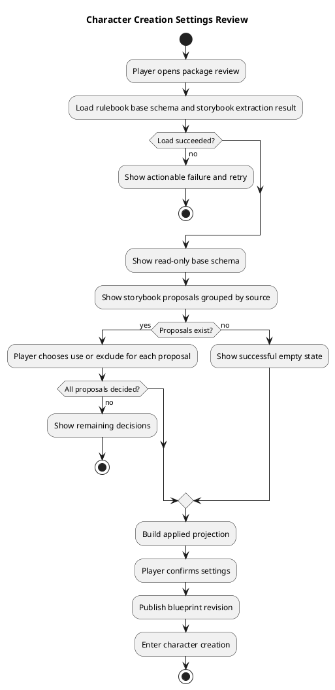
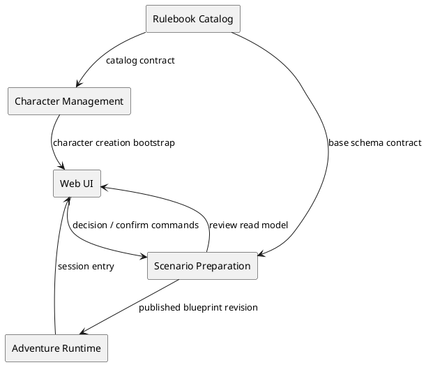
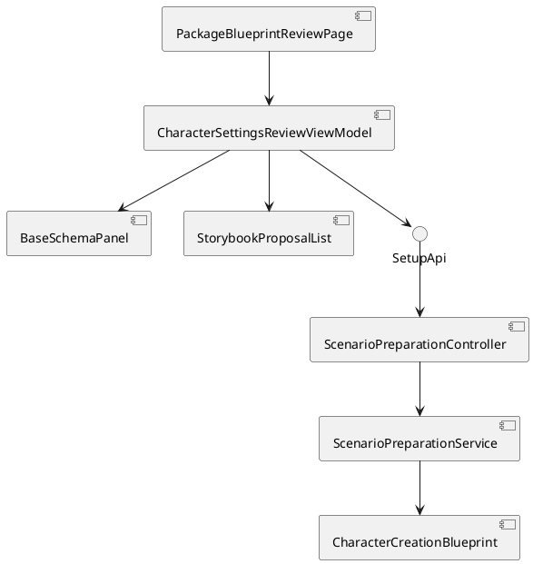
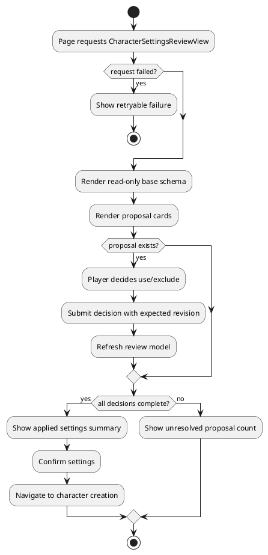

# Architecture Spec: 캐릭터 생성 룰북 카탈로그/API 단일화

# 1. Design Scope

## 1.1 Target

| 항목 | 대상 |
|---|---|
| Product Spec | `docs/specs/product-spec.md` |
| Use Cases | UC-01~UC-07 |
| Domain | 룰북 기본 스키마·선택지 카탈로그와 스토리북 제안의 검토·결정·확정 |
| Bounded Contexts | Character Management, Scenario Preparation, Rulebook Catalog, Web UI, Adventure Runtime |
| Existing Services | `character-management-service`, `adventure-service`, `rule-knowledge-service`, `web-ui` |
| External Dependencies | PostgreSQL, 백엔드 룰북 카탈로그 리소스, 룰북 지식 서비스 |
| Affected Data | `CharacterCreationBlueprint`, storybook proposal decision, blueprint revision |

## 1.2 Product Spec Mapping

| Product Spec | Architecture 요소 |
|---|---|
| 룰북 기본 스키마 읽기 전용 | `BaseSchemaView` UI projection |
| 스토리북 제안 사용/제외 | `StorybookProposal` decision model and command |
| 제안 없음·실패·근거 부족 | extraction state and proposal read model |
| 미결정 제안 확정 차단 | application service and aggregate precondition |
| 확정 후 캐릭터 생성 | published blueprint revision → session boundary |
| 룰북 스키마·선택지 단일화 | Character Catalog resource → typed API projection |
| 검토·생성 리비전 일치 | bundle lock and catalog revision validation |

# 2. Domain Flow

## 2.1 Event Storming Flow

## 2.2 Commands

| Command | Actor | Target | Input | Preconditions | Result |
|---|---|---|---|---|---|
| ReadCharacterCreationSettings | Player | Scenario Preparation | package ID | package accessible | base schema and proposal view |
| DecideStorybookProposal | Player | CharacterCreationBlueprint | package ID, proposal ID, decision, expected revision | proposal has identity; apply requires evidence | updated decision projection |
| ConfirmCharacterCreationSettings | Player | CharacterCreationBlueprint | package ID, expected revision | every proposal decided; base schema valid | published blueprint revision |
| CreateCharacterSession | Player | Adventure Runtime | package ID, published blueprint revision | blueprint is published | character creation session |

## 2.3 Domain Events

| Domain Event | Producer | Trigger | Payload | Consumers |
|---|---|---|---|---|
| StorybookProposalDecided | CharacterCreationBlueprint | use/exclude decision accepted | proposal ID, decision, revision | review UI |
| CharacterCreationSettingsConfirmed | CharacterCreationBlueprint | all decisions complete and publish succeeds | package ID, revision, applied proposal IDs | session flow |

## 2.4 Policies

| Policy | Trigger | Decision | Owner |
|---|---|---|---|
| KeepBaseSchemaReadOnly | review loaded | base fields are never editable in review | Web UI |
| RequireEvidenceForApply | apply requested | reject proposal without source evidence | Scenario Preparation |
| RequireAllProposalDecisions | confirm requested | block if any proposal is undecided | Scenario Preparation |
| PublishAppliedProjectionOnly | confirm succeeds | persist base schema plus applied proposals only | Scenario Preparation |
| BlockSessionBeforeConfirmation | session requested | reject unpublished blueprint | Adventure Runtime |

## 2.5 Read Models

| Read Model | Consumer | Source | Required Fields | Owner |
|---|---|---|---|---|
| `PlayPreparationView` | existing preparation UI | scenario package | readiness, blueprint, character limit | Scenario Preparation |
| `CharacterSettingsReviewView` | review page | preparation + extraction metadata | base schema, proposals, empty/failure state, revision | Scenario Preparation |
| `StorybookProposalView` | proposal cards | storybook extraction | ID, label, description, source document, quote, evidence, decision | Scenario Preparation |
| `AppliedSettingsSummary` | confirmation panel | review decision projection | base schema included, applied IDs, excluded IDs, unresolved count | Scenario Preparation |

## 2.6 External Interactions

| External System | Trigger | Input | Output | Failure |
|---|---|---|---|---|
| Rulebook Catalog API | review load | edition/package context | base schema metadata | no usable catalog revision |
| Scenario Preparation API | review/decision/confirm | package, proposal decision, revision | updated review view | validation or revision conflict |
| Adventure Session API | after confirmation | package and published blueprint revision | session ID | unpublished or stale blueprint |

## 2.7 Hotspots and Decisions

| Hotspot | Options | Decision |
|---|---|---|
| Proposal source of truth | infer from diagnostics / explicit API projection | explicit proposal collection; UI must not infer from diagnostic strings |
| Base schema presentation | render full editable tree / read-only summary | read-only grouped summary; actual values are entered in character creation |
| Proposal decisions | merge into fields immediately / separate staged decisions | separate decision state until confirmation |
| Empty result | hide proposal area / explicit success state | explicit “추가할 내용 없음” with analyzed document summary |
| Confirmation wording | 게시 / 설정 확정 | user-facing “캐릭터 생성에 사용할 설정 확정”; API may retain publish terminology |

# 3. DDD Architecture

## 3.1 Bounded Contexts

| Context | Responsibility | Owned Model | Owned Data |
|---|---|---|---|
| Rulebook Catalog | edition-specific base schema, choices, descriptions and provenance | `RulebookCharacterCatalog` | versioned catalog resources and catalog revisions |
| Character Management | validate and evaluate character builds against the selected catalog revision | `CharacterSheet`, `CharacterRulesCatalog` | character build/state and catalog revision reference |
| Scenario Preparation | extract proposals, track decisions, validate and publish applied settings | `CharacterCreationBlueprint`, `StorybookProposal` | blueprint revisions and proposal decisions |
| Web UI | present base schema, proposals and transient decision state | `CharacterSettingsReviewViewModel` | none; local pending state only |
| Adventure Runtime | create sessions from confirmed settings | `AdventureSession` | session data |

## 3.2 Context Map

## 3.3 Aggregates

| Aggregate | Root | Responsibility | Commands | Invariants |
|---|---|---|---|---|
| `CharacterCreationBlueprint` | blueprint revision | own applied settings and publication state | decide proposal, confirm | base schema always present; only evidenced proposals can apply; all proposals decided before publish; published immutable |
| `ScenarioPackage` | package | own preparation scope and source documents | read review | package and current revision are consistent |
| `AdventureSession` | session | begin character creation from confirmed settings | create | blueprint revision must be published |

## 3.4 Entities and Value Objects

| Type | Kind | Responsibility |
|---|---|---|
| `StorybookProposal` | entity | stable proposal identity, content, source and decision |
| `ProposalDecision` | value | `UNDECIDED`, `APPLIED`, `EXCLUDED`, `NEEDS_EVIDENCE` |
| `BlueprintRevision` | value | optimistic concurrency boundary |
| `CharacterSettingsReviewViewModel` | UI model | separate base schema, proposals, summary and labels |
| `RulebookCharacterCatalog` | catalog model | edition, revision, fields, choices, derived-field rules and provenance |
| `RulebookCatalogResourceLoader` | adapter | loads validated versioned JSON/YAML resource from backend classpath |
| `CharacterCreationSchemaView` | DTO | API projection consumed by review and character creation screens |
| `CatalogRevisionId` | value object | immutable identity carried through bundle lock, bootstrap and evaluation |

## 3.5 Business Rule Ownership

| Rule | Owner | Enforcement |
|---|---|---|
| base schema is always included | Scenario Preparation | applied projection builder |
| base schema is read-only in review | Web UI | `BaseSchemaPanel` has no mutation callbacks |
| proposal apply requires evidence | aggregate/application service | decision command validation |
| all proposals must be decided | aggregate/application service | confirm command precondition |
| excluded proposal is omitted | aggregate | applied projection builder |
| published settings are immutable | `CharacterCreationBlueprint` | publish transition |
| session requires published settings | Adventure Runtime | session creation boundary |

## 3.6 State Transitions

| Current | Command/Event | Next | Owner | Preconditions |
|---|---|---|---|---|
| review loaded | no proposal found | `CONFIRMABLE` | preparation | extraction completed successfully |
| proposal `UNDECIDED` | decide use | `APPLIED` | blueprint | evidence exists |
| proposal `UNDECIDED` | decide exclude | `EXCLUDED` | blueprint | proposal exists |
| any unresolved proposal | confirm | rejected | blueprint | all proposals must be decided |
| confirmable | confirm | `PUBLISHED` | blueprint | base schema valid and revision matches |
| `PUBLISHED` | create session | session draft | runtime | published revision supplied |

# 4. Program Design

## 4.1 Program Structure

## 4.2 Major Components and Responsibilities

| Component | Responsibility | Must Not Do |
|---|---|---|
| `PackageBlueprintReviewPage.tsx` | load review model, compose page states and confirmation flow | infer proposal identity from diagnostics |
| `BaseSchemaPanel` | read-only grouped display of rulebook schema | issue mutation commands |
| `StorybookProposalList` | source-grouped cards, evidence, use/exclude decisions, empty/failure states | publish or create sessions |
| `AppliedSettingsSummary` | show what will be included and unresolved count | edit base schema |
| `SetupApi.ts` | typed review/decision/confirm contracts | contain presentation logic |
| `ScenarioPreparationApplicationService` | build review projection, validate decisions, publish applied projection | know browser layout |
| `CharacterCreationBlueprint` | own revision and state transitions | HTTP or user-facing labels |

## 4.3 Application Flow

## 4.4 Component Call Contracts

| Order | Caller | Callee | Operation | Output | Failure |
|---:|---|---|---|---|---|
| 1 | review page | preparation API | `getCharacterSettingsReview` | review view | load failure |
| 2 | proposal card | preparation API | `decideStorybookProposal` | refreshed review view | invalid evidence or revision conflict |
| 3 | confirmation panel | preparation API | `confirmCharacterSettings` | published blueprint revision | unresolved proposal or validation error |
| 4 | page | session API | `createSession` | session ID | unpublished/stale revision |

## 4.5 Major Types

| Type | Kind | Responsibility |
|---|---|---|
| `CharacterSettingsReviewView` | DTO | base schema, proposal list, extraction state, revision and summary |
| `BaseSchemaView` | DTO | read-only edition and grouped base fields |
| `StorybookProposalView` | DTO | proposal content, source, evidence and decision |
| `AppliedSettingsSummary` | DTO | included/excluded/unresolved counts and item IDs |
| `CharacterSettingsReviewViewModel` | UI type | user labels, loading/error/empty states and pending decisions |

## 4.6 Existing Code Seams and Required Changes

- Entry route: `/scenario-packages/{packageId}/character-blueprint` is wired from `src/web-ui/src/app/AppShell.tsx`.
- Current page implementation: `src/web-ui/src/features/character/PackageBlueprintReviewPage.tsx`.
- Current field renderer: `src/web-ui/src/features/character/CharacterInputTree.tsx`; it renders all nodes as inputs and infers origin from diagnostic text, which conflicts with this design.
- Current API types: `src/web-ui/src/features/rulebooks/SetupApi.ts`; `CharacterCreationBlueprintView` exposes roots and diagnostics but no first-class proposal list or proposal decision.
- Current domain: `src/adventure-service/src/main/java/com/dndmaster/adventure/domain/scenario/CharacterCreationBlueprint.java`; it supports field resolution and publication but not an explicit proposal decision model.
- Current preparation service: `src/adventure-service/src/main/java/com/dndmaster/adventure/application/scenario/preparation/ScenarioPreparationApplicationService.java`; it combines rulebook and storybook candidate discovery into one blueprint.
- Current tests: `src/web-ui/src/features/character/PackageBlueprintReviewPage.test.tsx` and `src/web-ui/src/features/character/CharacterInputTree.test.tsx`.
- Existing character rules API: `src/character-management-service/src/main/java/com/dndmaster/character/api/CharacterSheetController.java` exposes only name-only race/class/background arrays and hard-codes revision `1`; it must evolve into the canonical character catalog API.
- Existing metadata catalog: `src/rule-knowledge-service/src/main/java/com/dndmaster/ruleknowledge/api/RulebookCatalogController.java` manages published rulebook document revisions but does not yet own character schema/options; the character catalog references, rather than duplicates, its rulebook revision identity.
- Existing validator seams: `src/character-management-service/src/main/java/com/dndmaster/character/api/Dnd5e2014CharacterCreationValidator.java` and `src/character-management-service/src/main/java/com/dndmaster/character/application/Dnd5e2014CharacterMutationRules.java`; validation consumes the same catalog identifiers and constraints rather than parallel literals.

## 4.7 Persistence and Migration Constraints

- Do not create a second browser-owned draft store; proposal decisions must be persisted with the blueprint revision or represented as a server-owned staged revision.
- Existing field revision and optimistic concurrency behavior must remain intact.
- Existing published blueprint consumers and character creation routes remain compatible.
- If proposal decisions are added to the API, older `CharacterCreationBlueprintView` clients must receive a safe empty proposal list rather than infer proposals from diagnostics.
- The published projection must retain provenance for included storybook proposals.

## 4.8 Risks and Non-goals

- Inferring proposal identity from diagnostic strings is brittle and must be removed from the new contract.
- Treating every extracted field as user-editable will continue to blur review and character creation; the base panel must not expose mutation callbacks.
- Empty extraction and failed extraction must have distinct states.
- Replacing the current `window.prompt` child-field flow is not required for this slice because adding custom character fields is outside the clarified review purpose.
- The actual character creation page remains responsible for entering character-specific values.

## 4.9 Rulebook Catalog Contract

- The backend owns one versioned declarative resource per supported edition. JSON is the default representation; YAML is acceptable only if the existing validation toolchain supports it. XML is not required.
- A catalog resource contains `edition`, `revision`, `fields`, and optional `derivedFields`. Each field contains a stable key, user label, input mode, required/automatic classification, all valid choices, choice descriptions, and one or more `sourceReferences` to the rulebook.
- A choice is data, not executable code. Derived fields declare their calculation dependencies and display metadata but are evaluated by existing backend/domain rules, not by arbitrary resource expressions.
- The API returns the catalog revision and the same field/choice projection in both the character-settings review response and the character-creation bootstrap response.
- The frontend may cache the API response for the current session but may not fall back to a hardcoded edition catalog.
- Resource loading validates schema, edition/revision uniqueness, stable keys, non-empty labels, choice uniqueness, and source references before publishing a catalog revision.
- The resource is loaded by `character-management-service` through a typed catalog loader; `adventure-service` consumes the published API contract and does not copy the resource.
- Rulebook document revision metadata remains owned by `rule-knowledge-service`; the character catalog stores an immutable reference to that revision and its source spans/quotes.
- The canonical API covers every selectable field, including race/subrace, class/subclass, background, ability-score method/assignment, skills, proficiencies, equipment packages, spells/cantrips and other rulebook-defined choices. Automatically derived values are represented as derived fields with dependencies, not as selectable options.
- A character build stores the catalog revision ID (or an immutable catalog snapshot ID) so later catalog revisions cannot change historical validation.

## 4.10 API and Version Lock

1. Scenario preparation resolves the bundle's selected rulebook catalog revision.
2. `play-preparation` returns `characterCreationBlueprint.baseSchema` with the catalog revision and all fields/choices.
3. Character creation bootstrap receives the same revision and schema projection.
4. A mismatch between the bundle lock and requested catalog revision returns a conflict and prevents character creation.
5. Published bundle revisions retain the catalog revision; updating the resource creates a new catalog revision and does not mutate existing bundles.
