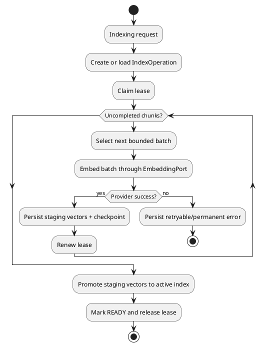
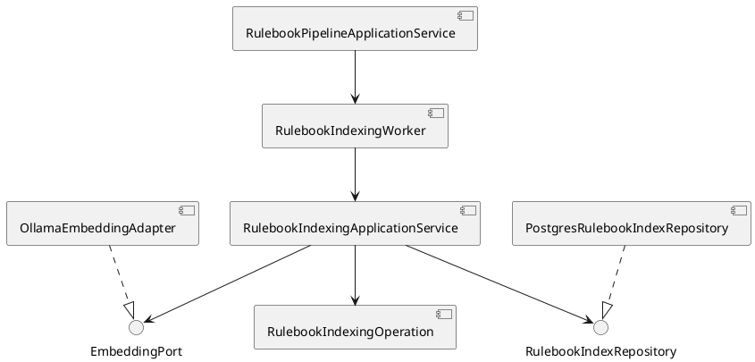

# Architecture Spec: 룰북 임베딩 비동기·점진 저장

## 1. Design Scope

| 항목 | 결정 |
|---|---|
| Product Spec | `docs/specs/product-spec.md` |
| Bounded Context | Document Knowledge (`rule-knowledge-service`) |
| Use Cases | 인덱싱 시작, 배치 완료 반영, 진행 조회, 실패 재개, lease 만료 복구 |
| Existing Flow | `RulebookPipelineApplicationService` → `RulebookIndexingApplicationService` → `EmbeddingPort` → `RulebookIndexRepository` |
| External System | Ollama Embedding API |
| Persistence | PostgreSQL + pgvector, `rulebook_vector_index`, `rulebook_vector_chunk` |
| Consistency Goal | 배치 단위 저장, 최종 active index 승격 원자성, lease/revision 조건부 쓰기 |

### Product Mapping

| Product 요구사항 | Architecture 계약 |
|---|---|
| BR-1~3, AC-1~3 | bounded embedding batch와 batch별 staging chunk 저장 |
| BR-4~6, AC-2, AC-4 | persisted checkpoint: total/completed count, next cursor, last error |
| BR-7~8, AC-5~7 | index lease owner/token/expiry + 조건부 갱신·저장 |
| BR-9, AC-8 | operation key와 source revision 조건부 SQL |
| BR-10 | chunk identity 및 unique upsert; 같은 chunk의 중복 active row 금지 |
| AC-9 | Ollama 실제 호출 + PostgreSQL/pgvector 통합 E2E |

## 2. Domain Flow



### Commands

| Command | Actor | Input | Result | Preconditions |
|---|---|---|---|---|
| `StartIndexing` | Pipeline worker | rulebook id, source revision, operation key | queued/index operation | source chunks available |
| `ClaimIndexLease` | Index worker | operation key, worker id, lease token | lease-owned operation | no live competing lease |
| `EmbedNextBatch` | Index worker | operation key, lease token | embeddings or failure | lease and revision valid |
| `PersistEmbeddingBatch` | Index worker | batch embeddings, checkpoint | updated progress | same lease/revision |
| `RetryIndexing` | User/worker | operation key | requeue from checkpoint | retryable or stale lease |
| `PublishIndex` | Index worker | operation key, lease token | `READY` active index | all chunks completed |

### Events

| Event | Trigger | Payload |
|---|---|---|
| `IndexingQueued` | operation created | rulebook, revision, operation key, total chunks |
| `IndexLeaseClaimed` | lease acquired | operation key, owner, token, expiry |
| `EmbeddingBatchCompleted` | staging batch committed | batch range/ids, completed count |
| `IndexingProgressed` | checkpoint committed | total, completed, remaining, timestamp |
| `EmbeddingBatchFailed` | provider or persistence failure | error class, message, retryable, checkpoint |
| `IndexPublished` | all staging chunks complete | operation key, revision |

### Policies

| Policy | Decision |
|---|---|
| `BoundedBatchPolicy` | Provider call size is configurable and bounded; one call cannot contain all document chunks. |
| `CheckpointPolicy` | Only committed chunk rows count as completed; retry starts from persisted incomplete rows. |
| `LeasePolicy` | Lease is claimed before a batch, renewed after commit, and must outlive one provider call. |
| `StaleWritePolicy` | Every mutation checks operation key, source revision, lease owner, and lease token. Zero updated rows means stale worker; discard result. |
| `PublicationPolicy` | Staging vectors receive progress writes. Active search vectors are promoted only after every chunk is complete. |
| `RetryPolicy` | Batch/provider failure retains checkpoint; retryable failure requeues, repeated/invalid failure becomes permanent. |

## 3. DDD Architecture

### 3.1 Bounded Context

| Context | Responsibility | Aggregate | Owned Data |
|---|---|---|---|
| Document Knowledge | 원본 revision의 chunk embedding과 검색 인덱스 생명주기 | `RulebookIndexingOperation` | index row, staging/active chunk vectors, lease/checkpoint |

`RulebookPipelineApplicationService`는 문서 처리 orchestration을 담당한다. 배치 checkpoint와 lease invariant는 `RulebookIndexingOperation` 및 repository transaction이 소유한다.

### 3.2 Aggregate

| Aggregate | Root | Invariants |
|---|---|---|
| `RulebookIndexingOperation` | `RulebookIndex` | source revision 고정, operation key 고정, completed ≤ total, live lease 단일성, READY는 모든 chunk 완료 후에만 가능 |

Chunk는 operation에 속한 식별 가능한 persistence entity다. worker 간 큰 객체 그래프를 공유하지 않고 `operation key`, `chunk id`, `source revision`으로 연결한다.

### 3.3 Value Objects

| Value Object | 의미 | 검증 |
|---|---|---|
| `IndexOperationKey` | 한 revision 인덱싱 시도 식별자 | 동일 source revision에서 재사용 정책 준수 |
| `SourceRevision` | 임베딩 대상 원본 버전 | null 불가, write 조건에 포함 |
| `LeaseToken` | 현재 worker의 소유권 증명 | owner·expiry와 함께 검증 |
| `EmbeddingBatch` | 한 provider 호출 단위 | 비어 있지 않음, configured limit 이내 |
| `IndexCheckpoint` | total/completed/next cursor | 음수 불가, completed ≤ total |

### 3.4 State Transitions

| Current | Command/Event | Next | 조건 |
|---|---|---|---|
| `PENDING` | `StartIndexing` | `EMBEDDING` | operation 생성·lease 확보 |
| `EMBEDDING` | `EmbeddingBatchCompleted` | `EMBEDDING` | staging transaction commit |
| `EMBEDDING` | `EmbeddingBatchFailed` | `RETRYABLE_FAILURE` | 재시도 가능 오류 |
| `EMBEDDING` | `EmbeddingBatchFailed` | `PERMANENT_FAILURE` | 정책상 복구 불가 |
| `RETRYABLE_FAILURE` | `RetryIndexing` | `EMBEDDING` | checkpoint 유지, 새 lease |
| `EMBEDDING` | `IndexPublished` | `READY` | completed = total, revision/lease 유효 |
| `EMBEDDING` | lease expiry | reclaimable | 이전 worker write 거부 |

## 4. Program Design

### 4.1 Program Structure



### 4.2 Components and Responsibilities

| Component | 책임 | Must Not Do |
|---|---|---|
| `RulebookPipelineApplicationService` | 등록 작업과 indexing operation 시작 연결 | provider batch loop 직접 수행 |
| `RulebookProcessingWorker` | queued work polling 및 worker lifecycle | lease 없는 결과 저장 |
| `RulebookIndexingApplicationService` | claim → batch embed → commit → retry/publish orchestration | 전체 청크를 한 provider 요청에 전달 |
| `RulebookIndexingOperation` | 상태·checkpoint·lease 전이 규칙 | DB 접근·HTTP 호출 |
| `EmbeddingPort` | bounded chunk batch를 벡터로 변환 | checkpoint·상태 저장 |
| `OllamaEmbeddingAdapter` | Ollama 요청, count/dimension/finite 검증 | DB 상태 변경 |
| `RulebookIndexRepository` | claim, batch read/write, checkpoint, publish의 transaction 경계 | provider 호출 |
| `PostgresRulebookIndexRepository` | lease/revision 조건 SQL, staging 저장, active 승격 | 도메인 retry 정책 결정 |
| `RuleKnowledgeController` | 상태·진행 정보 조회와 기존 retry 진입점 제공 | worker orchestration |

### 4.3 Port Contracts

```java
interface EmbeddingPort {
    List<ChunkEmbedding> embed(EmbeddingBatch batch);
}

interface RulebookIndexRepository {
    Optional<IndexLease> claim(IndexOperationKey key, WorkerId worker, LeaseToken token);
    IndexBatch nextBatch(IndexLease lease, int limit);
    void saveBatch(IndexLease lease, List<ChunkEmbedding> embeddings, IndexCheckpoint checkpoint);
    void renew(IndexLease lease);
    void publish(IndexLease lease);
    IndexProgress findProgress(IndexOperationKey key);
}
```

모든 write는 `operation_key + source_revision + lease_owner + lease_token` 조건을 사용한다. 조건에 맞는 row가 없으면 `StaleWorkerException`으로 처리하고 provider 응답을 폐기한다.

### 4.4 Persistence Contract

- `rulebook_vector_index`는 operation key, source revision, status, total/completed count, next cursor, last error, attempt, lease owner/token/expiry를 정본으로 가진다.
- `rulebook_vector_chunk`는 operation key와 chunk identity를 기준으로 staging embedding을 저장한다. 기존 active embedding과 분리한다.
- batch 저장과 checkpoint 갱신은 하나의 transaction이다. 둘 중 하나라도 실패하면 완료 수를 증가시키지 않는다.
- `publish`는 모든 staging chunk가 완료된 경우에만 active embedding으로 승격하고 status를 `READY`로 변경한다.
- unique constraint/upsert로 같은 operation·chunk의 중복 row를 막는다.
- 기존 검색은 active embedding만 사용한다. 진행률 조회는 staging checkpoint를 사용한다.

### 4.5 Application Flow

1. pipeline이 source revision의 chunk 수와 operation key를 가진 indexing operation을 만든다.
2. scheduled worker가 operation lease를 claim한다.
3. application service가 checkpoint 이후의 bounded batch를 읽는다.
4. `EmbeddingPort`가 Ollama에 batch만 요청한다.
5. 응답 검증 후 staging vector, completed count, cursor를 한 transaction에 저장한다.
6. lease를 갱신하고 다음 batch를 처리한다.
7. provider 오류는 batch 실패로 기록하고 lease를 반납한다.
8. 전체 checkpoint 완료 후 active index를 publish한다.
9. 상태 조회는 total/completed/status/error/lease 정보를 반환한다.

### 4.6 Failure Propagation

| Failure | 처리 |
|---|---|
| Ollama timeout/HTTP 오류 | `EmbeddingBatchFailed`; checkpoint 유지, retryable 판정 |
| 응답 개수·차원·NaN 오류 | 현재 batch 폐기, 오류 기록; 반복 시 permanent |
| DB commit 오류 | batch와 checkpoint 모두 rollback; 재시도 시 같은 미완료 batch |
| lease expiry | 조건부 write 0건 → stale worker 결과 폐기; 새 worker reclaim |
| source revision mismatch | operation 거부; 이전 결과 publish 불가 |
| publish 중단 | active index는 이전 상태 유지; lease 재확보 후 publish 재시도 |

## 5. Required Codebase Delta

### Application and domain

- `src/rule-knowledge-service/src/main/java/com/dndmaster/ruleknowledge/application/indexing/RulebookIndexingApplicationService.java`: all-at-once flow를 bounded batch loop와 checkpoint orchestration으로 분리.
- `.../application/indexing/EmbeddingPort.java`: batch 계약은 유지하되 전체 문서 전달을 금지하는 `EmbeddingBatch` 입력으로 명시.
- `.../application/indexing/RulebookIndexRepository.java`: claim, next batch, save batch, renew, progress, publish 계약 추가.
- `.../domain/index/RulebookIndex.java`: operation key, checkpoint, lease, retryable/permanent transition invariant 추가.
- 필요 시 `IndexCheckpoint`, `IndexLease`, `IndexProgress`, `EmbeddingBatch` value type 추가.

### Infrastructure and API

- `.../infrastructure/persistence/PostgresRulebookIndexRepository.java`: migration 필드 실제 read/write, `FOR UPDATE SKIP LOCKED`/lease 조건, batch transaction, active promotion 구현.
- `.../infrastructure/ai/OllamaEmbeddingAdapter.java`: bounded batch만 호출하고 기존 응답 검증 유지.
- `.../api/RuleKnowledgeController.java`: 기존 상태 응답에 progress/error/lease view를 매핑. worker 전용 HTTP endpoint는 만들지 않는다.
- `src/rule-knowledge-service/src/main/resources/db/migration/`: operation/checkpoint/chunk identity/conditional publication에 필요한 schema 보강. 기존 `embedding_next` 계약과 정합성 유지.

## 6. Test Contract

### Unit

- `RulebookIndexingApplicationServiceTest`: batch limit, batch별 저장, 완료 count, retry checkpoint, no duplicate completed chunks.
- `RulebookIndexTest`: state transition, completed ≤ total, lease/revision guard.
- `OllamaEmbeddingAdapterTest`: bounded request와 기존 count/dimension/finite validation.

### Persistence / integration

- `RulebookPgvectorIntegrationTest`: staging batch commit, rollback, active publish, progress query, duplicate upsert.
- repository integration test: competing claims, expired lease reclaim, stale owner write rejection, source revision mismatch.

### System E2E

- 실제 PDF fixture(179페이지 룰북) + 실제 Ollama + PostgreSQL/pgvector.
- 처리 중 progress 조회와 부분 staging 저장 확인.
- provider/worker 중단 후 재시작, 완료 batch 재호출 없음 확인.
- 최종 검색 결과와 기존 revision guard 회귀 확인.
- `SystemE2EFixture`는 migration 전체를 적용해 production schema와 같은 lease/revision 구조를 사용해야 한다.

## 7. Decisions, Risks, and Non-goals

### Decisions

- Provider 호출 단위는 bounded batch다.
- checkpoint와 staging vector는 batch transaction으로 함께 저장한다.
- 진행 중 결과는 staging에 저장하고 active 검색 인덱스는 전체 완료 후 원자 승격한다.
- lease와 source revision은 모든 mutation의 조건이다.
- worker 전용 API는 추가하지 않고 기존 상태 조회 API를 확장한다.

### Risks

- staging과 active vector를 함께 유지하면 저장 공간이 증가한다.
- batch 처리 시간이 lease보다 길면 reclaim 경합이 생긴다. batch limit과 lease duration을 함께 설정·검증해야 한다.
- 기존 migration 필드와 실제 repository 구현 간 간극이 크다. schema-only 변경으로 끝내면 안전성이 확보되지 않는다.

### Non-goals

- 새로운 embedding model 또는 검색 ranking 정책
- 청킹 규칙의 제품 변경
- 사용자 취소 기능
- 다른 서비스의 indexing pipeline 재설계
