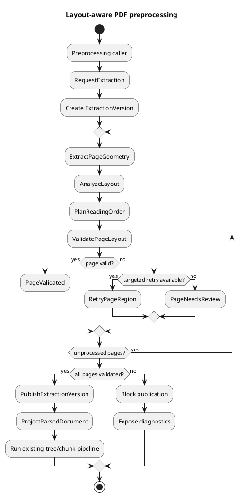
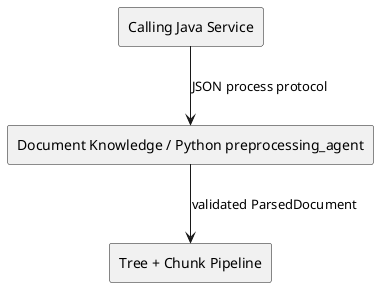
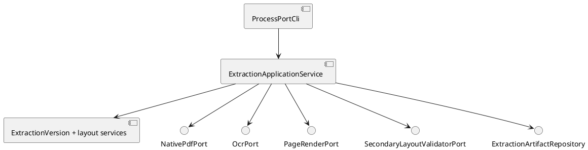
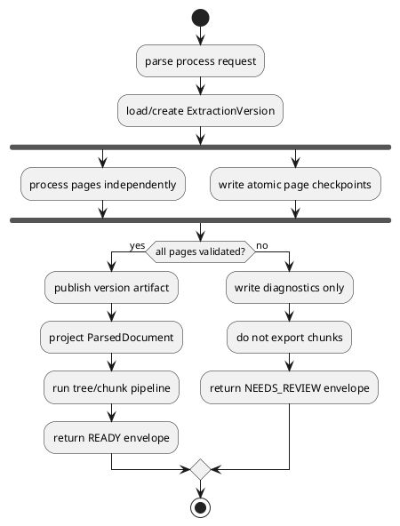
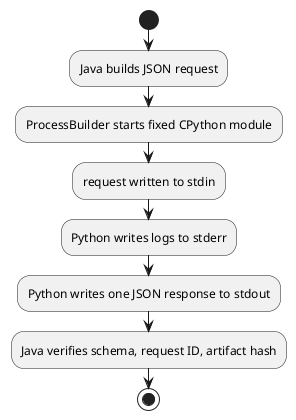

# Architecture Spec

# 1. Design Scope

## 1.1 Target

| 항목 | 대상 |
|---|---|
| Product Spec | `docs/specs/product-spec.md` |
| Use Cases | UC-01 ~ UC-07 |
| Domain | PDF 레이아웃 인식 전처리 |
| Bounded Contexts | Document Knowledge |
| Existing Services | 독립 Python 모듈 `preprocessing_agent` |
| External Dependencies | CPython, PyMuPDF 계열 native PDF adapter, 선택적 OCR·2차 검증 adapter |
| Affected Data | Extraction Version, 페이지 레이아웃 artifact, manifest, 기존 ParsedDocument·chunk artifact |

이번 설계는 별도 Python 전처리 모듈 내부의 레이아웃 추출·검증 구조와 다른 서비스가 호출할 수 있는 프로세스 포트까지 정의한다. Java 서비스의 `ProcessBuilder` adapter, HTTP·gRPC·메시지 큐, backend 데이터베이스 연동은 구현 범위에 포함하지 않는다.

## 1.2 Product Spec Mapping

| Product Spec 항목 | Architecture 요소 |
|---|---|
| UC-01 | `ExtractionApplicationService`, `NativePdfPort`, `OcrPort`, `PageGeometry` |
| UC-02 | `LayoutAnalyzer`, `LayoutRegion`, `ColumnHypothesis` |
| UC-03 | `ReadingOrderPlanner`, `ReadingOrderPlan` |
| UC-04 | `HeadingAssociation`, `TableStructure`, `LayoutBlock` |
| UC-05 | `LayoutValidationService`, `SecondaryLayoutValidatorPort`, `ConfidenceVector` |
| UC-06 | `PageRetryPolicy`, `PageExtraction.retry()` 및 page-scoped artifact checkpoint |
| UC-07 | `ExtractionVersion.publish()` 및 `ParsedDocumentProjector` |
| BR-14, BR-19 | `ExtractionVersion` aggregate의 페이지·문서 게시 불변식 |
| BR-17 | `PageAttempt`과 최대 2회 추가 시도 정책 |
| BR-21 | `ExtractionPolicyVersion` 및 artifact manifest |

---

# 2. Domain Flow

## 2.1 Event Storming Flow



## 2.2 Commands

| Command | Actor | Target | Input | Preconditions | Result |
|---|---|---|---|---|---|
| `RequestExtraction` | process-port caller | `ExtractionVersion` | source ref, policy version, request ID | readable PDF, valid policy | `ExtractionRequested` |
| `AnalyzePage` | application service | `PageExtraction` | raw geometry, render ref | page is pending/retrying | `PageStructured` |
| `ValidatePage` | application service | `PageExtraction` | candidate layout, validation evidence | page is structured | `PageValidated` or `PageValidationFailed` |
| `RetryPageRegions` | caller/policy | `PageExtraction` | version ID, page, failed regions | retry budget remains | new `PageAttempt` |
| `PublishExtraction` | application service | `ExtractionVersion` | version ID | every page validated | `ExtractionPublished` |

## 2.3 Domain Events

| Domain Event | Producer | Trigger | Payload | Consumers |
|---|---|---|---|---|
| `ExtractionRequested` | `ExtractionVersion` | version creation | version/source/policy IDs | extraction coordinator |
| `PageStructured` | `PageExtraction` | layout candidate accepted for validation | page, attempt, candidate refs | validation policy |
| `PageValidated` | `PageExtraction` | all critical axes pass | page, confidence, evidence | version readiness policy |
| `PageValidationFailed` | `PageExtraction` | any critical axis fails | page, findings, retry hint | retry policy |
| `PageNeedsReview` | `PageExtraction` | retry exhausted/non-retryable ambiguity | page, diagnostics | caller status view |
| `ExtractionPublished` | `ExtractionVersion` | all pages validated | artifact ref/hash | parsed-document projection |

## 2.4 Policies

| Policy | Trigger Event | Decision | Emitted Command | Owner |
|---|---|---|---|---|
| Page retry policy | `PageValidationFailed` | failure-specific retry and remaining budget | `RetryPageRegions` | Document Knowledge |
| High-risk second validation | `PageStructured` | table/multicolumn/OCR/ambiguity/near-threshold | `ValidatePage` via secondary port | Document Knowledge |
| Version readiness | `PageValidated`/`PageNeedsReview` | all pages validated or publication blocked | `PublishExtraction` or none | `ExtractionVersion` |

## 2.5 Read Models

| Read Model | Consumer | Source | Fields | Owner |
|---|---|---|---|---|
| `ExtractionStatus` | process-port caller | version and page checkpoints | overall state, page states, attempts, findings | Python module |
| `PageDiagnostic` | developer/evaluator | validation evidence | overlay, hypotheses, confidence, failures | Python module |
| `ReadyArtifactRef` | downstream chunking/Java adapter | published version | path, hash, schema/policy versions | Python module |

## 2.6 External Interactions

| External System | Trigger | Input | Output | Failure |
|---|---|---|---|---|
| native PDF adapter | page extraction | PDF path/page | words, blocks, geometry, render | `NATIVE_EXTRACTION_FAILED` |
| OCR adapter | absent/incomplete native text | page/region image | words, boxes, confidence | `OCR_UNAVAILABLE`, `OCR_FAILED` |
| secondary validator | high-risk page | render + candidate metadata | findings/confidence | `SECONDARY_VALIDATION_UNAVAILABLE` |
| filesystem artifact store | checkpoint/publish | version/page artifacts | atomic artifact refs | `ARTIFACT_WRITE_FAILED` |

## 2.7 Hotspots

| Hotspot | Options | Decision |
|---|---|---|
| Python execution from Java | GraalPy, JEP, CPython subprocess | CPython subprocess-compatible JSON process port |
| lifecycle owner | extend `ParsedDocument`, separate aggregate | separate `ExtractionVersion` aggregate |
| layout boundary | new service/BC, existing Document Knowledge | existing Document Knowledge Python module |
| page layout | one page-wide column count, region-based profile | region-based `ColumnProfile` |
| low confidence | best effort, page block, document fail-fast | process all pages, page block, version publication block |

---

# 3. DDD Architecture

## 3.1 Bounded Contexts

| Bounded Context | Responsibility | Ubiquitous Language | Owned Model | Owned Data |
|---|---|---|---|---|
| Document Knowledge | PDF extraction, layout validation, immutable extraction publication | Extraction Version, Page Extraction, Layout Region, Page Review Gate | `ExtractionVersion` | page layout artifacts, validation evidence, policy version |

새 Bounded Context나 별도 네트워크 서비스는 추가하지 않는다. 기존 tree builder와 chunking은 Document Knowledge 내부의 downstream component이며, 검증된 projection만 소비한다.

## 3.2 Context Map



| Upstream | Downstream | Relationship | Contract | Translation |
|---|---|---|---|---|
| calling Java service | Python preprocessing module | Customer/Supplier | versioned JSON process protocol | future `ProcessBuilder` adapter |
| layout extraction | tree/chunk pipeline | Published Language | `ParsedDocument` projection | `ParsedDocumentProjector` |

## 3.3 Aggregates

| Aggregate | Root | Responsibility | Commands | Events | Invariants |
|---|---|---|---|---|---|
| Extraction Version | `ExtractionVersion` | page lifecycle, policy identity, publication readiness | request, record page result, retry, publish | page/version events | all pages validated before publish; max two additional attempts; immutable published version |

`ParsedDocument`는 aggregate가 아니라 게시된 Extraction Version에서 만든 downstream projection으로 유지한다.

## 3.4 Entities

| Entity | Aggregate | Identity | Responsibility | State |
|---|---|---|---|---|
| `PageExtraction` | Extraction Version | version ID + page number | page candidate, attempts, validation and review status | pending/classified/extracted/structured/validating/validated/retrying/needs-review |
| `PageAttempt` | Extraction Version | page number + attempt number | strategy, targeted regions and evidence history | running/succeeded/failed |

## 3.5 Value Objects

| Value Object | Aggregate | Values | Validation | Behavior |
|---|---|---|---|---|
| `PageGeometry` | Extraction Version | width, height, unit, origin, axes | positive dimensions | bbox bounds check |
| `BoundingBox` | Extraction Version | x0, y0, x1, y1 | ordered and page-bounded | overlap/containment |
| `LayoutBlock` | Extraction Version | ID, kind, bbox, text, method, confidence | source/page trace required | structural representation |
| `LayoutRegion` | Extraction Version | bbox, column hypotheses, chosen strategy | contained in page | owns local ordering |
| `ColumnHypothesis` | Extraction Version | column count, gutters, score | score in `[0,1]` | candidate comparison |
| `ReadingOrderPlan` | Extraction Version | ordered block IDs, strategy, candidates | all confirmed blocks covered once | continuity checks |
| `TableStructure` | Extraction Version | headers, rows, cells, merged/uncertain cells | cell bbox within table | table auditability |
| `ConfidenceVector` | Extraction Version | text, block type, columns, order, heading, table | every axis in `[0,1]` | critical-axis gate; no average override |
| `ValidationFinding` | Extraction Version | code, severity, bbox, reason, action | page/region trace required | retry classification |
| `ExtractionPolicyVersion` | Extraction Version | schema and threshold versions | non-empty/stable | reproducibility |

Canonical geometry is PDF points with top-left origin, x increasing rightward and y increasing downward. Adapters must translate their native convention at the boundary.

## 3.6 Domain Services

| Domain Service | Responsibility | Input | Output | Collaborators |
|---|---|---|---|---|
| `LayoutAnalyzer` | region, heading, table and column hypotheses | native/OCR blocks + page geometry | layout candidate | layout value objects |
| `ReadingOrderPlanner` | select local strategy and compose page order | regions and spanning blocks | `ReadingOrderPlan` | `ColumnHypothesis` |
| `LayoutValidationService` | deterministic critical-axis validation | candidate, render evidence, policy | findings and confidence | bbox/order/table rules |
| `PageRetryPolicy` | map failures to targeted strategies | findings and attempt history | retry directive or review | `PageAttempt` |
| `ParsedDocumentProjector` | map only published layout to current parser contract | published version | `ParsedDocument` | existing domain models |

## 3.7 Business Rule Ownership

| Business Rule | Owner | Enforcement Point |
|---|---|---|
| every block has source geometry | value objects | constructors |
| region-based column inference | `LayoutAnalyzer` | `analyze()` |
| no raw extractor order as visual order | `ReadingOrderPlanner` | `plan()` |
| any critical-axis failure blocks page | `PageExtraction` | `accept_validation()` |
| max two additional attempts | `PageRetryPolicy`/`PageExtraction` | `request_retry()` |
| any blocked page prevents publication | `ExtractionVersion` | `publish()` |

## 3.8 Aggregate State Transitions

| Current State | Command / Event | Next State | Owner | Preconditions | Emitted Event |
|---|---|---|---|---|---|
| page pending | analyze | structured | `PageExtraction` | raw evidence exists | `PageStructured` |
| structured | validate/pass | validated | `PageExtraction` | every critical axis passes | `PageValidated` |
| structured | validate/fail | retrying | `PageExtraction` | retryable and budget remains | `PageValidationFailed` |
| structured | validate/fail | needs-review | `PageExtraction` | non-retryable/exhausted | `PageNeedsReview` |
| version validating | publish | ready | `ExtractionVersion` | all pages validated | `ExtractionPublished` |

## 3.9 Repository Boundaries

| Repository | Aggregate | Operations | Consistency Boundary |
|---|---|---|---|
| `ExtractionArtifactRepository` | Extraction Version | create/checkpoint/load/publish | one version; page checkpoints atomically replaced |

---

# 4. Program Design

## 4.1 Program Structure



## 4.2 Major Components and Responsibilities

| Component | Responsibility | Input | Output | Dependencies | Must Not Do |
|---|---|---|---|---|---|
| process CLI adapter | JSON process protocol | stdin request | one stdout envelope | application port | layout decisions, logging to stdout |
| `ExtractionApplicationService` | page orchestration and checkpoints | commands | version/status/result | ports, aggregate | embed vendor logic |
| layout domain services | candidate and validation decisions | domain values | domain values | none/vendor-neutral | filesystem/process access |
| PDF/OCR/render adapters | external library conversion | source/page/region | normalized evidence | external packages | set publication state |
| `ParsedDocumentProjector` | compatibility projection | ready version | existing `ParsedDocument` | domain model | project unvalidated pages |
| existing pipeline | tree/chunk/validation/export | validated document | chunks/artifacts | current components | bypass extraction gate |

## 4.3 Application Flow



## 4.4 Component Call Contracts

| Order | Caller | Callee | Operation | Input | Output | Failure |
|---:|---|---|---|---|---|---|
| 1 | process CLI | application service | `preprocess` | request command | extraction result | request/dependency/process error |
| 2 | application service | PDF/render ports | `extract/render` | source and page | normalized evidence | adapter error |
| 3 | application service | layout services | `analyze/plan/validate` | evidence | page decision | domain finding |
| 4 | application service | repository | `checkpoint` | version/page state | artifact ref | atomic write failure |
| 5 | application service | projector | `project` | ready version | `ParsedDocument` | publication invariant violation |
| 6 | application service | existing pipeline | tree/chunk/export | validated document | existing artifacts | current validation errors |

## 4.5 Major Types

| Type | Kind | Responsibility | State | Dependencies |
|---|---|---|---|---|
| `PreprocessingApplicationPort` | inbound port | preprocess/status/retry contract | stateless | command/result DTOs |
| `ExtractionApplicationService` | application service | orchestration | stateless | ports/repository |
| `ExtractionVersion` | aggregate root | lifecycle and publish gate | version state/pages | domain values |
| `ProcessRequestEnvelope` | DTO | versioned process request | immutable | JSON schema |
| `ProcessResponseEnvelope` | DTO | stable Java-consumable result | immutable | JSON schema |

## 4.6 Type Design

### `ExtractionVersion`

| 항목 | 정의 |
|---|---|
| Kind | Aggregate Root |
| Responsibility | 페이지 처리 상태, 정책 버전, 전체 게시 가능성 |
| Dependencies | domain values only |
| Must Not Depend On | PyMuPDF, OCR vendor, filesystem, Java/JVM types |

#### State

| Field | Type | Meaning | Constraint |
|---|---|---|---|
| `version_id` | `ExtractionVersionId` | 실행 식별자 | non-empty/idempotent |
| `source_ref` | `SourceDocumentRef` | source path/hash | immutable |
| `policy_version` | `ExtractionPolicyVersion` | rules/schema identity | immutable |
| `pages` | page-number map | page entities | source page set과 일치 |
| `status` | enum | overall state | pages로부터 도출 |

#### Behavior

| Method | Input | Output | Responsibility | State Change |
|---|---|---|---|---|
| `record_page_candidate` | page candidate | event | page structured state | page state |
| `accept_page_validation` | page decision | event | critical-axis gate | page state |
| `request_page_retry` | page/failures | directive | retry budget enforcement | new attempt |
| `publish` | none | artifact decision | all-page invariant | version ready |

## 4.7 Interfaces and Function Signatures

Python inbound application port:

```python
class PreprocessingApplicationPort(Protocol):
    def preprocess(self, request: ExtractionRequest) -> ExtractionResult: ...
    def get_status(self, version_id: ExtractionVersionId) -> ExtractionStatus: ...
    def retry_pages(self, request: RetryPagesRequest) -> RetryResult: ...
```

External Java-side contract to be implemented in a downstream service:

```java
public interface PreprocessingPort {
    ExtractionResult preprocess(ExtractionRequest request);
    ExtractionStatus getStatus(ExtractionVersionId versionId);
    RetryResult retryPages(ExtractionVersionId versionId, List<Integer> pageNumbers);
}
```

| 항목 | 정의 |
|---|---|
| Responsibility | language-neutral preprocessing use cases |
| Caller | Java service or local CLI |
| Implementer | Python application service; future Java `ProcessBuilder` adapter |
| Input | versioned JSON-compatible DTOs |
| Output | status, page summary, artifact ref/hash, diagnostics refs |
| Preconditions | canonical Linux source path; supported schema |
| Postconditions | chunk refs appear only when status is READY |
| Errors | stable error code and retryability |
| Side Effects | version/page artifact checkpoints |
| Idempotency | request ID + source hash + policy version |

## 4.8 Error Propagation

| Failure Point | Source Error | Converted Error | Handler | Result |
|---|---|---|---|---|
| request adapter | malformed/unsupported JSON | `INVALID_REQUEST`/`UNSUPPORTED_SCHEMA` | process CLI | non-zero exit + error envelope |
| native adapter | parser/library failure | `NATIVE_EXTRACTION_FAILED` | application service | OCR retry or page review |
| OCR/secondary adapter | unavailable/failure | explicit dependency code | page policy | `NEEDS_REVIEW` |
| domain validation | structural ambiguity | `LAYOUT_VALIDATION_FAILED` | retry policy | targeted retry/review |
| repository | write/hash failure | `ARTIFACT_WRITE_FAILED` | application service | version failed, no publish |

## 4.9 State Transition Implementation

| State Transition | Domain Owner | Method | Persistence Point | Published Event |
|---|---|---|---|---|
| page → validated | `PageExtraction` | `accept_validation` | atomic page checkpoint | `PageValidated` |
| page → retrying | `PageExtraction` | `request_retry` | attempt checkpoint | `PageValidationFailed` |
| page → needs-review | `PageExtraction` | `mark_needs_review` | page diagnostics | `PageNeedsReview` |
| version → ready | `ExtractionVersion` | `publish` | atomic version manifest | `ExtractionPublished` |

## 4.10 Dependency Rules

Allowed: process adapter → app → domain/ports; external adapters → ports; projector → existing domain contracts.

Forbidden: domain → PyMuPDF/OCR/filesystem/JVM; chunking → unvalidated page candidates; process DTOs → vendor-specific Python objects.

---

# 5. Technical Architecture

## 5.1 Service and Module Mapping

| Bounded Context | Program Component | Service | Module | Runtime |
|---|---|---|---|---|
| Document Knowledge | layout preprocessing | independent preprocessing module | `src/preprocessing_agent` | CPython 3.11+ |
| external caller | process adapter | existing Java service | downstream module, deferred | JVM + `ProcessBuilder` |

## 5.2 Service and Module Boundaries

| Module | Responsibility | Public Contract | Internal Components | Dependencies |
|---|---|---|---|---|
| `preprocessing_agent` | complete extraction/version lifecycle | JSON process protocol | aggregate, analyzers, adapters | CPython libraries |
| downstream Java module | invoke and translate process protocol | `PreprocessingPort` | future adapter | JDK `ProcessBuilder` |

## 5.3 System Interaction Flow



## 5.4 Process Communication

| Caller | Provider | Protocol | Operation | Request | Response | Timeout |
|---|---|---|---|---|---|---|
| Java service | Python module | OS process + JSON stdin/stdout | `preprocess`, `status`, `retry_pages` | request envelope | response envelope | caller-configured; timeout kills process tree and leaves last atomic checkpoint |

Protocol rules:

- executable and module are separate argument-list entries; no shell string construction;
- stdin contains one UTF-8 JSON request and is then closed;
- stdout contains exactly one UTF-8 JSON response; logs never use stdout;
- stderr contains structured operational logs and may be redirected;
- large page/layout/overlay data is returned by artifact path and SHA-256, not embedded in stdout;
- stdout response includes `schema_version`, `request_id`, `operation`, `status`, `version_id`, `artifacts`, `page_summary`, and optional `error`;
- success uses exit code `0`; contract/request errors use `2`; processing/dependency errors use `3`; interrupted execution uses `4`.

## 5.5 Process API Contracts

### `preprocess`

Request fields: schema version, request ID, source Linux path and expected hash, output directory, extraction policy version.

Response fields: version ID, `READY|NEEDS_REVIEW|FAILED`, validated/review/failed page counts, version/diagnostic artifact refs, optional ready ParsedDocument/chunk refs.

### `status`

Request fields: schema version, request ID, version ID, artifact root.

Response fields: overall state, page states, attempt counts, current findings and artifact refs. This operation is read-only.

### `retry_pages`

Request fields: schema version, request ID, version ID, explicit page numbers.

Response fields: updated status and page diagnostics. Pages not in the request are not reprocessed.

## 5.6 Asynchronous Communication

메시지 브로커를 추가하지 않는다. `preprocess` 프로세스 호출은 동기 계약이며, Java 측 adapter가 필요하면 별도 executor에서 `Process`를 관리한다. 상태는 atomic checkpoints를 통해 다른 `status` 호출에서 조회할 수 있다.

## 5.7 Message Contracts

JSON schema를 Published Language로 사용한다. 모든 request/response는 schema version과 request ID를 포함한다. 동일 idempotency key의 완료 요청은 기존 Extraction Version 결과를 반환하며 새 버전을 만들지 않는다.

## 5.8 Data Ownership

| Data | Owner | Storage | Key / Schema | Readers | Writers |
|---|---|---|---|---|---|
| extraction version manifest | Python module | filesystem artifact root | version ID/schema | caller/chunk pipeline | application service |
| page layout checkpoint | Python module | version/page artifact | page number/attempt | status/diagnostics | application service |
| render/overlay | Python module | diagnostics directory | page/hash | developers/evaluator | adapters/exporter |
| existing chunks | existing pipeline | current output directory | current schema | RAG consumers | only after READY |

## 5.9 Schema Changes

| Target | Action | Schema Change | Migration | Compatibility |
|---|---|---|---|---|
| `parsed_document.schema.json` | Modify | page geometry, layout refs and reading order | schema version bump | projector can emit legacy-compatible fields during transition |
| `manifest.schema.json` | Modify | version/page status, policy and artifact refs | schema version bump | readers reject unsupported major version |
| layout extraction schema | Add | full page/region/block/table/confidence model | none | versioned |
| process request/response schemas | Add | Java-callable process protocol | none | versioned envelopes |

## 5.10 Consistency Model

| Operation | Consistency | Source of Truth | Synchronization | Recovery |
|---|---|---|---|---|
| page checkpoint | atomic per page attempt | checkpoint artifact | temp-write + fsync/rename | retain last valid checkpoint |
| version publication | strong within artifact root | published manifest | publish last after hashes | no READY manifest on partial failure |
| idempotent request | strong by version key | version manifest | single-writer lock | return existing result |

## 5.11 Infrastructure Dependencies

| Dependency | Responsibility | Accessed By | Isolation Boundary |
|---|---|---|---|
| PyMuPDF-compatible adapter | native text/geometry/render | PDF/render adapter | ports |
| OCR engine | affected-region OCR | OCR adapter | `OcrPort` |
| secondary validator | independent high-risk validation | adapter | `SecondaryLayoutValidatorPort` |
| filesystem | checkpoints/artifacts | repository adapter | `ExtractionArtifactRepository` |

## 5.12 External Dependency Isolation

Every external result is translated into canonical `PageGeometry`, `LayoutBlock`, confidence evidence and stable failures at its adapter. Native package objects never cross an application or domain port.

## 5.13 File and Module Structure

### Existing relevant structure

```text
src/preprocessing_agent/
  app.py
  domain/models.py
  parsers/pdf.py
  pipeline/pipeline.py
  validation/deterministic.py
  exporters/artifacts.py
schemas/parsed_document.schema.json
schemas/manifest.schema.json
```

### Target additions

```text
src/preprocessing_agent/
  domain/layout.py
  layout/analyzer.py
  layout/reading_order.py
  layout/validation.py
  layout/retry.py
  pipeline/extraction_service.py
  ports/preprocessing.py
  ports/external.py
  adapters/process_cli.py
  exporters/layout_artifacts.py
schemas/
  layout_extraction.schema.json
  preprocessing_process_request.schema.json
  preprocessing_process_response.schema.json
tests/
  fixtures/layout/
```

### File Change Map

| Path | Action | Responsibility |
|---|---|---|
| `src/preprocessing_agent/domain/models.py` | Modify | SourceSpan/ParsedPage compatibility projection fields |
| `src/preprocessing_agent/domain/layout.py` | Add | aggregate, entities, value objects |
| `src/preprocessing_agent/parsers/pdf.py` | Modify | adapter only; remove ownership of final reading order |
| `src/preprocessing_agent/layout/*` | Add | analyzer, planner, validator, retry domain behavior |
| `src/preprocessing_agent/pipeline/extraction_service.py` | Add | page/version orchestration |
| `src/preprocessing_agent/pipeline/pipeline.py` | Modify | extraction gate before tree/chunk |
| `src/preprocessing_agent/ports/*` | Add | inbound and external Protocol contracts |
| `src/preprocessing_agent/adapters/process_cli.py` | Add | JSON stdin/stdout adapter |
| `src/preprocessing_agent/exporters/layout_artifacts.py` | Add | checkpoints, overlays, ready manifest |
| `src/preprocessing_agent/exporters/artifacts.py` | Modify | prohibit chunk export before READY |
| `schemas/*.json` | Add/Modify | versioned layout/process/manifest contracts |
| `tests/unit/test_layout_*.py` | Add | domain/analyzer/planner/gate/retry tests |
| `tests/integration/test_layout_extraction.py` | Add | native/OCR/mixed/table flows |
| `tests/contract/test_process_port.py` | Add | Java-consumable JSON protocol |
| `tests/integration/test_pipeline.py` | Modify | READY-only chunking and publication gate |

No Java source file is added in this slice. The Java interface shown above is the downstream contract for a later adapter ticket.

---

# 6. Runtime Design

## 6.1 Runtime Flow

The idempotency key is source SHA-256 + policy version + request identity. A version-scoped single-writer lock protects processing. Pages may execute concurrently, but each page attempt is ordered. Page checkpoints are written independently; the version manifest is published last.

## 6.2 Concurrent Access

| Shared Resource | Concurrent Actors | Conflict |
|---|---|---|
| extraction version | duplicate process calls | duplicate execution/publication |
| page checkpoint | initial processing and retry | lost attempt/update |
| stdout | logs and response | protocol corruption |

## 6.3 Concurrency Control

| Target | Control Unit | Strategy | Owner | Timeout |
|---|---|---|---|---|
| version | version ID | filesystem single-writer lock | repository adapter | policy-configured |
| page | version ID + page | ordered attempt number + atomic replace | application service | page timeout |
| process output | request | one response writer; stderr-only logs | process adapter | process timeout |

## 6.4 Ordering

Page processing order is not semantically significant. Attempts for one page are strictly ordered. Publication happens after all page terminal states are recorded.

## 6.5 Transaction Boundaries

| Transaction | Owner | Operations | Commit Condition | Rollback Condition |
|---|---|---|---|---|
| page attempt | application service | extract/analyze/validate/checkpoint | complete valid checkpoint | discard temp artifact |
| version publish | `ExtractionVersion` + repository | verify pages/hash/write ready manifest | all invariants pass | no ready manifest |

## 6.6 Idempotency

Duplicate completed requests return the existing result. A duplicate in-progress request returns current status rather than starting a second writer. `retry_pages` rejects already validated pages unless a new policy version creates a new Extraction Version.

## 6.7 Partial Failure

Completed pages and their evidence remain checkpointed. Failed pages can be retried without repeating other pages. Any unresolved page prevents ready/chunk artifacts, while diagnostic artifacts remain available.

---

# 7. Error Handling and Recovery

## 7.1 Failure and Recovery Flow

Failures are classified as request, dependency, extraction, structural validation, artifact, or interruption. Only failure-specific page/region retries are automatic. Infrastructure errors never convert to successful low-confidence output.

## 7.2 Error Classification

| Error | Category | Retryable | Handler | Caller Result |
|---|---|---:|---|---|
| `INVALID_REQUEST` | contract | no | process adapter | failed envelope/exit 2 |
| `NATIVE_EXTRACTION_FAILED` | dependency | conditional | application service | OCR retry or review |
| `OCR_UNAVAILABLE` | dependency | no in run | page gate | needs-review |
| `LAYOUT_VALIDATION_FAILED` | domain | conditional | retry policy | retry/review |
| `SECONDARY_VALIDATION_UNAVAILABLE` | dependency | no in run | page gate | needs-review |
| `ARTIFACT_WRITE_FAILED` | infrastructure | conditional | repository | failed/no publish |
| `PROCESS_INTERRUPTED` | runtime | retryable from checkpoint | caller | exit 4/status available |

## 7.3 Retry Policy

| Operation | Retry Condition | Max Attempts | Backoff | Exhausted Result |
|---|---|---:|---|---|
| page/region extraction | mapped structural failure | 2 additional | none or short configured delay | needs-review |
| artifact I/O | transient atomic write failure | configured infrastructure retry, not a layout attempt | bounded | failed |

## 7.4 Recovery and Rollback

Recovery loads the last valid page checkpoints and resumes only missing/failed pages. Schema/policy changes create a new Extraction Version rather than mutating a published version. Existing legacy parsing can be restored by feature/config selection until consumers adopt the new major artifact schema, but it must not be presented as layout-validated output.

---

# 8. Security

## 8.1 Authentication and Authorization

The process port is local and has no authentication layer. The calling service owns authorization before invocation. A future network adapter must define authentication separately.

## 8.2 Input Validation

- accept only canonical Linux paths under configured input/output roots;
- verify expected source hash before processing;
- validate page numbers, policy/schema versions, maximum document size/pages and output root;
- invoke `ProcessBuilder` with an argument list and fixed executable/module; never interpolate a shell command;
- do not accept arbitrary Python code, module names or executable paths from a request.

## 8.3 Sensitive Data and Secrets

Source text is not written to process logs or stdout error fields. Logs contain request/version/page IDs and failure codes. OCR/validator credentials, if introduced, remain adapter configuration and are never persisted in artifacts.

---

# 9. Observability

## 9.1 Logs

Structured stderr logs include request ID, version ID, page, attempt, operation, duration, adapter and failure code. Extracted source text and secrets are excluded.

## 9.2 Metrics

Required metrics: page processing duration, native/OCR/hybrid page count, column profile distribution, validation findings by axis, second-validation count, retry count, needs-review pages, ready/blocked versions and process exit code.

## 9.3 Tracing

Spans: process request → extraction version → page attempt → extract/analyze/validate/checkpoint → publish/project/chunk. The request ID propagates from the JSON envelope.

## 9.4 Alerts

Alert on repeated artifact write failures, rising needs-review ratio, missing mandatory OCR/secondary adapters, process timeouts, and any chunk export attempted for a non-ready version.

---

# 10. Change Boundaries

## 10.1 Allowed Changes

- Python preprocessing domain, pipeline, parsers, validation, exporters and schemas listed in the file map.
- Golden layout fixtures and unit/integration/contract tests.
- Versioned local process CLI contract.

## 10.2 Forbidden Changes

- Java `ProcessBuilder` adapter implementation in another service.
- HTTP/gRPC/message broker or new bounded context.
- backend Knowledge Document persistence/API changes.
- manual review UI or coordinate editor.
- chunking, embedding, retriever or reranker optimization unrelated to READY gating.
- silent fallback to current raw/extractor reading order under a layout-validated status.

## 10.3 Conditional Changes

OCR and secondary validation concrete packages may be selected by implementation tickets only if they implement the defined ports and pass the same contract fixtures. Absence of an adapter must produce explicit `NEEDS_REVIEW`, never automatic success.

---

# 11. Verification Requirements

## 11.1 Domain Verification

| Target | Verification |
|---|---|
| bbox/page geometry | constructor/property tests for bounds and coordinate convention |
| mixed column profile | golden `1 → 2 → 1` fixture |
| reading order | every confirmed block exactly once in expected order |
| confidence gate | each critical axis independently blocks page |
| retry invariant | no third additional layout attempt |
| publication invariant | one needs-review page prevents `publish()` |

## 11.2 Program Verification

| Target | Verification |
|---|---|
| adapter isolation | domain imports no native/vendor modules |
| projection | only ready version creates `ParsedDocument` |
| existing pipeline | no tree/chunk call before extraction gate |
| page retry | unaffected page artifacts/hashes unchanged |
| stdout discipline | one valid JSON envelope; logs only stderr |

## 11.3 Technical Contract Verification

- validate layout/process/manifest artifacts against JSON schemas;
- round-trip request/response fixtures through a minimal Java-compatible JSON parser fixture;
- verify artifact refs use canonical Linux paths and matching SHA-256;
- reject unsupported major schema versions and malformed operations;
- confirm `chunks.jsonl` is absent for `NEEDS_REVIEW` versions.

## 11.4 Runtime and Recovery Verification

- duplicate request returns the same version;
- concurrent duplicate does not create two writers;
- process interruption leaves readable prior checkpoints and no ready manifest;
- retrying one page does not change validated page hashes;
- failure during publish leaves diagnostic artifacts but no READY/chunk artifacts.

## 11.5 Fixture Matrix

Golden fixtures must cover single column, strong two column, mixed `1 → 2 → 1`, spanning heading, full-width table, multi-row/multi-column table header, merged/uncertain cell, sidebar/footnote, repeated header/footer, rotated text, image-only page, mixed native/OCR page, empty page and deliberately ambiguous reading order.

## 11.6 Agent Verifier Criteria

- [ ] Document Knowledge boundary retained
- [ ] `ExtractionVersion` owns page/retry/publish invariants
- [ ] domain is independent of native/Python vendor types
- [ ] process protocol is versioned and Java-consumable
- [ ] all pages receive render validation; high-risk pages receive second validation
- [ ] no average confidence overrides a failing critical axis
- [ ] max two additional page/region attempts
- [ ] non-ready version cannot reach tree/chunk export
- [ ] existing `.gitignore` user change remains untouched

---

# 12. Alternatives and Trade-offs

| Decision | Option | Advantages | Disadvantages | Result |
|---|---|---|---|---|
| Java/Python runtime | GraalPy | in-JVM polyglot calls | native extension compatibility/build risk | Reject |
| Java/Python runtime | JEP | embeds CPython/native packages | JNI deployment/thread/classloader coupling | Reject |
| Java/Python runtime | CPython process protocol | preserves current Python environment and native packages; failure isolation | serialization/process management required | Adopt |
| lifecycle | extend `ParsedDocument` | fewer types | mixes candidate, retry and published states | Reject |
| lifecycle | `ExtractionVersion` aggregate | explicit page gate and immutable publication | new artifact/schema layer | Adopt |
| integration | network service now | remote invocation | expands operations/security/deployment | Defer |
| integration | local process port only | minimal, Java-callable contract | Java adapter still needed later | Adopt |

---

# 13. Risks and Open Questions

## 13.1 Risks

| Risk | Impact | Probability | Mitigation |
|---|---|---|---|
| OCR/secondary adapter not installed | High | Medium | explicit capability preflight and page review gate |
| same-family validation bias | High | Medium | independent secondary port for high-risk pages |
| artifact volume from renders/overlays | Medium | High | content-addressed storage and retention policy in later ticket |
| schema break for existing consumers | High | Medium | major version and compatibility projector |
| subprocess timeout leaves partial output | Medium | Medium | atomic page checkpoints and publish-last manifest |
| Java path resolves outside WSL | High | Medium | canonical Linux path validation and explicit executable configuration |

## 13.2 Open Questions

No blocking architecture questions remain. Concrete OCR and secondary-validator products are adapter choices for implementation tickets; their ports, failure behavior and acceptance contract are fixed by this document.
