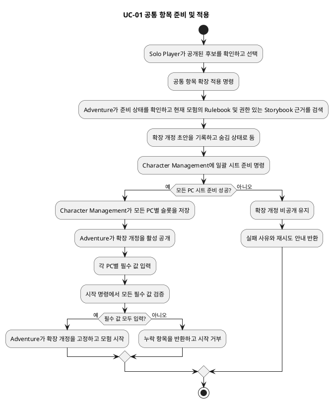
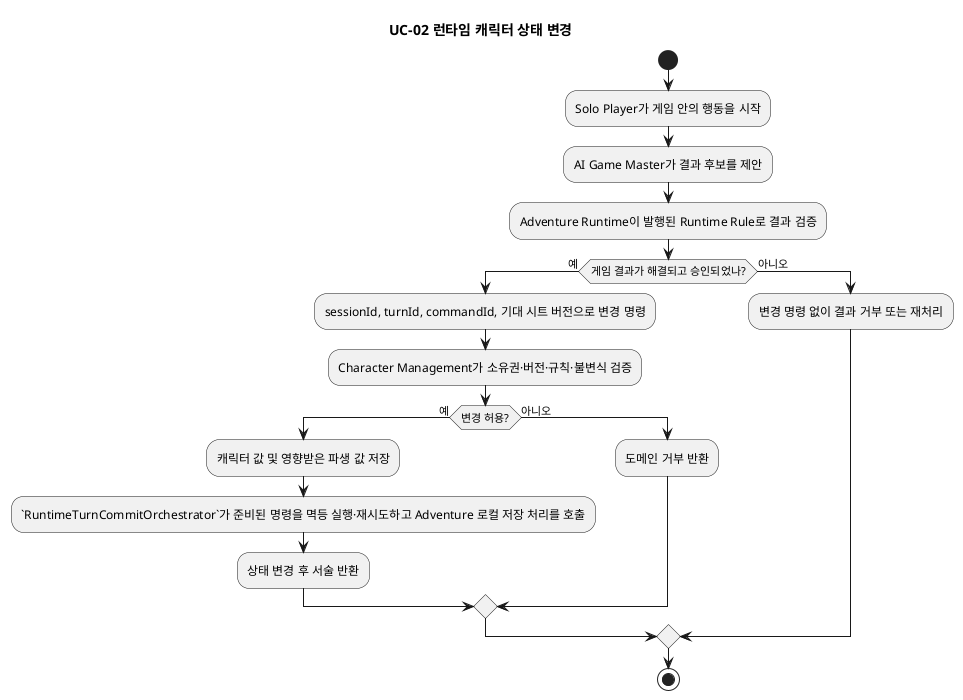
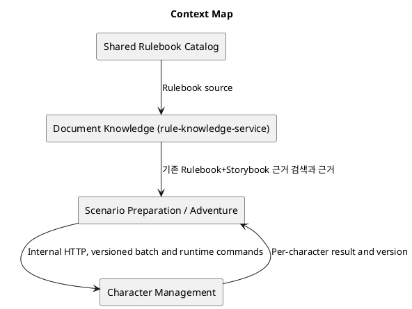
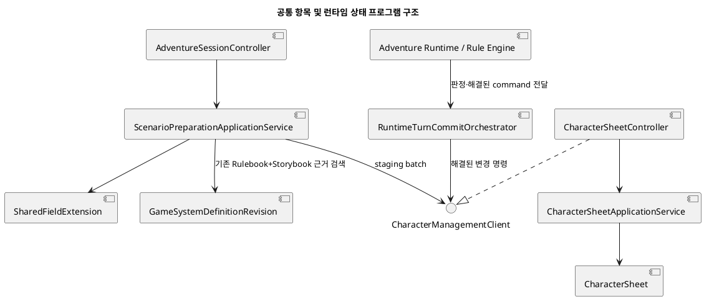
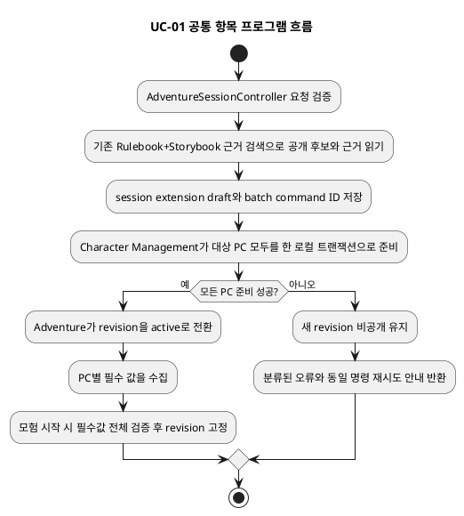
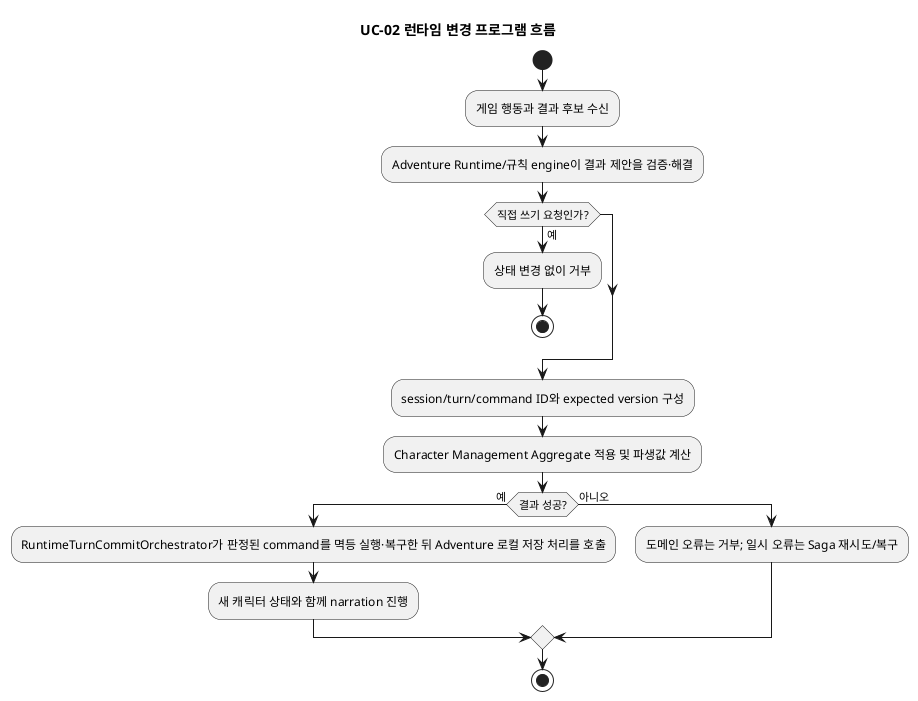
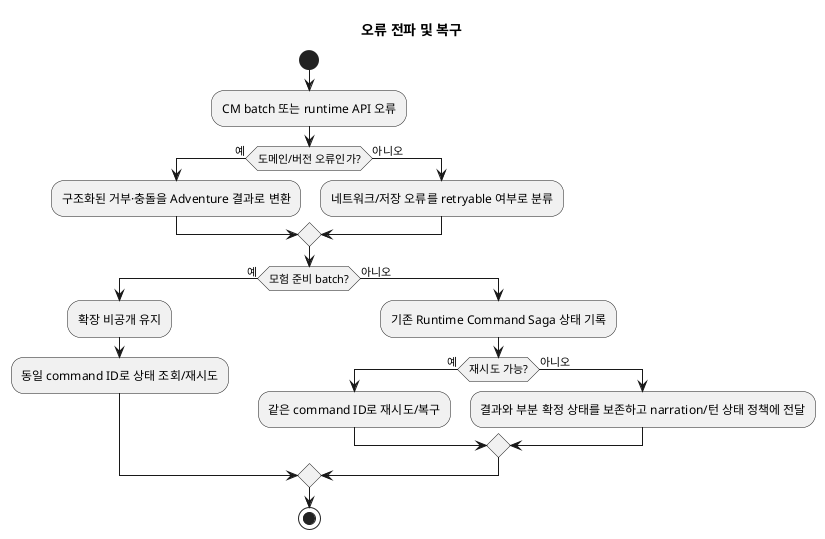
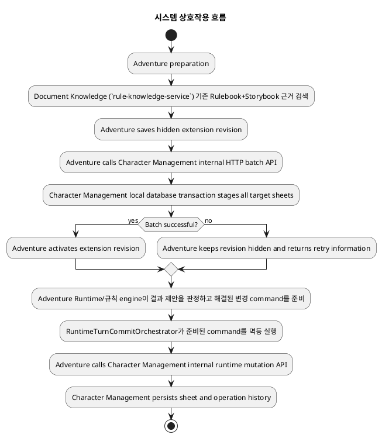
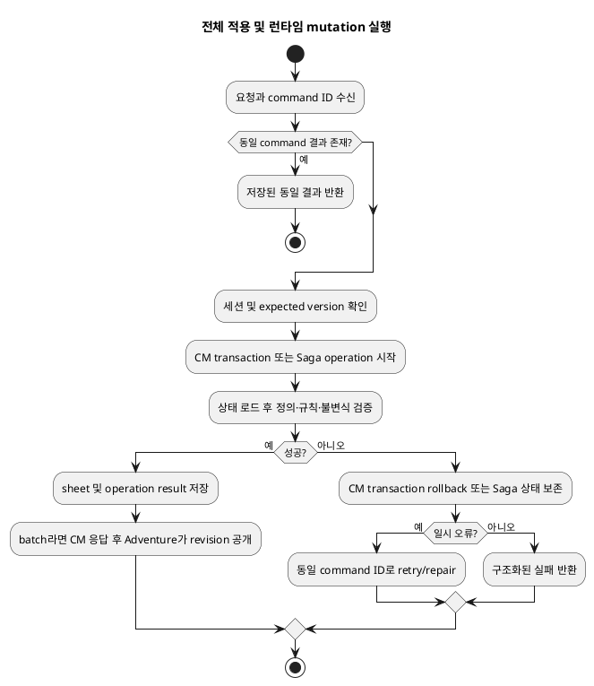
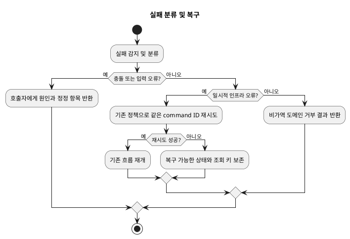

# Architecture Spec

# 1. Design Scope

## 1.1 Target

| 항목 | 대상 |
| --- | --- |
| Product Spec | `docs/specs/character-sheet-shared-fields-runtime-state/product-spec.md` |
| Use Cases | UC-01 공통 항목 선택·적용, UC-02 게임플레이 결과에 따른 캐릭터 상태 변경 |
| Domain | 현재 모험 준비, PC 캐릭터 시트, 게임플레이 상태 변경 |
| Bounded Contexts | Scenario Preparation, Adventure Runtime, Character Management, Document Knowledge (`rule-knowledge-service`) |
| Existing Services | `adventure-service`, `character-management-service`, `rule-knowledge-service` |
| External Dependencies | 현재 모험의 공개 Rulebook과 권한 범위 Storybook을 검색하는 Document Knowledge API, 기존 내부 HTTP 경계 |
| Affected Data | 모험별 추가 항목 확장·버전·공개 상태, PC별 값·시트 버전, 런타임 변경 명령 및 작업 이력, 추천 정확성 평가 사례·결과 |

## 1.2 Product Spec Mapping

| Product Spec 항목 | Architecture 요소 |
| --- | --- |
| UC-01, G-01, G-07, BR-01, BR-11 | 기존 D&D 5판 항목을 유지하고, 현재 모험의 Rulebook과 연결된 Storybook을 기존 하이브리드 근거 검색으로 조회해 후보를 추천; 전체 추출이나 신규 GSD 발행 계약은 요구하지 않음 |
| G-02, BR-02, BR-03, BR-06 | 모험별 확장 Aggregate와 Character Management 일괄 준비 명령; 임시 변경은 숨기고 확장 버전 공개 시점에 활성화 |
| G-03, BR-04, BR-05 | PC별 값은 Character Management가 소유; 시작 검증은 Adventure가 모든 PC의 필수 값을 확인 |
| UC-02, G-04, BR-07, BR-08, BR-10 | Adventure Runtime/규칙 engine이 결과 제안을 판정해 변경 명령을 준비하고 Character Management Aggregate가 최종 검증·저장·파생 값 재계산; `RuntimeTurnCommitOrchestrator`는 준비된 명령을 멱등 실행하고 Saga 생명주기를 관리 |
| G-05, BR-09 | 선택된 Game System Definition의 Runtime Rule만 부상 효과로 적용; 명시 규칙이 없으면 서술과 해결된 HP 피해만 유지 |
| BR-12 | 실제 Rulebook+Storybook 추천 검색 흐름의 고정 평가 사례; 초기에는 기준선 지표(비교를 시작할 때 측정한 첫 결과) 보고 |
| AC-03 실패 흐름 | 동일한 일괄 명령 ID로 재시도, PC별 준비를 멱등 처리하고 전체 준비 완료 전 확장 버전을 공개하지 않음 |
| AC-07, AC-10 | 시작 후 직접 수정 API 거부; 명령의 출처가 검증된 런타임 결과일 때만 상태 변경 |


## 1.3 확정된 설계 경계

- 추천 후보는 기존 D&D 5판 캐릭터 시트 정의에 덧붙이는 모험별 값이다. 기존 고정 시트 항목은 그대로 둔다.
- Adventure는 현재 모험의 Rulebook 식별자와 소유자가 접근 가능한 Storybook 범위를 기존 `CharacterContextSearchPort`/검색 adapter를 통해 질의한다. 문서 지식 경계의 기존 검색은 RULEBOOK과 STORYBOOK 근거를 함께 돌려줄 수 있다. 공유 catalog에 Storybook을 공개하거나 룰북 전체를 전수 분석하지 않는다.
- 추천 정확성 평가는 고정 질문·정답 후보·필수 여부·문서 유형/위치 근거를 사용해 추천 검색 흐름을 평가한다. 최초 결과는 기준선 보고이며 CI 기준은 나중에 확정한다.
- 신규 모험 준비 세션과 현재 준비 중인 이미 생성된 PC 시트에 적용하는 저장 변경은 포함한다. 과거 저장 데이터 전체를 찾아 변환하는 마이그레이션은 제외한다.

---

# 2. Domain Flow

## 2.1 Event Storming Flow





## 2.2 Commands

| Command | Actor | Target | Input | Preconditions | Result |
| --- | --- | --- | --- | --- | --- |
| `ApplySharedFieldExtension` (공통 항목 확장 적용) | Solo Player | Adventure의 모험 준비 Aggregate | session ID, 선택 후보 정의와 근거, command ID, 기대 확장 버전 | 모험 준비 중, 후보가 검색 범위의 근거를 가짐 | 숨김 초안과 Character Management 일괄 준비 요청 또는 도메인 거부 |
| `StageSharedFieldsForParty` (파티 공통 항목 임시 준비) | Adventure 내부 호출 | Character Management의 파티 시트 준비 기능 | session ID, 확장 개정 ID, 필드 정의, PC ID·기대 시트 버전 목록, command ID | 내부 서비스 인증, 해당 준비 세션과 PC 집합이 일치 | 숨김 준비 완료 결과 또는 실패 목록; 공개 시트 값·버전은 변경하지 않음 |
| `EnterSharedFieldValue` (PC별 공통 항목 값 입력) | Solo Player | Character Management의 PC 시트 | session ID, PC ID, 필드 키, 값, 기대 시트 버전 | 모험 준비 중이며 활성 확장이 적용되어 있음 | 해당 PC 값 및 버전 저장; 규격 위반이면 거부 |
| `StartAdventure` (모험 시작) | Solo Player | Adventure 세션 | session ID, 시작 요청 ID, 기대 세션 버전 | 기존 시작 조건 충족 및 모든 PC 필수 값 존재 | 구성 고정 및 시작 상태; 누락이면 누락 목록 반환 |
| `ApplyResolvedCharacterMutation` (해결된 캐릭터 변경 적용) | Adventure Runtime | Character Management의 CharacterSheet Aggregate | 세션·턴·명령 ID, PC ID, 기대 시트 버전, 규칙 근거가 포함된 변경 결과 | 모험 시작됨, 해결·승인된 런타임 결과, 허용된 변경 분류 | 값·파생 값 갱신 결과 또는 도메인 거부 |
| `UpdateCharacterSheetDirectly` (직접 시트 수정) | Solo Player | Character Management | 일반 수정 요청 | 시작 후에는 항상 거부 | 상태 변경 없이 명시적 직접 수정 거부 |

## 2.3 Domain Events

| Domain Event | Producer | Trigger | Payload | Consumers |
| --- | --- | --- | --- | --- |
| `SharedFieldExtensionStaged` (공통 항목 확장 준비 완료) | Adventure 준비 기능 | 모든 PC의 숨김 준비 성공 | session ID, extension revision, 명령 ID, 대상 PC 목록 | Adventure의 활성화 단계 |
| `SharedFieldExtensionActivated` (공통 항목 확장 공개) | Adventure 준비 Aggregate | 전체 준비 완료 확인 후 활성화 | session ID, revision, field keys | 시트 조회 및 모험 시작 검증 |
| `AdventureStarted` (모험 시작) | Adventure 세션 | 필수 값과 기존 시작 조건 통과 | session ID, 고정된 extension revision, 세션 버전 | 런타임 정책 |
| `CharacterMutationApplied` (캐릭터 변경 적용) | CharacterSheet Aggregate | 규칙 검증 및 저장 성공 | PC ID, 시트 버전, command ID, 변경 요약 | Adventure의 Runtime Saga |

이벤트 이름은 이 설계의 계약을 설명하기 위한 이름이다. 기존 구현에 이미 발행되는 도메인 이벤트라고 간주하지 않는다.

## 2.4 Policies

| Policy | Trigger Event | Decision | Emitted Command | Owner |
| --- | --- | --- | --- | --- |
| 확장 공개 정책 | 모든 PC의 임시 준비 완료 응답 | 준비 결과가 전체 성공이고 기대 개정이 아직 유효하면 공개 | Adventure 내부 활성화 전이 | Adventure 준비 기능 |
| 런타임 명령 완료 정책 | Character Management 변경 결과 | 적용 완료면 턴 결과 확정; 일시 실패면 같은 명령으로 재시도/복구; 영구 거부면 서술·턴 확정을 정책에 따라 중단 | 기존 Runtime Command Saga 후속 처리 | Adventure Runtime |
| 시작 잠금 정책 | 모험 시작 요청 | PC별 필수 값 및 기존 시작 검증 성공일 때만 확장 revision을 고정 | 기존 시작 coordinator 명령 | Adventure |

## 2.5 Read Models

| Read Model | Consumer | Source | Fields | Owner |
| --- | --- | --- | --- | --- |
| 모험 공통 항목 보기 | Solo Player, 모험 시작 검증 | 활성화된 확장 revision과 검색 추천 결과 | 필드명, 값 형태, 제약, 필수 여부, 문서 유형·출처 위치·발췌, revision | Adventure 준비 기능 |
| PC 시트 보기 | Solo Player, Adventure 시작 검증 | Character Management 시트 저장소 | 공통 확장 revision 참조, PC별 값, 누락/입력 상태, 시트 버전 | Character Management |
| 추천 정확성 평가 결과 | 개발·품질 검토자 | 고정 평가 사례와 실제 Rulebook+Storybook 추천 결과 | 항목명 정밀도·재현율·F1, 필수/선택 일치, 출처 일치 및 기준선 | 검색 평가 도구 |

## 2.6 External Interactions

| External System | Trigger | Input | Output | Failure |
| --- | --- | --- | --- | --- |
| Document Knowledge (`rule-knowledge-service`) | 준비 중 후보 추천 | 현재 모험의 Rulebook 식별자와 권한 있는 Storybook 범위, 검색 질의 | 기존 하이브리드 검색이 반환한 Rulebook/Storybook 근거 후보 | 어느 한 문서 유형의 근거도 없으면 추천하지 않음; 검색 범위 밖 Storybook은 거부 |
| Character Management 내부 API | 공통 필드 준비·값 입력·런타임 상태 변경 | session, PC, version, command, schema/value 또는 resolved mutation | 저장 결과·현재 버전·분류된 거부 | 충돌/일시 오류는 분류 후 재시도; 미완료 확장은 공개하지 않음 |
| 기존 Runtime Command Saga | 런타임 변경 처리 | 턴/세션/명령 ID와 변경 결과 | 적용 완료 또는 복구 가능한 상태 | 기존 재시도·복구 규칙 사용; 이미 확정된 게임 효과를 보상 취소하지 않음 |

## 2.7 Hotspots

| Hotspot | Options | Decision |
| --- | --- | --- |
| 모험마다 공통 항목 저장 위치 | GSD/기본 blueprint 변경; 모험별 확장 overlay | 준비 중 모험의 독립 revision으로 저장. GSD와 게시된 기본 blueprint는 불변으로 유지 |
| 모든 PC 시트 적용 일관성 | 분산 트랜잭션; 부분 노출; 숨김 임시 준비 후 활성화 | 서비스 간 분산 트랜잭션 없이 숨김 임시 준비와 Adventure 공개 게이트로 가시성의 전체 적용 또는 미적용 보장 |
| 추천 근거 범위 | 기존 고정 슬롯만; 룰북 전체 전수 분석; 모험별 관련 검색 | 기존 검색 기능으로 Rulebook과 권한 있는 Storybook의 관련 근거를 찾아 기존 D&D 5판 항목에 더할 후보를 추천 |
| 시작 후 시트 변경 | 플레이어 직접 수정; 모든 AI 결과 신뢰; 검증된 런타임 명령 | 직접 API는 거부. Adventure Runtime이 Runtime Rule을 검증하고 Character Management가 최종 불변식을 확인 |
| 정확성 통과 기준 | 지금 수치 설정; 첫 고정 사례 평가로 기준선 확인 후 기준 확정 | 기준선부터 측정·보고. 제품에서 정한 통과율은 그 결과 확인 뒤 결정하며 현재는 숫자 임계값이 없음 |

---

# 3. DDD Architecture

## 3.1 Bounded Contexts

| Bounded Context | Responsibility | Ubiquitous Language | Owned Model | Owned Data |
| --- | --- | --- | --- | --- |
| Scenario Preparation/Adventure | 현재 세션의 준비 구성·확장 revision·공개 상태·시작 잠금 및 런타임 명령 조정 | 모험 준비, 확장 revision, 활성화, 세션, 턴, 해결된 결과 | Scenario Preparation, Adventure Session, Runtime Command Saga | 모험 준비 데이터, blueprint 참조, 세션·턴·확장 상태 |
| Character Management | 각 PC의 캐릭터 값, 값 검증, 시트 버전과 런타임 변경의 최종 상태 소유 | PC 시트, 필드 값, 시트 버전, 캐릭터 변경 | CharacterSheet Aggregate, mutation rules | 캐릭터 시트 문서/행, operation history |
| Document Knowledge (`rule-knowledge-service`) | Rulebook/Storybook 문서 접근 정책과 기존 근거 검색 | 문서 유형, 검색 질의, 위치가 있는 근거 | 기존 검색 application service와 evidence DTO | 문서 색인과 권한 정책 |

문서 검색은 기존 Document Knowledge 경계(`rule-knowledge-service`)를 통해 수행한다. Adventure는 검색 결과를 캐릭터 시트 후보로 제시하되 별도의 GSD 필드 추출·발행을 추가하지 않는다.

## 3.1.1 Boundary Decisions

| Capability | Owner Context | Candidate Boundary | Chosen Boundary | Why Not Weaker? | Why Not Stronger? |
| --- | --- | --- | --- | --- | --- |
| 세션별 공통 항목 확장 | Scenario Preparation/Adventure | Entity / Aggregate / 내부 기능 / context | Adventure 내부 버전 관리 기능과 aggregate | 단순 blueprint 수정은 게시 발행본 불변성과 현재 세션 한정 요구를 위반하므로 session ID와 revision이 있는 별도 상태가 필요 | 준비 workflow 외 독립 수명주기나 언어가 없어 별도 context·service는 불필요 |
| 여러 PC 시트의 숨김 임시 준비 | Character Management가 값 소유, Adventure가 공개 여부 소유 | 내부 application capability / module / service | 기존 두 서비스의 내부 기능과 기존 API 경계 | 값 검증·저장은 Character Management만 할 수 있고 공개 여부는 Adventure가 알아야 하므로 소유권 경계는 필요 | 새 service나 분산 transaction 없이 Adventure 공개 게이트로 전체 적용 불변식을 보장 |
| 추가 항목 추천·평가 | Adventure 준비 기능과 기존 Document Knowledge 검색 | 내부 capability / module / service | 기존 context와 검색 port를 사용 | Rulebook과 Storybook 검색 결과를 현재 모험의 권한 범위로 제한하고 기존 D&D 5판 항목에 후보를 추가 | 별도 context/service나 GSD 발행 주기는 필요하지 않음 |
| 캐릭터 게임 상태 갱신 | Character Management | aggregate behavior / context / service | CharacterSheet Aggregate 동작 및 기존 Character Management 서비스 | 저장소와 캐릭터 불변식 소유자가 최종 검증해야 함 | 이미 적합한 context/service가 있어 신규 경계는 책임 중복 |

## 3.2 Context Map



| Upstream | Downstream | Relationship | Contract | Translation |
| --- | --- | --- | --- | --- |
| Shared Rulebook Catalog | Document Knowledge (`rule-knowledge-service`) | 공급자 계약 | Rulebook 식별자와 본문/근거 | 기존 Rulebook adapter가 내부 Rulebook 표현으로 변환 |
| Document Knowledge (`rule-knowledge-service`) | Adventure | 발행 언어 | 기존 근거 검색: immutable GSD revision, 후보 정의, 근거 위치 | Adventure는 선택된 발행 revision을 세션 구성으로 해석 |
| Adventure | Character Management | 고객/공급자, 내부 동기 API | 일괄 시트 준비, PC별 값 쓰기, 런타임 변경 명령; 버전·명령 ID | Character Management 요청 DTO를 각 aggregate 입력으로 번역 |
| Character Management | Adventure | 내부 응답 계약 | 적용됨/충돌/거부, 현재 시트 버전과 적용 요약 | Adventure Saga가 응답을 턴 결과 상태로 변환 |

## 3.3 Aggregates

| Aggregate | Root | Responsibility | Commands | Events | Invariants |
| --- | --- | --- | --- | --- | --- |
| 모험별 공통 항목 확장 | session별 공통 항목 확장 revision | 선택된 검색 추천 항목을 현재 모험 구성에만 추가하고 준비/공개/고정 상태 관리 | 적용 요청, 숨김 준비 결과 기록, 공개, 모험 시작 고정 | 확장 공개, 구성 고정 | Adventure 활성 revision만 사용자 공개의 최종 기준; 모든 PC의 숨김 준비가 성공한 뒤에만 공개 revision 전환; 기반 GSD/blueprint 불변 |
| Adventure Session | 기존 세션 root | 파티·준비·시작 상태 및 현재 고정 revision 유지 | 파티 구성, 시작, 턴 해결 | AdventureStarted, 기존 턴 이벤트 | 시작 검증 통과 전 started 금지; 시작 뒤 구성 고정 |
| CharacterSheet | `CharacterSheet` | PC 값·공개 버전과 유효한 상태 변경 | 숨김 필드 준비, PC 값 입력, 런타임 mutation | CharacterMutationApplied 및 기존 변경 기록 | 숨김 준비는 공개 값/공개 버전을 바꾸지 않음; 값은 정의된 형식·규칙을 만족; 공개 버전 일치; 시작 후 직접 변경 금지; 같은 command ID는 한 번만 적용 |
| GameSystemDefinitionRevision | `GameSystemDefinitionRevision` | 발행된 GSD, 추출된 공통 후보, 근거와 Runtime Rule 보존 | 추출 평가 및 발행 workflow | 발행 revision 기록 | 발행 revision 불변; 출처 없는 후보는 추천 대상 아님 |

Aggregate 간 session의 확장 전체 적용은 분산 트랜잭션으로 묶지 않는다. 임시 준비 상태와 Adventure의 단일 공개 전이가 가시성 불변식을 제공한다.

## 3.4 Entities

| Entity | Aggregate | Identity | Responsibility | State |
| --- | --- | --- | --- | --- |
| `SharedFieldExtensionRevision` (모험별 공통 항목 확장 개정) | 모험별 공통 항목 확장 | session ID + revision | 해당 모험의 선택 필드와 공개 생명주기 | 초안/준비 중/공개/고정, GSD revision 참조, 필드 정의 목록 |
| `CharacterSheet` | CharacterSheet | PC ID | PC의 빌드·현재 상태·공개 버전 소유 | build, runtime values, 활성 확장별 값, 공개 version |
| `GameSystemDefinitionRevision` | GSD | system ID + revision | 발행 시스템 정의의 불변 식별 | extracted fields, evidence, runtime rules, publication status |
| `RuntimeMutationOperation` (런타임 변경 작업 기록) | CharacterSheet 변경 기록 | command ID | 중복 실행 차단과 결과 재조회 | 요청 지문(같은 요청인지 비교하는 요약), 처리 결과, 적용 공개 시트 버전 |

## 3.4.1 Class Diagram

요구사항 추적: UC-01, UC-02, G-01..G-07, BR-01..BR-12. 클래스 책임과 버전이 있는 모험별 항목 확장·CharacterSheet 값 소유권·Document Knowledge 근거 경계를 나타낸다. 추출 평가기와 고정 평가 사례의 관계도 포함한다.

원본: `docs/specs/character-sheet-shared-fields-runtime-state/diagrams/architecture/character-sheet.class.puml`

SVG: [캐릭터 시트 클래스 구조](diagrams/architecture/character-sheet.class.svg)

## 3.5 Value Objects

| Value Object | Aggregate | Values | Validation | Behavior |
| --- | --- | --- | --- | --- |
| `CharacterFieldDefinition` (캐릭터 항목 정의) | 확장 revision / GSD revision | 안정 키, 이름, 입력 형태, 제약, 필수 여부, provenance/confidence/진단 | 키·형태·제약 유효; 필수 기본, 선택 표기는 룰북 근거 필요; 기본값 임의 생성 금지 | PC별 값 검증 규칙 제공 |
| `SourceEvidence` (문서 근거) | 추천 후보 | 문서 유형(RULEBOOK/STORYBOOK), 문서 ID·버전, 인용/위치 | 현재 모험의 검색 권한과 검색 결과 안에서 근거를 재현 | 추천 및 감사 화면에 근거 제공 |
| `CharacterFieldValue` (캐릭터 항목 값) | CharacterSheet | field key, typed value, extension revision | 정의된 shape·제약 및 필수/선택 규칙에 따라 검증 | 수용/거부 판정 |
| `ResolvedCharacterMutation` (해결된 캐릭터 변경) | 런타임 경계 전달 값 | session/turn/command ID, PC ID, 예상 버전, 규칙 근거, 변경 목록 | 허용된 mutation 유형·게임 상태·수치 한계 검증 | aggregate가 승인 가능한 상태 전이로 적용 |
| `RecommendationEvaluationCase` (추천 평가 사례) | 검색 평가 도구 | 질문, Rulebook/Storybook 원문 위치, 예상 항목·필수 여부·근거 정답 | 사례는 문서 접근 권한과 버전을 기록해 고정 | 실제 추천 결과의 항목·필수 여부·근거 지표 계산 |

## 3.6 Domain Services

| Domain Service | Responsibility | Input | Output | Collaborators |
| --- | --- | --- | --- | --- |
| `CharacterMutationRules` (캐릭터 변경 규칙) | 선택한 GSD의 규칙과 캐릭터 불변식에 따른 수정 가능성·파생 값 계산 | sheet state, resolved mutation, runtime rule version | 새 상태 또는 분류된 도메인 거부 | CharacterSheet, rule evaluator |
| 추천 평가기 | 고정 사례에서 실제 검색 추천의 각 평가 차원 산출 | 평가 사례, Rulebook+Storybook 추천 결과 | 기준선 지표 및 사례별 오류 | 기존 검색 평가 도구와 gold evaluator |

`SharedFieldExtensionActivation`은 Character Management API를 호출하는 교차 경계 조정이다. Domain Service가 아니라 Adventure의 application service/coordinator가 batch 결과를 확인하고 확장 개정의 공개 전이를 실행한다.

## 3.7 Business Rule Ownership

| Business Rule | Owner | Enforcement Point |
| --- | --- | --- |
| 후보는 현재 모험 검색 범위에서 근거를 확인할 수 있어야 한다 (BR-01, BR-11) | Adventure / Document Knowledge (`rule-knowledge-service`) | 모험 범위 검색 요청과 반환된 문서 유형·위치 근거 검증 |
| 현재 모험에만 적용하고 base GSD/blueprint는 바꾸지 않는다 (BR-02) | Adventure | session-scoped revision aggregate |
| 전체 PC 준비 전에 확장 내용을 노출하지 않는다 (BR-03) | Adventure가 공개 소유; Character Management가 값 저장 | batch 결과 검증 후 extension revision 활성화 |
| 필수는 기본이고 선택은 명시 근거가 필요; 임의 기본값 없음 (BR-04) | Document Knowledge (`rule-knowledge-service`)가 정의, Character Management가 값 검증 | Adventure의 추천 mapper, CharacterFieldDefinition, sheet value validation |
| 필수 값 누락 시 시작 금지 (BR-05) | Adventure | start coordinator가 모든 PC 시트를 조회하고 검증 |
| 준비 중 확장 가능, 시작 후 고정 (BR-06) | Adventure | extension aggregate/session policy의 상태 guard |
| 시작 후 직접 쓰기 금지; 게임플레이 결과만 상태 반영 (BR-07, BR-10) | Adventure 인증·명령 출처; Character Management 최종 적용 | public full-update 경로 거부, 내부 런타임 명령만 허용 |
| 입력 변경에 따른 파생 값 재계산 (BR-08) | Character Management | CharacterSheet mutation rules와 저장 전 계산 |
| 룰북에 없는 부상 페널티 금지 (BR-09) | GSD Runtime Rule + Character Management | Runtime Rule 실행 결과; 정의 없으면 injury-only 상태효과 생략 |
| 정확성 사례와 기준선 보고, 임계값 후확정 (BR-12) | 추천 검색 품질 평가 | offline evaluator; threshold 미설정 상태는 보고 전용 |

## 3.8 Aggregate State Transitions

| Current State | Command / Event | Next State | Owner | Preconditions | Emitted Event |
| --- | --- | --- | --- | --- | --- |
| 초안 | `StageSharedFieldsForParty` (파티 공통 항목 임시 준비) | 준비 중 | Adventure + CM | 모험 준비 중이며 필드 정의 유효 | 숨김 준비 요청; PC 공개 값/version 변화 없음 |
| 준비 중 | 모든 PC 숨김 준비 성공 | 공개 | Adventure 확장 공개 조정기 | 응답 대상 PC와 기대 revision 일치 | `SharedFieldExtensionActivated` (확장 공개) |
| 준비 중 | 한 PC라도 실패 | 이전 공개 revision 유지 / 재시도 가능 | Adventure 확장 공개 조정기 | 일괄 결과 실패 | 실패 결과; 공개 PC 값/version 및 활성 revision 불변 |
| active | PC별 값 입력 | active | CharacterSheet | 필드 정의와 시트 버전 일치 | 시트 버전 증가/operation 기록 |
| active | `StartAdventure`, 전 필수 값 완료 | locked | Adventure Session/extension | 모든 시작 조건 통과 | `AdventureStarted` |
| active | `StartAdventure`, 필수 값 누락 | active | Adventure Session | 누락 목록이 있음 | 시작 거부; 구성 변경 없음 |
| locked/runtime | 직접 시트 수정 요청 | locked/runtime | CharacterSheet policy | 세션 시작됨 | 거부; 이벤트/시트 변경 없음 |
| runtime | `ApplyResolvedCharacterMutation` 성공 | runtime, 새 CharacterSheet version | CharacterSheet | 해결 승인·Runtime Rule 유효·version 일치 | `CharacterMutationApplied` |

## 3.8.1 State Diagram

아키텍처 상태 그림은 Product 사용자 업무 흐름을 다시 그리지 않고, 서로 다른 설계 책임을 나눠 표현한다. 첫 그림은 서비스 경계를 넘는 임시 준비의 비공개 상태, 단일 공개 게이트, 실패 시 이전 revision 보존 및 재시도를 보여 준다. 둘째 그림은 게임플레이 변경 명령의 검증·적용·거부·재시도와 Saga 처리 상태를 보여 준다.

원본: `docs/specs/character-sheet-shared-fields-runtime-state/diagrams/architecture/shared-field-batch.state.puml`

SVG: [공통 항목 일괄 준비 상태](diagrams/architecture/shared-field-batch.state.svg)

원본: `docs/specs/character-sheet-shared-fields-runtime-state/diagrams/architecture/runtime-character-command.state.puml`

SVG: [런타임 캐릭터 변경 명령 상태](diagrams/architecture/runtime-character-command.state.svg)

## 3.9 Repository Boundaries

| Repository | Aggregate | Operations | Consistency Boundary |
| --- | --- | --- | --- |
| Adventure extension repository | session extension revision | draft 만들기, staging 상태/결과 기록, 활성화, 시작 시 고정, expected revision 확인 | Adventure DB 단일 transaction |
| `CharacterSheetRepository` | CharacterSheet | 공개 값 갱신, runtime mutation, version 조회 | 한 PC 시트와 변경 기록의 CM-local transaction; 확장 임시 준비는 별도 숨김 저장 기록이며 공개 시트 version을 올리지 않음 |
| `GameSystemDefinitionRevision` repository | GSD revision | 기존 발행 규칙 읽기; 추가 항목 후보는 검색 응답에서 구성 | 발행 revision은 immutable |
| 추출 평가 사례 저장소 | evaluation case set | 버전 고정 사례 읽기, 결과 artifact 저장 | 평가 실행 단위; 제품 런타임과 분리 |

---

# 4. Program Design

## 4.1 Program Structure



## 4.2 Major Components and Responsibilities

| Component | Responsibility | Input | Output | Dependencies | Must Not Do |
| --- | --- | --- | --- | --- | --- |
| `ScenarioPreparationApplicationService` | 기존 검색 adapter로 현재 모험 범위의 Rulebook 및 Storybook 근거를 조회하고 session extension 적용 조정 | session, search query, selected candidate, versions | 근거가 연결된 후보, 활성화/대기/실패와 사용자 안내 | `CharacterContextSearchPort`, extension repository, CM client | 다른 모험/소유자의 Storybook 검색; 룰북 전체 전수 분석; 기본 시트나 GSD 변경 |
| `SharedFieldExtensionActivationCoordinator` (공통 항목 공개 조정기) | CM 전체 PC 숨김 준비 결과를 확인하고 Adventure의 활성 revision을 전환 | session, extension revision, batch result | 활성 revision 또는 분류된 실패 | extension aggregate, Character Management client | CM DB 직접 접근; PC 값 소유; 일부 성공 공개 |
| 모험별 공통 항목 확장 aggregate | 후보 선택, 상태/revision 및 공개 guard 유지 | 선택된 정의, 준비 결과, 시작 고정 | 상태 전이 결과 | extension repository | PC별 값 소유 또는 일부 성공분 공개 |
| `CharacterManagementClient` | 내부 API에 일괄 준비·값·runtime 명령 전달 | versioned DTO와 idempotency IDs | 성공/충돌/도메인 오류 응답 | HTTP adapter | Adventure DB 직접 접근 |
| `CharacterSheetApplicationService` | PC별 schema/value 준비 및 gameplay mutation 오케스트레이션 | PC IDs, values, resolved mutation | 저장된 시트 버전 또는 오류 | sheet aggregate/repository, rules | Adventure session 상태를 임의로 추정 |
| `CharacterSheet` | 최종 값 유효성, 허용된 변화, 버전 불변식 | typed value/mutation | 변경된 aggregate 또는 거부 | field definition, mutation rules | 시작 후 player direct-write 승인 |
| 기존 근거 검색 adapter | RULEBOOK과 권한 있는 STORYBOOK의 기존 혼합 검색 결과를 현재 모험 범위로 제한해 제공 | query, Rulebook ID/revision, Storybook owner/session scope | 문서 유형·버전·위치·발췌가 포함된 evidence candidates | `CharacterContextSearchPort`, 기존 Document Knowledge search API | 발행 파이프라인 추가, 범위 밖 문서 노출, 근거 없는 항목/필수 여부 생성 |
| 추천 정확성 evaluator | 고정 정답 사례로 실제 Rulebook+Storybook 추천의 항목명·필수 여부·출처 근거를 평가 | 사례, 추천 검색 결과 | 기준선별 항목명 정밀도·재현율·F1, 필수 여부 일치, 출처 일치 | 기존 검색 평가 자산과 evaluator | 아직 합의되지 않은 CI 통과 기준 적용 |
| Adventure Runtime/규칙 engine | AI Game Master의 결과 제안을 선택한 GSD 규칙으로 판정·해결 | 게임 행동/결과 제안, GSD revision, 캐릭터 상태 | 확정된 변경 명령 또는 지원 불가 결과 | 선택된 Runtime Rules, character state read model | 미지원 핵심 규칙을 임의 처리 |
| `RuntimeTurnCommitOrchestrator` | 준비된 변경 명령의 멱등 실행, Saga 생명주기·재시도/복구 및 narration ordering | 판정된 변경 command | 확정/대기/실패 턴 결과 | prepared command, CM client, Saga storage | Runtime Rule 판정 책임을 대체하거나 미판정 결과를 확정 서술로 처리 |

## 4.3 Application Flow





## 4.4 Component Call Contracts

| Order | Caller | Callee | Operation | Input | Output | Failure |
| ---: | --- | --- | --- | --- | --- | --- |
| 1 | Preparation application | 기존 근거 검색 adapter | `searchCharacterFieldEvidence` | Rulebook revision, Storybook owner/session scope, session context | 기존 검색 계약이 제공하는 후보·근거·문서 유형 메타데이터 | 현재 고정 슬롯 추출과 구분; 후보가 없으면 준비 불가 안내 |
| 2 | Preparation application | Character Management client | `stageSharedFieldsForParty` | session/revision/batch IDs, field definitions, PC IDs와 expected versions | 전체 성공 또는 실패 PC·분류 오류 | timeout은 결과 불확실로 보고 같은 batch ID 조회/재시도 |
| 3 | `SharedFieldExtensionActivationCoordinator` | Extension aggregate/repository | `activate(expectedRevision)` | revision 및 CM 전체 준비 완료 token | active revision | stale revision/session started 충돌 |
| 4 | Start coordinator | Character Management client | `validateRequiredValues` | session, PC IDs, extension revision | PC별 누락 목록 | 내부 오류면 시작하지 않음 |
| 5 | Adventure Runtime / 규칙 engine | Runtime command preparation | `validateAndResolve` | action/result, GSD revision, current values | typed resolved mutation or unsupported rule | unsupported core rule blocks; optional unsupported rule warning per ADR-013 |
| 6 | `RuntimeTurnCommitOrchestrator` | Character Management client | `applyRuntimeMutation` | session/turn/command IDs, PC ID, expected version, 판정된 변경 목록, rule version | applied result and new version | conflict, forbidden direct source, invariant failure, retryable infrastructure error |
| 7 | Character Management application | CharacterSheet repository | `save(expectedVersion)` | aggregate state and operation ID | persisted version and operation result | optimistic conflict; no silent overwrite |

## 4.5 Major Types

| Type | Kind | Responsibility | State | Dependencies |
| --- | --- | --- | --- | --- |
| `SharedFieldExtensionRevision` | Domain Type / Aggregate | 모험 단위 schema overlay와 공개 lifecycle | revision, fields, state | none |
| `SharedFieldExtensionActivationCoordinator` | Adventure application service/coordinator | CM 전체 PC 숨김 준비 성공 후 Adventure 활성 revision 전환 | batch result, extension revision | extension aggregate, Character Management client |
| `CharacterFieldDefinition` | Value Object | source-derived input shape and validation metadata | key, shape, constraints, requiredness, evidence ref | GSD provenance |
| `PartySheetBatchCommand` | DTO | 동일 필드 revision을 전체 대상 시트에 idempotent 적용 요청 | batch ID, session, revision, target versions | internal API |
| `PartySheetBatchResult` | DTO | 전체 준비 성공 또는 대상별 실패 | result status, staged token, failures | internal API |
| `ResolvedCharacterMutation` | Domain DTO | runtime-originated, rule-checked delta/operation set | session/turn/command, expected version, rule revision, changes | Runtime Rule output |
| `RuntimeMutationOperation` | Entity | duplicate detection and outcome lookup | command ID, fingerprint, result | CharacterSheet persistence |
| `ExtractionEvaluationCase` | Evaluation data type | fixed question/source/gold answer | case ID, Rulebook revision/excerpt, expected field facts | evaluator |

## 4.6 Type Design

### `SharedFieldExtensionRevision`

| 항목 | 정의 |
| --- | --- |
| Kind | Adventure 내부 Aggregate |
| Responsibility | 현재 session의 공통 필드 overlay revision·activation·lock을 소유 |
| Dependencies | `CharacterManagementClient` port를 호출하는 application service만 의존 |
| Must Not Depend On | Character Management DB, published GSD mutation, future-session defaults |

#### State

| Field | Type | Meaning | Constraint |
| --- | --- | --- | --- |
| `sessionId` | UUID/string | 적용 대상 현재 모험 | 하나의 adventure session |
| `revision` | long/string | 해당 세션의 확장 버전 | 단조 증가 또는 불변 revision ID |
| `fieldDefinitions` | list of `CharacterFieldDefinition` | 선택한 후보 정의 | 중복 key 금지, 근거 참조 필수 |
| `status` (상태) | enum | 초안(draft), 준비 중(staging), 공개(active), 고정(locked) | 허용된 전이만 수행 |
| `batchCommandId` | UUID | CM staging idempotency key | retry에서 유지 |
| `publishedGsdRevision` | string | 후보의 근거가 나온 발행 정의 | 불변 참조 |

#### Behavior

| Method | Input | Output | Responsibility | State Change |
| --- | --- | --- | --- | --- |
| `beginStaging` | 선택한 정의, 기대 revision | batch command | 준비 세션·정의를 확인하고 임시 준비 시작 | 초안 → 준비 중 |
| `activate` | 전체 batch 완료 token, 기대 revision | 공개 revision | 모든 PC 완료를 확인하고 revision 공개 | 준비 중 → 공개 |
| `lockForStart` | 시작 검증 token | 고정 revision | 시작 후 필드 구성 변경 차단 | 공개 → 고정 |

#### Invariants

| Invariant | Enforcement Point |
| --- | --- |
| 새 revision은 모든 PC sheet stage 완료 전 활성화되지 않는다 | `activate` |
| 모험 시작 후 revision과 field definitions는 바뀌지 않는다 | `lockForStart`, session policy |
| 같은 session extension은 다른 session에 자동 복사되지 않는다 | session-scoped key/repository query |

### `CharacterSheet`

| 항목 | 정의 |
| --- | --- |
| Kind | Character Management Aggregate |
| Responsibility | PC별 build/runtime 값과 버전, 유효한 변경을 소유 |
| Dependencies | field definitions, selected-system mutation rules |
| Must Not Depend On | Adventure persistence; arbitrary player write after start |

#### State

| Field | Type | Meaning | Constraint |
| --- | --- | --- | --- |
| `characterId` | UUID/string | PC identity | stable unique ID |
| `version` | long | 공개 캐릭터 시트의 동시 수정 확인용 version(버전) | 공개 상태가 실제로 바뀐 저장에서만 증가; 숨김 임시 준비에서는 유지 |
| `extensionValues` | map keyed by extension revision and field key | PC별 값 | 필드 모양 검증; 공유 값 없음; Adventure 활성 revision과 일치할 때만 공개 |
| `runtimeState` | typed/map-backed values | selected rules' current state | only allowed runtime rule mutation |
| `operationHistory` (변경 작업 기록) | command ID/요청 지문/결과 | 중복 방지 | 실제 시트 변경 결과와 같은 transaction(트랜잭션)에서 저장; 숨김 확장 준비 기록과 구분 |

#### Behavior

| Method | Input | Output | Responsibility | State Change |
| --- | --- | --- | --- | --- |
| `stageExtension` | definitions, session/revision, expected version | 숨김 준비 token | 공개 CharacterSheet 값·version은 그대로 두고 별도 숨김 준비 기록 저장; Adventure 공개 전에는 일반 시트 조회에 포함하지 않음 | 공개 시트 변경 없음 |
| `setExtensionValue` | field key, typed value, expected version | updated version | validate one PC's entry | value update |
| `applyResolvedMutation` | `ResolvedCharacterMutation` | structured outcome/new version | enforce authorization/invariants, apply operations, recalculate affected derived values | accepted runtime change |
| `rejectDirectUpdate` | caller/session policy | forbidden result | reject player-sourced update after start without mutation | none |

#### Invariants

| Invariant | Enforcement Point |
| --- | --- |
| Expected version must match; no lost update | repository optimistic version condition |
| Command ID and fingerprint cannot apply a different operation twice | operation history + unique constraint |
| Every value matches the active definition and rule-supported constraints | aggregate/domain service before save |
| Unauthorized direct mutation changes no persisted state | application policy and aggregate entry point |

## 4.7 Interfaces and Function Signatures

### `CharacterManagementClient`

```java
interface CharacterManagementClient {
    PartySheetBatchResult stageSharedFieldsForParty(PartySheetBatchCommand command);
    RequiredValueValidationResult validateRequiredValues(RequiredValueValidationCommand command);
    RuntimeMutationResult applyRuntimeMutation(ResolvedCharacterMutation command);
}
```

| 항목 | 정의 |
| --- | --- |
| Responsibility | Adventure에서 CM 내부 HTTP 경계로 versioned command 전달 |
| Caller | Scenario Preparation, Adventure Start Coordinator, Runtime Saga |
| Implementer | Character Management client adapter |
| Input | command ID와 fingerprint, session/revision, PC IDs·expected versions, typed data |
| Output | 성공/실패 분류, PC별 버전, 누락 목록 또는 operation result |
| Preconditions | 내부 service 인증; session/PC ownership 검사; 발행 정의와 지원 규칙 버전 일치 |
| Postconditions | 로컬 transaction 범위 내 결과 일관성 및 재조회 가능 |
| Errors | validation, forbidden, conflict, not found, unsupported rule, retryable infrastructure |
| Side Effects | CM-owned character sheets and operation history only |
| Idempotency | batch ID per extension revision; runtime command ID per mutation |

## 4.8 Error Propagation



| Failure Point | Source Error | Converted Error | Handler | Result |
| --- | --- | --- | --- | --- |
| 기존 근거 검색 | 검색 결과 없음 또는 권한 범위 밖 | `FIELD_CANDIDATE_UNAVAILABLE` | Preparation | 근거 없는 후보를 표시하지 않고 검색 범위 안내 |
| batch stage | 일부 PC conflict/검증 오류 | `BATCH_STAGE_FAILED` + per-PC reason | Preparation | revision 숨김; 이전 활성 revision 유지; 입력/버전 정정 후 재시도 |
| stage timeout | 요청 결과 불명 | `BATCH_OUTCOME_UNKNOWN` | Preparation | 같은 batch ID 조회/재전송; 중복 적용 없음 |
| activation | stale revision/session started | `REVISION_CONFLICT` | Adventure | 공개하지 않음; 최신 상태 재조회 |
| start check | required value missing | `REQUIRED_VALUES_MISSING` | Start coordinator | 누락된 PC/field 목록, start 없음 |
| runtime write | rule/invariant unsupported | structured domain rejection | Runtime Saga | 규칙상 지원되지 않는 변경 차단; unsupported core rule blocks per ADR-013 |
| runtime write | network/CM unavailable | retryable infrastructure | Runtime Saga | existing Saga retry/repair; state required before final narration |
| direct write | caller source not authorized | `DIRECT_MUTATION_FORBIDDEN` | CM policy/controller | 403/409 style contract, no state change |

## 4.9 State Transition Implementation

| State Transition | Domain Owner | Method | Persistence Point | Published Event |
| --- | --- | --- | --- | --- |
| draft → staging | Adventure extension | `beginStaging` | Adventure repository | internal operation status |
| staging → active | Adventure extension | `activate` after batch success | Adventure transaction | extension activation |
| active → locked | Adventure Session | start coordinator after all-sheet validation | existing session transaction/outbox | existing adventure start event |
| CharacterSheet version n → n+1 | CharacterSheet | stage/value/runtime method | CM optimistic update and operation history transaction | mutation result to Saga |
| 추천 질의 → 후보 표시 | Adventure preparation | 기존 Document Knowledge 하이브리드 검색 및 근거 mapper | 모험별 검색 응답; GSD 발행본 변경 없음 | 추천 목록 |

## 4.10 Dependency Rules

### Allowed Dependencies

| Source | Target | Contract |
| --- | --- | --- |
| Adventure preparation | Document Knowledge (`rule-knowledge-service`) read adapter | immutable published GSD DTO and evidence |
| Adventure preparation/runtime | Character Management client adapter | authenticated versioned commands/responses |
| Character Management application | CharacterSheet aggregate/repository | internal domain contract and optimistic version |
| Recommendation evaluator | existing retrieval evaluation library | fixed recommendation gold cases and metric output |
| Runtime Saga | Runtime Rule evaluator | selected GSD rule version and structured result |

### Forbidden Dependencies

| Source | Forbidden Target |
| --- | --- |
| Adventure service | Character Management database tables/repository |
| Character Management | Adventure session database/repository |
| PC sheet mutation handler | Rulebook raw catalog retrieval for ad hoc player edits |
| Recommendation endpoint | retrieval of sources outside the current adventure and owner scope |
| Started-session public controller | generic full-sheet write path |
| Product runtime | evaluation benchmark database/artifact as runtime authority |

---

# 5. Technical Architecture

## 5.1 Boundary Mapping

Bounded Context, internal capability, code module, deployment service를 1:1로 매핑하지 않는다. 각 capability에는 필요한 격리를 만족하는 가장 약한 경계를 선택한다.

| Bounded Context | Internal Capability | Code Boundary | Deployment Unit | Boundary Rationale |
| --- | --- | --- | --- | --- |
| Scenario Preparation/Adventure | 세션별 공통 항목 확장 | `adventure-service` 내부 기능 | 기존 adventure service | 세션 준비 소유권과 상태가 일치 |
| Character Management | PC별 필드 임시 준비와 규칙 기반 상태 변경 | 기존 서비스 내부 application/domain 기능 및 API 계약 | 기존 `character-management-service` | 시트·버전·변경 기록 소유자가 최종 저장 |
| Document Knowledge (`rule-knowledge-service`) | GSD 필드 후보 검색·추천과 오프라인 평가 | 기존 추출/발행 기능과 평가 도구 | 기존 `rule-knowledge-service` 및 평가 도구 | 같은 GSD 발행 생명주기에 귀속; 새 bounded context나 service를 만들지 않음 |

## 5.2 Boundary Promotion Decisions

| Candidate | Owner Context | Chosen Boundary | Why Not Weaker? | Why Not Stronger? | Introduced Cost |
| --- | --- | --- | --- | --- | --- |
| session extension | Adventure | package + aggregate | base immutable config와 session lifecycle을 별도 identity/revision으로 구분해야 함 | 독립 운영·모델·수명주기 없음 | 기존 bundle/session 저장 모델과 serialization 확대 |
| party batch orchestration | Adventure + CM API | 기존 서비스 사이 API 계약 | 상태 소유가 둘로 나뉘므로 명시적 contract 및 retry key 필요 | module/service 분리는 가치 없고 잦은 호출·운영 부담 | API 호환과 Saga/부분 실패 처리 |
| 추가 항목 추천 | Adventure preparation + Document Knowledge search | 기존 application capability와 검색 port | 기존 Rulebook+Storybook 혼합 검색을 사용 | 별도 service나 후보 발행 주기는 필요 없음 | 평가 사례 유지·검색 품질 측정 |

## 5.3 System Interaction Flow



## 5.4 Synchronous Communication

| Caller | Provider | Protocol | Operation | Request | Response | Timeout |
| --- | --- | --- | --- | --- | --- | --- |
| Adventure Preparation | Document Knowledge (`rule-knowledge-service`) | 신규 내부 HTTP/read adapter 계약 | 발행 공통 필드 후보 조회 | GSD ID/revision, 후보 조회 | 후보·근거 DTO | 현재 구현에는 후보 계약이 없음; 기존 내부 API timeout 정책 적용 |
| Adventure Preparation | Character Management | 내부 HTTP | stage all PC sheets | batch/session/revision IDs, definitions, expected PC versions | complete token or per-PC failure | 기존 internal-client timeout; timeout은 결과 불명으로 처리 |
| Adventure Start | Character Management | 내부 HTTP | required value validation | session/revision, party PC IDs | missing fields by PC | 기존 internal-client timeout |
| `RuntimeTurnCommitOrchestrator` | Character Management | 내부 HTTP | 판정된 runtime mutation 적용 | session/turn/command ID, PC, expected version, validated operations | operation result, current version | 기존 Saga 호출 제한 시간/재시도 정책 |

## 5.5 API Contracts

### `POST /internal/characters/shared-fields:stage`

#### Request

```json
{
  "sessionId": "session-123",
  "extensionRevision": "rev-2",
  "batchCommandId": "cmd-456",
  "fields": [{"key": "field-key", "shape": {}, "required": true, "evidenceRef": "gsd:rev-4#source-8"}],
  "characters": [{"characterId": "pc-1", "expectedVersion": 7}]
}
```

#### Response

```json
{
  "batchCommandId": "cmd-456",
  "status": "STAGED",
  "stagedCharacters": [{"characterId": "pc-1", "publicVersion": 7}],
  "failures": []
}
```

#### Errors

| Condition | Status / Code | Response |
| --- | --- | --- |
| field definition invalid | 400 / `FIELD_DEFINITION_INVALID` | field key and validation reason |
| expected sheet version differs | 409 / `SHEET_VERSION_CONFLICT` | PC ID, current version; no batch visibility |
| same batch ID with different fingerprint | 409 / `IDEMPOTENCY_KEY_REUSED` | conflict; no mutation |
| temporary service/database failure | 503 / retryable code | retry-after hint if available; caller retries same batch ID |

#### Properties

| Property | Value |
| --- | --- |
| Authentication (인증) | 기존 내부 서비스 토큰 |
| Authorization (접근 권한 확인) | Adventure 서비스 신원; 모험과 PC 소속 검증 |
| Idempotency (같은 명령 재실행 방지) | `batchCommandId`(일괄 명령 ID) + 정규화 요청 지문 |
| Timeout (응답 대기 한도) | 기존 내부 HTTP 설정; 초과 시 결과 불명으로 취급 |
| Compatibility (이전 버전 호환) | 기존 요청과 함께 동작하도록 새 JSON 필드를 추가하고 배포 순서를 조정 |

`status: "STAGED"`는 임시 준비가 끝났다는 응답값이며 일반 조회에 공개됐다는 뜻이 아니다. `publicVersion`은 기존 공개 시트 버전이며 임시 준비 전후 동일하다. 응답은 요청에서 받은 `expectedVersion`과 같은 값을 반환한다. 공개된 PC 시트 값이나 version은 이 호출에서 변경하지 않는다.

### `POST /internal/characters/{characterId}/runtime-mutations`

#### Request

```json
{
  "sessionId": "session-123",
  "turnId": "turn-45",
  "commandId": "cmd-789",
  "expectedVersion": 18,
  "gameSystemDefinitionRevision": "gsd-4",
  "ruleIds": ["rule-source-ref"],
  "mutations": [{"operation": "HP_DELTA", "amount": -3}]
}
```

#### Response

```json
{
  "commandId": "cmd-789",
  "status": "APPLIED",
  "version": 19,
  "changedValues": ["hp"]
}
```

#### Errors

| Condition | Status / Code | Response |
| --- | --- | --- |
| caller requests direct update | 403 / `DIRECT_MUTATION_FORBIDDEN` | no mutation |
| version conflict | 409 / `SHEET_VERSION_CONFLICT` | current version |
| mutation violates selected rules/invariant | 422 / `MUTATION_REJECTED` | structured rule and field errors |
| command key reused for another request | 409 / `IDEMPOTENCY_KEY_REUSED` | conflict |
| infrastructure unavailable | 503 / retryable code | Saga retry/repair metadata |

#### Properties

| Property | Value |
| --- | --- |
| Authentication | existing internal service token |
| Authorization | Adventure runtime identity; session started; command result validated |
| Idempotency | `commandId` plus request fingerprint scoped to character/session |
| Timeout | existing Runtime Saga deadline |
| Compatibility | explicit mutation operation version; unknown operations rejected |

이 경로는 target contract 예시이며 현재 API가 이미 이 전체 계약을 구현했다고 뜻하지 않는다. 기존 `CharacterSheetController`의 runtime endpoint는 HP delta, currency delta, item add/remove에 국한된다. 공통 항목 batch 및 범용 규칙 기반 mutation은 구현 갭이다.

## 5.6 Asynchronous Communication

| Producer | Consumer | Channel | Message | Delivery | Ordering |
| --- | --- | --- | --- | --- | --- |
| Adventure transaction/outbox | 기존 adventure consumers | 기존 session event channel | 모험 시작/턴 관련 이벤트 | 기존 전달 보장 | session/turn key |
| CM mutation result | Runtime Saga | 동기 응답과 Saga 저장 상태 | 적용 결과 | 요청-응답; timeout 후 command ID 조회/재시도 | session + character + turn |

새 비동기 broker나 이벤트 채널은 이 기능을 위해 추가하지 않는다.

## 5.7 Message Contracts

신규 비동기 message 계약은 적용하지 않는다. 확장 공개는 Adventure 내부 revision state로 관리하고, Character Management batch는 동기 API로 요청한다. 기존 outbox/event 계약은 유지하며 payload 확장이 필요할 때만 하위 호환 필드 추가와 schema version 검토를 수행한다.

## 5.8 Data Ownership

| Data | Owner | Storage | Key / Schema | Readers | Writers |
| --- | --- | --- | --- | --- | --- |
| 검색 추천 후보/근거 | Document Knowledge search response, Adventure가 현재 준비 중인 세션에 한해 보유 | 요청 결과; 필요하면 선택 후보만 session extension에 저장 | session ID + extension revision + source reference | Adventure preparation, evaluator | 기존 search adapter; Rulebook/Storybook 원본은 불변 |
| session field extension | Adventure | existing adventure persistence | session ID + extension revision/status | preparation, start, sheet view adapter | Adventure preparation/start coordinator |
| PC field values and sheet runtime state | Character Management | existing character sheet persistence | character ID + sheet version + extension revision/key | player view, Adventure validator/runtime | CM application service only |
| mutation operation history | Character Management | same local DB transaction as sheet state | command ID + fingerprint | retry handler, support/diagnostic | CM mutation service |
| recommendation benchmark and result artifact | evaluation tooling | versioned fixture/config and CI artifact | case-set version + run | maintainers/review | evaluator job |

## 5.9 Schema Changes

| Target | Action | Schema Change | Migration | Compatibility |
| --- | --- | --- | --- | --- |
| GSD definition JSON (기존 규칙 정의) | No change for candidate recommendations | 룰북·스토리북 검색 결과를 GSD에 추출/저장하지 않음 | 없음 | 기존 GSD 발행 계약 유지 |
| Adventure 세션 저장소 | Add | session별 확장 revision과 공개 상태 | 새로 생성되는 준비 세션용 nullable 필드 또는 별도 테이블 추가; 기존 저장 데이터 마이그레이션 제외 | 기존 세션은 확장 없음으로 조회 |
| Character Management 저장소 | Add | PC별 신규 세션 확장 값과 별도 숨김 준비 기록 | 신규 저장 구조만 추가; 과거 저장 데이터의 일괄 마이그레이션은 제외 | 임의 기본값 없음; 활성 revision 전 숨김 기록은 일반 시트 조회에서 제외 |
| Character operation history | Modify if needed | batch operation ID/fingerprint/result record | reuse existing idempotency storage if same uniqueness semantics; otherwise additive index/table | preserve current runtime command compatibility |
| evaluation fixtures | Add | fixed recommendation question/source/gold output cases | versioned data fixture; no production migration | report-only baseline first; no CI threshold until explicitly set |

## 5.10 Consistency Model

| Operation | Consistency | Source of Truth | Synchronization | Recovery |
| --- | --- | --- | --- | --- |
| 확장 공개 여부 | Adventure 조회 기준에서 강한 일관성 | Adventure의 활성 revision이 사용자 공개의 최종 기준 | CM 전체 숨김 준비 성공 응답 뒤에만 활성 revision 전환 | 숨김 준비 및 같은 명령 ID 재시도; CM 시트 조회는 활성 revision에 포함된 값만 반환 |
| PC 전체의 숨김 임시 준비 | 우선 구현은 CM 로컬 transaction(한 저장 단위에서 모두 반영); 사용자에게 보이는 전체 적용 여부는 Adventure 활성 revision이 보장 | Character Management 숨김 준비 기록과 Adventure 활성 revision | CM 한 transaction에서 모든 대상의 숨김 기록을 함께 저장; 크기 한도를 넘으면 PC별 숨김 기록으로 나누되 Adventure가 모든 성공 후에만 공개 revision 전환 | 실패 시 같은 명령 ID 재조회·재시도; 공개 시트 값과 version은 바뀌지 않음 |
| 공개 전이와 CM 숨김 준비 | 분산 transaction 없음; 숨김 준비 후 공개 protocol | Adventure 활성 revision이 공개 여부의 최종 기준; CM 숨김 기록이 PC별 값 소유 | 내부 동기 호출 뒤 Adventure가 전체 성공을 확인하고 공개 | 완료 여부를 확인할 때까지 숨김 유지, 같은 명령 ID 재조회 |
| PC 필드 값 입력 | PC별 강한 일관성 | CM 공개 시트 저장소 | 기대 공개 version 확인 | 충돌을 반환하고 최신 시트 재조회 |
| 런타임 변경 | PC별 강한 일관성; Adventure/CM 사이 Saga | Character Management 시트 상태 | 명령 중복 방지 ID + 기대 공개 version | 기존 Runtime Command Saga 재시도/복구 |
| GSD 발행 | 불변 revision | Document Knowledge 발행본 | revision 고정 참조 | 새 GSD revision을 발행하고 참조 중인 공개본은 덮어쓰지 않음 |

## 5.11 Infrastructure Dependencies

| Dependency | Responsibility | Accessed By | Isolation Boundary |
| --- | --- | --- | --- |
| Adventure persistence | session extension revision and Saga/session state | Adventure repositories | repository/application layer |
| Character Management database | sheet values, optimistic versions, operation history | CM repository | repository/transaction boundary |
| Document Knowledge (`rule-knowledge-service`) persistence | 기존 Rulebook/Storybook 색인과 접근 정책 | 기존 search adapter | read-only hybrid search port |
| existing internal HTTP infrastructure | commands between services | CM client adapter/controller | service authentication, timeout, error mapping |
| existing retrieval/evaluation toolchain | hybrid source retrieval and recommendation quality reporting | search adapter/evaluator | offline tooling boundary |

## 5.12 External Dependency Isolation

| External Dependency | Port | Adapter | Internal Model | Conversion Point |
| --- | --- | --- | --- | --- |
| Rulebook and authorized Storybook search | `CharacterContextSearchPort` | `CrossContextHttpCharacterContextSearchGateway` and existing search adapters | document type, document ID/revision, excerpt+locator | Adventure recommendation mapper |
| Character Management service | `CharacterManagementClient` | internal HTTP adapter | typed batch/mutation result | Adventure DTO mapper |
| Rulebook/Storybook search | `CharacterContextSearchPort` | existing cross-context search adapter | typed search request/results with source evidence | Adventure recommendation mapper |

## 5.13 File and Module Structure

### Existing Structure

```text
src/adventure-service/
  .../ScenarioPreparationApplicationService.java
  .../CharacterCreationBlueprint.java
  .../AdventureSessionApplicationService.java
  .../AdventureSessionController.java
  .../RuntimeTurnCommitOrchestrator.java
src/character-management-service/
  .../CharacterSheetController.java
  .../CharacterSheetApplicationService.java
  .../RuntimeCharacterMutation.java
  .../CharacterSheet.java
  .../PostgresCharacterSheetRepository.java
src/rule-knowledge-service/
  .../GameSystemDefinitionRevision.java
  .../RuleKnowledgeController.java
scripts/evaluate_preprocessing.py
src/preprocessing_agent/eval/gold.py
src/preprocessing_agent/eval/retrieval.py
tests/integration/test_semantic_gold_evaluator.py
```

### Target Structure

```text
src/adventure-service/
  .../ScenarioPreparationApplicationService.java       # published candidate lookup + session overlay orchestration
  .../SharedFieldExtensionRevision.java                # session revision and visibility lifecycle
  .../CharacterManagementClient.java                  # internal boundary contract
  .../AdventureSessionApplicationService.java          # start-time completeness and lock
  .../RuntimeTurnCommitOrchestrator.java               # resolve → mutate → commit/narrate order
src/character-management-service/
  .../CharacterSheetController.java                    # staging/value/runtime endpoints; direct-write guard
  .../CharacterSheetApplicationService.java            # batch staging and typed mutation application
  .../CharacterFieldDefinition.java                   # source-grounded shape/requiredness contract
  .../CharacterSheet.java                              # per-PC values/invariants/derived values
  .../RuntimeCharacterMutation.java                   # generalized allowed operation model
src/rule-knowledge-service/
  .../CharacterContextSearchPort.java                  # existing hybrid search for current Rulebook and authorized Storybooks
  .../CharacterFieldCandidateExtractor.java            # expands beyond fixed field topics
scripts/evaluate_preprocessing.py                      # extend/use existing fixed-case evaluator path
tests/fixtures/character-field-recommendation-gold.json    # fixed question, Rulebook/Storybook source, expected candidates and evidence
tests/integration/test_character_field_recommendation_evaluation.py
```

### File Change Map

| Path | Action | Type / Component | Responsibility |
| --- | --- | --- | --- |
| `src/adventure-service/.../ScenarioPreparationApplicationService.java` | Modify | application service | session extension selection and batch coordination; no ad hoc Rulebook search |
| `src/adventure-service/.../SharedFieldExtensionRevision.java` | Add | aggregate/value model | session-specific schema revision, state, activation and start lock |
| `src/adventure-service/.../AdventureSessionApplicationService.java` | Modify | start coordinator | every-PC required-value validation and revision freeze |
| `src/adventure-service/.../CharacterManagementClient.java` | Add/modify | port and adapter | internal versioned batch/value/runtime contract |
| `src/character-management-service/.../CharacterSheetController.java` | Modify | API boundary | stage fields, set values, expose runtime mutation; reject player direct write after start |
| `src/character-management-service/.../CharacterSheetApplicationService.java` | Modify | application service | atomic CM batch, per-PC value validation, runtime mutation and result |
| `src/character-management-service/.../CharacterSheet.java` | Modify | aggregate | typed extension values, all authorized mutation invariants, derived recalculation |
| `src/rule-knowledge-service/.../GameSystemDefinitionRevision.java` | Modify | GSD model/persistence | source-grounded generalized field candidate shape and evidence |
| recommendation search/evaluator files listed above | Modify/add | offline evaluation | fixed gold benchmark and separated accuracy dimensions |

The target filenames are architectural seams, not a claim that these classes already exist.

---

# 6. Runtime Design

## 6.1 Runtime Flow



## 6.2 Concurrent Access

| Shared Resource | Concurrent Actors | Conflict |
| --- | --- | --- |
| session extension revision | player candidate selection, start coordinator, retries | stale revision, activation after start |
| one PC sheet | value entry, runtime mutation, batch staging | optimistic version conflict/lost update |
| one batch command | duplicate HTTP retries, concurrent retry workers | duplicate or conflicting fingerprint |
| GSD revision | publication and session selection | must not mutate pinned revision; select new revision instead |

## 6.3 Concurrency Control

| Target | Control Unit | Strategy | Owner | Timeout |
| --- | --- | --- | --- | --- |
| session extension | session/revision | expected revision and lifecycle compare-and-set | Adventure | request duration bounded by existing API timeout |
| CharacterSheet | PC ID/version | optimistic locking through repository update predicate | Character Management | existing DB transaction timeout |
| 파티 숨김 준비 | batch command ID + 정렬된 PC 목록 | 우선 CM 로컬 transaction과 중복 방지 기록; 크기 한도를 넘으면 PC별 숨김 준비 기록을 사용하되 Adventure 활성 revision 전환은 전체 성공 이후에만 허용 | Character Management | 내부 호출 제한 시간; 불확실한 결과는 같은 ID로 확인 |
| runtime turn | session + turn + command | existing Saga ordering and command deduplication | Adventure Runtime | existing Saga deadline |

## 6.4 Ordering

| Operation | Ordering Scope | Ordering Key | Enforcement |
| --- | --- | --- | --- |
| extension stage/activate/start | per session | session ID + revision | Adventure state/version guard |
| PC value and runtime update | per character | character ID + expected version | CM optimistic update |
| mutation retry | per command | command ID | operation history and Saga record |
| runtime result/narration | per turn | session ID + turn ID | existing RuntimeTurnCommitOrchestrator ordering; required state before narration |

## 6.5 Transaction Boundaries

| Transaction | Owner | Operations | Commit Condition | Rollback Condition |
| --- | --- | --- | --- | --- |
| CM 파티 일괄 임시 준비 | Character Management | 모든 PC version 확인, PC별 숨김 준비 기록과 일괄 결과 저장 | CM 로컬 트랜잭션에서 모든 대상의 숨김 준비 기록과 결과가 함께 저장; 공개 시트 값/version은 바뀌지 않음 | 검증/충돌/저장 오류 시 로컬 transaction rollback |
| Adventure extension activation | Adventure | verify staging token and current session/revision, set active | CM reports complete stage | token incomplete/stale or session started |
| PC value update | Character Management | validate one value, save sheet+operation result | typed value valid and expected version current | validation/conflict/storage failure |
| runtime mutation | Character Management | validate resolved command, apply operations, recalculate, persist operation record | aggregate invariants pass and version current | local transaction fails; no partial PC state |
| runtime cross-service Saga | Adventure coordinates; local work in each context | command lifecycle, CM mutation, turn completion | required downstream result recorded according to existing Saga | no global rollback; recover/retry, preserve committed state under ADR-020 |

## 6.6 Idempotency

| Operation | Idempotency Key | Detection Point | Duplicate Result |
| --- | --- | --- | --- |
| party extension staging | `batchCommandId` + fingerprint | CM batch operation record | return original complete/failure outcome |
| revision activation | session ID + extension revision + expected state | Adventure repository | return active result if same revision; reject stale/different request |
| per-PC value entry | request command ID if retried; expected version | CM operation history/repository | return original success or conflict; never overwrite newer version |
| runtime mutation | `commandId` + session/turn + fingerprint | CM operation history and Adventure Saga | return prior mutation result and version |
| fixed evaluation run | case set version + pipeline version + run ID | evaluator artifact metadata | separate run artifact; no production state change |

## 6.7 Partial Failure

| Failure Situation | Persisted State | External State | Recovery |
| --- | --- | --- | --- |
| CM batch에서 한 PC라도 검증 실패 | 우선 구현인 CM 로컬 transaction이 숨김 준비 기록 전체를 rollback; 크기 한도 대안에서는 일부 PC의 숨김 기록만 남을 수 있음 | Adventure revision은 비공개; PC의 공개 값/version 변화 없음 | 같은 batch ID로 결과 확인 후 재시도; 어떤 일부 기록도 공개하지 않음 |
| CM 숨김 준비 완료 후 응답 유실 | CM에 숨김 준비 기록과 멱등 결과가 남음; 공개 시트 값/version은 미변경 | Adventure에는 활성 revision 없음 | 같은 batch ID로 확인/재시도 후 전체 성공이 확인될 때만 Adventure가 revision 공개 |
| Adventure activation write fails after CM stage success | CM staged values hidden | Adventure old revision remains active | retry activation with same revision/token |
| runtime mutation saved but response lost | CM sheet and operation result committed | Adventure Saga may be awaiting | retry/query same command ID; do not reapply |
| runtime mutation rejected after earlier gameplay effects already persisted | committed earlier effects remain per ADR-020 | Saga reports partial confirmed state | repair/retry unresolved command; no compensating undo of confirmed effects |

---

# 7. Error Handling and Recovery

## 7.1 Failure and Recovery Flow



## 7.2 Error Classification

| Error | Category | Retryable | Handler | Caller Result |
| --- | --- | --- | --- | --- |
| 필드 후보 근거/정의 유효성 실패 | Domain/Validation | No until corrected | GSD publication/Preparation | 후보 미제공 또는 발행 실패 상세 |
| PC version conflict | Conflict | After refresh | CM application/Preparation | 충돌 PC와 최신 버전; batch 비공개 |
| required value missing | Domain | After input | Adventure start | 시작 거부와 PC별 누락 항목 |
| direct sheet update after start | Authorization/Domain | No | CM controller/application | 상태 변화 없는 거부 |
| unsupported core Runtime Rule | Domain/Rule support | No until system definition corrected | Rule evaluator | 진행 차단 per ADR-013 |
| unsupported optional mechanic | Domain/Rule support | No | Rule evaluator | 경고, 정해진 범위 내 진행 per ADR-013 |
| HTTP timeout/5xx | Infrastructure | Yes, same idempotency key | client/Saga | pending/unknown until resolved |
| same idempotency key with changed payload | Conflict | No | CM idempotency guard | key misuse error |

## 7.3 Retry Policy

| Operation | Retry Condition | Max Attempts | Backoff | Exhausted Result |
| --- | --- | ---: | --- | --- |
| party stage | connection/timeout/5xx; batch result unknown | existing internal retry limit; preserve configured value | existing client policy | hidden revision, expose retry action and batch ID |
| activate extension | DB transient error after stage success | existing application retry policy | bounded | old revision remains active; retry same revision/token |
| runtime CM mutation | retryable infrastructure/conflict resolved by fresh version only where command semantics remain same | existing Runtime Saga policy | existing Saga schedule | Saga repair state and operation lookup; no premature final narration |
| fixed evaluator | transient retrieval/provider failure | evaluator runner policy | configured offline retry | mark case/run incomplete, never count as recommendation miss silently |

정확한 attempt 수와 delay는 기존 client/Saga 설정을 사용하며 구현 단계에서 실제 기본값을 명세 검토 증거와 함께 매핑한다. 기능별 새 숫자는 이 문서에서 임의로 정하지 않는다.

## 7.4 Compensation

| Failure | Trigger | Compensation | Compensation Failure |
| --- | --- | --- | --- |
| PC batch stage failure | any target sheet preparation fails | batch local transaction rollback; staged values remain hidden | batch ID 조회 및 재시도; 이전 revision 유지 |
| activation failure after staging | Adventure DB transient failure | no CM compensation needed; staged state remains invisible | retry activation with same completion token |
| confirmed runtime mutation followed by later Saga failure | downstream processing error | no compensating reversal of confirmed gameplay effect per ADR-020 | preserve state and repair/retry unresolved Saga work |

## 7.5 Recovery

| Failure | Recovery Point | Recovery Input | Recovery Action |
| --- | --- | --- | --- |
| unknown party batch result | CM operation record | batch ID + fingerprint | retrieve outcome; activate only on complete success |
| CM partial failure | no visible active revision | same batch ID, corrected expected versions/inputs in a new command only after resolving prior outcome | re-run all-or-none batch; keep previous active revision |
| activation response unknown | Adventure extension record | session/revision ID | read active status; idempotently retry if not active and session still preparing |
| runtime response unknown | CM operation history + Adventure Saga | command ID | return recorded result or retry same command |
| extractor/evaluator incomplete | versioned evaluation artifact | case ID and run ID | rerun failed cases; distinguish operational failure from wrong answer |

## 7.6 Rollback

| Target | Rollback Strategy | Data Handling | Compatibility |
| --- | --- | --- | --- |
| GSD schema | support reading prior revision; publish corrected new revision | published revisions immutable | sessions pin their selected revision |
| session extension | deactivate only before it becomes active; after active in preparation, replace through a new revision; after start locked | keep prior revision for audit, never affect later sessions | old sessions have no overlay |
| CM hidden staged data | rollback CM-local transaction or expire/mark abandoned staging record | never expose without Adventure activation | no change to currently visible sheet fields |
| runtime state | no compensation of confirmed gameplay effects; use forward correction only when a valid game rule command supports it | preserve operation history and confirmed state | ADR-020 behavior |

---

# 8. Security

## 8.1 Authentication and Authorization

| Entry Point | Authentication | Authorization | Failure |
| --- | --- | --- | --- |
| public preparation/sheet UI | existing player authentication | player owns the current session/PC; session is preparing | 401/403; no mutation |
| internal party staging API | existing internal service token | Adventure service identity; session and exact party membership checked | reject and audit; no stage |
| internal runtime mutation API | existing internal service token | Adventure runtime only; started session and validated command metadata required | reject direct/untrusted caller |
| evaluator invocation | CI/developer execution identity | read-only benchmark sources; write only evaluation artifacts | no production state credentials |

## 8.2 Input Validation

| Input | Validation | Sanitization | Size Limit |
| --- | --- | --- | --- |
| field candidate | stable key, allowed typed shape, supported constraints, requiredness backed by evidence | normalize labels and identifiers; preserve quoted source separately | existing GSD schema limits |
| batch command | unique PC IDs, bounded party size, matching session/revision, expected versions, fingerprint | canonical JSON before hashing | existing API/request body limit |
| PC field value | value matches schema, length/range/enum limits, requiredness | type-aware encoding; render escaped | schema-defined maximum |
| resolved runtime mutation | allowlisted operation type, finite numeric range, valid rule IDs/revision, session/turn/PC ownership | reject unknown operation fields | selected system and API constraints |
| evaluation case | source locator, question, expected schema, evidence mapping valid | fixture parser/schema validation | fixture repository limits |

## 8.3 Sensitive Data

| Data | Storage Protection | Transport Protection | Log Policy |
| --- | --- | --- | --- |
| PC values and gameplay state | existing character storage access controls | existing internal TLS/network controls | do not log full free-text values; log PC/session/field key and outcome |
| Rulebook evidence excerpts | existing catalog/GSD access policy | existing service transport | log source ID/locator, not large raw excerpt unless current policy allows |
| idempotency fingerprints | service database access controls | internal service transport | safe IDs only; no secret/token values |
| fixed gold evaluation data | repository access controls and CI artifacts | CI provider controls | reports may include field labels and evidence locator; avoid unrelated user data |

## 8.4 Secrets

| Secret | Storage | Consumer | Rotation |
| --- | --- | --- | --- |
| `INTERNAL_SERVICE_TOKEN` (내부 서비스 인증 토큰) | existing secret/config mechanism | Adventure ↔ Character Management gateway/controllers | existing project rotation policy; never include in logs |

---

# 9. Observability

## 9.1 Logs

| Component | Event | Level | Context |
| --- | --- | --- | --- |
| Adventure preparation | extension staging started/activated/failed | INFO/WARN | session ID, revision, batch ID, target count, outcome code |
| Character Management | batch result and PC version conflict | INFO/WARN | batch ID, PC IDs, version numbers, failure class; omit values |
| Start coordinator | required value validation failed | INFO | session ID, missing PC/field keys |
| Runtime Saga | mutation requested/applied/retried/repair-needed | INFO/WARN/ERROR | session, turn, command IDs, GSD/rule revision, result code |
| evaluator | case result/run baseline | INFO/WARN | case set version, pipeline version, metric dimensions, incomplete cases |

## 9.2 Metrics

| Metric | Type | Labels | Trigger Point |
| --- | --- | --- | --- |
| 공통 항목 일괄 준비 횟수 | 누적 횟수 | 결과, 오류 종류, 필드 수 구간 | CM 일괄 준비 API |
| 공통 항목 일괄 준비 시간 | 시간 분포 기록 | 결과, 파티 크기 구간 | Adventure/CM 경계 |
| 공통 항목 공개 실패 횟수 | 누적 횟수 | 실패 종류 | 공개 전이 검사 |
| 필수 항목 누락으로 인한 시작 차단 횟수 | 누적 횟수 | 누락 수 구간 | 시작 검증기 |
| 런타임 캐릭터 변경 횟수 | 누적 횟수 | 변경 종류, 결과, 규칙 지원 구분 | CM 변경 처리기 |
| 런타임 캐릭터 변경 재시도 횟수 | 누적 횟수 | 재시도 이유 | Saga 처리기 |
| 항목명 정밀도·재현율·F1 점수 (정밀도는 맞다고 찾은 항목 비율, 재현율은 정답 항목을 찾은 비율, F1은 두 비율의 조화 평균) | 기준선 수치와 실행 기록 | 평가 사례 묶음 버전, 추출기 버전 | 오프라인 평가기 |
| 필수·선택 여부 판정 정확도 (정답과 일치한 비율) | 기준선 수치와 실행 기록 | 평가 사례 묶음 버전, 추출기 버전 | 오프라인 평가기 |
| 출처 근거 일치율 (정답으로 지정한 룰북 위치와 일치한 비율) | 기준선 수치와 실행 기록 | 평가 사례 묶음 버전, 추출기 버전 | 오프라인 평가기 |

## 9.3 Tracing

| Span | Parent | Attributes | Error Condition |
| --- | --- | --- | --- |
| `applySharedFieldExtension` | preparation request | session ID, extension revision, field count, batch ID | candidate invalid, stage/activation failure |
| `stageSharedFieldsForParty` | extension apply | batch ID, party size, expected revision | conflict, timeout, partial validation failure |
| `startAdventureValidation` | start request | session ID, extension revision, missing count | required fields missing |
| `applyRuntimeMutation` | Saga turn span | session/turn/command IDs, GSD revision, operation types | rejection, retry, invariant failure |
| `evaluateCharacterFieldExtraction` | evaluator run | case set and pipeline versions, case ID | case error or score below eventual threshold |

## 9.4 Alerts

| Alert | Condition | Severity | Action |
| --- | --- | --- | --- |
| batch staging failures increase | persistent infrastructure or conflict failures above existing service alert policy | Warning | inspect CM availability, version conflicts, batch operation records |
| runtime Saga repair backlog | unresolved mutation commands exceed existing Saga alert policy | Critical | inspect command IDs and repair safely; preserve confirmed state |
| recommendation baseline regression | metric worsens vs recorded baseline | Warning initially; block only after agreed threshold exists | inspect failed cases and update pipeline/evidence handling |
| incomplete evaluation run | gold cases failed operationally | Warning | rerun incomplete cases; do not classify as recommendation mismatch |

---

# 10. Change Boundaries

## 10.1 Allowed Changes

| Target | Allowed Change |
| --- | --- |
| Scenario Preparation/Adventure | add session-only overlay revision, hidden staging/activation, start-time value validation, lock on start |
| Character Management | add typed per-PC extension values, all-target batch staging, rule-authorized runtime mutations, derived-value recalculation and direct-write guard |
| Scenario Preparation/Adventure | use existing hybrid search over current Rulebook and authorized Storybooks; preserve the D&D 5e preset fields and offer additional candidates |
| recommendation evaluation | add fixed questions/source/gold expected candidates; report field identification, requiredness, and evidence metrics; baseline first |
| internal API/DTOs | add versioned idempotent staging and resolved mutation contracts |
| persistence | additive schema/revision/operation metadata needed to preserve ownership and recovery |

## 10.2 Forbidden Changes

| Target | Forbidden Change |
| --- | --- |
| published GSD and base blueprint | mutate in place for a current adventure's selection |
| future adventures | automatically inherit this session's overlay |
| player UI/API after start | arbitrary direct sheet mutation |
| injury handling | invent a penalty without explicit selected-system rule |
| cross-service consistency | expose partial batch results or require global distributed transaction |
| runtime mutation | accept unvalidated AI/player state deltas or write around CharacterSheet aggregate |
| recommendation search | exhaustive full-book analysis or search of Storybooks outside current adventure/owner scope |
| evaluator CI | enforce a numeric recommendation threshold before baseline review and user agreement |

## 10.3 Conditional Changes

| Target | Condition | Required Decision |
| --- | --- | --- |
| recommendation CI gate | after initial recommendation benchmark baseline is reviewed | user confirms minimum acceptance thresholds |
| 추천 항목 값 형태 지원 | 추천 항목이 현재 값 모델로 표현되지 않음 | 근거에 맞는 값 형태를 정의하고 지원되지 않는 핵심 동작은 ADR-013에 따라 차단 |
| runtime operation catalog | selected GSD declares mechanics beyond supported operations | represent via allowlisted Runtime Rule; core severity blocks, optional severity warns |
| CM 일괄 transaction 크기 | 대상 PC/항목 수가 단일 DB transaction 한도를 넘음 | 숨김 PC별 준비 기록으로 나누어 저장하되 Adventure 공개 게이트를 유지해 모든 성공 전에는 활성 revision을 바꾸지 않음 |

---

# 11. Verification Requirements

## 11.1 Domain Verification

| Target | Verification |
| --- | --- |
| candidate source and requiredness | recommendation policy tests verify Rulebook/Storybook evidence locator, field shape and required-by-default/explicitly-optional handling; missing evidence is rejected |
| session-scoped extension | aggregate tests prove extension affects only its session and does not mutate preset D&D 5e fields or copy to another session |
| batch visibility invariant | orchestration/domain tests prove active revision only after all PC slots staged and previous revision retained on any failure |
| required value gate | start validation tests include every PC, missing required value, explicit optional value, no invented default |
| start lock | state transition tests reject adding fields after started and preserve locked revision |
| direct mutation guard | started-session player-originated update is rejected with identical sheet values/version |
| rule-authorized mutation | aggregate tests cover HP, derived recalculation, resources/status/injury, item/currency and level/skills only when declared by GSD rules |
| injury without explicit effect | only resolved HP damage applies; no inferred stat decrease is produced |
| unsupported rules | core unsupported blocks; optional unsupported produces warning per ADR-013 |
| recommendation gold evaluation | fixed question+Rulebook/Storybook excerpt/location+expected candidate set reports field-name precision/recall/F1, requiredness correctness, and evidence match separately; initial run records baseline without a blocking threshold |

## 11.2 Program Verification

| Target | Verification |
| --- | --- |
| preparation responsibility | application tests ensure candidate recommendations use published GSD only and do not invoke raw retrieval at selection time |
| batch call contract | contract tests verify session/revision/PC IDs/expected versions/batch ID and full result mapping |
| Character Management responsibility | service tests prove one PC value ownership, per-PC validation, operation record and version behavior |
| runtime call contract | tests verify only resolved runtime command reaches mutation API; direct player write is blocked |
| dependency rule | architecture/module tests or static checks verify no cross-service database access |
| failure propagation | tests verify typed validation/conflict/infrastructure errors and no success response before activation |

## 11.3 Technical Contract Verification

| Contract | Test Level | Verification |
| --- | --- | --- |
| stage API | integration/contract | schema validation, service auth, idempotency fingerprint, all-or-none result, optimistic version errors |
| runtime mutation API | integration/contract | allowed command source, operation allowlist, expected version and structured result |
| GSD schema evolution | serialization/compatibility | old fixed-slot documents deserialize; new arbitrary candidate records round-trip with evidence and revision |
| session extension storage | repository integration | revision uniqueness, visibility state, 신규 세션의 extension 저장; 기존 저장 데이터 migration 제외 |
| recommendation evaluator artifacts | evaluator integration | metric calculation against gold fixture, separate operationally incomplete cases from incorrect recommendations |

## 11.4 Runtime Verification

| Condition | Execution Model | Expected Result |
| --- | --- | --- |
| duplicate staging request | concurrent same batch ID/fingerprint | same outcome returned; each PC extension staged once |
| batch with one invalid/stale PC | multi-PC integration transaction | no visible extension revision; CM transaction rollback or hidden stages only |
| activation race with adventure start | concurrent expected revision/start | one valid lifecycle transition; no post-start schema change |
| concurrent sheet value and runtime mutation | same PC expected version | one succeeds; stale command conflicts without lost update |
| same runtime command retried after timeout | Saga + CM integration | prior result returned; mutation not duplicated |
| derived input changed | aggregate execution | affected derived values recomputed in same persisted state |
| runtime mutation applied but later processing fails | Saga fault injection | confirmed state retained; recovery continues without compensation, per ADR-020 |

## 11.5 Recovery Verification

| Failure | Injection Method | Expected Recovery |
| --- | --- | --- |
| CM batch commits but response is dropped | internal HTTP fault injection | retry/query same batch ID; activate only on confirmed complete result |
| one PC version conflict | stale expected version fixture | no partial visible state; user gets conflicting PC and refresh/retry instructions |
| Adventure activation DB failure | repository transient failure | revision stays hidden until idempotent retry succeeds |
| runtime API times out after CM commit | drop response after transaction commit | operation history resolves same command result; no duplicate mutation |
| search provider fails for a case | evaluator fault injection | case marked operationally incomplete; baseline excludes no case silently and run reports incomplete |
| unsupported injury mechanic | GSD fixture without injury consequence | narrative injury plus resolved HP delta, no fabricated penalty |

## 11.6 Agent Verifier Criteria

### Domain

* [ ] Capability와 Bounded Context가 구분되어 있음
* [ ] 새 Bounded Context가 weaker boundary로 충분하지 않은 근거를 가짐
* [ ] Bounded Context 책임 준수
* [ ] Aggregate 경계 준수
* [ ] 비즈니스 규칙 소유권 준수
* [ ] 상태 전이 및 불변식 준수

### Program Design

* [ ] 주요 컴포넌트 책임 일치
* [ ] 인터페이스와 함수 시그니처 일치
* [ ] 호출 흐름 일치
* [ ] 오류 전파 방식 일치
* [ ] 의존성 규칙 준수

### Technical Architecture

* [ ] Bounded Context / capability / code boundary / deployment unit 매핑 일치
* [ ] 새 module 또는 service 경계가 weaker boundary로 충분하지 않은 근거를 가짐
* [ ] API와 메시지 계약 준수
* [ ] 데이터 소유권 준수
* [ ] 외부 의존성 격리
* [ ] 파일과 모듈 구조 일치

### Runtime

* [ ] 동시성 제어 준수
* [ ] 트랜잭션 경계 준수
* [ ] 순서 보장 준수
* [ ] 멱등성 준수
* [ ] 실패 복구 준수

### Scope

* [ ] 허용된 변경 범위 준수
* [ ] 금지된 변경 없음
* [ ] 불필요한 구조 변경 없음

### Evidence

* 실행 명령: 명세 작성 단계에서는 실행하지 않음
* 테스트 결과: 구현 전이므로 해당 없음
* 변경 파일: 이 architecture spec 파일; 별도 agent가 인벤토리에 지정된 `.puml` 및 SVG를 생성
* Architecture 위반: 구현 전 미판정
* Contract 위반: 구현 전 미판정
* 미검증 항목: 실제 batch transaction size와 기존 retry 설정에 맞춘 값; 구현 검토 시 확인
* Human Review 항목: gold benchmark baseline 확인 후 recommendation CI 통과율 확정

---

# 12. Alternatives and Trade-offs

| Decision | Option | Advantages | Disadvantages | Result |
| --- | --- | --- | --- | --- |
| 공통 항목 저장 | 게시된 GSD/base blueprint 수정 | 조회 경로 단순 | 기존 발행본 의미를 바꾸고 미래 모험에 의도치 않게 전파 | Reject |
| 공통 항목 저장 | 세션별 versioned extension | 기존 bundle 불변, 현 준비만 적용, 이미 만든 PC 지원 | Adventure 저장·API·검증 추가 | Adopt |
| 전 PC 적용 | 각 시트 순차 공개 | 단순한 단계별 저장 | 일부 PC만 변경되는 제품 불변식 위반 | Reject |
| 전 PC 적용 | 분산 DB transaction | 원자적 commit 가정 가능 | 서비스 간 결합과 운영 실패 복잡도, 현재 경계에 맞지 않음 | Reject |
| 전 PC 적용 | CM hidden staging + Adventure activation gate | 기존 소유권 유지, 활성화 전 전체 비가시성 | staging/재시도 상태 관리 필요 | Adopt |
| 후보 추천 | 룰북 전체 전수 분석·모든 항목 사전 추출 | 문서 전체를 한 번에 처리 | 현재 모험에 필요한 범위를 넘고 사용자가 요구한 검색형 추천과 다름 | Reject |
| 후보 추천 | 현재 모험 범위의 Rulebook+Storybook 검색 근거를 사용 | 기존 검색·권한 계약 재사용, 근거 위치 보존 | 검색 결과 조합과 평가 사례 구현 필요 | Adopt |
| 추출 품질 gate | 임의 수치 즉시 CI 차단 | 단순한 pass/fail | 근거 없는 기준으로 유효 구현을 차단할 수 있음 | Defer threshold; report baseline |
| 런타임 상태 쓰기 | player/general update endpoint | 편리 | 직접 임의 수정 허용, 출처·규칙 검증 우회 | Reject |
| 런타임 상태 쓰기 | validated command through Runtime Saga + CM aggregate | 소유권·규칙·멱등성 보장 | rule coverage와 operation model 확장 필요 | Adopt |

---

# 13. Risks and Open Questions

## 13.1 Risks

| Risk | Impact | Probability | Mitigation |
| --- | --- | --- | --- |
| 추가 항목 추천가 룰북 표현을 과도하게 일반화하거나 필수 여부를 잘못 판단 | High | Medium | 출처가 있는 fixed gold 사례, 별도 requiredness/evidence 지표, 먼저 기준선 보고 |
| 일부 PC의 임시 준비 데이터가 실패 뒤 잔류 | Medium | Medium | CM-local transaction 우선; 대용량일 때도 비공개 stage token, TTL/정리와 동일 ID 재시도 |
| Adventure 활성화 뒤 CM 조회에서 새 extension values를 찾지 못함 | High | Low | activate 전에 성공 토큰 확인; 읽기 계약에서 같은 revision 확인; 시작 검증에서 불일치 차단 |
| Runtime Rule DSL이 level/status/injury/resource 효과를 표현하지 못함 | High | Medium | operation coverage를 단계적으로 명시; unsupported core blocking, optional warning; 임의 변화 금지 |
| 기존 endpoint의 HP/currency/item 계약과 범용 mutation contract 불일치 | Medium | Medium | adapter를 통해 기존 operation을 유지하며 신규 typed operations를 버전 호환 추가 |
| 추출 평가 기준선이 충분한 룰북/항목 유형을 대표하지 않음 | Medium | Medium | case set과 coverage metadata 버전 관리; baseline 검토 후 threshold와 추가 cases 합의 |

## 13.2 Open Questions

| Question | Blocking | Resolution |
| --- | --- | --- |
| 추출 정확성의 최소 CI 통과율은 얼마인가? | No for initial implementation; Yes before blocking gate | 기준선 결과를 본 뒤 Solo Player가 별도 결정; 초기 평가는 report-only |
| 실제 파티/필드 크기가 CM 단일 transaction 한도를 넘는가? | No | 측정 후 필요하면 숨김 per-PC staging token 사용; Adventure activation gate는 유지 |
| 기존 internal HTTP와 Saga의 숫자 timeout/retry 설정은 무엇인가? | No for architecture; implementation must map | 기존 설정을 조사하여 그대로 사용하고 별도 정책값을 임의 도입하지 않음 |

현재 구현 상태의 중요한 차이: Scenario Preparation의 `CHARACTER_FIELD_SPECS`는 정해진 종족·직업·배경 슬롯을 조회·추출한다. 게시된 GSD에서 임의 공통 항목을 추천하기 위한 범용 필드 후보 발행은 현재 존재하지 않으므로 새 후보 검색과 고정 평가 사례가 필요하다. Character Management 런타임 변경은 현재 HP delta, 화폐 delta, 아이템 추가·제거에 제한되어 있으며 일반 자원·상태·부상·레벨/기술 처리 및 파생 값의 일반 재계산은 완성되어 있지 않다. 이 명세의 목표 계약과 API는 기존 구현 상태에 대한 주장으로 읽지 않는다.
