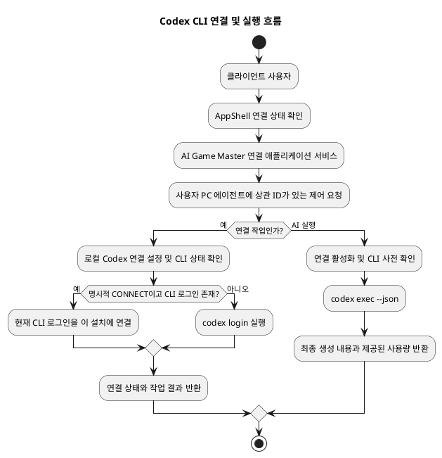
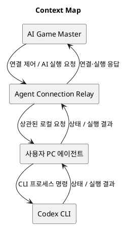
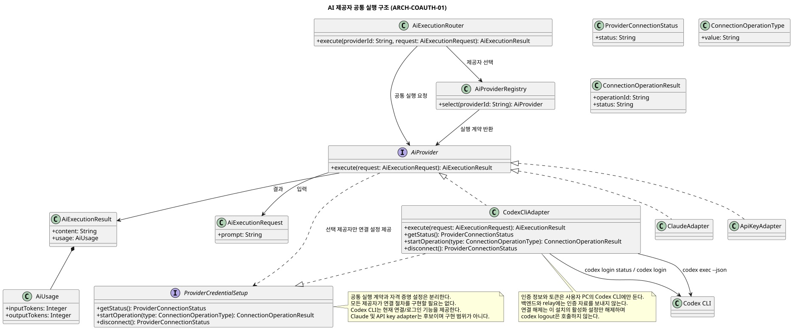
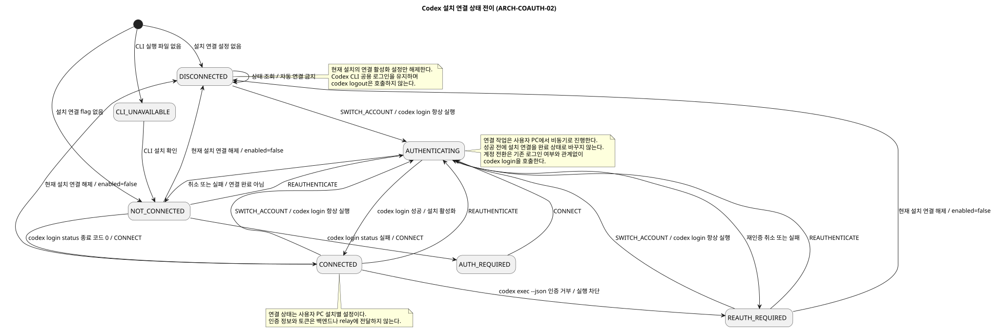
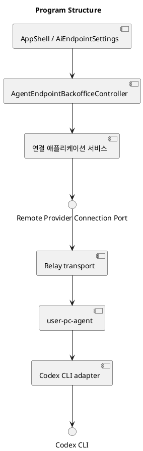
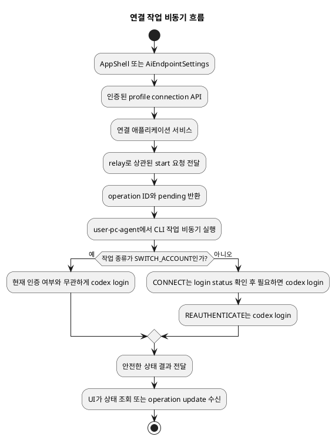
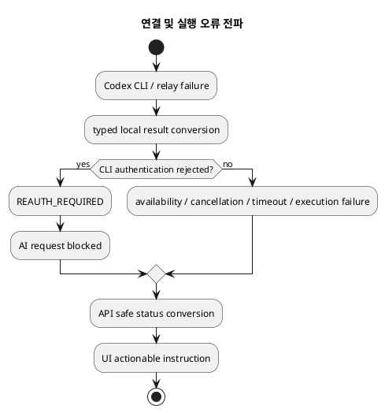
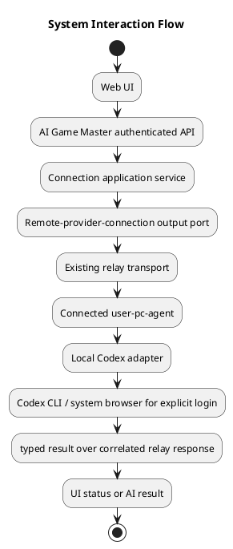
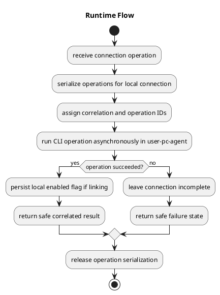
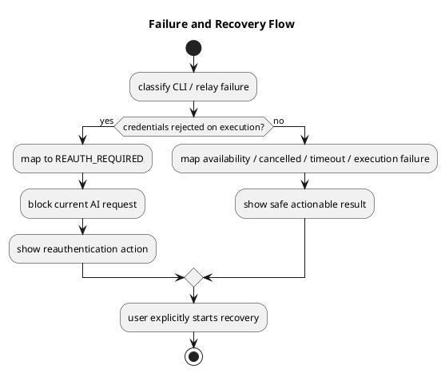

# Architecture Spec

# 1. Design Scope

## 1.1 Target

| 항목 | 대상 |
| --- | --- |
| Product Spec | `docs/specs/codex-cli-oauth/product-spec.md` |
| Use Cases | UC-COAUTH-01 최초 계정 연결, UC-COAUTH-02 연결 복구 또는 계정 변경 |
| Domain | AI Game Master의 AI 제공자 선택·실행 조정 및 클라이언트 설치별 Codex CLI 연결 |
| Bounded Contexts | AI Game Master (기존 context; 연결 관리는 내부 capability) |
| Existing Services | `ai-game-master-service`, `agent-connection-relay-service`, `user-pc-agent` (사용자 PC 배포), `ai-game-master-local-codex` (기존 local integration module) |
| External Dependencies | 사용자 PC의 Codex CLI, ChatGPT OAuth 시스템 브라우저 흐름 |
| Affected Data | 사용자 PC 에이전트의 클라이언트 설치별 연결 활성화 설정; 기존 provider endpoint 설정. 서버에 인증 정보나 새 연결 DB 데이터는 저장하지 않음 |

## 1.2 Product Spec Mapping

| Product Spec 항목 | Architecture 요소 |
| --- | --- |
| UC-COAUTH-01 / REQ-COAUTH-01, 03, 04 | `AppShell` route gate, 사용자 PC 에이전트의 CLI availability/login 확인, Codex 연결 작업 |
| REQ-COAUTH-05, 06 | 로컬 설치별 enabled 설정과 비동기 연결 작업 상태; 취소·실패 시 연결 완료로 전이하지 않음 |
| UC-COAUTH-02 / REQ-COAUTH-07 | 실행 전 연결·CLI 사전 확인; 실행 거부 시 재인증 필요 상태 반환 후 사용자가 수동 재시도 |
| REQ-COAUTH-08, 09 | 현재 설치의 enabled 설정만 해제; CLI 공용 로그인과 자격 증명은 유지 |
| REQ-COAUTH-10 | 명시적인 `SWITCH_ACCOUNT` 작업이 기존 로그인 여부와 무관하게 `codex login`을 실행 |
| 연결 및 실행 오류 | 상태 오류로 변환해 웹 UI에 전달; 원시 CLI 출력 및 인증 자료는 반환·기록하지 않음 |

---

# 2. Domain Flow

## 2.1 Event Storming Flow

이 변경은 서버 저장 도메인 이벤트를 새로 도입하지 않는다. 연결 작업은 기존 AI Game Master context가 조정하는 사용자 PC 에이전트 작업이며, 완료 결과는 연결 상태로 응답한다.



## 2.2 Commands

| Command | Actor | Target | Input | Preconditions | Result |
| --- | --- | --- | --- | --- | --- |
| 연결 상태 조회 | AppShell / 인증된 사용자 | AI Game Master 연결 애플리케이션 서비스 | 사용자 식별 및 연결 상태 질의 | 사용자 인증 | 연결 상태 |
| 연결 작업 시작 | 인증된 사용자 | AI Game Master 연결 애플리케이션 서비스 | `CONNECT`, `REAUTHENTICATE`, `SWITCH_ACCOUNT` | 사용자 인증; 로컬 에이전트 연결 가능 | 작업 ID와 대기 상태 |
| 연결 작업 처리 | 사용자 PC 에이전트 | Codex 연결 capability | 작업 ID, 작업 종류 | 상관된 유효 제어 요청 | 성공·취소·실패 및 연결 상태 |
| 현재 설치 연결 해제 | 인증된 사용자 | 연결 애플리케이션 서비스 | 현재 설치 연결 식별 | 사용자 인증 | 비활성화 상태; 공용 CLI 로그인 유지 |
| AI 요청 실행 | AI Game Master 실행 흐름 | Codex adapter | 기존 AI 실행 요청 | 연결 활성화, CLI 사용 가능, 로그인 사전 확인 통과 | 최종 생성 내용 및 제공된 사용량 또는 분류된 오류 |

## 2.3 Domain Events

| Domain Event | Producer | Trigger | Payload | Consumers |
| --- | --- | --- | --- | --- |
| 해당 없음 | — | 연결 상태는 이번 변경에서 서버 도메인 이벤트로 영속화하지 않음 | — | 작업 결과는 상관된 relay 응답으로 전달 |

## 2.4 Policies

| Policy | Trigger Event | Decision | Emitted Command | Owner |
| --- | --- | --- | --- | --- |
| 해당 없음 | — | 연결 작업은 사용자의 명시적 요청으로 시작 | 연결 작업 시작 | AI Game Master 내부 capability |

## 2.5 Read Models

| Read Model | Consumer | Source | Fields | Owner |
| --- | --- | --- | --- | --- |
| 연결 상태 응답 | AppShell, `AiEndpointSettings` | 사용자 PC 에이전트의 현재 연결·CLI 상태 | CLI 사용 가능 여부, 연결 상태, 진행 중 작업 ID/상태 | AI Game Master가 relay를 통해 조회·전달; 자격 증명은 포함하지 않음 |

## 2.6 External Interactions

| External System | Trigger | Input | Output | Failure |
| --- | --- | --- | --- | --- |
| Codex CLI | 연결 또는 AI 실행 | 로그인 작업 명령 또는 `codex exec --json` 입력 | 종료 상태, 구조화된 실행 결과 | 상태 오류로 변환; 인증 명령 stdout/stderr와 원시 로그는 전파하지 않음 |
| ChatGPT OAuth 시스템 브라우저 흐름 | `codex login` | Codex CLI가 시작한 계정 승인 흐름 | CLI 로그인 완료 또는 취소·실패 | 작업 실패/취소 상태; 재시도 안내 |

Codex CLI 문서는 인자 없는 `codex login`이 브라우저 기반 ChatGPT OAuth 로그인을 시작하고, `codex login status`가 인증 모드를 출력하며 자격 증명이 있을 때 종료 코드 0을 반환하고, `codex logout`이 저장된 로그인을 제거한다고 명시한다. `codex exec`는 비대화형 실행과 JSONL 출력을 지원한다. 이 문서가 보장하는 것은 자격 증명의 존재 확인이며 영구적인 유효성 보장은 아니다. [Codex CLI reference](https://developers.openai.com/codex/cli/reference)

## 2.7 Hotspots

| Hotspot | Options | Decision |
| --- | --- | --- |
| 연결 소유권 | 별도 context/service 또는 AI Game Master 내부 capability | 기존 AI Game Master context 내부 capability; 독립 상태 lifecycle이나 배포 요구가 정해지지 않음 |
| CLI 로그인과 클라이언트 연결 구분 | CLI 로그아웃에 연결 해제를 결합하거나 설치별 설정만 해제 | 현재 설치의 enabled/unlinked 설정만 변경; `codex logout` 금지 |
| HTTP 대기 시간과 OAuth 대화형 흐름 | 요청 중 동기 대기 또는 로컬 비동기 작업 | 로컬 에이전트에서 비동기로 실행하고 operation ID 상태 조회/업데이트 사용 |
| Codex 실행 인터페이스 | `codex app-server` 또는 CLI 비대화형 실행 | `codex exec --json`을 기존 Codex 통합 seam에서 사용 |

---

# 3. DDD Architecture

## 3.1 Bounded Contexts

| Bounded Context | Responsibility | Ubiquitous Language | Owned Model | Owned Data |
| --- | --- | --- | --- | --- |
| AI Game Master | AI 제공자 선택, 실행 조정, 클라이언트 설치의 원격 제공자 연결 조정 | 제공자, 연결 상태, 연결 작업, AI 실행 요청 | 제공자 실행 계약과 연결 capability | 기존 provider endpoint 설정; 사용자 PC 에이전트의 로컬 연결 활성화 설정은 에이전트가 소유 |

Bounded Context는 기능 이름이나 Aggregate 수에 맞춰 생성하지 않는다. 먼저 capability를 기존 context에 배치하고, 기존 context의 언어·비즈니스 규칙·데이터 lifecycle·일관성 경계로 소유할 수 없을 때만 새로운 Bounded Context로 승격한다.

## 3.1.1 Boundary Decisions

| Capability | Owner Context | Candidate Boundary | Chosen Boundary | Why Not Weaker? | Why Not Stronger? |
| --- | --- | --- | --- | --- | --- |
| 제공자 연결 관리 | AI Game Master | Domain Type / Aggregate / Internal Capability / Bounded Context / External | 기존 context 내부 capability와 package-level port | 연결 orchestration과 제공자 선택은 AI Game Master 흐름의 일부이므로 단순한 실행 adapter만으로는 연결 상태·작업 계약을 소유할 수 없음 | 독립 aggregate/context/module/service의 별도 lifecycle은 요구되지 않음; 작은 설치별 설정으로 충분 |
| Codex CLI 통합 | AI Game Master | Internal Capability / Module / Service | 기존 `ai-game-master-local-codex` module | 사용자 PC CLI를 호출하는 실행·인증 adapter의 격리 seam이 필요 | module은 이미 존재하며 독립 배포 서비스나 새 module은 불필요 |
| relay 전달 | AI Game Master와 relay 기존 경계 | Package / Module / Service | 기존 `agent-connection-relay-service` transport | 원격 PC로 요청을 전달할 기존 relay 계약 사용 | relay는 인증 소유자가 아니며 별도 transport service가 이미 존재 |

새로운 Bounded Context는 추가하지 않는다. 연결 설정은 독립 aggregate가 아니며 사용자 PC 에이전트의 작은 로컬 설정이다.

## 3.2 Context Map



| Upstream | Downstream | Relationship | Contract | Translation |
| --- | --- | --- | --- | --- |
| AI Game Master | Agent Connection Relay | 기존 동기 요청/응답 transport seam | 상관 ID를 포함한 제어 또는 AI 실행 요청·응답 | relay 내부 전달 |
| Agent Connection Relay | 사용자 PC 에이전트 | 기존 로컬 연결 transport | correlated control messages와 기존 실행 메시지 | 에이전트 handler |
| Codex CLI | 사용자 PC 에이전트 | 외부 process adapter | login/status 및 `codex exec --json` | Codex adapter가 종료 상태·구조화된 결과를 내부 상태로 변환 |

## 3.3 Aggregates

| Aggregate | Root | Responsibility | Commands | Events | Invariants |
| --- | --- | --- | --- | --- | --- |
| 해당 없음 | — | 새 aggregate를 만들지 않음 | 설치별 연결은 로컬 설정, 실행 작업은 단기 operation | 서버 도메인 이벤트 없음 | 연결 설정을 provider endpoint 구성과 분리; 서버 DB에 연결 인증 상태 저장 금지 |

Aggregate 경계는 Bounded Context 경계를 자동으로 의미하지 않는다.

## 3.4 Entities

| Entity | Aggregate | Identity | Responsibility | State |
| --- | --- | --- | --- | --- |
| 해당 없음 | — | — | 독립 entity를 도입하지 않음 | — |

## 3.4.1 Class Diagram

AI Game Master 연결 애플리케이션 서비스, remote-provider-connection output port, relay transport, 사용자 PC 연결 capability와 Codex CLI adapter의 책임·호출 경계를 표시한다.

원본: `docs/specs/codex-cli-oauth/diagrams/architecture/ai-provider.class.puml` (trace ID `ARCH-COAUTH-01`)
SVG: 

## 3.5 Value Objects

| Value Object | Aggregate | Values | Validation | Behavior |
| --- | --- | --- | --- | --- |
| 연결 작업 종류 | 없음; 작업 요청 값 | `CONNECT`, `REAUTHENTICATE`, `SWITCH_ACCOUNT` | 허용된 세 종류만 수락 | 로컬 agent가 해당 작업 흐름을 실행 |
| 연결 상태 | 없음; 응답 값 | `CLI_UNAVAILABLE`, `NOT_CONNECTED`/`AUTH_REQUIRED`, `AUTHENTICATING`, `CONNECTED`, `REAUTH_REQUIRED`, `DISCONNECTED` | agent가 CLI 및 설치별 활성화 상태로 판정 | UI gate와 AI 실행 허용 여부를 결정 |
| 작업 ID | 없음; 상관 값 | relay correlation/operation identifier | 요청·응답 간 일치 확인 | 비동기 연결 작업 상태 조회에 사용 |

## 3.6 Domain Services

| Domain Service | Responsibility | Input | Output | Collaborators |
| --- | --- | --- | --- | --- |
| 제공자 연결 애플리케이션 서비스 | 인증된 사용자 요청을 현재 설치의 연결 상태·작업·해제 동작으로 조정 | 사용자 식별, 작업 종류, 작업 ID | 상태, 작업 상태 | remote-provider-connection port, relay |
| Codex provider adapter | 설치별 연결 및 CLI AI 실행을 공통 제공자 계약에 매핑 | 연결 명령 또는 공통 AI 실행 요청 | 상태 또는 최종 생성 결과와 제공 사용량 | `codex` 프로세스 |

## 3.7 Business Rule Ownership

| Business Rule | Owner | Enforcement Point |
| --- | --- | --- |
| AI 기능 사용 전에 현재 클라이언트 설치의 연결이 활성화되어야 함 | AI Game Master 내부 연결 capability / 사용자 PC agent | AppShell gate와 AI 실행 직전 로컬 agent 검사 |
| 이미 로그인한 CLI를 일반 최초 연결에서 재사용 | Codex adapter | `codex login status` 확인 뒤 현재 설치 연결 활성화 |
| 재인증/계정 전환은 사용자 명시 작업 | AI Game Master application service | 작업 시작 API와 로컬 agent handler |
| 연결 해제는 CLI 공용 로그인에 영향을 주지 않음 | 로컬 연결 capability | enabled flag 비활성화만 수행; `codex logout` 미호출 |
| 연결 해제 상태에서는 자동 재연결하지 않음 | 로컬 연결 capability | 명시적 DISCONNECTED flag 확인 |
| 원시 인증 자료 및 CLI 로그 비노출 | Codex adapter와 relay/API 경계 | 결과 DTO 변환·로그 마스킹 |

## 3.8 Aggregate State Transitions

| Current State | Command / Event | Next State | Owner | Preconditions | Emitted Event |
| --- | --- | --- | --- | --- | --- |
| 최초 상태, 설치 연결 flag 없음 | 상태 확인, CLI 로그인 있음 | CONNECTED | 로컬 연결 capability | CLI 실행 가능; `codex login status` 종료 코드 0 | 없음 |
| 최초 상태 | 상태 확인, 로그인 없음 | NOT_CONNECTED / AUTH_REQUIRED | 로컬 연결 capability | CLI 실행 가능 | 없음 |
| DISCONNECTED | 상태 확인 | DISCONNECTED | 로컬 연결 capability | 명시적 disabled flag 존재 | 없음; 자동 연결 금지 |
| NOT_CONNECTED / REAUTH_REQUIRED | CONNECT 또는 REAUTHENTICATE 시작 | AUTHENTICATING | 로컬 agent 작업 handler | 사용자 작업 요청 및 agent 연결 | 없음 |
| AUTHENTICATING | CLI 로그인 성공 | CONNECTED | Codex adapter / 로컬 연결 capability | `codex login` 성공 | 없음 |
| AUTHENTICATING | 취소 또는 실패 | NOT_CONNECTED / REAUTH_REQUIRED | 로컬 연결 capability | 로그인 명령 종료 | 없음; 재시도 허용 |
| CONNECTED | 로그인 만료·무효로 실행 거부 | REAUTH_REQUIRED | Codex adapter / AI 실행 흐름 | `codex exec` 인증 오류로 분류 | 없음; 해당 호출 차단 |
| CONNECTED 또는 DISCONNECTED | SWITCH_ACCOUNT 성공 | CONNECTED | Codex adapter / 로컬 연결 capability | 명시적 계정 전환; `codex login` 성공 | 없음 |
| CONNECTED | 연결 해제 | DISCONNECTED | 로컬 연결 capability | 사용자 명시 요청 | 없음; CLI 로그인 유지 |

## 3.8.1 State Diagram

연결 상태 전이와 CLI availability, 로그인 검사, 사용자 작업, 실행 인증 실패에 따른 guards를 표현한다. Product 상태와 목적이 다른 내부 연결 상태 다이어그램이다.

원본: `docs/specs/codex-cli-oauth/diagrams/architecture/codex-installation-connection.state.puml` (trace ID `ARCH-COAUTH-02`)
SVG: 

## 3.9 Repository Boundaries

| Repository | Aggregate | Operations | Consistency Boundary |
| --- | --- | --- | --- |
| 없음 | 없음 | 새 repository 또는 server persistence 없음 | 로컬 agent 설정은 해당 설치에서 유지; 서버는 기존 비밀이 아닌 provider endpoint 구성만 저장 |

---

# 4. Program Design

## 4.1 Program Structure



## 4.2 Major Components and Responsibilities

| Component | Responsibility | Input | Output | Dependencies | Must Not Do |
| --- | --- | --- | --- | --- | --- |
| `AppShell` | 연결 완료 전 정상 client route 차단, 상태별 안내 | connection status | route gate / actionable state | profile connection API | endpoint `active`를 연결 상태로 해석하지 않음 |
| `AiEndpointSettings` | 연결, 재연결, 계정 전환, 연결 해제 제공 | 사용자 action | 상태 및 operation ID | profile API | CLI 자격 증명 취급하지 않음 |
| `AgentEndpointBackofficeController` | 인증된 profile connection API 진입점 | HTTP 요청 | 상태/operation DTO | application service | CLI를 직접 실행하지 않음 |
| 연결 애플리케이션 서비스 | 인증 사용자 작업을 출력 port로 전달하고 상태 응답 조정 | 사용자 ID, action | operation/status 결과 | remote-provider-connection port | 토큰 또는 CLI 출력 저장하지 않음 |
| remote-provider-connection port | AIGM에서 로컬 연결 control 호출 추상화 | 상관 요청 | 상태/operation 결과 | relay 구현 | relay 구현 세부에 결합하지 않음 |
| relay | 기존 연결 소유권·lease와 correlation으로 요청을 지정된 agent에 전달 | control/execution message | 대응 응답 | 사용자 PC 연결 | 인증 소유자나 자격 증명 저장소가 되지 않음 |
| 사용자 PC Codex adapter | CLI 설치·로그인 확인, 로그인 작업, `codex exec --json` | typed command / execution request | typed 상태 또는 final content·usage | `codex` executable | 토큰·raw logs를 반환/기록하지 않음 |

## 4.3 Application Flow



## 4.4 Component Call Contracts

| Order | Caller | Callee | Operation | Input | Output | Failure |
| ---: | --- | --- | --- | --- | --- | --- |
| 1 | AppShell | Profile connection API | GET status | 인증된 요청 | connection status | agent/relay unavailable 상태 |
| 2 | `AiEndpointSettings` | Profile connection API | POST start | `CONNECT`, `REAUTHENTICATE`, `SWITCH_ACCOUNT` | operation ID, pending | validation/transport error |
| 3 | UI | Profile connection API | GET operation/status | operation ID | 진행/최종 상태 | 알 수 없는 operation 또는 transport error |
| 4 | UI | Profile connection API | DELETE connection | 현재 client installation scope | disconnected 상태 | relay/agent unavailable |
| 5 | API/application service | remote-provider-connection port | 상태 또는 작업 제어 | player/connection context, correlation ID, operation | typed response | 기존 relay timeout/연결 오류 |
| 6 | Relay | user-pc-agent | 제어/실행 메시지 전달 | 상관된 message | correlated response | timeout 또는 연결 상실 |
| 7 | Codex adapter | Codex CLI | login status/login/exec | 허용된 명령 및 prompt | 종료 결과 / 구조화 실행 결과 | unavailable/auth required/cancelled/execution failure |

## 4.5 Major Types

| Type | Kind | Responsibility | State | Dependencies |
| --- | --- | --- | --- | --- |
| `RemoteProviderConnectionPort` | Output Port | 원격 사용자 PC 연결·작업 호출 | 없음 | relay adapter |
| `ConnectionOperationType` | DTO/domain value | 세 작업 유형 표현 | 불변 | 없음 |
| `ProviderConnectionStatus` | DTO/domain value | 연결 상태 표현 | 불변 | 없음 |
| `ConnectionOperationResult` | DTO | operation ID, pending/completed result 제공 | 작업 수명 동안 | relay/local agent |
| `AiExecutionRequest` / result | 공통 provider contract | provider 실행 입력과 생성 결과·사용량 표현 | 요청/응답 | provider adapter |
| `CodexCliAdapter` | Adapter | Codex 전용 연결·실행 절차 | 로컬 process state only | Codex CLI |

## 4.6 Type Design

### `RemoteProviderConnectionPort`

| 항목 | 정의 |
| --- | --- |
| Kind | Application output port |
| Responsibility | player/client installation에 대한 상태 조회, 연결 작업, 연결 해제 호출 |
| Dependencies | 내부 연결 명령·응답 모델 |
| Must Not Depend On | HTTP controller, Codex CLI process API, endpoint DB 구현 |

#### State

| Field | Type | Meaning | Constraint |
| --- | --- | --- | --- |
| 없음 | — | port 자체는 상태 비보유 | correlation/installation context는 각 입력에 전달 |

#### Behavior

| Method | Input | Output | Responsibility | State Change |
| --- | --- | --- | --- | --- |
| `getStatus` | installation/player context | connection status | 연결 상태 조회 | 없음 |
| `startOperation` | context, operation type, correlation ID | operation ID, pending status | 연결 작업 시작 | agent에 작업 전달 |
| `getOperation` | context, operation ID | operation result/status | 비동기 작업 상태 조회 | 없음 |
| `disconnect` | context, correlation ID | disconnected status | 현재 설치 link 비활성화 | 로컬 설정만 해제 |

#### Invariants

| Invariant | Enforcement Point |
| --- | --- |
| 응답은 요청한 설치 연결에 귀속 | port adapter 및 relay connection ownership |
| 민감한 credential/process output을 계약에 포함하지 않음 | typed response mapping |

## 4.7 Interfaces and Function Signatures

### `RemoteProviderConnectionPort`

```java
interface RemoteProviderConnectionPort {
    ConnectionStatus getStatus(ConnectionContext context);
    ConnectionOperationResult startOperation(ConnectionContext context,
        ConnectionOperationType type, CorrelationId correlationId);
    ConnectionOperationResult getOperation(ConnectionContext context, OperationId operationId);
    ConnectionStatus disconnect(ConnectionContext context, CorrelationId correlationId);
}
```

| 항목 | 정의 |
| --- | --- |
| Responsibility | AIGM application layer에서 사용자 PC 연결 control 추상화 |
| Caller | profile connection application service |
| Implementer | relay-backed adapter |
| Input | 인증된 player/install scope, operation 종류 또는 식별자, correlation ID |
| Output | typed connection state / operation result |
| Preconditions | 인증 사용자; 대상 PC agent 연결이 존재하거나 명시적으로 unavailable 응답 가능 |
| Postconditions | 요청은 해당 설치에만 적용; operation start는 operation ID를 반환 |
| Errors | validation, unavailable, timeout, operation failure, auth-required 상태 |
| Side Effects | local agent에 제어 요청; disconnect는 local flag 변경 |
| Idempotency | 상태 조회는 멱등; start 중복/직렬화는 correlation ID와 기존 relay 계약으로 처리; 같은 operation ID 조회는 안전 |

공통 AI 실행 계약은 제공자별 credential setup/connection capability를 선택적으로 제공한다. 모든 provider에 OAuth 전용 lifecycle을 강제하지 않는다.

## 4.8 Error Propagation



| Failure Point | Source Error | Converted Error | Handler | Result |
| --- | --- | --- | --- | --- |
| PATH check | executable missing | `CLI_UNAVAILABLE` | local agent/UI | 설치 안내, 연결 중단 |
| `codex login status` | no credentials / nonzero | `AUTH_REQUIRED` | local connection flow | 연결 필요 표시 |
| login process | cancelled or failed | operation cancelled/failed | UI | 설정 미완료, 재시도 안내 |
| `codex exec` | expired/revoked credential | `REAUTH_REQUIRED` | AIGM/UI | 현재 호출 차단, 재인증 후 수동 재시도 |
| relay | timeout/disconnected agent | unavailable/timeout | API/UI | 상태 확인 또는 다시 시도 안내 |

## 4.9 State Transition Implementation

| State Transition | Domain Owner | Method | Persistence Point | Published Event |
| --- | --- | --- | --- | --- |
| 최초 상태 → CONNECTED/AUTH_REQUIRED | local connection capability | status inspection | local enabled flag only when linking | 없음 |
| NOT_CONNECTED/REAUTH_REQUIRED → AUTHENTICATING → terminal state | local agent operation handler | start/poll operation | local setting on successful link | 없음 |
| CONNECTED → REAUTH_REQUIRED | Codex execution adapter | map execution auth failure | local setting/status state as defined by connection capability | 없음 |
| CONNECTED → DISCONNECTED | local connection capability | disconnect | local disabled flag | 없음 |
| CONNECTED/DISCONNECTED → account switched CONNECTED | Codex login operation | explicit switch operation | local enabled flag after success | 없음 |

## 4.10 Dependency Rules

### Allowed Dependencies

| Source | Target | Contract |
| --- | --- | --- |
| Profile controller | Connection application service | application API |
| Connection application service | Remote-provider-connection output port | package-level port |
| Relay adapter | Existing relay manager/controller | existing correlation and connection ownership contracts |
| Local connection handler | Codex adapter | provider-specific local contract |
| Codex adapter | Codex CLI | process boundary |
| AI execution router | common provider registry/adapter seam | common execution request/result |

### Forbidden Dependencies

| Source | Forbidden Target |
| --- | --- |
| Browser UI / backend | Codex credential files, token material, browser callback code |
| Server/API/relay | raw auth stdout/stderr or raw credential material |
| Connection lifecycle | specific provider endpoint record as installation-link identity |
| Agent disconnect action | `codex logout` |
| New connection capability | new bounded context, independently deployed service, or Gradle module |
| Provider common lifecycle | assumption that every provider uses OAuth |

---

# 5. Technical Architecture

## 5.1 Boundary Mapping

Bounded Context, internal capability, code module, deployment service를 1:1로 매핑하지 않는다. 각 capability에는 필요한 격리를 만족하는 가장 약한 경계를 선택한다.

| Bounded Context | Internal Capability | Code Boundary | Deployment Unit | Boundary Rationale |
| --- | --- | --- | --- | --- |
| AI Game Master | Provider selection / execution orchestration | 기존 application/infrastructure packages 및 provider adapter seam | `ai-game-master-service` | context가 제공자 선택·생성을 소유 |
| AI Game Master | Codex CLI connection/execution | 기존 `ai-game-master-local-codex` module | `user-pc-agent` 프로세스, 사용자 PC | 사용자 PC CLI 접근에 이미 필요한 로컬 통합 seam |
| 기존 relay transport | correlation 및 agent 전달 | 기존 relay module | `agent-connection-relay-service` | 기존 transport와 lease 소유권 재사용; auth owner 아님 |

## 5.2 Boundary Promotion Decisions

| Candidate | Owner Context | Chosen Boundary | Why Not Weaker? | Why Not Stronger? | Introduced Cost |
| --- | --- | --- | --- | --- | --- |
| provider connection management | AI Game Master | package-level ports 및 내부 capability | API/application 경계는 인증된 사용자 요청과 연결 orchestration을 분리해야 함 | 별도 context/module/service의 독립 lifecycle 필요성이 없음 | 기존 packages와 relay contract 확장 비용 |
| Codex CLI integration | AI Game Master | 기존 `ai-game-master-local-codex` module | local process adapter를 backend provider routing과 구분해야 함 | 기존 module이 seam을 제공하므로 새 module/service 비용 불필요 | 해당 없음; 기존 경계 재사용 |

## 5.3 System Interaction Flow



## 5.4 Synchronous Communication

| Caller | Provider | Protocol | Operation | Request | Response | Timeout |
| --- | --- | --- | --- | --- | --- | --- |
| Web UI | AIGM profile API | HTTP | status/start/get operation/disconnect | connection contract request | status or operation ID/state | Existing HTTP contract; start returns promptly |
| AIGM service | relay adapter | existing internal relay protocol | local control/execution request | correlated typed message | correlated typed response | Existing relay timeout contract |
| user-pc-agent | Codex CLI | local process | login status/login/exec | command and prompt | exit/result | Existing local process timeout for execution; auth operation may outlive HTTP request |

## 5.5 API Contracts

### `GET profile connection status` (separate profile connection resource; exact URL is not fixed)

#### Request

```json
{}
```

#### Response

```json
{
  "status": "CONNECTED",
  "cliAvailable": true,
  "operation": null
}
```

#### Errors

| Condition | Status / Code | Response |
| --- | --- | --- |
| Authenticated player has no reachable local agent | existing unavailable error contract | safe connection-unavailable state |
| Invalid/unauthenticated caller | existing profile API auth response | no connection details |

#### Properties

| Property | Value |
| --- | --- |
| Authentication | authenticated player profile session |
| Authorization | only caller's connected PC installation |
| Idempotency | read-only |
| Timeout | existing profile/relay contract |
| Compatibility | separate resource from provider endpoint config |

### `POST profile connection operations` (separate profile connection resource; exact URL is not fixed)

#### Request

```json
{
  "type": "CONNECT"
}
```

#### Response

```json
{
  "operationId": "<correlation id>",
  "status": "AUTHENTICATING"
}
```

#### Errors

| Condition | Status / Code | Response |
| --- | --- | --- |
| Unknown operation type | validation error | safe validation response |
| No connected local agent | existing unavailable error contract | actionable connection state |
| Start accepted | pending result | operation ID and pending state |

#### Properties

| Property | Value |
| --- | --- |
| Authentication | authenticated player profile session |
| Authorization | only caller's connected PC installation |
| Idempotency | serialize operation starts per local connection; correlate by operation ID |
| Timeout | returns pending promptly; OAuth/login may outlive HTTP request |
| Compatibility | `CONNECT`, `REAUTHENTICATE`, `SWITCH_ACCOUNT` |

`GET operation/status` returns safe pending/final status for the operation. `DELETE profile connection` disables only this installation's link and does not invoke `codex logout`. These contracts do not depend on an `AgentEndpoint` record.

## 5.6 Asynchronous Communication

| Producer | Consumer | Channel | Message | Delivery | Ordering |
| --- | --- | --- | --- | --- | --- |
| AIGM relay adapter | connected user-pc-agent | existing relay connection | correlated control or AI execution request | existing relay request/reply behavior | per local connection; reuse lease/correlation contracts |
| user-pc-agent | AIGM via relay | existing relay connection | safe operation status/result | existing correlated response/update path | matching operation/correlation ID |

## 5.7 Message Contracts

### Connection control message

```json
{
  "correlationId": "<id>",
  "operationId": "<id>",
  "type": "CONNECT",
  "payload": {}
}
```

| Property | Value |
| --- | --- |
| Message ID | existing relay correlation ID |
| Aggregate ID | 해당 없음; installation connection scope is used |
| Schema Version | existing relay message versioning contract |
| Idempotency Key | correlation/operation ID |
| Ordering Key | local connection identity |
| Duplicate Handling | existing relay correlation handling; serialize conflicting operations |
| Failure Handling | safe typed failure response; existing timeout behavior |
| Compatibility | extend existing relay message family without separate transport service |

## 5.8 Data Ownership

| Data | Owner | Storage | Key / Schema | Readers | Writers |
| --- | --- | --- | --- | --- | --- |
| Codex CLI credentials | Codex CLI | Codex CLI managed local storage | external CLI-defined | Codex CLI only | Codex CLI only |
| client installation link-enabled flag | user-pc-agent | local setting | current installation | local agent | local connection capability |
| provider endpoint configuration | AI Game Master | existing endpoint persistence | existing provider endpoint schema | provider routing/settings | existing endpoint management |
| connection operation status | local agent while operation is active; relayed to UI | operation/runtime state; no server DB persistence requirement | operation/correlation ID | UI/API via relay | local agent |

## 5.9 Schema Changes

| Target | Action | Schema Change | Migration | Compatibility |
| --- | --- | --- | --- | --- |
| Server database | No change | No auth/link schema added | None | existing endpoint provider configuration remains |
| user-pc-agent local settings | Add/update small local enabled flag | local setting only | no server DB migration | absent flag means initial install discovery; explicit disabled flag suppresses auto-link |
| relay contracts | Extend existing messages | typed control operations/status | no DB migration | preserve existing request/reply and correlation behavior |

## 5.10 Consistency Model

| Operation | Consistency | Source of Truth | Synchronization | Recovery |
| --- | --- | --- | --- | --- |
| CLI login/account | local CLI process state | Codex CLI | login status before linking/run | explicit login/retry |
| current installation linked state | local strong setting | user-pc-agent | serialized per connection operations | retry explicit connection action |
| operation progress | transient correlated state | local agent operation | poll or operation update | query status; retry if terminal failure |
| AI generation | request/response | Codex CLI for current call | existing relay correlation | auth failure blocks; user reauthenticates and manually retries |

## 5.11 Infrastructure Dependencies

| Dependency | Responsibility | Accessed By | Isolation Boundary |
| --- | --- | --- | --- |
| Existing relay connection | route requests to user's PC | remote provider connection adapter | output port / relay adapter |
| Local `codex` executable | login status, account login, AI generation | user-pc-agent adapter | process adapter |
| Existing AIGM endpoint store | provider endpoint configuration | endpoint management/routing | existing repository |

## 5.12 External Dependency Isolation

| External Dependency | Port | Adapter | Internal Model | Conversion Point |
| --- | --- | --- | --- | --- |
| Codex CLI | provider-specific optional credential setup/connection capability and common AI execution contract | existing `ai-game-master-local-codex` integration | provider state, operation result, common AI result | process exit/output parsing in local adapter |
| Future API-key providers / Claude | future extension candidate only | not implemented in this scope | common AI execution request/result; optional provider-specific setup | future provider adapter |

## 5.13 File and Module Structure

### Existing Structure

```text
src/web-ui/src/app/AppShell.tsx
src/web-ui/src/features/profile/AiEndpointSettings.tsx
src/ai-game-master-service/src/main/java/com/dndmaster/aigamemaster/api/AgentEndpointBackofficeController.java
src/ai-game-master-service/src/main/java/com/dndmaster/aigamemaster/application/ai/
src/ai-game-master-service/src/main/java/com/dndmaster/aigamemaster/application/endpoint/
src/ai-game-master-service/src/main/java/com/dndmaster/aigamemaster/infrastructure/ai/GmCompletionRouter.java
src/ai-game-master-service/src/main/java/com/dndmaster/aigamemaster/infrastructure/ai/RemoteAiExecutionPort.java
src/ai-game-master-local-codex/src/main/java/com/dndmaster/aigamemaster/localcodex/LocalCodexAiExecutionPort.java
src/ai-game-master-local-codex/src/main/java/com/dndmaster/aigamemaster/localcodex/CodexWebSocketAgent.java
src/user-pc-agent/src/main/java/com/dndmaster/userpcagent/UserPcAgentApplication.java
src/agent-connection-relay-service/src/main/java/com/dndmaster/relay/application/LocalConnectionManager.java
src/agent-connection-relay-service/src/main/java/com/dndmaster/relay/api/InternalExecutionController.java
```

### Target Structure

Reuse these modules and package-level seams. Add connection API/application/port contracts under existing AIGM packages; extend existing relay control message path; add local connection state/operation and Codex CLI process behavior under existing user-pc-agent/local-codex integration. Replace local app-server execution path with `codex exec --json`. No new service, Gradle module, auth database, or server schema.

### File Change Map

| Path | Action | Type / Component | Responsibility |
| --- | --- | --- | --- |
| `src/web-ui/src/app/AppShell.tsx` | Modify | route gate | block normal routes until linked; show actionable setup/recovery instructions |
| `src/web-ui/src/features/profile/AiEndpointSettings.tsx` | Modify | settings UI | connect/reconnect, switch account, disconnect actions |
| `src/ai-game-master-service/.../api/AgentEndpointBackofficeController.java` | Modify | profile API | add/use separate connection resource contract; old endpoint login placeholder is not connection identity |
| `src/ai-game-master-service/.../application/endpoint/` | Modify | application service/port contracts | status/start/poll/disconnect orchestration |
| `src/ai-game-master-service/.../infrastructure/ai/GmCompletionRouter.java` | Modify if required | provider routing | use registry/adapter seam while preserving OLLAMA and OPENAI_COMPATIBLE routes |
| `src/ai-game-master-service/.../infrastructure/ai/RemoteAiExecutionPort.java` | Modify | relay-backed output adapter | correlated remote connection and AI execution requests |
| `src/agent-connection-relay-service/.../application/LocalConnectionManager.java` | Modify | relay transport | serialize/correlate local connection control with existing lease ownership |
| `src/agent-connection-relay-service/.../api/InternalExecutionController.java` | Modify | relay API | carry typed correlated control/result messages |
| `src/ai-game-master-local-codex/.../LocalCodexAiExecutionPort.java` | Modify | Codex adapter | login status/login and `codex exec --json`; safe typed results |
| `src/ai-game-master-local-codex/.../CodexWebSocketAgent.java` | Modify | local message bridge | receive and return correlated connection/execution messages |
| `src/user-pc-agent/.../UserPcAgentApplication.java` | Modify | agent wiring | configure local connection capability and Codex executable |
| `src/ai-game-master-service/.../infrastructure/endpoint/JdbcAgentEndpointStore.java`, migrations V1_8/V1_9 | No schema change | existing persistence | retain existing provider endpoint configuration only |

---

# 6. Runtime Design

## 6.1 Runtime Flow



## 6.2 Concurrent Access

| Shared Resource | Concurrent Actors | Conflict |
| --- | --- | --- |
| One local Codex connection | connect, reauthenticate, account switch, disconnect, AI request start | account change racing with generation or another auth operation |

## 6.3 Concurrency Control

| Target | Control Unit | Strategy | Owner | Timeout |
| --- | --- | --- | --- | --- |
| Local connection operation and AI request start | one local connection | serialize conflicting operations | user-pc-agent connection capability | existing relay/local execution timeouts; auth operation can outlive HTTP request |

## 6.4 Ordering

| Operation | Ordering Scope | Ordering Key | Enforcement |
| --- | --- | --- | --- |
| connect/reauthenticate/switch/disconnect versus request start | local connection | current installation connection identity | local agent serialization plus existing relay lease and correlation |

## 6.5 Transaction Boundaries

| Transaction | Owner | Operations | Commit Condition | Rollback Condition |
| --- | --- | --- | --- | --- |
| Local connection update | user-pc-agent | CLI status/login then enabled flag update | login or reusable current login succeeds | cancellation/failure leaves link incomplete; no server DB transaction |
| AI execution | existing AIGM execution flow | precheck, codex exec, relay result | final result returned | auth failure blocks request; no automatic generation retry |

## 6.6 Idempotency

| Operation | Idempotency Key | Detection Point | Duplicate Result |
| --- | --- | --- | --- |
| status query | none | local state read | same current status |
| operation start | operation/correlation ID | relay/local operation handler | same operation status; conflicting operations serialize |
| operation status query | operation ID | local operation handler | current operation result |
| disconnect | installation scope/correlation | local connection capability | disabled state remains disabled; no CLI logout |

## 6.7 Partial Failure

| Failure Situation | Persisted State | External State | Recovery |
| --- | --- | --- | --- |
| OAuth cancelled/failed | not linked or prior explicit state retained | CLI may retain its prior/shared login state | user retries; do not claim connection success |
| account switch login fails | new client link not completed | CLI shared account result is determined by CLI login outcome | report safe failure; user retries or checks connection status |
| relay timeout after local success | local state may already be linked | CLI login remains | query status by operation ID; do not repeat blindly |
| execution auth rejection | enabled flag may remain but status becomes reauth required | CLI credentials rejected for execution | block this call; explicit reauth then manual retry |

---

# 7. Error Handling and Recovery

## 7.1 Failure and Recovery Flow



## 7.2 Error Classification

| Error | Category | Retryable | Handler | Caller Result |
| --- | --- | --- | --- | --- |
| Codex executable missing | infrastructure/availability | after user installation | local agent/UI | `CLI_UNAVAILABLE`, install guide |
| no login in status check | connection state | yes, explicit connect | local agent/UI | `AUTH_REQUIRED` |
| login cancelled or failed | operation failure | yes, user initiated | operation/UI | incomplete connection, retry guidance |
| execution credential rejected | authentication state | only after explicit reauth | AIGM/UI | `REAUTH_REQUIRED`, block request |
| relay unavailable/timeout | infrastructure | existing timeout policy | API/UI | safe unavailable state; status can be queried |
| Codex execution failure | provider execution | no automatic generation retry | provider adapter/AIGM | safe failure result |

## 7.3 Retry Policy

| Operation | Retry Condition | Max Attempts | Backoff | Exhausted Result |
| --- | --- | ---: | --- | --- |
| connection/login | user chooses retry after failure/cancel | user initiated | none specified | remain unlinked or reauth-required |
| AI generation | automatic retry prohibited | 0 automatic retries | none | block/return failure; user may reauthenticate and manually retry |
| relay transport | existing relay timeout contracts | existing policy | existing policy | safe unavailable/timeout result |

## 7.4 Compensation

| Failure | Trigger | Compensation | Compensation Failure |
| --- | --- | --- | --- |
| connection operation fails | local CLI operation terminal failure | do not enable link; preserve CLI-owned credential behavior | return safe failed/cancelled status; allow explicit retry |
| disconnect | user disconnect request | disable current installation flag only | report local operation failure; shared CLI login is never removed |

## 7.5 Recovery

| Failure | Recovery Point | Recovery Input | Recovery Action |
| --- | --- | --- | --- |
| `CLI_UNAVAILABLE` | settings/setup screen | user installs CLI and retries | recheck executable on PATH |
| `AUTH_REQUIRED` / `REAUTH_REQUIRED` | connection settings | explicit connect/reauthenticate | run Codex CLI login flow |
| pending operation / lost HTTP wait | operation state screen | operation ID | poll status or receive operation update |
| AI auth rejection | AI action result | user reauthentication action | authenticate, then manually retry AI request |

## 7.6 Rollback

| Target | Rollback Strategy | Data Handling | Compatibility |
| --- | --- | --- | --- |
| Server schema | no migration | no auth state or token data added | existing DB unchanged |
| Local enabled flag | reset/disable through connection operation | CLI credentials stay CLI-owned | absent setting follows initial discovery; explicit disabled remains authoritative |
| Relay/API contracts | retain existing correlation/timeout behavior | no sensitive payload persisted | additive typed control contract |

---

# 8. Security

## 8.1 Authentication and Authorization

| Entry Point | Authentication | Authorization | Failure |
| --- | --- | --- | --- |
| Profile connection API | existing authenticated player profile | caller's own connected PC installation | existing auth response or safe unavailable state |
| Internal relay control | existing internal service authentication and connection ownership | route only to the player's leased/connected agent | reject unauthorized/stale connection |
| Codex CLI login | Codex CLI native browser OAuth | account authorization is performed by Codex CLI | safe failed/cancelled operation result |

## 8.2 Input Validation

| Input | Validation | Sanitization | Size Limit |
| --- | --- | --- | --- |
| Operation type | allow only `CONNECT`, `REAUTHENTICATE`, `SWITCH_ACCOUNT` | typed enum | existing API limits |
| Operation/correlation ID | match active caller/install scope and format | typed identifier | existing relay limits |
| AI execution prompt | existing provider request validation | existing prompt handling; never include CLI logs in response | existing execution limits |

## 8.3 Sensitive Data

| Data | Storage Protection | Transport Protection | Log Policy |
| --- | --- | --- | --- |
| Codex credentials/tokens | Codex CLI alone stores them; app does not read/copy/persist | never sent to server or relay | never log |
| browser callback code | handled by Codex CLI | never sent to application server | never log |
| auth command stdout/stderr | not persisted | not returned over relay/API | redact/suppress |
| prompt/output | existing execution data flow | existing protected request path | redact prompt/output according to stated logging requirement |
| typed connection status/result | no secret material | existing authenticated/correlated channels | safe state and correlation IDs only |

## 8.4 Secrets

| Secret | Storage | Consumer | Rotation |
| --- | --- | --- | --- |
| Codex CLI authentication material | Codex CLI managed local storage | Codex CLI only | refreshed through the Codex CLI login command; this client does not manage the credential store or invoke logout |
| Existing internal service token | existing runtime secret configuration | internal gateways/controllers | unchanged by this change |

---

# 9. Observability

## 9.1 Logs

| Component | Event | Level | Context |
| --- | --- | --- | --- |
| AIGM connection application service | operation requested/completed/failed | INFO/WARN | operation type, correlation ID, safe outcome |
| relay | request forwarded/timeout | existing levels | correlation ID and connection identity; no credential/process output |
| local Codex adapter | CLI operation category/result | INFO/WARN | operation ID and safe status; redact prompt/output/auth stdout/stderr |

## 9.2 Metrics

| Metric | Type | Labels | Trigger Point |
| --- | --- | --- | --- |
| Not specified in settled inputs | — | — | Do not introduce a new metric contract in this change |

## 9.3 Tracing

| Span | Parent | Attributes | Error Condition |
| --- | --- | --- | --- |
| Existing correlated relay operation | AIGM request | correlation ID, operation type, safe outcome | timeout/unavailable/failure |

## 9.4 Alerts

| Alert | Condition | Severity | Action |
| --- | --- | --- | --- |
| Not specified in settled inputs | — | — | No new alert contract specified |

---

# 10. Change Boundaries

## 10.1 Allowed Changes

| Target | Allowed Change |
| --- | --- |
| Existing AIGM packages | connection application service, profile API contracts, package-level output port |
| Existing relay service | correlated connection control messages using existing lease/timeout contracts |
| Existing local Codex integration and user-pc-agent | CLI availability/login/exec handling, operation state, local enabled flag |
| Existing UI | app route gate and connection settings actions |
| Provider routing | common registry/adapter seam where needed while preserving OLLAMA and OPENAI_COMPATIBLE routes |

## 10.2 Forbidden Changes

| Target | Forbidden Change |
| --- | --- |
| Architecture boundaries | new bounded context, independent service, or Gradle module for connection capability |
| Codex credentials | read/copy/persist/transmit tokens or browser callback code |
| Disconnect | calling `codex logout` |
| Server persistence | auth database, connection schema migration, or credential persistence |
| Provider support | implementing API-key providers or Claude now |
| Codex execution | using `codex app-server` as target execution mechanism |
| AI behavior | automatic generation retry after authentication failure |

## 10.3 Conditional Changes

| Target | Condition | Required Decision |
| --- | --- | --- |
| New provider adapter | future provider is approved | define provider-specific optional credential setup while preserving common execution contract |
| Exact connection API path | API implementation chooses route | keep it separate from endpoint-record identity and document request/status contracts |
| Relay operation updates | existing transport supports delivery | use operation status polling or correlated update path; do not create another transport service |

---

# 11. Verification Requirements

## 11.1 Domain Verification

| Target | Verification |
| --- | --- |
| Existing CLI login reuse | fake-process adapter test: status exit 0 links current installation without login command |
| Explicit disconnect invariant | assert only local disabled flag changes and `codex logout` is never invoked |
| Account switch | adapter test: `SWITCH_ACCOUNT` invokes `codex login` even when status is already logged in |
| Execution auth failure | assert request is blocked and maps to `REAUTH_REQUIRED`; no automatic generation retry |
| State transitions | validate allowed connection states and transitions for unavailable, login, cancel, failure, disconnect, and reauth |

## 11.2 Program Verification

| Target | Verification |
| --- | --- |
| Codex adapter | unit tests with fake process for executable availability, login status, login, exec output, and auth failure |
| Relay control contract | contract tests for correlation, operation ID, lease ownership, and safe status serialization |
| AIGM profile API/application | tests for authenticated status/start/poll/delete and per-install scoping |
| AppShell route gate | UI tests ensure normal routes wait for linked state and show actionable failure/setup instructions |
| `AiEndpointSettings` | component tests for connect/reconnect/switch/disconnect actions and state display |
| Security mapping | assertions ensure token, callback code, auth stdout/stderr, and raw CLI output are not serialized |

## 11.3 Technical Contract Verification

| Contract | Test Level | Verification |
| --- | --- | --- |
| Profile connection API | API/application contract | status, async start with operation ID, operation query, disconnect scope |
| Relay control messages | contract | correlated request/reply and safe typed response |
| Common provider execution contract | adapter contract | final generated content and reported usage; raw CLI logs excluded; existing OLLAMA/OPENAI_COMPATIBLE routing retained |
| Persistence boundary | repository/schema check | no auth table/migration; endpoint active state is not the link state |

## 11.4 Runtime Verification

| Condition | Execution Model | Expected Result |
| --- | --- | --- |
| Concurrent account operations and request start | competing operations against one local connection | serialized; no operation races with AI request start |
| HTTP returns before login ends | asynchronous agent operation | pending operation ID remains queryable or receives update |
| Duplicate operation/status calls | same operation/correlation ID | stable result; no duplicate parallel login execution |

## 11.5 Recovery Verification

| Failure | Injection Method | Expected Recovery |
| --- | --- | --- |
| CLI missing | fake PATH without executable | `CLI_UNAVAILABLE`, install guidance, no login attempt |
| Login cancelled/fails | fake process exit/result | link remains incomplete and explicit retry is available |
| CLI execution auth rejected | fake `codex exec` auth error | current AI request blocked, `REAUTH_REQUIRED`, manual retry only after reauth |
| Relay timeout after local completion | delayed/lost response | operation status can reconcile local result without blindly restarting |

## 11.6 Agent Verifier Criteria

### Domain

* [x] Capability와 Bounded Context가 구분되어 있음
* [x] 새 Bounded Context가 없음; 기존 context 내부 capability로 충분함
* [x] Bounded Context 책임 준수
* [x] 새 Aggregate 없음; 로컬 설정으로 연결 상태 소유
* [x] 비즈니스 규칙 소유권 준수
* [x] 상태 전이 및 불변식 준수

### Program Design

* [x] 주요 컴포넌트 책임 일치
* [x] 호출 흐름 및 비동기 operation ID 일치
* [x] 오류 전파 방식 일치
* [x] package-level port 및 기존 relay seam 사용

### Technical Architecture

* [x] context/capability/module/deployment 경계 구분
* [x] 새 module/service 없음
* [x] API/message contract가 endpoint record에 종속되지 않음
* [x] 데이터 소유권과 자격 증명 비노출 명시
* [x] 파일·모듈 변경 범위 명시

### Runtime

* [x] 연결 작업과 요청 시작 직렬화
* [x] 서버 DB migration 없음
* [x] operation/correlation ID 기반 중복 처리
* [x] 수동 재인증 후 수동 재시도; 자동 생성 재시도 없음

### Scope

* [x] 이번 연결 capability와 Codex CLI 범위로 제한
* [x] 다른 provider 구현은 제외
* [x] `codex logout` 및 token 처리 금지

### Evidence

* 실행 명령: 해당 없음 — 이 문서는 명세이며 구현 검증을 실행하지 않음
* 테스트 결과: 미실행; 위 Verification Requirements에 필요한 테스트를 명시
* 변경 파일: `docs/specs/codex-cli-oauth/architecture-spec.md`
* Architecture 위반: 명세 작성 시 확인된 항목 없음
* Contract 위반: 명세 작성 시 확인된 항목 없음
* 미검증 항목: 구현 시 모든 Verification Requirements 실행 필요
* Human Review 항목: 연결 상태 전이 및 계정 전환 구현이 Product Spec과 일치하는지 검토

---

# 12. Alternatives and Trade-offs

| Decision | Option | Advantages | Disadvantages | Result |
| --- | --- | --- | --- | --- |
| 연결 capability 경계 | 새 bounded context/service | 독립 배포·소유 가능 | 독립 lifecycle이 없고 동기 parent 흐름에 운영·계약 비용을 추가 | Reject; 기존 AI Game Master 내부 capability |
| 연결 해제 동작 | `codex logout` | CLI 로그인도 제거 | 같은 PC의 다른 CLI 사용을 바꾸고 제품 규칙 위반 | Reject; 설치 flag만 disable |
| 로그인 상호작용 | HTTP 동기 대기 | 단순 요청 흐름 | 브라우저 승인이 요청 timeout보다 길 수 있음 | Reject; 비동기 local operation과 ID 사용 |
| Codex 실행 | app-server / exec | app-server는 현재 구현 사용 중 | target contract는 noninteractive CLI 결과 사용 | `codex exec --json` 채택 |
| 공통 제공자 계약 | OAuth 전용 공통 lifecycle | Codex에 직접 맞음 | API-key 등 향후 provider에 부적합 | execution 공통 계약 + 선택적 provider-specific credential capability |

---

# 13. Risks and Open Questions

## 13.1 Risks

| Risk | Impact | Probability | Mitigation |
| --- | --- | --- | --- |
| `codex login status`는 credential 존재만 확인하고 유효성을 보증하지 않음 | 연결처럼 보이는 로그인도 generation에서 거부될 수 있음 | Medium | 실행 직전 빠른 precheck와 실행 auth failure의 REAUTH_REQUIRED 변환; 자동 재시도 금지 |
| 계정 전환은 같은 PC의 다른 Codex CLI 사용에도 영향을 줌 | 공유 계정 변경을 사용자가 예상하지 못할 수 있음 | Medium | 명시적 switch action 및 UI 설명; 이는 REQ-COAUTH-10의 확정 동작 |
| HTTP 응답 후 로그인 작업이 계속 진행됨 | UI가 완료 결과를 놓칠 수 있음 | Medium | operation ID, 상태 조회 또는 correlated operation update |
| Codex CLI 출력 형식 변화 | adapter parsing 실패 가능 | Medium | process adapter 격리 및 adapter contract tests |

## 13.2 Open Questions

| Question | Blocking | Resolution |
| --- | --- | --- |
| 새 bounded context/module/service가 필요한가? | No | settled: 추가하지 않음 |
| 연결 API의 구체 URL은 무엇인가? | No | implementation에서 정하되 별도 profile connection resource 계약을 유지 |
| API-key provider 및 Claude를 이번에 구현하는가? | No | settled: 미래 extension 후보이며 이번 범위 제외 |
| 인증 자격 증명은 누가 소유하는가? | No | settled: Codex CLI만 소유·저장 |
