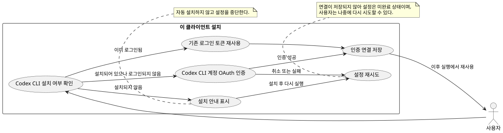
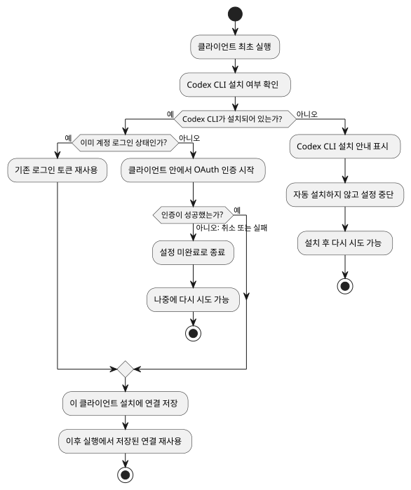
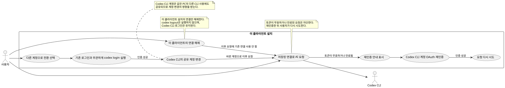
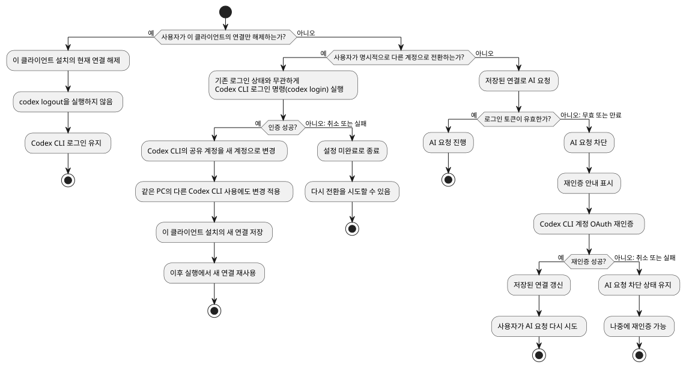

# Codex CLI 계정 연결 제품 명세

## 1. Problem and Context

클라이언트 사용자는 이 클라이언트에서 AI 기능을 사용하기 전에 Codex CLI 계정을 연결해야 한다. 최초 설치에서 연결이 완료되지 않으면 클라이언트를 사용할 수 없으며, 연결이 취소되거나 실패하면 다시 시도할 수 있어야 한다. 이후 저장된 로그인이 만료되거나 유효하지 않으면 AI 요청을 진행할 수 없다는 점과 다시 연결하는 방법을 사용자에게 알려야 한다.

첫 번째로 지원하는 AI 제공자는 Codex CLI다. 향후 다른 AI 제공자를 추가할 수 있도록 하는 것은 장기 목표이며, 이번 범위에서 다른 제공자를 지원하지는 않는다.

## 2. Goals and Desired Outcomes

- 최초 설치에서 Codex CLI 계정 연결이 성공한 뒤 클라이언트를 사용할 수 있다.
- 이미 Codex CLI에 로그인된 사용자는 기존 로그인을 연결에 재사용할 수 있다.
- 연결을 완료하면 이후 실행에서도 연결이 유지되어 사용자가 매번 다시 인증하지 않는다.
- 연결이 취소·실패하거나 저장된 로그인이 만료·무효화된 경우, 사용자가 원인을 이해하고 다시 연결할 수 있다.
- 사용자는 연결을 해제하고 다른 계정으로 연결할 수 있다.

## 3. Users and Actors

- **클라이언트 사용자**: Codex CLI 계정을 연결하고 클라이언트의 AI 기능을 사용하는 사람.
- **클라이언트**: 연결 상태를 확인하고 Codex CLI 계정 연결 및 AI 요청을 사용자에게 제공하는 프로그램.
- **Codex CLI**: 계정 로그인 상태를 제공하고, 필요할 때 사용자가 계정을 승인하도록 하는 외부 프로그램.
- **AI 제공자**: 클라이언트가 AI 요청을 보내는 제공자. 현재 지원 대상은 Codex CLI다.

## 4. Ubiquitous Language and Terminology

| 용어 | 의미 |
|---|---|
| 계정 연결 | 클라이언트가 Codex CLI 계정을 사용해 AI 기능을 이용할 수 있도록 사용자가 승인하는 것. |
| 연결된 계정 | 계정 연결이 성공하여 현재 클라이언트 설치에서 사용할 수 있는 계정. |
| 재인증 | 기존 연결을 더 이상 사용할 수 없을 때 사용자가 계정을 다시 승인하는 것. |
| 연결 해제 | Codex CLI의 공용 로그인은 유지하면서 현재 클라이언트 설치에서 계정 연결만 종료하는 것. |

## 5. Core Use Cases

### UC-COAUTH-01 — 최초 계정 연결

**주 액터:** 클라이언트 사용자 
**시작 조건:** 사용자가 최초 설치 후 클라이언트를 시작한다.

1. 클라이언트는 Codex CLI를 사용할 수 있는지 확인한다.
2. 사용할 수 없으면 설치 안내를 표시하고 계정 연결을 중단한다. 클라이언트는 Codex CLI를 자동 설치하지 않는다.
3. Codex CLI를 사용할 수 있으면 클라이언트는 기존 로그인이 있는지 확인한다.
4. 이미 로그인되어 있으면 그 로그인을 연결에 사용한다. 로그인되어 있지 않으면 Codex CLI를 통해 계정 승인을 시작한다.
5. 계정 승인이 성공하면 연결을 완료하고 클라이언트를 사용할 수 있게 한다.
6. 사용자가 승인을 취소하거나 승인이 실패하면 설정을 완료하지 않고 다시 시도할 수 있도록 안내한다.

**성공 결과:** 계정 연결이 완료되고, 현재 클라이언트 설치에서 다음 실행부터도 연결을 재사용할 수 있다.

### UC-COAUTH-02 — 연결 복구 또는 계정 변경

**주 액터:** 클라이언트 사용자 
**시작 조건:** 저장된 로그인이 만료·무효화되었거나 사용자가 다른 계정으로 바꾸려 한다.

1. 저장된 로그인이 만료·무효화된 상태에서 사용자가 AI 기능을 요청하면, 클라이언트는 AI 요청을 막고 재인증이 필요하다고 설명한다.
2. 사용자는 계정 재인증을 시도한다. 성공하면 연결을 복구하고 AI 기능을 다시 사용할 수 있다. 취소하거나 실패하면 연결되지 않은 상태로 남고 재시도할 수 있다.
3. 계정을 바꾸려는 사용자는 현재 클라이언트 연결을 해제할 수 있다. 이 동작은 Codex CLI의 공용 로그인을 종료하지 않는다.
4. 계정을 바꾸려는 사용자는 계정 전환을 명시적으로 시작한다. 이 흐름은 Codex CLI에 이미 계정이 로그인되어 있어도 Codex CLI의 계정 로그인을 새로 시작한다.
5. 새 계정 로그인이 성공하면 현재 클라이언트 연결을 새 계정으로 바꾼다. 같은 PC에서 Codex CLI를 사용하는 다른 작업도 이후부터 새 계정을 사용한다.
6. 계정 로그인이 취소되거나 실패하면 클라이언트 연결은 완료되지 않은 상태로 남고 사용자는 다시 시도할 수 있다.

**성공 결과:** 기존 연결이 복구되거나, 사용자가 현재 클라이언트 연결을 해제하거나, 계정 전환을 완료해 Codex CLI 공용 로그인을 새 계정으로 변경한다.

## 6. Business Rules and Invariants

- **REQ-COAUTH-01 (UC-COAUTH-01):** 최초 설치에서는 Codex CLI 계정 연결이 성공해야 클라이언트를 사용할 수 있다.
- **REQ-COAUTH-02 (UC-COAUTH-01):** 현재 지원하는 AI 제공자는 Codex CLI다. 다른 제공자 지원은 향후 목표이며 이번 범위의 요구사항이 아니다.
- **REQ-COAUTH-03 (UC-COAUTH-01):** Codex CLI를 사용할 수 없으면 설치 안내를 제공하고 연결을 중단한다. 클라이언트가 Codex CLI를 자동으로 설치하지 않는다.
- **REQ-COAUTH-04 (UC-COAUTH-01):** Codex CLI에 이미 로그인되어 있으면 기존 로그인을 연결에 재사용한다. 로그인되어 있지 않을 때는 Codex CLI를 통한 계정 승인을 진행한다.
- **REQ-COAUTH-05 (UC-COAUTH-01):** 연결 성공 뒤에는 사용자가 연결을 해제할 때까지 현재 클라이언트 설치에서 연결을 유지하고 재사용한다.
- **REQ-COAUTH-06 (UC-COAUTH-01, UC-COAUTH-02):** 승인 취소 또는 실패는 설정 완료로 간주하지 않으며, 사용자는 연결을 다시 시도할 수 있다.
- **REQ-COAUTH-07 (UC-COAUTH-02):** 저장된 로그인이 만료되거나 유효하지 않으면 AI 요청을 처리하지 않는다. 사용자는 재인증으로 연결을 복구할 수 있다.
- **REQ-COAUTH-08 (UC-COAUTH-02):** 사용자는 계정을 바꾸기 위해 연결을 해제한 뒤 다른 계정을 승인할 수 있다.
- **REQ-COAUTH-09 (UC-COAUTH-02):** 연결 해제는 현재 클라이언트 설치의 연결만 종료하며 Codex CLI의 공용 로그인을 종료하지 않는다. 연결 해제 시 `codex logout`을 실행하지 않는다.
- **REQ-COAUTH-10 (UC-COAUTH-02):** 계정 전환은 연결 해제와 구별되는 명시적 흐름이다. Codex CLI에 기존 계정이 로그인되어 있어도 Codex CLI의 계정 로그인을 새로 시작한다. 성공하면 현재 클라이언트 연결과 해당 PC의 Codex CLI 공용 로그인을 새 계정으로 변경하며, 다른 Codex CLI 사용도 새 계정을 사용한다.

## 7. States and State Transitions

| 현재 상태 | 조건 또는 사용자 행동 | 다음 상태 | 사용자에게 보이는 결과 |
|---|---|---|---|
| 최초 연결 필요 | Codex CLI를 사용할 수 없음 | 연결 중단 | 설치 안내를 표시한다. 자동 설치는 하지 않는다. |
| 최초 연결 필요 | 기존 Codex CLI 로그인이 있음 | 연결됨 | 기존 로그인을 사용해 연결을 완료한다. |
| 최초 연결 필요 | 기존 로그인이 없고 승인 성공 | 연결됨 | 클라이언트를 사용할 수 있다. |
| 최초 연결 필요 | 승인 취소 또는 실패 | 설정 미완료·재시도 가능 | 연결이 완료되지 않았으며 다시 시도할 수 있음을 안내한다. |
| 연결됨 | 저장된 로그인이 만료되거나 유효하지 않음 | 재인증 필요 | AI 요청을 막고 다시 인증해야 함을 설명한다. |
| 재인증 필요 | 재인증 성공 | 연결됨 | 연결을 복구하고 AI 기능을 다시 사용할 수 있다. |
| 재인증 필요 | 재인증 취소 또는 실패 | 재인증 필요 | AI 요청을 계속 막고 재시도할 수 있게 한다. |
| 연결됨 | 사용자가 연결 해제 | 연결 해제됨 | 현재 클라이언트 연결만 종료된다. Codex CLI 공용 로그인은 유지된다. |
| 연결됨 또는 연결 해제됨 | 사용자가 명시적으로 계정 전환을 시작하고 새 계정 로그인이 성공 | 새 계정으로 연결됨 | 현재 클라이언트와 해당 PC의 다른 Codex CLI 사용이 새 계정을 사용한다. |

**업무 목적이 있는 별도 상태 다이어그램:** 해당 없음 — 별도 업무 목적이 확인되지 않음.

## 8. Failures, Exceptions, and Boundary Conditions

- **Codex CLI를 사용할 수 없음:** 설치 안내를 보여 주고 계정 연결을 진행하지 않는다. 설치를 자동화하지 않는다.
- **계정 승인 취소:** 연결을 완료하지 않고 설정을 미완료 상태로 둔다. 사용자는 다시 시도할 수 있다.
- **계정 승인 실패:** 연결을 완료하지 않고 실패 사실과 재시도 가능성을 안내한다.
- **저장된 로그인 만료 또는 무효:** AI 요청을 차단하고 재인증 방법을 안내한다. 재인증 성공 전까지 AI 기능을 사용할 수 없다.
- **재인증 취소 또는 실패:** 연결 복구로 처리하지 않는다. AI 요청은 계속 차단되며 재시도할 수 있다.
- **연결 해제 뒤 다른 계정 연결 실패 또는 취소:** 새 클라이언트 연결은 완료되지 않는다. 사용자는 연결을 다시 시도할 수 있다. Codex CLI 로그인 상태의 결과는 여기서 별도로 정하지 않는다.

## 9. Inputs and Outputs

**입력**

- 사용자의 Codex CLI 계정 승인 또는 승인 취소.
- 사용자의 연결 해제 의사 또는 명시적인 계정 전환 의사.
- Codex CLI의 사용 가능 여부와 로그인 상태.
- AI 요청 시점의 저장된 로그인 유효성 결과.

**출력**

- Codex CLI 설치 안내 또는 계정 승인 절차.
- 연결 성공, 취소, 실패, 재인증 필요, 연결 해제 상태에 대한 사용자 안내.
- 로그인 만료·무효 시 차단된 AI 요청과 재인증 안내.
- 성공한 연결에 대해 현재 클라이언트 설치에서 이어지는 사용 가능 상태.

## 10. Scope and Non-goals

**이번 범위에 포함**

- 최초 설치 시 Codex CLI 계정 연결을 요구한다.
- Codex CLI 사용 가능 여부 확인과 미설치 시 사용자 안내를 제공한다.
- 기존 Codex CLI 로그인을 재사용하거나, 로그인되지 않았으면 계정 승인을 진행한다.
- 성공한 연결을 현재 클라이언트 설치에서 유지하고 재사용한다.
- 승인 취소·실패와 만료·무효 로그인에 대한 사용자 안내 및 재시도·재인증 흐름을 제공한다.
- 사용자가 클라이언트 연결을 해제하거나, 별도의 계정 전환 흐름으로 다른 계정을 연결할 수 있다.

**이번 범위에 포함하지 않음**

- Codex CLI 자동 설치.
- Codex CLI 외 다른 AI 제공자 지원.
- 사용자에게 확인된 흐름 외의 별도 연결 업무 흐름.

## 11. Priorities and Trade-offs

1. 최초 계정 연결 성공을 클라이언트 사용의 조건으로 둔다.
2. 기존 Codex CLI 로그인은 재사용하여 사용자의 승인 절차를 줄인다.
3. 승인 취소·실패와 로그인 만료·무효 상태에서는 연결되지 않은 기능 사용을 허용하지 않고, 복구 방법을 안내한다.
4. 연결은 사용자가 해제할 때까지 유지하여 반복 인증을 줄인다.
5. 사용자는 현재 클라이언트 연결을 해제하거나, 별도 계정 전환을 명시적으로 시작해 Codex CLI 공용 계정을 바꿀 수 있다.
6. 다른 AI 제공자 추가 가능성은 장기 목표로 고려하되, 현재 요구 범위는 Codex CLI로 제한한다.

## 12. Success Conditions and Acceptance Criteria

- [ ] **REQ-COAUTH-01 (UC-COAUTH-01):** 최초 설치에서 계정 연결이 성공하기 전에는 클라이언트 사용을 허용하지 않는다.
- [ ] **REQ-COAUTH-03 (UC-COAUTH-01):** Codex CLI를 사용할 수 없으면 설치 안내를 표시하고 연결을 중단하며, 자동 설치하지 않는다.
- [ ] **REQ-COAUTH-04 (UC-COAUTH-01):** Codex CLI에 이미 로그인된 경우 기존 로그인을 재사용한다.
- [ ] **REQ-COAUTH-04 (UC-COAUTH-01):** 로그인되어 있지 않은 경우 Codex CLI 계정 승인을 시작한다.
- [ ] **REQ-COAUTH-05 (UC-COAUTH-01):** 승인 성공 뒤 연결을 완료하고, 사용자가 해제하기 전까지 이후 실행에서 재사용한다.
- [ ] **REQ-COAUTH-06 (UC-COAUTH-01, UC-COAUTH-02):** 승인 취소·실패 시 설정은 미완료로 남고 재시도할 수 있다.
- [ ] **REQ-COAUTH-07 (UC-COAUTH-02):** 저장된 로그인이 만료·무효이면 AI 요청을 차단하고 재인증 필요성을 설명한다.
- [ ] **REQ-COAUTH-07 (UC-COAUTH-02):** 재인증 성공 뒤 연결을 복구하여 AI 기능 요청을 다시 허용한다.
- [ ] **REQ-COAUTH-08 (UC-COAUTH-02):** 사용자가 연결을 해제하고 다른 계정을 승인할 수 있다.
- [ ] **REQ-COAUTH-09 (UC-COAUTH-02):** 연결 해제는 현재 클라이언트 설치의 연결만 종료하며 Codex CLI 공용 로그인을 유지하고 `codex logout`을 실행하지 않는다.
- [ ] **REQ-COAUTH-10 (UC-COAUTH-02):** 계정 전환은 명시적으로 시작하며, Codex CLI에 기존 계정이 있어도 새 계정 로그인을 시작한다. 성공하면 현재 클라이언트 연결과 해당 PC의 다른 Codex CLI 사용이 새 계정으로 바뀐다.
- [ ] **REQ-COAUTH-10 (UC-COAUTH-02):** 계정 전환이 취소되거나 실패하면 클라이언트 연결은 완료되지 않은 상태로 남고 재시도할 수 있다.
- [ ] **REQ-COAUTH-02 (UC-COAUTH-01):** 현재 AI 제공자 지원 범위는 Codex CLI이며, 다른 제공자 지원은 이번 범위에 포함되지 않는다.
