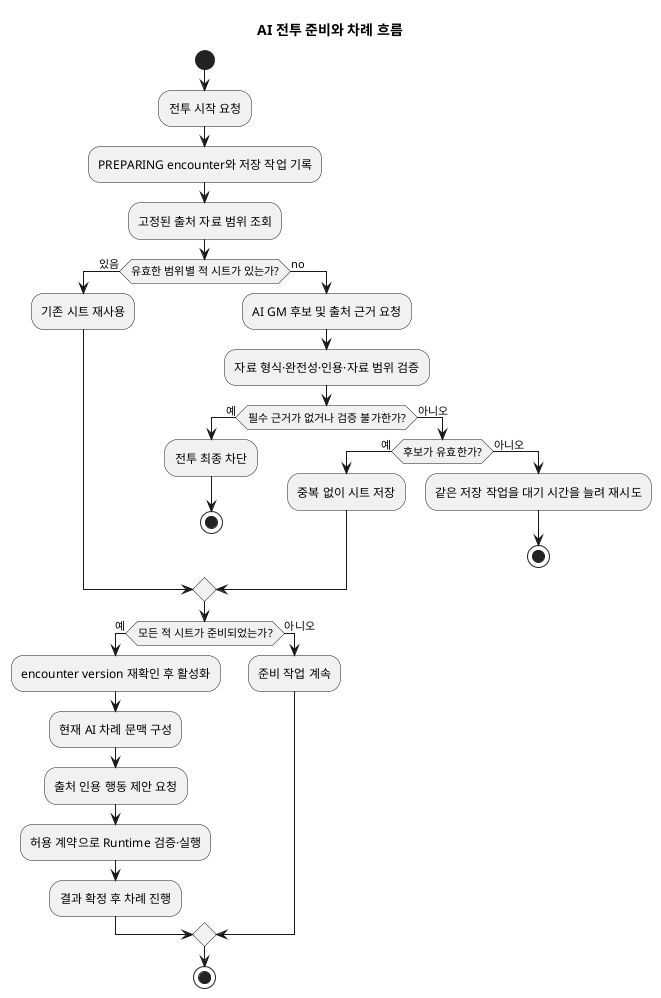

# Architecture Spec — AI 동료·적 전투 행동

본문의 `CombatEncounter` 등 코드 식별자는 기존 이름을 그대로 유지한다. AI가 만든 후보는 Runtime이 검증하며, 적 시트는 같은 모험과 자료 범위 안에서 재사용한다. `CombatAutoProgressionWorker`는 저장된 작업을 수행하는 백그라운드 처리기이고, `Saga`는 여러 소유 서비스 명령을 멱등하게 이어 실행하는 기존 절차다. 재시도 대기 시간은 점차 늘리되 시도 횟수는 제한하지 않는다.

# 1. Design Scope

## 1.1 Target

| 항목 | 대상 |
|---|---|
| Product Spec | `docs/specs/combat-ai-actions/product-spec.md` |
| Use Cases | UC-001 AI 동료 턴 행동, UC-002 전투 시작 전 적 캐릭터 시트 확보, UC-003 적 턴 행동 |
| Domain | Adventure Runtime의 전투 준비·행동 결정 내부 기능 |
| Bounded Contexts | Adventure Runtime, AI Game Master, Document Knowledge |
| Existing Services | `adventure-service`, `ai-game-master-service`, Document Knowledge 제공자 |
| External Dependencies | PostgreSQL, 기존 내부 AI·근거 검색 계약 |
| Affected Data | 모험·자료 범위에 고정된 적 캐릭터 시트, `CombatEncounter`, `CombatParticipant`, `CombatWorkItem`, 구조화된 AI 차례 문맥과 행동 후보 |

전투 준비와 AI 전투 결정은 새 Bounded Context(업무 언어와 소유권이 분리된 경계), 코드 모듈 또는 배포 서비스가 아니다. `adventure-service` 안의 Adventure Runtime 내부 기능으로 둔다. 기존 전투 생명주기와 런타임 명령 경계를 유지한다.

## 1.2 Product Spec Mapping

| Product Spec 항목 | Architecture 요소 |
|---|---|
| UC-001 / BR-001~002 / AC-001~002 동료 행동 | 최신 Current Situation(현재 상황)과 자신의 CharacterSheet(캐릭터 시트)를 구조화된 문맥으로 제공하고, 근거가 부족할 때만 Rulebook(룰북) 근거를 조회; 인용 규칙이 뒷받침하는 행동 후보를 런타임 계약으로 검증·실행 |
| UC-002 / BR-005~006 / AC-003~005, AC-011 적 시트 확보·재사용 | `CombatEncounter`를 `PREPARING`으로 만들고 저장된 `CombatWorkItem` 실행; 고정 자료 범위와 적 종류 키로 시트 재사용; 모두 검증된 뒤 참가자·전투 상태 생성 및 전투 활성화 |
| UC-003 / BR-003~004 / AC-006~008 적 행동 | 시트, 현재 상황, 목표·생존·전술 위치를 구조화된 문맥에 포함; AI가 출처를 인용한 행동 후보를 제시; Runtime 검증 후 `CombatActionApplicationService`와 기존 여러 서비스 명령 실행 절차/계약으로 처리 |
| BR-007 / AC-004, AC-008~009 | 전투 준비·AI 턴 결정 전용 무제한 지수형 대기 재시도; 근거 부재·검증 불가만 최종 block; 다른 실패는 턴 진행을 멈춘 채 재시도 |
| BR-008 / AC-010 | 내부 시트·진단과 플레이어 상태 자료/event 표시 자료 분리; 플레이어에게 관찰 가능한 확정 결과만 제공 |
| BR-009 | 근거 완전성·규칙 적법성 우선, 같은 자료 범위의 같은 종류 시트 검색·생성 반복 방지 |

## 1.3 Architecture Coverage

| Topic | 상태 | 근거 |
|---|---|---|
| Design Scope and Product Mapping | SETTLED | Product Spec UC/BR/AC와 1.2 |
| Domain Flow and Hotspots | SETTLED | 전투 준비, 구조화된 차례 결정, 저장된 작업, 실행 순서 결정 |
| Domain Boundaries and Bounded Context Promotion | SETTLED | Adventure Runtime 내부 기능; 별도 업무 경계/모듈/서비스 없음 |
| Context Map and Business Rule Ownership | SETTLED | `CONTEXT-MAP.md`, 본 문서 3장; Runtime 확정, AI 후보, Document Knowledge 증거 |
| Entities, Value Objects, and Domain Services | SETTLED | 3장; Encounter lifecycle와 시트 identity/재사용 시트 및 참가자별 상태 분리 |
| State Transitions and Repository Boundaries | SETTLED | 3.8 및 6장; 기존 저장된 encounter/work 저장 경계 재사용 |
| Program Design | SETTLED | 4장; 준비 작업 처리기 및 결정/행동 경계 |
| Technical Architecture and Boundary Mapping | SETTLED | 5장; `adventure-service` 내부 additive 변경 |
| Runtime Design | SETTLED | 6장; lease, idempotency, 버전 재확인, 순서 보장 |
| Error Handling and Recovery | SETTLED | 7장; 이 내부 기능에 한정된 횟수 제한 없는 재시도와 최종 근거 실패 |
| Security and Observability | SETTLED | 8~9장; 숨은 수치 보호와 개발 진단 |
| Change and Verification Boundaries | SETTLED | 10~11장; 범위 및 구조 계약 명시 |
| Alternatives, Trade-offs, Risks, and Open Questions | SETTLED | 12~13장; ADR 예외와 위험을 명시, blocking 질문 없음 |

---

# 2. Domain Flow

## 2.1 Event Flow

1. Adventure Runtime은 시작 요청을 검증하고 기존 `CombatEncounter`를 `PREPARING`으로 생성한다. 같은 local transaction에서 필요한 저장된 preparation work를 기록한다.
2. `CombatAutoProgressionWorker`(전투 자동 진행 작업 처리기)가 고정된 Storybook(추가 룰북)/Rulebook(기본 룰북) 자료 범위와 모험의 자료 버전을 읽는다.
3. 각 참가 적에 대해 해당 범위·적 종류의 저장된 `EnemyCharacterSheet`가 있으면 재사용한다. 없으면 AI Game Master에 구조화 후보를 요청하고 Document Knowledge에서 후보가 인용한 출처를 확인한다.
4. Runtime은 후보의 스키마·완전성·모험 자료 범위 내 출처 식별자·인용 연결을 검증한 뒤 시트를 저장한다. 같은 종류 work는 identity unique key 및 멱등 저장으로 중복을 제거한다.
5. 참가 적의 모든 시트가 유효할 때 encounter 상태/version을 다시 확인하고, 각 적 `CombatParticipant`의 새 HP·상태·자원, initiative/order를 만들고 encounter를 활성화한다. 시트는 전투 중 변하는 상태를 갖지 않는다.
6. AI 동료 또는 적 차례의 저장된 작업이 최신 encounter(전투) 상태, Current Situation(현재 상황) 및 행위자별 정보를 구조화된 `AiCombatTurnContext`(AI 전투 차례 문맥)로 읽는다. 동료는 자신의 CharacterSheet를 우선 사용하고 필요한 룰이 없을 때만 Rulebook을 조회한다. 적은 고정된 시트와 현재 전투 참가자 상태를 함께 사용한다.
7. AI 제공자는 인용된 규칙 근거를 연결한 구조화된 행동 후보를 반환한다. 적의 `endTurn`(차례 종료) 후보는 유리한 합법 행동이 없다는 판단과 검증 가능한 근거를 포함해야 한다.
8. Adventure Runtime은 출처 인용과 자료 범위, 완전성, 현재 encounter version(전투 버전), 행위자·대상, 허용된 행동/상태 변경 계약과 실행 불변 조건을 검증한다. 적법한 후보는 `CombatActionApplicationService`(전투 행동 적용 서비스)와 기존 Runtime Saga(여러 서비스 명령을 이어서 멱등 실행하는 절차)/계약으로 실행한다. 합법 행동이 없다는 적의 종료 결정만 차례 종료 경로로 전달한다.
9. 행동 성공 또는 합법적 종료가 확정된 뒤에만 결과와 다음 차례를 저장한다. 실패하면 같은 저장 작업을 재시도 간 대기 시간을 늘려가며 재시도하고 차례 순서를 진행하지 않는다.

전투 준비·행동 재시도 중 진행 표시는 현행 흐름을 유지한다. 확정 근거 부재 또는 검증 불가만 일반 전투 차단 상태가 된다.

## 2.2 Commands

| Command | Actor | Target | Preconditions | Result |
|---|---|---|---|---|
| `PrepareCombat` | Adventure Runtime | `CombatEncounter` | 참가자 확정, active encounter 및 입력 검증 | `PREPARING` encounter와 저장된 work 생성 |
| `PrepareEnemyCharacterSheet` | 작업 처리기 | 범위가 지정된 `EnemyCharacterSheet` | encounter 준비 중, 자료 범위 고정 유효 | 기존 시트 재사용 또는 검증된 후보 저장 |
| `ActivatePreparedCombat` | 작업 처리기 | `CombatEncounter` | 모든 참가 적 시트 유효, encounter version 일치 | 참가자별 새 전투 상태·순서와 활성 encounter 저장 |
| `DecideAiCombatTurn` | 작업 처리기 | 현재 AI participant 차례 | encounter 활성, 행위자/version 일치 | 인용된 행동 또는 유리한 행동이 없을 때의 적법한 종료 후보 |
| `SubmitAiCombatAction` | Adventure Runtime | 행동/상태 변경 계약 | 후보와 출처 인용 검증 통과, 행위자/대상 유효 | 기존 여러 서비스 명령 실행 절차 완료 후 결과와 차례 진행 |
| `RetryCombatWork` | 작업 처리기 | `CombatWorkItem` | 재시도 가능한 실패, 작업 임대 획득 | 같은 논리 작업의 재실행 예약 |

## 2.3 Domain Events / State Results

새 독립 이벤트 흐름은 도입하지 않는다. 기존 전투 snapshot(저장 시점 상태)/event(사건 기록)/work(처리 작업) 구조에서 기존 의미와 호환되는 결과를 기록한다.

| 결과 | 생성자 | 발생 조건 | 주요 값 | 사용처 |
|---|---|---|---|---|
| Encounter `PREPARING` | Runtime 준비 처리 | 전투 준비 승인 | encounter id/version, 참가자 참조 | 저장된 작업 처리기, 현행 진행 화면 자료 |
| 적 시트 준비/재사용 | 준비 처리 | 후보 검증·저장 또는 기존 시트 발견 | 시트 식별자, 자료 범위/version, 적 종류 key | 후속 준비 작업, 참가자 생성기 |
| Encounter 활성화 | `CombatEncounter` 처리 | 모든 시트 유효, 준비 상태/version 재확인 | 참가자·initiative/order, 새 전투 상태 | 기존 전투 진행/화면 자료 |
| AI 행동 확정 | 기존 combat 처리/Saga | 허용 행동 성공 | 관찰 가능한 결과, event/version | 플레이어 공개용 결과 자료, 다음 작업 |
| AI 차례 종료 | 기존 차례 처리 | 유리한 합법 행동 없음이 검증됨 | participant, encounter version | 다음 차례 또는 round 진행 |
| 전투 준비 차단 | Runtime | 필요한 근거가 없거나 검증 불가 | 내부 실패 코드 및 상태 | 플레이어용 일반 차단 표시, 개발 진단 |

## 2.4 Policy

| 정책 | 발생 조건 | 결정 | 후속 처리 | 소유자 |
|---|---|---|---|---|
| 준비 완료 확인 | 각 적 시트 저장/재사용 | 모두 유효하면 활성화, 아니면 다음 준비 작업 | `ActivatePreparedCombat` 또는 작업 획득 | Adventure Runtime |
| 준비·결정 복구 | 일시 제공자/통신/형식/규칙 검증 오류 | 횟수 제한 없이 재시도, 대기 시간은 늘고 최대 대기 시간에서 유지 가능 | 같은 작업 재예약 | Adventure Runtime 작업 처리기 |
| 근거 실패 차단 | 필수 출처 부재 또는 검증 불가 | 전투 준비/진행 최종 차단 | 플레이어용 일반 차단 표시 | Adventure Runtime |
| 행동 확정 | Runtime에서 후보 검증 및 외부 단계 성공 | 결과 확정 후에만 다음 차례 생성 | 기존 차례/진행 경로 | Adventure Runtime |

## 2.5 Read Models

| 조회 자료 | 사용처 | 원천 | 항목 | 소유자 |
|---|---|---|---|---|
| `AiCombatTurnContext` | AI 행동 결정 제공자 | Encounter, 행위자 CharacterSheet 또는 적 시트+참가자 상태, Current Situation, 대상/공간 문맥, 범위가 고정된 근거 | 행위자 종류/id, 상황/version, 시트, 전투별 상태, 가능한 대상/공간, 필요한 출처 인용 | Runtime 문맥 조립기 |
| 플레이어 전투 표시 자료 | 플레이어 화면/기록 | encounter 결과/사건 | 관찰 가능한 확정 결과, 현행 진행/일반 차단 표시 | 기존 Runtime 표시 자료 조립기 |

## 2.6 External Interactions

| 시스템 | 호출 조건 | 입력 | 출력 | 실패 처리 |
|---|---|---|---|---|
| AI Game Master | 적 시트 후보 또는 AI 차례 결정 필요 | 고정된 자료 범위, 구조화된 문맥, 형식/version | 출처를 인용한 구조화 후보/행동 제안 | 통신·제공자 오류와 잘못된 제안은 재시도 |
| Document Knowledge | 근거 탐색/인용 검증 | 모험에 고정된 문서 ID 및 버전, 질의/인용 ID | 출처 근거 및 문서 위치 참조 | 실제 부재 또는 검증 불가는 최종 차단; 일시 오류는 재시도 |
| Character Management / Dice Roll / Combat Map | 허용 행동이 해당 소유 데이터 변경/판정을 요구 | 기존 버전 조건부 명령과 중복 실행 방지 키 | 소유 서비스의 구조화 결과 | 기존 Runtime 여러 서비스 명령 실행 절차의 복구 정책; 성공 전 차례 진행 금지 |

## 2.7 Hotspots

| 검토 지점 | 결정 |
|---|---|
| 적 시트의 반복 검색과 수명 | 같은 모험, 같은 고정 자료 범위/version, 같은 적 종류에서 재사용; 전투별 HP/status/resources는 참가자 상태에 분리 |
| AI의 규칙 판정 권한 | 인용된 원문 규칙을 확인할 수 있으면 내장 규칙 처리기가 해석하지 못하는 경우도 AI가 판정할 수 있음; 실제 상태 변경은 Runtime 허용 목록과 실행 계약을 통과해야 함 |
| 재시도 정책 충돌 | ADR-017의 일반 GM/Scenario 작업 최대 1회 재시도는 그대로; 이 ticket의 전투 시트 준비 및 AI 전투 차례 결정에만 횟수 제한 없는 재시도 적용 |
| 차례 종료 기본값 | AI 결정 포트의 기본 `endTurn`(차례 종료) 금지; 유리한 합법 행동이 없음을 확인한 경우에만 명시적 종료 허용 |

---

# 3. DDD Architecture

## 3.1 Bounded Contexts (업무 언어와 소유권이 분리된 경계)

| 업무 경계 | 책임 | 소유 모델/자료 |
|---|---|---|
| Adventure Runtime | 모험 고정 자료 범위, 적 시트 재사용, 전투 생명주기, 행동 확정·외부 상태 명령 조정, 결과 표시 자료 | `CombatEncounter`, `CombatParticipant`, `CombatWorkItem`, `EnemyCharacterSheet` 및 전투 결과 |
| AI Game Master | 구조화된 시트/행동 후보와 규칙 근거 판단 제안 생성 | 제공자 내부 생성 결과; 권위 있는 상태 없음 |
| Document Knowledge | 문서, 추출 버전, 출처 근거/문서 위치와 고정 자료 범위 검색 | Knowledge Document 및 출처 인용 근거 |

## 3.1.1 Boundary Decisions

| 기능 | 소유자 | 선택한 경계 | 더 약한 경계로 충분하지 않은 이유 | 더 강한 경계를 택하지 않은 이유 |
|---|---|---|---|---|
| 적 시트 준비·재사용·전투 연결 | Adventure Runtime | 내부 기능과 저장소 연결부 | 작업 흐름, 자료 범위 고정, 활성화 조건, encounter 일관성을 기존 응용/저장소 경계에서 분리해야 함 | 독립 언어·자료 수명·일관성·배포 필요성이 없고 모험 전투에 종속됨; 새 업무 경계/모듈/서비스는 소유권 중복과 호출 비용을 만든다 |
| 적 시트 | Adventure Runtime | 모험/자료 범위 식별자를 갖는 지속 저장 시트 모델; 저장 불변 조건은 저장소/서비스에서 원자적으로 보장 | 재사용 식별자와 버전 경계가 필요해 일회성 전달 자료만으로 부족 | 참가자 HP/status/resources와 같은 encounter aggregate 상태가 아니며 여러 전투에서 재사용; 별도 저장 단위는 별도 거래/수명이 확인되지 않았다 |
| AI 전투 결정 | Adventure Runtime 내부 기능, AI Game Master 제공자 | 구조화 계약을 갖는 포트/연결부 | 내부 행동 후보를 형식·출처·상태와 독립 검증해야 함 | AI 제공자는 모델/자료 정본을 소유하지 않으며 새 Runtime service는 불필요 |

## 3.2 문맥 Map

| 자료 제공자 | 자료 이용자 | 관계 | 계약 / 변환 |
|---|---|---|---|
| Document Knowledge | Adventure Runtime | 출처 근거 제공자 | 문서 ID/version 및 위치 인용을 Runtime의 자료 범위 검증 모델로 변환 |
| AI Game Master | Adventure Runtime | 후보 생성 제공자 | 구조화된 후보/행동 제안 및 인용; Runtime이 저장/실행 전에 검증 |
| Adventure Runtime | Character Management, Dice Roll, Combat Map | 실행 조정자 | 기존 소유 서비스의 버전 조건부 명령 및 구조화된 결과; 기존 여러 서비스 명령 실행 절차로 진행 |

## 3.3 Aggregates and Consistency

| 저장 단위/경계 | 책임 | 불변 조건 |
|---|---|---|
| `CombatEncounter` | 전투 생명주기, 준비/활성 상태, 차례 순서/version | 적 시트 전부 준비되기 전 활성화 금지; 실패 중 차례 advance 금지; stale version 차단 |
| `CombatParticipant` | encounter 내 참여자별 initiative, HP/status/resources 등 전투 상태 | 적 상태는 encounter participant 소유; 다음 combat에서는 새 상태로 초기화 |
| `EnemyCharacterSheet` 재사용 시트 | 모험·고정 자료 범위·적 종류별 재사용되는 규칙 근거 포함 시트 | 범위 밖 인용 없음; 같은 식별자에서 중복 없이 저장; 여러 전투 상황에서 같은 정본 사용 |
| `CombatWorkItem` | 준비 및 AI turn의 저장된 전달/lease/재시도 상태 | 작업별 중복 실행 방지, lease 만료 회수, 재시도 중 논리 입력 및 encounter 참조 유지 |

`EnemyCharacterSheet`를 별도 Aggregate(일관성 경계가 있는 저장 단위)로 승격하지 않는다. 이번 요구는 재사용 키의 원자적 유일성과 검증 후 저장으로 만족한다. 구현에서 시트 변경/수명 경계가 독립 거래 단위를 요구하는 증거가 생기면 새 ADR로 재검토한다.

## 3.4 Entities and Value Objects

| 자료형 | 종류 | 식별/값 | 책임 |
|---|---|---|---|
| `EnemyCharacterSheet` | 지속 저장 재사용 시트 모델; 별도 저장 단위로 승격하지 않음 | 모험 id + 자료 범위/version + 적 종류 key | 전투 수치, 규칙 근거가 확인된 전체 전투 행동/능력, 각 행동의 근거와 출처 인용 |
| `CombatParticipant` | 기존 encounter 참가자 | encounter id + 참가자 id | 개별 전투 중 상태·현재 위치 |
| `EnemySheetIdentity` | 값 객체 | 모험 id, 고정 자료 범위 지문/version, 안정된 적 종류 key | 재사용 범위를 코드/DB key로 동일하게 표현 |
| `RuleCitation` | 값 객체/계약 자료형 | 문서 id/version, 인용/문서 위치 id, 규칙/행동 연결 | 행동 후보와 적 시트의 출처 연결 검증 |
| `AiCombatTurnContext` | 조회 계약 | encounter/행위자/version, 상황, 시트/상태, 대상/공간 문맥 | 제공자에게 현재 유효한 상황만 전달 |
| `AiCombatDecisionProposal` | 입력 계약 | 구조화 행동/`endTurn`, 대상, 인용된 규칙 근거 | 검증 전에는 명령이나 상태 변경이 아님 |

## 3.4.1 Class Diagram

다이어그램은 Adventure Runtime 내부의 자료 범위별 시트 식별자/저장소, 준비 서비스, AI 후보 및 근거 포트, `CombatEncounter`·참가자·저장된 작업, 구조화 차례 문맥/행동 제안/결정 포트, Runtime 규칙/행동·상태 변경 경계를 나타낸다. 관련 범위: UC-001~UC-003, BR-001~BR-009.

원본: `docs/specs/combat-ai-actions/diagrams/architecture/adventure-runtime.class.puml`  
SVG: [Adventure Runtime class diagram](diagrams/architecture/adventure-runtime.class.svg)

## 3.5 Domain Services and Rule Ownership

| 규칙 / 서비스 | 소유자와 적용 위치 |
|---|---|
| 시트 식별, 출처 범위, 완전성 | Adventure Runtime 준비 처리 및 시트 저장소 경계 |
| encounter 활성화 조건 / 순서 / version | `CombatEncounter`와 기존 생명주기 처리 |
| 행동 의미 선택 및 전술 평가 | AI Game Master 행동 제안 책임; 적은 목표·생존·전술 위치 향상 행동을 고려 |
| 출처 인용 유효성 | Runtime 출처/범위 검증기와 Document Knowledge 조회 계약 |
| 허용 상태 변경, 행동 실행 불변 조건 | Adventure Runtime 규칙/행동·상태 변경 계약 및 소유 서비스 저장 단위 |
| 캐릭터, 주사위, 지도 자료 | 해당 소유 업무 경계; Runtime은 기존 명령 실행 절차로 조정하고 복제하지 않음 |

## 3.6 Aggregate State Transitions

| 현재 상태 | 발생 조건 | 다음 상태 | 조건 |
|---|---|---|---|
| 없음 | `PrepareCombat` | `PREPARING` | encounter 시작 전제 및 자료 범위 고정 |
| `PREPARING` | 시트 후보의 일시 오류/검증 실패 | `PREPARING` | 작업 재예약, 시도 횟수 제한 없음 |
| `PREPARING` | 필수 근거가 없음/검증 불가 | 최종 차단 상태 | 출처 근거 실패 코드; 진행 불가 |
| `PREPARING` | 모든 시트 유효 | 전투 활성 상태 | encounter version 재확인, 참가자별 새 전투 상태 구성 |
| AI 차례 진행 중 | 제공자/검증/실행 재시도 대상 오류 | 같은 차례/작업 대기 | 작업 임대, version 유지, 행동/차례 미진행 |
| AI 차례 진행 중 | 행동 성공 | 다음 정당한 차례 상태 | 기존 명령 실행 절차 완료 및 확정 확인 |
| 적 차례 진행 중 | 유리한 합법 행동 없음 결정 | 다음 정당한 차례 상태 | 명시적 `endTurn` 행동 제안 검증 |

설계 상태 다이어그램: `해당 없음 — Product business-state와 동일한 목적`.

## 3.7 Repository Boundaries

| 저장소 | 소유 자료 | 작업 | 일관성 |
|---|---|---|---|
| existing combat encounter repository | `CombatEncounter`, participants, event/version | prepare/load/versioned transition/activate | 한 local transaction, encounter version/lock |
| existing combat work repository | `CombatWorkItem` | insert, claim, lease renew/complete, 재시도 dueAt update | DB lease 및 unique logical work identity |
| 새 시트 저장소 포트 + PostgreSQL 연결부 | `EnemyCharacterSheet` 재사용 시트 | 전체 `EnemySheetIdentity`로 조회, 없을 때만 삽입/중복 없는 저장 | 식별자 유일성; 같은 자료 범위에서 검증된 후보 재사용 |
| Document Knowledge read port | external 출처 근거 | query/read/verify 출처 citations under locked 자료 범위 | owner 문맥 authoritative; Runtime validates returned IDs/자료 범위 |

---

# 4. Program Design

## 4.1 Major Components and Responsibilities

| 구성 요소 | 책임 | 입력 → 출력 | 해서는 안 되는 일 |
|---|---|---|---|
| `CombatStartParticipantFactory` | 확정 참가자 정보와 유효한 시트에서 참가자 초기 상태 생성 | 참가자/시트 → 참가자 후보 | 출처 범위를 바꾸거나 기존 전투 상태 재사용 |
| 전투 준비 응용 서비스 | PREPARING 전환, 작업 생성, 시트 확보·검증·저장, 활성화 조건 적용 | 시작/작업 → 저장된 진행 결과 | 후보를 검증 없이 정본 시트로 저장 |
| `CombatAutoProgressionWorker` | 기존 저장 작업 규칙에 따라 준비/차례 작업 획득 및 실행 | 임대한 `CombatWorkItem` → 완료/재예약 | 실패 시 차례 진행 또는 작업 소실 |
| 적 시트 저장소 | 전체 범위 식별자로 시트 재사용/저장 | 식별자/시트 → 기존 시트 또는 없음 | 다른 모험/자료 개정판 간 공유 |
| `AiCombatContextAssembler` | 최신 행위자별 구조화 문맥 조립 | encounter + 행위자 조회 포트 → `AiCombatTurnContext` | 오래된 상태나 비공개 시트를 플레이어 표시 자료에 노출 |
| `AiCombatDecisionPort` 연결부 | AI GM 제공자 계약 | 구조화 문맥 → 출처 인용 행동 제안 | AI 응답을 직접 저장/실행 |
| `CombatProposalValidator` | 자료 형식, 행위자/대상/version, 인용, 완전성, 실행 불변 조건 검증 | 행동 제안/문맥 → 유효 제안 또는 구조화 실패 | 규칙 근거 또는 Runtime 권한 없이 임의 상태 변경 |
| `CombatActionApplicationService` / 기존 Saga | 검증된 행동 실행 및 결과 확정 | 검증된 행동 제안 → 기존 소유 서비스 명령/결과 | AI가 소유 서비스/정본을 우회하도록 허용 |

## 4.2 Application Flow



## 4.3 Component Call Contracts

| Order | Caller | Callee | Operation | Input | Output / failure |
|---:|---|---|---|---|---|
| 1 | combat start application | encounter/work repositories | persist preparation | adventure/자료 범위/participant ids, expected version | PREPARING + 저장된 work; conflict returns 구조화된 재시도/reload |
| 2 | 작업 처리기 | 재사용 시트 repository | `findByIdentity` | full `EnemySheetIdentity` | existing 재사용 시트 or absent |
| 3 | 작업 처리기 | AI GM and Document Knowledge ports | generate 후보/근거 | fixed 출처 자료 범위, enemy key, 후보 자료 형식 | 출처-cited 후보; 제공자 failure 재시도, missing/unverifiable 출처 최종 |
| 4 | preparation application | validators/재사용 시트 repository | validate and save | 후보 + 자료 범위 + identity | saved/reused 재사용 시트; invalid 행동 제안 재시도 |
| 5 | 작업 처리기/문맥 assembler | `AiCombatDecisionPort` | `planTurn` | latest 구조화된 문맥 | 구조화된 cited 행동 제안; 제공자 error 재시도 |
| 6 | Runtime action service | 행동 제안 validator + existing Saga/contracts | apply validated decision | 행동 제안, expected encounter version, idempotency key | action result or 구조화된 failure; no advance until success |

## 4.4 구조화된 계약과 시그니처

아래 시그니처는 목표 경계를 정의한다. 기존 문자열 JSON 연결부가 이미 이 동작을 구현한다는 뜻은 아니다.

```java
interface EnemyCharacterSheetCandidatePort {
    EnemyCharacterSheetCandidate propose(EnemySheetRequest request);
}

interface RuleEvidenceReadPort {
    List<RuleEvidence> findEvidence(ScopedRuleQuery query);
    CitationVerification verifyCitations(AdventureSourceScope scope, List<RuleCitation> citations);
}

interface EnemyCharacterSheetRepository {
    Optional<EnemyCharacterSheet> findByIdentity(EnemySheetIdentity identity);
    EnemyCharacterSheet saveIfAbsent(EnemySheetIdentity identity, EnemyCharacterSheet sheet);
}

interface AiCombatDecisionPort {
    AiCombatDecisionProposal planTurn(AiCombatTurnContext context);
}

interface CombatProposalValidator {
    ValidatedCombatDecision validate(AiCombatDecisionProposal proposal, AiCombatTurnContext context);
}
```

| 계약 | 사전/사후 조건 | 실패/부수 효과 |
|---|---|---|
| `EnemyCharacterSheetCandidatePort.propose` | 전달한 모험/자료 범위와 적 종류 key 안의 후보만 생성하도록 지정 | 제공자/자료 형식 오류는 저장된 준비 작업 재시도; 출처 부재 판정은 근거 포트의 검증 결과로만 함 |
| `RuleEvidenceReadPort.verifyCitations` | 모든 인용이 현재 고정 자료 범위의 문서/version/위치를 참조 | 부재/검증 불가는 최종 근거 실패; 일시 조회 오류는 재시도 가능한 기반 시설 오류 |
| `EnemyCharacterSheetRepository.saveIfAbsent` | 식별자가 모험+자료 범위/version+적 종류 key 전체를 포함 | 동시 동일 저장은 기존 시트 반환; 다른 자료 범위에서는 재사용 불가 |
| `AiCombatDecisionPort.planTurn` | 최신 구조화 문맥 및 현재 결정 자료 형식 전달 | `endTurn` 기본값 없음; 통신/잘못된 제안은 작업 처리기가 재시도 |
| `CombatProposalValidator.validate` | 제안의 행위자, 대상, encounter version, 인용, 필수 구조화 항목 검증 | 구조화된 무효/출처 실패; 권위 있는 상태 변경 없음 |

`EnemyCharacterSheetCandidate`(적 시트 후보)는 전투 수치, 해당 자료 범위에서 확인한 전체 규칙 기반 전투 행동/능력, 각 행동의 규칙 근거와 출처 인용을 담는다. `AiCombatDecisionProposal`(AI 전투 행동 제안)은 `Action` 또는 `EndTurn`의 명시적 선택, 대상/공간 의도, 판정에 사용한 출처 인용을 갖는다. 적 `EndTurn`에는 유리한 합법 행동이 없다는 평가가 필수다.

## 4.5 Dependency Rules

| 출발 구성 요소 | 대상 | 계약 |
|---|---|---|
| Adventure Runtime 응용 처리 | AI Game Master | 구조화된 후보/결정 포트; 저장·실행 권한 없음 |
| Adventure Runtime 응용 처리 | Document Knowledge | 고정 출처 자료 범위 조회/검증 포트 |
| 응용 처리/작업 처리기 | 도메인 모델 | `CombatEncounter`, 재사용 시트 식별자, 참가자 및 작업 계약 |
| Runtime 행동 서비스 | Character/Dice/Map 소유자 | 기존 허용 목록 기반 version 조건부 명령/Saga |
| AI GM 연결부 | Runtime 저장소/도메인 | 금지; 제공자는 내부 정본 저장소에 접근하지 않음 |
| 플레이어 표시 자료 | 내부 시트/출처 인용 진단 | 금지; 공개 결과와 분리 |

---

# 5. Technical Architecture

## 5.1 Boundary Mapping

| 업무 경계 | 내부 기능 | 코드 경계 | 배포 단위 | 선택 이유 |
|---|---|---|---|---|
| Adventure Runtime | 적 시트 준비/재사용 | 기존 `adventure-service` 패키지 내부 기능 | `adventure-service` | encounter 작업 흐름과 일관성 및 자료 소유권 유지 |
| Adventure Runtime | AI 차례 결정/적용 | 기존 전투 응용 처리/작업 처리기와 구조화 포트 | `adventure-service` | Runtime 권한과 기존 Saga 재사용 |
| AI Game Master | 후보/행동 제안 생성 | 기존 서비스 연결부 | `ai-game-master-service` | 제공자 역할만 수행 |
| Document Knowledge | 근거 검색/검증 | 기존 조회 계약/연결부 | 기존 문서 지식 서비스 | 문서와 출처 인용 정본의 단일 소유 |

## 5.2 System Interaction and Async

내부 제공자/자료 조회는 기존 내부 API와 연결부 경계를 따른다. 새 공개 API, 메시지 중개기 또는 배포 단위는 만들지 않는다. PostgreSQL의 저장 작업 행/임대 정보는 프로세스 재시작 이후에도 재시도를 보장한다. 전송이 중복될 수 있으므로 저장소 key와 멱등 상태 전이가 중복을 흡수한다.

`CombatWorkItem`의 논리 키는 encounter 및 work type/actor/재사용 시트 identity로 중복 생성을 방지한다. 제공자 call은 lease가 유효한 worker가 수행한다. lease 만료 후 재인계 시 동일 request identity/version과 idempotency key를 사용한다.

## 5.3 Data Ownership and Additive Schema

| 자료 | 소유자 | 저장/기록 주체 |
|---|---|---|
| 적 시트 | Adventure Runtime | adventure DB; 검증된 준비 응용 처리만 기록 |
| encounter 생명주기/참가자 | Adventure Runtime | 기존 전투 저장소/DB |
| 준비/차례 작업 재시도 및 임대 | Adventure Runtime | 기존 `CombatWorkItem` 저장 방식 |
| 출처 문서/인용 | Document Knowledge | 해당 서비스 정본; Runtime은 범위가 고정된 ID와 근거 참조만 보유 |
| Character HP/effects, dice result, map position | 각 소유 업무 경계 | 기존 소유자 명령 계약 |

스키마 변경은 기존 자료와 호환되는 추가 방식이다. `EnemyCharacterSheet` 저장은 전체 자료 범위 식별자를 유일 키로 표현하고 시트 내용/자료 형식 version 및 출처 인용을 보존해야 한다. 기존 데이터 변환이나 외부 문서 복제는 요구하지 않는다. 구체 컬럼·migration 번호는 기존 DB 변경 체계에서 결정하며 불필요한 테이블 분해를 강제하지 않는다.

## 5.4 Package-Level Touchpoints

기존 파일과 이름은 출처 anchor이며, 아래 target 동작이 이미 구현되었다는 주장은 아니다. 신규 경계는 `adventure-service` 안에서 최소 범위로 둔다.

| 기존 기준 코드 | 목표 책임 |
|---|---|
| `CombatEncounter`, `CombatParticipant` | PREPARING/activation guard 및 combat별 상태 분리 |
| `CombatWorkItem`, `CombatAutoProgressionWorker` | 저장된 준비·결정 작업, 임대/재시도/재시작 복구 |
| `CombatStartParticipantFactory` | 검증된 시트 기반의 새 참가자 상태 구성 |
| `AiCombatTurnContext`, `AiCombatDecisionPort` | 구조화된 최신 문맥 및 출처 인용 행동 제안 계약 |
| `CombatActionApplicationService`, `RuntimeTurnApplicationService` | 행동 제안 검증 뒤 실행/차례 확정 |
| `RulebookCombatStatBlockResolver` | 고정 자료 범위 및 적 시트 근거 해석 연결 지점; 새 적 시트 정본과 혼동하지 않음 |
| Current CharacterSheet read port / AI GM adapter | 기존 JSON 문자열 중심 연결부에서 구조화된 차례 문맥/후보 경계로 안전하게 변환 |
| PostgreSQL combat repositories | 자료 범위별 적 시트 저장과 기존 encounter/work 거래 |

예상 패키지 방향: 기존 `adventure-service` 전투 도메인/응용/저장/연동 패키지에 재사용 시트 식별자·모델·저장소 연결부, 준비 처리, 출처 인용/자료 범위 검증기, 구조화 문맥 조립/행동 제안 검증을 추가한다. 새 Gradle 모듈이나 서비스는 없다.

## 5.5 Consistency Model

| 작업 | 일관성 | 복구 |
|---|---|---|
| PREPARING + 초기 작업 | 단일 서비스 내 원자적 거래 | 거래 취소 시 시작 재실행 가능 |
| 적 시트 저장/재사용 | 유일 키 기반 원자성·멱등성 | 중복 저장은 같은 범위의 시트를 반환 |
| 전투 활성화 | encounter version 조건부 단일 거래 | 모든 시트가 전제; 오래된 상태는 다시 읽고 재시도 |
| 외부 행동 | 기존 Runtime Saga | 완료된 소유 서비스 명령을 재사용; 최종 확정 전 차례 진행 금지 |
| 플레이어 표시 자료 | 기존 확정 결과 자료 | 비공개 시트/인용 항목 제외 |

---

# 6. Runtime Design

## 6.1 Concurrency, Ordering, and Idempotency

| 자원 | 제어 방식 | 보장 |
|---|---|---|
| Encounter | 기존 행 잠금/낙관적 version | 준비/활성화/행동 시 현재 상태와 version 재확인 |
| 적 시트 식별자 | 전체 식별자에 DB 유일 제약 | 같은 종류 동시 준비가 하나의 범위별 시트로 합쳐짐 |
| 작업 항목 | 임대/획득 및 만료 복구 | 정상 시 한 작업자만 처리; 임대 만료 후 장애 복구 |
| 차례 실행 | encounter/차례 key + 결정 작업 id | 중복 전달이 두 번째 확정 행동을 만들지 않음 |
| Saga 단계 | 기존 작업/단계 멱등성 | 재시도 시 소유 서비스 명령 결과 재사용 |

작업 재시도는 encounter 순서를 진행시키지 않는다. 차례는 행동 성공이 확정되거나, 명시적이고 검증된 유리한 행동 없음 종료 결정이 확정된 뒤에만 진행한다. 활성화 시 `PREPARING`, 출처 자료 범위, 모든 적 시트와 encounter version을 같은 상태 전이에서 재확인한다.

## 6.2 Transaction Boundaries

| 거래 단위 | 처리 내용 | 확정 조건 |
|---|---|---|
| 전투 준비 시작 | encounter PREPARING + 초기 저장 작업 | 단일 서비스 내 일관성 |
| 적 시트 수락 | 출처/범위 및 후보 검증 + 없을 때만 삽입 | 시트 완전성 및 출처 인용 유효 |
| 전투 활성화 | 모든 시트 조회 + 새 참가자/순서 + encounter 전이 | version 불변; 모든 시트 유효 |
| AI 행동 예약/확정 | 기존 행동 작업과 로컬 결과/사건 | 외부 단계 완료 및 예상 version 유효 |
| 재시도 예약 | 실패 분류 + 시도 기록 + dueAt/임대 갱신 | 같은 작업이 계속 저장됨 |

네트워크/제공자 호출은 로컬 DB 거래 밖에서 수행한다. 결과를 검증한 뒤 중복 없이 저장한다.

## 6.3 Crash and Duplicate Handling

프로세스 재시작 뒤에도 작업 항목과 실행 예정 시각이 저장되어 있어 PREPARING 및 AI 결정 상태를 잃지 않는다. 임대 만료는 중단된 작업을 다시 획득할 수 있게 한다. 재전달된 준비 작업은 AI에 묻기 전에 전체 식별자로 적 시트를 다시 조회한다. 재전달된 행동 작업은 확정 전에 기존 작업/중복 방지 key와 encounter version을 사용한다. 오래된 encounter나 고정 자료 범위 변경은 활성화/행동을 막고 안전한 재조회·재시도로 분류한다.

---

# 7. Error Handling and Recovery

## 7.1 Failure Classification

| 실패 | 분류 | 결과 |
|---|---|---|
| AI 제공자 통신 시간 초과/실패 | 일시 오류 | 같은 저장 작업을 대기 시간을 늘려 재시도 |
| 잘못된 자료 형식, 불완전한 시트/행동 제안, 유효하지 않은 행동, Runtime 규칙/행동 검증 거부 | 제품 계약상 재시도 대상 후보 실패 | 상태 변경/차례 진행 없음; 성공할 때까지 재시도 |
| 출처 인용이 다른 모험/자료 범위를 가리킴 | 생성된 후보/출처 응답 오류 | 후보 재요청; 시트 저장/행동 실행 없음 |
| 필요한 규칙 근거가 없거나 검증 불가임을 확인 | 최종 근거 실패 | 전투 차단; 플레이어에게 일반 상태만 표시 |
| 오래된 encounter/work version | 동시성 충돌 | 현재 상태를 다시 읽음; 같은 논리 작업이 유효할 때만 재시도, 아니면 변경 금지 |
| 행동 Saga 중 소유 서비스 일시 오류 | 기존 Saga 복구 | 완료 단계를 보존; 완료 전 차례 진행 금지 |
| 예상하지 못한 프로세스 중단 | 기반 시설 오류 | 임대 만료 후 저장 작업 재시도 |

필요한 출처 근거가 실제로 없거나 검증 불가임을 확인한 경우에만 전투를 막는다. 근거 조회 시간 초과는 일시적 통신 실패이지, 근거 부재의 증거가 아니다.

## 7.2 재시도 정책과 ADR 범위

전투 적 시트 준비와 AI 전투 차례 결정은 시도 횟수 제한 없이 재시도하며 대기 시간을 점차 늘린다. 대기 시간은 정한 최댓값에서 유지할 수 있지만 시도 횟수에는 제한이 없다. 재시도 기록에는 작업/encounter 연결 정보, 마지막 안정 실패 코드, 시도 번호와 다음 실행 시각을 보존한다. 재시도 중 차례는 진행되지 않는다.

ADR-017의 후보 보완 및 일시 오류 재시도 제한은 일반 Scenario 구성과 GM/Scenario 작업에서 그대로 유지한다. 이 전투 전용 정책은 적 시트 준비와 AI 전투 차례 결정에 한정된 예외이며 다른 작업 흐름을 바꾸지 않는다.

## 7.3 ADR-012 / ADR-013에 대한 제한된 규칙 해석 예외

ADR-012와 ADR-013에 따라 행동 해결, 상태 변경 guard, 허용 목록 기반 규칙 실행과 상태 적용의 권위는 Runtime에 남는다. 이 전투 동작에서는 출처를 검증할 수 있지만 현재 Runtime 규칙 처리기가 직접 해석하지 못하는 규칙도 AI가 해석할 수 있다. 이는 좁은 범위의 행동 결정 예외다. AI 출력은 신뢰되지 않은 출처 인용 행동 제안이며, 권위 있는 상태를 직접 바꾸거나 생성 스크립트를 실행할 수 없다. Runtime은 인용 자료 범위, 행동 제안 완전성, 대상/행위자/현재 상태 불변 조건을 검증하고 허용 목록 기반 행동·상태 변경 계약 및 소유 서비스 명령을 통해서만 효과를 적용한다. 지원되지 않거나 표현할 수 없는 상태 변경은 여전히 적용할 수 없다. 이 ticket은 AI를 일반 규칙 처리기로 만들지 않으며 저장 단위의 guard를 약화하지 않는다.

## 7.4 Compensation / Rollback

이미 확정된 소유 서비스 결과를 되돌리지 않는다. 기존 Saga의 멱등성/복구 절차가 미완료 단계를 이어간다. 실패한 행동 제안은 권위 있는 부수 효과가 없으며 후보 시트는 검증 후에만 저장된다. 최종 근거 실패는 encounter를 차단 상태로 두고 활성화/진행을 막는다.

---

# 8. Security

## 8.1 Trust and Authorization

AI GM 출력, 출처 검색 결과, 저장 후보는 Runtime 검증 전까지 신뢰하지 않는다. 자료 범위는 모험에 고정된 Storybook/Rulebook 참조와 version에서 정하며 제공자가 임의 문서를 선택하지 못한다. Runtime은 실행 전에 현재 encounter/참가자 소속과 허용 대상인지 확인한다.

## 8.2 Sensitive Data

적의 정확한 전투 수치, 비공개 능력, 출처 발췌문, 지시문과 내부 실패 상세는 내부에만 둔다. 기존 플레이어 상태/사건 표시 자료는 확정된 관찰 가능 결과만 제공하며, 근거 실패로 전투가 막힌 경우 일반 차단 상태만 추가로 표시한다. 새 화면이나 API에서 내부 시트와 진단 상세를 노출하지 않는다.

## 8.3 Input and Secret Handling

저장/실행 전에 구조화된 자료 형식, 필드 크기, 출처 인용 식별자, 자료 범위/version, 대상 ID와 행동 선택값을 검증한다. 기존 내부 서비스 인증/비밀 정보를 재사용한다. 토큰이나 숨겨진 수치/제공자 원문을 플레이어 응답이나 지표 이름에 포함하지 않는다.

---

# 9. Observability

## 9.1 Development Diagnostics

개발 로그에는 상관/encounter/work ID, 안정된 실패 코드, 시도 번호, 제공자 처리 단계와 출처 인용 ID를 기록할 수 있다. 기존 로깅 정책이 명시적으로 허용하지 않는 한 제공자 원문, 규칙 발췌, 지시문, 숨은 수치와 비밀 정보는 제외한다. 진단 정보가 플레이어 표시 자료로 전달되어서는 안 된다.

## 9.2 Operational Signals

기존 작업 처리기/encounter 지표를 사용하고 준비 대기 시간, 재시도 횟수/간격, 최종 근거 차단, 잘못된 후보 재시도, AI 차례 결정 대기 시간처럼 값 종류가 제한된 측정값을 추가한다. 이 ticket에서 경보/운영 화면을 확장하지 않는다. 로그와 지표 이름에 값 종류가 지나치게 많은 ID나 숨은 자료를 넣지 않는다.

---

# 10. Change Boundaries

## 10.1 Allowed

- `adventure-service` 패키지 내부 모델, 포트, 검증기, 저장소, 준비 처리, 구조화 AI 문맥과 전투 작업 처리기 동작.
- 기존 자료로 표현할 수 없을 때에 한해 자료 범위별 적 시트와 저장 작업 필드용 DB 인덱스/유일 제약을 추가한다.
- 구조화 후보와 출처 근거를 주고받는 데 필요한 기존 AI GM 및 Document Knowledge 연결부/계약.
- 검증된 행동 제안을 현 권한 경계로 전달하는 기존 전투 행동/Saga 연결 지점.

## 10.2 Forbidden

- 새 업무 경계, Gradle/코드 모듈, 독립 배포 서비스 또는 메시지 중개기를 만들지 않는다.
- AI/제공자가 `CombatEncounter`, 참가자, Character Management, Dice Roll 또는 Combat Map의 권위 상태를 직접 기록하지 않는다.
- 모험/자료 개정판 간 시트를 공유하거나 전투별 HP/status/resources를 재사용 시트에 저장하지 않는다.
- 숨은 수치, 출처 인용, 원문 오류, 지시문 또는 제공자 응답을 플레이어에게 공개하지 않는다.
- 적의 기본 `endTurn`, 재시도 중 차례 건너뛰기, 이 두 전투 작업의 시도 횟수 제한을 두지 않는다.
- 생성 코드/스크립트를 실행하거나 Runtime 허용 목록 기반 행동·상태 변경 계약을 우회하지 않는다.

## 10.3 Conditional

| 변경 | 조건 |
|---|---|
| `EnemyCharacterSheet`를 독립 저장 단위로 승격 | 독립 거래/수명 불변 조건의 근거가 있을 때; 먼저 ADR/spec 갱신 |
| 새 서비스/모듈/메시지 중개기 | 측정된 필요와 경계 검토로 독립 수명/규모/실패 소유권이 확인될 때 |
| 이 전투 결정 자료 범위를 넘어 AI 규칙 해석 확대 | 명시적 아키텍처 결정과 보안/검증 계약 개정 |

---

# 11. Verification Requirements

이 문서 작성 작업에는 시험/검증 명령이 포함되지 않는다. 구현 검증에서는 다음 계약을 확인해야 한다.

| 영역 | 필요한 근거 |
|---|---|
| 자료 범위 격리 | 같은 적 key는 같은 모험+출처 자료 범위/version 안에서만 재사용; 다른 모험/개정판은 조회 불가 |
| 준비 지속성 | PREPARING과 작업이 재시작 후에도 남음; 임대 만료 복구; 중복 후보 저장은 시트 하나로 합쳐짐 |
| 활성화 | 누락/무효 시트가 있으면 전투 활성화 불가; version/자료 범위 재확인이 오래된 활성화를 막음; encounter마다 참가자 상태 새로 생성 |
| 차례 문맥 | 동료는 최신 상황+자신의 시트를 받고 필요한 경우에만 Rulebook 조회; 적은 시트+전투별 상태, 대상과 공간 문맥을 받음 |
| 행동 제안 검증 | 출처, 완전성, 행위자/대상/version 및 행동 제약 확인; 무효 제안은 상태 변경 없음 |
| 규칙 권한 | 출처를 검증할 수 있지만 엔진이 해석하지 못하는 규칙을 자료 범위 안에서 AI가 판단 가능; 상태 변경은 Runtime/소유자 계약을 통과; AI 직접 변경 금지 |
| 행동 순서 | 성공 행동 확정 또는 정당한 유리 행동 없음 종료 결정 전에는 차례/순서 진행 없음 |
| 재시도 | 일시 오류와 생성 오류는 대기 시간을 늘려 횟수 제한 없이 재시도; 출처 부재/검증 불가만 최종 차단; 제공자 시간 초과는 근거 부재로 보지 않음 |
| 회귀 범위 | ADR-017의 일반 시나리오/GM 재시도 동작 유지 |
| 표시 자료 보안 | 플레이어 상태/사건/기록에서 숨은 시트 수치, 원문 오류와 출처 진단 제외; 일반 근거 차단만 공개 |

---

# 12. Alternatives and Trade-offs

| 결정 | 대안 | 결과 | 상충점 |
|---|---|---|---|
| 내부 기능 경계 | 새 전투/AI 준비 업무 경계 또는 서비스 | 기각 | 독립 수명이나 소유권이 없고 동기 결합/배포 비용만 추가 |
| 재사용 시트 경계 | 적 HP/status/resources를 재사용 시트에 저장 | 기각 | 전투별 변화를 참가자/전투 사이에 잘못 공유 |
| 적 시트 식별자 | 적 종류 key만 사용 | 기각 | 오래된 자료/다른 모험/개정판 시트가 재사용될 수 있음 |
| 실패 정책 | 재시도 제한 또는 차례 건너뛰기 | 기각 | 요구 위반이며 유효한 결정 없이 전투가 진행될 수 있음 |
| 규칙 해석 | 내장 엔진만 사용 | 제한된 예외 적용 | 현재 엔진이 해석하지 못해도 출처를 확인할 수 있는 규칙 동작을 막게 됨; 행동 제안은 Runtime 상태 변경 권한에 계속 제한됨 |
| 작업 전달 | 메모리에만 보관 | 기각 | 재시작 시 준비/차례 작업을 잃고 진행이 불일치; 기존 DB 저장 작업이 가장 약하고 충분한 경계 |

---

# 13. Risks and Open Questions

## 13.1 Risks

| 위험 | 영향 | 완화 |
|---|---|---|
| 출처 인용 식별자/version 연결이 불완전함 | 잘못된 출처를 신뢰하거나 유효한 작업을 차단할 수 있음 | 저장/실행 전 고정 자료 범위와 출처 version을 대조 |
| 무제한 재시도에서 제공자가 계속 잘못된 결과를 반환함 | encounter가 대기 상태에 남음 | 저장된 점증 대기, 안정된 진단 코드와 운영 관측; 묵시적 차례 건너뛰기 금지 |
| 적 시트 key에서 자료 개정판/범위 차원을 빠뜨림 | 오래되거나 권한 밖 시트 재사용 | 복합 식별자와 유일 제약; 인용 불일치 거부 |
| AI가 Runtime 엔진 어휘 밖의 규칙을 해석함 | 권한 경계가 새면 상태 결과가 달라질 수 있음 | 행동 제안 해석만 위임; Runtime/소유자 계약을 최종 변경 관문으로 유지 |
| 플레이어 표시 자료가 내부 시트/사건 자료를 재사용함 | 숨은 수치 노출 | 결과 공개 자료 분리 및 노출 방지 확인 |

## 13.2 Open Questions

차단 질문은 없다. 제품 및 아키텍처 결정은 위에서 확정되었다. 추가로 민감하지 않은 제공자 진단을 기록할 수 있는지는 기존 프로젝트 로깅 정책을 따른다. 이 사항은 설계를 막지 않는다.
