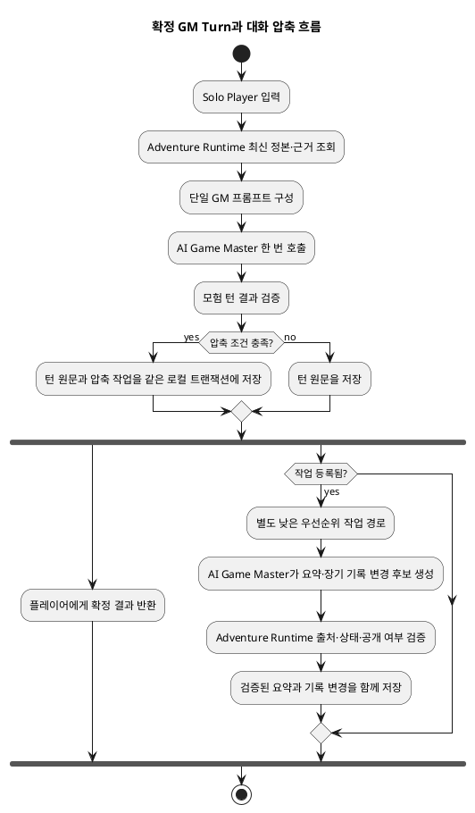
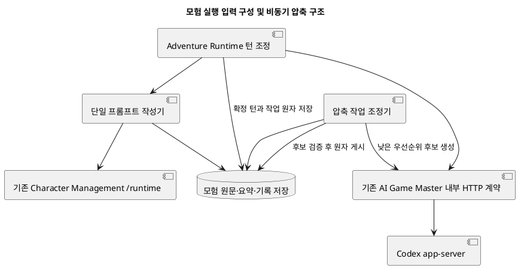
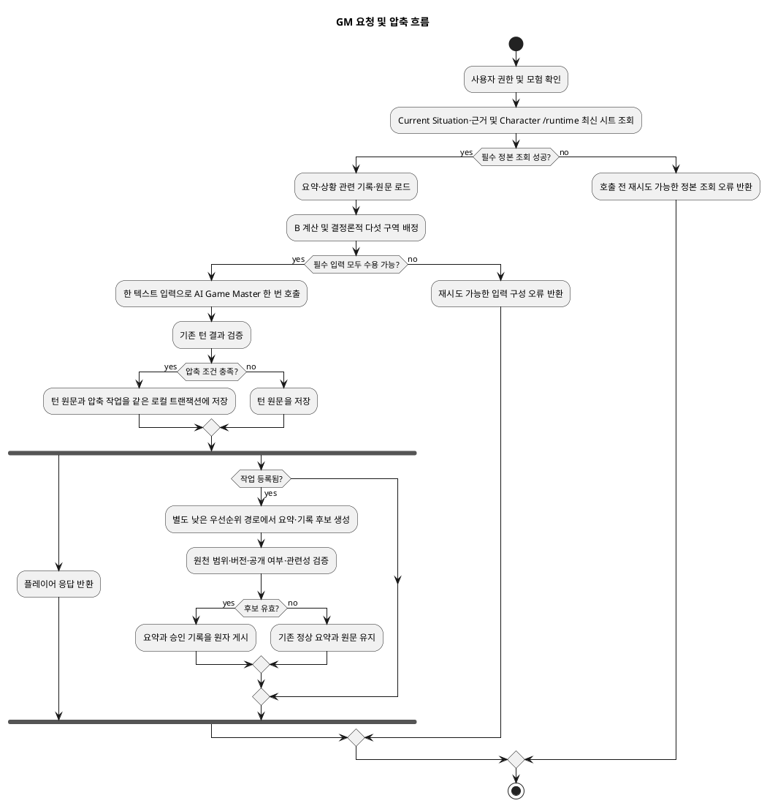

# Architecture Spec: GM Context Compaction

# 1. Design Scope

## 1.1 Target

| 항목 | 대상 |
|---|---|
| Product Spec | [product-spec.md](product-spec.md) |
| Use Cases | UC-01 단일 프롬프트 구성, UC-02 확정 턴 후 대화 압축, UC-03 요약 재압축·관련 기록 선택, UC-04 압축 실패 복구 |
| Domain | 확정 턴 대화 원문, 대화 요약, 현재 상황 관련 장기 기록, 단일 프롬프트 구역 구성 |
| Bounded Contexts | Adventure Runtime, AI Game Master, Character Management |
| Existing Services | `adventure-service`, `ai-game-master-service`, `character-management-service` |
| External Dependencies | Codex app-server, 모델 제공자, 내부 HTTP 계약 |
| Affected Data | 모험별 전체 대화 원문, 확정 턴 범위·버전이 있는 요약, 현재 상황 관련 장기 기록과 출처·공개 여부 |

## 1.2 Product Spec Mapping

| Product Spec 항목 | Architecture 요소 |
|---|---|
| UC-01, BR-01~05 | Adventure Runtime 프롬프트 작성기가 다섯 구역을 한 텍스트 입력으로 정렬하고 예산을 배정한다. |
| UC-02, BR-06~11 | 확정 턴 저장 뒤 같은 모험의 비동기 작업이 오래된 원문을 요약하고 장기 기록 변경 후보를 만든다. 검증된 결과는 다음 요청부터 적용한다. |
| UC-03, BR-12 | 요약은 순서와 대화 범위·버전으로 보존한다. 가득 차면 오래된 요약을 재압축하고, 남은 한도에는 관련 기록을 선택한다. |
| UC-04, BR-13~15 | 압축 실패는 플레이어 응답을 지연하지 않는다. 유효 요약과 원문을 보존하고 재시도한다. 입력 한도 내 필수 자료를 예산 안에 배정할 수 없으면 호출 전에 재시도 가능한 입력 한도 오류를 반환한다. |
| AC-09 | 제공자 캐시 입력 사용량과 배경 작업을 포함한 전체 입력 비용을 같은 긴 모험에서 비교한다. 제공자 측정값이 없으면 결과는 판단 불가다. |

---

# 2. Domain Flow

## 2.1 Event Storming Flow

## 2.2 Commands

| Command | Actor | Target | Input | Preconditions | Result |
|---|---|---|---|---|---|
| GM 요청 처리 | Solo Player 또는 세션 초기화 흐름 | Adventure Runtime | 모험 ID, 플레이어 입력 또는 시작 장면 요청 | 사용자 소유권 확인, 최신 정본 조회 가능 | 확정 GM Turn 결과와 원문 저장 |
| 대화 압축 등록 | Adventure Runtime | Adventure Runtime 내부 작업 저장소 | 확정 턴, 원문 범위, 요약 버전, 멱등성 키 | 확정 턴 저장 트랜잭션 내부 | 내구성 있는 비동기 작업 |
| 압축 후보 생성 | 작업자 | AI Game Master | 제한된 원문 범위, 기존 요약, 관련 기록, 현재 확정 상태 버전 | 작업 임대 획득 | 요약 및 장기 기록 변경 후보 |
| 압축 결과 게시 | 작업자 | Adventure Runtime | 후보, 원문 범위, 원천 상태 버전 | 출처 범위와 최신 상태 검증 통과 | 요약 및 허용된 기록 변경 원자 저장 |

## 2.3 Domain Events

| Domain Event | Producer | Trigger | Payload | Consumers |
|---|---|---|---|---|
| GM Turn 확정 | Adventure Runtime | 기존 턴 처리 결과가 확정됨 | 턴 ID, 순서, 대화 범위, 사실 버전 | 응답 반환 흐름, 압축 작업 등록 흐름 |
| 대화 압축 작업 등록 | Adventure Runtime | 압축 조건 충족 | 모험 ID, 원천 턴·순서, 작업 키 | 내부 작업자 |
| 대화 요약 게시 | Adventure Runtime | 후보 검증 및 저장 성공 | 요약 버전, 포함 대화 순서 범위 | 이후 GM 요청 |
| 상황 관련 기록 변경 | Adventure Runtime | 후보가 확인된 사실·공개 여부·관련성 검증 통과 | 기록 ID·버전·출처 확정 턴 | 이후 GM 요청 |

## 2.4 Policies

| Policy | Trigger Event | Decision | Emitted Command | Owner |
|---|---|---|---|---|
| 압축 작업 등록 정책 | GM Turn 확정 | 원문이 최근 두 개의 완결 GM Turn 범위를 벗어나거나, 확정된 상황·사건·관계·목표·위협이 바뀌었으면 등록 | 대화 압축 등록 | Adventure Runtime |
| 후보 게시 정책 | 압축 후보 생성 완료 | 턴 확정 여부, 원문 범위, 최신 정본 상태 버전, 공개 여부, 관련성 확인. 단순 대화 기록 후보는 거부 | 압축 결과 게시 또는 후보 거부 | Adventure Runtime |
| 재시도 정책 | 작업 실패 | 제공자 일시 오류는 호출 시도별 최대 한 번 즉시 재시도 후 제한 횟수 지수 간격 재시도; 잘못된 후보는 자동 재시도하지 않음 | 작업 재예약 또는 수동 재처리 대기 | Adventure Runtime |

## 2.5 Read Models

| Read Model | Consumer | Source | Fields | Owner |
|---|---|---|---|---|
| GM 입력 자료 | GM 프롬프트 작성기 | 모험 원문·요약·장기 기록, Character Management, Current Situation·근거 | 순서가 지정된 다섯 구역과 최신 상태 | Adventure Runtime 조합, 각 정본 소유자 |
| 상황 관련 장기 기록 선택 | 프롬프트 작성기 | 모험별 검증 기록과 Current Situation | 사건·관계·목표·위협, 출처 턴·버전, 공개 여부 | Adventure Runtime |
| 압축 작업 상태 | 운영자 및 내부 작업자 | 내구성 작업 저장소 | 대기·임대·재시도·실패, 범위·시도 수 | Adventure Runtime |

## 2.6 External Interactions

| External System | Trigger | Input | Output | Failure |
|---|---|---|---|---|
| Character Management 내부 조회 계약 | GM 입력 구성 | 캐릭터 식별자와 권한 문맥 | 최신 캐릭터 시트 | 호출 전 입력 구성을 실패 처리; 오래된 시트 사용 금지 |
| AI Game Master / Codex app-server | GM 요청 또는 비동기 압축 작업 | 단일 텍스트 프롬프트 또는 압축 후보 생성 요청 | 응답 또는 구조화 후보 | 대화 응답 오류 또는 비동기 재시도; 기존 동기 호출 잠금과 배경 호출 분리 |
| 모델 제공자 사용량 측정 | 비용·캐시 비교 | 호출 단위 측정 정보 | 캐시 입력량·전체 입력 비용 | 측정값이 없으면 비교 결과 판단 불가 |

## 2.7 Hotspots

| Hotspot | Options | Decision |
|---|---|---|
| 입력 순서와 호출 수 | 여러 번 나누어 요청 / 한 번의 요청에 순서 구역 배치 | 한 번의 Codex 실행, 한 텍스트 입력, 정해진 다섯 구역 |
| 최근 원문과 한도 충돌 | 최근 대화 임의 자르기 / 완결 턴 경계 이동 | 최근 두 완결 GM Turn과 대기 굴림·선택을 우선. 한도 충돌 시 오래된 턴을 요약으로 이동하되 최근 한 턴과 대기 자료를 원문 보장 |
| 배경 작업 동기화 | 대화 응답 대기 / 응답 우선 | 플레이어 응답 후 별도 낮은 우선순위 실행 경로에서 작업 |
| 캐시 기대 | 순서 고정으로 개선 간주 / 측정 | 바이트 단위 동일 접두부만 잠재 대상. 제공자 사용량과 전체 작업 비용으로 확인 |

---

# 3. DDD Architecture

## 3.1 Bounded Contexts

| Bounded Context | Responsibility | Ubiquitous Language | Owned Model | Owned Data |
|---|---|---|---|---|
| Adventure Runtime | 모험 대화, 압축 작업, 최신 정본 조합, 후보 검증 및 결과 게시 | GM Turn, Current Situation, 대화 요약, 상황 관련 장기 기록 | 모험 대화 및 내부 압축 기능 | 전체 원문, 요약, 모험별 상황 관련 기록, 작업 상태 |
| AI Game Master | 턴 응답 및 압축 후보 생성 | 제한된 근거, 후보, 제안 | 후보 생성 계약 | 이 기능의 정본 데이터 없음 |
| Character Management | 캐릭터 시트와 HP·자원 등 정본 소유 | 캐릭터, 시트, 자원 | 캐릭터 상태 | 기존 캐릭터 데이터 |

Adventure Runtime의 기존 서사 상태에는 관계, 진행 중 이야기, 최근 사건, 런타임 추가 사실이 있다. 새 장기 기록은 이 정본 사실을 대체하지 않는다. 현재 상황에 맞춰 고른 사실을 출처와 함께 보여 주는 조회 투영이다.

## 3.1.1 Boundary Decisions

| Capability | Owner Context | Candidate Boundary | Chosen Boundary | Why Not Weaker? | Why Not Stronger? |
|---|---|---|---|---|---|
| 대화 요약·상황 관련 장기 기록·압축 작업 | Adventure Runtime | 내부 기능 / 새 경계 / 별도 서비스 | 기존 Adventure Runtime 내부 기능 | 모험 턴 확정, 원문, Current Situation과 동일한 일관성 및 저장 소유가 필요하다. | 독립된 언어·정본·수명 주기가 없고 모험 흐름에 종속된다. 별도 모듈·서비스의 교차 일관성과 운영 비용이 불필요하다. |
| 압축 후보 생성 | AI Game Master | 내부 Runtime 기능 / AI Game Master 계약 | 기존 AI Game Master의 후보 생성 기능 | Adventure Runtime은 모델 실행 책임자가 아니므로 후보 생성 계약이 필요하다. | 후보에는 저장 권한이 없으며 독립 상태·배포 요구가 없다. 새 서비스는 호출과 장애 운영 비용만 늘린다. |
| 캐릭터 시트 전달 | Character Management | Adventure Runtime 복제 / 기존 내부 조회 계약 | 기존 캐릭터 내부 `/runtime` 조회 재사용 | 최신 시트는 캐릭터 관리 정본에서 직접 읽어야 한다. | 데이터 복제는 오래된 시트와 사실 충돌을 만든다. 새 경계가 필요하지 않다. |

## 3.2 Context Map

| Upstream | Downstream | Relationship | Contract | Translation |
|---|---|---|---|---|
| Character Management | Adventure Runtime | 공급자 / 소비자 | 기존 내부 `/runtime` 시트 조회 | 기존 어댑터 및 입력 조합 |
| AI Game Master | Adventure Runtime | 후보 생성 공급자 / 검증 소비자 | 기존 내부 HTTP 계약의 추가 후보 생성 계약 | Adventure Runtime이 출처·버전·가시성을 검증 |
| Adventure Runtime | AI Game Master | 입력 근거 공급자 / 응답 소비자 | 기존 내부 HTTP 계약에 구성 프롬프트 입력 전달 | 고정 구역 렌더링 |
| Codex app-server | AI Game Master | 외부 실행 기반 | 기존 app-server 클라이언트 | 입력과 응답 변환 |

## 3.3 Aggregates

| Aggregate | Root | Responsibility | Commands | Events | Invariants |
|---|---|---|---|---|---|
| Adventure (기존) | 모험 정본 | 턴, 전체 원문과 압축 데이터 변경 경계 | 턴 확정, 압축 등록·게시 | GM Turn 확정, 요약 게시 | 요약은 확정 원문 범위로만 생성; 전체 원문 삭제 금지; 요약은 다음 호출부터 유효 |
| 압축 작업 (Adventure 내부 내구성 작업) | 작업 ID | 재시도 가능한 단일 모험 압축 작업 | 등록, 임대, 완료, 실패, 재시도 | 작업 등록·완료·실패 | 멱등성, 모험별 동시 작업 임대, 낡은 후보 게시 차단 |

## 3.4 Entities

| Entity | Aggregate | Identity | Responsibility | State |
|---|---|---|---|---|
| 대화 요약 | Adventure | 모험 ID + 요약 버전 | 대화 순서 범위와 생성 버전 기록 | 요약 본문, 포함 범위, 버전, 출처 확정 턴 |
| 상황 관련 장기 기록 | Adventure | 모험 ID + 기록 ID | 확인된 사건·관계·목표·위협을 출처와 공개 여부에 연결 | 사실 표현, 원천 사실/상태 버전, 공개 여부, 관련성, 수정 버전 |
| 압축 작업 | 작업 | 모험 ID + 작업 키 | 비동기 생성과 검증 조정 | 원천 범위, 임대, 시도 수, 상태, 오류 분류 |

## 3.4.1 Class Diagram

클래스와 책임은 기존 모험 기능에 추가되는 내부 데이터와 경계 기준이다. 기록은 정본 사실을 복사해 소유하지 않고 출처를 참조한다.

[Adventure Runtime 입력 구성 클래스 관계](diagrams/architecture/adventure-runtime-context.class.svg)

## 3.5 Value Objects

| Value Object | Aggregate | Values | Validation | Behavior |
|---|---|---|---|---|
| 대화 순서 범위 | Adventure | 시작·끝 대화 순서 | 확정 턴과 저장 원문 범위 안인지 확인 | 겹침·누락 검증 |
| 입력 예산 | 프롬프트 구성 | 설정된 모델 입력 한도, 응답 예약, 구역별 상한 | 양수 한도, 상한 합계와 최소 보장 일치 | 구역별 결정론적 배정 |
| 출처 참조 | 상황 관련 기록 | 확정 턴, 정본 사실/상태 버전, 공개 여부 | 모두 실제 정본과 대조 | 게시 승인에 필요한 근거 제공 |
| 작업 멱등성 키 | 압축 작업 | 모험 ID, 원천 확정 턴, 포함 순서 범위 | 동일 입력에서 재현 가능 | 중복 등록 방지 |

## 3.6 Domain Services

| Domain Service | Responsibility | Input | Output | Collaborators |
|---|---|---|---|---|
| 단일 프롬프트 작성기 | 다섯 구역 정렬과 입력 한도 배정 | 최신 상태·근거·원문·요약·기록 | 한 번의 AI 요청용 텍스트 입력 | Adventure Runtime, Character Management |
| 압축 결과 검증기 | 후보 범위·확정성·최신 상태·가시성·관련성 확인 | 압축 후보와 원천 버전 | 승인 또는 거부된 변경 | 모험 정본, AI 후보 계약 |
| 작업 조정기 | 작업 등록·임대·재시도·원자 게시 | 확정 턴 및 작업 상태 | 일관된 요약·허용 기록 변경 | Adventure 저장소, 작업 저장소, AI Game Master |

## 3.7 Business Rule Ownership

| Business Rule | Owner | Enforcement Point |
|---|---|---|
| 플레이어 AI 요청은 한 번의 텍스트 입력이며 다섯 구역 순서를 지킨다 | Adventure Runtime | 입력 작성기와 AI 호출 계약 |
| 모델 전체 컨텍스트 한도 C의 20%를 응답용으로 예약하고 입력 한도 B = 0.8C로 계산한다 | Adventure Runtime 설정 | 입력 예산 배정기 |
| 각 구역 상한은 가용 입력 B의 고정 30%, 장기 기록 10%, 요약 15%, 최근 원문 20%이며 남은 공간은 최신 근거, 다음 최근 원문 순으로 배정하되 각 구역 상한을 넘기지 않는다 | Adventure Runtime | 입력 예산 배정기 |
| 최신 정본·근거·행동은 전체 B의 최소 25%를 보장한다. 필수 자료는 자르지 않으며 불가능하면 요청을 재시도 가능한 오류로 끝낸다 | Adventure Runtime | 입력 구성 검증기 |
| 고정 지침·잠긴 자료는 B의 30% 안에 필수 항목 전체가 들어야 한다. 선택 구역은 비었으면 0을 쓰되 관련 항목이 있으면 최소 하나를 넣는다 | Adventure Runtime | 입력 구성 검증기 |
| 최근 원문은 최근 두 완결 GM Turn과 대기 굴림·선택이다. 한도 충돌 시 오래된 완결 턴부터 요약으로 옮기고 적어도 최신 한 턴 및 대기 자료를 원문 보장한다 | Adventure Runtime | 입력 작성기 |
| 최신 한 완결 턴과 대기 자료조차 보장할 수 없으면 AI 호출 전에 재시도 가능한 입력 한도 오류를 반환한다 | Adventure Runtime | 입력 구성 검증기 |
| 대화 요약은 확정 턴 이후 오래된 원문만 대상으로 하며 다음 요청부터 쓴다 | Adventure Runtime | 작업 등록 및 게시 검증 |
| 요약과 장기 기록은 HP·자원·위치·전투 상태 및 캐릭터 시트를 정본화하지 않는다 | 해당 정본 소유자; 검사 책임 Adventure Runtime | 입력 조회와 후보 검증 |
| 장기 기록 변경은 확정 사건·관계·목표·위협 변경에 한정하고 단순 대화 후보를 거부한다 | Adventure Runtime | 후보 검증기 |
| 새 요약과 승인된 기록 변경은 한 번에 원자 게시한다 | Adventure Runtime | 모험 저장 트랜잭션 |
| 사실 정확성이 재사용 성능보다 우선한다 | Adventure Runtime | 후보 검증 및 배포 기준 |

**결정론적 입력 배정.** 설정된 모델 전체 컨텍스트 한도를 `C`라 하고 그 20%를 응답용으로 예약해 입력 한도 `B = 0.8C`로 둔다. 필수 고정 지침·잠긴 자료는 B의 30%를 넘으면 안 된다. 현재 상황 관련 장기 기록은 10%, 누적 요약은 15%, 최근 원문은 20%를 넘지 않는다. 최신 캐릭터 시트·Current Situation·현재 근거·행동에는 B의 최대 100%와 최소 25%를 두며 실제 필수 자료 전체를 잘라 넣지 않는다. 우선 각 항목의 상한을 적용하고, 비어 있거나 남는 공간은 최신 근거·정본·행동에 먼저, 최근 원문에 다음으로 배정하되 각 구역 상한을 넘기지 않는다. 관련 장기 기록 또는 요약이 있을 때 각각 적어도 하나의 관련 항목을 선택한다. 최근 원문의 통상 목표는 두 완결 턴과 대기 자료이며, 한도 부족 시 오래된 턴을 요약 범위로 옮겨도 최신 한 턴과 대기 자료는 원문으로 남긴다. 최소 보장과 필수 내용이 동시에 성립하지 않으면 입력을 임의 절단하지 않고 AI 호출 전에 재시도 가능한 입력 한도 오류를 반환한다. 토큰 추정은 모델별 설정 한도와 보수적 토크나이저/제공자 계측을 사용하며 문자 수를 4로 나누는 방식을 정확한 토큰 수라고 간주하지 않는다.

## 3.8 Aggregate State Transitions

| Current State | Command / Event | Next State | Owner | Preconditions | Emitted Event |
|---|---|---|---|---|---|
| 작업 없음 | 턴 확정과 압축 조건 충족 | 등록됨 | Adventure | 턴 확정 트랜잭션 | 작업 등록 |
| 등록됨 | 작업자 임대 | 실행 중 | Adventure | 같은 모험의 유효 임대 없음 | 없음 |
| 실행 중 | 유효 후보 검증·원자 저장 | 완료 | Adventure | 원천 범위·버전·공개 여부 최신 | 요약 게시, 승인 기록 변경 |
| 실행 중 | 일시 오류 | 재시도 대기 | Adventure | 시도 한도 미초과 | 없음 |
| 실행 중 | 후보 무효 또는 시도 한도 소진 | 실패 대기/수동 재처리 가능 | Adventure | 후보 검증 실패 또는 재시도 소진 | 작업 실패 |

## 3.8.1 State Diagram

비동기 압축 작업의 임대, 재시도, 검증 게시 전이는 다음과 같다.

[대화 압축 작업 상태 전이](diagrams/architecture/async-conversation-compaction.state.svg)

## 3.9 Repository Boundaries

| Repository | Aggregate | Operations | Consistency Boundary |
|---|---|---|---|
| 기존 Adventure Repository 확장 | Adventure | 원문·요약·장기 기록 조회, 턴 범위 조건부 저장 | 턴 확정 데이터와 작업 등록은 하나의 Adventure 로컬 트랜잭션 |
| Adventure 압축 작업 저장소 | 압축 작업 | 멱등 등록, 모험별 임대, 시도·오류 상태 갱신, 완료 | 작업 레코드와 해당 모험의 버전 검사 |
| 기존 Character Management API 어댑터 | 캐릭터 정본 | 기존 `/runtime` 최신 시트 읽기 | 원격 읽기. 실패 시 요청 입력 생성 중단 |

---

# 4. Program Design

## 4.1 Program Structure

## 4.2 Major Components and Responsibilities

| Component | Responsibility | Input | Output | Dependencies | Must Not Do |
|---|---|---|---|---|---|
| `RuntimeTurnApplicationService` | 기존 턴 흐름에서 입력 자료를 모으고 플레이 결과 확정 | 플레이어 행동, 모험 | 플레이 응답, 정본 변경 | 모험 저장소, GM 포트 | 요약을 정본 상태로 쓰지 않음 |
| `GmContextEnvelope` 및 입력 작성기 | 고정 순서 구역, 범위, 입력 한도 적용 | 원문·요약·상태·근거 | 단일 텍스트 입력 | Runtime read ports | 여러 순차 프롬프트 구성 금지 |
| 압축 작업 조정기 | 턴 후 작업 내구 등록, 실행 임대, 검증·게시 | 확정 턴 작업 키 | 요약/기록 버전 또는 재시도 상태 | 작업 저장소, AI 후보 포트 | 대화 응답을 기다리게 하지 않음 |
| `HttpTypedRuntimeGmAgentPort` 확장 | 내부 AI Game Master 계약 호출 | 단일 GM 요청 또는 압축 후보 요청 | 응답·후보 | 내부 HTTP 인증 | AI 후보를 직접 정본에 쓰지 않음 |
| `TypedAgentContractController` 확장 | 후보 생성 요청을 검증해 AI Game Master에 위임 | 버전형 계약 | 구조화 후보 | 후보 생성기, AI 계약 | 기존 규칙과 runtime 입력 의미를 바꾸지 않음 |
| Character `/runtime` 어댑터 | 최신 캐릭터 시트 읽기 | 캐릭터 ID와 내부 인증 | 최신 시트 | Character Management | 시트 복사·오래된 캐시 사용 금지 |
| Codex app-server 호출기 | 한 요청의 텍스트 입력으로 AI 호출 | 렌더링된 텍스트 | AI 출력 | app-server | 동기 공유 잠금을 배경 작업과 공유하지 않음 |

## 4.3 Application Flow

## 4.4 Component Call Contracts

| Order | Caller | Callee | Contract | Sync/Async | Error Propagation |
|---|---|---|---|---|---|
| 1 | Turn service | Character Management `/runtime` | 기존 내부 캐릭터 시트 조회 계약 | 동기 | 실패는 AI 호출 전 재시도 가능한 요청 오류; 오래된 시트 대체 금지 |
| 2 | Turn service | Adventure 저장소 | 정본 상황·근거·원문·요약·기록 조회 | 동기 | 필수 자료 누락은 입력 구성 실패 |
| 3 | Turn service | 입력 작성기 | 정본과 예산으로 다섯 구역 작성 | 동기 | 필수 구역·보장량 불가 시 AI 호출 전 오류 |
| 4 | Runtime AI 어댑터 | AI Game Master | 기존 내부 HTTP 계약에 단일 텍스트 입력 전달 | 동기 | 기존 턴 오류 규칙 적용 |
| 5 | Turn commit | Adventure 저장소/작업 저장소 | 턴 원문, 작업 등록, 키와 범위 저장 | 동기 단일 로컬 트랜잭션 | 확정 결과와 내구 작업 등록의 원자성 보장 |
| 6 | 작업자 | AI Game Master | 원문 구간과 버전 조건이 포함된 요약·기록 후보 요청 | 비동기 | 기존 정상 데이터 유지; 일시 오류 내구 재시도 |
| 7 | 작업자 | Adventure 저장소 | 현재 원천 버전 재검증 후 후보 원자 게시 | 동기 | 버전 조건부 저장 실패 시 후보 거부/재기반; 이전 기록 유지 |

## 4.5 Major Types

| Type | Kind | Purpose | Key Fields / Operations |
|---|---|---|---|
| 대화 순서 범위 | 값 객체 | 대화 순서 기반 요약 범위 식별 | 시작 순서, 끝 순서, 출처 턴 |
| 대화 요약 버전 | 값 객체 | 요약 버전과 생성 원천 보존 | 버전, 원천 범위, 본문 |
| 상황 관련 장기 기록 | 모험 내부 기록 | 확인 사실을 정본 출처에 연결 | 종류, 내용, 출처 확정 턴/상태 버전, 공개 여부, 버전 |
| 압축 작업 | 내구 작업 | 압축을 모험별로 중복 없이 재시도 | 작업 키, 범위, 임대, 시도 수, 상태 |
| 입력 예산 | 값 객체 | 모델 입력·응답 한도와 구역 상한 표현 | 전체 컨텍스트 한도 C, 응답 예약, 입력 한도 B, 구역 배정 |
| 압축 후보 계약 | 내부 HTTP 계약 추가분 | AI 생성 결과를 제안 형태로 전달 | 원문 범위, 요약 후보, 사실 변경 후보, 기준 상태 버전 |

## 4.6 Type Design

### 대화 요약 및 상황 관련 장기 기록

| 항목 | 정의 |
|---|---|
| Kind | Adventure Runtime 내부 도메인 자료 |
| Responsibility | 요약은 원문 범위를 보존하고, 상황 관련 기록은 확정 사실을 출처와 연결 |
| Dependencies | 확정 턴, 순서 범위, 정본 버전, 공개 여부 |
| Must Not Depend On | 캐릭터 시트 및 Current Situation 정본의 소유권 |

#### State

| Field | Type | Meaning | Constraint |
|---|---|---|---|
| version | 증가 버전 | 변경 식별 | 모험 내 단조 증가 |
| 원문 범위 | 대화 순서 범위 | 요약 대상 | 확정 원문 범위 안 |
| 출처 확정 턴 | 확정 턴 참조 | 후보 근거 | 실제 확정 턴 |
| 공개 여부 | 공개 구분 | 노출 범위 | 응답 공개 검증 유지 |

#### Behavior

| Method | Input | Output | Responsibility | State Change |
|---|---|---|---|---|
| 후보를 검증하고 게시 | 후보, 최신 버전 | 승인/거부 | 출처·범위·가시성 검증 | 승인된 버전만 추가 |

#### Invariants

| Invariant | Enforcement Point |
|---|---|
| 전체 원문과 이전 버전을 보존 | 저장소 게시 경계 |
| 후보는 출처와 정본 버전을 가져야 함 | 후보 검증기 |

## 4.7 Interfaces and Function Signatures

| 동작 계약 | 입력 | 출력 | 책임 |
|---|---|---|---|
| 단일 GM 입력 구성 | 모험, 플레이어 입력, 이번 턴 근거, 전체 컨텍스트 한도 C | 구성된 한 텍스트 입력 또는 사전 입력 한도 오류 | B=0.8C와 다섯 구역 배정 적용 |
| 압축 작업 등록 | 확정 턴, 포함 대화 순서 범위, 멱등성 키 | 기존 또는 신규 내구 작업 | 확정 턴과 같은 같은 모험 로컬 트랜잭션에서 등록 |
| 압축 후보 생성 | 원문 범위, 기존 요약, 선택 기록, 정본 기준 버전, 공개 범위 | 저장 권한이 없는 후보 | AI Game Master가 제안만 생성 |
| 후보 검증 및 게시 | 후보, 최신 권위 버전 | 게시 결과 또는 거부 사유 | Adventure Runtime이 검증 후 원자 게시 |

### 압축 후보 생성 계약

| 항목 | 정의 |
|---|---|
| Responsibility | 지정된 원문 범위의 요약·기록 변경 후보 생성 |
| Caller | Adventure Runtime 작업자 |
| Implementer | AI Game Master |
| Input | 원문 범위, 선택 기록, 정본 기준 버전, 공개 범위 |
| Output | 저장 권한 없는 후보 |
| Preconditions | 출처 턴 확정 |
| Postconditions | 제안만 반환 |
| Errors | 일시 제공자 오류 또는 형식 오류 |
| Side Effects | 모델 실행 비용 |
| Idempotency | 작업 ID와 시도 번호 |

## 4.8 Error Propagation

| Failure Point | Source Error | Converted Error | Handler | Result |
|---|---|---|---|---|
| 캐릭터 조회 | 내부 HTTP 오류 | 준비 오류 | 턴 서비스 | AI 호출 전 재시도 가능 오류 |
| 입력 작성 | 필수 자료 한도 초과 | 입력 한도 오류 | 턴 서비스 | 요청을 재시도 가능 상태로 종료 |
| 배경 생성 | 일시 제공자 오류 | 작업 오류 | 작업 조정기 | 내구 재시도, 정상 자료 유지 |
| 후보 게시 | 출처·버전 불일치 | 무효 후보 | 작업 조정기 | 자동 재시도 없이 보류 |

## 4.9 State Transition Implementation

| State Transition | Domain Owner | Method | Persistence Point | Published Event |
|---|---|---|---|---|
| 없음 → 등록됨 | Adventure | 턴 확정 중 등록 | 동일 로컬 트랜잭션 | 작업 등록 |
| 등록됨 → 실행 중 | Adventure | 모험별 임대 | 작업 저장소 | 없음 |
| 실행 중 → 완료 | Adventure | 버전 검증·게시 | 원자 저장 | 요약 게시 |
| 실행 중 → 재시도/실패 | Adventure | 오류 분류 | 작업 상태 저장 | 실패 상태 |

## 4.10 Dependency Rules

- Adventure Runtime이 원문, 요약, 상황 관련 기록 및 게시 권한을 소유한다.
- AI Game Master는 텍스트 응답과 압축 후보만 만든다. 저장이나 확정 권한은 없다.
- Character Management가 캐릭터 시트 정본이다. Adventure Runtime은 매 요청에 기존 `/runtime` 조회를 사용한다.
- 요약과 장기 기록은 캐릭터, 장소, 전투 정본을 소유하거나 수정하지 않는다.
- 배경 압축 실행은 기존 동기 AI 호출기의 공유 잠금을 점유하지 않도록 별도의 낮은 우선순위 실행 경로/프로세스 설정을 쓴다. 새 배포 서비스 경계는 만들지 않는다.
- 외부 제공자 호출과 내부 HTTP 형식은 AI Game Master 어댑터 뒤에 둔다.

---

# 5. Technical Architecture

## 5.1 Boundary Mapping

Bounded Context, 내부 기능, 코드 경계, 배포 단위를 일대일로 나누지 않으며 아래 표에서 가장 약한 충분 경계를 지정한다.

| Bounded Context | Internal Capability | Code Boundary | Deployment Unit | Boundary Rationale |
|---|---|---|---|---|
| Adventure Runtime | 대화 압축·기록·작업 | 기존 서비스 내부 기능 | 기존 Adventure 서비스 | 모험 턴과 원문 저장의 일관성 필요 |
| AI Game Master | 후보 생성 | 기존 서비스 기능 | 기존 AI Game Master 서비스 | 후보 생성 역할만 수행 |
| Character Management | 최신 시트 조회 | 기존 계약 | 기존 캐릭터 서비스 | 캐릭터 정본 유지 |
| Adventure Runtime | 압축 작업 실행 | 기존 Adventure 서비스 내부의 낮은 우선순위 실행 설정 | 기존 Adventure 서비스 | 동기화 잠금이 플레이 요청을 막지 않게 하며 독립 배포 단위는 불필요 |

## 5.2 Boundary Promotion Decisions

3.1.1의 경계 결정 표에 기록했다. 더 강한 경계는 독립 정본·수명 주기·배포 요구가 없어 채택하지 않는다.

## 5.3 System Interaction Flow

4.1의 구조와 4.3의 요청 흐름이 시스템 간 상호작용을 정의한다.

## 5.4 Synchronous Communication

| Caller | Provider | Protocol | Operation | Request | Response | Timeout |
|---|---|---|---|---|---|---|
| Adventure Runtime | Character Management | 내부 HTTP | `/runtime` 최신 시트 조회 | 캐릭터 ID | 최신 시트 | 기존 설정 |
| Adventure Runtime | AI Game Master | 내부 HTTP | GM 단일 입력 | 텍스트 입력 | GM 결과 | 기존 설정 |

## 5.5 API Contracts

| Contract | Direction | Schema change | Compatibility |
|---|---|---|---|
| 기존 GM runtime 입력 | Adventure Runtime → AI Game Master | 단일 텍스트 입력에 다섯 구역 렌더링 | 기존 내부 HTTP 경로를 유지하며 입력 의미를 추가 |
| 압축 후보 생성 | Adventure Runtime → AI Game Master | 원문 순서 범위, 기존 요약/선택 기록, 정본 기준 버전, 공개 범위, 구조화 후보 출력 추가 | 내부 계약에 추가 동작, 기존 턴 경로 유지 |
| 캐릭터 `/runtime` 읽기 | Adventure Runtime → Character Management | 변경 없음 | 기존 계약 재사용 |
| 내구성 작업 등록 | Adventure Runtime 내부 | 모험 ID, 출처 턴, 순서 범위 기반 키와 작업 상태 | 저장소 내부 변경, 플레이 계약 변경 없음 |

압축 후보 생성 요청은 내부 서비스 토큰으로 인증한다. 모험 소유권은 Adventure Runtime의 기존 인가 규칙으로 확인한다. 후보에는 사실 변경의 출처 확정 턴, 권위 있는 사실/상태 버전과 공개 구분을 포함한다. Adventure Runtime이 연결을 확인할 수 없는 후보는 게시하지 않는다.

## 5.6 Asynchronous Communication

| Producer | Consumer | Channel | Message | Delivery | Ordering |
|---|---|---|---|---|---|
| Adventure Runtime 턴 커밋 | Adventure 내부 작업자 | 내구 작업 저장소 | 압축 작업 | 적어도 한 번 재전달 가능 | 모험별 확정 순서 |

## 5.7 Message Contracts

작업 메시지는 작업 ID, 모험 ID, 원천 확정 턴, 포함 순서 범위, 멱등성 키, 기준 정본 버전을 가진다. 중복은 같은 작업으로 합치고 실패는 제한 재시도 뒤 실패 보관한다.

## 5.8 Data Ownership

| Data | Owner | Storage | Key / Schema | Readers | Writers |
|---|---|---|---|---|---|
| 전체 대화 원문 | Adventure Runtime | 기존 Adventure 저장소 | 모험 ID와 대화 순서 | 입력 작성기, 압축 작업자 | 턴 처리기 |
| 대화 요약과 활성 버전 연결 | Adventure Runtime | 기존 Adventure 저장소 | 모험 ID, 버전, 원천 범위, 대체한 활성 버전 | 입력 작성기, 압축 작업자 | 검증된 게시기 |
| 상황 관련 장기 기록 | Adventure Runtime 조회 투영 | 기존 Adventure 저장소 | 모험 ID, 기록 버전, 출처와 공개 여부 | 입력 작성기 | 검증된 게시기 |
| 캐릭터 시트 | Character Management | 기존 캐릭터 저장소 | 기존 캐릭터 식별자 | 기존 `/runtime` 소비자 | Character Management |

## 5.9 Schema Changes

| Target | Action | Schema Change | Migration | Compatibility |
|---|---|---|---|---|
| Adventure 대화 요약 저장 | Add | 원천 범위, 확정 턴, 버전, 활성/대체 관계 | 기존 자료 보존 후 신규 필드 추가 | 기존 대화 원문 읽기 유지 |
| Adventure 상황 기록 저장 | Add | 사실 종류, 출처 버전, 공개 여부, 기록 버전 | 기존 정본 사실을 복제하지 않음 | 기존 NarrativeState 유지 |
| Adventure 압축 작업 저장 | Add | 작업 키, 범위, 작업 임대, 시도·오류 상태 | 기존 Adventure 저장소에 호환 가능한 추가 변경 | 기존 턴 계약 영향 없음 |

## 5.10 Consistency Model

턴 원문과 작업 등록, 후보 요약과 승인 기록 게시 각각은 Adventure 로컬 트랜잭션이다. 제공자 후보 생성은 비동기 최종 일관 단계이며 게시 시 버전 조건을 재검증한다.

## 5.11 Infrastructure Dependencies

| Dependency | Responsibility | Accessed By | Isolation Boundary |
|---|---|---|---|
| Adventure 관계형 저장소 | 원문·요약·상황 기록·내구 작업과 원자 저장 | Adventure Runtime | 기존 저장 어댑터 |
| 내부 HTTP와 서비스 토큰 | AI Game Master 및 Character Management 연결 | 내부 어댑터 | 기존 HTTP 어댑터 |
| Codex app-server 및 모델 | 플레이 응답과 비동기 후보 생성 | AI Game Master | 기존 Codex 클라이언트 |
| 제공자 사용량 정보 | 캐시 효과·전체 입력 비용 측정 | 관측 기능 | 사용량 어댑터 |

## 5.12 External Dependency Isolation

Codex app-server 의존은 기존 `CodexAppServerClient` 뒤에 유지한다. 배경 작업은 공유 동기화 클라이언트를 점유하지 않는 낮은 우선순위 실행 경로로 호출한다. 제공자가 보고한 캐시 입력량과 전체 입력량을 측정하며 문자 수/4를 정확한 토큰 수로 사용하지 않는다. 같은 긴 모험과 입력 자료로 비교하고 배경 압축 호출 비용도 합산한다. 제공자 사용량이 없으면 캐시 개선 판정은 판단 불가다.

## 5.13 File and Module Structure

### Existing Structure

`adventure-service` runtime/application, integration, persistence; `ai-game-master-service` 계약 API와 Codex 실행기; `character-management-service` 시트 API.

### Target Structure

동일한 기존 서비스 경계 안에서 입력 작성기, 내구 작업자, 저장 계약, AI 후보 계약을 확장한다.

### File Change Map

현재 구조에 대한 구현 영향 범위는 다음 파일군이다. 실제 구현 시 기존 경계를 확장한다.

| Existing area | Current role | Change direction |
|---|---|---|
| `adventure/application/runtime/RuntimeTurnApplicationService.java` | GM Turn 조정 | 입력 조합 연결, 확정 턴 후 원자 작업 등록 |
| `adventure/application/runtime/GmContextEnvelope.java` | GM 입력 자료 운반 | 다섯 구역과 예산 정보 표현 확장 |
| `adventure/application/runtime/GmAgentRuntimePlanningAdapter.java` | GM 입력/출력 어댑터 | 렌더링된 단일 프롬프트 전달 |
| `adventure/infrastructure/integration/HttpTypedRuntimeGmAgentPort.java` | 내부 AI HTTP 연결 | 비동기 압축 후보 계약 추가 |
| `adventure/infrastructure/persistence/PostgresAdventureRepository.java` | 모험 저장 | 원문 범위, 요약/기록 버전, 조건부 원자 저장 추가 |
| `ai-game-master/api/TypedAgentContractController.java` | 타입 계약 요청 처리 | 압축 후보 생성 요청 검증 및 위임 추가 |
| `ai-game-master/infrastructure/ai/CodexAppServerClient.java` | Codex app-server 호출 | 대화 응답과 배경 작업의 실행 경로 격리, 제공자 사용량 수집 가능성 반영 |
| `character-management-service`의 `CharacterSheetController.java` | 기존 캐릭터 시트 HTTP 제공 | 기존 `/runtime` 읽기 사용, 계약 변경 최소화 |
| Adventure 저장소 마이그레이션 위치 | 기존 모험 저장 구조 갱신 | 요약·기록·작업 데이터 구조 미존재 | 모험 서비스의 기존 마이그레이션 위치에 범위·버전·출처·작업 상태 추가 |
| Adventure 내부 비동기 작업 위치 | 새 압축 작업 기능 없음 | 확정 턴 이후 요약 후보 조정 | 같은 서비스의 기존 작업 실행 기반 안에 모험별 임대·재시도 작업 추가 |
| Adventure 내부 캐릭터 읽기 어댑터 위치 | 현재 호출 경로는 최신 시트 조회 미보장 | 캐릭터 `/runtime` 호출 변환 | 기존 integration 경계에 최신 시트 조회 어댑터 추가 |
| Adventure 입력 구성 위치 | 현재 전체 대화 전달 | `GmContextEnvelope`와 Runtime 입력 구성 | 기존 runtime 경계에 입력 예산 배정 및 단일 프롬프트 작성 책임 추가 |
| AI Game Master 제공자 계측 위치 | 문자 수/4 추정, 캐시 사용량 미측정 | app-server 응답 사용량 수집 | 기존 Codex 클라이언트/관측 경계에 제공자 보고값 수집 추가 |

현재 코드와의 차이는 명시적으로 유지한다. `RuntimeTurnApplicationService`는 현재 `adventure.conversation` 전체를 전달한다. `characterSnapshots`는 식별자/제어 정보만 담고 최신 캐릭터 시트를 포함하지 않는다. `TypedAgentContractController`는 변경 가능한 검색 결과를 실행 문맥보다 앞에, 고정 규칙을 끝에 배치한다. Codex app-server는 텍스트 입력 하나를 보내지만 현재 사용량 기록은 문자 수/4 추정이며 제공자 캐시 토큰 사용량을 측정하지 않는다.

- 전체 대화 원문은 모험 저장소에 계속 보존한다. 압축은 원문 삭제나 덮어쓰기가 아니다.
- 요약에는 버전, 원천 대화 순서 범위, 출처 확정 턴을 저장한다. 새 범위는 순서에 따라 추가한다. 15% 요약 상한에 근접하면 가장 오래된 활성 요약을 재압축하되 원본 요약과 대화 원문은 유지하고 새 버전이 이전 활성 버전을 대체한다고 연결한다. 공간이 여전히 부족하면 현재 상황과 관련된 활성 요약만 선택하며 대체된 원본은 선택하지 않는다.
- 장기 기록은 모험별 독립 레코드이며 사건·관계·목표·위협 종류, 확정 턴, 정본 사실/상태 버전, 공개 여부를 참조한다. 정본 사실이 바뀌면 해당 버전에 종속된 후보를 게시하지 않는다.
- 현재 장기 기록은 조회 투영이다. NarrativeState의 관계·진행 중 이야기·최근 사건·런타임 사실 및 다른 소유자의 정본을 대체하지 않는다.
- 작업 키는 모험 ID + 원천 확정 턴 + 포함된 순서 범위로 멱등 등록한다. 작업 저장소/필드 추가는 기존 Adventure 서비스 스키마에 대한 추가 변경으로 수행한다.
- 저장된 요약이 어느 프롬프트에 사용됐는지 버전을 남겨 결과 비교를 가능하게 한다.

---

# 6. Runtime Design

## 6.1 Runtime Flow

4.3의 응용 흐름이 요청부터 비동기 작업 게시까지의 순서를 정의한다. 확정 턴의 원문과 압축 조건을 충족한 작업은 같은 로컬 트랜잭션으로 커밋한 뒤 플레이어 응답과 작업 실행이 갈라진다.

## 6.2 Concurrent Access

| Shared Resource | Concurrent Actors | Conflict |
|---|---|---|
| 같은 모험의 압축 작업 | 작업 재전달·동시 작업자 | 중복 처리와 낡은 후보 덮어쓰기 |
| Adventure 요약·상황 기록 | GM 턴 처리와 후보 게시 | 버전 충돌 및 부분 게시 |
| Codex app-server 호출 경로 | 대화 요청과 배경 작업 | 공유 동기화 호출로 인한 응답 지연 |

- GM Turn 확정 시 같은 Adventure 로컬 트랜잭션에 전체 새 원문과 조건을 충족한 압축 작업을 저장한다. 등록 실패로 확정 턴의 내구 작업이 유실되지 않게 한다.
- 압축 작업은 모험별 작업 임대로 한 번에 하나만 유효하게 실행한다. 재전달·중복 실행은 멱등성 키로 합친다.
- 작업은 확정 대화 순서 범위를 기준으로 수행한다. 게시 때 원문 범위, 확정 턴, 정본 상태 버전을 다시 확인한다.
- Compare-and-set/version 조건을 적용해 늦게 도착한 후보가 새 요약이나 장기 기록을 덮어쓰지 못하게 한다.
- 요약과 승인 기록 변경은 한 번의 모험 저장 커밋으로 게시한다. 요약만 새 버전이고 기록은 낡은 버전인 반쪽 상태를 노출하지 않는다.
- 응답은 확정 직후 반환한다. 압축 결과는 그 다음 입력 작성 이후부터 사용한다.
- 기존 `CodexAppServerClient`가 동기화된 공유 클라이언트이므로 대화 호출과 배경 생성은 별도 낮은 우선순위 실행 경로·프로세스 설정을 사용한다.

## 6.3 Concurrency Control

모험별 단일 작업 임대와 버전 조건부 저장을 동시 작업 제어로 사용한다. 작업 임대는 만료 후 다시 획득할 수 있다.

## 6.4 Ordering

| Operation | Ordering Scope | Ordering Key | Enforcement |
|---|---|---|---|
| 압축 작업 | 모험별 확정 순서 | 모험 ID와 대화 순서 범위 | 모험별 작업 임대와 게시 전 범위·버전 재검증 |
| 최근 대화 제공 | 한 GM 입력 안 | 확정 GM Turn 순서 | 최신 두 완결 턴과 대기 굴림·선택을 원문으로 정렬 |

압축 작업은 원문이 최근 두 개의 완결 GM Turn 밖으로 벗어났을 때 또는 확인된 상황·사건·관계·목표·위협이 바뀌었을 때만 시작한다. 단순 대화마다 장기 기록 후보를 만들거나 저장하지 않는다. 기본 최근 원문은 마지막 두 완결 GM Turn과 대기 중인 굴림·선택이다. 입력 상한 초과 시 오래된 턴부터 요약 범위로 이동하고 전체 원문은 저장 상태에 계속 남긴다. 최신 완결 턴과 대기 굴림·선택조차 원문으로 넣을 수 없으면 AI 호출 전에 재시도 가능한 입력 한도 오류를 반환한다.

대화 요약 공간이 차면 가장 오래된 활성 요약을 재압축하고 해당 원본 버전과 원문을 보존한다. 새 요약 버전에는 대체한 활성 버전의 식별자를 기록한다. 재압축 결과를 적용한 뒤에도 전체를 넣을 수 없다면 상황 관련 활성 요약만 조회한다. 기록 선택은 프롬프트 입력일 뿐 저장 자료를 삭제하거나 우선순위와 무관하게 사실을 변경하지 않는다.

## 6.5 Transaction Boundaries

- 기존 GM Turn 확정 트랜잭션: 대화 원문, 턴 순서/확정 사실 버전, 해당 작업의 내구 등록을 함께 커밋한다.
- 배경 후보 생성: 네트워크 호출은 데이터베이스 트랜잭션 밖에서 한다. 작업 임대는 만료 가능하며 실패 시 다시 획득한다.
- 후보 게시 트랜잭션: 범위와 버전 재검증, 새 요약 버전 저장, 승인된 장기 기록 변경, 작업 완료 상태를 원자 커밋한다.
- 외부 캐릭터 최신 시트 조회는 플레이어 AI 요청 전 수행하는 읽기이며 Adventure 저장소 트랜잭션에 포함하지 않는다.

## 6.6 Idempotency

| Operation | Idempotency key | Duplicate behavior |
|---|---|---|
| 압축 작업 등록 | 모험 ID + 출처 확정 턴 + 포함 순서 범위 | 동일 작업 반환; 새 작업을 추가하지 않음 |
| AI 후보 요청 | 압축 작업 ID + 작업 시도 번호 | 중복 후보 응답은 같은 원천 버전 검증으로 수렴 |
| 후보 게시 | 모험 ID + 작업 ID + 기대 요약/상태 버전 | 완료 레코드가 있으면 기존 게시 결과 반환; 버전 조건부 저장 실패면 낡은 후보 거부 |

## 6.7 Partial Failure

| Failure Situation | Persisted State | External State | Recovery |
|---|---|---|---|
| 턴 원문·작업 등록 트랜잭션 실패 | 둘 다 커밋되지 않음 | AI 요청 결과는 기존 턴 처리 경계에 따름 | 기존 모험 오류 처리 적용 |
| 응답 후 배경 후보 생성 실패 | 확정 턴 원문과 마지막 유효 요약 보존 | 제공자 요청 실패 | 내구 작업 재시도 또는 수동 재처리 |
| 후보 게시 버전 충돌 | 후보 미게시, 기존 요약·기록 유지 | 외부 호출은 이미 완료될 수 있음 | 낡은 후보 거부, 필요한 경우 새 범위 작업 |
| 필수 프롬프트 자료 초과 | 모험 정본 변경 없음 | AI 호출 없음 | 재시도 가능한 입력 한도 오류 반환 |

---

# 7. Error Handling and Recovery

## 7.1 Failure and Recovery Flow

4.8 오류 분류와 7.2 재시도 규칙을 적용한다.

## 7.2 Error Classification

| Error | Class | Response |
|---|---|---|
| Character `/runtime` 조회 실패 또는 필수 정본 누락 | 요청 준비 일시 실패 | AI 호출 전 재시도 가능한 오류. 오래된 캐릭터 시트를 쓰지 않음 |
| 필수 고정 자료 또는 최신 근거·행동·최근 원문 보장량을 B 안에 배정할 수 없음 | 입력 한도 오류 | 해당 GM 요청에 재시도 가능한 오류 반환; 필수 사실을 자르지 않음 |
| 압축 제공자 일시 장애 | 배경 일시 실패 | 시도마다 즉시 재시도 최대 1회, 이어서 제한된 횟수의 지수 간격 재시도 |
| 구조가 잘못되었거나 출처·공개 여부·관련성이 어긋난 후보 | 무효 후보 | 자동 재시도 없이 실패 대기; 기존 정상 요약·원문·기록 유지 |
| 압축 시도 횟수 소진 | 배경 최종 실패 | 실패 보관함에 두고 운영자 수동 재처리 허용 |
| 원천 버전이 게시 중 변경됨 | 오래된 후보 | 버전 조건부 저장으로 게시 거부; 현행 원문과 정상 요약 유지 후 필요 시 새 범위 작업 |
| 내구 작업 등록 실패 | 확정 경로 저장 실패 | 기존 Adventure 트랜잭션에서 함께 실패 처리; 이미 플레이어에게 확정 응답을 보낸 뒤 취소·보상 롤백은 하지 않음 |

## 7.3 Retry Policy

기존 ADR-017의 외부 호출 규칙을 적용해 제공자 호출 시도마다 즉시 재시도는 최대 한 번만 한다. 그 뒤에는 작업 저장소의 지수 간격과 제한된 시도 횟수로 다시 수행한다. 시도 한도를 다 쓰면 실패 보관함과 운영자 수동 재처리를 제공한다. 무효 후보는 재시도하지 않는다.

새 후보가 없거나 무효이면 마지막 유효 요약과 전체 원문을 유지한다. 다음 GM 요청은 이 자료가 필수 입력 한도에 들어갈 때 기존 상태로 계속 진행할 수 있다. 필수 구역을 모두 배치할 수 없으면 해당 요청만 재시도 가능한 오류로 응답한다. 이미 확정된 턴과 플레이어 응답을 되돌리는 보상 롤백은 하지 않는다(ADR-020).

## 7.4 Compensation

보상 트랜잭션은 없다. 압축은 확정 플레이 흐름 뒤의 선택적 작업이며 실패는 플레이 결과를 취소하지 않는다. 잘못 게시된 후보는 게시 전 검증과 버전 조건으로 차단한다. 이미 게시된 데이터의 정정은 원문과 이전 버전을 보존한 별도 관리 수정으로 처리한다.

## 7.5 Recovery

| Failure | Recovery Point | Recovery Input | Recovery Action |
|---|---|---|---|
| 배경 제공자 장애 | 마지막 유효 요약과 원문 | 내구 작업 범위와 시도 상태 | 제한된 지수 간격으로 재시도하고 소진 시 수동 재처리 |
| 무효 후보 | 후보 게시 전 | 저장된 원문과 마지막 유효 요약 | 후보를 게시하지 않고 기존 자료 유지 |
| 입력 한도 초과 | 해당 GM 요청 준비 단계 | 최신 정본과 구성된 입력 자료 | 필수 입력을 자르지 않고 재시도 가능한 오류 반환 |

## 7.6 Rollback

| Target | Rollback Strategy | Data Handling | Compatibility |
|---|---|---|---|
| 이미 확정된 GM Turn | 보상 롤백 없음 | 원문과 확정 결과를 유지 | ADR-020에 따름 |
| 게시 전 압축 후보 | 게시 취소 | 마지막 유효 요약, 장기 기록, 원문 유지 | 기존 요청 경로 영향 없음 |

---

# 8. Security

## 8.1 Authentication and Authorization

| Entry Point | Authentication | Authorization | Failure |
|---|---|---|---|
| Adventure Runtime 내부 요청 | 기존 내부 서비스 토큰 | 모험 소유권 확인 | 인증/인가 오류 반환 |
| AI Game Master 압축 후보 계약 | 기존 내부 서비스 토큰 | 요청 범위와 모험 소유권 확인 | 잘못된 요청 거부 |
| Character Management `/runtime` 조회 | 기존 내부 서비스 토큰 | 모험에 연결된 캐릭터 ID 확인 | AI 호출 전 재시도 가능 오류 |

## 8.2 Input Validation

| Input | Validation | Sanitization | Size Limit |
|---|---|---|---|
| AI 후보 요청 | 확정 턴, 대화 순서 범위, 현재 정본 버전, 공개 범위 대조 | 구조화 계약으로 전달 | 구성된 원문 범위만 전달 |
| 플레이어 입력과 근거 | 기존 턴 검증 및 입력 예산 검사 | 단일 프롬프트 구역별 렌더링 | B와 구역별 상한 적용; 필수 내용은 자르지 않음 |
| 압축 결과 | 범위·출처·최신 상태·관련성·공개 여부 검증 | 허용된 필드만 게시 | 저장 전 검증 |

## 8.3 Sensitive Data

| Data | Storage Protection | Transport Protection | Log Policy |
|---|---|---|---|
| 원문·프롬프트·캐릭터 시트·숨겨진 사실 | 기존 Adventure/Character 저장 경계 | 내부 서비스 토큰이 적용된 내부 연결 | 내용 기록 금지 |
| 압축 후보 | Adventure 저장소에 게시 전까지 미확정 | 기존 내부 HTTP 보호 | 본문 기록 금지, 작업 식별 정보만 기록 |
| 비용·사용량 측정치 | 기존 관측 저장 방식 | 기존 관측 연결 | 원문 없이 수치만 기록 |

플레이어 응답과 내부 압축 후보는 분리한다. 내부 작업 계획·비공개 기록은 응답 변환기에 포함하지 않고, 장기 기록의 공개 여부는 조회와 응답 검증에서 유지한다.

## 8.4 Secrets

| Secret | Storage | Consumer | Rotation |
|---|---|---|---|
| 내부 서비스 토큰 | 기존 서비스 비밀 설정 | Adventure Runtime, AI Game Master, Character Management 어댑터 | 기존 내부 토큰 교체 절차 |
| 모델 제공자 인증 정보 | 기존 AI Game Master 비밀 설정 | Codex app-server 클라이언트 | 기존 제공자 자격 증명 교체 절차 |

---

# 9. Observability

## 9.1 Logs

| Component | Event | Level | Context |
|---|---|---|---|
| Adventure Runtime | 입력 구성 실패·턴/작업 처리 결과 | 기존 수준에 따름 | 난독화 식별자, 범위, 버전, 상태, 오류 분류. 프롬프트/원문 제외 |
| 압축 작업자 | 등록·임대·재시도·성공·실패 | 기존 수준에 따름 | 작업 식별자, 시도 수, 범위, 오류 분류 |
| AI Game Master 호출기 | 제공자 요청 결과 | 기존 수준에 따름 | 요청 식별자와 사용량 수치만, 입력 본문 제외 |

## 9.2 Metrics

| Metric | Type | Labels | Trigger Point |
|---|---|---|---|
| 필수 입력 구성 실패 | Counter | 모델 설정, 실패 분류 | 입력 작성기 |
| 압축 대기 시간·성공·재시도·실패 보관함 건수 | Counter / Gauge / Histogram | 모험 난독화 ID, 작업 결과 | 작업 조정기 |
| 버전 조건부 저장 거부 | Counter | 거부 원인 | 후보 게시기 |
| 제공자 입력·캐시 입력·응답량·비용 | 호출별 측정 | 모델, 동기/배경 호출 | AI 호출 어댑터 |
| 전체 모험 입력 비용 | 누적 측정 | 모험 난독화 ID, 배경 비용 포함 | 비용 비교 작업 |

같은 긴 모험에서 기존 방식과 새 방식의 측정 결과를 비교한다. 제공자 사용량이 없으면 캐시 개선 여부와 AC-09 결과는 판단 불가로 기록한다.

## 9.3 Tracing

| Span | Parent | Attributes | Error Condition |
|---|---|---|---|
| GM 입력 구성 및 호출 | GM Turn 처리 | 모험 난독화 ID, 모델 설정, 입력 예산, 요약 버전 | 정본 조회, 예산 검사, AI 호출 실패 |
| 압축 작업 실행 | 압축 작업 등록 | 작업 ID, 모험 ID, 원천 범위, 시도 번호 | 후보 생성·검증·게시 실패 |
| 후보 게시 | 압축 작업 실행 | 기대/현재 버전, 결과 상태 | 버전 조건부 저장 거부 |

추적에는 원문, 프롬프트, 캐릭터 시트 또는 숨겨진 사실을 포함하지 않는다.

## 9.4 Alerts

| Alert | Condition | Severity | Action |
|---|---|---|---|
| 압축 작업 적체 | 기존 작업 대기 시간/실패율 경보 기준 초과 | 기존 기준 적용 | 작업 상태와 제공자 장애를 조사 |
| 필수 입력 구성 실패 증가 | 재시도 가능한 입력 한도 오류가 지속 증가 | 기존 기준 적용 | 모델 한도 및 구성 입력 확인 |
| 측정 누락 | 제공자 사용량 자료가 없어 비교할 수 없음 | 정보성 | 성능 개선 판정을 보류 |

---

# 10. Change Boundaries

## 10.1 Allowed Changes

| Target | Allowed Change |
|---|---|
| 기존 Adventure Runtime | 입력 작성, 요약·상황 기록, 내구 작업 기능 및 저장 필드 확장 |
| 기존 내부 HTTP 계약 | 요약·기록 변경 후보 생성 추가 |
| Character Management `/runtime` | 최신 캐릭터 시트 조회 재사용 |
| 기존 Codex/관측 경계 | 사용량 계측 및 배경 실행 경로 분리 |
| Adventure 저장 경계 | 대화 순서 범위와 버전 조건 조회를 지원하는 스키마 추가 |

## 10.2 Forbidden Changes

| Target | Forbidden Change |
|---|---|
| 서비스 경계 | 새 bounded context, 별도 코드 모듈 또는 독립 배포 서비스 생성 |
| 정본 소유권 | 요약이나 상황 관련 기록을 HP·자원·위치·전투 상태·캐릭터 시트 정본으로 사용 |
| 대화 보존 | 압축 결과를 같은 GM 요청에 적용하거나 전체 대화 원문 삭제·덮어쓰기 |
| 플레이 요청 | 플레이어 응답을 기다리게 하는 동기 압축 |
| 입력 자료 | 오래된 캐릭터 시트를 대체값으로 사용하거나 필수 사실을 임의로 자름 |
| 후보 게시 | 검증되지 않은 AI 후보 또는 단순 대화 사실 변경 게시 |
| 확정 턴 | 사용자 응답 뒤 이미 확정한 턴을 보상 롤백 |

## 10.3 Conditional Changes

| Target | Condition | Required Decision |
|---|---|---|
| Adventure 저장소 스키마 | 새 테이블·컬럼·인덱스가 필요할 때 | 저장 경계 안에서 원문 순서와 버전 조건 조회 보장 |
| 모델 입력 설정 | 실제 제공 모델이 바뀌거나 한도가 바뀔 때 | 전체 컨텍스트 한도 C와 B=0.8C를 해당 모델 값으로 검증 |
| 캐시 성능 판정 | 제공자가 캐시 입력량을 보고할 때 | 실제 사용량과 배경 비용을 포함해 비교 |
| 새로운 사실 종류 | 별도 범위에서 추가할 때 | 기존 사건·관계·목표·위협 언어와 출처 연결 사용; 정본 소유권은 변경하지 않음 |

---

# 11. Verification Requirements

## 11.1 Domain Verification

| Target | Verification |
|---|---|
| 다섯 구역과 구역 상한 | 단일 요청의 순서·예산과 조건부 최소 선택 확인 |
| 요약·상황 기록 불변식 | 확정 원문 범위, 정본 출처와 공개 여부 검증 확인 |
| 요약 활성 버전과 보존 | 재압축 대체 관계가 남고 과거 요약·원문이 보존되는지 확인 |

## 11.2 Program Verification

| Target | Verification |
|---|---|
| 단일 프롬프트 작성 책임 | 다섯 구역이 한 텍스트 입력으로 렌더링되는지 확인 |
| Character `/runtime` 계약 | 최신 시트 조회 실패 시 AI 호출 전에 요청을 중단하는지 확인 |
| AI 후보 계약 | AI Game Master가 저장 권한 없는 후보만 반환하는지 확인 |
| 의존성 규칙 | 후보 생성기에서 Adventure 정본 저장소로 직접 쓰지 않는지 확인 |

## 11.3 Technical Contract Verification

| Contract | Test Level | Verification |
|---|---|---|
| 내부 HTTP와 작업 범위 계약 | 통합/계약 | 인증, 권한, 원문 범위, 정본 버전 및 공개 범위 확인 |
| Adventure 저장 구조 | 저장소 통합 | 원문·요약·상황 기록·작업을 모험별로 읽고 쓰는지 확인 |
| 사용량 계측 | 제공자 계약 | 캐시 입력량이 제공되면 수집하고 없으면 판단 불가 처리 확인 |
| 변경 범위 | 정적 검토 | 새 서비스·모듈 생성 없이 기존 경계 안에서 변경하는지 확인 |

## 11.4 Runtime Verification

| Condition | Execution Model | Expected Result |
|---|---|---|
| 같은 작업 중복 등록 | 동일 멱등성 키로 반복 요청 | 기존 작업 반환 |
| 같은 모험의 동시 압축 | 병렬 작업 시도 | 모험별 유효 임대 하나만 실행 |
| 응답과 배경 작업 | GM 호출 뒤 작업 실행 지연 | 플레이어 응답은 먼저 반환되고 작업은 별도 실행 |
| 원문/작업 등록 커밋 | 확정 트랜잭션 중 장애 주입 | 턴 원문과 작업 등록이 함께 커밋되거나 함께 실패 |
| 입력 경계 용량 | 구역 한도보다 큰 필수 자료 | AI 호출 전에 재시도 가능한 입력 한도 오류 |

## 11.5 Recovery Verification

| Failure | Injection Method | Expected Recovery |
|---|---|---|
| Character `/runtime` 일시 실패 | 조회 오류 반환 | 오래된 시트 없이 AI 호출 전 오류 반환 |
| 제공자 일시 실패 | 압축 후보 생성 오류 반환 | 시도별 즉시 최대 1회 후 제한된 지수 간격 재시도 |
| 무효 압축 후보 | 범위·공개 여부 불일치 후보 반환 | 자동 재시도 없이 마지막 유효 요약과 원문 유지 |
| 버전 충돌 | 게시 전 정본 버전 변경 | 버전 조건부 저장 거부, 기존 정상 자료 보존 |
| 재시도 횟수 소진 | 모든 배경 시도 실패 | 실패 보관 및 운영자 수동 재처리 가능 |

## 11.6 Agent Verifier Criteria

### Domain

* [ ] 기존 Adventure Runtime이 모험 대화와 압축 자료를 소유한다.
* [ ] 캐릭터 시트 및 Current Situation 정본이 복제되지 않는다.
* [ ] 원문 범위, 출처, 공개 여부 및 활성 요약 관계를 검증한다.
* [ ] 규칙에 정한 입력 예산과 필수 자료 보장을 지킨다.

### Program Design

* [ ] 한 번의 AI 호출에 다섯 구역의 한 텍스트 입력을 사용한다.
* [ ] 턴 원문과 작업 등록을 한 로컬 트랜잭션으로 저장한다.
* [ ] AI Game Master는 후보만 만들고 Adventure Runtime이 게시를 결정한다.
* [ ] 실패 전파와 비동기 재시도가 정해진 정책을 따른다.

### Technical Architecture

* [ ] 기존 bounded context, 코드 경계, 배포 단위 매핑을 유지한다.
* [ ] 내부 HTTP 계약, 데이터 소유권, 스키마 변경이 문서와 일치한다.
* [ ] 파일 변경이 기존 서비스 경계 안에 있다.
* [ ] 외부 제공자 사용량과 비용 측정을 배경 작업까지 포함한다.

### Runtime

* [ ] 모험별 동시성 제어, 확정 순서, 원자 트랜잭션, 멱등성을 지킨다.
* [ ] 작업 실패가 응답을 지연시키거나 확정 턴을 취소하지 않는다.
* [ ] 최신 원문과 대기 선택을 지키며 필수 자료를 자르지 않는다.

### Scope

* [ ] 허용·금지·조건부 변경 범위를 지킨다.
* [ ] 새 모듈이나 서비스 등 불필요한 구조 변경이 없다.

### Evidence

* 실행 명령: 문서 작성 중 실행하지 않음
* 테스트 결과: 실행하지 않음
* 변경 파일: `docs/specs/gm-context-compaction/architecture-spec.md`
* Architecture 위반: 확인되지 않음
* Contract 위반: 확인되지 않음
* 미검증 항목: 구현 및 실행 검증 전
* Human Review 항목: 구현 후 채움

---

# 12. Alternatives and Trade-offs

| Decision | Option | Advantages | Disadvantages | Result |
|---|---|---|---|---|
| 압축 실행 시점 | 응답 전 동기 생성 | 새 요약을 바로 사용 | 응답 지연과 AI 장애 결합 | 응답 먼저 반환, 다음 요청용 비동기 처리 |
| 요약의 사실 권한 | 정본 상태로 사용 | 조회 단순 | 오류가 게임 수치와 사실을 변경 | 정본 소유자 유지, 출처 있는 조회 투영 |
| 압축 기능 경계 | 새 서비스로 분리 | 실행 격리 | 모험 상태와 교차 일관성·운영 비용 | 기존 Adventure Runtime 내부 기능 |
| 프롬프트 대화 이력 | 매 요청 전체 전달 | 구현 단순 | 긴 모험에서 입력 증가 | 원문 전체 보존과 요약·최근 원문 구성 병행 |
| 입력 호출 순서 | 여러 요청 또는 규칙을 끝에 배치 | 현재 코드 일부와 가까움 | 한 번 호출 및 고정 순서를 충족하지 못함 | 한 텍스트 입력의 고정 순서 구역 |
| 압축 후 원문 | 원문 삭제 | 저장량 절감 | 검증·복구·감사 불가 | 원문과 이전 요약 보존 |

---

# 13. Risks and Open Questions

## 13.1 Risks

| Risk | Impact | Probability | Mitigation |
|---|---|---|---|
| 모델 한도 오설정 또는 토큰 산정 편차 | 필수 사실 입력 실패 또는 요청 오류 | 미평가 | 모델별 설정, 보수적 토크나이저/제공자 계측, 필수 사실 무절단 |
| 오래된 후보가 새 사실을 덮음 | 상황 기록 불일치 | 미평가 | 턴 범위·권위 버전 검증과 버전 조건부 저장 |
| 기존 Codex 클라이언트 공유 잠금 | 배경 처리로 플레이 응답 지연 | 미평가 | 별도 낮은 우선순위 실행 경로·프로세스 |
| 요약이 중요한 대화 맥락을 누락 | 이전 장면 연속성 손상 | 미평가 | 전체 원문·최근 원문 보존, 출처 범위 검증 |
| 고정 순서만으로 캐시 성능 개선을 가정 | 성능·비용 목표 미달 | 미평가 | 제공자 사용량과 배경 비용으로 같은 모험 비교 |
| 정본 읽기 실패 시 오래된 상태 사용 | 부정확한 GM 판정·응답 | 미평가 | Character `/runtime` 실패 시 호출 전 중단, 오래된 값 대체 금지 |

## 13.2 Open Questions

없음. 이 문서의 설계 범위와 동작 수치는 제공된 결정으로 확정되었다.
