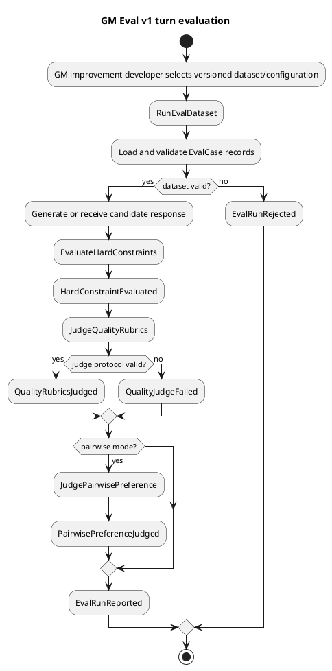
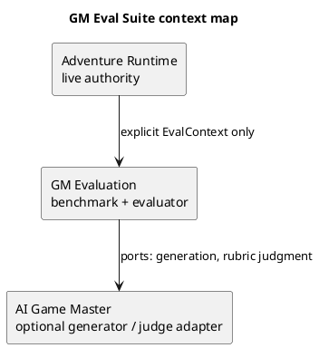
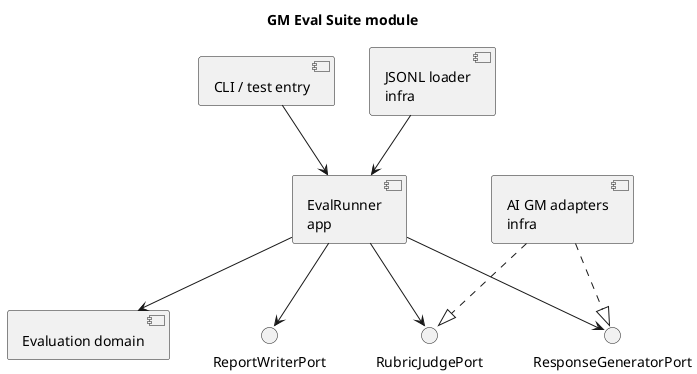
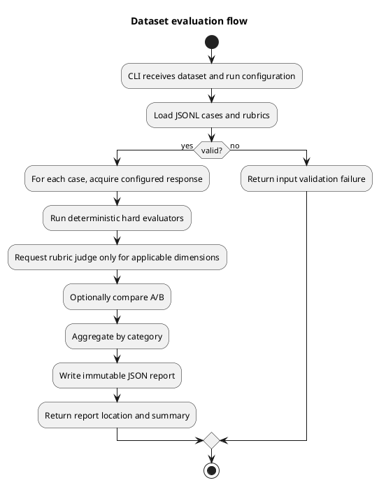

# Architecture Spec: GM Eval Suite v1

## 1. Design Scope

### 1.1 Target

| 항목 | 대상 |
| --- | --- |
| Product Spec | `docs/specs/gm-eval-suite-product-spec.md` |
| Use Cases | UC-EVAL-001~005 |
| Domain | turn-level GM response evaluation |
| Bounded Contexts | GM Evaluation, AI Game Master (candidate generator/judge provider) |
| Existing Services | `ai-game-master-service`, `adventure-service` quality gate (unchanged) |
| External Dependencies | configured LLM judge/generator, Jackson, filesystem output |
| Affected Data | versioned JSONL cases/rubrics/datasets, JSON Eval Run reports |

Create a standalone `gm-eval-service` JVM module. It owns reusable benchmark data, deterministic evaluation, LLM-judge ports, absolute/pairwise orchestration, and report serialization. It must not become an `adventure-service` startup/deployment gate and must not change live GM Turn endpoints.

The existing `GmQualityEvaluationService` is an API-layer provider probe with string checks; it is not the v1 domain model. Existing deployment gate metrics/corpuses remain unchanged.

### 1.2 Product Spec Mapping

| Product Spec 항목 | Architecture 요소 |
| --- | --- |
| UC-EVAL-001, BR-EVAL-003~006 | typed `EvalCase`, `HardExpectation`, `HardConstraintEvaluator` dispatch, `HardConstraintResult` |
| UC-EVAL-002, BR-EVAL-007~008 | `QualityRubric`, `RubricJudgePort`, structured `QualityScore` validation |
| UC-EVAL-003, BR-EVAL-009 | `PairwiseEvaluationService`, `PairwiseJudgePort`, `A/B/TIE` value |
| UC-EVAL-004, BR-EVAL-010~012 | JSONL dataset loader, `EvalRunner`, immutable `EvalRunReport`, file report adapter |
| UC-EVAL-005 | versioned data-only case catalogue and schema validation |
| failure boundaries | invalid case/config fails before execution; unsupported deterministic expectations reported distinctly; judge protocol failure does not modify hard result |

---

## 2. Domain Flow

### 2.1 Event Storming Flow



### 2.2 Commands

| Command | Actor | Target | Preconditions | Result |
| --- | --- | --- | --- | --- |
| `EvaluateResponse` | developer/runner | one `EvalCase` + supplied response | valid case, response | absolute `EvalResult` |
| `CompareResponses` | developer/runner | one case + A/B response | valid case; both correspond to same case | pairwise result |
| `RunDataset` | developer/CLI | dataset + `EvalRunConfiguration` | dataset/config valid | `EvalRunReport` artifact |
| `AddEvalCase` | benchmark maintainer | dataset source | schema/category/version valid | versioned case data change |

### 2.3 Domain Events

Events are in-process immutable result facts; v1 publishes no broker events and owns no runtime state.

| Event | Producer | Trigger | Payload | Consumer |
| --- | --- | --- | --- | --- |
| `HardConstraintEvaluated` | evaluation service | hard dispatch complete | case id, per-expectation result | report assembler |
| `QualityRubricsJudged` | quality service | valid structured judge answer | case id, scores/evidence | report assembler |
| `QualityJudgeFailed` | judge adapter | malformed/unavailable judge response | case id, failure reason | report assembler |
| `PairwisePreferenceJudged` | pairwise service | valid comparison answer | case id, winner/preferences/evidence | report assembler |
| `EvalRunReported` | runner | all case outcomes assembled | run metadata and aggregates | JSON report adapter |

### 2.4 Policies

| Policy | Trigger | Decision | Owner |
| --- | --- | --- | --- |
| hard/quality separation | every result assembly | never derive hard pass from quality score | `EvalResult` constructor |
| deterministic priority | hard expectation has supported structured form | evaluate locally before any LLM call | `HardConstraintEvaluationService` |
| unsupported visibility | evaluator has no deterministic implementation | emit `UNEVALUATED`, never `PASS` | evaluator dispatch |
| judge evidence contract | judge reply received | reject missing dimension/reason/evidence | judge response validator |
| pairwise comparability | pairwise request | reject different case IDs | `PairwiseEvaluationService` |

### 2.5 Read Models

| Read Model | Consumer | Source | Fields | Owner |
| --- | --- | --- | --- | --- |
| `EvalResult` | caller/report | one absolute evaluation | hard results, quality scores, judge failure | GM Evaluation |
| `PairwiseEvalResult` | caller/report | same-case A/B comparison | winner, dimension preferences, evidence | GM Evaluation |
| `EvalRunReport` | developer/CI | dataset execution | metadata, category aggregates, per-case results | GM Evaluation |

### 2.6 External Interactions

| External System | Trigger | Input | Output | Failure |
| --- | --- | --- | --- | --- |
| GM response generator (optional) | runner configured to generate | `EvalCase` and generation config | candidate response + generation metadata | case recorded as generation failure |
| LLM rubric judge | subjective rubric evaluation | case context, response, anchored rubrics | structured scores/evidence | `QualityJudgeFailed` |
| LLM pairwise judge | pairwise mode | case context, A/B, applicable rubrics | winner/preferences/evidence | pairwise judge failure result |
| filesystem | load/write | JSONL resources/report request | cases/rubrics/report JSON | fail run before/after partial report with explicit error |

### 2.7 Hotspots

| Hotspot | Options | Decision |
| --- | --- | --- |
| ownership | extend live quality gate / separate module | standalone `gm-eval-service`; no startup coupling |
| hard expectation shape | generic prose checks / typed discriminated expectations | typed variants; deterministic evaluator dispatch |
| semantic leakage | string matcher only / LLM judgment | structured direct leakage deterministic; indirect leakage quality/judge result |
| response source | always invoke provider / accept supplied or generated response | absolute service accepts supplied; runner has optional generator port |
| report persistence | DB / durable JSON artifact | versioned JSON report; no repository in v1 |

---

## 3. DDD Architecture

### 3.1 Bounded Contexts

| Bounded Context | Responsibility | Owned Model | Owned Data |
| --- | --- | --- | --- |
| GM Evaluation | benchmark definition, evaluation semantics, reports | `EvalCase`, expectations, rubrics, results/runs | JSONL datasets, JSON reports |
| AI Game Master | future response generation and LLM invocation adapters | unchanged GM provider contracts | unchanged |
| Adventure Runtime | authoritative live state/rule execution | unchanged | unchanged |

### 3.2 Context Map



| Upstream | Downstream | Relationship | Contract | Translation |
| --- | --- | --- | --- | --- |
| Adventure Runtime | GM Evaluation | Published Language | explicit `EvalContext` snapshot | benchmark author supplies data |
| AI Game Master adapter | GM Evaluation | ACL/port implementation | generator/judge structured request-response | infra adapter |
| GM Evaluation | AI Game Master | no runtime dependency | none | none |

### 3.3 Aggregates

No mutable domain aggregate or cross-case transaction exists. `EvalCase` is an immutable consistency boundary: its context, expectations, rubrics and version validate together. `EvalRunReport` is immutable after assembly and is persisted atomically as one artifact.

| Aggregate | Root | Responsibility | Commands | Events | Invariants |
| --- | --- | --- | --- | --- | --- |
| Eval Case | `EvalCase` | one reusable turn evaluation contract | validate/load | none | unique id/version, valid context, typed expectations/rubrics |
| Eval Run | `EvalRunReport` | compare results from one pinned configuration | assemble/write | `EvalRunReported` | metadata and per-case results present; no blended hard score |

### 3.4 Entities

| Entity | Aggregate | Identity | Responsibility | State |
| --- | --- | --- | --- | --- |
| `EvalCase` | Eval Case | `caseId` + dataset version | turn benchmark definition | immutable context/expectations/rubrics/categories |
| `EvalRunReport` | Eval Run | `runId` | one reproducible run record | immutable metadata/results/aggregates |

### 3.5 Value Objects

| Value Object | Aggregate | Values | Validation | Behavior |
| --- | --- | --- | --- | --- |
| `EvalContext` | Eval Case | input, scene/world state, knowledge, story stage, optional TurnPlan/resolved context | required input/context IDs; normalized facts | supplies evaluator facts |
| `HardExpectation` | Eval Case | discriminated category/type/payload | type-specific required fields | selects deterministic evaluator |
| `QualityRubric` | Eval Case | dimension + anchored 1-5 definitions | all anchors, unique dimension | supplies judge contract |
| `HardConstraintResult` | Eval Result | PASS/FAIL/UNEVALUATED + reason/evidence | evidence for FAIL, reason for UNEVALUATED | independent hard outcome |
| `QualityScore` | Eval Result | dimension, score, reason, evidence | score in rubric range, required fields | subjective assessment |
| `RunMetadata` | Eval Run | timestamp, dataset, model/config/prompt/TurnPlan versions | required comparison identifiers | reproducibility |

### 3.6 Domain Services

| Service | Responsibility | Input | Output | Collaborators |
| --- | --- | --- | --- | --- |
| `HardConstraintEvaluationService` | dispatch all mechanically checkable expectations | case + response | results per expectation | `HardConstraintEvaluator` variants |
| `AbsoluteEvaluationService` | combine deterministic results and rubric judge response | case + supplied response | `EvalResult` | hard service, `RubricJudgePort` |
| `PairwiseEvaluationService` | compare same-case A/B result | case + A/B | `PairwiseEvalResult` | absolute service, `PairwiseJudgePort` |
| `EvalRunner` | load, optionally generate, evaluate, aggregate, write | config + dataset | report | loaders, ports, report writer |

### 3.7 Business Rule Ownership

| Business Rule | Owner | Enforcement Point |
| --- | --- | --- |
| hard and quality never blend | `EvalResult` | constructor/factory |
| typed direct facts checked deterministically | hard evaluator variants | `evaluate` |
| player agency forced effects allowed only when explicit | agency evaluator | `evaluate` against `EvalContext` |
| anchored rubrics required | `QualityRubric` | constructor |
| malformed judge reply cannot become a quality score | judge response validator | adapter boundary |
| pairwise only for same case | `PairwiseEvaluationService` | `compare` |

### 3.8 Aggregate State Transitions

| Current State | Command / Event | Next State | Owner | Preconditions | Emitted Event |
| --- | --- | --- | --- | --- | --- |
| case source | load/validate | valid `EvalCase` | loader | schema/version valid | none |
| valid case + response | evaluate | `EvalResult` | absolute service | response supplied | `HardConstraintEvaluated`, optional `QualityRubricsJudged` |
| valid case + A/B | compare | `PairwiseEvalResult` | pairwise service | same case | `PairwisePreferenceJudged` |
| completed case results | assemble/write | report artifact | runner | run metadata complete | `EvalRunReported` |

### 3.9 Repository Boundaries

No database repository. Dataset directory is immutable version-controlled input; JSON report writer is an output port. Runner must not modify benchmark inputs.

---

## 4. Program Design

### 4.1 Program Structure



### 4.2 Major Components and Responsibilities

| Component | Responsibility | Input | Output | Dependencies | Must Not Do |
| --- | --- | --- | --- | --- | --- |
| CLI/test entry | parse run request and present report location | arguments/config | exit status/report summary | app | invoke hidden production gate |
| `EvalRunner` | one run orchestration and aggregation | dataset/config | report | ports/domain | own evaluation rules |
| domain evaluators | hard-rule semantics | case/response | typed result | no framework | call LLM or filesystem |
| `RubricJudgePort` | semantic quality protocol | judge request | structured answer | none | expose provider SDK to domain |
| JSONL loader | parse versioned benchmark data | resource/path | valid cases | Jackson | evaluate cases |
| report writer | persist final structured report | report | JSON artifact | Jackson/filesystem | mutate dataset |

### 4.3 Application Flow



### 4.4 Component Call Contracts

| Order | Caller | Callee | Operation | Input | Output | Failure |
| ---: | --- | --- | --- | --- | --- | --- |
| 1 | entry | loader | `load(datasetRef)` | JSONL + rubric refs | `List<EvalCase>` | invalid schema/version |
| 2 | runner | generator port | `generate(case, config)` | case/context | response + metadata | generation failure per case |
| 3 | absolute service | hard evaluator | `evaluate(case, response)` | typed expectation | hard result | unsupported -> UNEVALUATED |
| 4 | absolute service | rubric judge port | `judge(case, response, rubrics)` | anchored request | structured scores | judge failure |
| 5 | pairwise service | pairwise judge port | `compare(case, A, B)` | same-case request | preference result | invalid reply/failure |
| 6 | runner | report writer | `write(report)` | immutable report | artifact ref | write failure |

### 4.5 Major Types

| Type | Kind | Responsibility | State | Dependencies |
| --- | --- | --- | --- | --- |
| `EvalCase` | domain entity | benchmark contract | immutable | domain VOs |
| `HardConstraintEvaluator` | domain port/strategy | one typed deterministic check | stateless | domain VOs |
| `AbsoluteEvaluationService` | app/domain service | compose independent results | stateless | hard service, judge port |
| `EvalRunner` | application service | run lifecycle | config-scoped | loaders/ports/services |
| `RubricJudgePort` | output port | semantic judgment boundary | none | domain request/response |
| `JsonlEvalDatasetLoader` | infra adapter | input parsing | none | Jackson |
| `JsonEvalReportWriter` | infra adapter | report artifact writing | none | Jackson/filesystem |

### 4.6 File and Test Contract

```text
src/gm-eval-service/
├── src/main/java/.../gmeval/
│   ├── ui/                 # CLI/test entry
│   ├── app/                # EvalRunner, absolute/pairwise orchestration
│   ├── domain/             # cases, results, hard evaluator strategies
│   └── infra/              # JSONL/Jackson, GM/LLM adapters, report writer
├── src/main/resources/eval/
│   ├── cases/{rule,information,state,agency,continuity,quality}/
│   ├── rubrics/
│   └── datasets/gm-turn-v1.jsonl
└── src/test/
    ├── java/.../gmeval/    # unit, contract, runner tests
    └── resources/eval/     # small fixtures and expected reports
```

Required tests:

- Value-object validation and result separation.
- Each deterministic expectation type: pass, fail, UNEVALUATED.
- Agency forced-effect allowed/voluntary action rejected.
- Dataset loader schema/version/category tests.
- Judge malformed structured reply fails only quality result.
- Absolute and same-case pairwise contract tests.
- Runner aggregation and metadata/report golden tests.
- Seed dataset integrity: unique IDs, version, category coverage, 30-50 cases, all rubric refs resolvable.

---

## 5. Compatibility and Rollout

- `EvalCase.schemaVersion` and report schema version start at `1`; incompatible change creates a new dataset/schema version.
- v1 benchmark resides outside production runtime classpath and no startup validation reads it.
- Optional generators/judges are configured explicitly by runner configuration. Absolute evaluation with supplied response needs neither.
- Existing `GmQualityEvaluationService`, golden corpus, and deployment gate remain supported but are not inputs to v1 reports.

## 6. Non-goals and Explicit Deferrals

- No Planner/Writer change, live GM endpoint change, TurnPlan runtime handoff, or Adventure Runtime mutation.
- No semantic verdict is promoted to deterministic hard failure merely from judge inference.
- No production telemetry, database history, CI gating policy, or automatic regression-capture workflow.
- No scene/session scoring, response rewrite, Best-of-N, prompt optimization, or training loop.
