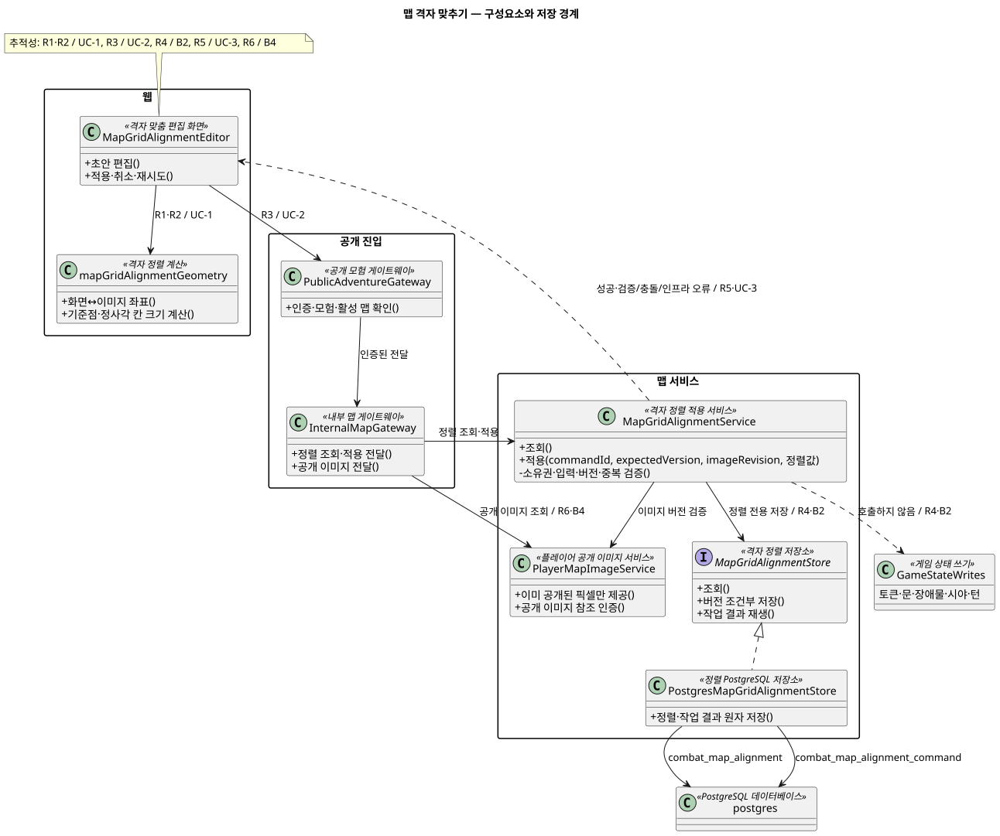
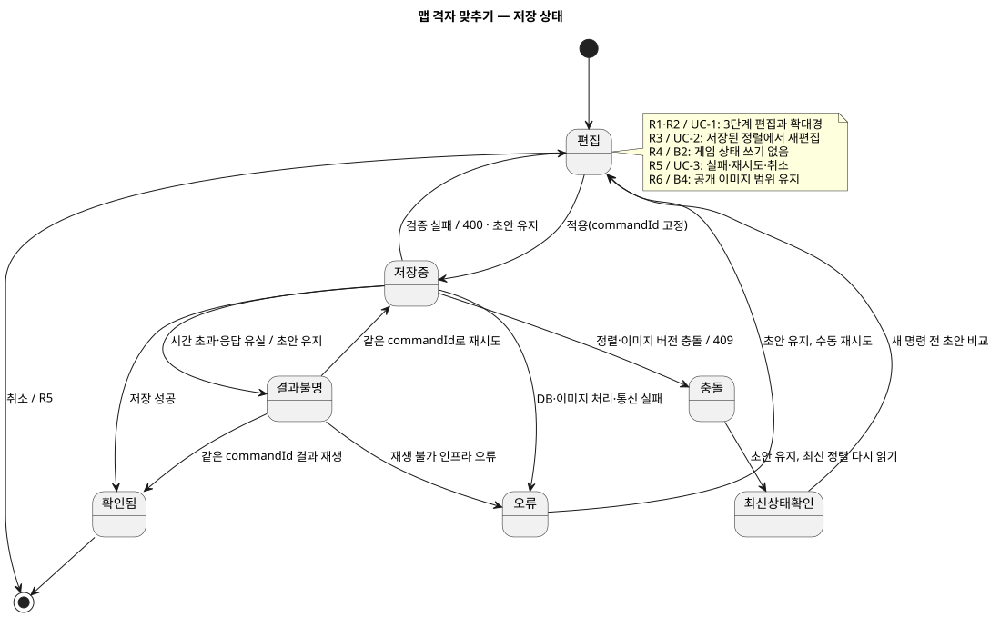

# 맵 격자 맞추기 — 아키텍처 명세

- 범위: `map-grid-alignment`
- 기준: [완료된 제품 명세](product-spec.md), 사용자 설계 확인, 기존 코드 조사.
- 확정: 기존 맵 서비스 내부에 정렬 전용 저장 처리를 분리한다. 서버가 이미 공개된 이미지 부분만 제공한다. 추가 설계 제약 없음으로 인터뷰를 마쳤다.
- 상태: 아키텍처 단계 완료. 제품 요구사항·사용자 확정 설계·기존 코드 조사와 다이어그램 원본·로컬 SVG 산출물의 내용 일치 검토 완료.

## 1. 설계 범위와 제품 대응

| 제품 요구 | 설계 책임 |
| --- | --- |
| R1, R2 / UC-1 | 웹의 임시 편집 상태, 이미지 좌표 변환, 확대경 |
| R3 / UC-2 | 수동 보정 이력과 무관한 재편집 진입 |
| R4 / B2 | 정렬 전용 저장소. 게임 격자·토큰·문·장애물·시야·턴 저장 호출 금지 |
| R5 / UC-3 | 명시적 적용, 작업 식별자 재사용, 버전 비교, 실패 시 초안 보존 |
| R6 / B4 | 서버의 공개 이미지 생성. 전체 원본 URL을 보정 화면에 제공하지 않음 |

기존 `Combat Map` 책임 안에서 구현한다. 웹·모험 서비스의 공개 API·맵 서비스 내부 API·기존 PostgreSQL을 사용한다. AI, 새 배포 서비스, 메시지 브로커는 추가하지 않는다.

## 2. 흐름과 현재 구현의 차이

편집 열기 → 소유권 확인 → 저장된 정렬과 공개 이미지 조회 → 웹에서 기준점·크기·미세 조정 → 적용 요청 → 중복·버전·입력 검증 → 정렬과 작업 결과를 한 트랜잭션으로 저장 → 결과 반환.

취소는 서버 쓰기 없이 종료한다. 이미지 제공은 읽기 흐름이며 탐험 영역을 확대하지 않는다. 편집 성공은 게임 명령이나 GM Turn을 만들지 않는다. 외부 도메인 이벤트 발행과 후속 정책은 해당 없음이다.

현재 코드 조사:

- [기존 보정 서비스](../../../src/combat-map-service/src/main/java/com/dndmaster/combatmap/application/view/CombatMapViewService.java)는 새 격자를 만들고 모든 칸 위치를 비례 변환한 뒤 시야를 다시 계산한다. 정렬 전용 경로에서 호출하지 않는다.
- [기존 맵 저장소](../../../src/combat-map-service/src/main/java/com/dndmaster/combatmap/infrastructure/persistence/PostgresCombatMapViewStore.java)는 전체 맵 및 자식 행을 갱신한다. 정렬 저장은 이 전체 교체 작업을 사용하지 않는다.
- [맵 화면](../../../src/web-ui/src/features/combat-map/CombatMapView.tsx)은 수동 보정 이력에 따라 편집을 숨기며 원본 이미지 전체를 배경으로 사용한다. 재편집과 공개 이미지 계약을 적용해야 한다.
- [기존 보정 요청](../../../src/combat-map-service/src/main/java/com/dndmaster/combatmap/application/view/GridCalibrationRequest.java)은 정수 크기·원점과 플레이어 시작 위치를 받는다. 새 요청은 시작 위치와 게임 칸 수를 받지 않는다.

## 3. 도메인 책임과 저장 경계

맵의 소유권·이미지·게임 상태는 기존 맵이 소유한다. 정렬은 맵에 종속된 값이며 독립된 업무 주체나 새 bounded context가 아니다. 정렬 행의 버전은 동시 편집을 막는 저장 경계다. 게임 상태와 구분된 저장 연산이 필요하지만 독립 배포나 새 코드 모듈은 필요 없다.

| 값/책임 | 내용 | 소유자 |
| --- | --- | --- |
| 정렬값 | 원본 이미지 기준 원점 X/Y, 정사각 칸 크기, 이미지 버전, 정렬 버전 | 맵 서비스 |
| 편집 초안 | 현재 단계, 정렬값, 진입 시 버전, 저장 중 여부, 실패 정보 | 웹 화면 메모리 |
| 공개 이미지 | 원본 중 이미 공개된 픽셀만 포함한 파생 이미지와 위치 | 맵 서비스 |
| 저장 작업 결과 | 요청 식별자, 입력 지문, 성공한 정렬 버전·값 | 맵 서비스 |

기존 `CONTEXT-MAP.md`의 Combat Map 소유권을 유지한다. 신규 공통 도메인 용어는 없으며 위 표현은 이 명세 범위에만 둔다. 별도 ADR은 작성하지 않는다. 별도 서비스 승격 없이 기존 소유권과 사용자 확정 방향을 적용하는 변경이다.

## 4. 프로그램 설계

아래 신규 이름은 구현 위치 후보이며 의미를 한국어로 함께 표기한다.

| 구성요소 | 책임 | 금지 |
| --- | --- | --- |
| `MapGridAlignmentEditor` — 격자 맞춤 편집 화면 | 3단계 초안, 적용·취소·재시도 | 원본 전체 이미지 사용, 게임 상태 변경 |
| `mapGridAlignmentGeometry` — 격자 정렬 계산 | 화면↔이미지 좌표, 기준점·칸 크기 계산 | API·저장 의존 |
| `MapGridAlignmentService` — 정렬 적용 서비스 | 소유권·입력 검증, 전용 저장 조정 | 기존 전체 보정 호출 |
| `MapGridAlignmentStore` — 정렬 저장 인터페이스 | 조회·버전 조건부 저장·작업 재생 | 토큰·시야 테이블 쓰기 |
| `PostgresMapGridAlignmentStore` — 정렬 PostgreSQL 구현 | 정렬·작업 결과 원자 저장 | 원본 이미지 반환 |
| `PlayerMapImageService` — 공개 이미지 제공 | 이미지의 공개 영역만 잘라 재인코딩 | 클라이언트가 요청한 영역을 공개 근거로 사용 |

호출 계약:

1. 웹은 공개 모험 API로 편집 자료를 조회한다. 모험 서비스가 인증 사용자와 해당 모험·활성 맵의 연결을 확인하고 내부 맵 API를 호출한다.
2. 정렬 서비스는 맵 소유권을 다시 확인하고 정렬 또는 기존 정수 정렬에서 변환한 초기값을 반환한다.
3. 이미지 서비스는 서버의 공개 근거로 가린 이미지와 원본 좌표상 위치를 반환한다. 확대경은 이 이미지에서만 샘플링한다.
4. 적용은 동일 경계로 전달한다. 저장소는 소유권·이미지 버전·정렬 버전·중복을 확인해 저장한다.
5. 반환은 정렬값과 버전만 포함한다. 원본이나 숨겨진 토큰을 반환하지 않는다.

주요 함수의 의미 계약:

```text
조회(인증 사용자, 모험, 맵) -> 정렬값, 정렬 버전, 이미지 버전, 공개 이미지 참조
적용(인증 사용자, 모험, 맵, 작업 식별자, 기대 버전, 이미지 버전, 정렬값)
    -> 저장된 정렬값과 버전 또는 검증/충돌/인프라 오류
공개 이미지 조회(인증 사용자, 서버 발급 참조) -> 공개 픽셀만 포함한 이미지
```

좌표 계산은 게임 좌표와 이미지 좌표를 분리한다. 이미지 위치 = 원점 + 격자 좌표 × 칸 크기. 화면 확대·이동은 저장하지 않는다. 기준점 a의 이미지 위치 p를 고정하고 다른 교차점 b를 q로 옮기면 칸 크기 후보는 `(q-p)·(b-a) / |b-a|²`, 원점은 `p-a×칸 크기`로 계산한다. a=b는 크기 조절 불가다. 음수·0 크기는 적용하지 않는다. 원본 픽셀 소수점 정밀도를 유지하고 게임 칸 수는 바꾸지 않는다.

## 5. 기술 계약과 파일 구조

### API

기존 보정 API를 변경해 의미를 섞지 않고 전용 경로를 추가한다.

| 경로 | 역할 |
| --- | --- |
| `GET /api/v1/adventures/{adventureId}/combat-map/alignment` | 정렬·편집용 공개 이미지 조회 |
| `PUT /api/v1/adventures/{adventureId}/combat-map/alignment` | 정렬만 적용 |
| `GET/PUT /internal/v1/combat-maps/{mapId}/alignment` | 내부 정렬 처리 |
| `GET /api/v1/adventures/{adventureId}/combat-map/alignment/image/{imageViewId}` | 인증된 공개 이미지 다운로드 |

`imageViewId`는 서버가 발급한 공개 이미지 참조다. 원본 파일 경로나 접근 토큰을 포함하지 않는다. 내부 이미지 다운로드는 모험 서비스가 맵 서비스의 대응 경로로 전달한다. 브라우저가 내부 API를 호출하지 않는다.

적용 요청 예시:

```json
{
  "mapId": "UUID",
  "commandId": "UUID",
  "expectedVersion": 0,
  "imageRevision": "server-image-revision",
  "originX": 12.25,
  "originY": 8.5,
  "cellSize": 31.75
}
```

`mapId`는 대상 맵, `commandId`는 동일 저장의 재시도 식별자, `expectedVersion`은 정렬 버전, `imageRevision`은 원본 이미지 버전이다. 원점·칸 크기는 원본 이미지 픽셀 단위다. 응답은 `mapId`, `version`(정렬 버전), `imageRevision`, `originX`, `originY`, `cellSize`다. 조회에는 공개 이미지 참조와 원본 좌표 내 위치·크기도 추가한다.

게임 칸 수·플레이어 좌표·이미지의 주장 크기는 받지 않는다. 서버가 원본 크기를 조회한다. 유한한 소수점, 양의 크기, 전체 게임 격자 범위가 이미지와 유효하게 대응함을 검증한다. 유효 이미지 범위를 벗어나 저장할 수 없는 경우 400을 반환하고 초안을 유지한다. 이미지 회전과 비정사각형 크기는 허용하지 않는다.

### 저장

- `combat_map_alignment` — 맵별 정렬값 저장 테이블: `map_id` 기본키/기존 맵 외래키, 이미지 버전, 원점·크기의 double precision, 정렬 버전, 수정 시각.
- `combat_map_alignment_command` — 정렬 저장 재시도 결과 테이블: 맵·사용자·작업 식별자 복합 유일키, 입력 지문, 저장 결과. 정렬과 같은 트랜잭션으로 기록한다.
- `combat_map_image_exposure` — 이미 공개된 원본 영역의 파생 저장 테이블: 맵·이미지 버전·사용자 복합키, 공개 영역 버전, 압축 영역 자료, 마지막 반영 게임 관찰 버전. 동일 관찰을 중복 반영하지 않는다. 기존 시야·탐험 테이블을 대체하지 않는다.
- 기존 맵 데이터는 수정하지 않는다. 정렬 행이 없으면 기존 정렬 메타데이터에서 초기값과 가상 버전 0을 읽는다. 첫 적용 때 버전 1로 삽입하며 동시 최초 적용도 유일키/버전 검사로 직렬화한다.
- 기존 이동·시야 갱신이 정렬 전용 행을 덮어쓰지 않는다. 이미지 교체 시 버전 불일치로 옛 정렬 적용을 거절한다.
- 이미지 버전은 저장된 원본의 불변 식별자 또는 콘텐츠 해시로 서버가 계산한다. 기존 레이어에 버전이 없으면 최초 조회 시 원본 바이트의 해시를 사용한다. 클라이언트 문자열만으로 교체 여부를 판단하지 않는다.
- 마이그레이션은 [ADR-004](../../adr/004-modular-monolith-flyway-versioning.md)의 맵 서비스별 이력 규칙을 따른다. 번호는 구현 시 미사용 번호를 선택한다. 기존 마이그레이션을 편집하지 않는다.

### 변경 파일

| 위치 | 변경 |
| --- | --- |
| `src/web-ui/src/features/combat-map/` | 편집 화면·계산 모듈·확대경, 기존 맵 화면의 진입·재편집 연결 |
| `src/web-ui/src/features/saved-adventures/AdventurePlayApi.ts` | 새 조회·적용·이미지 계약 |
| `src/web-ui/src/app.css` | 격자 강조·조절점·확대경 스타일 |
| `src/adventure-service/.../api/AdventureController.java` | 공개 정렬·이미지 경로 |
| `src/adventure-service/.../application/combat/CombatMapViewPort.java`, `HttpCombatMapViewGateway.java` | 내부 API 연결 |
| `src/combat-map-service/.../api/CombatMapController.java` | 내부 정렬·이미지 경로 |
| `src/combat-map-service/.../application/view/` | 정렬 서비스·저장 인터페이스·공개 이미지 서비스 |
| `src/combat-map-service/.../infrastructure/persistence/` | 정렬 저장 구현 |
| `src/combat-map-service/src/main/resources/db/migration/` | 전용 테이블 추가 |

`...`는 각 기존 서비스의 Java 패키지 접두부를 뜻한다. 새 패키지·모듈·프로세스를 만드는 의미가 아니다. 외부 비동기 메시지와 신규 외부 라이브러리 계약은 해당 없음이다. HTTP 시간 제한은 기존 게이트웨이 설정을 사용한다.

## 6. 실행·동시성·재시도

- 드래그는 브라우저 메모리에서만 처리한다. 적용 직전에 요청값과 작업 식별자를 고정한다.
- 중복 결과 조회를 버전 거절보다 먼저 한다. 같은 식별자·같은 입력이면 기존 성공 결과를 반환한다. 입력이 다르면 409다.
- 서로 다른 저장이 같은 정렬 버전을 사용하면 하나만 성공한다. 나머지는 409이며 초안을 유지한 채 최신 정렬을 다시 읽고 비교한다. 자동 덮어쓰기는 하지 않는다.
- 사용자 재시도는 결과 불명 요청의 식별자를 유지한다. 수정값을 바꾼 새 적용은 새 식별자를 사용한다.
- 맵 정렬 버전과 게임 상태 버전을 분리한다. 이미지 버전 검증은 저장 트랜잭션 안에서 해당 맵 행 잠금 또는 동등한 원자 검증으로 수행한다. 게임 상태 값 자체는 쓰지 않는다.
- 정렬 저장과 작업 결과 기록은 모두 성공하거나 모두 롤백한다. 응답 유실은 같은 작업 재생으로 복구한다.
- 저장 중 추가 적용을 막는다. 서버 성공이 불명인 동안 ‘취소’를 저장 취소로 표시하지 않고 결과 확인 후 보기로 돌아간다. 편집 중 취소와 네트워크 요청 취소를 구분한다.

## 7. 오류와 복구

| 오류 | 응답 | 복구 |
| --- | --- | --- |
| 잘못된 값·지원하지 않는 변환 | 400 | 초안 수정 |
| 미인증·내부 토큰 오류 | 401/403 | 인증 복구, 이미지·초안 비공개 유지 |
| 모험 소유권/맵 연결 불일치 | 404 또는 기존 접근 거절 정책 | 다른 맵 정보 제공 금지 |
| 정렬·이미지 버전 충돌 | 409 | 초안 유지, 최신 상태 확인 후 새 적용 |
| 같은 작업 식별자에 다른 입력 | 409 | 새 작업 식별자로 명시적 적용 |
| DB·이미지 처리·통신 실패 | 기존 5xx 계약 | 오류 안내, 초안 유지, 수동 재시도 |

자동 무한 재시도는 없다. 이미지 생성 실패 시 전체 원본으로 대체하지 않는다. 보상 작업은 필요 없다. 저장은 단일 DB 트랜잭션이다. 기능 롤백은 새 편집 진입을 끄고 정렬 데이터를 보존한다. 예전 클라이언트가 새 소수점 정렬을 표현하지 못하면 해당 버전으로 되돌리지 않고 호환 읽기를 유지한다.

## 8. 공개 이미지와 보안

**서버에서 잘라낸 이미지가 편집과 확대경의 유일한 원본이다.** 사각형으로 잘라내는 것만으로는 그 안의 미공개 구멍을 숨기지 못한다. 허용 픽셀 외에는 불투명 색으로 덮은 뒤 재인코딩한다. 전체 원본 URL·데이터 URI·원본 바이트·숨겨진 레이어는 편집 응답에 포함하지 않는다.

원본 좌표에서 공개 픽셀 집합을 관리한다. 최초 도입은 기존 저장 정렬과 서버의 탐험 집합으로 계산한다. 이후에는 **실제 게임 관찰에 의해서만** 집합을 늘린다. 정렬 저장·편집 열기·이미지 요청만으로 새 픽셀을 추가하지 않는다. 탐험한 게임 칸은 그대로 유지하고 이 집합은 이미지 비공개를 위한 파생 자료로 별도 보존한다. 정렬을 반복 변경해 숨겨진 원본을 조금씩 조회하는 우회를 막는다.

공개 픽셀 집합의 저장은 맵·원본 이미지 버전·사용자별로 구분하며, 압축된 영역 자료를 맵 서비스 내부 파생 저장소에 둔다. 이미지 버전이 바뀌면 기존 공개 집합을 자동으로 새 이미지에 적용하지 않는다. 게임 관찰 갱신에서 파생 자료를 갱신하되 게임의 시야 정책이나 탐험 집합 자체를 변경하지 않는다. 실패 시 마지막 안전한 공개 자료만 사용한다.

최초 공개 집합 생성은 최초 정렬 적용보다 먼저 같은 맵에 대해 원자적으로 수행한다. 그 뒤 보정 적용·조회가 최초 상태로 재초기화하지 못하게 한다. 게임 관찰 갱신에서는 해당 관찰 시점의 정렬 버전과 이미지 버전을 고정해 파생 자료를 만든다. 정렬과 관찰의 동시성은 같은 맵 행 잠금 순서로 직렬화하며, 정렬 저장 자체를 새 관찰로 취급하지 않는다.

배경 변환은 잘라 제공한 이미지와 그 마스크에 함께 적용한다. 고정된 화면 구멍 아래에 원본 전체를 움직이는 방식은 금지한다. 편집을 다시 열 때도 서버의 공개 픽셀 근거를 사용하며 클라이언트 좌표·정렬 초안을 공개 근거로 받지 않는다.

이미지 참조는 사용자·맵·이미지 버전·공개 영역 버전에 묶고 다운로드마다 인증한다. 공유 캐시 사용을 막는다. 로그에 이미지나 공개 영역 좌표를 남기지 않는다. 기존 일반 플레이 응답에 원본이 포함돼 있는 문제도 같은 공개 이미지 제공 경로로 연결해 편집 화면이 우회적으로 전체 이미지를 재사용하지 못하게 한다. 이미 과거에 전달된 원본을 회수할 수 있다는 보장은 하지 않는다.

## 9. 관측

조회·적용의 성공/실패, 버전 충돌, 중복 재생, 이미지 생성 실패·시간을 기존 로그·계측에 기록한다. 추적에는 요청·맵·작업 식별자만 사용하고 이미지 내용이나 비밀 좌표를 넣지 않는다. 새 전용 경보 시스템은 만들지 않고 기존 서버 오류 경보를 활용한다.

## 10. 변경 경계

허용: 정렬 전용 저장·공개 API·공개 이미지 파생 처리·3단계 화면·관련 테스트.

금지: 기존 게임 칸 수·토큰·문·장애물 좌표 재배치, 보정에 따른 탐험/턴 변경, 새 AI 호출, 벽·문 편집, 격자 종류 확대, 새 배포 서비스.

조건부: 공개 이미지 파생 자료를 실제 관찰 흐름에 연결하는 읽기/파생 저장 변경만 허용한다. 시야 판정 자체의 변경은 이번 범위가 아니다.

## 11. 검증 계약

| 영역 | 필수 증거 |
| --- | --- |
| 계산 / A2 | 소수점 정렬 왕복, 다른 확대율에서 같은 이미지 좌표, 기준점 유지, 동일 점·0 크기·이미지 경계 거절 |
| 화면 / A1-A7 | 단계 이동, 확대경, 적용·취소·오류·재시도, 수동 정렬 후 재편집 |
| 상태 / A8 | 보정 전후 게임 칸·토큰·문·장애물·탐험·턴 동일, 전용 저장이 전체 맵 저장을 호출하지 않음 |
| 저장 / A5-A6 | 첫 적용 경쟁, 동시 편집, 응답 유실 후 동일 작업 재생, DB 롤백, 이미지 교체 충돌 |
| 보안 / A9 | 다운로드한 이미지 바이트 자체에 미공개 픽셀 없음, 잘린 사각형 안 구멍도 숨김, 확대경/변환/반복 저장·재조회로 새 영역 획득 불가 |
| 호환 | 기존 정수 정렬 읽기, 새 소수점 정렬 저장·재조회, 게임 상태 갱신 후 정렬 보존 |

시야 정보가 없는 경우에는 편집 이미지를 제공하지 않고 오류를 안내하는 보수적 경로도 검증한다. 실제 구현 검증은 WSL에서 정책·저장 통합·API·화면 테스트와 `src/start-dev.sh` 기반 브라우저 확인으로 수행한다. 이 명세 작성 단계에서는 애플리케이션 테스트를 실행하지 않는다.

## 12. 대안과 절충

- 기존 전체 보정 재사용: 변경은 작지만 게임 위치·시야 변경 위험 때문에 배제. 사용자 확인으로 정렬 전용 저장을 선택했다.
- 브라우저에서 원본을 가리기: 단순하지만 확대경·이미지 이동·원본 접근에서 비밀 노출 위험. 사용자 확인으로 서버 공개 이미지 제공을 선택했다.
- 정렬마다 새 시야 픽셀 계산: 구현은 간단하지만 반복 정렬이 숨겨진 지형을 공개할 수 있어 공개 원본 영역을 별도로 유지한다.
- 새 서비스: 독립 소유권이나 배포 필요가 없어 배제. 기존 맵 서비스의 저장·이미지 처리 안에 둔다.

## 13. 위험·검토 완료

이미지가 잘못 정렬된 상태에서는 이미 공개된 원본 조각만으로 충분한 기준점을 찾기 어려울 수 있다. 공개 영역을 늘리지 않고 이후 재편집을 허용한다. 공개 이미지 생성 비용은 버전별 재사용과 기존 이미지 크기 제한으로 제어한다. 보안 테스트는 픽셀·다운로드 계약까지 포함한다.

13개 아키텍처 검토 주제는 제품 요구, 기존 소유권·ADR, 코드 조사, 사용자 확인으로 검토했다. 저장 분리와 서버 공개 이미지 제공은 사용자가 명시적으로 확정했고 추가 제약 없음으로 완료 질문에 답했다. 구체적인 함수·테이블·계산 선택은 이 확정 방향 안의 구현 계약이다. 남은 차단 질문 없음.

## 다이어그램

클래스 다이어그램은 정렬 서비스·저장소·이미지 제공·웹의 책임 관계를 표현한다. 설계 상태 다이어그램은 제품 활동과 달리 저장 요청의 결과 불명·중복 재생·버전 충돌 처리를 표현한다.




