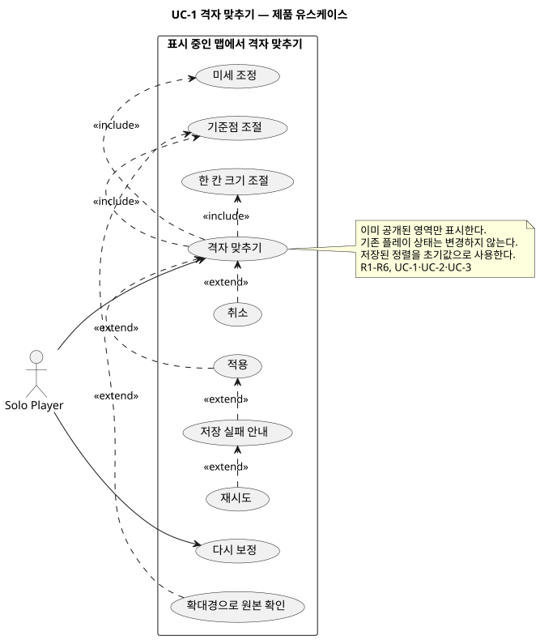
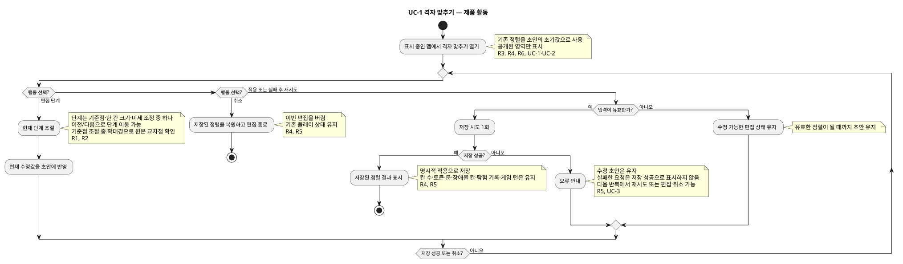

# 맵 격자 맞추기 — 제품 명세

- 범위 식별자: `map-grid-alignment`. 외부 이슈 생성 전 로컬 명세 식별자다.
- 상태: 제품 단계 완료. 사용자 인터뷰 및 유스케이스·활동 다이어그램의 로컬 SVG 렌더·내용 검토 완료.
- 근거: [Owlbear Rodeo 기능 설명](https://blog.owlbear.rodeo/effortless-map-alignment/), 사용자 요청 및 후속 확인. 기존 계획의 미승인 제안은 요구사항으로 승격하지 않는다.

## 1. 문제와 맥락

지도에 인쇄된 격자와 플레이 격자가 어긋나면 토큰의 위치를 읽기 어렵고, AI가 읽은 벽·문 초안이 틀리면 이동과 시야가 깨진다. 원본 이미지에 외곽 여백이 있으면 실제 맵을 크게 보기 어렵다. 사용자는 모험 시작 전에 맵 초안을 확인하고 완성해야 한다.

## 2. 목표와 결과

- R1: 기준점 → 한 칸 크기 → 미세 조정의 3단계로 정사각 격자를 맞춘다.
- R2: 확대경으로 원본의 선과 교차점을 확인할 수 있다.
- R3: 맵 첫 표시 때 필요하면 실행하며, 이후에도 다시 보정할 수 있다. 필수 검수는 아니다.
- R4: 기존 플레이 상태를 유지한다.
- R5: 명시적 적용으로 저장하고 취소·실패에서 수정 내용을 안전하게 처리한다.
- R6: 보정 화면과 확대경은 이미 공개된 영역만 보여준다.
- R7: 모험 시작 전에 AI가 제안한 벽·문을 사용자가 칸 경계선 단위로 수정하고 저장한다.
- R8: 원본 맵의 외곽 여백을 잘라낼 범위를 사용자가 지정하고 저장한다.

## 3. 사용자와 참여자

Solo Player가 자신의 맵을 보정한다. 별도 인간 GM이나 AI 검수 작업은 없다. 서비스는 정렬을 저장하고 결과를 표시한다.

## 4. 용어

기존 Tactical Map, Solo Player, Fog of War 의미를 유지한다. 본 명세의 ‘기준점’은 지도 격자에 맞추는 교차점, ‘한 칸 크기’는 이미지에서 한 격자 칸이 차지하는 크기, ‘미세 조정’은 떨어진 교차점의 오차를 줄이는 조작이다. 새로운 프로젝트 공통 용어를 도입하지 않으므로 CONTEXT.md 변경은 없다.

## 5. 주요 사용 흐름

### UC-1 모험 시작 전 맵 초안 검수

1. 파티 준비가 끝나면 AI가 맵 이미지와 시나리오를 바탕으로 벽·문 초안을 만든다.
2. 사용자는 격자 경계선을 확인해 벽을 추가·삭제하고 문 위치를 추가·삭제한다.
3. 격자 맞추기에서 기준점·한 칸 크기·미세 조정을 수행한다.
4. 원본의 외곽 여백이 있으면 자르기 범위를 지정한다.
5. 맵 초안을 저장한 뒤에만 모험 화면으로 진입한다.

### UC-2 격자 맞추기

1. 자신의 표시 중인 맵에서 ‘격자 맞추기’를 연다. 저장된 정렬을 초기값으로 사용한다.
2. 기준점 조절점을 지도에 인쇄된 교차점에 맞춘다. 누르는 동안 확대경으로 확인한다.
3. 한 칸 크기를 드래그해 정사각 격자 크기를 맞춘다.
4. 미세 조정 단계에서 다른 교차점의 어긋남을 수정한다. 전체 이미지를 왜곡하지 않고 정사각 격자 정렬을 수정한다.
5. 적용하면 저장된 결과가 표시된다. 취소하면 편집 전 상태로 돌아간다.

### UC-3 다시 보정하기

수동 보정 이력과 관계없이 다시 열어 UC-1을 수행한다. 다시 보정해도 기존 칸·탐험 기록은 바뀌지 않는다.

### UC-4 저장 실패 후 재시도

저장 실패를 안내하되 현재 수정값은 유지한다. 사용자는 재시도하거나 취소할 수 있다. 실패한 요청을 저장 성공으로 표시하지 않는다.

## 6. 업무 규칙과 불변식

- B1: 적용 전에는 저장된 정렬을 변경하지 않는다.
- B2: 보정은 배경 이미지와 격자의 정렬만 변경한다. 게임의 칸 수, 토큰·문·장애물의 기존 칸, 탐험 기록, 게임 턴을 변경하지 않는다.
- B3: 가로·세로에 같은 칸 크기를 적용한다. 회전·육각 격자·찌그러진 이미지 보정은 하지 않는다.
- B4: 공개되지 않은 영역을 보정이나 확대경을 통해 새로 표시하지 않는다. 전체 지형 표시를 요구하지 않는다.
- B5: 저장 실패 시 수정값을 유지한다. 취소 시 이번 편집을 버린다.
- B6: 보정 완료 여부로 재편집을 막지 않는다.
- B7: 맵 초안 저장 전에는 모험 런타임 화면으로 진입할 수 없다.
- B8: 벽·문은 유효한 게임 칸 경계선 안에 있어야 하며 같은 경계선에 동시에 둘 수 없다. 벽·문은 칸 전체를 막지 않는다.
- B9: 자르기 범위는 원본 이미지 안에 있어야 하며, 저장하지 않은 범위는 게임 화면에 반영하지 않는다.

## 7. 상태와 전이

보기 → 기준점 → 한 칸 크기 → 미세 조정 → 저장 중 → 보기.

저장 실패 → 수정값을 유지한 편집 상태. 편집 취소 → 기존 정렬 보기. 재편집 → 저장된 정렬에서 기준점 단계 시작. 단계 간 왕복은 정렬 초안을 유지한다. 독립적인 업무 생명주기는 없으므로 별도 업무 상태 다이어그램은 만들지 않고 활동 다이어그램에 표현한다.

## 8. 실패·예외·경계

- 이미지가 없거나 읽을 수 없으면 보정을 실행하지 못하는 이유를 안내하고 기존 맵을 유지한다.
- 크기가 0 이하이거나 유효한 정렬을 만들 수 없는 입력은 적용하지 않는다. 수정 가능한 편집 상태를 유지한다.
- 저장 실패는 UC-3으로 처리한다. 기존 플레이 데이터를 부분 변경하지 않는다.
- 공개된 영역이 작아 정렬이 어려워도 숨겨진 지형을 추가 공개하지 않는다. 사용자는 취소하거나 이후 다시 보정할 수 있다.
- 인쇄 격자가 없는 이미지도 기준점과 한 칸 크기를 지정할 수 있으나 새 격자 자동 탐지는 범위 밖이다.

## 9. 입력과 출력

입력은 표시 중인 맵, 기존 정렬, 사용자가 맞춘 기준점·칸 크기·미세 조정, 적용 또는 취소다. 출력은 정렬 미리보기, 저장 결과 또는 실패 안내다. 토큰 시작 위치 입력은 이 기능에 포함하지 않는다.

## 10. 범위와 비목표

포함: 모험 시작 전 맵 초안 검수, AI 벽·문 제안 확인, 벽·문 수정, 정사각 격자 3단계 맞춤, 확대경, 외곽 여백 자르기, 적용·취소·실패 후 재시도, 재편집, 기존 플레이 상태 유지.

제외: 안개 정책 변경, 새 AI 모델 추가, 게임 칸 수 변경, 회전·육각 격자·비선형 이미지 보정. 앞선 계획의 추가 기능은 본 명세보다 우선하지 않는다.

## 11. 우선순위와 절충

이미 공개된 영역만으로 보정할 수 있어야 한다. 전체 지도에 걸친 정확도 확인보다 비밀 비노출과 기존 플레이 상태 유지가 우선한다. 보정 불가능한 이미지에는 취소와 이후 재편집을 제공한다.

## 12. 성공 조건과 수용 기준

| ID | 조건 | 기대 결과 |
| --- | --- | --- |
| A1 | 처음 맵을 표시 | 필요 시 격자 맞추기에 진입 가능, 필수 아님 |
| A2 | 기준점·크기·먼 교차점 조절 | 정사각 격자 정렬을 눈으로 맞출 수 있음 |
| A3 | 기준점 누르기 | 확대경에서 해당 원본 교차점 확인 가능 |
| A4 | 편집 중 취소 | 기존 정렬과 플레이 데이터 유지 |
| A5 | 적용 성공 후 재조회 | 저장한 정렬 복원 |
| A6 | 저장 실패 | 수정값 유지, 오류 안내, 재시도 가능 |
| A7 | 이미 보정한 맵 다시 열기 | 재편집 가능 |
| A8 | 보정 전후 비교 | 토큰·문·장애물 칸, 게임 칸 수, 탐험 기록, 턴 불변 |
| A9 | 편집·확대경·미세 조정 사용 | 숨겨진 지형 새로 표시되지 않음 |
| A10 | 파티 준비 후 맵 초안 진입 | AI 벽·문을 수정하고 격자·자르기를 저장할 수 있음 |
| A11 | 맵 초안 미저장 | 모험 런타임 진입이 차단됨 |

제품 검토 범위: 문제·목표·사용자·용어·사용 흐름·불변식·상태·예외·입출력·범위·우선순위·수용 기준 모두 위 사용자 확인 범위로 확정했다. 마지막 누락 사항 질문에 사용자가 ‘없음’으로 답했다. 구체적 계산·저장·동시성 방식은 아키텍처 단계에서 결정한다.

## 다이어그램

제품 유스케이스 및 활동 다이어그램은 같은 범위 디렉터리에서 생성·검증한다.

