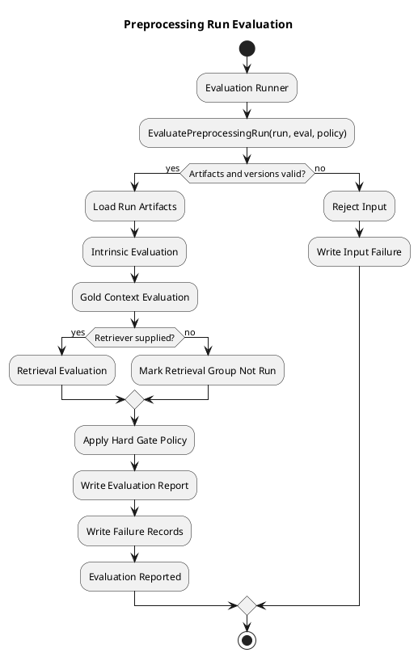
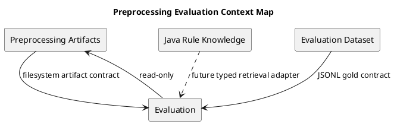
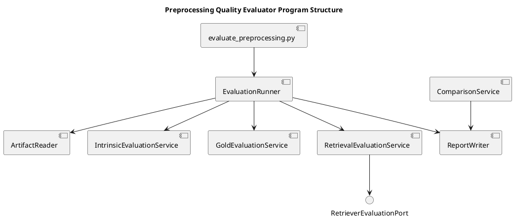
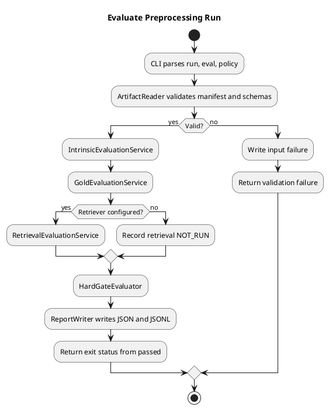

# Preprocessing Quality Evaluator Architecture Spec

## 1. Design Scope

### 1.1 Target

| 항목 | 대상 |
|---|---|
| Product Spec | `docs/specs/preprocessing-quality-evaluator-product-spec.md` |
| Use Cases | UC-01 intrinsic 평가, UC-02 gold/evidence 평가, UC-03 retrieval 평가, UC-04 run 비교 |
| Domain | preprocessing run evaluation and retrieval quality measurement |
| Bounded Contexts | Preprocessing Artifacts, Evaluation |
| Existing Services | Python preprocessing agent target ref, Java `rule-knowledge-service` as downstream retrieval boundary |
| External Dependencies | JSONL/JSON artifact files, evaluation JSONL, optional retriever, optional semantic judge |
| Affected Data | `chunks.jsonl`, `manifest.json`, `issues.jsonl`, evaluation report JSON, failure JSONL |

### 1.2 Baseline and Compatibility Boundary

The current checkout does not contain the Python preprocessing agent or its artifact schemas. The target preprocessing implementation and partial evaluation seams are present on `codex/rag-preprocessing-agent-plan`, while the current checkout contains the Java rulebook extraction/indexing pipeline under `src/rule-knowledge-service`.

This specification therefore treats the Python artifact contract as the primary v1 evaluation boundary. It does not silently reinterpret Java UUID chunk IDs as Python canonical keys. A separate adapter or compatibility plan must translate between them before production Java retrieval is evaluated.

### 1.3 Product Spec Mapping

| Product Spec | Architecture element |
|---|---|
| GOAL-01 / UC-01 | `IntrinsicEvaluationService` reads artifacts and calculates deterministic metrics |
| GOAL-02 / UC-02 | `GoldContextMapper` and `GoldEvaluationService` resolve canonical keys and evidence |
| GOAL-03 / UC-03 | typed `RetrieverEvaluationPort` calculates ranked retrieval metrics |
| GOAL-04 | report schema stores `intrinsic`, `gold`, and `retrieval` groups separately |
| GOAL-05 | `FailureRecord` taxonomy and JSONL writer |
| GOAL-06 / UC-04 | comparison service applies hard gates and ordered metric comparison |
| BR-02..BR-05 | `HardGatePolicy` owns pass/fail thresholds |
| BR-10 | artifact readers and evaluator services are read-only |
| AC-10 | `ArtifactContract` validates source/schema/pipeline compatibility before evaluation |

## 2. Domain Flow

### 2.1 Event Storming Flow



### 2.2 Commands

| Command | Actor | Target | Input | Preconditions | Result |
|---|---|---|---|---|---|
| `EvaluatePreprocessingRun` | evaluation executor | Evaluation Run | run path, eval path, policy, retriever | artifacts exist and contract validates | report and failure records |
| `ComparePreprocessingRuns` | evaluation executor | Run Comparison | run A, run B, same policy/eval set | both reports compatible | ordered metric comparison |
| `ResolveGoldContexts` | gold evaluator | Gold Mapping | canonical keys, chunks | chunk identity is valid | key-to-chunk mapping and misses |
| `EvaluateRetrievedResults` | retrieval evaluator | Retrieval Metrics | questions, gold mapping, ranked IDs | retriever contract is valid | Recall@K, MRR, evidence recall |

### 2.3 Domain Events

| Domain Event | Producer | Trigger | Payload | Consumers |
|---|---|---|---|---|
| `EvaluationStarted` | runner | input contract accepted | run ID, policy version | evaluation stages |
| `IntrinsicEvaluationCompleted` | intrinsic service | deterministic checks complete | intrinsic metrics, failures | gold evaluator |
| `GoldEvaluationCompleted` | gold service | canonical/evidence mapping complete | gold metrics, failures | retrieval evaluator |
| `RetrievalEvaluationCompleted` | retrieval service | all query results evaluated | retrieval metrics, failures | report writer |
| `EvaluationReported` | report writer | all requested stages complete | report path, passed | comparison tool |

### 2.4 Policies

| Policy | Trigger Event | Decision | Emitted Command | Owner |
|---|---|---|---|---|
| `ArtifactCompatibilityPolicy` | `EvaluationStarted` | source/schema/pipeline versions are compatible | continue or reject input | artifact boundary |
| `HardGatePolicy` | evaluation groups completed | mutation, traceability, coverage, split thresholds pass | mark passed or failed | evaluation domain |
| `RetrievalAvailabilityPolicy` | gold evaluation completed | retriever exists and is callable | run retrieval or record not-run | retrieval boundary |
| `ComparisonPriorityPolicy` | two reports loaded | compare in fixed priority order | produce comparison result | comparison service |

### 2.5 Read Models

| Read Model | Consumer | Source | Fields | Owner |
|---|---|---|---|---|
| `PreprocessingRunArtifacts` | all evaluators | run directory | manifest, chunks, source spans, issues | artifact reader |
| `GoldMapping` | gold/retrieval evaluators | chunks + eval set | key-to-chunk IDs, unresolved keys | gold evaluator |
| `PreprocessingEvaluationReport` | CLI/user/comparison | evaluation stages | run ID, passed, metric groups, gate results | report writer |
| `FailureRecordStream` | debugging/comparison | all stages | type, key/question, IDs, details | failure writer |

### 2.6 External Interactions

| External System | Trigger | Input | Output | Failure |
|---|---|---|---|---|
| Filesystem artifact run | evaluation start | run path | chunks, manifest, source metadata | missing or incompatible artifact |
| Evaluation dataset | gold evaluation | JSONL questions and keys | gold contexts/evidence | malformed or unresolved key |
| Retriever adapter | retrieval evaluation | question | ranked canonical/chunk IDs | timeout, malformed IDs, miss |
| Semantic judge | semantic candidate evaluation | bounded candidate context | split/mixed decision | unavailable/uncertain judgment |
| Java pgvector retrieval | future adapter only | owner/rulebook-scoped query | UUID chunk hits | identity and authorization mismatch |

### 2.7 Hotspots

| Hotspot | Options | Decision |
|---|---|---|
| Chunk identity | canonical key only / UUID only / explicit translation | v1 evaluator uses canonical key plus chunk ID from artifacts; production Java translation is separate |
| Retriever input | loose callable / typed port | typed `RetrieverEvaluationPort` with query and ranked ID result |
| Missing retriever | fail entire run / intrinsic-only report | intrinsic and gold report can complete; retrieval group is explicitly `NOT_RUN` |
| Semantic judge scope | all chunks / heuristic candidates only | heuristic candidates only; uncertain candidates remain visible |
| Evaluation persistence | database / run-local artifacts | run-local JSON and JSONL for reproducibility |

## 3. DDD Architecture

### 3.1 Bounded Contexts

| Bounded Context | Responsibility | Ubiquitous Language | Owned Model | Owned Data |
|---|---|---|---|---|
| Preprocessing Artifacts | publish and validate immutable preprocessing outputs | run, chunk, source span, manifest, canonical key | `PreprocessingRunArtifacts`, `ChunkRecord`, `Manifest` | `chunks.jsonl`, `manifest.json`, `issues.jsonl` |
| Evaluation | calculate quality, apply gates, compare runs | intrinsic, gold context, evidence, recall, failure, baseline | `EvaluationReport`, `MetricGroup`, `FailureRecord`, `HardGateResult` | `preprocessing_eval.json`, `preprocessing_eval_failures.jsonl` |
| Java Rule Knowledge (downstream) | production extraction, indexing, and scoped retrieval | rulebook chunk, UUID chunk ID, owner, selected rulebook | `RulebookChunk`, `RulebookIndex` | PostgreSQL/pgvector | 

### 3.2 Context Map



| Upstream | Downstream | Relationship | Contract | Translation |
|---|---|---|---|---|
| Preprocessing Artifacts | Evaluation | Published Language | manifest/chunk JSON schemas | artifact reader |
| Evaluation Dataset | Evaluation | Customer/Supplier | question, canonical key, required evidence JSONL | gold mapper |
| Java Rule Knowledge | Evaluation | future ACL | owner/rulebook-scoped ranked search | UUID-to-canonical translation, not v1 |

### 3.3 Aggregates

| Aggregate | Root | Responsibility | Commands | Events | Invariants |
|---|---|---|---|---|---|
| `EvaluationRun` | `EvaluationReport` | hold one immutable evaluation result | evaluate, report | `EvaluationReported` | one policy/eval-set identity per report |
| `GoldMapping` | mapping result | resolve canonical keys and evidence | resolve | `GoldEvaluationCompleted` | unresolved keys are explicit failures |
| `RunComparison` | comparison result | compare two compatible reports | compare | comparison completed | same metric policy and comparable versions |

### 3.4 Entities

| Entity | Aggregate | Identity | Responsibility | State |
|---|---|---|---|---|
| `ChunkRecord` | artifact read model | `chunk_id` + `canonical_key` | expose text and source spans | immutable |
| `EvaluationQuestion` | gold mapping | question ID | define query and required context | immutable |
| `FailureRecord` | evaluation report | stage/type + target identity | explain a failed observation | immutable |
| `MetricGroup` | evaluation report | group name | hold intrinsic/gold/retrieval metrics | complete/not-run |

### 3.5 Value Objects

| Value Object | Aggregate | Values | Validation | Behavior |
|---|---|---|---|---|
| `RunId` | EvaluationRun | run identifier | nonblank and manifest-compatible | report naming |
| `CanonicalKey` | ChunkRecord/GoldMapping | hierarchical key | normalized and nonblank | exact mapping |
| `RankedChunkId` | retrieval result | ID + rank | rank positive and unique | Recall/MRR input |
| `MetricValue` | MetricGroup | finite numeric value | range/denominator rules | serialization |
| `HardGatePolicy` | EvaluationRun | threshold set + version | all thresholds explicit | pass/fail decision |

### 3.6 Domain Services

| Domain Service | Responsibility | Input | Output | Collaborators |
|---|---|---|---|---|
| `IntrinsicEvaluationService` | deterministic source, boundary, size, duplicate checks | artifacts + policy | intrinsic metrics + failures | artifact reader, token counter |
| `SemanticEvaluationService` | bounded split/mixed-context assessment | heuristic candidates | semantic metrics + failures | heuristic detector, semantic judge |
| `GoldEvaluationService` | canonical/evidence coverage | chunks + eval dataset | gold metrics + mapping | gold mapper |
| `RetrievalEvaluationService` | ranked retrieval metrics | questions + mapping + port | retrieval metrics + failures | `RetrieverEvaluationPort` |
| `HardGateEvaluator` | enforce non-negotiable thresholds | metric groups + policy | gate result | metric values |
| `ComparisonService` | ordered run comparison | two reports | comparison result | priority policy |

### 3.7 Business Rule Ownership

| Business Rule | Owner | Enforcement Point |
|---|---|---|
| source mutation must be zero | HardGatePolicy | `HardGateEvaluator` |
| traceability must be at least 0.999 | HardGatePolicy | `HardGateEvaluator` |
| gold coverage must be at least 0.90 | HardGatePolicy | `HardGateEvaluator` |
| split entity rate must be at most 0.05 | HardGatePolicy | `HardGateEvaluator` |
| non-prose types skip sentence boundary rule | IntrinsicEvaluationService | content-type policy |
| atomic small chunks are not automatically tiny failures | IntrinsicEvaluationService | size classification |
| retrieval metrics are not merged into intrinsic score | EvaluationReport | report schema |
| evaluation does not mutate run/index | artifact boundary | read-only adapters |

### 3.8 Aggregate State Transitions

| Current State | Command/Event | Next State | Owner | Preconditions | Emitted Event |
|---|---|---|---|---|---|
| `REQUESTED` | `EvaluatePreprocessingRun` | `LOADING` | runner | run/eval paths supplied | `EvaluationStarted` |
| `LOADING` | artifact contract valid | `INTRINSIC_EVALUATED` | intrinsic service | artifacts readable | `IntrinsicEvaluationCompleted` |
| `INTRINSIC_EVALUATED` | gold mapping complete | `GOLD_EVALUATED` | gold service | eval dataset valid | `GoldEvaluationCompleted` |
| `GOLD_EVALUATED` | retrieval complete or skipped | `RETRIEVAL_EVALUATED` | retrieval service | port available or explicit not-run | `RetrievalEvaluationCompleted` |
| `RETRIEVAL_EVALUATED` | gates applied and files written | `REPORTED` | report writer | report serializable | `EvaluationReported` |
| any active state | input/contract failure | `FAILED` | runner | unrecoverable input | failure record |

### 3.9 Repository Boundaries

| Repository | Aggregate | Operations | Consistency Boundary |
|---|---|---|---|
| `RunArtifactReader` | PreprocessingRunArtifacts | read manifest/chunks/issues/source | one run directory |
| `EvaluationDatasetReader` | GoldMapping | stream questions/evidence | one eval JSONL |
| `EvaluationReportWriter` | EvaluationRun | write JSON/JSONL | one report directory |
| `RetrieverEvaluationPort` | RetrievalEvaluationService | ranked search | one query, read-only |

## 4. Program Design

### 4.1 Program Structure



### 4.2 Major Components and Responsibilities

| Component | Responsibility | Input | Output | Dependencies | Must Not Do |
|---|---|---|---|---|---|
| `evaluate_preprocessing.py` | CLI argument parsing and exit code | run/eval/policy paths | report location, process status | runner | calculate metrics or mutate artifacts |
| `EvaluationRunner` | orchestrate ordered stages | artifact reader, evaluators | `EvaluationReport` | all evaluator services | hide skipped retrieval |
| `RunArtifactReader` | validate/read immutable run artifacts | run path | typed artifact model | JSON/schema reader | repair source/chunks |
| `IntrinsicEvaluationService` | deterministic intrinsic metrics | artifacts | metric group + failures | tokenizer, source resolver | call retriever |
| `SemanticEvaluationService` | evaluate bounded candidates | candidate chunks | semantic metrics + failures | heuristic/judge port | judge every chunk |
| `GoldEvaluationService` | map gold keys and evidence | chunks + eval set | gold group + mapping | dataset reader | infer missing gold labels |
| `RetrievalEvaluationService` | calculate ranked metrics | mapping + retriever | retrieval group + failures | typed retriever port | change retriever/index |
| `ReportWriter` | persist report and failures | report model | JSON/JSONL artifacts | filesystem | overwrite input run artifacts |
| `ComparisonService` | compare compatible reports | report A/B | comparison output | priority policy | invent a single composite score |

### 4.3 Application Flow



### 4.4 Component Call Contracts

| Order | Caller | Callee | Operation | Input | Output | Failure |
|---:|---|---|---|---|---|---|
| 1 | CLI | Runner | `evaluate` | run/eval/policy | report | invalid args |
| 2 | Runner | ArtifactReader | `read` | run path | typed artifacts | missing/schema/version error |
| 3 | Runner | Intrinsic service | `evaluate` | artifacts | intrinsic group | malformed source span |
| 4 | Runner | Gold service | `evaluate` | chunks/eval set | gold group + mapping | malformed/unresolved gold |
| 5 | Runner | Retrieval service | `evaluate` | mapping + retriever | retrieval group | port/result error |
| 6 | Runner | Gate evaluator | `apply` | all groups + policy | gate result | invalid metric denominator |
| 7 | Runner | Report writer | `write` | full report/failures | output paths | filesystem write error |

### 4.5 Major Types

| Type | Kind | Responsibility | State | Dependencies |
|---|---|---|---|---|
| `PreprocessingRunArtifacts` | immutable data model | expose validated run data | loaded | artifact reader |
| `ChunkRecord` | domain value/entity | expose canonical key, text, spans, type | immutable | none |
| `EvaluationQuestion` | domain value | query and gold requirements | immutable | dataset reader |
| `EvaluationReport` | aggregate root | combine metric groups and gate result | reported | metric groups |
| `FailureRecord` | entity | explain one failure | immutable | taxonomy |
| `RetrieverEvaluationPort` | output port | return ranked IDs for a question | external | adapter |

### 4.6 Type Design

#### `RetrieverEvaluationPort`

```python
class RetrieverEvaluationPort(Protocol):
    def retrieve(self, query: str, *, top_k: int) -> Sequence[RankedChunkId]: ...
```

| 항목 | 정의 |
|---|---|
| Responsibility | provide deterministic ranked IDs for one evaluation query |
| Caller | `RetrievalEvaluationService` |
| Implementer | fixture/precomputed adapter in v1; Java pgvector adapter later |
| Must Not Depend On | report writer or evaluator internals |

#### `EvaluationReport`

| Field | Type | Meaning | Constraint |
|---|---|---|---|
| `run_id` | string | evaluated run identity | nonblank |
| `passed` | boolean | hard gate result | false on any hard gate |
| `intrinsic` | object | source/boundary/size/duplicate metrics | always present after intrinsic stage |
| `gold` | object | coverage/answerability/evidence metrics | present when eval set loaded |
| `retrieval` | object | ranked metrics | complete or explicit `NOT_RUN` |
| `policy_version` | string | threshold/config identity | nonblank |

#### `FailureRecord`

| Field | Type | Meaning | Constraint |
|---|---|---|---|
| `type` | enum | taxonomy category | known category |
| `canonical_key` | string/null | failed semantic unit | required for chunk/gold failures |
| `chunk_ids` | array | affected chunks | unique IDs |
| `question_id` | string/null | affected eval question | required for retrieval/gold failures |
| `details` | string | reproducible explanation | nonblank |

### 4.7 Interfaces and Function Signatures

```python
class RunArtifactReader(Protocol):
    def read(self, run_path: Path) -> PreprocessingRunArtifacts: ...

class EvaluationDatasetReader(Protocol):
    def read(self, path: Path) -> Iterable[EvaluationQuestion]: ...

class EvaluationRunner:
    def evaluate(
        self,
        run_path: Path,
        eval_path: Path,
        policy: EvaluationPolicy,
        retriever: RetrieverEvaluationPort | None = None,
    ) -> EvaluationReport: ...

class ComparisonService:
    def compare(
        self,
        baseline: EvaluationReport,
        variant: EvaluationReport,
    ) -> RunComparison: ...
```

### 4.8 Test Boundaries

| Boundary | Required tests |
|---|---|
| Artifact reader | schema/version rejection, source span reconstruction, read-only behavior |
| Intrinsic evaluator | mutation, traceability, boundary exceptions, tiny/oversized, exact/near duplicate |
| Semantic evaluator | split entity, mixed context heuristic, non-prose exclusions, uncertain judge |
| Gold evaluator | resolved/unresolved canonical keys, single-chunk answerability, evidence completeness |
| Retrieval evaluator | Recall@K, MRR, ties/duplicates, empty results, malformed result rejection |
| Hard gates | each threshold and combined pass/fail |
| Report writer | stable JSON schema, JSONL failure records, explicit retrieval NOT_RUN |
| Comparison | incompatible versions, metric priority, trade-offs, no composite score |
| CLI/integration | requested command produces both output files without mutating input run |

## 5. Migration and Delivery Constraints

- First establish the target Python preprocessing-agent ref or port its artifact contract into the active branch; evaluator tickets must not assume files absent from the active checkout silently exist.
- Keep v1 retrieval evaluation against precomputed results or a fixture adapter until canonical-key translation to Java UUID chunks is explicitly designed and tested.
- Do not change Java production indexing or retrieval as part of intrinsic evaluator work.
- Preserve the existing Java rulebook evaluation suite as a separate downstream behavior evaluation; it is not a replacement for preprocessing quality evaluation.
- Every report records artifact schema/pipeline versions so future Python-to-Java adapters can reject incompatible runs.
