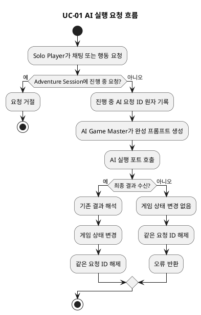
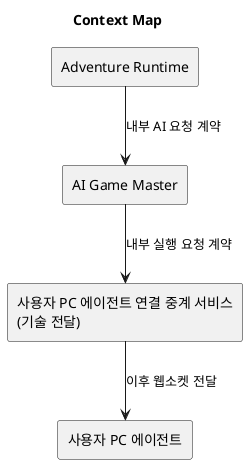
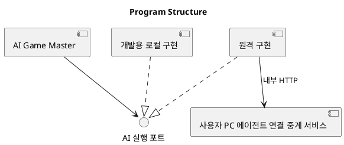
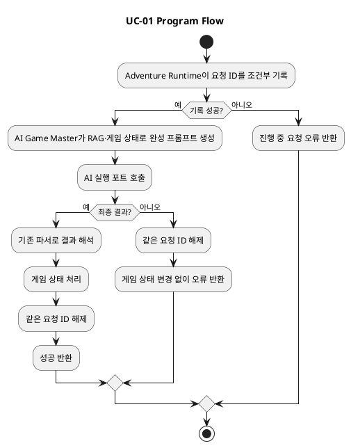
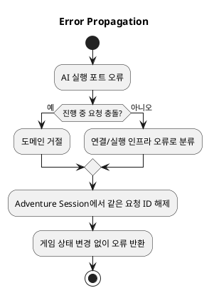
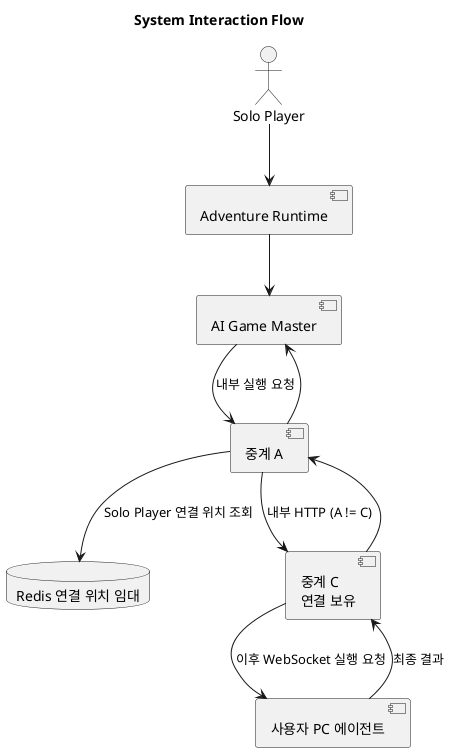
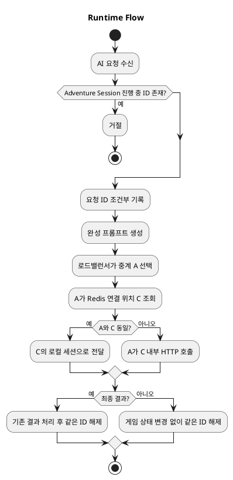
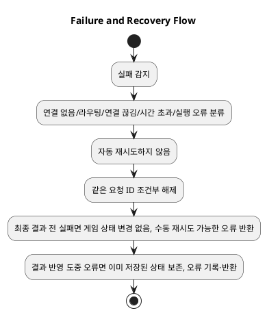

# Architecture Spec — 원격 Codex 사용자 PC 에이전트 실행 요청 창구

# 1. Design Scope

## 1.1 Target

| 항목 | 대상 |
| --- | --- |
| Product Spec | `docs/specs/remote-codex-agent-port/product-spec.md` |
| Use Cases | UC-01 AI Game Master 요청 실행 |
| Domain | 모험 진행 중 AI 실행 요청 |
| Bounded Contexts | Adventure Runtime, AI Game Master |
| Existing Services | `adventure-service`, `ai-game-master-service` |
| Added Deployment Service | `agent-connection-relay-service` — 사용자 PC 에이전트 연결 중계 서비스 |
| External Dependencies | Redis, 사용자 PC 에이전트, 사용자 PC의 Codex app-server, OpenAI Codex |
| Affected Data | Adventure Session의 진행 중인 AI 요청 ID, Redis의 휘발성 연결 위치 임대 |

## 1.2 Product Spec Mapping

| Product Spec 항목 | Architecture 요소 |
| --- | --- |
| UC-01 서버 Codex 실행 통일 | AI 실행 포트와 개발용·원격 구현체 |
| Solo Player 소유 실행 | 서버가 확정한 Solo Player ID를 요청 계약에 포함 |
| 세션당 요청 하나 | Adventure Runtime의 진행 중 요청 ID 원자 갱신 |
| 최종 결과만 반환 | 원격 실행 포트의 단일 최종 텍스트 또는 오류 계약 |
| 연결 없음·끊김·시간 초과 | 중계 서비스 오류 분류, 요청 ID 해제, 수동 재시도 |
| 배포 산출물에 로컬 Codex 없음 | 개발 전용 Gradle 모듈과 개발 프로필 조립 |

---

# 2. Domain Flow

## 2.1 Event Storming Flow



## 2.2 Commands

| Command | Actor | Target | Input | Preconditions | Result |
| --- | --- | --- | --- | --- | --- |
| AI 실행 요청 시작 | Solo Player | Adventure Session | 기존 채팅 또는 행동 입력 | 진행 중 요청 ID 없음 | 요청 ID 기록 또는 거절 |
| AI 실행 요청 전달 | AI Game Master | AI 실행 포트 | Solo Player ID, 요청 ID, 완성 프롬프트, 모델, 추론 설정, 출력 형식, 기존 이미지 입력 | 요청 ID가 기록됨 | 최종 텍스트 또는 유형화한 오류 |
| 진행 중 요청 해제 | AI 실행 완료 처리 | Adventure Session | 같은 요청 ID, 성공 또는 실패 종류 | 저장된 ID와 일치 | 다음 수동 요청 허용 |

## 2.3 Domain Events

| Domain Event | Producer | Trigger | Payload | Consumers |
| --- | --- | --- | --- | --- |
| AI 실행 요청 수락 | Adventure Runtime | 진행 중 ID를 원자 기록 | Adventure Session ID, 요청 ID | AI Game Master 호출 흐름 |
| AI 실행 완료 | AI 실행 포트 | 최종 텍스트 수신 | 요청 ID, 최종 텍스트 | 기존 AI Game Master 결과 해석 |
| AI 실행 실패 | AI 실행 포트 | 연결 없음·시간 초과·연결 끊김·실행 오류 | 요청 ID, 실패 종류 | Adventure Runtime의 요청 해제·오류 반환 |

이 티켓은 이벤트 브로커를 추가하지 않는다. 위 이벤트는 구현상 동기 호출 흐름의 상태 전이 이름이다.

## 2.4 Policies

| Policy | Trigger Event | Decision | Emitted Command | Owner |
| --- | --- | --- | --- | --- |
| 세션 중복 요청 방지 | AI 실행 요청 시작 | 진행 중 ID가 있으면 저장 없이 거절 | 없음 | Adventure Runtime |
| 실패 후 수동 재시도 허용 | AI 실행 실패 | 같은 요청 ID만 해제 | 진행 중 요청 해제 | Adventure Runtime |

## 2.5 Read Models

| Read Model | Consumer | Source | Fields | Owner |
| --- | --- | --- | --- | --- |
| Redis 연결 위치 임대 | 사용자 PC 에이전트 연결 중계 서비스 | 사용자 PC 에이전트 연결 | Solo Player ID, 인스턴스 ID, 내부 주소, 세션/연결 ID, 만료 시각 | 사용자 PC 에이전트 연결 중계 서비스 |

## 2.6 External Interactions

| External System | Trigger | Input | Output | Failure |
| --- | --- | --- | --- | --- |
| Redis | 중계 인스턴스가 연결 위치 조회 | Solo Player ID | 연결 보유 인스턴스 위치 | 임대 없음·Redis 오류 → 실행 실패 |
| 사용자 PC 에이전트 | 연결 보유 인스턴스가 실행 전달 | 이미 완성된 프롬프트와 실행 옵션 | 최종 텍스트 또는 오류 | 연결 없음·끊김·시간 초과 → 실행 실패 |
| 사용자 PC의 Codex app-server | 사용자 PC 에이전트가 실행 | 실행 요청 | 최종 텍스트 또는 오류 | 사용자 PC 에이전트가 오류 반환 |

## 2.7 Hotspots

| Hotspot | Options | Decision |
| --- | --- | --- |
| 장기 연결 확장 | 단일 JVM / 여러 중계 인스턴스 | Redis 연결 위치 임대와 연결 보유 인스턴스 직접 내부 호출 |
| 작업 보존 | 영속 작업 대기열 / 휘발성 전달 | 작업 대기열·작업 DB 없이 한 번 전달, 실패 후 수동 재시도 |
| 로컬 Codex 격리 | `@Profile`만 사용 / 개발 전용 모듈 | 운영 산출물에서 코드·의존성을 제외하는 개발 전용 Gradle 모듈 |

---

# 3. DDD Architecture

## 3.1 Bounded Contexts

| Bounded Context | Responsibility | Ubiquitous Language | Owned Model | Owned Data |
| --- | --- | --- | --- | --- |
| Adventure Runtime | 모험 세션의 요청 수락·중복 방지·게임 상태 전이 | Adventure Session, 진행 중인 AI 요청 ID | Adventure Session | 진행 중 AI 요청 ID와 게임 상태 |
| AI Game Master | RAG와 게임 상태를 사용한 완성 프롬프트 생성·최종 결과 해석 | AI 실행 요청, 완성 프롬프트, 최종 결과 | AI 실행 요청/결과 변환 | 기존 RAG·게임 상태 참조 범위 |

사용자 PC 에이전트 연결 중계 서비스는 새 Bounded Context가 아니다. 독립 업무 언어·데이터 생명주기·업무 규칙이 없고 AI Game Master의 실행 전달을 지원하는 기술 능력이다.

## 3.1.1 Boundary Decisions

| Capability | Owner Context | Candidate Boundary | Chosen Boundary | Why Not Weaker? | Why Not Stronger? |
| --- | --- | --- | --- | --- | --- |
| AI 실행 요청 추상화 | AI Game Master | 내부 capability | 포트와 구현체 | 기존 직접 Codex 호출이 여러 경로에 있어 실행 위치 교체 경계 필요 | 별도 업무 context는 새 업무 규칙·데이터가 없어 불필요 |
| 개발 로컬 Codex 실행 | AI Game Master | package / module | 개발 전용 Gradle 모듈 | `@Profile`만으로는 운영 산출물에 실행 코드·의존성이 남음 | 독립 서비스는 개발 도구를 별도 운영할 이유 없음 |
| 사용자 PC 연결 전달 | AI Game Master 지원 capability | package / module / service | 독립 배포 서비스 | Netty 장기 연결의 독립 확장·장애 격리·배포가 필요하고 기존 AI 서비스 런타임과 다름 | 새 Bounded Context는 독립 업무 모델이 없어 과도함 |

## 3.2 Context Map



| Upstream | Downstream | Relationship | Contract | Translation |
| --- | --- | --- | --- | --- |
| Adventure Runtime | AI Game Master | Customer/Supplier | 기존 내부 AI 요청 | 기존 변환 |
| AI Game Master | 사용자 PC 에이전트 연결 중계 서비스 | Customer/Supplier | 내부 실행 요청·최종 결과 또는 오류 | 포트 구현체 |
| 사용자 PC 에이전트 연결 중계 서비스 | 사용자 PC 에이전트 | Published Language 예정 | 공개 웹소켓 계약 | 이번 범위 밖 |

## 3.3 Aggregates

| Aggregate | Root | Responsibility | Commands | Events | Invariants |
| --- | --- | --- | --- | --- | --- |
| Adventure Session | Adventure Session | 같은 세션의 AI 요청 하나 보장 | 요청 수락, 요청 해제 | AI 실행 요청 수락/실패/완료 | 진행 중 AI 요청 ID는 없거나 하나이며, 해제는 같은 요청 ID만 가능 |

## 3.4 Entities

| Entity | Aggregate | Identity | Responsibility | State |
| --- | --- | --- | --- | --- |
| Adventure Session | Adventure Session | Adventure Session ID | 진행 중 AI 요청 ID 소유 | 없음 또는 요청 ID 하나 |

## 3.4.1 Class Diagram

원본: `docs/specs/remote-codex-agent-port/diagrams/architecture/ai-execution.class.puml`<br>
SVG: [AI 실행 구조](diagrams/architecture/ai-execution.class.svg)

이 구조는 AI 실행 포트, 개발용 구현, 원격 구현, 중계 서비스의 책임·의존 관계를 표현한다.

## 3.5 Value Objects

| Value Object | Aggregate | Values | Validation | Behavior |
| --- | --- | --- | --- | --- |
| AI 실행 요청 | 해당 없음 — AI Game Master application 계약 | Solo Player ID, 요청 ID, 작업 ID, 완성 프롬프트, 모델, 추론 설정, 출력 형식, 이미지 입력 | 서버가 확정한 Solo Player ID, 필수 요청 ID | 실행 대상에 전달 |
| 연결 위치 임대 | 해당 없음 — 중계 서비스 기술 상태 | 인스턴스 ID, 내부 주소, 세션/연결 ID, 만료 | 연결 ID 일치 시에만 삭제 | 연결 갱신·만료 |

## 3.6 Domain Services

| Domain Service | Responsibility | Input | Output | Collaborators |
| --- | --- | --- | --- | --- |
| 해당 없음 | AI 실행 전달은 외부 효과를 조정하는 application/인프라 책임 | - | - | - |

## 3.7 Business Rule Ownership

| Business Rule | Owner | Enforcement Point |
| --- | --- | --- |
| 세션당 진행 중 AI 요청 하나 | Adventure Session | 요청 수락 시 원자 갱신 |
| 같은 요청 ID만 해제 | Adventure Session | 완료·실패·시간 초과·연결 끊김 처리 |
| 요청 Solo Player의 연결만 사용 | 사용자 PC 에이전트 연결 중계 서비스 | Redis 위치 조회와 연결 보유 인스턴스 전달 |
| 서버 Codex 직접 호출 금지 | AI Game Master 모듈 경계 | AI 실행 포트만 의존 |

## 3.8 Aggregate State Transitions

| Current State | Command / Event | Next State | Owner | Preconditions | Emitted Event |
| --- | --- | --- | --- | --- | --- |
| 진행 중 요청 없음 | AI 실행 요청 시작 | 진행 중 요청 하나 | Adventure Session | 원자 갱신 성공 | AI 실행 요청 수락 |
| 진행 중 요청 하나 | 새 AI 실행 요청 | 진행 중 요청 하나 | Adventure Session | 기존 ID 존재 | 거절 |
| 진행 중 요청 하나 | 같은 요청 ID 완료/실패 | 진행 중 요청 없음 | Adventure Session | ID 일치 | AI 실행 완료/실패 |

## 3.8.1 State Diagram

해당 없음 — Product Spec의 Adventure Session 업무 상태 전이와 같은 목적이므로 중복 다이어그램을 만들지 않는다.

## 3.9 Repository Boundaries

| Repository | Aggregate | Operations | Consistency Boundary |
| --- | --- | --- | --- |
| 기존 Adventure Session 저장소 | Adventure Session | 진행 중 요청 ID 조건부 기록·같은 ID 조건부 해제 | Adventure Session 단위의 트랜잭션 또는 낙관적 잠금 |

---

# 4. Program Design

## 4.1 Program Structure



## 4.2 Major Components and Responsibilities

| Component | Responsibility | Input | Output | Dependencies | Must Not Do |
| --- | --- | --- | --- | --- | --- |
| AI 실행 포트 | 모든 서버 Codex 실행의 공통 호출 계약 | AI 실행 요청 | 최종 텍스트 또는 유형화한 오류 | 없음 | 프롬프트 생성·결과 해석을 소유하지 않음 |
| 개발용 로컬 구현 | 기존 로컬 `CodexAppServerClient` 경로 호환 | AI 실행 요청 | 기존 의미의 결과/오류 | 개발 전용 Codex 클라이언트 | 운영 산출물에 포함되지 않음 |
| 원격 구현 | 중계 서비스 내부 API 호출 | AI 실행 요청 | 최종 텍스트 또는 오류 | 중계 서비스 클라이언트 | Codex·RAG·웹소켓 세션을 직접 다루지 않음 |
| 사용자 PC 에이전트 연결 중계 서비스 | 위치 조회, 연결 보유 인스턴스 전달, 요청 ID 상관관계 | 이미 완성된 실행 요청 | 최종 텍스트 또는 오류 | Redis, 내부 HTTP, 이후 웹소켓 | 프롬프트 생성, RAG 조회, Codex 실행, 게임 상태 기록, 비밀값 저장 |
| AI Game Master 결과 해석 | 원시 최종 텍스트를 기존 결과로 해석 | 최종 텍스트 | 기존 응답 | 기존 파서 | 중계 세부사항 인식 |

## 4.3 Application Flow



## 4.4 Component Call Contracts

| Order | Caller | Callee | Operation | Input | Output | Failure |
| ---: | --- | --- | --- | --- | --- | --- |
| 1 | Adventure Runtime | AI Game Master | 기존 내부 AI 요청 | 기존 입력과 서버 확정 Solo Player ID | 기존 결과 | 진행 중 요청 존재 |
| 2 | AI Game Master | AI 실행 포트 | `execute` | 완성 AI 실행 요청 | 원시 최종 텍스트 또는 오류 | 구현별 오류 |
| 3 | 원격 구현 | 중계 서비스 | 내부 실행 요청 | Solo Player ID, 요청 ID, 완성 프롬프트, 모델·추론·출력 형식·이미지 입력 | 최종 텍스트 또는 오류 | 연결 없음·전달 실패 |
| 4 | 중계 A | 연결 보유 중계 C | 내부 소유 연결 실행 요청 | 3과 동일 | 최종 텍스트 또는 오류 | 임대 없음·C 접근 실패 |

## 4.5 Major Types

| Type | Kind | Responsibility | State | Dependencies |
| --- | --- | --- | --- | --- |
| AI 실행 포트 | Port | 실행 위치를 숨긴 공통 계약 | 없음 | 요청·결과 계약 |
| 개발용 로컬 AI 실행 구현 | Adapter | 기존 로컬 Codex 실행 호환 | 기존 app-server 수명주기 | `CodexAppServerClient` |
| 원격 AI 실행 구현 | Adapter | 중계 서비스 내부 호출 | 없음 | 내부 HTTP 클라이언트 |
| 연결 위치 저장소 | Port | Solo Player의 현재 연결 보유 인스턴스 조회·임대 갱신 | 휘발성 임대 | Redis 구현 |
| 연결 보유 실행 처리기 | Application Service | 로컬 웹소켓 세션으로 전달하고 요청 ID 결과 대기 | 요청 ID별 대기 상태 | 세션 저장소 |

## 4.6 Type Design

### AI 실행 포트

| 항목 | 정의 |
| --- | --- |
| Kind | Port |
| Responsibility | AI Game Master가 실행 위치와 무관하게 최종 결과를 요청하게 함 |
| Dependencies | AI 실행 요청·결과 계약 |
| Must Not Depend On | Codex app-server, Redis, WebSocket 구현 |

#### State

| Field | Type | Meaning | Constraint |
| --- | --- | --- | --- |
| 해당 없음 | - | 무상태 포트 | - |

#### Behavior

| Method | Input | Output | Responsibility | State Change |
| --- | --- | --- | --- | --- |
| `execute` | AI 실행 요청 | 최종 텍스트 또는 유형화한 오류 | 실행 구현에 위임 | 없음 |

#### Invariants

| Invariant | Enforcement Point |
| --- | --- |
| 요청에는 서버가 확정한 Solo Player ID와 요청 ID가 있다 | 요청 생성·검증 |
| 중간 생성 내용은 반환하지 않는다 | 포트 결과 계약 |

## 4.7 Interfaces and Function Signatures

### AI 실행 포트

```java
interface AiExecutionPort {
    AiExecutionResult execute(AiExecutionRequest request);
}
```

`AiExecutionRequest`는 기존 외부 식별자를 유지할 수 있으나, 의미는 **서버가 확정한 Solo Player ID, 요청 ID, 작업 ID, 완성 프롬프트, 모델, 추론 설정, 출력 형식, 기존 이미지 입력**이다.

| 항목 | 정의 |
| --- | --- |
| Responsibility | 모든 서버 Codex 실행의 단일 진입점 |
| Caller | AI Game Master의 기존 Codex 호출 경로 |
| Implementer | 개발용 로컬 구현, 원격 구현 |
| Input | 위 AI 실행 요청 |
| Output | 원시 최종 텍스트 또는 유형화한 오류 |
| Preconditions | Solo Player ID·요청 ID 존재, 프롬프트는 서버에서 완성됨 |
| Postconditions | 성공 시 최종 텍스트 하나, 실패 시 원인 분류 |
| Errors | 활성 연결 없음, 시간 초과, 연결 끊김, 전달 오류, 로컬 실행 오류 |
| Side Effects | 구현체가 외부 실행 또는 전달 수행 |
| Idempotency | 자동 재시도·중복 실행 없음; Adventure Session의 진행 중 ID가 중복 진입을 차단 |

## 4.8 Error Propagation



| Failure Point | Source Error | Converted Error | Handler | Result |
| --- | --- | --- | --- | --- |
| Adventure Session | 진행 중 ID 존재 | 진행 중 요청 오류 | Adventure Runtime | 새 요청 거절 |
| 원격 구현 | 연결 위치 없음 | 활성 사용자 PC 에이전트 없음 | AI Game Master | 상태 유지·수동 재시도 |
| 중계 서비스 | 시간 초과·연결 끊김·C 장애 | 원격 실행 실패 | AI Game Master | 상태 유지·수동 재시도 |
| 개발용 로컬 구현 | 기존 Codex 실행 오류 | 기존 오류 의미 | AI Game Master | 기존 흐름 유지 |

## 4.9 State Transition Implementation

| State Transition | Domain Owner | Method | Persistence Point | Published Event |
| --- | --- | --- | --- | --- |
| 없음 → 요청 ID 하나 | Adventure Session | 조건부 요청 수락 | 기존 Adventure Session 저장소 | AI 실행 요청 수락 |
| 요청 ID 하나 → 없음 | Adventure Session | 같은 ID 조건부 해제 | 기존 Adventure Session 저장소 | AI 실행 완료/실패 |

## 4.10 Dependency Rules

### Allowed Dependencies

| Source | Target | Contract |
| --- | --- | --- |
| AI Game Master | AI 실행 포트 | `AiExecutionPort` |
| 개발 전용 모듈 | 기존 로컬 Codex 클라이언트 | 개발 전용 adapter |
| 원격 구현 | 중계 서비스 | 인증된 내부 HTTP |
| 중계 서비스 | Redis | 연결 위치 저장소 포트 |
| 중계 A | 중계 C | 인증된 내부 HTTP |

### Forbidden Dependencies

| Source | Forbidden Target |
| --- | --- |
| AI Game Master 도메인 흐름 | `CodexAppServerClient` 직접 호출 |
| 운영 산출물 | 개발용 로컬 Codex 모듈·의존성 |
| 중계 서비스 | RAG·게임 데이터베이스·Codex 인증 정보 |
| Redis | 프롬프트·응답·RAG 자료·Codex 로그인 정보 저장 |

---

# 5. Technical Architecture

## 5.1 Boundary Mapping

| Bounded Context | Internal Capability | Code Boundary | Deployment Unit | Boundary Rationale |
| --- | --- | --- | --- | --- |
| AI Game Master | AI 실행 포트·원격 구현 | 기존 서비스 모듈의 port/adapter | 기존 `ai-game-master-service` | 프롬프트 생성·결과 해석 소유 유지 |
| AI Game Master | 개발 로컬 Codex 실행 | 별도 개발 전용 Gradle 모듈 | 개발 환경에서만 조립 | 운영 artifact 격리 |
| AI Game Master 지원 | 사용자 PC 연결 전달 | 별도 Gradle 모듈 | `agent-connection-relay-service` | Netty 장기 연결 독립 확장·장애 격리 |
| Adventure Runtime | 진행 중 요청 하나 제한 | 기존 Adventure Session 구성 | 기존 `adventure-service` | 게임 상태 일관성 소유 유지 |

## 5.2 Boundary Promotion Decisions

| Candidate | Owner Context | Chosen Boundary | Why Not Weaker? | Why Not Stronger? | Introduced Cost |
| --- | --- | --- | --- | --- | --- |
| 개발 로컬 Codex | AI Game Master | Gradle 모듈 | 프로필만으로 운영 artifact 제외 불가 | 별도 서비스 운영 불필요 | 빌드 조립·테스트 분리 |
| 사용자 PC 연결 중계 | AI Game Master 지원 | 독립 서비스 | package/module은 Netty 런타임·장기 연결을 AI 서비스와 독립 배포·확장·장애 격리 못 함 | 독립 업무 context는 불필요 | 내부 HTTP, Redis, 서비스 배포·관찰 |

## 5.3 System Interaction Flow



## 5.4 Synchronous Communication

| Caller | Provider | Protocol | Operation | Request | Response | Timeout |
| --- | --- | --- | --- | --- | --- |
| AI Game Master | 중계 서비스 로드밸런서 | 내부 HTTP | 실행 요청 | AI 실행 요청 전체 | 최종 텍스트 또는 오류 | 기존 AI 실행 시간 초과 의미를 유지 |
| 중계 A | Redis | Redis protocol | 연결 위치 조회 | Solo Player ID | C의 위치 임대 | 짧은 인프라 시간 초과 |
| 중계 A | 중계 C | 인증된 내부 HTTP | 소유 연결 실행 | AI 실행 요청 전체 | 최종 텍스트 또는 오류 | 원 요청의 남은 시간 |

## 5.5 API Contracts

### `POST /internal/executions` 및 소유 연결 인스턴스의 내부 실행 endpoint

공개 API가 아니다. 정확한 경로·JSON 필드명은 구현에서 정하되 계약 의미는 고정한다.

#### Request

```json
{
  "soloPlayerId": "서버가 확정한 Solo Player 식별자",
  "requestId": "요청 상관관계 식별자",
  "operationId": "AI 작업 식별자",
  "prompt": "서버가 완성한 프롬프트",
  "model": "선택 모델",
  "reasoning": "추론 설정",
  "outputSchema": "출력 형식",
  "imageInputs": "기존 이미지 입력"
}
```

#### Response

```json
{
  "requestId": "요청 상관관계 식별자",
  "content": "최종 텍스트 또는 유형화한 오류"
}
```

#### Errors

| Condition | Status / Code | Response |
| --- | --- | --- |
| 내부 토큰 없음·불일치 | 인증 오류 | 실행하지 않음 |
| 연결 위치 임대 없음 | 활성 사용자 PC 에이전트 없음 | 요청 ID와 실패 종류 |
| C 도달 실패·세션 없음 | 전달 실패 | 요청 ID와 실패 종류 |
| 사용자 PC 결과 시간 초과·연결 끊김 | 원격 실행 실패 | 요청 ID와 실패 종류 |

#### Properties

| Property | Value |
| --- | --- |
| Authentication | 기존 Internal Service Token |
| Authorization | 내부 서비스 호출자만 허용 |
| Idempotency | 자동 재시도 없음; 요청 ID는 상관관계·세션 중복 차단에 사용 |
| Timeout | 기존 AI 실행 시간 초과 의미 유지; C는 남은 시간만 사용 |
| Compatibility | 기존 최종 결과·오류 의미를 유지 |

## 5.6 Asynchronous Communication

| Producer | Consumer | Channel | Message | Delivery | Ordering |
| --- | --- | --- | --- | --- |
| 해당 없음 | 해당 없음 | 영속 메시지 큐·Pub/Sub 없음 | 없음 | 해당 없음 | 해당 없음 |

## 5.7 Message Contracts

공개 웹소켓 `HELLO`, 실행, 결과, 오류 메시지 계약은 해당 없음 — 연결 등록·인증과 함께 다음 작업에서 정한다. 이번 티켓은 공개 웹소켓 endpoint를 열지 않는다.

## 5.8 Data Ownership

| Data | Owner | Storage | Key / Schema | Readers | Writers |
| --- | --- | --- | --- | --- | --- |
| 진행 중 AI 요청 ID | Adventure Runtime | 기존 Adventure Session 저장소 | Adventure Session ID | Adventure Runtime | Adventure Runtime |
| 연결 위치 임대 | 사용자 PC 에이전트 연결 중계 서비스 | Redis | Solo Player ID → instance ID, 내부 주소, 세션/연결 ID, 만료 | 중계 인스턴스 | 연결 보유 중계 인스턴스 |
| 웹소켓 세션·요청 ID 대기 | 사용자 PC 에이전트 연결 중계 서비스 | 연결 보유 C의 JVM 메모리 | 세션/연결 ID·요청 ID | C | C |
| 프롬프트·RAG·게임 데이터 | AI Game Master 및 기존 소유자 | 기존 저장소 | 기존 키 | 기존 구성 | 기존 구성 |

Redis에는 프롬프트, 결과, RAG 자료, Codex 로그인 정보, 사용자 인증 비밀값을 저장하지 않는다.

## 5.9 Schema Changes

| Target | Action | Schema Change | Migration | Compatibility |
| --- | --- | --- | --- | --- |
| Adventure Session | Modify | 진행 중 AI 요청 ID의 조건부 저장 지원 | 기존 저장 구조에 맞춘 migration | 기존 세션은 요청 없음으로 해석 |
| Redis 임대 키 | Add | 휘발성 연결 위치 key와 TTL | 데이터 migration 없음 | 임대 만료는 연결 없음 |

## 5.10 Consistency Model

| Operation | Consistency | Source of Truth | Synchronization | Recovery |
| --- | --- | --- | --- | --- |
| 세션 요청 수락/해제 | 강함 | Adventure Session | 트랜잭션 또는 낙관적 잠금 조건부 갱신 | 실패도 같은 ID 조건부 해제 |
| 연결 위치 | 최종 일관성·TTL | Redis 임대와 C 메모리 세션 | 연결 시 갱신, 연결 ID 일치 시 삭제 | 임대 없음은 실행 실패 |
| 원격 실행 전달 | 한 번 전달 | C의 현재 연결 | 동기 내부 HTTP와 요청 ID 상관관계 | 자동 재전달 없이 수동 재시도 |

## 5.11 Infrastructure Dependencies

| Dependency | Responsibility | Accessed By | Isolation Boundary |
| --- | --- | --- | --- |
| Redis | 다중 중계 인스턴스의 연결 위치 임대 | 중계 서비스 | 연결 위치 저장소 adapter |
| 기존 Internal Service Token | 내부 HTTP 보호 | AI Game Master, 중계 서비스 | 내부 HTTP 인증 filter/client |
| 사용자 PC의 Codex app-server | 실제 Codex 실행 | 사용자 PC 에이전트만 | 사용자 PC 에이전트 경계 |

## 5.12 External Dependency Isolation

| External Dependency | Port | Adapter | Internal Model | Conversion Point |
| --- | --- | --- | --- | --- |
| 서버 로컬 Codex app-server | AI 실행 포트 | 개발 전용 로컬 구현 | AI 실행 요청/결과 | 개발 모듈 adapter |
| 사용자 PC 에이전트 | AI 실행 포트 | 원격 구현·중계 내부 HTTP | AI 실행 요청/결과 | 원격 adapter |
| Redis | 연결 위치 저장소 | Redis adapter | 연결 위치 임대 | 중계 서비스 |

## 5.13 File and Module Structure

### Existing Structure

```text
src/
  ai-game-master-service/
    ... GmCompletionAdapter, GmCompletionRouter
    ... CodexAppServerClient
    ... ResolutionCandidateController
    ... CodexCliCharacterTagProvider
  adventure-service/
    ... typed runtime agent 내부 HTTP 호출
```

### Target Structure

```text
src/
  ai-game-master-service/
    ... AI 실행 포트와 원격 구현
  ai-game-master-service-local-codex-dev/ (개발 전용 Gradle 모듈)
    ... 로컬 Codex 구현과 기존 app-server adapter
  agent-connection-relay-service/
    ... WebFlux + Netty runtime
    ... 연결 위치 저장소 포트와 Redis 구현
    ... 인증된 내부 실행 endpoint·소유 연결 전달
  adventure-service/
    ... Adventure Session 진행 중 요청 ID 조건부 갱신
```

### File Change Map

| Path | Action | Type / Component | Responsibility |
| --- | --- | --- | --- |
| `src/ai-game-master-service/...` | Modify | 기존 Codex 호출 경로 | 모두 AI 실행 포트로 수렴 |
| `src/ai-game-master-service/...` | Add | AI 실행 포트·원격 구현 | 공통 계약과 중계 호출 |
| `src/ai-game-master-service-local-codex-dev/...` | Add | 개발용 로컬 구현 | 개발 환경 호환, 운영 artifact 제외 |
| `src/agent-connection-relay-service/...` | Add | 중계 서비스 | Netty runtime, Redis 위치 조회, 내부 전달 |
| `src/adventure-service/...` | Modify | Adventure Session 요청 제어 | 요청 ID 원자 기록·일치 해제 |
| 기존 테스트 구조 | Modify/Add | 단위·통합·부하 검증 | 아래 검증 요구사항 |

---

# 6. Runtime Design

## 6.1 Runtime Flow



## 6.2 Concurrent Access

| Shared Resource | Concurrent Actors | Conflict |
| --- | --- | --- |
| Adventure Session 진행 중 요청 ID | 같은 세션의 동시 채팅·행동 요청 | 중복 실행·게임 상태 순서 꼬임 |
| Redis 연결 위치 | 이전 연결 종료와 새 연결 | 이전 종료가 새 연결 위치 삭제 |
| C의 요청 ID 대기 상태 | 결과·시간 초과·연결 끊김 | 중복 완료·잘못된 요청 완료 |

## 6.3 Concurrency Control

| Target | Control Unit | Strategy | Owner | Timeout |
| --- | --- | --- | --- | --- |
| Adventure Session | 세션 ID | 트랜잭션 또는 낙관적 잠금의 조건부 기록 | Adventure Runtime | 기존 요청 시간 초과와 같은 해제 경로 |
| Redis 연결 위치 | Solo Player ID + 연결 ID | TTL 임대, 연결 ID 일치 조건 삭제 | 중계 C | 임대 만료 |
| 요청 결과 대기 | 요청 ID | C 메모리의 한 번 완료 가능한 대기 객체 | 중계 C | 원격 실행 시간 초과 |

## 6.4 Ordering

| Operation | Ordering Scope | Ordering Key | Enforcement |
| --- | --- | --- | --- |
| AI 실행 요청 | Adventure Session | Adventure Session ID | 서버가 처음 조건부로 수락한 채팅 또는 행동 요청 하나만 진행 중 요청 ID로 기록한다. 그 요청에서 시작된 전투 후속 처리는 같은 요청 ID를 유지한다. |
| 결과·실패 해제 | 요청 | 요청 ID | 저장된 ID 일치 조건 |
| 연결 해제 | Solo Player 연결 | 연결 ID | Redis 삭제 전 연결 ID 일치 확인 |

## 6.5 Transaction Boundaries

| Transaction | Owner | Operations | Commit Condition | Rollback Condition |
| --- | --- | --- | --- | --- |
| 요청 수락 | Adventure Runtime | 진행 중 요청 ID 조건부 기록 | 이전 ID 없음 | 충돌·저장 실패 |
| 요청 종료 | Adventure Runtime | 같은 ID 조건부 해제와 정상 결과 처리 | 최초 수락 요청과 그 전투 후속 처리의 결과 처리 성공 또는 실패 확정 | 최종 결과 전 실행 실패는 게임 상태 변경 없음. 결과 반영 도중 오류는 이미 저장된 상태를 되돌리지 않고 오류를 기록·반환한 뒤 같은 ID를 해제 |

중계 전달과 Adventure Session 저장은 분산 트랜잭션으로 묶지 않는다.

## 6.6 Idempotency

| Operation | Idempotency Key | Detection Point | Duplicate Result |
| --- | --- | --- | --- |
| 세션 AI 요청 수락 | 요청 ID | Adventure Session 조건부 기록 | 기존 진행 중 요청이면 거절 |
| 요청 종료 | 요청 ID | Adventure Session 조건부 해제 | 다른·이미 해제된 ID는 상태 변경 없음 |
| C 연결 위치 삭제 | 연결 ID | Redis 조건부 삭제 | 새 연결 임대 보존 |

## 6.7 Partial Failure

| Failure Situation | Persisted State | External State | Recovery |
| --- | --- | --- | --- |
| A/C/Redis 오류 | 진행 중 ID 해제 | 실행 결과 없음 | 오류 표시·수동 재시도 |
| C 또는 사용자 PC 연결 끊김 | 진행 중 ID 해제 | 요청 결과 유실 가능 | 오류 표시·수동 재시도 |
| C 재시작 | 진행 중 ID 해제 | 메모리 대기·세션 소실 | 사용자 PC 에이전트 재연결 후 수동 재시도 |
| 최종 결과 반영 도중 오류 | 이미 저장된 게임 상태 보존·진행 중 ID 해제 | 오류 기록 | 현재 저장 상태를 다시 표시, 자동·동일 행동 재시도 없음 |

---

# 7. Error Handling and Recovery

## 7.1 Failure and Recovery Flow



## 7.2 Error Classification

| Error | Category | Retryable | Handler | Caller Result |
| --- | --- | --- | --- | --- |
| 진행 중 요청 존재 | Conflict | No | Adventure Runtime | 새 요청 거절 |
| 활성 연결 없음 | Infrastructure | No | 원격 구현 | 상태 유지·수동 재시도 |
| Redis 임대 없음·조회 실패 | Infrastructure | No | 중계 A | 상태 유지·수동 재시도 |
| C 내부 호출 실패 | Infrastructure | No | 중계 A | 상태 유지·수동 재시도 |
| 사용자 PC 연결 끊김 | Infrastructure | No | 중계 C | 상태 유지·수동 재시도 |
| Codex 실행 실패 | Infrastructure | No | 사용자 PC 에이전트→중계 | 상태 유지·수동 재시도 |

## 7.3 Retry Policy

| Operation | Retry Condition | Max Attempts | Backoff | Exhausted Result |
| --- | --- | ---: | --- | --- |
| 원격 AI 실행 | 해당 없음 | 0 | 없음 | 즉시 오류, 수동 재시도 |

## 7.4 Compensation

| Failure | Trigger | Compensation | Compensation Failure |
| --- | --- | --- | --- |
| 실행 실패 | 최종 결과 없음 | 같은 요청 ID 조건부 해제 | 해제 실패는 관찰·복구 대상이며 자동 재실행하지 않음 |

## 7.5 Recovery

| Failure | Recovery Point | Recovery Input | Recovery Action |
| --- | --- | --- | --- |
| 중계 장애·연결 끊김 | Solo Player | 오류 표시 후 다음 행동 | 사용자 PC 에이전트 재연결 뒤 수동 재시도 |

## 7.6 Rollback

| Target | Rollback Strategy | Data Handling | Compatibility |
| --- | --- | --- | --- |
| AI 실행 결과 처리 전 게임 상태 | 결과 없으면 변경 미수행 | 진행 중 ID만 해제 | 기존 오류 의미 유지 |
| AI 실행 결과 반영 도중 오류 | 이미 저장된 상태 보존 | 오류 기록·반환 후 진행 중 ID 해제 | 자동 되돌림·자동 재시도 없음 |
| Redis 임대 | TTL 만료 또는 연결 ID 일치 삭제 | 휘발성 | 연결 없음으로 처리 |

---

# 8. Security

## 8.1 Authentication and Authorization

| Entry Point | Authentication | Authorization | Failure |
| --- | --- | --- | --- |
| AI Game Master → 중계 내부 실행 API | 기존 Internal Service Token | 내부 서비스 호출자만 | 실행하지 않음 |
| 중계 A → C 내부 API | 기존 Internal Service Token | 중계 인스턴스만 | 실행하지 않음 |
| 공개 사용자 PC 웹소켓 | 해당 없음 — 이번 범위 밖 | 해당 없음 | endpoint를 열지 않음 |

## 8.2 Input Validation

| Input | Validation | Sanitization | Size Limit |
| --- | --- | --- | --- |
| 내부 AI 실행 요청 | 서버 확정 Solo Player ID·요청 ID 필수, 요청 형식 검증 | 프롬프트 해석·재작성 안 함 | 구현 시 UTF-8 요청·응답 상한을 명시·계측 |
| Redis 연결 위치 | 인스턴스·연결 ID·만료 형식 | 직접 사용자 입력 아님 | TTL 임대 |

## 8.3 Sensitive Data

| Data | Storage Protection | Transport Protection | Log Policy |
| --- | --- | --- | --- |
| 완성 프롬프트·응답·RAG 자료 | Redis·중계 영속 저장 금지 | 내부 HTTP 보호, 이후 사용자 PC 연결 보호 | 원문 로그 금지 |
| Codex 로그인 정보 | 사용자 PC에만 보관 | 사용자 PC → OpenAI HTTPS | 서버·중계 로그/저장 금지 |
| Solo Player 식별자 | 기존 접근 제어 | 내부 전송 보호 | 익명화한 식별값만 기록 |

## 8.4 Secrets

| Secret | Storage | Consumer | Rotation |
| --- | --- | --- | --- |
| Internal Service Token | 기존 비밀 관리 방식 | AI Game Master·중계 서비스 | 기존 운영 절차 |
| Codex 로그인 정보 | 사용자 PC의 Codex 인증 저장소 | 사용자 PC 에이전트·Codex app-server | Codex 사용자 인증 절차 |

---

# 9. Observability

## 9.1 Logs

| Component | Event | Level | Context |
| --- | --- | --- | --- |
| AI 실행 포트 | 실행 시작·완료·실패 | INFO/WARN/ERROR | 요청 ID, 익명화 Solo Player, 기간, 실패 종류 |
| 중계 A/C | 위치 조회·내부 전달·완료·실패 | INFO/WARN/ERROR | 요청 ID, A/C 인스턴스 ID, UTF-8 바이트, 기간 |

프롬프트, 응답, RAG 자료, Codex 로그인 정보는 로그에 남기지 않는다.

## 9.2 Metrics

| Metric | Type | Labels | Trigger Point |
| --- | --- | --- | --- |
| 활성 연결 수 | Gauge | 인스턴스 ID | 중계 C 세션 변경 |
| 요청·응답 UTF-8 바이트 | Histogram | 인스턴스 ID, 방향 | 내부/웹소켓 전달 |
| 실행 수·실패율 | Counter | 실패 종류, 구현 종류 | AI 실행 포트 |
| 실행 기간 | Histogram | 구현 종류, 결과 | AI 실행 포트 |

## 9.3 Tracing

| Span | Parent | Attributes | Error Condition |
| --- | --- | --- | --- |
| AI 실행 포트 호출 | 기존 요청 trace | 요청 ID, 익명화 Solo Player, 구현 | 실행 오류 |
| 중계 라우팅 | AI 실행 포트 | A/C 인스턴스 ID, 바이트 수 | 임대·내부 호출 오류 |
| 사용자 PC 실행 대기 | 중계 라우팅 | 요청 ID, 기간 | 시간 초과·연결 끊김 |

## 9.4 Alerts

| Alert | Condition | Severity | Action |
| --- | --- | --- | --- |
| 연결 없음·라우팅 실패율 급증 | 기준치 초과 | Warning | Redis·중계·연결 상태 점검 |
| 활성 연결 급감 | 예상 범위 밖 | Warning | 중계 배포·네트워크 점검 |
| p95 요청 바이트·기간 급증 | 기준치 초과 | Warning | RAG 크기·네트워크·Codex 대기 분석 |

---

# 10. Change Boundaries

## 10.1 Allowed Changes

| Target | Allowed Change |
| --- | --- |
| AI Game Master | 모든 직접 Codex 경로를 AI 실행 포트로 변경 |
| 개발 빌드 | 개발 전용 로컬 Codex Gradle 모듈 추가·조립 |
| Adventure Runtime | Adventure Session의 진행 중 요청 ID 원자 제어 |
| 새 중계 모듈 | WebFlux + Netty runtime, Redis 위치 저장소, 인증된 내부 API 뼈대 |
| 관찰 | 민감 원문 없이 크기·기간·실패 계측 |

## 10.2 Forbidden Changes

| Target | Forbidden Change |
| --- | --- |
| 공개 네트워크 | 인증되지 않은 사용자 PC 웹소켓 endpoint·등록 endpoint 개방 |
| 중계 서비스 | 프롬프트 생성, RAG 조회, Codex 실행, 게임 상태 기록, Codex 인증 정보 저장 |
| 전달 보장 | 영속 작업 대기열·작업 DB·자동 재시도 도입 |
| 운영 artifact | 개발용 로컬 Codex 코드·의존성 포함 |
| 로그 | 프롬프트·응답·RAG·Codex 인증 원문 기록 |

## 10.3 Conditional Changes

| Target | Condition | Required Decision |
| --- | --- | --- |
| 공개 웹소켓 계약 | pairing·인증·기기 소유자 분리 설계 완료 | 메시지 규약·권한·키 관리 결정 |
| 연결 복구·심장 신호 | 실제 연결 구현 시작 | 시간 초과·재연결·상태 규칙 결정 |
| 메시지 큐·작업 DB | 재시작 후 요청 보존 또는 자동 재시도 필요 | 전달 보장·중복·만료·보상 규칙 결정 |

---

# 11. Verification Requirements

## 11.1 Domain Verification

| Target | Verification |
| --- | --- |
| 세션당 요청 하나 | 동시 요청 단위 테스트: 하나만 수락 |
| 같은 ID만 해제 | 성공·실패·시간 초과·연결 끊김별 조건부 해제 테스트 |
| 최종 결과 전 실패 | 게임 상태 변경 없음·같은 ID 해제 회귀 테스트 |
| 결과 반영 도중 오류 | 이미 저장된 상태 보존·오류 기록·같은 ID 해제 회귀 테스트 |

## 11.2 Program Verification

| Target | Verification |
| --- | --- |
| AI 실행 포트 | 포트 계약 단위 테스트, 개발용 로컬 호환 테스트 |
| 직접 호출 제거 | 기존 `GmCompletionRouter`, `ResolutionCandidateController`, `CodexCliCharacterTagProvider` 경로가 포트만 사용함을 검증 |
| 원격 구현 | 연결 없음 오류·내부 토큰 guard 테스트 |
| 결과 처리 | fake 중계의 최종 결과와 실패 통합 테스트 |

## 11.3 Technical Contract Verification

| Contract | Test Level | Verification |
| --- | --- | --- |
| 운영 artifact에서 로컬 Codex 제외 | 빌드 경계 | production artifact에 개발 모듈 클래스·의존성이 없음을 검증 |
| 내부 실행 API | Integration / Contract | 요청 ID·Solo Player ID·최종 결과·오류 계약과 Internal Service Token 검증 |
| Redis 연결 임대 | Integration | 새 연결 뒤 이전 연결 종료가 일치하지 않으면 임대를 지우지 않음 |

## 11.4 Runtime Verification

| Condition | Execution Model | Expected Result |
| --- | --- | --- |
| 같은 Adventure Session 동시 요청 | 병렬 호출 | 하나 수락, 나머지 거절 |
| A와 C가 다름 | fake Redis와 fake C | A가 C 내부 API로 전달하고 결과 반환 |
| A와 C가 같음 | 단일 중계 인스턴스 | 내부 hop 없이 로컬 세션 전달 |
| p95 페이로드·연결 수 | 부하 시험 | heap/direct memory·전송량·지연을 운영 기준과 비교 |

## 11.5 Recovery Verification

| Failure | Injection Method | Expected Recovery |
| --- | --- | --- |
| Redis 임대 없음 | 위치 조회 fake | 오류, 게임 상태 유지, 요청 ID 해제 |
| C 내부 호출 실패 | HTTP client fake | 오류, 자동 재시도 없음 |
| 결과 대기 중 연결 끊김 | C 세션 fake | 오류, 같은 ID 해제 |
| 민감 정보 로그 | 로그 캡처 검사 | 원문 프롬프트·응답·RAG·Codex 인증 미포함 |

## 11.6 Agent Verifier Criteria

### Domain

* [ ] Adventure Runtime이 진행 중 요청 ID 불변식을 소유한다.
* [ ] 사용자 PC 에이전트 연결 중계 서비스가 새 Bounded Context로 승격되지 않는다.
* [ ] 최종 결과 전 실패는 게임 상태를 변경하지 않는다. 결과 반영 도중 오류는 이미 저장된 상태를 보존하고 오류를 기록한다.

### Program Design

* [ ] 모든 Codex 호출 경로가 AI 실행 포트를 통과한다.
* [ ] 개발용·원격 구현이 포트 계약을 지킨다.
* [ ] 중계 서비스가 프롬프트 생성·RAG·Codex 실행을 하지 않는다.

### Technical Architecture

* [ ] 운영 artifact에 개발 로컬 Codex 코드·의존성이 없다.
* [ ] A/C 라우팅은 Redis 임대와 인증된 직접 내부 HTTP를 사용한다.
* [ ] Redis에 프롬프트·결과·인증 정보를 저장하지 않는다.

### Runtime

* [ ] 세션당 하나의 처리 중 요청만 허용한다.
* [ ] 연결 ID 불일치 종료가 새 임대를 삭제하지 않는다.
* [ ] 자동 재시도·영속 작업 대기열이 없다.

### Scope

* [ ] 공개 웹소켓·pairing·인증·기기 키·연결 복구·심장 신호를 구현하지 않는다.
* [ ] 민감 원문 로그를 추가하지 않는다.

### Evidence

* 실행 명령: 구현 후 Gradle 단위·통합 테스트, artifact 검사, Redis 통합 테스트, 부하 시험
* 테스트 결과: 명세 작성 시점에는 미실행
* 변경 파일: `docs/specs/remote-codex-agent-port/architecture-spec.md`
* Architecture 위반: 없음
* Contract 위반: 없음
* 미검증 항목: 실제 구현·부하 시험
* Human Review 항목: 내부 API 세부 경로/직렬화, 운영 크기·시간 초과 기준

---

# 12. Alternatives and Trade-offs

| Decision | Option | Advantages | Disadvantages | Result |
| --- | --- | --- | --- | --- |
| 연결 중계 경계 | 기존 AI 서비스 package | 단순 배포 | Netty 장기 연결 확장·장애 격리 부족 | Reject |
| 연결 중계 경계 | 독립 배포 서비스 | 독립 확장·배포·장애 격리 | 내부 HTTP·Redis·운영 비용 | Adopt |
| 업무 경계 | 새 Bounded Context | 독립 모델 형식 | 독립 업무 언어·데이터 생명주기 없음 | Reject |
| 다중 인스턴스 전달 | Redis Pub/Sub | 비동기 전달 | 필요 없는 유실 모델·복잡성 | Reject |
| 다중 인스턴스 전달 | Redis 위치 조회 + C 직접 내부 HTTP | 연결 보유자 명확·동기 오류 전파 | A→C 추가 hop | Adopt |
| 작업 보존 | 메시지 큐·작업 DB | 재시작 뒤 복구 가능 | 중복·만료·보상·운영 복잡성 | Defer |
| 로컬 실행 격리 | `@Profile`만 | 구현 단순 | 운영 artifact에 코드·의존성 잔류 | Reject |
| 로컬 실행 격리 | 개발 전용 Gradle 모듈 | 운영 artifact 경계 강함 | 빌드 조립 증가 | Adopt |

---

# 13. Risks and Open Questions

## 13.1 Risks

| Risk | Impact | Probability | Mitigation |
| --- | --- | --- | --- |
| C 재시작·사용자 PC 연결 끊김으로 결과 유실 | Medium | Medium | 오류·게임 상태 유지·수동 재시도 |
| Redis 임대가 오래된 C를 가리킴 | Medium | Medium | 짧은 TTL, 연결 갱신, 연결 ID 일치 삭제 |
| 프롬프트 크기 증가로 전송량·지연 상승 | Medium | Medium | UTF-8 바이트 p95 계측, RAG 결과 상한, 부하 시험 |
| 개발 artifact 조립 오류 | High | Low | production artifact 검사 테스트 |

## 13.2 Open Questions

| Question | Blocking | Resolution |
| --- | --- | --- |
| 내부 API의 정확한 URL·JSON 필드명 | No | 구현 시 의미 계약을 보존해 결정 |
| 공개 웹소켓 메시지·pairing·인증·기기 키 | No | 다음 연결 구현 티켓에서 결정 |
| 자동 재시도·영속 보존 요구 | No | 제품 요구 변경 시 메시지 큐·작업 DB 설계 티켓 생성 |
