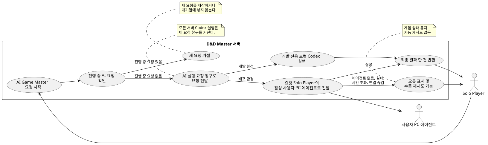
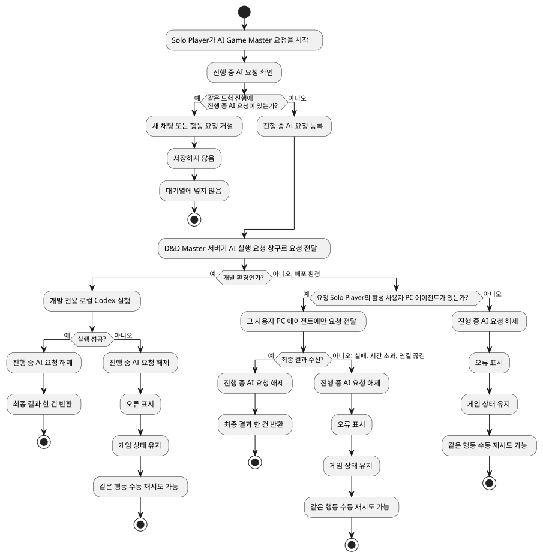

# Product Spec — 원격 Codex 사용자 PC 에이전트 실행 요청 창구

## 1. Problem and Context

현재 서버는 Codex 실행을 서버 내부에서 직접 처리한다. 배포된 서버에서는 Solo Player의 PC에만 있는 Codex 로그인 정보를 사용할 수 없다. Solo Player가 자신의 PC에서 실행한 사용자 PC 에이전트가 AI 요청을 처리할 수 있도록, 서버의 AI 실행 요청을 분리된 실행 요청 창구로 통일한다.

## 2. Goals and Desired Outcomes

- Solo Player가 자신의 PC에 있는 Codex 로그인 정보를 사용해 AI Game Master 요청을 처리할 수 있는 기반을 제공한다.
- 개발 환경에서는 기존 로컬 Codex 실행을 계속 사용할 수 있다.
- 기존 AI Game Master 요청의 입력, 최종 응답, 오류 의미를 유지한다.
- AI 실행 결과가 없으면 모험의 게임 상태를 바꾸지 않는다. 결과 반영 도중 오류가 나면 이미 저장된 상태는 되돌리지 않고 오류와 기록을 남긴다.

## 3. Users and Actors

- **Solo Player**: 자신의 PC에서 사용자 PC 에이전트를 실행하고 AI Game Master 요청 결과를 받는다.
- **사용자 PC 에이전트**: Solo Player의 PC에 있는 Codex 로그인 정보를 사용하여 해당 Solo Player의 AI 요청을 처리한다.
- **AI Game Master**: Solo Player의 모험 진행을 위해 AI 실행 결과를 사용한다.
- **D&D Master 서버**: AI 실행 요청을 적절한 실행 경로에 전달하고 결과 또는 오류를 반환한다.

## 4. Ubiquitous Language and Terminology

- **사용자 PC 에이전트**: Solo Player의 PC에서 실행되어 그 PC에만 있는 Codex 로그인 정보를 사용하는 프로그램.
- **AI 실행 요청 창구**: 서버의 모든 Codex 실행 요청이 반드시 거치는 분리된 요청 경계. 기존 서버 내부 직접 호출을 대체한다.
- **활성 사용자 PC 에이전트**: 특정 Solo Player에게 현재 연결되어 AI 실행 요청을 받을 수 있는 하나의 사용자 PC 에이전트.
- **최종 결과**: 생성 도중의 일부 내용 없이, AI 실행이 끝난 뒤 한 번 반환되는 완성된 결과.

## 5. Core Use Cases

### UC-01. AI Game Master 요청 실행

1. Solo Player가 AI Game Master 요청을 시작한다.
2. Adventure Session에 진행 중인 AI 실행 요청이 있으면 새 채팅 또는 행동 AI 요청을 거절한다. 요청은 저장하거나 대기열에 넣지 않는다.
3. 진행 중인 요청이 없으면 Adventure Runtime은 요청 ID를 진행 중인 AI 실행 요청으로 원자적으로 기록하고, D&D Master 서버는 AI 실행 요청 창구를 통해 요청을 처리한다.
4. 개발 환경에서는 개발 전용 로컬 Codex 실행 경로가 요청을 처리한다.
5. 배포 환경에서는 서버가 요청 Solo Player의 활성 사용자 PC 에이전트에만 요청을 전달한다.
6. 실행이 성공하면 서버는 최종 결과 한 건을 기존 AI Game Master 흐름에 반환하고, 그 요청에서 시작된 전투 후속 처리를 포함한 최종 게임 상태 처리가 끝난 뒤 해당 요청 ID를 지운다.
7. 최종 결과를 받기 전 실행이 실패하면 서버는 오류를 표시하고 게임 상태를 바꾸지 않으며 해당 요청 ID를 지운다. 최종 결과 반영 도중 오류가 나면 이미 저장된 상태는 유지하고, 오류를 기록·표시한 뒤 해당 요청 ID를 지운다.

## 6. Business Rules and Invariants

- 서버의 모든 Codex 실행은 AI 실행 요청 창구를 거친다. 서버 내부의 직접 Codex 호출은 허용하지 않는다.
- 개발 환경의 로컬 Codex 실행은 개발 전용이다. 배포 환경에는 로컬 Codex 실행 경로가 없다.
- Solo Player마다 활성 사용자 PC 에이전트는 정확히 하나다.
- 같은 Solo Player의 새 사용자 PC 에이전트 연결은 기존 활성 연결을 교체한다.
- AI 실행 요청은 요청한 Solo Player의 활성 사용자 PC 에이전트에만 전달한다. 다른 Solo Player의 에이전트로 전달하거나 대체하지 않는다.
- 최종 결과만 반환한다. 생성 도중의 일부 내용은 반환하지 않는다.
- 자동 재시도하지 않는다.
- Adventure Session마다 진행 중인 AI 실행 요청은 정확히 하나만 허용한다.
- Adventure Runtime은 요청을 받아들일 때 진행 중인 요청 ID를 원자적으로 기록한다.
- 서버가 Adventure Session에서 처음 조건부로 받아들인 채팅 또는 행동 요청이 그 요청 ID를 가진다. 그 요청에서 시작된 전투 후속 처리도 같은 요청 ID를 유지하며, 별도 새 요청으로 받아들이지 않는다.
- 진행 중인 요청 ID가 있으면 새 채팅 또는 행동 AI 요청을 거절하며, 저장하거나 대기열에 넣지 않는다.
- 같은 요청 ID의 성공, 실행 실패, 시간 초과 또는 사용자 PC 에이전트 연결 끊김이 확인되면 진행 중인 요청 ID를 지운다. 성공은 그 요청에서 시작된 전투 후속 처리와 최종 게임 상태 처리가 끝난 뒤에만 해제한다. 그 뒤에만 수동 재시도할 수 있다.

## 7. States and State Transitions

- 사용자 PC 에이전트는 Solo Player별로 활성 연결 없음 또는 활성 연결 하나 상태다.
- 새 연결이 성립하면 활성 연결 없음은 활성 연결 하나가 되고, 이미 활성 연결이 있으면 새 연결이 기존 연결을 교체한다.
- 배포 환경에서 활성 사용자 PC 에이전트가 없어도 서버는 시작할 수 있다.
- Adventure Session의 AI 실행 요청은 진행 중인 요청 없음 또는 진행 중인 요청 하나 상태다. 요청을 받아들이면 요청 ID를 기록해 진행 중인 요청 하나 상태가 된다.
- 같은 요청 ID가 성공하거나 실패, 시간 초과, 연결 끊김으로 끝나면 진행 중인 요청 ID를 지워 진행 중인 요청 없음 상태가 된다.
- 독립적인 업무 상태 다이어그램: 해당 없음 — 연결 규약, 연결 복구, 심장 신호 구현은 이번 범위 밖이다.

## 8. Failures, Exceptions, and Boundary Conditions

- 배포 환경에서 요청한 Solo Player의 활성 사용자 PC 에이전트가 없으면 요청은 명확한 오류로 실패한다.
- 최종 결과를 받기 전 실행 실패, 시간 초과, 사용자 PC 에이전트 연결 끊김이 발생하면 게임 상태는 바뀌지 않는다. 최종 결과 반영 도중 오류가 나면 이미 저장된 상태를 되돌리지 않고 오류를 기록·표시한다.
- 최종 결과 전 실패 시 Solo Player에게 오류를 표시하고 같은 행동을 수동으로 다시 시도할 수 있게 한다. 결과 반영 도중 오류는 현재 저장된 상태를 다시 보여 주며 자동 또는 동일 행동 재시도를 하지 않는다.
- 자동 재시도는 하지 않는다.
- Adventure Session에 진행 중인 AI 실행 요청이 있으면 새 채팅 또는 행동 AI 요청은 거절한다. 거절된 요청은 저장하거나 대기열에 넣지 않는다.
- 성공, 실행 실패, 시간 초과 또는 연결 끊김은 같은 요청 ID의 진행 중인 기록을 지운다.

## 9. Inputs and Outputs

- 입력: 기존 AI Game Master 요청에 사용하던 입력.
- 성공 출력: 기존 AI Game Master 흐름이 받던 의미의 최종 결과 한 건.
- 실패 출력: 실행 불가 또는 실행 실패를 설명하는 오류.
- 생성 도중의 일부 내용, 진행 상태, 중간 결과는 출력하지 않는다.

## 10. Scope and Non-goals

포함:

- 모든 서버 Codex 실행을 AI 실행 요청 창구로 통일.
- 개발 환경의 로컬 Codex 실행 경로 유지.
- 배포 환경에서 Solo Player 소유 사용자 PC 에이전트로 요청을 전달할 수 있는 연결 요청 창구 제공.
- Solo Player별 활성 사용자 PC 에이전트 한 개 규칙과 요청 소유자 분리.
- Adventure Session별 진행 중인 AI 실행 요청 한 개 제한과 수동 재시도 전제.

제외:

- 웹소켓 endpoint, 클라이언트, 메시지 규약 구현.
- 연결 복구, 심장 신호.
- 연결 승인, 인증, 기기 키.
- 작업 대기열.
- 생성 도중 내용 전달.

## 11. Priorities and Trade-offs

- 최우선은 기존 AI Game Master 경험을 바꾸지 않으면서 서버 직접 Codex 실행을 분리하는 것이다.
- 초기 범위는 요청 한 건과 최종 결과 한 건에 집중한다.
- 원격 연결 안정화와 운영 보안은 이후 작업으로 미룬다.
- 활성 에이전트를 Solo Player당 하나로 제한해 요청 대상 선택을 단순하고 명확하게 유지한다.
- Adventure Session별 AI 실행 요청을 하나로 제한해 동일 세션의 중복 진행과 상태 충돌을 막는다.

## 12. Success Conditions and Acceptance Criteria

- 서버의 Codex 실행 요청은 모두 AI 실행 요청 창구를 통해 처리된다.
- 개발 환경에서 기존 AI Game Master 요청 입력, 최종 응답, 오류 의미가 유지된다.
- 배포 환경에는 로컬 Codex 실행 경로가 없고, 서버는 사용자 PC 에이전트 연결 전에도 시작할 수 있다.
- 각 Solo Player는 활성 사용자 PC 에이전트를 하나만 가지며 새 연결은 기존 연결을 교체한다.
- 원격 요청은 요청 Solo Player의 활성 사용자 PC 에이전트에게만 전달된다.
- 성공 시 최종 결과 한 건만 반환되고 중간 생성 내용은 반환되지 않는다.
- 최종 결과를 받기 전 실행 실패, 시간 초과, 연결 끊김은 게임 상태를 바꾸지 않고 오류와 수동 재시도 가능 상태를 제공한다. 최종 결과 반영 도중 오류는 이미 저장된 상태를 보존하고 오류를 기록·표시한다.
- Adventure Session은 진행 중인 AI 실행 요청을 하나만 허용한다. 요청을 받아들이면 요청 ID가 원자적으로 기록된다.
- 진행 중인 요청이 있으면 새 채팅 또는 행동 AI 요청은 거절되며 저장·대기열 추가되지 않는다.
- 같은 요청 ID의 성공, 실행 실패, 시간 초과 또는 연결 끊김 후에만 진행 중인 기록이 지워지고 수동 재시도할 수 있다.
- 웹소켓 구현, 연결 복구, 심장 신호, 연결 승인·인증·기기 키, 작업 대기열은 이번 티켓에 포함되지 않는다.
