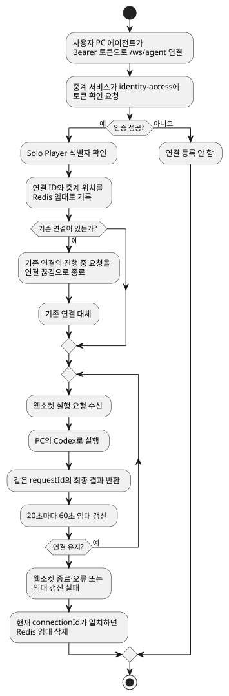
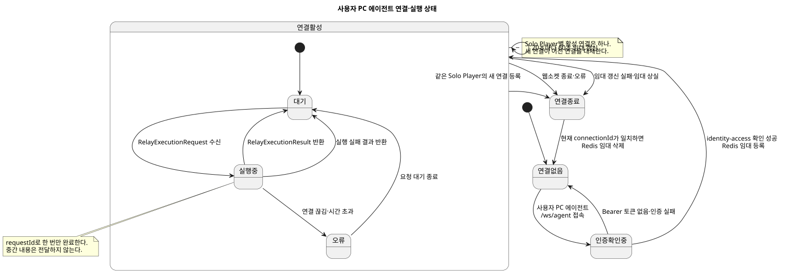

# Product Spec — 원격 Codex 사용자 PC 에이전트 실행 요청 창구

## 1. Problem and Context

배포된 서버에는 Solo Player의 PC에만 있는 Codex 로그인 정보가 없다. 서버가 만든 완성 프롬프트를 사용자 PC 에이전트로 전달하고, 에이전트가 PC의 Codex로 실행한 최종 결과를 서버의 기존 AI Game Master 흐름으로 돌려줘야 한다.

요청을 받은 중계 인스턴스와 실제 사용자 PC 연결을 가진 중계 인스턴스가 다를 수 있다. 따라서 연결 위치를 만료 시간이 있는 Redis 임대로 공유하고, 요청 ID로 웹소켓 결과와 내부 HTTP 응답을 연결한다.

## 2. Goals and Desired Outcomes

- 서버의 모든 Codex 실행을 하나의 AI 실행 포트로 통일한다.
- 개발 환경에서는 기존 로컬 Codex 실행을 유지하고, 운영 산출물에서는 분리한다.
- 배포 환경에서는 요청한 Solo Player의 사용자 PC 에이전트에만 완성 프롬프트를 전달한다.
- 연결이 여러 중계 인스턴스에 분산되어도 결과를 요청한 HTTP 호출까지 동기적으로 돌려준다.
- 최종 결과 전 실패는 게임 상태를 바꾸지 않고, 자동 재시도 없이 명확한 오류를 반환한다.

## 3. Users and Actors

- **Solo Player**: 자신의 PC에서 사용자 PC 에이전트를 실행하고 모험 요청을 시작한다.
- **D&D Master 서버**: 완성 프롬프트와 실행 옵션을 AI 실행 포트로 보낸다.
- **AI Game Master**: 모험 상태와 자료로 프롬프트를 만들고 최종 결과를 해석한다.
- **사용자 PC 에이전트**: 인증된 웹소켓을 계속 유지하고, 받은 실행 요청을 PC의 Codex로 처리한다.
- **중계 서비스**: 사용자 PC 에이전트 연결을 보유하고, 중계 인스턴스 간 요청을 전달한다.
- **identity-access 서비스**: 웹소켓 연결의 전달자 인증 토큰에서 Solo Player 식별자를 확인한다.

## 4. Ubiquitous Language and Terminology

- **AI 실행 포트**: AI Game Master가 실행 위치를 몰라도 실행을 요청하는 공통 계약.
- **사용자 PC 에이전트**: Solo Player의 PC에서 실행되어 그 PC의 Codex 로그인 정보를 사용하는 프로그램.
- **연결 위치 임대**: 특정 Solo Player의 현재 웹소켓 연결이 어느 중계 인스턴스에 있는지와 만료 시각을 Redis에 저장한 기록.
- **소유 중계 인스턴스**: 해당 Solo Player의 웹소켓 연결을 실제로 보유한 중계 인스턴스.
- **최종 결과**: 중간 생성 내용 없이 실행이 끝난 뒤 한 번 반환되는 텍스트.

## 5. Core Use Cases

### UC-01. AI Game Master 요청 실행

1. Solo Player가 채팅·행동·모험 시작 요청을 보낸다.
2. Adventure Session에 진행 중인 AI 요청이 있으면 새 요청을 저장하거나 대기시키지 않고 거절한다.
3. 요청이 없으면 Adventure Runtime이 요청 ID를 원자적으로 기록한다.
4. AI Game Master가 룰북·스토리북·게임 상태로 완성 프롬프트를 만들고 AI 실행 포트를 호출한다.
5. 개발 환경이면 개발 전용 로컬 Codex 구현이 실행한다.
6. 배포 환경이면 원격 구현이 인증된 내부 HTTP로 중계 서비스의 `/internal/executions`를 호출한다.
7. 중계 서비스는 Redis에서 요청 Solo Player의 연결 위치를 조회한다.
8. 요청을 받은 중계 인스턴스가 소유 중계 인스턴스면 웹소켓으로 직접 보내고, 아니면 `/internal/owned-executions`로 직접 전달한다.
9. 사용자 PC 에이전트가 같은 `requestId`를 가진 실행 결과를 웹소켓으로 돌려준다.
10. 중계 서비스가 결과를 기다리던 내부 HTTP 호출에 최종 결과 또는 실패 종류를 반환한다.
11. AI Game Master가 기존 결과 처리와 게임 상태 반영을 끝내면 Adventure Runtime이 같은 요청 ID를 해제한다.


### UC-02. 사용자 PC 에이전트 연결 유지

1. 사용자 PC 에이전트가 `Authorization: Bearer <토큰>`으로 `/ws/agent`에 연결한다.
2. 중계 서비스가 identity-access에 토큰을 확인하고 Solo Player 식별자를 얻는다.
3. 중계 서비스가 `soloPlayerId`, 중계 인스턴스 ID, 내부 주소, 세션 ID, 연결 ID를 만료 시간과 함께 Redis에 기록한다.
4. 같은 Solo Player의 새 연결이 등록되면 기존 연결을 대체하고, 진행 중인 기존 요청은 연결 끊김으로 끝낸다.
5. 연결이 살아 있는 동안 20초마다 60초 임대를 갱신한다.
6. 웹소켓 종료·오류·임대 상실 시 현재 연결 ID에 한해서만 Redis 기록을 삭제한다.



## 6. Business Rules and Invariants

- 서버의 모든 Codex 실행은 AI 실행 포트를 거친다. 서버의 직접 Codex 호출은 허용하지 않는다.
- Solo Player마다 활성 사용자 PC 에이전트는 최대 하나다. 새 연결은 기존 연결을 대체한다.
- 웹소켓 연결은 Bearer 토큰을 identity-access에서 확인한 뒤에만 등록한다.
- 요청은 요청한 Solo Player의 연결로만 전달한다. 다른 Solo Player의 연결로 대체하지 않는다.
- `requestId`는 내부 HTTP 요청, 웹소켓 실행 요청, 웹소켓 결과를 연결하는 상관관계 식별자다.
- 최종 결과만 반환한다. 중간 생성 내용은 반환하지 않는다.
- 같은 요청 ID는 한 번만 완료한다. 알 수 없거나 이미 끝난 요청의 결과는 게임 상태에 반영하지 않는다.
- Redis에는 연결 위치와 만료 정보만 저장한다. 프롬프트·결과·RAG 자료·Codex 로그인 정보는 저장하지 않는다.
- 연결 임대 삭제는 `connectionId`가 현재 기록과 일치할 때만 수행한다.
- 자동 재시도·작업 대기열·영속 실행 보존은 제공하지 않는다.
- Adventure Session마다 진행 중인 AI 요청은 하나만 허용한다.

## 7. States and State Transitions

### 사용자 PC 에이전트 연결

`연결 없음 → 인증 확인 중 → 연결 활성 → 임대 갱신 중 → 연결 종료`

- 인증 실패: `인증 확인 중 → 연결 없음`
- 새 연결 등록: 기존 `연결 활성 → 연결 종료`, 새 연결 `연결 활성`
- 임대 갱신 실패 또는 웹소켓 오류: `임대 갱신 중 → 연결 종료`
- 연결 종료 시 현재 연결 ID가 일치할 때만 Redis 임대를 삭제한다.

### AI 실행 요청

`진행 중 요청 없음 → 실행 중 → 최종 결과 수신 → 상태 반영 → 진행 중 요청 없음`

- 연결 없음·전달 실패·실행 실패·시간 초과·연결 끊김: `실행 중 → 오류 → 진행 중 요청 없음`
- 같은 세션의 새 요청: `진행 중 요청 있음 → 거절`
- 최종 결과 반영 중 오류: 저장된 상태는 유지하고 오류를 기록한 뒤 요청을 해제한다.



## 8. Failures, Exceptions, and Boundary Conditions

| 상황 | 결과 |
| --- | --- |
| Bearer 토큰 없음·identity-access 인증 실패 | 웹소켓 연결 등록 안 함 |
| 요청 Solo Player 연결 없음 | `NO_CONNECTION` |
| Redis 위치 조회 실패 | `REMOTE_FAILURE` |
| 소유 중계 인스턴스 도달 실패 | `REMOTE_FAILURE` |
| 웹소켓 연결 끊김 | `CONNECTION_LOST` |
| 실행 시간 초과 | `TIMEOUT` |
| 결과가 최대 UTF-8 크기 초과 | `REMOTE_FAILURE` |
| 결과의 `requestId`가 요청과 다름 | `REMOTE_FAILURE` |
| 진행 중 요청이 있는 세션에 새 요청 | 새 요청 거절, 저장·대기열 추가 없음 |

모든 실행 실패는 자동 재시도하지 않는다. 최종 결과를 받기 전에는 게임 상태를 바꾸지 않는다.

## 9. Inputs and Outputs

중계 내부 실행 요청의 필드는 다음과 같다.

```json
{
  "soloPlayerId": "서버가 확정한 Solo Player UUID",
  "requestId": "요청 상관관계 식별자",
  "operationId": "AI 작업 식별자",
  "prompt": "서버가 완성한 프롬프트",
  "model": "모델",
  "reasoning": "추론 설정",
  "outputFormat": "출력 형식",
  "outputSchema": "선택 출력 구조",
  "imageInputs": ["선택 이미지 입력"],
  "deadlineEpochMillis": 0,
  "connectionId": "선택 연결 식별자"
}
```

웹소켓 결과와 내부 HTTP 결과는 같은 구조를 사용한다.

```json
{
  "requestId": "요청 상관관계 식별자",
  "content": "성공한 최종 텍스트 또는 빈 문자열",
  "failureType": null
}
```

실패 시 `failureType`은 `NO_CONNECTION`, `CONNECTION_LOST`, `TIMEOUT`, `REMOTE_FAILURE` 중 하나이고 `content`는 빈 문자열이다.

## 10. Scope and Non-goals

포함:

- AI 실행 포트와 개발 전용 로컬 Codex 구현.
- 원격 AI 실행 구현과 인증된 내부 HTTP.
- `/ws/agent` 웹소켓 연결, Bearer 토큰 확인, identity-access 식별자 조회.
- Solo Player별 연결 교체와 Redis 연결 위치 임대.
- 20초 주기 갱신, 연결 ID 보호 삭제, A=C 로컬 전달, A≠C 내부 전달.
- 요청 ID별 최종 결과 대기와 유형화한 실패 반환.
- 요청·응답 바이트, 실행 기간, 실패 종류, 활성 연결 계측.

제외:

- pairing 화면·기기 키·별도 기기 등록 절차.
- 자동 재연결과 끊긴 요청의 자동 복구.
- 작업 대기열·영속 실행 보존·자동 재시도.
- 생성 중간 내용·부분 결과 스트리밍.
- 중계 서비스의 프롬프트 생성·RAG 조회·Codex 실행·게임 상태 기록.

## 11. Success Conditions and Acceptance Criteria

- 실제 `/ws/agent` 연결이 인증된 Solo Player로 Redis 임대를 만든다.
- 새 연결이 이전 연결을 대체하고, 이전 연결 종료가 새 임대를 삭제하지 않는다.
- 활성 연결은 20초마다 60초 임대를 갱신한다.
- 내부 실행 요청이 연결 보유 인스턴스까지 A=C 또는 A≠C 경로로 전달된다.
- 웹소켓 결과의 `requestId`가 기다리던 내부 HTTP 결과와 일치한다.
- 최종 결과는 한 번만 반환되고 중간 내용은 반환되지 않는다.
- 연결 없음·연결 끊김·시간 초과·전달 실패가 정의한 실패 종류로 변환된다.
- 모든 실패에 자동 재시도·대기열 추가가 없다.
- 같은 Adventure Session의 동시 AI 요청 중 하나만 수락된다.
- production artifact에 개발용 로컬 Codex 코드와 의존성이 포함되지 않는다.

검증 근거:

- `AgentWebSocketIntegrationTest`: 웹소켓 결과가 기다리던 HTTP 응답으로 돌아오는지 검증.
- `ConnectionLeaseHeartbeatTest`: 20초 주기 임대 갱신 검증.
- `HttpIdentityServiceAdapterTest`: 토큰 확인과 Solo Player 식별자 변환 검증.
- 중계 서비스 단위·통합·부하 테스트: 라우팅, 오류 분류, 요청 ID 중복 완료 방지, 민감 원문 비로그, 크기·기간·활성 연결 계측 검증.
