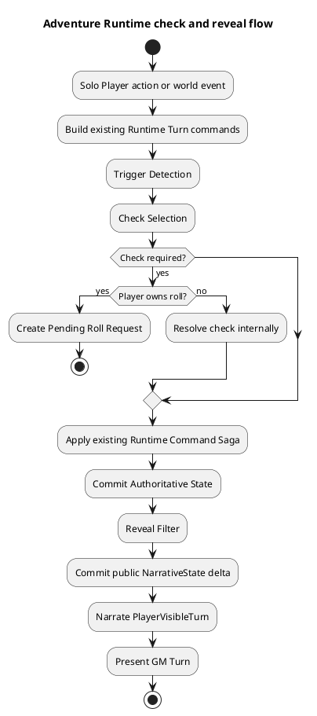
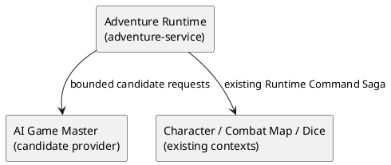
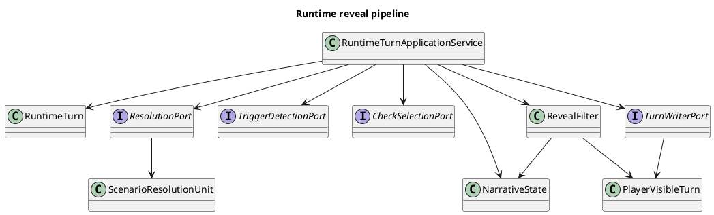
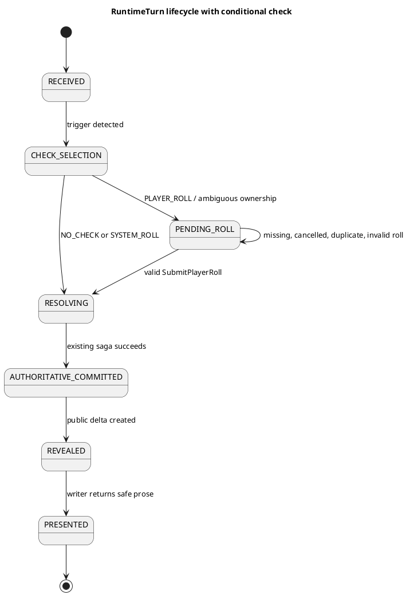

# Architecture Spec: Runtime Reveal Filter

## 1. Design Scope

### 1.1 Target

| Item | Target |
|---|---|
| Product Spec | `docs/specs/runtime-reveal-filter/product-spec.md` |
| Use cases | UC-1~UC-6 |
| Domain | Adventure Runtime |
| Bounded Context | existing Adventure Runtime (`adventure-service`) |
| Existing services | `adventure-service`, `ai-game-master-service` candidate provider |
| External dependencies | existing Runtime Command Saga participants; no new dependency |
| Affected data | Scenario Package, RuntimeTurn, NarrativeState, Adventure API turn payload |

### 1.2 Product Mapping

| Product requirement | Architecture owner |
|---|---|
| Trigger type/reason | `TriggerDetectionPort` result, Runtime application flow |
| Check type/ownership | `CheckSelectionPort` result, Runtime validation |
| Player d20 submission | Runtime turn `PENDING_ROLL` state + Adventure API |
| Internal resolution/state effect | Runtime rule engine + existing command saga |
| World Truth → public facts | deterministic `RevealFilter` + `NarrativeState` |
| Public-only prose | `TurnWriterPort` receives `PlayerVisibleTurn` only |
| No partial player output | existing RuntimeTurn presentation/commit boundary |

## 2. Domain Flow

### 2.1 Event Storming Flow



### 2.2 Commands and Events

| Command/Event | Actor/Producer | Owner | Result |
|---|---|---|---|
| `SubmitRuntimeTurn` | Solo Player / world event | Adventure Runtime | trigger and selection outcome |
| `RequestPlayerRoll` | Adventure Runtime | Adventure Runtime | persisted `PENDING_ROLL`, safe request |
| `SubmitPlayerRoll` | Solo Player | Adventure Runtime | validated d20 result, same pending turn resumes |
| `ResolveSelectedCheck` | Adventure Runtime | Adventure Runtime | internal result and existing runtime commands |
| `AuthoritativeStateCommitted` | Runtime Command Saga | owning contexts | committed internal state |
| `PlayerVisibleTurnCreated` | Reveal Filter | Adventure Runtime | public state delta + writer input |
| `GM_TURN_COMMITTED` | Adventure Runtime | Adventure Runtime | player response becomes visible |

### 2.3 Policies

| Policy | Rule | Owner |
|---|---|---|
| Check necessity | action alone does not imply check; uncertainty/risk/hidden fact/rule condition required | Check Selection |
| Roll ownership | player action or ambiguity → player; world/event → system | Check Selection validation |
| Pending Roll Gate | pending turn accepts only its valid one-time d20 submission; no next turn | RuntimeTurn |
| Reveal | never project hidden existence, DC, comparison, missed clue, GM content, future fact | Reveal Filter |
| Narration boundary | writer gets public projection only | Runtime application service |

## 3. DDD Architecture

### 3.1 Boundaries

All capabilities remain internal to existing Adventure Runtime bounded context. They share RuntimeTurn/NarrativeState lifecycle and require synchronous turn ordering. No new bounded context, Gradle module, deployment service, or database is created.

| Capability | Owner context | Chosen boundary | Why not weaker | Why not stronger |
|---|---|---|---|---|
| Trigger Detection | Adventure Runtime | internal domain/application capability | must be independently callable/validated | no independent state/lifecycle |
| Check Selection | Adventure Runtime | internal domain/application capability | owns check/roll policy | no independent state/lifecycle |
| Resolution | Adventure Runtime | existing runtime engine capability | must issue existing commands | separate service breaks atomic turn coordination |
| Reveal Filter | Adventure Runtime | domain service | security invariant needs deterministic owner | no independent data/lifecycle |
| Narration | Adventure Runtime | existing output port | public-only contract must be enforced | AI GM remains candidate provider, not state owner |

### 3.2 Context Map



`adventure-service` remains customer/owner of AI output. AI provider gets no World Truth persistence authority and no Reveal decision authority. Existing Saga contracts to Character Management and Combat Map remain unchanged.

### 3.3 Aggregate and State Owners

| Aggregate/model | Owner | Responsibility |
|---|---|---|
| `RuntimeTurn` | Adventure Runtime | lifecycle, pending roll identity, duplicate prevention, presentation gate |
| `NarrativeState` | Adventure Runtime | World Facts, revealed facts, character knowledge; public projection source |
| `ScenarioPackage` / `ScenarioResolutionUnit` | Scenario Preparation inside Adventure Runtime | canonical hidden facts, triggers, checks, state effects, reveal contracts |

### 3.4 Class Diagram



### 3.5 State Diagram



## 4. Program Design

### 4.1 Flow and Responsibilities

`RuntimeTurnApplicationService` stays single turn orchestrator. It retains existing action interpretation, command generation, persistence, saga, failure handling, and presentation lifecycle. It conditionally inserts check pipeline between command planning and existing authoritative-state completion.

| Component | Input | Output | Must not do |
|---|---|---|---|
| `TriggerDetectionPort` | player action/world event + runtime context | typed trigger candidates | choose DC, reveal or narration |
| `CheckSelectionPort` | candidates + canonical unit | `NO_CHECK` or selected check/ownership | resolve or write prose |
| `ResolutionPort` | selection + roll/system input | internal resolution + existing commands | expose hidden values |
| `RevealFilter` | committed state, internal result, NarrativeState | `PlayerVisibleTurn`, `StateDelta` | invoke AI/RAG or mutate World Truth |
| `TurnWriterPort` | `PlayerVisibleTurn` only | `WriterProse` | read internal plan, RAG, resolved artifact |

### 4.2 Contracts

```java
interface TriggerDetectionPort {
    TriggerDetection detect(TriggerInput input);
}

interface CheckSelectionPort {
    CheckSelection select(CheckSelectionInput input);
}

interface ResolutionPort {
    ResolutionResult resolve(ResolutionInput input);
}

interface RevealFilter {
    PlayerVisibleTurn reveal(RevealInput input);
}

interface TurnWriterPort {
    WriterProse write(PlayerVisibleTurn visibleTurn);
}
```

`CheckSelection` contains `NO_CHECK | SYSTEM_ROLL | PLAYER_ROLL`, check label, dice expression, selected unit ID and safe request text. `PLAYER_ROLL` selection persists `pendingTurnId`; request excludes DC, hidden objective/target/location, internal comparison and outcome.

`SubmitPlayerRoll` requires `{ pendingTurnId, result }`. Runtime validates authenticated owner, current lifecycle, exact pending identity, once-only submission, integer d20 range `1..20`, and optimistic turn version. Valid submission resumes same `RuntimeTurn`; it does not create a new turn or call `dice-roll-service`.

### 4.3 Dependency Rules

| Source | Allowed target |
|---|---|
| runtime application | stage port interfaces, RuntimeTurn/NarrativeState repositories, existing saga ports |
| RevealFilter | internal result, authoritative public facts, NarrativeState |
| writer adapter | `PlayerVisibleTurn` only |

| Source | Forbidden target |
|---|---|
| writer adapter | `ScenarioPackage`, `ScenarioResolutionUnit`, Source Span/RAG, `RuntimePlan`, internal resolution artifact |
| RevealFilter | AI provider, writer, direct player HTTP response |
| AI GM adapter | RuntimeTurn/NarrativeState repositories or state-changing command APIs bypassing Runtime |

## 5. Technical Architecture

### 5.1 Data and Schema

No legacy compatibility/fallback is required. Canonical Scenario Package contract is directly changed: every check/clue representation must contain hidden subject/fact, trigger condition/type, selection/solution method, success/failure state effects, reveal condition, reveal level, and prior public knowledge constraint. LLM Validator rejects missing or contradictory data before package publication.

`RuntimeTurn` persists pending-roll lifecycle and safe roll request/result metadata required to resume exactly one turn. `NarrativeState` remains storage: Reveal Filter commits public `revealedFacts`/`CharacterKnowledge`; it does not add another Player Knowledge store.

| Data | Owner | Writer | Reader |
|---|---|---|---|
| hidden scenario/check contract | Scenario Package | Scenario Preparation | Trigger/Selection/Resolution only |
| pending roll | RuntimeTurn | Runtime application | player-roll API validation |
| World Truth | NarrativeState | Runtime domain | Trigger/Selection/Resolution/Reveal |
| public projection | NarrativeState + `PlayerVisibleTurn` | Reveal Filter | writer/API/UI |

### 5.2 API

Existing `POST /api/v1/adventures/{adventureId}/turns` returns either completed player output or typed safe `rollRequest`. Add a GM-runtime player-roll submission endpoint bound to pending turn, not combat dice endpoint.

```json
POST /api/v1/adventures/{adventureId}/turns/{pendingTurnId}/roll
{ "result": 14, "expectedVersion": 7 }
```

`200` completed safe turn or another safe pending response. `400` result outside 1..20. `409` stale/completed/wrong pending turn/duplicate. API never includes internal DC, hidden target, internal success/failure, or raw resolution result.

### 5.3 File Change Map

| Path area | Action | Responsibility |
|---|---|---|
| `application/runtime/RuntimeTurnApplicationService` | modify | conditional pipeline orchestration and resume |
| `application/runtime/*Port`, `domain/runtime/*` | add/modify | stage contracts, pending roll, public projection, deterministic reveal |
| `domain/scenario/ScenarioResolution*` | modify | canonical trigger/check/effect/reveal contract |
| `application/scenario/compilation/*` | modify | extraction and validation of required contract |
| `api/AdventureController` | modify | safe typed turn/roll endpoint |
| `web-ui/src/features/adventure/*` | modify | pending-roll UI, safe result rendering |
| runtime/scenario migrations and repositories | modify | direct new contract persistence |

No dedicated manual tester endpoint/UI, new Gradle module, service, broker, or new database table/store for Player Knowledge.

## 6. Runtime, Error, Security and Verification

### 6.1 Ordering and Consistency

One session/turn is ordered by existing `RuntimeTurn` lock and expected-version protocol. `PENDING_ROLL` blocks new/next turn resolution until valid submission. `NO_CHECK` uses existing flow; check pipeline does not create a separate turn path. Existing Saga remains authoritative for remote state changes. Existing narration failure/retry/recovery behavior remains outside this change.

### 6.2 Security

| Boundary | Enforcement |
|---|---|
| client API | response DTO contains only `PlayerVisibleTurn`/safe request |
| Reveal Filter | deterministic deny-by-default projection from allowlisted reveal contract |
| Writer | compile-time contract accepts public projection only; no RAG/GM-state dependency |
| diagnostics | existing internal-only access stays protected; any public-output view uses same projection |
| logs | no hidden DC/target/resolution detail in player-facing logging or API response |

### 6.3 Verification Boundaries

- Scenario compiler/validator: rejects missing trigger, resolution, effect or reveal contract.
- Runtime domain tests: ownership default, pending gate, roll validation/deduplication, deterministic redaction, `NO_CHECK` continuation.
- Application/API tests: no hidden data in roll request/turn response; writer input restricted to public projection.
- UI tests: render safe roll prompt and submitted result; never render `judgment` or raw internal fields.
- Existing runtime recovery tests continue covering narration/Saga behavior; no new manual tester surface in scope.

## 7. Alternatives, Risks, Open Questions

| Alternative | Rejected because |
|---|---|
| Separate Trigger/Reveal service | no independent data/lifecycle; adds latency, deployment and distributed-consistency cost |
| LLM-owned Reveal | cannot be security authority for deterministic information withholding |
| Separate player-knowledge store | `NarrativeState` already owns revealed facts/knowledge |
| Reuse combat `dice-roll-service` | requested GM runtime submission flow needs pending GM-turn binding |
| Legacy Scenario Package fallback | explicitly out of scope |
| Dedicated manual tester | explicitly deferred |

Main risk: current `RuntimePlan`/`judgment` and writer context can leak internal details. Mitigation: replace player-facing response/writer inputs with typed public projection, audit stream rendering, and treat Reveal Filter as only public-state producer.
