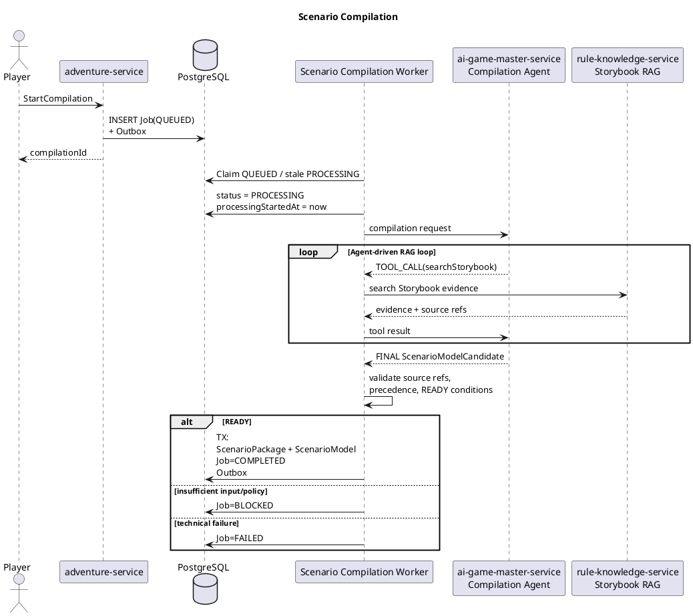
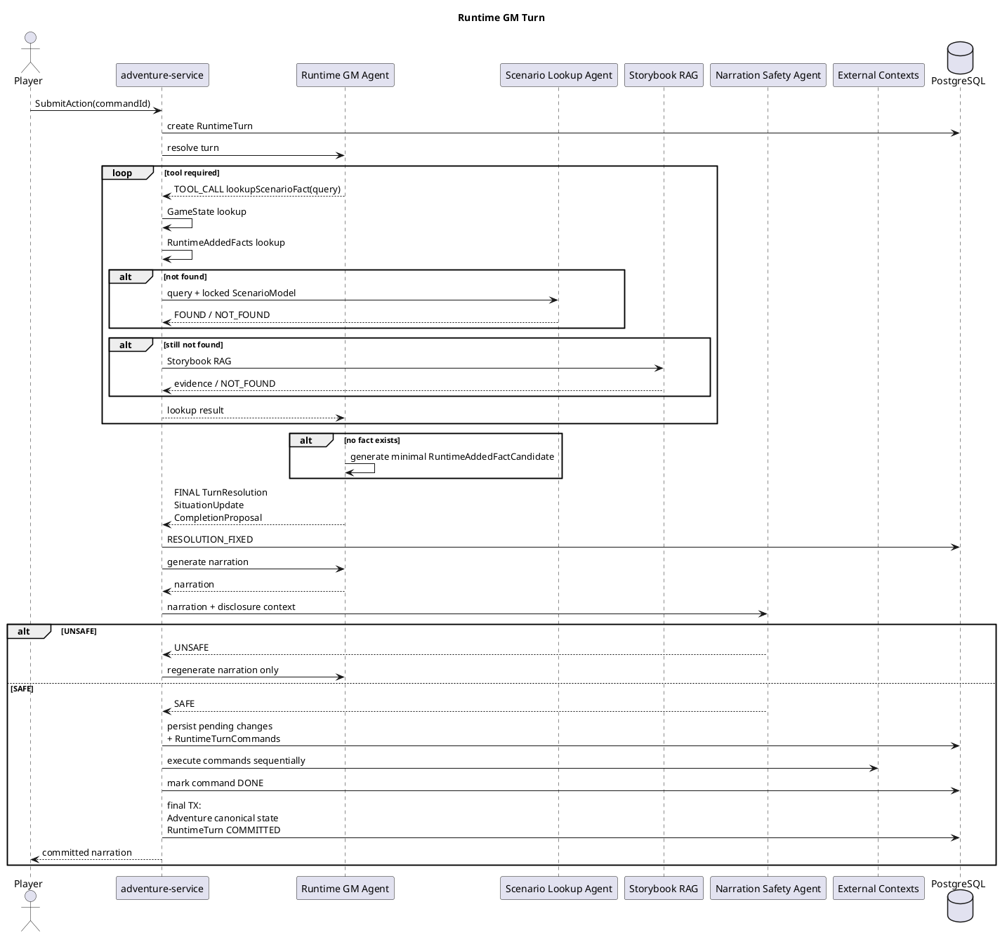
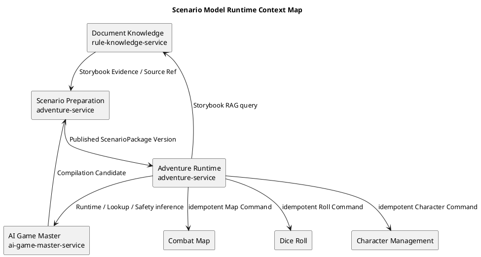
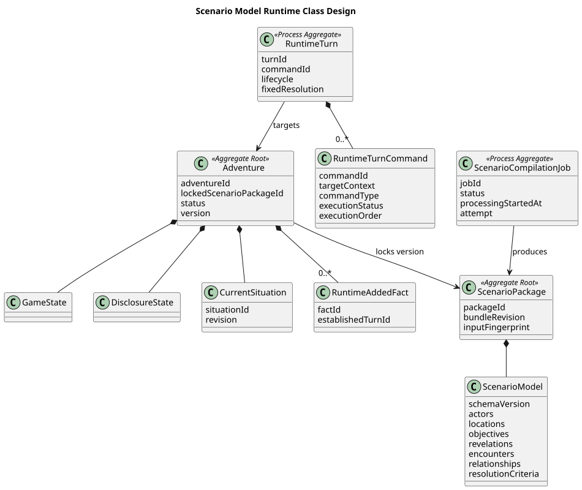
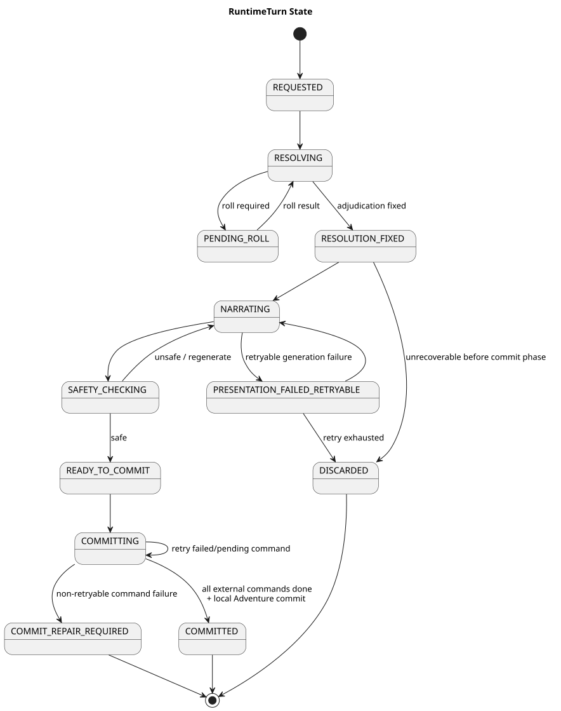
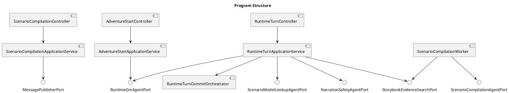

# Architecture Spec: Scenario Model Runtime

# 1. Design Scope

## 1.1 Target

| 항목 | 대상 |
|---|---|
| Ticket | `scenario-model-runtime` |
| Product Spec | `docs/specs/scenario-model-runtime/product-spec.md` |
| Domain | Scenario Preparation, Adventure Runtime |
| Bounded Contexts | Document Knowledge, Scenario Preparation, Adventure Runtime, AI Game Master, Dice Roll, Character Management, Combat Map |
| Primary Services | `adventure-service`, `ai-game-master-service`, `rule-knowledge-service` |
| Supporting Services | `dice-roll-service`, `character-management-service`, `combat-map-service` |
| Affected Data | ScenarioPackage, ScenarioModel, ScenarioCompilationJob, Adventure runtime state, RuntimeTurn, RuntimeTurnCommand, RuntimeAddedFact |
| Removed Model | AdventureStoryPlan / Stage-based runtime |
| New Deployment Service | 없음 |

본 변경은 기존 `Adventure Story Plan → Stage progression` 기반 실행 모델을 완전히 제거하고 다음 모델로 대체한다.

```text
Storybook Source
→ Scenario Compilation
→ ScenarioPackage + ScenarioModel
→ Adventure Start
→ Situation
→ Runtime GM Turn
→ GameState / RuntimeAddedFacts / DisclosureState
→ Situation evolution
→ Resolution
→ Concluding Scene
→ COMPLETED
```

Scenario Preparation과 Adventure Runtime은 새로운 별도 서비스나 Bounded Context로 승격하지 않고 기존 `adventure-service` 내부 경계를 유지한다. 현재 Context Map 역시 두 경계를 `adventure-service` 내부에 두고 있다.

## 1.2 Product Spec Mapping

| Product 요구 | Architecture 요소 |
|---|---|
| Storybook 필수 | ScenarioCompilationJob 입력 검증 |
| Primary Storybook 선택 | ScenarioCompilationJob input snapshot |
| Integration Prompt | Compilation Agent 입력 + conflict policy |
| Creativity | Scenario Compilation policy |
| 비동기 컴파일 | DB-backed ScenarioCompilationJob worker |
| READY만 Adventure Start 가능 | ScenarioPackage publication + Start guard |
| ScenarioModel hidden | 내부 aggregate child, player API 비노출 |
| 시작 후 ScenarioModel 변경 금지 | locked ScenarioPackage version |
| GameState authoritative | Adventure aggregate |
| Runtime-added Fact | Adventure child entity |
| Situation persisted derived state | Adventure CurrentSituation snapshot |
| lookup-before-inventing | `lookupScenarioFact` composite tool |
| ScenarioModel 의미 조회 | ScenarioModel Lookup Agent |
| Storybook fallback | Document Knowledge RAG |
| GM Turn atomic progression | RuntimeTurn process aggregate |
| narration retry 시 resolution 고정 | `RESOLUTION_FIXED` lifecycle |
| spoiler 방지 | Narration Safety Agent |
| 외부 서비스 상태 변경 | RuntimeTurnCommand Saga |
| 완료 판정 | Runtime GM completion proposal + Adventure commit |
| Player Notes 제거 | 관련 model/API 없음 |
| AdventureStoryPlan 제거 | hard cutover + schema drop |

핵심 정합성 우선순위는 다음과 같다.

```text
GameState
→ existing RuntimeAddedFacts
→ locked ScenarioModel
→ Storybook RAG
→ runtime fallback generation
```

---

# 2. Domain Flow

## 2.1 Scenario Compilation Flow



Scenario Compilation은 별도 chunk/index pipeline을 만들지 않는다. 기존 Document Knowledge의 Storybook RAG를 candidate discovery에 사용한다.

Compilation Agent가 Actor, Location, Objective, Revelation, Encounter, Resolution Criteria 등에 필요한 질의를 스스로 결정하고 반복한다.

## 2.2 Adventure Runtime Flow



## 2.3 Commands

| Command | Actor | Target | Result |
|---|---|---|---|
| StartScenarioCompilation | Player | Scenario Preparation | ScenarioCompilationJob |
| ClaimScenarioCompilation | Worker | ScenarioCompilationJob | PROCESSING |
| PublishScenarioPackage | Worker | ScenarioPackage | READY package |
| StartAdventure | Player | Adventure | STARTING → ACTIVE |
| SubmitRuntimeTurn | Player | RuntimeTurn | Runtime resolution |
| LookupScenarioFact | Runtime GM | Adventure Runtime | Found fact / NOT_FOUND |
| CommitRuntimeTurn | Orchestrator | RuntimeTurn | COMMITTED |
| ResumeRuntimeTurn | Client / Recovery Worker | RuntimeTurn | failed command 이후 진행 |

## 2.4 Messages

| Message | Producer | Consumer | Delivery |
|---|---|---|---|
| ScenarioCompilationRequested | Scenario Preparation | DB worker adapter | at-least-once |
| ScenarioCompilationCompleted | Scenario Preparation | future subscribers | at-least-once |
| ScenarioCompilationBlocked | Scenario Preparation | future subscribers | at-least-once |
| ScenarioCompilationFailed | Scenario Preparation | future subscribers | at-least-once |

메시지는 Transactional Outbox를 거쳐 `MessagePublisherPort`로 전달한다.

현재 구현은 DB-backed transport를 사용하되, 해당 port 뒤의 adapter를 Kafka/RabbitMQ 등으로 교체할 수 있다.

## 2.5 Policies

| Policy | Rule | Owner |
|---|---|---|
| Source conflict | Integration Prompt > Primary > Supplements | Scenario Preparation |
| Compilation creativity | NONE / CONSERVATIVE / CREATIVE | Scenario Preparation |
| Lookup priority | GameState → RuntimeAddedFacts → ScenarioModel → RAG | Adventure Runtime |
| Runtime fallback | lookup 모두 실패한 경우 최소 fact 생성 | Adventure Runtime |
| Hidden information | 관찰/기공개/현재 행동으로 공개된 내용만 narration 가능 | Adventure Runtime |
| Situation transition | GM proposal + backend commit | Adventure Runtime |
| Completion | GM proposal + resolution criteria | Adventure Runtime |
| Saga recovery | compensation보다 forward recovery | Adventure Runtime |

## 2.6 Hotspots

| Hotspot | 선택 |
|---|---|
| ScenarioModel 검색 | 별도 검색 index 대신 Lookup Agent |
| Compilation 문서 처리 | 전체 chunk scan 대신 기존 Storybook RAG |
| Compilation 실행 | async DB-backed Job Worker |
| Runtime Turn 실행 | synchronous request flow |
| AI tool execution | adventure-service 소유 |
| Distributed commit | RuntimeTurn orchestration saga |
| Saga failure | 실패한 command부터 forward recovery |
| StoryPlan migration | hard cutover, 완전 제거 |

---

# 3. DDD Architecture

## 3.1 Bounded Contexts

| Bounded Context | Responsibility | Owned Model/Data |
|---|---|---|
| Document Knowledge | Source extraction, Source Span, RAG | Knowledge Document, Extraction Version, search index |
| Scenario Preparation | Storybook inputs를 실행 가능한 ScenarioPackage로 compile | ScenarioSourceBundle, ScenarioCompilationJob, ScenarioPackage, ScenarioModel |
| Adventure Runtime | 실제 플레이 상태 및 Turn orchestration | Adventure, GameState, RuntimeAddedFact, DisclosureState, Situation, RuntimeTurn |
| AI Game Master | stateless semantic inference | 저장 데이터 없음 |
| Dice Roll | roll 정본 | Roll Result |
| Character Management | character authoritative state | HP, inventory, effects, resources |
| Combat Map | tactical map authoritative state | map/token state |

Document Knowledge가 source/index를 소유하고 AI Game Master는 저장 권한을 가지지 않는다는 경계는 기존 ADR과 동일하다.

## 3.1.1 Boundary Decisions

| Capability | Owner | Chosen Boundary | Why Not Stronger? |
|---|---|---|---|
| ScenarioModel | Scenario Preparation | ScenarioPackage child | 독립 lifecycle/consistency가 없음 |
| Scenario Compilation | Scenario Preparation | Internal capability + Job aggregate | 별도 service 배포 필요 없음 |
| ScenarioModel Lookup | AI Game Master | Agent role | 독립 state/domain lifecycle 없음 |
| Runtime Fact Lookup | Adventure Runtime | Application capability | runtime orchestration의 일부 |
| Situation | Adventure Runtime | Adventure child | Adventure 없이 독립 lifecycle 없음 |
| RuntimeAddedFact | Adventure Runtime | Adventure child entity | 별도 aggregate 일관성 경계 불필요 |
| DisclosureState | Adventure Runtime | Adventure child value/state | Adventure commit과 동일 원자성 필요 |
| RuntimeTurn | Adventure Runtime | Process/Saga aggregate | 자체 durable lifecycle과 recovery 필요 |
| RuntimeTurnCommand | Adventure Runtime | RuntimeTurn child entity | 독립 업무 lifecycle 없음 |

새 Bounded Context나 deployment service를 만들지 않는다.

이는 기존 ADR의 “시나리오 컴파일을 위한 새 배포 서비스를 만들지 않는다”는 결정과도 일치한다.

## 3.2 Context Map



현재 Context Map 역시 Adventure Runtime이 Character, Map, Dice의 정본을 복제하지 않고 Runtime Command Saga로 조정하도록 정의한다.

## 3.3 Aggregates

| Aggregate | Root | Responsibility | Invariants |
|---|---|---|---|
| ScenarioCompilationJob | ScenarioCompilationJob | 한 번의 compilation 실행 | execution 1회 = job 1개 |
| ScenarioPackage | ScenarioPackage | publish된 versioned scenario | ScenarioModel과 같이 고정 |
| Adventure | Adventure | committed play canon | start 후 package 변경 금지 |
| RuntimeTurn | RuntimeTurn | uncommitted turn process + saga | Adventure당 active turn 최대 1 |

### ScenarioPackage

```text
ScenarioPackage
├─ packageId
├─ bundleRevision
├─ inputFingerprint
├─ source document pins
├─ compilation diagnostics
└─ ScenarioModel
```

`ScenarioModel`은 ScenarioPackage와 같이 생성되고 독립 repository/lifecycle을 갖지 않는다.

### Adventure

```text
Adventure
├─ lockedScenarioPackageId
├─ status
├─ version
├─ GameState
├─ RuntimeAddedFacts
├─ DisclosureState
└─ CurrentSituation
```

Adventure에는 **이미 commit된 canon만** 들어간다.

### RuntimeTurn

```text
RuntimeTurn
├─ turnId
├─ commandId
├─ adventureId
├─ baseAdventureVersion
├─ lifecycle
├─ fixedResolution
├─ pendingStateDelta
├─ pendingRuntimeAddedFacts
├─ narration
└─ RuntimeTurnCommands[]
```

현재 저장소도 이미 `RuntimeTurnRepository`를 `turnId`, `commandId`, `adventureId` 기준으로 가지고 있다.

## 3.4 Entities

| Entity | Aggregate | Identity | Responsibility |
|---|---|---|---|
| RuntimeAddedFact | Adventure | factId | runtime fallback로 확립된 canonical fact |
| CurrentSituation | Adventure | situationId | 현재 playable problem snapshot |
| ScenarioModel element | ScenarioPackage | elementId | Actor/Location/etc. identity |
| RuntimeTurnCommand | RuntimeTurn | commandId | saga의 개별 external/local change |
| ScenarioCompilationJob | self | jobId | compilation execution |

## 3.4.1 Class Diagram

대상 경로:

`docs/specs/scenario-model-runtime/diagrams/architecture/scenario-runtime.class.puml`



## 3.5 Value Objects / Snapshots

| Type | Storage | Semantics |
|---|---|---|
| GameState | JSONB | current mutable world snapshot |
| DisclosureState | JSONB | player-revealed knowledge snapshot |
| ScenarioSourceReference | typed fields | document/extraction/locator |
| TurnResolution | structured JSON | fixed adjudication result |
| StateDelta | structured JSON | pending Adventure changes |

## 3.6 Domain/Application Services

| Component | Responsibility |
|---|---|
| ScenarioModelValidator | ScenarioModel structural/READY validation |
| RuntimeFactLookupService | lookup priority 강제 |
| RuntimeTurnCommitOrchestrator | RuntimeTurnCommand Saga 실행 |
| SituationUpdatePolicy | CONTINUE/TRANSITION proposal 검증 |
| ScenarioConflictPolicy | source precedence 검증 |

## 3.7 Business Rule Ownership

| Business Rule | Owner | Enforcement |
|---|---|---|
| READY package만 시작 가능 | Adventure Runtime | Start application service |
| ScenarioModel start 후 immutable | Scenario Preparation / Runtime binding | package lock |
| Runtime fact 전에 lookup 수행 | Adventure Runtime | RuntimeFactLookupService |
| fallback fact는 자동 persist 대상 | Adventure Runtime | RuntimeTurn pending changes |
| narration 전 spoiler 검사 | Adventure Runtime | Safety orchestration |
| 동일 Turn resolution 재굴림 금지 | RuntimeTurn | lifecycle guard |
| Adventure당 active Turn 1개 | RuntimeTurn persistence | DB unique constraint |
| external state는 해당 context가 정본 | owning BC | command API |
| Adventure completion은 safe output 후 | Adventure Runtime | final commit |

## 3.8 State Transitions

### ScenarioCompilationJob

```text
QUEUED
→ PROCESSING
→ COMPLETED
→ ScenarioPackage produced

PROCESSING → BLOCKED
PROCESSING → FAILED
stale PROCESSING → re-claimed PROCESSING
```

`BLOCKED`는 입력/정책상 READY 모델 생성 불가이며, `FAILED`는 기술적 실패다.

### Adventure

```text
STARTING
→ ACTIVE
→ COMPLETED
```

`STARTING` 중 first Situation/Scene 생성이 실패하면 같은 Start 요청으로 resume한다.

### RuntimeTurn

```text
REQUESTED
→ RESOLVING
→ RESOLUTION_FIXED
→ NARRATING
→ SAFETY_CHECKING
→ READY_TO_COMMIT
→ COMMITTING
→ COMMITTED
```

분기:

```text
RESOLVING → PENDING_ROLL → RESOLVING

NARRATING / SAFETY_CHECKING
→ PRESENTATION_FAILED_RETRYABLE
→ NARRATING

pre-commit unrecoverable
→ DISCARDED

COMMITTING + permanent failure
→ COMMIT_REPAIR_REQUIRED
```

현재 기존 lifecycle은 `REQUESTED`, `PLANNING`, `RESOLVING`, `RESOLVED_UNCOMMITTED`, `WRITING`, `PRESENTED` 중심이므로 새 모델로 교체 대상이다.

## 3.8.1 State Diagram

대상 경로:

`docs/specs/scenario-model-runtime/diagrams/architecture/runtime-turn.state.puml`



## 3.9 Repository Boundaries

| Repository | Aggregate | Operations |
|---|---|---|
| ScenarioCompilationJobRepository | ScenarioCompilationJob | create, claim, mark result |
| ScenarioPackageRepository | ScenarioPackage | save, findById, listByBundle |
| AdventureRepository | Adventure | load/save canonical aggregate |
| RuntimeTurnRepository | RuntimeTurn | create, findByTurnId/commandId, save |
| OutboxRepository | message outbox | enqueue, claim, mark delivered |

`ScenarioModel`은 독립 repository를 갖지 않는다.

`RuntimeAddedFact`, GameState, DisclosureState, CurrentSituation도 Adventure aggregate consistency boundary를 우회하는 독립 domain repository를 노출하지 않는다.

---

# 4. Program Design

## 4.1 Program Structure



## 4.2 Major Components

| Component | Responsibility | Must Not Do |
|---|---|---|
| ScenarioCompilationApplicationService | Job enqueue / status read | LLM 직접 orchestration |
| ScenarioCompilationWorker | Job claim + agent-driven RAG loop | source/index 소유 |
| ScenarioCompilationAgent | semantic extraction/conflict interpretation | DB write |
| ScenarioModelValidator | model validity/READY verification | source 창작 |
| AdventureStartApplicationService | package lock + initial Situation | package mutation |
| RuntimeTurnApplicationService | synchronous GM Turn orchestration | 외부 state 직접 복제 |
| RuntimeFactLookupService | lookup order enforcement | fallback fact 임의 생성 |
| ScenarioModelLookupAgent | natural-language ScenarioModel query | fact 생성/수정 |
| RuntimeGmAgent | adjudication, fallback candidate, Situation/completion proposal | authoritative commit |
| NarrationSafetyAgent | spoiler detection | resolution 변경 |
| RuntimeTurnCommitOrchestrator | Saga forward commit | semantic adjudication |
| RuntimeTurnRecoveryWorker | incomplete COMMITTING resume | 정상 Turn 비동기 처리 |
| OutboxPublisher | persisted message 전달 | business state 결정 |

## 4.3 Compilation Agent Protocol

Compilation Agent는 `adventure-service`로 callback하지 않는다.

```text
adventure-service
→ Compilation Agent

← TOOL_CALL(searchStorybook)

adventure-service
→ rule-knowledge-service
← evidence

adventure-service
→ Compilation Agent + tool result

← TOOL_CALL | FINAL
```

## 4.4 Runtime Agent Protocol

동일하게 stateless iterative protocol을 사용한다.

```text
AgentStep =
  TOOL_CALL
  | FINAL
```

AI 서비스는 세션 reasoning state를 DB에 저장하지 않는다.

`RESOLUTION_FIXED` 이전 process crash 시 reasoning은 재실행할 수 있다.

`RESOLUTION_FIXED` 이후에는 persisted resolution을 사용한다.

## 4.5 Typed Agent Ports

```java
interface ScenarioCompilationAgentPort {
    AgentStep<ScenarioCompilationFinal> continueCompilation(
        ScenarioCompilationAgentRequest request);
}

interface ScenarioModelLookupAgentPort {
    ScenarioLookupResult lookup(ScenarioModelLookupRequest request);
}

interface RuntimeGmAgentPort {
    AgentStep<RuntimeGmFinal> continueTurn(RuntimeGmAgentRequest request);
}

interface NarrationSafetyAgentPort {
    NarrationSafetyResult inspect(NarrationSafetyRequest request);
}
```

Generic `/agent/run` contract는 사용하지 않는다.

대응 API는 역할별 typed endpoint로 둔다.

```text
/internal/gm/scenario-compilation
/internal/gm/scenario-lookup
/internal/gm/runtime-turn
/internal/gm/narration-safety
```

## 4.6 Scenario Lookup Contract

```text
ScenarioModelLookupRequest
- query
- scenarioModel

ScenarioLookupResult
- status: FOUND | NOT_FOUND
- answer
- supportingElementIds
```

Lookup Agent 제약:

```text
- locked ScenarioModel만 근거로 사용
- 신규 fact 생성 금지
- ScenarioModel 수정 금지
- Storybook RAG 직접 호출 금지
```

Backend는 `supportingElementIds`가 실제 locked model에 존재하는지 검증한다.

## 4.7 Runtime Composite Tool

Runtime GM에는 소스별 tool을 노출하지 않는다.

```java
interface ScenarioFactLookupTool {
    ScenarioFactLookupResult lookupScenarioFact(
        ScenarioFactLookupRequest request);
}
```

내부 순서:

```text
GameState
→ RuntimeAddedFacts
→ ScenarioModelLookupAgent
→ Storybook RAG
→ NOT_FOUND
```

`NOT_FOUND` 이후 Runtime GM이 현재 context와 모순되지 않는 최소 `RuntimeAddedFactCandidate`를 생성한다.

## 4.8 Dependency Rules

Allowed:

```text
Adventure Runtime
→ Scenario Preparation published package
→ AI GM typed ports
→ Document Knowledge query port
→ Character/Map/Dice command ports
```

Forbidden:

```text
AI GM → Adventure DB
AI GM → rule-knowledge DB
AI GM → Character/Map DB
Scenario Preparation → Adventure committed state
Adventure Runtime → mutable ScenarioModel
Adventure Runtime → Storybook RAG write-back
```

AI가 저장소에 직접 접근하지 않는 원칙은 기존 ADR에도 명시되어 있다.

---

# 5. Technical Architecture

## 5.1 Boundary Mapping

| Bounded Context | Capability | Code Boundary | Deployment Unit |
|---|---|---|---|
| Scenario Preparation | Compilation/Package/Model | `adventure-service` package | adventure-service |
| Adventure Runtime | Turn/Situation/GameState | `adventure-service` package | adventure-service |
| AI Game Master | Compilation/Lookup/Runtime/Safety Agents | agent packages | ai-game-master-service |
| Document Knowledge | Storybook RAG | existing module | rule-knowledge-service |
| Character Management | Character commands | existing module | character-management-service |
| Combat Map | Map commands | existing module | combat-map-service |
| Dice Roll | Roll commands | existing module | dice-roll-service |

새 module/service boundary는 추가하지 않는다.

`app-all`은 현재 여러 backend service를 하나의 Spring Boot process에서 실행할 수 있고 Flyway도 module-local migration stream을 유지하도록 설계되어 있다. 새 schema migration 역시 `adventure-service` migration stream에 둔다.

## 5.2 Persistence

### ScenarioCompilationJob

```text
scenario_compilation_job
- job_id
- bundle_id
- bundle_revision
- input_fingerprint
- primary_storybook_id
- integration_prompt
- creativity
- status
- processing_started_at
- attempt
- package_id nullable
- diagnostics
- created_at
- updated_at
```

Status:

```text
QUEUED
PROCESSING
COMPLETED
BLOCKED
FAILED
```

`processingTimeout`, 최대 retry 등의 실제 값은 동기 execution profiling 후 configuration으로 정한다.

### ScenarioPackage / ScenarioModel

ScenarioModel은 JSONB document로 저장한다.

```json
{
  "schemaVersion": 1,
  "actors": [],
  "locations": [],
  "objectives": [],
  "revelations": [],
  "encounters": [],
  "relationships": [],
  "resolutionCriteria": []
}
```

각 element:

```text
- elementId
- typed fields
- optional sourceRefs[]
```

`ScenarioModel` JSONB를 `scenario_package` column으로 둘지 1:1 table로 분리할지는 persistence implementation detail로 둔다.

Architecture invariant는:

> ScenarioModel은 ScenarioPackage와 동일 lifecycle/version boundary 안에서 저장된다.

`schemaVersion` 이전 버전은 read 시 현재 domain model로 upcast한다.

### Adventure Runtime State

```text
Adventure
- status
- locked_package_id
- version
- game_state_jsonb
- disclosure_state_jsonb
- situation_id
- situation_revision
- situation_jsonb
```

### RuntimeAddedFact

```text
runtime_added_fact
- fact_id
- adventure_id
- content
- established_turn_id
```

RuntimeAddedFact는 별도 row로 저장하지만 Adventure aggregate의 commit boundary 안에서만 생성한다.

### RuntimeTurn

```text
runtime_turn
- turn_id
- command_id
- adventure_id
- lifecycle
- base_adventure_version
- fixed_resolution_json
- pending_state_delta_json
- pending_runtime_facts_json
- narration
- last_error
- created_at
- updated_at
```

### RuntimeTurnCommand

```text
runtime_turn_command
- command_id
- turn_id
- target_context
- command_type
- payload_json
- execution_status
- execution_order
- idempotency_key
- last_error
```

Execution status:

```text
PENDING
DONE
FAILED
```

### Outbox

```text
outbox_message
- message_id
- message_type
- aggregate_id
- payload
- created_at
- delivered_at
```

## 5.3 Active RuntimeTurn Constraint

Adventure당 active/uncommitted Turn은 최대 하나다.

PostgreSQL partial unique constraint로 DB에서도 강제한다.

```sql
CREATE UNIQUE INDEX uq_active_runtime_turn_per_adventure
ON runtime_turn(adventure_id)
WHERE lifecycle NOT IN (
  'COMMITTED',
  'DISCARDED',
  'COMMIT_REPAIR_REQUIRED'
);
```

실제 migration에서는 최종 lifecycle terminal 집합과 정확히 맞춘다.

## 5.4 Messaging

Application code는 transport를 알지 않는다.

```java
interface MessagePublisherPort {
    void publish(ApplicationMessage message);
}
```

현재:

```text
Transactional Outbox
→ DB-backed publisher/worker adapter
```

향후:

```text
Transactional Outbox
→ Kafka/RabbitMQ MessagePublisherPort adapter
```

Delivery semantics:

```text
at-least-once
```

Consumer는 `jobId`/message identity 기준 멱등해야 한다.

## 5.5 StoryPlan Hard Cutover

이번 migration에서 다음을 전부 제거한다.

```text
AdventureStoryPlan domain model
AdventureStoryPlanRepository
AdventureStoryPlanController
AdventureStoryPlanRuntimeContext
Stage progression logic
advanceStoryPlan
StoryPlan DB tables
StoryPlan-only columns
compatibility runtime branches
```

기존 진행 중 StoryPlan Adventure의 migration/continue-play는 지원하지 않는다.

현재 Scenario compilation controller에도 legacy/manual resolution candidate 중심 API가 존재하므로 새 Product flow에 맞춰 compile API surface를 단순화하는 대상이다.

---

# 6. Runtime Design

## 6.1 Compilation Job Claim

```text
Worker query:

status = QUEUED
OR
(
  status = PROCESSING
  AND processingStartedAt < now - configuredTimeout
)
```

claim 시 짧은 transaction:

```text
status = PROCESSING
processingStartedAt = now
attempt += 1
COMMIT
```

LLM/RAG 호출은 DB transaction 밖에서 실행한다.

heartbeat는 도입하지 않는다.

## 6.2 Runtime Turn Normal Execution

Runtime Turn은 비동기 worker가 아니라 synchronous HTTP interaction이다.

```text
short TX
→ RuntimeTurn create
COMMIT

no DB transaction
→ AI / RAG / tools

short TX
→ resolution fixed
COMMIT

no DB transaction
→ narration / safety

short TX
→ pending command plan persist
COMMIT

→ saga commands

final local TX
→ Adventure canonical state
→ RuntimeTurn COMMITTED
COMMIT

→ response
```

## 6.3 Concurrency

| Resource | Conflict | Control |
|---|---|---|
| Adventure RuntimeTurn | concurrent actions | partial unique constraint |
| Adventure canonical state | stale turn | Adventure version |
| Compilation Job | duplicate workers | atomic DB claim |
| Runtime command | duplicate delivery | command idempotency |
| Outbox | duplicate publish | message identity |

## 6.4 Ordering

RuntimeTurnCommand는 `executionOrder` 순으로 실행한다.

```text
1. Character / Dice / Map / other external commands
2. Adventure local canonical commit
3. RuntimeTurn COMMITTED
4. player response
```

Adventure local state는 외부 context 변경이 모두 완료된 후 마지막에 commit한다.

## 6.5 Saga

```text
RuntimeTurn READY_TO_COMMIT
→ RuntimeTurnCommands persisted
→ COMMITTING

Command #1
→ DONE

Command #2
→ DONE

Command #3
→ FAILED
```

retry:

```text
#1 DONE → skip
#2 DONE → skip
#3 FAILED → retry
remaining PENDING → continue
```

각 외부 context는 `turnId + commandId` 또는 equivalent idempotency key를 지원해야 한다.

이 방식은 기존 Runtime Command Saga ADR의 “분산 transaction 대신 retryable Saga” 원칙과 일치한다.

## 6.6 Idempotency

| Operation | Key | Duplicate Behavior |
|---|---|---|
| RuntimeTurn request | commandId | 기존 Turn 반환/resume |
| committed Turn request | commandId | 저장된 narration 반환 |
| external command | RuntimeTurnCommand idempotency key | 기존 command result 반환 |
| compilation message | jobId/messageId | duplicate ignore |
| outbox delivery | messageId | already delivered 처리 |

HTTP 응답 전달 직전 연결이 끊겨도 같은 `commandId`로 재요청하면 state mutation을 다시 수행하지 않는다.

## 6.7 Background Recovery

정상 RuntimeTurn은 worker로 실행하지 않는다.

Background recovery 대상은:

```text
RuntimeTurn.lifecycle = COMMITTING
```

뿐이다.

Recovery Worker는 unfinished RuntimeTurn을 찾아 DONE command를 skip하고 FAILED/PENDING command부터 이어서 실행한다.

클라이언트 동일 `commandId` retry와 Recovery Worker가 동일 resume logic을 공유한다.

---

# 7. Error Handling and Recovery

## 7.1 Compilation Errors

| Situation | State | Recovery |
|---|---|---|
| source/policy로 READY 불가 | BLOCKED | 입력 수정 후 새 Job |
| LLM/RAG timeout/5xx | FAILED 또는 configured retry | 새 Job / worker retry |
| DB publish failure | PROCESSING/FAILED | package publish 재시도 |
| worker crash | stale PROCESSING | 다른 worker reclaim |

`FAILED/BLOCKED` Job을 되살려 재사용하지 않는다.

사용자 재컴파일은 항상 새 Job이다.

동일 입력이어도:

```text
Compile #1 → Job A → Package A
Compile #2 → Job B → Package B
```

`inputFingerprint`는 결과 provenance/diagnostic 용도이지 package reuse key가 아니다.

## 7.2 Runtime Pre-Commit Failure

`RESOLUTION_FIXED` 이전 실패:

```text
uncommitted Turn 전체 재실행 가능
```

`RESOLUTION_FIXED` 이후 narration 실패:

```text
resolution 고정
pending state 고정
→ narration만 재생성
```

반복해서 안전한 output을 만들지 못하면 commit phase 전에 `DISCARDED` 가능하다.

## 7.3 Spoiler Failure

```text
Narration
→ Narration Safety Agent

UNSAFE
→ narration discard
→ resolution 유지
→ narration regenerate
```

Unsafe narration은 절대 player에게 전달하지 않는다.

## 7.4 Commit Failure

Transient:

```text
COMMITTING
→ failed command부터 forward retry
```

Permanent:

```text
COMMIT_REPAIR_REQUIRED
```

`COMMIT_REPAIR_REQUIRED`에서는:

```text
- 이미 성공한 command rollback 안 함
- narration 노출 안 함
- 실패 command/context/error 저장
- 운영 복구 대상으로 노출
```

## 7.5 Compensation

자동 compensation은 하지 않는다.

```text
Character HP -5 완료
Map command 실패
```

시 Character HP를 +5로 되돌리는 방식보다 Map command 이후 단계를 forward recovery한다.

## 7.6 Adventure Start Failure

```text
TX
ScenarioPackage lock
Adventure STARTING
COMMIT

→ initial Situation / Scene 생성

failure
→ STARTING 유지

same start request
→ existing STARTING Adventure resume
```

## 7.7 Schema Rollback

AdventureStoryPlan schema는 hard drop한다.

기존 StoryPlan Adventure에 대한 application-level backward compatibility는 제공하지 않는다.

---

# 8. Security

## 8.1 Authentication / Authorization

기존 authenticated player policy를 유지한다.

| Entry | Authorization |
|---|---|
| Compilation | bundle owner/player |
| Package read | owner/player |
| Adventure Start | Adventure owner |
| RuntimeTurn | Adventure participant/owner |
| Internal GM APIs | backend-only authenticated communication |

## 8.2 AI Tool Restrictions

AI Game Master에 다음 접근을 제공하지 않는다.

```text
DB
generic HTTP
filesystem
shell
arbitrary service access
```

typed domain/inference contract만 사용한다.

이는 기존 ADR의 allow-listed domain tool 원칙과 같다.

## 8.3 Input Validation

검증 대상:

```text
Storybook selections
Primary Storybook
Integration Prompt
Creativity enum
ScenarioModel structured output
supportingElementIds
Runtime command payload
expected Adventure version
```

Integration Prompt는 Storybook conflict resolution 범위를 벗어난 자유 world rewrite로 사용하지 않는다.

---

# 9. Observability

## 9.1 Logs

일반 logging framework를 사용하고 environment log level로 제어한다.

```text
INFO
- adventureId / turnId / jobId
- lifecycle transition
- compile outcome
- agent call status
- saga command status
- latency/error

DEBUG
- RAG query/result summary
- agent request/response summary
- state transition detail

TRACE
- raw prompts
- ScenarioModel
- Storybook evidence bodies
- hidden facts
- raw AI response
- safety input/output
```

Production에서는 log level을 조정하여 DEBUG/TRACE payload를 끈다.

별도 hidden-data logging infrastructure는 만들지 않는다.

## 9.2 Metrics

권장 metrics:

```text
scenario_compilation_duration
scenario_compilation_outcome_total
scenario_compilation_stale_reclaim_total

runtime_turn_duration
runtime_turn_active
runtime_turn_discarded_total
runtime_turn_commit_repair_required_total

agent_request_duration
agent_tool_call_total
scenario_lookup_found_ratio
storybook_rag_fallback_total
runtime_added_fact_created_total

narration_safety_retry_total

runtime_command_retry_total
runtime_command_failure_total
```

## 9.3 Tracing

주요 span:

```text
scenario-compilation
  ├─ compilation-agent
  ├─ storybook-rag
  └─ package-publish

runtime-turn
  ├─ gm-resolution
  ├─ scenario-lookup
  ├─ storybook-rag
  ├─ narration
  ├─ safety
  └─ saga-commit
```

공통 attributes:

```text
jobId
adventureId
turnId
commandId
agentRole
targetContext
```

## 9.4 Alerts

| Condition | Severity |
|---|---|
| COMMIT_REPAIR_REQUIRED > 0 | Critical |
| stale PROCESSING jobs 증가 | Warning |
| compilation FAILED 비율 급증 | Warning |
| Safety retry 급증 | Warning |
| Runtime command permanent failure | Critical |

---

# 10. Change Boundaries

## 10.1 Allowed

```text
- ScenarioModel typed sections 추가/세부화
- ScenarioModel JSON schema version 증가
- ScenarioCompilationJob 추가
- Transactional Outbox 추가
- RuntimeTurnCommand persistence 추가
- RuntimeTurn lifecycle 교체
- GameState/DisclosureState/Situation JSONB persistence
- RuntimeAddedFact persistence
- typed AI ports/endpoints 추가
- AdventureStoryPlan 완전 제거
```

## 10.2 Forbidden

```text
- ScenarioModel을 별도 Bounded Context/service로 승격
- AI agent의 DB 직접 접근
- ScenarioModel Lookup Agent의 fact 생성
- Adventure Start 후 ScenarioModel 변경
- runtime에서 ScenarioModel enrichment/write-back
- Storybook RAG 결과를 ScenarioModel에 runtime write-back
- Runtime GM에 source별 lookup tool 직접 노출
- 동일 Adventure에 active RuntimeTurn 복수 허용
- narration safety 통과 전에 canonical commit
- 외부 bounded context state를 Adventure에 복제
- RuntimeTurn saga를 distributed 2PC로 교체
- AdventureStoryPlan compatibility branch 유지
```

## 10.3 Conditional / Deferred

| Item | Condition |
|---|---|
| ScenarioModel search index | Lookup Agent context size/latency가 실제 문제일 때 |
| Kafka/RabbitMQ | DB-backed messaging throughput/operational requirement 발생 시 |
| Compilation heartbeat | compilation duration variance로 stale timeout만으로 부족할 때 |
| processingTimeout | 실제 동기 profiling 후 |
| maxAttempts | 실제 failure/latency data 확보 후 |
| ScenarioModel 세부 fields | implementation/schema design 단계 |
| production log level | deployment configuration |

---

# 11. Verification Requirements

## 11.1 Domain Verification

| Target | Verification |
|---|---|
| ScenarioPackage/Model lifecycle | Model 독립 저장/수정 불가 |
| source precedence | Integration > Primary > Supplement |
| Creativity NONE | source-missing required data에서 BLOCKED |
| lookup priority | 각 source hit 시 후순위 lookup 미호출 |
| RuntimeAddedFact | 전체 lookup NOT_FOUND 후만 생성 |
| Situation | CONTINUE 시 ID 유지, TRANSITION 시 새 ID |
| completion | resolution condition 만족 Turn에서 COMPLETED |
| active Turn invariant | Adventure당 1개 |

## 11.2 Program Verification

| Target | Verification |
|---|---|
| AI statelessness | AI service persistence dependency 없음 |
| Agent tool loop ownership | callback 없이 adventure-service가 loop |
| typed ports | generic agent endpoint 없음 |
| Scenario Lookup | source IDs 검증 |
| Runtime Fact tool | GM에게 composite lookup만 노출 |
| Safety | resolution object 변경 불가 |

## 11.3 Persistence / Contract Verification

Integration tests:

```text
ScenarioCompilationJob claim
stale PROCESSING reclaim
Transactional Outbox atomicity
ScenarioPackage + ScenarioModel atomic publish
Adventure package lock
ScenarioModel schemaVersion upcast
RuntimeTurn active partial unique constraint
RuntimeTurnCommand status persistence
GameState JSONB roundtrip
DisclosureState JSONB roundtrip
Situation ID/revision persistence
RuntimeAddedFact atomic commit
```

현재 ScenarioPackage repository도 이미 PostgreSQL transaction 안에서 header/documents/units를 저장하므로 새 ScenarioModel도 같은 publication boundary에 통합해야 한다.

## 11.4 Runtime Verification

반드시 테스트할 시나리오:

```text
두 개의 Turn 동시 요청
→ 하나만 active

동일 commandId 두 번
→ Turn 1개

COMMITTED 후 동일 commandId
→ 저장 narration 재반환

Narration unsafe
→ resolution 동일 + narration만 retry

Character DONE / Map FAILED
→ retry 시 Character skip + Map부터 실행

COMMITTING 중 process kill
→ Recovery Worker가 unfinished command부터 재개

HTTP response 유실
→ 같은 commandId로 결과 재반환
```

## 11.5 Recovery Verification

Failure injection:

```text
Compilation Agent timeout
Storybook RAG timeout
Compilation worker kill
AI response malformed
Safety UNSAFE 반복
Character command 5xx
Map command permanent domain rejection
process kill after external command DONE
process kill immediately before final Adventure commit
```

Expected:

```text
partial ScenarioPackage 없음
unsafe narration 없음
resolution reroll 없음
external command duplicate mutation 없음
COMMITTING Turn resume 가능
permanent failure는 COMMIT_REPAIR_REQUIRED
```

## 11.6 Migration Verification

Hard-cutover 검증:

```text
AdventureStoryPlanController 없음
AdventureStoryPlanRepository 없음
AdventureStoryPlanRuntimeContext 없음
advanceStoryPlan reference 없음
StoryPlan DB schema 없음
old runtime branch 없음
```

기존 `RuntimeTurn` record와 lifecycle에는 StoryPlan-era / presentation-era 상태가 남아 있으므로 migration 후 target lifecycle과 새 pending/saga fields를 기준으로 재구성해야 한다. 현재 타입에 `resolvedPlan`, `PRESENTATION_FAILED_RETRYABLE` 등 기존 artifact가 존재한다.

---

# 12. Alternatives and Trade-offs

| Decision | Option | Result |
|---|---|---|
| ScenarioModel persistence | relational tables | Reject |
| ScenarioModel persistence | JSONB document | **Adopt** |
| Scenario lookup | deterministic DB query/index | Reject for initial scope |
| Scenario lookup | Lookup Agent over full model | **Adopt** |
| Scenario lookup | Lookup Agent + index | Defer |
| Compilation source coverage | dedicated chunk scan | Reject |
| Compilation source coverage | existing Storybook RAG | **Adopt** |
| Compilation | synchronous HTTP | Reject |
| Compilation | DB-backed async worker | **Adopt** |
| Messaging | broker immediately | Reject |
| Messaging | Outbox + MessagePublisherPort + DB adapter | **Adopt** |
| RuntimeTurn | async worker | Reject |
| RuntimeTurn | synchronous request + persistence | **Adopt** |
| distributed consistency | 2PC | Reject |
| distributed consistency | RuntimeTurn orchestration Saga | **Adopt** |
| Saga recovery | compensation | Reject |
| Saga recovery | forward recovery | **Adopt** |
| spoiler validation | GM self-check | Reject |
| spoiler validation | separate Safety Agent | **Adopt** |
| old runtime migration | dual mode | Reject |
| old runtime migration | hard cutover | **Adopt** |
| new Scenario service | separate deployment | Reject |
| existing adventure-service boundary | internal capability | **Adopt** |

---

# 13. Risks and Open Questions

## 13.1 Risks

| Risk | Impact | Probability | Mitigation |
|---|---|---|---|
| ScenarioModel이 너무 커져 Lookup Agent context 증가 | Medium | Medium | 이후 index/retrieval 도입 가능 |
| Compilation RAG recall 누락 | High | Medium | Agent-driven 반복 query와 source refs |
| Runtime Turn LLM latency | Medium | Medium | DB TX 밖에서 호출, metrics 측정 |
| Saga permanent partial state | High | Low | COMMIT_REPAIR_REQUIRED + alert |
| JSON schema 진화 | Medium | Medium | schemaVersion + read upcast |
| StoryPlan hard cutover 데이터 소실 | High | 의도됨 | 명시적 non-compatibility |
| AI malformed structured output | Medium | Medium | typed validation + retry/failure |
| Safety false positive | Low/Medium | Medium | narration-only regeneration |
| fallback fact 과도 생성 | Medium | Medium | lookup priority 강제 |

## 13.2 Open Questions

현재 **blocking architecture question은 없음**.

| Question | Blocking | Resolution |
|---|---:|---|
| `processingTimeout` 값 | No | 실제 compilation profiling 후 설정 |
| `maxAttempts` 값 | No | 운영 데이터 기반 설정 |
| ScenarioModel 각 section 세부 필드 | No | implementation design에서 확정 |
| JSONB physical column vs 1:1 table | No | persistence implementation detail |
| Production logging level | No | deployment config |
| ScenarioModel index 필요 여부 | No | 실제 Lookup Agent 성능 측정 후 결정 |

---

# Architecture Decision Summary

최종 target architecture는 다음으로 요약한다.

```text
Document Knowledge / Storybook RAG
             |
             v
ScenarioCompilationJob (async DB worker)
             |
             v
Scenario Compilation Agent
     <-> Storybook RAG tools
             |
             v
ScenarioPackage
└─ ScenarioModel JSONB
             |
        Adventure Start
             |
             v
Adventure
├─ GameState JSONB
├─ DisclosureState JSONB
├─ RuntimeAddedFacts
└─ CurrentSituation JSONB
             |
             v
RuntimeTurn (sync)
├─ fixed resolution
├─ pending changes
└─ RuntimeTurnCommands
             |
             +→ lookupScenarioFact
             |    ├─ GameState
             |    ├─ RuntimeAddedFacts
             |    ├─ ScenarioModel Lookup Agent
             |    └─ Storybook RAG
             |
             +→ Runtime GM Agent
             +→ Narration Safety Agent
             |
             v
Runtime Command Saga
├─ Character
├─ Dice
├─ Combat Map
└─ other contexts
             |
             v
Adventure final canonical commit
             |
             v
RuntimeTurn COMMITTED
             |
             v
Player-visible Scene
```

`AdventureStoryPlan`, Stage progression, NarrativeState 기반 target model은 남기지 않는다.

---
