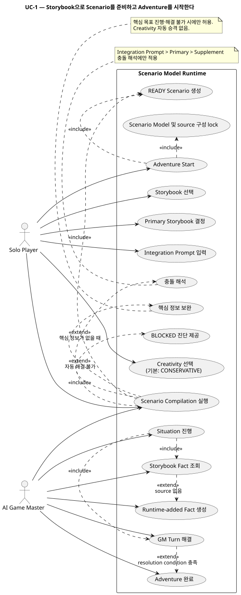
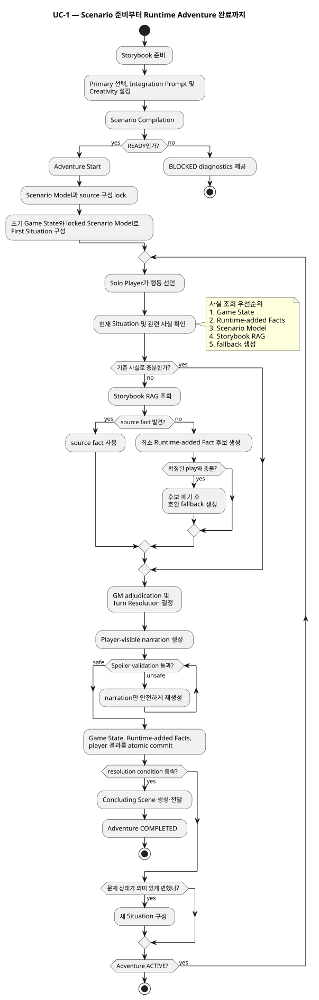

# Product Spec: Scenario Model Runtime

**Ticket ID:** `scenario-model-runtime`  
**Status:** Product requirements confirmed  
**Purpose:** 기존 `Adventure Story Plan / Stage progression` 중심 흐름을 제거하고, Storybook 기반의 `Scenario Model`과 런타임 `Situation`, `Game State`, `Runtime-added Fact`를 이용해 플레이 중 Story가 생성되는 방식으로 교체한다.

---

## 1. Problem and Context

현재 모험 진행 모델은 사전에 `Adventure Story Plan`을 생성하고, Stage와 Branch를 따라 진행하는 구조를 중심으로 한다.

이 방식에서는 실제 TRPG 플레이가 가지는 다음 특성을 충분히 표현하기 어렵다.

- 플레이어가 어떤 순서로 장소와 문제를 탐색할지 사전에 확정되지 않는다.
- NPC, 위험, 단서, 장소 등의 요소는 존재하지만 그것들이 반드시 특정 Stage 순서로 소비되는 것은 아니다.
- 플레이 도중 발생한 행동과 결과가 이후 상황을 변경한다.
- Storybook에 존재하는 정보를 모두 사전에 Stage로 변환할 필요가 없다.
- Storybook에 세부 정보가 없는 경우에도 플레이 자체는 자연스럽게 계속되어야 한다.
- 사전에 계획된 미래 Story보다 현재 세계 상태와 플레이어 행동을 기준으로 AI Game Master가 다음 상황을 판단해야 한다.

따라서 기존의

```text
Scenario Source
→ Adventure Story Plan
→ Stage
→ Branch
→ Ending
```

중심 모델을 다음과 같이 교체한다.

```text
Scenario Source
→ Scenario Compilation
→ Scenario Model
→ Adventure Start
→ Situation
→ GM Turn
→ Game State / Runtime-added Fact
→ Situation 갱신
→ ...
→ Resolution
→ Concluding Scene
→ Adventure Completed
```

Story는 사전에 저장되는 미래 진행 순서가 아니라 실제 플레이의 누적 결과로 생성된다.

---

## 2. Goals and Desired Outcomes

### G-1. 사전 Plot 대신 현재 Situation 기반으로 플레이한다

AI Game Master는 사전에 결정된 Stage 순서를 실행하지 않는다.

현재 세계 상태, Scenario Model, Storybook 정보 및 실제 플레이 결과를 이용해 현재 `Situation`을 판단하고 플레이를 진행한다.

### G-2. Storybook의 원래 내용을 최대한 보존한다

Storybook에 있는 사실은 시나리오의 기준 자료로 사용한다.

Scenario Compilation은 모든 빈칸을 임의로 채우는 과정이 아니며, Storybook에 없는 정보는 기본적으로 만들지 않는다.

### G-3. 플레이에 필요한 최소 구조만 사전에 준비한다

Scenario Compilation은 모든 장소, 대화, 장면, 질문에 대한 답을 미리 생성하는 것을 목표로 하지 않는다.

모험을 시작하고 핵심 목표를 진행·해결할 수 있는 정도의 구조가 준비되면 `READY`가 될 수 있다.

### G-4. 플레이 도중 source에 없는 정보 때문에 진행이 멈추지 않는다

Runtime에서 필요한 사실이 Storybook에도 존재하지 않을 경우 AI Game Master는 플레이 연속성을 위해 필요한 최소 사실을 생성할 수 있다.

이 사실은 `Runtime-added Fact`로 해당 playthrough의 정본이 된다.

### G-5. 이미 발생한 플레이의 일관성을 보호한다

플레이 도중 확정된 `Game State`와 `Runtime-added Fact`는 이후 늦게 발견된 source 정보보다 해당 playthrough에서는 우선한다.

이미 플레이어가 경험한 사실을 source fidelity 때문에 retcon하지 않는다.

### G-6. 비공개 정보가 플레이어에게 유출되지 않는다

Scenario Model, Storybook 또는 Runtime-added Fact의 hidden 정보는 플레이어가 관찰하거나 정당하게 발견하기 전까지 player-visible narration에 직접 노출하지 않는다.

---

## 3. Users and Actors

### Solo Player

유일한 인간 플레이어.

- 캐릭터 행동을 선언한다.
- 세계를 탐색한다.
- NPC와 상호작용한다.
- 행동 결과와 Scene을 전달받는다.
- Scenario Model이나 Situation의 내부 구조는 보지 않는다.

### AI Game Master

인간 GM을 대신한다.

- 현재 Situation을 이해한다.
- 플레이어 행동을 판정한다.
- Storybook 및 Rulebook 정보를 필요에 따라 참조한다.
- Game State를 고려한다.
- 필요한 경우 Runtime-added Fact를 생성한다.
- 플레이어에게 허용된 정보만 narration으로 제공한다.

### Scenario Compilation

Adventure 시작 전 Storybook을 분석하여 Scenario Model을 준비하는 제품 기능이다.

- source를 통합한다.
- 충돌을 해석한다.
- 핵심 시나리오 구조를 추출한다.
- 필요한 경우 선택된 Creativity 정책에 따라 부족한 핵심 정보를 보완한다.

---

## 4. Ubiquitous Language and Terminology

### Scenario Source

모험 준비에 사용되는 원본 자료.

Storybook, Rulebook, map 및 기타 관련 자료를 포함할 수 있다.

### Storybook

시나리오 내용을 담고 있는 source.

새 Scenario Model 흐름에서는 최소 하나의 Storybook이 필수다.

### Scenario Model

Adventure 시작 전에 Scenario Compilation을 통해 만들어지는 숨겨진 시나리오 구조.

다음과 같은 핵심 정보를 포함할 수 있다.

- Actor / Faction / Location
- 관계
- 목표
- resolution condition
- secret / revelation
- encounter anchor
- 시나리오별 위험 및 조건
- Storybook 간 conflict interpretation
- 시작 Situation을 생성하는 데 필요한 정보
- 관련 source reference

Scenario Model은 모든 source 내용을 복제하는 저장소가 아니다.

Storybook의 모든 사실이 Scenario Model에 사전 구조화될 필요는 없다.

### Scenario Compilation

Storybook을 분석하여 Scenario Model을 생성·검증하는 Adventure 준비 과정.

### Primary Storybook

Storybook이 둘 이상일 때 conflict resolution의 기본 기준이 되는 Storybook.

Storybook이 하나뿐이면 자동으로 Primary가 된다.

### Supplement Storybook

Primary Storybook 외에 추가 정보를 제공하는 Storybook.

### Integration Prompt

여러 Storybook 사이의 충돌을 사용자가 어떻게 해석할지 지정하는 선택적 지시.

일반적인 시나리오 재작성 명령이 아니라 **Storybook 간 충돌의 해석 및 해결**에 사용한다.

### Creativity

Scenario Compilation에서 Storybook에 없는 핵심 정보를 어느 정도 보완할 수 있는지 정하는 설정.

Runtime의 improvisation 정도를 제어하는 설정은 아니다.

값:

- `NONE`
- `CONSERVATIVE`
- `CREATIVE`

기본값:

- `CONSERVATIVE`

### Game State

실제 플레이 결과에 의해 바뀐 현재 세계 상태.

예:

- 문이 부서졌다.
- NPC가 부상을 입었다.
- 플레이어가 함정을 설치했다.
- 물건이 이동했다.
- NPC가 어떤 사실을 알게 되었다.

### Runtime-added Fact

Runtime 중 필요한 시나리오 사실을 source에서 찾을 수 없을 때 AI Game Master가 생성하는 지속적인 사실.

해당 playthrough 동안 정본으로 유지된다.

예:

> Harl에게 북쪽 지방에 사는 Mara라는 여동생이 있다.

Runtime-added Fact가 생성됐다는 것은 이미 해당 사실이 플레이 진행에 필요한 지속적 사실이라는 뜻이므로 별도의 중요도 판정을 하지 않는다.

### Situation

현재 플레이 가능한 문제 상태를 표현하는 AI Game Master 내부 runtime context.

예를 들어 현재 위치, 갈등, 위협, 관련 Actor, 현재 목표 및 최근 결과를 종합한다.

Situation은 player-visible 데이터가 아니다.

한 Situation은 여러 GM Turn 동안 지속될 수 있다.

### Scene

현재 Situation이 플레이어에게 전달되는 표현.

Narration, dialogue, 관찰 가능한 반응 등이 포함된다.

### GM Turn

한 번의 플레이 진행 원자 단위.

일반적으로:

```text
Player input
→ GM adjudication
→ 필요한 사실 조회
→ 결과 계산
→ narration
→ state/fact commit
```

을 포함한다.

### Revelation

플레이어가 발견할 수 있는 중요한 진실.

### Clue

Revelation을 발견하게 해주는 관찰 가능한 증거 또는 경로.

### Story

실제 플레이를 통해 누적된 과거의 사건.

사전에 저장된 미래 진행 계획이 아니다.

### Plot

미래 사건 순서를 미리 결정한 흐름.

새 Runtime 모델의 핵심 실행 단위로 사용하지 않는다.

---

## 5. Core Use Cases

### Product Diagrams

UC-1 다이어그램은 Scenario 준비·시작과 Runtime GM Turn의 사실 조회·spoiler-safe commit 흐름을 함께 검토한다. Product 단계이므로 구조 클래스 다이어그램은 포함하지 않는다.





### UC-1. Storybook으로 Scenario를 준비한다

Solo Player가 Adventure에서 사용할 Storybook을 선택한다.

Storybook은 최소 하나 이상이어야 한다.

Storybook이 하나라면 해당 Storybook이 자동으로 Primary가 된다.

둘 이상이면 사용자가 Primary를 선택해야 한다.

사용자는 필요하면 Integration Prompt를 입력할 수 있다.

Creativity 값을 선택한 뒤 Scenario Compilation을 실행한다.

---

### UC-2. 여러 Storybook을 하나의 Scenario로 통합한다

Scenario Compilation은 다음 우선순위를 사용한다.

```text
Integration Prompt
> Primary Storybook
> Supplement Storybooks
```

Supplement는 Primary에 없는 정보를 추가할 수 있다.

Storybook 간 정보가 호환되면 함께 사용한다.

충돌할 경우 Integration Prompt가 있으면 해당 지시를 우선한다.

Integration Prompt가 없으면 기본적으로 Primary Storybook을 우선한다.

Conflict resolution은 가능한 한 자동으로 처리한다.

---

### UC-3. Storybook에 없는 핵심 정보가 발견된다

Scenario Compilation 중 Storybook에 없는 정보가 발견됐다는 이유만으로 내용을 생성하지 않는다.

다만 그 정보가 없으면 시나리오의 **핵심 목표를 진행하거나 해결할 수 없는 경우** Creativity 정책을 적용한다.

#### NONE

새 사실을 생성하지 않는다.

필요한 정보가 없으면 Compilation은 진행을 완료할 수 없다.

#### CONSERVATIVE

Storybook과 강하게 연결되거나 암시되는 최소한의 정보만 추가한다.

불필요하게 세계 설정을 확장하지 않는다.

#### CREATIVE

Storybook과 모순되지 않는 범위에서 핵심 목표를 진행·해결하는 데 필요한 새로운 사실을 생성할 수 있다.

선택적 세계관 확장은 하지 않는다.

---

### UC-4. Scenario Compilation이 READY가 된다

다음 조건이 충족되면 Scenario가 `READY`가 될 수 있다.

- 최소 하나의 Storybook이 준비되어 있다.
- 필요한 Storybook RAG source가 사용 가능하다.
- 여러 Storybook일 경우 Primary가 결정되어 있다.
- Scenario Model의 핵심 구조가 준비되어 있다.
- Adventure의 첫 Situation을 생성할 수 있다.
- 핵심 목표를 이해할 수 있다.
- 언제 목표가 해결됐는지 판별할 resolution condition이 있다.
- 자동으로 처리할 수 없는 치명적 모순이 없다.

다음 항목이 없다고 해서 READY를 막지는 않는다.

- 모든 NPC의 세부 설정
- 모든 장소의 세부 정보
- 플레이어가 할 수 있는 모든 질문의 답
- 미래 Scene 전체
- 미래 encounter 전체
- 모든 Storybook 사실의 사전 구조화

---

### UC-5. Compilation이 사용자 개입을 요구한다

AI는 가능한 한 충돌이나 부족한 정보를 자동으로 해결한다.

자동 해결이 정말 불가능한 경우에만 Compilation이 사용자 개입을 요구한다.

사용자에게 실제 문제가 무엇인지 숨기지 않는다.

필요하다면 spoiler가 포함되더라도 다음 내용을 제공한다.

- 문제가 있는 Storybook
- source 위치
- 충돌하거나 누락된 사실
- 자동 해결에 실패한 이유
- 적용된 Creativity / Primary 등의 정책
- 구체적인 수정 방법
- 적용 가능한 Integration Prompt 예시

---

### UC-6. Adventure를 시작한다

`READY` 상태의 Scenario로 Adventure Start를 실행한다.

Adventure Start 시 현재 Scenario Model과 source 구성을 lock한다.

Adventure가 시작된 후에는:

- Scenario Model을 재컴파일하지 않는다.
- Primary를 변경하지 않는다.
- Integration Prompt를 변경하지 않는다.
- Creativity를 변경하여 다시 compile하지 않는다.
- Runtime에서 새로 발견된 source 정보를 Scenario Model에 write-back하지 않는다.

첫 Situation은 Compilation 때 저장하지 않는다.

Adventure Start 시점의 초기 Game State와 Scenario Model, Storybook 정보로 Runtime에서 생성한다.

---

### UC-7. 현재 Situation에서 플레이한다

AI Game Master는 현재 Situation을 기준으로 Scene을 제공한다.

Solo Player가 행동한다.

AI Game Master는 현재 상황과 관련된 사실만 사용해 행동을 처리한다.

하나의 Situation에서 여러 GM Turn이 진행될 수 있다.

---

### UC-8. Runtime에서 필요한 Scenario Fact를 조회한다

현재 행동을 처리하는 데 시나리오 사실이 필요하면 다음 우선순위로 확인한다.

```text
1. 현재 Game State
2. 기존 Runtime-added Facts
3. Scenario Model의 확정된 구조 및 conflict interpretation
4. Storybook RAG
5. Runtime fallback 생성
```

이미 플레이 중 확정된 세계가 가장 우선한다.

---

### UC-9. Storybook RAG에서 필요한 사실을 찾는다

Scenario Model에 해당 세부 내용이 없더라도 Storybook source에 존재한다면 Runtime RAG를 통해 찾아 사용할 수 있다.

RAG로 찾아낸 Storybook 사실은 Scenario Model에 다시 저장할 필요가 없다.

RAG는 source 접근 수단이며 Scenario Compilation에서 이미 결정된 Storybook conflict interpretation을 다시 뒤집지 않는다.

---

### UC-10. Storybook에도 없는 사실이 필요하다

필요한 시나리오 사실을 찾기 위해 Storybook RAG를 조회했지만 해당 정보가 없으면 AI Game Master는 플레이를 중단하지 않는다.

현재 플레이에 필요한 최소 사실을 생성한다.

생성된 사실은 즉시 `Runtime-added Fact` 후보가 된다.

예:

```text
NPC의 가족 관계가 플레이에 필요함
→ Storybook RAG 조회
→ 관련 정보 없음
→ "NPC에게 북쪽 지방에 사는 여동생이 있다" 생성
→ Runtime-added Fact
```

Runtime-added Fact 생성은 Scenario Compilation Creativity 설정의 제한을 받지 않는다.

`Creativity = NONE`인 Scenario에서도 Runtime continuity를 위해 필요한 사실은 생성할 수 있다.

---

### UC-11. 새 Runtime-added Fact가 기존 플레이와 충돌한다

새 Runtime-added Fact 후보가 다음과 충돌하면 새 후보를 사용하지 않는다.

- 기존 Runtime-added Fact
- 현재 Game State
- 이미 확정된 플레이 결과

기존 플레이 기록을 유지하고 충돌하지 않는 새로운 fallback fact를 생성한다.

---

### UC-12. 나중에 Storybook 원문에서 다른 사실을 발견한다

이미 Runtime-added Fact가 플레이에서 확정된 뒤 Storybook RAG를 통해 모순되는 원문 사실이 발견될 수 있다.

이 경우 해당 playthrough에서는 이미 확정된 Runtime-added Fact를 유지한다.

Storybook 원문 때문에 플레이를 retcon하지 않는다.

---

### UC-13. Situation이 변화한다

GM Turn 결과로 현재 문제 상태가 충분히 변경되면 AI Game Master는 기존 Situation을 종료하고 새로운 Situation을 구성한다.

Situation transition의 예:

- 주요 위치 변경
- 주요 갈등 해결
- 새로운 갈등 발생
- 주요 Actor 관계의 변화
- 현재 목표 변화
- 중요한 위협 상태 변화

단순히 GM Turn 하나가 끝났다는 이유만으로 Situation을 바꾸지는 않는다.

---

### UC-14. Hidden Fact를 이용해 NPC가 반응한다

AI Game Master는 hidden fact를 내부 reasoning에 사용할 수 있다.

그러나 플레이어 출력에는 아직 발견되지 않은 hidden truth를 직접 넣지 않는다.

예:

내부 사실:

> Harl이 살인범이며 자신의 범행이 밝혀지는 것을 두려워한다.

허용:

> Harl은 잠시 말을 멈추고 시선을 피한다.

금지:

> Harl은 자신의 살인이 밝혀질까 두려워했다.

---

### UC-15. Narration에서 spoiler leak이 탐지된다

Player-visible narration이 숨겨진 정보를 노출하면 해당 narration을 버린다.

이미 결정된 Turn Resolution은 유지한다.

다음 요소를 다시 계산하지 않는다.

- 주사위 결과
- 판정 결과
- Game State 결과
- 이미 결정된 Runtime-added Fact
- 행동의 실제 outcome

오직 player-visible narration만 안전하게 다시 생성한다.

반복적으로 안전한 narration을 만들지 못하면 해당 unsafe output을 사용자에게 노출하지 않는다.

---

### UC-16. GM Turn을 commit한다

하나의 성공한 GM Turn에서 다음 항목을 원자적으로 확정한다.

- Game State 변경
- 새 Runtime-added Facts
- 플레이어에게 전달되는 결과

Turn이 실패하거나 최종적으로 폐기되면 해당 Turn에서 새로 만들어진 state와 fact도 확정하지 않는다.

---

### UC-17. Scenario의 핵심 목표가 해결된다

GM Turn의 결과로 Scenario Model의 resolution condition이 충족되면 AI Game Master는 해당 행동의 결과를 처리한다.

그 후 자연스러운 concluding Scene을 생성한다.

Concluding Scene이 완료되면 Adventure를 `COMPLETED`로 전환한다.

---

## 6. Business Rules and Invariants

### BR-1. Storybook Required

새 Scenario Model 흐름에서는 Storybook이 최소 하나 이상 필요하다.

Rulebook만으로 Adventure를 생성하는 `Rulebook-Only` 모드는 지원하지 않는다.

### BR-2. No Preplanned Story Execution

Adventure의 미래 진행을 Stage, Branch, Ending 순서로 사전 결정하지 않는다.

### BR-3. Source Missing Does Not Mean Generate

Storybook에 없는 정보는 기본적으로 비워둔다.

Schema를 채우기 위한 목적으로 사실을 생성하지 않는다.

### BR-4. Compilation Supplementation Is Core-Need Only

Scenario Compilation의 creativity 기반 생성은 그 정보가 없으면 핵심 목표를 진행하거나 해결할 수 없을 때만 허용한다.

### BR-5. Creativity Does Not Automatically Escalate

`NONE → CONSERVATIVE → CREATIVE`로 시스템이 자동 승격하지 않는다.

현재 설정으로 Compile이 불가능하면 사용자에게 알리고 사용자가 직접 값을 변경해야 한다.

### BR-6. Conflict Resolution Is Separate From Creativity

Storybook A와 Storybook B가 서로 충돌할 때 두 내용을 합치기 위해 임의의 세 번째 사실을 생성하지 않는다.

Conflict는 우선순위에 따라 해석한다.

### BR-7. Integration Prompt Has Highest Conflict Authority

Storybook conflict에 한해서:

```text
Integration Prompt
> Primary Storybook
> Supplement Storybooks
```

순서를 따른다.

### BR-8. Scenario Model Is Hidden

Solo Player는 Scenario Model의 내부 구조를 검토하거나 승인하지 않는다.

Compilation이 READY면 Adventure Start가 가능하다.

### BR-9. Adventure Start Locks Scenario Compilation

Adventure Start 이후 Scenario Model과 compilation interpretation은 변경하지 않는다.

### BR-10. Runtime Lookup Before Invention

Runtime-added Fact를 생성하기 전에 관련 Storybook RAG를 먼저 조회해야 한다.

### BR-11. Runtime Continuity Over Missing Source

RAG가 답을 제공하지 못한다고 해서 플레이를 중단하지 않는다.

필요한 최소 사실을 생성하여 계속한다.

### BR-12. Runtime-added Fact Automatically Persists

RAG fallback으로 사실을 생성했다면 해당 사실은 지속적으로 참조될 필요가 있는 정보이므로 별도 중요도 판정 없이 Runtime-added Fact로 취급한다.

### BR-13. Established Play Wins

새 정보가 기존 Game State 또는 Runtime-added Fact와 충돌하면 기존 플레이의 사실을 유지한다.

### BR-14. Late Source Discovery Does Not Retcon Play

Storybook에서 나중에 발견한 원문이 이미 확정된 Runtime-added Fact와 충돌해도 해당 playthrough에서는 Runtime-added Fact를 유지한다.

### BR-15. Runtime Creativity Is Independent

Scenario Compilation의 Creativity 값은 Runtime fallback fact 생성 여부를 제한하지 않는다.

### BR-16. Situation Is Derived Runtime Context

Situation은 Scenario Model의 일부로 사전에 작성되는 미래 Stage가 아니다.

현재 세계 상태에서 파생된다.

### BR-17. One Situation May Span Multiple GM Turns

GM Turn이 끝났다는 이유만으로 Situation transition을 발생시키지 않는다.

### BR-18. Hidden Information Is Not Player-visible By Default

Storybook Fact, Scenario Model Fact, Runtime-added Fact 모두 동일한 disclosure rule을 적용한다.

Fact의 출처가 disclosure 여부를 결정하지 않는다.

### BR-19. Observable Consequences Are Allowed

Hidden fact가 NPC 행동이나 세계 반응의 원인이 될 수 있지만 플레이어에게는 관찰 가능한 결과만 보여줄 수 있다.

### BR-20. Turn Resolution Is Stable During Narration Retry

Spoiler filtering 때문에 narration을 재생성해도 Turn Resolution을 다시 수행하지 않는다.

### BR-21. GM Turn Is Atomic

Game State, Runtime-added Facts, 플레이어 결과는 성공한 Turn에서 함께 commit된다.

### BR-22. Story Is Emergent

Story는 Situation과 Player Action 및 그 결과의 누적이다.

미래 Story sequence를 정본 데이터로 저장하지 않는다.

---

## 7. States and State Transitions

### Scenario Compilation State

```text
UNCOMPILED
    |
    v
COMPILING
    |
    +------ successful ------> READY
    |
    +------ intervention ----> BLOCKED
```

`BLOCKED` 이후 사용자는 문제를 해결한 뒤 다시 Compilation을 실행할 수 있다.

Adventure Start 전에는 다음 변경으로 새 Compilation을 수행할 수 있다.

- Primary 변경
- Integration Prompt 변경
- Creativity 변경
- source 구성 변경

새 Compilation 결과가 이전 후보를 대체한다.

### Adventure Lifecycle

```text
READY Scenario
    |
Adventure Start
    |
    v
ACTIVE
    |
    | resolution condition satisfied
    v
CONCLUDING
    |
    | concluding Scene delivered
    v
COMPLETED
```

Adventure Start 이후 Scenario Model은 lock된다.

### Situation Lifecycle

```text
Situation 생성
    |
    v
ACTIVE SITUATION
    |
    +--> GM Turn
    |
    +--> GM Turn
    |
    +--> GM Turn
    |
    | meaningful problem-state change
    v
새 Situation 생성
```

### GM Turn Lifecycle

```text
Player Action
    |
    v
Current facts/state 확인
    |
    v
필요 시 Storybook RAG
    |
    +-- source found --> source fact 사용
    |
    +-- source absent --> Runtime-added Fact 후보 생성
    |
    v
Turn Resolution
    |
    v
Player-visible narration 생성
    |
    v
Spoiler Validation
    |
    +-- unsafe --> narration only regenerate
    |
    +-- safe
          |
          v
Atomic Commit
```

---

## 8. Failures, Exceptions, and Boundary Conditions

### Compilation BLOCKED

BLOCKED는 일반적인 흐름이 아니라 최후 수단이다.

자동 해결이 불가능한 경우 실제 문제를 사용자에게 구체적으로 보여준다.

### Creativity NONE에서 핵심 정보가 없음

Scenario의 핵심 진행 또는 해결에 필요한 사실이 source에 없으면 READY가 될 수 없다.

사용자가 source 또는 설정을 수정해야 한다.

### Storybook RAG가 결과를 찾지 못함

Runtime을 BLOCK하지 않는다.

플레이에 필요한 최소 Runtime-added Fact를 생성한다.

### RAG 자체가 일시적으로 답을 제공하지 못함

단순한 세부 정보 누락 때문에 플레이를 정지시키는 대신, 플레이 연속성을 위해 필요한 최소 사실을 생성하는 것이 기본 제품 동작이다.

### 새 Runtime Fact가 기존 Play와 충돌

새 fact 후보를 폐기하고 기존 play state와 호환되는 값을 다시 만든다.

### 후속 RAG 결과가 Runtime-added Fact와 충돌

이미 확정된 Runtime-added Fact가 유지된다.

### Narration Spoiler Leak

unsafe narration은 사용자에게 표시하지 않는다.

Turn Resolution은 그대로 유지한 채 narration만 재생성한다.

### Narration을 안전하게 만들 수 없음

부분적인 unsafe 결과를 보여주지 않는다.

Turn을 성공적으로 commit하지 않는다.

### Adventure Completed 이후

이번 범위에서는 post-adventure 자유 플레이를 지원하지 않는다.

---

## 9. Inputs and Outputs

### Scenario Preparation Inputs

필수:

- Storybook 1개 이상

조건부 필수:

- Storybook 2개 이상일 때 Primary Storybook

선택:

- Supplement Storybooks
- Integration Prompt
- Creativity

Creativity 기본값:

```text
CONSERVATIVE
```

### Scenario Compilation Internal Output

- Scenario Model
- conflict interpretation
- resolution conditions
- 시작 Situation 생성에 필요한 정보
- warnings
- BLOCKED diagnostics

Scenario Model 자체는 사용자에게 표시하지 않는다.

### Compilation User-visible Output

성공:

```text
READY
```

필요에 따라:

- non-blocking warnings

실패:

- 실제 문제
- 관련 source
- 이유
- 현재 정책
- 수정 제안
- Integration Prompt 예시

### Runtime Inputs

- Player Action
- 현재 Game State
- 기존 Runtime-added Facts
- relevant Scenario Model information
- recent play context
- Storybook RAG 결과
- 필요한 Rulebook 정보

### Runtime Outputs

내부:

- Situation
- Turn Resolution
- Game State 변경
- Runtime-added Fact
- disclosure 판단

플레이어:

- Scene
- 행동 결과
- dialogue
- 관찰 가능한 반응
- 정당하게 발견된 사실

---

## 10. Scope and Non-goals

### In Scope

- Adventure Story Plan 기반 진행 완전 교체
- Storybook 필수화
- Scenario Compilation
- Scenario Model
- Creativity 정책
- Multi-Storybook Primary/Supplement
- Integration Prompt
- conflict resolution
- Scenario READY / BLOCKED 흐름
- Adventure Start Lock
- runtime Storybook RAG
- Runtime-added Fact
- Game State
- Situation
- Situation transition
- hidden information disclosure rule
- spoiler-safe narration regeneration
- atomic GM Turn
- resolution condition
- concluding Scene
- Adventure completion

### Out of Scope

- Rulebook-only Adventure 생성
- Stage 기반 Story 진행
- Branch 기반 미래 Plot 실행
- Scenario Model 사용자 검토/승인 UI
- Scenario Model runtime 재컴파일
- Runtime에서 Scenario Model enrichment/write-back
- Player Notes
- 사용자용 Player Knowledge 관리 기능
- post-adventure free play
- 모든 Storybook 정보를 미리 구조화
- 미래 Scene 전체 생성
- 미래 행동 경로의 사전 계획
- 세부 구현 구조 또는 persistence 설계
- 서비스/모듈 배치 결정

---

## 11. Priorities and Trade-offs

제품 행동이 충돌할 경우 다음을 우선한다.

### P-1. 플레이 연속성

source에 세부 정보가 없더라도 현재 플레이가 진행될 수 있어야 한다.

### P-2. 이미 확정된 플레이의 일관성

이미 플레이에서 확정된 사실은 이후 정보 때문에 뒤집지 않는다.

### P-3. Scenario Compilation의 확정된 해석

여러 Storybook의 충돌에 대해 Compilation이 내린 해석은 Runtime RAG가 재해석하지 않는다.

### P-4. Storybook Source Fidelity

위 원칙과 충돌하지 않는 범위에서는 Storybook 원문을 우선 사용한다.

### P-5. 최소한의 Runtime 창작

source가 없을 때만 현재 진행에 필요한 최소 사실을 생성한다.

요약하면:

```text
Play Continuity
> Established Play Consistency
> Compilation Conflict Interpretation
> Storybook Source Fidelity
> Runtime Invention
```

단, Runtime invention 전에 Storybook lookup은 반드시 먼저 수행한다.

---

## 12. Success Conditions and Acceptance Criteria

### AC-1 — Storybook Requirement

Storybook이 하나도 없는 Scenario는 새 Adventure Runtime 흐름에서 시작할 수 없다.

### AC-2 — Primary Selection

Storybook이 하나면 자동으로 Primary가 된다.

두 개 이상이면 Primary가 결정되어야 Compilation이 유효하게 진행된다.

### AC-3 — Integration Priority

Integration Prompt가 Storybook conflict에 대한 명시적 해석을 제공하면 Primary보다 우선한다.

### AC-4 — Default Creativity

사용자가 별도 설정하지 않으면 `CONSERVATIVE`로 Compilation한다.

### AC-5 — No Automatic Creativity Escalation

현재 Creativity 정책으로 Compile할 수 없더라도 시스템이 자동으로 더 높은 Creativity를 선택하지 않는다.

### AC-6 — No Schema-filling Invention

핵심 진행과 무관한 Storybook 누락 정보를 단순히 Scenario Model 필드를 채우기 위해 생성하지 않는다.

### AC-7 — READY Does Not Require Full Pre-generation

모든 NPC, 장소, Scene, encounter 및 가능한 질문이 준비되지 않았더라도 Adventure의 시작과 핵심 resolution 판단이 가능하면 READY가 될 수 있다.

### AC-8 — Hidden Scenario Model

READY Scenario의 내부 Scenario Model 내용을 Solo Player에게 검토 또는 승인하도록 요구하지 않는다.

### AC-9 — Adventure Lock

Adventure Start 이후 해당 playthrough의 Scenario Model을 변경하거나 재컴파일할 수 없다.

### AC-10 — Runtime Situation Generation

첫 Situation을 포함한 모든 Situation은 Runtime에서 현재 상태를 기준으로 구성된다.

### AC-11 — Multi-turn Situation

문제 상태가 실질적으로 변하지 않았다면 여러 GM Turn이 같은 Situation에서 진행될 수 있다.

### AC-12 — Lookup Priority

Runtime 사실 조회는 다음 순서를 존중한다.

```text
Game State
→ Runtime-added Facts
→ Scenario Model
→ Storybook RAG
→ fallback generation
```

### AC-13 — Lookup Before Runtime Invention

새 Runtime-added Fact를 생성하기 전에 관련 Storybook RAG lookup을 수행한다.

### AC-14 — Runtime Fallback

관련 Storybook source에 답이 없으면 필요한 최소 사실을 생성하고 플레이를 계속할 수 있다.

### AC-15 — Runtime Fact Persistence

RAG fallback으로 생성되어 성공한 Turn에서 사용된 사실은 Runtime-added Fact로 저장된다.

별도 importance 판정을 요구하지 않는다.

### AC-16 — Existing Runtime Fact Wins

새 fallback fact가 기존 Runtime-added Fact 또는 Game State와 충돌하면 기존 값을 유지한다.

### AC-17 — No Late-source Retcon

후속 Storybook RAG 결과가 기존 Runtime-added Fact와 충돌해도 해당 playthrough의 기존 사실을 변경하지 않는다.

### AC-18 — Runtime Creativity Independent of Compilation

`Creativity = NONE`으로 Compile된 Scenario에서도 Runtime continuity에 필요한 fallback fact는 생성할 수 있다.

### AC-19 — Hidden Fact Protection

미발견 secret, NPC hidden motivation, unknowable cause 등은 player-visible output에 직접 포함하지 않는다.

### AC-20 — Observable Reaction Allowed

Hidden fact 때문에 발생한 플레이어가 실제로 관찰 가능한 NPC 반응은 출력할 수 있다.

### AC-21 — Runtime-added Fact Disclosure

Runtime-added Fact도 Storybook fact와 동일한 disclosure policy를 적용한다.

생성됐다는 이유만으로 즉시 공개하지 않는다.

### AC-22 — Narration Retry Stability

Spoiler leak 때문에 narration을 다시 생성하더라도 Turn Resolution, dice result 및 world outcome은 변경되지 않는다.

### AC-23 — Atomic Turn Commit

성공한 Turn의 Game State 변경, Runtime-added Fact 및 player-visible result는 하나의 GM Turn 결과로 함께 확정된다.

### AC-24 — Failed Turn Leaves No New Canon

Turn이 최종 실패하거나 폐기되면 해당 Turn에서 새로 생성한 Game State 변경과 Runtime-added Fact를 남기지 않는다.

### AC-25 — Completion by Resolution Condition

Adventure 완료 여부는 마지막 Stage가 아니라 Scenario의 resolution condition으로 판단한다.

### AC-26 — Concluding Scene

Resolution condition을 충족한 Turn에서 행동 결과를 처리한 뒤 concluding Scene을 제공하고 Adventure를 `COMPLETED`로 전환한다.

### AC-27 — No Post-adventure Runtime

`COMPLETED` 이후 별도의 자유 플레이 모드는 이번 기능의 성공 조건에 포함되지 않는다.

---

## Product Diagram Contract

이번 변경은 핵심 사용자 흐름을 완전히 교체하므로 Product use-case 및 activity diagram 대상이다.

저장소 산출물로 작성할 경우 최소 다음 다이어그램이 필요하다.

```text
docs/specs/scenario-model-runtime/diagrams/product/
├─ UC-1.usecase.puml
├─ UC-1.usecase.svg
├─ UC-1.activity.puml
└─ UC-1.activity.svg
```

`UC-1.usecase`는 최소 다음 관계를 보여야 한다.

```text
Solo Player
 ├─ Storybook 선택
 ├─ Primary 선택
 ├─ Integration Prompt / Creativity 설정
 ├─ Scenario Compile
 └─ Adventure Start

AI Game Master
 ├─ Situation 진행
 ├─ Storybook Fact 조회
 ├─ Runtime-added Fact 생성
 ├─ GM Turn 해결
 └─ Adventure 완료
```

`UC-1.activity`는 최소 다음 전체 흐름을 보여야 한다.

```text
Storybook 준비
→ Scenario Compilation
→ READY
→ Adventure Start / Lock
→ First Situation
→ Player Action
→ Existing Runtime State 조회
→ Scenario Model 조회
→ Storybook RAG
→ [없으면 Runtime-added Fact]
→ Turn Resolution
→ Spoiler-safe Narration
→ Atomic Commit
→ Situation 유지/전환
→ Resolution condition?
→ Concluding Scene
→ COMPLETED
```

**Business-state diagram:** 해당 없음 — Scenario Compilation과 Adventure lifecycle은 위 Product activity flow 안에서 충분히 검토 가능하며, 별도의 업무 상태 다이어그램이 독립적인 Product 목적을 갖지는 않는다.
