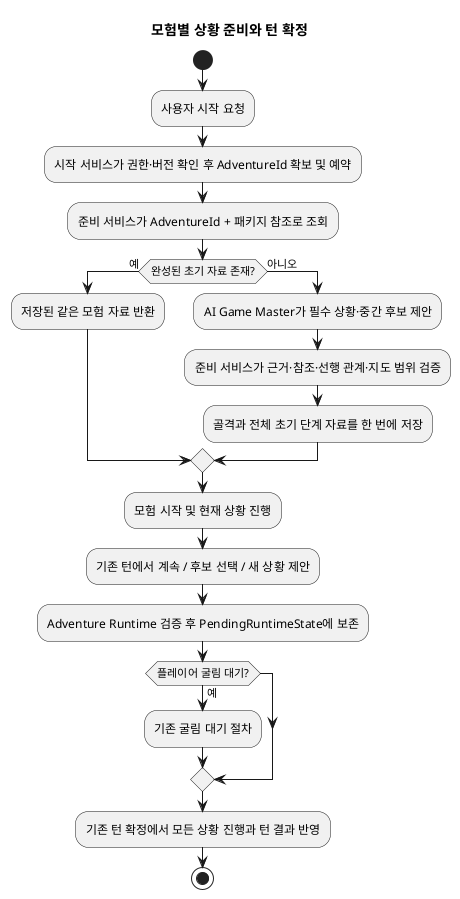

# Architecture Spec: 모험별 상황 준비와 턴 확정

## 1. Design Scope

### 1.1 Target

| 항목 | 대상 |
|---|---|
| Product Spec | [product-spec.md](product-spec.md) |
| Use Cases | UC-1 초기 필수 상황·중간 후보 준비, UC-2 후보 선택, UC-3 후보 부재 시 새 상황 생성 |
| Domain | 모험별 상황 준비 및 기존 모험 진행 |
| Bounded Contexts | Scenario Preparation 및 Adventure Runtime (`adventure-service` 내부 경계) |
| Existing Services | `adventure-service`, AI Game Master (`ai-game-master-service`), 기존 자료·지도·세션 서비스 |
| External Dependencies | 기존 AI Game Master 호출 경로, PostgreSQL, 기존 지도·원문 참조 |
| Affected Data | 모험별 초기 준비 자료, 모험 진행 상태, 확정 대기 턴 상태 |

### 1.2 Product Spec Mapping

| Product Spec 항목 | Architecture 요소 |
|---|---|
| UC-1, R-01, R-02, R-03, R-07, R-09 | 준비 서비스가 모험 식별자로 초기 전체 상황 세트를 생성·검증·게시 |
| UC-2, R-01, R-03, R-04, R-06, R-08, R-09 | 기존 턴 서비스가 현재 상황과 확정 사건을 바탕으로 계속 진행 또는 후보 선택을 제안하고 검증 |
| UC-3, R-05, R-06, R-08, R-09 | 후보가 없으면 새 중간 상황 후보를 제안하고 기존 턴 확정에 포함 |
| R-01, R-06, R-07 | 원문 선행 관계·출처·모험에 제공된 지도만 도메인 검증에서 강제 |
| R-08 | 기존 버전·권한·공개 범위·플레이어 굴림 대기 절차를 유지 |
| R-09, ST-05 | 초기 자료 및 플레이 상태에 AdventureId 소유 범위를 적용하고 모험 간 공유 금지 |
| ST-01, ST-02 | 응답 시간 및 저장량 수치 목표는 근거가 없어 미확정 |

## 2. Domain Flow

### 2.1 Event Storming Flow



### 2.2 Commands

| Command | Actor | Target | Input | Preconditions | Result |
|---|---|---|---|---|---|
| 초기 상황 준비 | 시작 응용 서비스 | Scenario Preparation | AdventureId, SessionId, 패키지 ID | 권한·세션 버전 확인, 모험 식별자 예약 | 전체 초기 준비 결과 또는 기존 완성 결과 |
| 상황 진행 계획 | Runtime Turn 응용 서비스 | Adventure Runtime | 현재 상황, 모험별 후보·사용 상태, 확정 사건 | 활성 모험·턴 소유권 확인 | 계속, 후보 선택 또는 새 상황 제안 |
| 상황 진행 확정 | 기존 턴 확정 흐름 | Adventure | PendingRuntimeState와 턴 식별자 | 버전·굴림·소유권 검증 통과 | 상황 진행 및 나머지 턴 결과의 단일 확정 |

### 2.3 Domain Events

| Domain Event | Producer | Trigger | Payload | Consumers |
|---|---|---|---|---|
| 독립 초기 상황 준비 완료 | Scenario Preparation | 전체 초기 자료의 원자적 저장 성공 | 모험·패키지·개정 식별자 | 모험 시작 흐름 |
| 턴 상황 진행 확정 | Adventure | 기존 턴 확정 성공 | 모험·턴 버전 및 확정된 상황 진행 | 기존 런타임 읽기 경로 |

### 2.4 Policies

| Policy | Trigger Event | Decision | Emitted Command | Owner |
|---|---|---|---|---|
| 시작 준비 재사용 | 시작 요청 | 같은 모험·패키지·개정의 완성 자료가 있으면 재사용 | 없음 | Scenario Preparation |
| 다음 상황 결정 | 확정된 플레이 흐름 | 원문 선행 관계와 사용 상태에 따라 후보 선택, 후보 부재 시 생성 | 상황 진행 계획 | Adventure Runtime |
| 턴 확정 | 검증된 대기 상태 | 상황 선택·사용·추가와 턴 결과를 함께 확정 | 기존 턴 확정 | Adventure Runtime |

### 2.5 Read Models

| Read Model | Consumer | Source | Fields | Owner |
|---|---|---|---|---|
| 모험의 초기 상황 자료 | 시작·진행 서비스 | 준비 자료 저장소 | 모험 ID, 패키지·개정 참조, 골격, 전체 초기 상세 단계 | Scenario Preparation |
| 모험 상황 진행 상태 | Runtime Turn 및 프롬프트 구성 | `StoryRuntimeState` (모험의 이야기 진행 상태) | 초기 후보의 사용 여부, 필수 상황 진행, 플레이 중 추가 상황 | Adventure Runtime |

### 2.6 External Interactions

| External System | Trigger | Input | Output | Failure |
|---|---|---|---|---|
| AI Game Master | 초기 준비 또는 턴 상황 계획 | 모험·세션 식별자, 선택된 실행 설정, 원문 근거 범위 및 현재 모험 상태 | 상황 후보 제안 | 기존 제한·분류·재시도 정책 적용; 실패를 완성 결과로 취급하지 않음 |
| PostgreSQL | 자료 조회·게시 또는 턴 확정 | 모험 키·버전 조건의 저장 명령 | 저장 결과 | 기존 충돌·확정 복구 절차 적용 |

### 2.7 Hotspots

| Hotspot | Options | Decision |
|---|---|---|
| 같은 원문을 쓰는 모험의 초기 상황 공유 | 패키지 기준 공유 / 모험별 분리 | AdventureId 포함 키로 독립 생성·저장. 원문 패키지는 참조만 함 |
| 시작 전 생성 또는 시작 후 지연 생성 | 전체 초기 자료 선준비 / 다음 단계에서 생성 | 시작 완료 전에 모든 초기 필수 상황과 중간 후보의 핵심 요소를 준비 |
| 단계 순서 의미 | 연속 진행 제약 / 자료 정리 순서 | StageBackbone.order는 준비 자료의 나열 순서. 상황 진행은 원문에 명시된 선행 관계만 제약 |
| 상황 전환 확정 | 별도 저장 / 기존 턴 확정에 포함 | 현재 상황 종료·다음 활성화·후보 사용 및 신규 상황을 같은 턴 확정에 포함 |

## 3. DDD Architecture

### 3.1 Bounded Contexts

| Bounded Context | Responsibility | Ubiquitous Language | Owned Model | Owned Data |
|---|---|---|---|---|
| Scenario Preparation | 모험별 초기 필수 상황과 중간 후보 생성·검증·게시 | 준비 상황, 근거 출처, 원문 선행 관계 | StageBackbone, DetailedStage, SituationDefinition | 모험 키가 포함된 초기 준비 자료 |
| Adventure Runtime | 모험 진행 중 후보 선택·추가, 턴 검증·확정 | 현재 상황, 상황 사용 상태, 확정 대기 턴 | StoryRuntimeState, PendingRuntimeState, Adventure | 모험별 플레이 진행 상태와 확정 턴 |

### 3.1.1 Boundary Decisions

| Capability | Owner Context | Candidate Boundary | Chosen Boundary | Why Not Weaker? | Why Not Stronger? |
|---|---|---|---|---|---|
| 초기 상황 준비 | Scenario Preparation | 내부 capability | 기존 준비 경계 확장 | 자료 생성·검증·저장 책임을 기존 준비 흐름에서 수행 | 별도 모듈·서비스는 독립 소유·수명·배포 요구가 없고 동기 협력과 같은 저장 일관성을 필요로 함 |
| 플레이 중 상황 진행 | Adventure Runtime | 내부 capability | 기존 모험 진행 경계 확장 | 턴 검증·굴림 대기·확정과 원자적으로 결합해야 함 | 별도 경계는 같은 모험 턴의 원자성을 분산시킴 |

새 bounded context, 코드 모듈, 배포 서비스는 추가하지 않는다. 이는 기존 Scenario Preparation과 Adventure Runtime 내부 책임의 확장이다.

### 3.2 Context Map

Scenario Preparation은 기존 Document Knowledge의 패키지·추출 개정 및 원문 위치를 참조하고 AI Game Master를 후보 생성자로 사용한다. Adventure Runtime은 Scenario Preparation이 게시한 모험별 자료를 읽고, AI Game Master의 진행 제안을 검증한다. 원문 및 지도 원본 상태는 기존 소유 경계에 남는다. 두 신규 capability 사이에 별도 배포 계약은 만들지 않는다.

| Upstream | Downstream | Relationship | Contract | Translation |
|---|---|---|---|---|
| Document Knowledge | Scenario Preparation | 자료 제공자 | 패키지·추출 개정·원문 위치 식별자 참조 | 기존 어댑터 |
| Scenario Preparation | Adventure Runtime | 준비 자료 제공 | 모험 소유 범위의 게시 자료 조회 | 기존 서비스 내부 계약 |
| AI Game Master | Scenario Preparation / Adventure Runtime | 제안 제공자 | 기존 포트의 검증 가능한 요청·응답 | 기존 어댑터 및 도메인 검증 |
| 기존 지도 소유 경계 | Scenario Preparation / Adventure Runtime | 제공 자료 참조 | 이 모험에 연결된 지도 ID 또는 지도 없음 | 범위 검증 |

### 3.3 Aggregates

| Aggregate | Root | Responsibility | Commands | Events | Invariants |
|---|---|---|---|---|---|
| 모험 진행 | `Adventure` | 기존 턴의 상황 진행과 결과를 함께 확정 | 기존 턴 확정 | 턴 상황 진행 확정 | 한 모험의 버전·턴 소유권 내에서 한 번에 확정; `StoryRuntimeState`는 이 Aggregate 내부 상태다 |
| 초기 자료 저장 트랜잭션 (Aggregate 아님) | 해당 없음 | 기존 준비 서비스와 저장소가 골격 및 전체 상세 단계를 함께 게시 | 초기 자료 저장 | 독립 초기 상황 준비 완료 | 전체 필수 초기 세트가 함께 보이고 패키지·개정·모험 키가 일치 |

### 3.4 Entities

| Entity | Aggregate | Identity | Responsibility | State |
|---|---|---|---|---|
| `SituationDefinition` | 초기 준비 자료 또는 `Adventure` 내부 이야기 진행 상태 | 모험 범위 내 상황 식별자 | 필수 여부·선행 관계·출처·핵심 요소·지도 참조 보유 | 게시된 초기 정의는 불변; 플레이 중 추가 정의는 해당 모험에만 저장 |
| `StageBackbone` | 초기 준비 자료 | 모험·패키지·개정 | 준비 단계 목록 제공 | `order`는 준비 나열 순서 |
| `DetailedStage` | 초기 준비 자료 | 모험·패키지·개정·단계 | 단계 핵심 요소와 상황 목록 제공 | 초기 게시 시 전체 세트 확정 |

#### 3.4.1 Class Diagram

구조 및 주요 계약은 다음 다이어그램에 정의한다. 독립 `.puml` 원본, 로컬 SVG 렌더, 이 문서의 링크와 내용 일치 여부를 부모 검토에서 확인했다.

[상황 준비 클래스 다이어그램](diagrams/architecture/situations.class.svg)

### 3.5 Value Objects

| Value Object | Aggregate | Values | Validation | Behavior |
|---|---|---|---|---|
| 모험 식별자 (`AdventureId`) | 모험 진행·초기 자료 | 모험의 안정 식별자 | 시작 준비 전 예약, 재시도 시 같은 값 사용 | 소유 범위 구분 |
| 상황 선행 관계 | 초기·진행 상황 | 선행 상황 식별자 목록 | 존재하는 다른 ID만 허용, 자기 참조·순환 거부 | 실행 가능한 필수 상황 판별 |
| 출처 구분 | 상황 정의 | 원문 추출 또는 AI Game Master 보완 | 출처를 허위로 표시할 수 없음; 원문 항목은 위치 보존 | 원문과 보완 내용 분리 |
| 지도 참조 | 상황 정의 | 제공된 지도 ID 또는 지도 없음 | 현재 모험의 제공 범위만 허용 | 지도 없이 진행 가능 |

### 3.6 Domain Services

별도 도메인 서비스 승격은 없다. 기존 `StoryRuntimeRules`와 `StoryStageTransitionApplicationService`가 원문에 명시된 상황 선행 관계를 기준으로 진행 가능성을 판정한다. 준비 응용 서비스가 후보 검증 및 전체 게시 흐름을 조정한다.

### 3.7 Business Rule Ownership

| Business Rule | Owner | Enforcement Point |
|---|---|---|
| R-01 원문에 명시된 필수 상황과 선행 관계 보존 | Scenario Preparation 및 Adventure Runtime | 준비 검증과 다음 상황으로 진행할 수 있는지 검증 |
| R-02 초기 복수 후보, 고정 개수 없음 | Scenario Preparation | 초기 생성 요청·전체 결과 검증 |
| R-03 상세 대본 대신 핵심 요소 유지 | Scenario Preparation | 상황 정의 검증 |
| R-04 플레이 행동·확정 사건 기반 후보 선택 | Adventure Runtime | `StoryRuntimeRules` 및 계획 제안 검증 |
| R-05 적합 후보가 없을 때 새 상황 제안 | Adventure Runtime | 계획 결과 검증 및 해당 모험의 대기 상태 반영 |
| R-06 제공 지도만 사용 | 각 상황 제안 소유 경계 | 모험의 제공 지도 범위 검사 |
| R-07 근거 부족 보완과 출처 구분 | Scenario Preparation | 출처·원문 위치 검사 |
| R-08 기존 공개·버전·굴림 대기·확정 규칙 | Adventure Runtime | 기존 턴 검증·확정 절차 |
| R-09 모험 간 독립성 | 두 기존 경계 | 저장 키, 조회 범위, 상태 소유권에 AdventureId 포함 |

### 3.8 Aggregate State Transitions

| Current State | Command / Event | Next State | Owner | Preconditions | Emitted Event |
|---|---|---|---|---|---|
| 준비 없음, 모험 ID 예약됨 | 초기 준비 | 전체 초기 자료 게시 | Scenario Preparation | 원문·상황·참조 검증 성공 | 독립 초기 상황 준비 완료 |
| 준비 자료 존재 | 같은 준비 요청 | 준비 자료 반환 | Scenario Preparation | AdventureId·패키지·개정 일치 | 없음 |
| 현재 상황 진행 | 계속 진행 | 현재 상황 유지 | Adventure Runtime | 기존 확정 사건 검증 | 기존 턴 확정 |
| 현재 상황 진행 | 후보 선택 또는 신규 상황 제안 | 검증된 대기 턴 | Adventure Runtime | 모험 소유·선행·지도·공개 범위 검증 | 아직 없음 |
| 플레이어 굴림 대기 | 굴림 제출·기존 턴 재개 | 확정 가능 또는 대기 유지 | Adventure Runtime | 기존 굴림 검증 통과 | 아직 없음 |
| 검증된 대기 턴 | 기존 턴 확정 | 종료 상황·다음 활성 상황·사용 상태 동시 반영 | `Adventure` | 버전 및 모든 기존 턴 검증 통과 | 턴 상황 진행 확정 |

### 3.8.1 State Diagram

이 다이어그램은 기존 턴 확정 내부의 설계 상태를 표현한다. Product Spec의 업무 상태 다이어그램을 대체하지 않는다. 독립 `.puml` 원본, 로컬 SVG 렌더, 이 문서의 링크와 내용 일치 여부를 부모 검토에서 확인했다.

[상황 턴 확정 상태 다이어그램](diagrams/architecture/turn-commit.state.svg)

### 3.9 Repository Boundaries

| Repository | Aggregate | Operations | Consistency Boundary |
|---|---|---|---|
| `StageArtifactRepository` | 신규 모험별 초기 준비 테이블 | AdventureId·패키지 출처 참조·개정 기준 조회, 초기 골격과 모든 상세 단계 일괄 저장 | 하나의 모험 준비 개정의 전체 초기 자료 게시 |
| `PostgresAdventureRepository` | `Adventure` 및 이야기 진행 상태 | 신규 JSON 저장·복원 | 기존 모험 버전 및 확정 상태 |
| `PostgresRuntimeTurnRepository` | 대기 턴 | 신규 JSON 저장·복원 | PendingRuntimeState와 기존 턴 식별자 |

## 4. Program Design

### 4.1 Program Structure

기존 시작 경로 → 준비 응용 서비스 → 생성 포트·저장소를 확장한다. 기존 턴 경로 → `RuntimeTurnApplicationService` → AI Game Master 제안 → `StoryRuntimeRules` 검증 → `PendingRuntimeState` → 기존 `Adventure.commitRuntimeTurn` 확정 흐름을 확장한다. 실제 AI 제공자 연결기는 기존 서비스 통합 경로에 연결한다. 원문 출처 참조(`ScenarioSourceReference`: 원문 위치를 가리키는 기존 식별자)의 ID·페이지 목록만으로 스토리를 추측하지 않는다. 기존 Document Knowledge(문서 근거 관리 경계) 및 준비 근거 조회로 원문 발췌와 핵심 스토리 모델을 함께 찾아 생성 입력으로 전달하고, 세션에 선택된 자료 범위를 유지한다.

### 4.2 Major Components and Responsibilities

| Component | Responsibility | Input | Output | Dependencies | Must Not Do |
|---|---|---|---|---|---|
| `AdventureSessionApplicationService` | 세션 시작 준비 경로에 모험 소유 식별자 전달 | 세션·패키지 | 준비 결과 | 준비 포트 | 모험 간 자료 공유 |
| `AdventureStartApplicationService` | 실제 시작 경로에서 예약된 모험 ID로 준비 완료 확인 | 세션·모험 식별자 | 시작 입력 | 준비 포트 | 초기 자료 준비를 시작 후로 지연 |
| `StageArtifactPreparationApplicationService` | 초기 전체 자료 조회·생성·검증·게시 | 모험·세션·패키지 ID | 전체 준비 결과 | 생성 포트·저장소·기존 지도 연결 | 외부 생성 중 DB 트랜잭션 유지 |
| 기존 생성 포트 및 실제 GM 어댑터 | 세션에 선택된 GM 실행 설정으로 여러 상황 제안 | 확장 Request | 검증 전 생성 결과 | 실제 AI Provider | 후보를 검증 없이 게시 |
| `StoryRuntimeRules` 및 `StoryStageTransitionApplicationService` | 계속·선택·생성 제안과 단계 전환의 진행 가능성 확인 | 준비 후보·사용 상태·확정 사건·원문 선행 관계 | 검증 결과 | 모험 진행 상태 | 숫자 순서의 다음 단계로 원문 선행 관계를 대신함 |
| `RuntimeTurnApplicationService` | 제안을 대기 상태로 보존하고 기존 턴 절차 실행 | 플레이 행동·기존 상태 | 대기 상태 또는 확정 결과 | 프롬프트·응답 변환·턴 저장소 | 별도 조기 상황 저장 |
| `Adventure` | 기존 확정 경계에서 모든 턴·상황 결과 반영 | 검증된 대기 상태 | 확정 상태 | 기존 저장소 | 턴 일부만 확정 |

### 4.3 Application Flow

초기 준비는 모험 ID 예약을 먼저 영속화하고, 기존 완성 자료를 조회한다. 없으면 DB 트랜잭션 밖에서 AI 결과를 만들고 검증한 뒤 짧은 저장 트랜잭션으로 골격과 전체 상세 단계 목록을 함께 게시한다. 저장 경쟁에서 다른 요청이 먼저 완성했다면 같은 모험의 완성 자료를 반환한다.

각 턴은 현재 상황과 해당 모험의 후보·사용 상태·확정 사건을 GM 제안 입력에 포함한다. 제안은 기존 도메인 규칙과 소유 범위로 검증한다. 현재 상황을 유지할 수도 있고, 후보를 선택하거나 신규 중간 상황을 제안할 수 있다. 검증 결과는 확정 대기 상태에 담으며 플레이어 굴림이 필요하면 기존 대기 절차를 따른다. `Adventure.commitRuntimeTurn`이 기존 시그니처를 유지한 채 대기 상태의 모험별 상황 진행까지 원자적으로 반영한다.

### 4.4 Component Call Contracts

| Order | Caller | Callee | Operation | Input | Output | Failure |
|---:|---|---|---|---|---|---|
| 1 | 시작 서비스 2곳 | 준비 응용 서비스 | `prepare(AdventureId, SessionId, UUID)` | 안정된 모험·세션·패키지 ID | Result(전체 DetailedStage 목록 포함) | 기존 준비 오류 및 복구 |
| 2 | 준비 응용 서비스 | `StageBackboneGenerationPort` | 기존 `generate(Request request)` | 모험·세션 ID 및 세션의 GM 실행 설정 | 골격 제안 | 기존 AI 요청 정책 |
| 3 | 준비 응용 서비스 | `StageDetailedGenerationPort` | 기존 `generate(Request request)` | 모험·세션 ID, 원문 발췌·핵심 스토리 모델 및 생성 범위 | 전체 상세 단계 제안 | 기존 AI 요청 정책 |
| 4 | 준비 응용 서비스 | `StageArtifactRepository` | `findBackbone(AdventureId, UUID, long)` / `findDetailedStage(AdventureId, UUID, String, long, long)` | 모험·패키지·개정·단계 범위 | Optional 자료 | 조회 실패·충돌 |
| 5 | 준비 응용 서비스 | `StageArtifactRepository` | `saveInitialArtifacts(AdventureId, StageBackbone, List<DetailedStage>)` | 완전 검증된 전체 자료 | 저장 완료 | 원자적 저장 실패 |
| 6 | Runtime Turn 응용 서비스 | 기존 계획·AI·규칙 경계 | 기존 요청·응답 확장 | 현재 상황·모험 후보 사용 상태·확정 사건 | 계속/선택/생성 제안 | 기존 턴 실패 변환 |
| 7 | 턴 응용 서비스 | `Adventure` | 기존 확정 흐름 및 `commitRuntimeTurn` | 확정 대기 상태 | 전체 턴 확정 | 기존 버전 충돌·복구 |

### 4.5 Major Types

| Type | Kind | Responsibility | State | Dependencies |
|---|---|---|---|---|
| `StageBackbone` | 도메인 자료 | 단계 목록 및 준비 순서 보유 | 불변 게시 자료 | 상황 정의 참조 |
| `DetailedStage` | 도메인 자료 | 단계 핵심 요소·상황 목록 보유 | 불변 게시 자료 | 원문·지도 참조 |
| `SituationDefinition` | 도메인 자료 | 필수 여부·선행 관계·출처·핵심 요소·지도 참조 표현 | 초기 자료 또는 모험 전용 신규 자료 | 단계·근거 식별자 |
| `StoryRuntimeState` | 모험 진행 상태 | 후보 사용 및 필수 상황 진행 추적 | 모험별 | 초기 상황 ID |
| `PendingRuntimeState` | 확정 대기 상태 | 이번 턴의 상황 전환·사용 상태·신규 상황 보존 | 턴별 | 기존 버전·결과 |
| 준비 `Result` | 응용 결과 | 준비된 전체 DetailedStage 목록과 기존 시작 입력 제공 | 일시적 | 저장 자료 |

### 4.6 Type Design

#### SituationDefinition

| 항목 | 정의 |
|---|---|
| Kind | 기존 도메인 자료 확장 |
| Responsibility | 준비 또는 플레이 중인 상황의 작은 단위 정보와 출처를 표현 |
| Dependencies | 기존 단계 및 핵심 요소, 원문 위치, 제공 지도 참조 |
| Must Not Depend On | 다른 모험의 자료나 공용 패키지 상황 저장 |

##### State

| Field | Type | Meaning | Constraint |
|---|---|---|---|
| 필수 여부 | Boolean 또는 기존 형식 | 원문 줄거리 유지에 필수인지 구분 | 원문 밖 사건을 추출로 표시하지 않음 |
| 선행 상황 | 상황 ID 목록 | 원문에 명시된 선행 관계 | 미존재·자기 참조·순환 거부; 빈 목록에 임의 관계 추가 금지 |
| 출처 구분 | 원문 추출 / GM 보완 | 근거가 확인된 내용과 보완 내용 구분 | 원문 추출은 원문 위치 보존 |
| 제공 지도 | 지도 ID 또는 없음 | 해당 모험에서 쓸 수 있는 지도 연결 | 다른 모험 지도 상태 참조 금지 |
| 핵심 요소 | 기존 상황 의도·정보·압박·다음 진행 조건·중요 결과 참조 | 상황을 구체화할 재료 | 전 항목을 모든 상황에 강제하지 않고 상세 대본화하지 않음 |

##### Behavior

| Method | Input | Output | Responsibility | State Change |
|---|---|---|---|---|
| 기존 검증 동작 확장 | 제안·모험의 자료 범위 | 통과 또는 기존 검증 오류 | 출처·선행 관계·맵·모험 참조 검증 | 게시 후 초기 자료 불변 |

##### Invariants

| Invariant | Enforcement Point |
|---|---|
| 초기 자료와 신규 상황은 모험별 소유 | 저장소 키와 요청 범위 검증 |
| 게시 초기 정의는 변경 불가 | 준비 저장 경계 |
| 턴 미확정 상황 제안은 확정 상태가 아님 | PendingRuntimeState 및 기존 확정 메서드 |

### 4.7 Interfaces and Function Signatures

기존 호출 경계를 유지하고 Request 및 Result의 내용만 확장한다. `AdventureId`는 모험 식별자, `SessionId`는 세션 식별자, `StageBackbone`은 모험 진행 골격, `DetailedStage`는 준비된 단계의 핵심 요소와 상황 목록, `SituationDefinition`은 준비된 상황 정의다.

```java
StageArtifactPreparationApplicationService.Result prepare(
    AdventureId adventureId, SessionId sessionId, UUID scenarioPackageId);
Optional<StageBackbone> findBackbone(
    AdventureId adventureId, UUID scenarioPackageId, long revision);
Optional<DetailedStage> findDetailedStage(
    AdventureId adventureId, UUID scenarioPackageId, String stageId,
    long backboneRevision, long revision);
void saveInitialArtifacts(
    AdventureId adventureId, StageBackbone backbone,
    List<DetailedStage> detailedStages);
```

준비 결과에는 전체 상세 단계 목록을 포함하고 기존 `currentStage`와 `openingSituation` 시작 입력을 유지한다. 기존 `StageBackboneGenerationPort` 및 `StageDetailedGenerationPort`의 `generate(Request request)` 경계는 유지하며, 요청에 모험·세션 식별자와 세션에 선택된 GM 실행 설정을 전달한다. `Adventure.commitRuntimeTurn` 시그니처도 유지하고 확정 대기 상태의 모험별 상황 진행을 함께 반영한다.

| 항목 | 정의 |
|---|---|
| Responsibility | 기존 시작·저장·턴 경계에서 모험별 자료를 준비·확정 |
| Caller | 두 시작 경로, Runtime Turn 응용 서비스 |
| Implementer | 기존 준비 서비스·저장소 및 Adventure |
| Preconditions | 모험 식별자 예약·세션 권한·패키지 범위 확인 |
| Postconditions | 초기 자료 전체 게시 또는 턴 전체 확정 |
| Errors | 기존 검증·Provider·저장 충돌·확정 오류 체계 |
| Side Effects | 모험별 초기 자료 저장 또는 기존 턴 확정 |
| Idempotency | 같은 모험 준비 재시도는 저장 자료 재사용; 같은 턴 중복 확정은 기존 결과 반환 |

### 4.8 Error Propagation

| Failure Point | Source Error | Converted Error | Handler | Result |
|---|---|---|---|---|
| AI 생성 | Provider 실패 또는 형식 오류 | 기존 AI·검증 오류 | 기존 요청 정책 | 시작 미완료 또는 턴 대기 제안 유지 |
| 준비 검증 | 잘못된 참조·출처·선행 관계 | 기존 준비 검증 오류 | 준비 서비스 | 게시 없음 |
| 초기 저장 | 동일 모험 버전 경합 | 기존 충돌 결과 | 저장소·준비 서비스 | 승자 결과 재조회 또는 버전 충돌 |
| 턴 대기/확정 | 굴림 미제출·버전 충돌·저장 실패 | 기존 턴 오류 | 기존 턴 재개·복구 | 상황 사용·추가가 미확정으로 보존 |

### 4.9 State Transition Implementation

| State Transition | Domain Owner | Method | Persistence Point | Published Event |
|---|---|---|---|---|
| 준비 없음 → 전체 준비 게시 | Scenario Preparation | `saveInitialArtifacts` | 하나의 초기 자료 저장 트랜잭션 | 준비 완료 결과 |
| 현재 상황 → 검증된 다음 상황 대기 | Adventure Runtime | 기존 계획·검증 흐름 | `PendingRuntimeState` 저장 | 없음 |
| 대기 상황 → 확정 진행 | `Adventure` | `commitRuntimeTurn` 기존 시그니처 | 기존 턴 확정 저장 | 턴 확정 결과 |

### 4.10 Dependency Rules

#### Allowed Dependencies

| Source | Target | Contract |
|---|---|---|
| 시작 응용 서비스 | 준비 응용 포트 | 모험 식별자를 포함한 기존 시작 경로 |
| 준비 응용 서비스 | 생성 포트·준비 저장소 | 요청·결과 및 모험 키 계약 |
| Runtime Turn | GM 제안·`StoryRuntimeRules` | 기존 턴 계획과 검증 경계 |
| Runtime Turn | `PendingRuntimeState`·`Adventure` | 기존 대기 및 확정 흐름 |

#### Forbidden Dependencies

| Source | Forbidden Target |
|---|---|
| 한 모험의 준비·런타임 상태 | 다른 모험의 준비 자료·진행 상태 |
| 초기 게시 자료 | 플레이 중 생성 상황에 의한 변경 |
| AI Game Master 제안 | 직접적인 정본 저장·상태 확정 |
| 단계 순서 처리 | 원문에 없는 상황 선행 제약 생성 |

## 5. Technical Architecture

### 5.1 Boundary Mapping

| Bounded Context | Internal Capability | Code Boundary | Deployment Unit | Boundary Rationale |
|---|---|---|---|---|
| Scenario Preparation | 모험별 초기 상황 준비 | 기존 `adventure-service` 패키지 경계 | 기존 서비스 | 같은 준비·자료 저장 책임 |
| Adventure Runtime | 후보 선택·생성·턴 확정 | 기존 `adventure-service` 패키지 경계 | 기존 서비스 | 기존 모험 턴 일관성 경계 |

### 5.2 Boundary Promotion Decisions

별도 컨텍스트·모듈·서비스를 만들지 않는다. 가장 약한 경계인 기존 capability 확장으로 요구 일관성을 만족한다. 준비와 런타임은 기존 구분을 유지하되 초기 자료 게시 및 턴 확정 소유권을 각각 지킨다. 더 강한 경계는 독립 수명·확장·배포 요구 없이 동기 호출과 원자성 비용만 더한다.

### 5.3 System Interaction Flow

두 시작 진입점 모두 모험 ID 예약·복원 후 준비 서비스에 전달한다. 준비 서비스는 새 전체 결과를 기존 실제 AI adapter 경로로 생성하고 DB에 원자적으로 게시한다. 기존 시작 응답을 유지한다. 런타임에서 AI는 계획 후보만 제안하며 기존 엔진이 검증 후 확정한다. 새 공개 API는 없다.

### 5.4 Synchronous Communication

기존 응용 서비스 내부 호출 및 AI 요청의 동기 흐름을 사용한다. 기존 생성 제한·분류·재시도 정책을 따른다. AI 요청 동안 DB 트랜잭션을 유지하지 않는다. 새 비동기 메시지 계약은 추가하지 않는다.

### 5.5 API Contracts

#### 기존 시작 API

요청·응답 계약은 유지한다. 실제 시작 전에 내부 준비 호출이 완성되어야 한다. 기존 시작 응답에서 전체 시나리오 계획을 공개하지 않는다. 제공된 맵이 없다는 이유로 준비 또는 시작을 막지 않는다.

#### Errors

권한·버전·검증·Provider·저장 충돌은 기존 API 오류 변환 및 시작 실패 처리를 따른다. 준비 실패를 성공 상태로 가장하지 않는다.

#### Properties

모험별 소유 키는 내부 계약 및 저장 식별자다. 공개 화면·새 편집 API는 범위 밖이다.

### 5.6 Asynchronous Communication

새 비동기 통신은 없다. AI Provider가 기존 호출 경계를 사용한다.

### 5.7 Message Contracts

해당 없음 — 티켓은 새 메시지·이벤트 버스 계약을 요구하지 않는다.

### 5.8 Data Ownership

초기 정의와 그 준비 개정은 모험별 준비 자료가 소유한다. 각 조회·기본 키·유일성에 AdventureId를 포함한다. 패키지·추출 개정은 원문 출처 참조로만 사용한다. 게시한 초기 정의는 불변이다. `StoryRuntimeState`는 초기 후보 사용 여부·필수 상황 진행·신규 상황을 해당 모험 범위에서 소유한다. 지도 원본, 원문, 캐릭터 등은 기존 소유자가 관리한다.

### 5.9 Schema Changes

기존 V68과 패키지 식별자만 포함한 기본 키를 가진 기존 테이블은 수정하지 않는다. 새 마이그레이션에서 모험별 초기 골격 테이블과 상세 단계 테이블을 추가하고, 기존 `PostgresStageArtifactRepository`와 준비 adapter가 신규 테이블을 사용하게 한다. 기존 행은 그대로 둔다. 기존 행을 새 테이블로 매핑·복사하거나 기존 자료 조회를 신규 모험 경로와 호환시키지 않는다.

| 신규 테이블 자료 | 기본 키 | 참조·제약 |
|---|---|---|
| 모험별 골격 | (모험 ID, 골격 개정) | 패키지 ID를 출처 참조 컬럼으로 보유하고 요청의 패키지 범위와 검증 |
| 모험별 상세 단계 | (모험 ID, 골격 개정, 단계 ID, 상세 개정) | 패키지 ID 출처 참조 보유; 같은 모험 ID와 골격 개정을 포함하는 골격 복합 외래 키 및 패키지 범위 검증 |

신규 JSON은 `PostgresAdventureRepository`와 `PostgresRuntimeTurnRepository`에서 저장·복원한다. 이전 JSON을 위한 변환 생성자·호환 어댑터는 추가하지 않는다. 자료 삭제 또는 기존 모험 일괄 재생성은 금지한다.

### 5.10 Consistency Model

초기 자료는 모험별 준비 개정에 대해 골격과 전체 상세 단계가 단일 트랜잭션으로 게시된다. 턴 상태는 기존 모험 버전과 확정 경계를 따른다. 플레이어 굴림 대기 중에는 현재 상황·사용 상태·새 상황을 정본에 반영하지 않는다. 턴 확정에서 상황 진행과 기존 게임 결과를 함께 저장한다.

### 5.11 Infrastructure Dependencies

기존 PostgreSQL 및 마이그레이션 체계, 기존 AI Provider 설정, 기존 서비스 간 지도·원문 ID 참조를 사용한다. 신규 인프라나 배포 서비스는 없다.

### 5.12 External Dependency Isolation

AI 생성 포트와 adapter를 유지한다. 응답 형식·참조 ID·모험 범위 검증은 기존 서비스 경계에서 수행한다. 실제 빈 연결 경로가 복수 상황 생성을 호출하도록 구성한다. Provider 실패를 근거 부족 보완으로 바꾸지 않는다.

### 5.13 File and Module Structure

#### Existing Structure

현재 시작 준비 경로, 상황 준비 포트·서비스·저장소, StoryRuntimeState, PendingRuntimeState, Adventure, Runtime Turn 서비스, PostgreSQL 저장소 및 API 설정을 확장한다. 현재 구조는 승인된 MAT-01 자료로만 기술했으며 실행 검증 결과는 아니다.

#### Target Structure

새 모듈을 만들지 않는다. `adventure-service` 내부의 기존 준비·런타임 capability와 PostgreSQL 경계를 확장한다.

#### File Change Map

| 파일 | 변경 |
|---|---|
| `src/adventure-service/src/main/java/com/dndmaster/adventure/application/session/AdventureSessionApplicationService.java` | 준비 호출에 모험 식별자 전달 및 지도 확인 gate를 제공 지도 유무에 맞게 조정 |
| `src/adventure-service/src/main/java/com/dndmaster/adventure/application/runtime/AdventureStartApplicationService.java` | 예약한 동일 식별자로 실제 시작 전 전체 준비 확인 |
| `src/adventure-service/src/main/java/com/dndmaster/adventure/application/scenario/preparation/StageArtifactPreparationPort.java` | 모험·세션 입력 및 전체 결과 계약 반영 |
| `src/adventure-service/src/main/java/com/dndmaster/adventure/application/scenario/preparation/StageArtifactPreparationApplicationService.java` | 재사용·생성·검증·게시 순서 구현 |
| `src/adventure-service/src/main/java/com/dndmaster/adventure/application/scenario/preparation/ScenarioPackageStageArtifactAdapter.java` | 기존 원문·패키지 근거 조회와 지도 연결 전달 |
| `src/adventure-service/src/main/java/com/dndmaster/adventure/domain/scenario/StageArtifactRepository.java` | 모험 키 조회·일괄 저장 계약 |
| `src/adventure-service/src/main/java/com/dndmaster/adventure/domain/scenario/SituationDefinition.java` | 필수·선행·출처·맵·핵심 요소 의미 확장 |
| `src/adventure-service/src/main/java/com/dndmaster/adventure/infrastructure/persistence/PostgresStageArtifactRepository.java` | 모험별 저장·조회 및 원자적 전체 게시 |
| `src/adventure-service/src/main/java/com/dndmaster/adventure/domain/runtime/story/StoryRuntimeState.java` | 후보 사용 및 신규 상황 진행 저장 |
| `src/adventure-service/src/main/java/com/dndmaster/adventure/domain/runtime/story/StoryRuntimeRules.java` | 후보·선행 관계 검증 |
| `src/adventure-service/src/main/java/com/dndmaster/adventure/domain/runtime/PendingRuntimeState.java` | 모험별 진행 제안 보존 |
| `src/adventure-service/src/main/java/com/dndmaster/adventure/domain/adventure/Adventure.java` | 기존 턴 확정에 상황 진행 반영 |
| `src/adventure-service/src/main/java/com/dndmaster/adventure/application/runtime/RuntimeTurnApplicationService.java` | 계획·검증·대기·확정 연결 |
| `src/adventure-service/src/main/java/com/dndmaster/adventure/application/runtime/RuntimeGmPromptComposer.java` | 해당 모험 후보·사용 상태·확정 사건을 입력으로 구성 |
| 기존 `StoryStageTransitionApplicationService` | 숫자 `order + 1` 중심 전환을 원문에 명시된 상황 선행 관계 기반으로 변경 |
| `src/adventure-service/src/main/java/com/dndmaster/adventure/infrastructure/persistence/PostgresRuntimeTurnRepository.java` | 신규 대기 상태 저장·복원 |
| `src/adventure-service/src/main/java/com/dndmaster/adventure/api/AdventureApiConfiguration.java` | 실제 준비 생성 adapter를 기존 AI Provider에 연결 |
| 신규 마이그레이션 | 모험별 초기 골격·상세 단계 테이블과 기본 키·동일 모험 복합 외래 키 추가; 기존 V68 및 기존 테이블 불변 |
| 기존 포트의 AI adapter 및 관련 DTO | 복수 상황 생성 요청·응답, 실행 설정, 근거 참조에서 원문 발췌·핵심 스토리 모델을 찾아 전달하는 기존 조회 연결 |

## 6. Runtime Design

### 6.1 Runtime Flow

시작 ID 확보·예약 → 기존 자료 조회 → 필요 시 AI 생성 → 응답 검증 → 초기 전체 게시 → 모험 시작. 각 플레이 턴은 후보·사용 상태 입력 → 계속/선택/생성 제안 → 검증 및 대기 저장 → 기존 굴림 게이트 → 기존 턴 확정으로 실행된다.

### 6.2 Concurrent Access

동일 세션의 시작 경합은 세션 버전 조건부 갱신으로 한 모험 ID에 귀속한다. 동일 모험·골격 개정 키와 저장 충돌로 같은 모험 준비 경합을 직렬화하며, 패키지 출처 참조를 범위 검증한다. 서로 다른 모험은 독립 자료를 가진다.

### 6.3 Concurrency Control

모험 ID를 원격 생성 전에 저장한다. 게시 트랜잭션에서 모험·패키지·개정 키와 완성 여부를 다시 검사한다. 런타임 확정은 기존 모험 버전 및 턴 소유권 검사를 따른다.

### 6.4 Ordering

초기 단계 순서는 준비 목록의 표시 순서다. 플레이 가능한 다음 상황은 오직 원문에서 명시된 상황 선행 관계, 확정 사건, 사용 상태로 결정한다. 원문에 없는 선후 관계를 추가하지 않는다.

### 6.5 Transaction Boundaries

원격 AI 호출은 DB 트랜잭션 밖에서 수행한다. 초기 게시 시 골격 및 전체 `DetailedStage` 목록을 한 번의 저장 트랜잭션으로 쓴다. 턴 선택·사용·추가 상황은 기존 턴 확정 트랜잭션에 포함한다.

### 6.6 Idempotency

준비 재시도는 동일 세션의 동일 모험 ID를 먼저 복원한다. 완성 자료가 있으면 그대로 반환한다. 동일 모험의 저장 경합은 이미 게시된 결과를 반환하거나 버전 충돌한다. 턴 중복 확정은 기존 확정 결과를 반환한다.

### 6.7 Partial Failure

부분 초기 자료는 완료로 게시하지 않는다. Provider·검증 오류에서는 시작을 완료하지 않는다. 굴림 대기나 턴 저장 실패에서는 제안과 기존 재개 절차를 보존하고 상황 사용·추가를 정본화하지 않는다. 제공 지도가 없을 때는 맵 없이 계속 진행한다.

## 7. Error Handling and Recovery

### 7.1 Failure and Recovery Flow

실패를 근거 부족, 잘못된 생성, Provider 장애, 저장 경쟁, 굴림 대기, 턴 확정 실패로 분류한다. 각각 기존 검증·제한된 AI 요청·저장 충돌·턴 재개 절차를 사용한다.

### 7.2 Error Classification

| 종류 | 처리 |
|---|---|
| 원문 근거 부족 | 출처를 표시한 정상 GM 보완으로 진행 |
| AI 형식 오류·허위 출처·외부 참조·선행 관계 위반 | 기존 검증 오류로 거부·복구 |
| Provider 실패 | 기존 Provider 정책 사용, 완성 자료로 위장 금지 |
| 저장 충돌 | 같은 모험의 완성본 재조회 또는 버전 충돌 |
| 굴림 대기·턴 확정 실패 | 대기 제안 보존 및 기존 재개 흐름 |
| 적합한 지도 없음 | 지도 없이 진행 |

### 7.3 Retry Policy

기존 AI 호출의 제한·분류·재시도 정책만 사용한다. 새로운 횟수나 자동 반복 횟수를 만들지 않는다. 준비 재호출은 완성 자료 확인 후에만 생성을 생략한다.

### 7.4 Compensation

부분 준비 자료를 성공으로 보상 게시하지 않는다. 초기 전체 게시 전 실패한 저장은 트랜잭션으로 롤백한다. 기존 턴 확정은 기존 복구 책임을 따른다.

### 7.5 Recovery

재시작 시 예약된 모험 ID, 준비 완성 여부, 저장된 대기 턴을 복원한다. 신규 JSON 필드와 새 저장 형식의 재시작 복구는 필수다. 이전 JSON 자동 변환은 범위에서 제외한다.

### 7.6 Rollback

초기 저장 실패는 전체 게시를 롤백한다. 턴 확정 전 실패는 상황 진행을 확정하지 않는다. 기존 자료는 삭제하거나 일괄 재생성하지 않는다.

## 8. Security

### 8.1 Authentication and Authorization

기존 시작·턴 권한 및 소유권 검증을 유지한다. 모험 ID는 승인된 세션에 예약·연결된 값인지 확인한다.

### 8.2 Input Validation

패키지·개정·상황·단계·선행 ID·지도 ID가 요청 모험의 허용 범위인지 검증한다. AI가 반환한 ID·출처·공개 범위도 동일하게 검사한다.

### 8.3 Sensitive Data

원문과 미공개 서술은 로그에 기록하지 않는다. GM의 계획 입력에는 해당 모험에 허용된 비공개 필수 상황·중간 후보와 확정 상태를 필요한 범위로 제공한다. 다른 모험의 상태는 제외한다. 플레이어에게 보이는 서술과 출력에는 기존 공개 규칙을 적용하고, 전체 계획은 플레이어에게 공개하지 않는다.

### 8.4 Secrets

기존 AI Provider 자격 증명 관리 방식을 그대로 사용한다. 신규 비밀 설정은 없다.

## 9. Observability

### 9.1 Logs

기존 준비·턴 단계 진단을 확장해 모험 식별자, 선택한 상황 식별자, 선택/생성 구분, 검증 결과를 기록한다. 원문·비공개 서술·전체 프롬프트는 기록하지 않는다.

### 9.2 Metrics

신규 수치 목표는 정하지 않는다. ST-01 응답 시간과 ST-02 저장량은 미측정 상태다.

### 9.3 Tracing

기존 요청 추적 방식에 준비 및 턴 진행 단계를 연결한다. 별도 추적 인프라는 추가하지 않는다.

### 9.4 Alerts

신규 경보 기준은 미정이다. 기존 오류 경보 체계를 사용한다.

## 10. Change Boundaries

### 10.1 Allowed Changes

기존 준비·시작 경로, 생성 요청·응답 및 실제 GM adapter 연결, 모험별 초기 자료 저장, StoryRuntimeState와 PendingRuntimeState, 턴 검증·확정 및 신규 마이그레이션 변경.

### 10.2 Forbidden Changes

새 서비스·공개 API·상황 편집 UI, 전체 계획 공개, 공용 패키지에 런타임 상황 추가, 모험 간 상황 공유, 지도 생성, 기존 행 삭제, 기존 모험 일괄 재생성, 과거 자료 이관·호환성 어댑터·이전 형식 회귀 지원은 제외한다. 이는 신규 저장·재시작·복구의 검증 제외를 뜻하지 않는다.

### 10.3 Conditional Changes

마이그레이션, 기존 AI 생성 어댑터·DTO, 호출자·생성자·테스트 자료는 새 계약에 맞춰 함께 변경한다. 실제 시작 경로의 Bean 연결은 복수 상황을 생성하도록 반드시 교체·연결한다. 기존 UI는 바꾸지 않으며, 제공 지도가 없는 상황에서도 실제 세션 시작의 `mapLayoutConfirmed` 조건이 시작을 막지 않도록 제공 지도 존재 여부에 맞게 조정한다.

## 11. Verification Requirements

### 11.1 Domain Verification

| 검증 | 기준 |
|---|---|
| UC-1 / R-01 | 필수 상황 및 원문 명시 선행 관계 보존; 없는 관계 강제 없음 |
| UC-1 / R-02, R-03 | 여러 초기 후보 생성, 개수 고정 없음, 상세 대본 대신 선택적 핵심 요소 |
| R-07 | 근거 부족 보완 허용, 원문 추출과 보완 구분 및 원문 위치 유지 |
| UC-2 / R-04, R-06 | 현재 행동·확정 사건에 맞는 모험 내 후보 선택; 제공 지도만 사용 |
| UC-3 / R-05 | 적합 후보 부재 시 새 모험 전용 상황 제안 |
| R-08 | 공개·버전·굴림 대기 절차 유지 |
| R-09 / ST-05 | 같은 패키지 두 모험의 초기 자료와 런타임 상태가 독립 |

### 11.2 Program Verification

두 실제 시작 진입점이 같은 예약 ID를 넘기는지, 실제 빈 연결 경로가 복수 상황을 생성하는지, 준비 전체 결과가 기존 시작 입력을 보존하는지, 기존 `generate(Request request)` 경계와 `Adventure.commitRuntimeTurn` 시그니처가 유지되는지 검증한다.

테스트 범위에는 다음 기존 단위·통합 테스트 접점을 새 계약에 맞춰 갱신한다. 아래는 구현 시 검증 범위이며 실행 완료를 뜻하지 않는다: `StageArtifactPreparationApplicationServiceTest.java`, `ScenarioPackageStageArtifactAdapterTest.java`, `ScenarioRuntimeAdventureStartTest.java`, `AdventureSessionStageStartTest.java`, `StoryRuntimeStateTest.java`, `RuntimeTurnPostgresIntegrationTest.java`, `ScenarioRuntimeTurnSafetyTest.java`, `PreparedMapEntryCommitGateTest.java`.

### 11.3 Technical Contract Verification

신규 테이블의 골격·상세 기본 키와 같은 모험 복합 외래 키, 패키지 출처 참조 검증, 새 마이그레이션, 전체 초기 세트 단일 저장, Postgres 신규 JSON 저장·복원, 맵 없음 시작을 저장소·통합 검사로 검증한다. 기존 V68·테이블·행은 변경되지 않아야 하며 신규 준비 경로는 기존 테이블 대신 신규 테이블을 사용해야 한다.

### 11.4 Runtime Verification

같은 모험 재시도, 동일 모험 저장 경쟁, 독립된 두 모험, 시작 전 전체 준비, 원문 선행 관계 기반 선택, 준비 순서와 플레이 순서 구분, 후보 선택·신규 생성 후 기존 턴 단일 확정을 검증한다.

### 11.5 Recovery Verification

Provider 오류, 잘못된 참조, 준비 저장 실패, 확정 대기 및 굴림 제출 전 재시작, 턴 확정 실패 후 재개, 중복 확정이 상황을 중복 등록·사용 처리하지 않는지 검증한다. 숫자 기반 재시도 횟수는 기존 정책에서 가져온다.

### 11.6 Agent Verifier Criteria

#### Domain

UC-1..3 및 R-01..09와 ST-03..05가 설계 경계·소유권·검증 기준에 연결되어야 한다.

#### Program Design

요청 서명, 기존 호출 경계, 실제 시작 경로와 확정 저장 연결이 명시되어야 한다.

#### Technical Architecture

새 경계를 불필요하게 승격하지 않고, 모험 키·마이그레이션·JSON·기존 파일 범위가 일치해야 한다.

#### Runtime

AI 호출 중 저장 트랜잭션이 없고, 초기 세트 전체 게시와 턴 원자적 확정이 보장되어야 한다.

#### Scope

새 UI/API/서비스, 기존 자료 삭제·이관·호환성 유지가 들어가지 않아야 한다. 기존 자료를 삭제·복사·이관하지 않으며 새 준비 경로는 기존 자료 테이블에 쓰지 않아야 한다.

#### Evidence

이 명세의 설계 근거는 Product Spec, 승인된 사용자 방향, `architecture-contracts.yaml`, `system-targets.yaml`, 검토된 `architecture-proposal.yaml`, 승인된 MAT-01 자료 사용 기록이다. MAT-01은 현재 코드 구조를 읽은 자료로 실행 검증이 아니다. 적용 가능한 승인 Principle과 영속 Evidence는 제공되지 않았으며 권위 근거로 꾸며 쓰지 않는다. 검토 결과는 ACCEPTED이며 실제 구현 검증이나 프로젝트 원칙 승인을 뜻하지 않는다.

## 12. Alternatives and Trade-offs

| Alternative | Decision | Trade-off |
|---|---|---|
| 같은 패키지의 초기 자료를 여러 모험이 공유 | 채택하지 않음; AdventureId별 독립 생성·저장 | 생성량과 저장량이 늘지만 모험 간 누출·변경을 방지 |
| 초기 후보를 플레이 중 단계별 생성 | 채택하지 않음; 시작 전 전체 초기 자료 준비 | 시작 전 생성 비용이 발생하지만 UC-1의 준비 결과를 보장 |
| 단계 순서를 플레이 선행 관계로 취급 | 채택하지 않음; 원문 명시 관계만 적용 | 정렬 번호의 단순함보다 원문 근거를 따름 |
| 별도 모듈·서비스 | 채택하지 않음; 기존 경계 확장 | 별도 배포·격리 유연성은 추가하지 않고 기존 일관성 경계를 유지 |
| 기존 테이블 확장 또는 과거 행 재매핑 | 채택하지 않음; 기존 테이블과 행은 그대로 두고 신규 테이블 두 개 사용 | 기존 패키지 식별자 기준 키를 변경하지 않으며 과거 자료 복사·이관·호환 지원을 추가하지 않음; 신규 형식의 복구·재시작은 유지 |
| 정량 응답 시간·저장량 목표 | 미정 | ST-01·ST-02 측정 자료 및 사용자 수치 목표 없음 |

## 13. Risks and Open Questions

### 13.1 Risks

| Risk | Mitigation |
|---|---|
| 후보 생성·저장량이 이야기 길이에 따라 증가 | 고정 개수·수치 목표를 만들지 않고 기존 진단으로 관찰; ST-02 미측정 유지 |
| 실제 시작 경로에 기존 단일 생성 연결이 남아 있을 수 있음 | 실제 빈 연결을 갱신하고 복수 상황 생성 검증을 필수화 |
| 시작 전 준비 시간 증가 | 기존 AI 제한·분류·재시도 적용; ST-01 수치 목표는 측정 전 미정 |
| 잘못된 선행 참조·지도·출처가 진행을 깨뜨릴 수 있음 | 저장·턴 입력 양쪽에서 범위·순환·출처 검증 |
| 새 필드가 복원되지 않으면 재시작 후 상태 손실 | 신규 형식 저장·복원 및 실패 복구 검증 의무화 |
| 과거 모험은 새 모험별 상황 규칙을 사용하지 않음 | 기존 테이블과 행을 보존하고 신규 모험 경로는 별도 신규 테이블만 사용; 이는 승인된 적용 범위 |

### 13.2 Open Questions

차단 질문은 없다. ST-01 응답 시간 목표와 ST-02 저장량 목표는 측정·근거가 없어 미정이며, 현재 설계의 차단 사항은 아니다.

## Architecture 다이어그램 계약

- 구조: [상황 준비 클래스 다이어그램](diagrams/architecture/situations.class.svg)
- 설계 상태: [상황 턴 확정 상태 다이어그램](diagrams/architecture/turn-commit.state.svg)
- 두 다이어그램의 독립 `.puml` 원본, 로컬 SVG 렌더, Markdown 링크와 내용 일치는 부모 검토를 통과했다. 코드·앱 테스트 또는 빌드 완료를 뜻하지 않는다.
