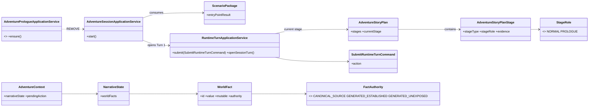

# Architecture Spec — Session Entry Opening

## Purpose

Fix first narration leaking future plot, hidden information, or unmade player choices. Identify source-backed entry during preparation; use normal Runtime planner/writer/validation for opening.

## Architecture flow

`Source Bundle → existing RAG → AI entry candidate → preparation evidence validation → Scenario Package → Story Plan (source stage | minimal PROLOGUE stage) → Session Start → Turn 1 → Planner → Writer → validation → opening persistence → first action on Turn 1`

AI proposes; preparation/runtime validates and commits. Entry extraction failure is not Scenario Package failure.

## Boundaries

- **Scenario Preparation / Package** owns source-derived entry result, evidence, start premise, and whether prologue is required. Reuse existing RAG; no entry-aware vector index.
- **Story Plan** consumes package result. Reliable source result becomes first normal stage. Otherwise prepend least possible `PROLOGUE` connector stages.
- **Runtime** receives materialized current stage only. It initializes canonical premise, creates Turn 1, invokes normal Planner → Writer → validation, persists opening, processes first action, and remains sole NarrativeState commit authority.
- **AI GM** proposes candidates, plans, narration, and conflict reinterpretations; never directly saves canonical state.

## Class diagram

`stageRole` affects Story Plan generation/validation only. It does not introduce runtime mode, stage type, entry origin, player-safe projection, or prologue-specific engine. Existing `RuntimeTurnOrigin` unchanged; no `ENTRY`.

## Stage validation

- `NORMAL`: existing source grounding/evidence rules.
- `PROLOGUE`: require source/world anchor; connector-scale plan; no contradiction with source; reject major quest, villain, cause, secret, faction relationship, or replacement campaign. No separate completion condition; use existing stage transition.
- Existing serialized stages default missing `stageRole` to `NORMAL`.

## Turn state diagram

```mermaid
stateDiagram-v2
[*] --> SessionStarting
SessionStarting --> Turn1Opening: create Turn 1
Turn1Opening --> AwaitingFirstPlayerAction: Planner → Writer → validation; persist opening
AwaitingFirstPlayerAction --> ResolvingCurrentTurn: first action joins Turn 1
ResolvingCurrentTurn --> AwaitingResolutionInput: dice/judgment input needed
AwaitingResolutionInput --> ResolvingCurrentTurn: input received
ResolvingCurrentTurn --> AwaitingNextPlayerAction: action resolved
AwaitingNextPlayerAction --> ResolvingCurrentTurn: independent action; create next Turn
AwaitingNextPlayerAction --> [*]: session ends
```

Diagram is logical flow only. Do not add persisted `TurnStatus.OPEN/CLOSED`. Existing context/interaction state determines whether resolution remains active.

## Turn contract

- Session start creates durable Turn 1 before opening.
- Opening is first conversation event on Turn 1.
- First nonblank player action joins Turn 1; later independent action creates Turn 2.
- `SubmitRuntimeTurnCommand.action` stays player-action text; opening is not a submit command.
- Opening failure reuses existing idempotency/retry rules without repeating session initialization.
- Remove `AdventurePrologueApplicationService`; delete direct prompt path that passes stage goal/conflict/clues.

## Narrative authority

Reuse `NarrativeState.worldFacts`; no generated-fact store or premise aggregate.

`CANONICAL_SOURCE > GENERATED_ESTABLISHED > GENERATED_UNEXPOSED`.

Runtime validates all proposed deltas before commit. Preserve established player experience where possible; alter only conflict-required generated facts; freely correct unexposed facts.

## Explicit non-goals

No `EntryProgress`, `ENTRY_ACTIVE`, `CANONICAL_PLAY`, `ENTRY` turn origin, entry command, prologue runtime mode/completion state/service/transition, `PROLOGUE` stage type, player-safe stage projection, generated-fact store, or premise runtime model.

## Verification

Preparation: explicit, inferred, ambiguous, sparse, future-event, and player-choice cases.

Story Plan: minimal prologue, differentiated validation, no campaign expansion, stageType unaffected, old JSON compatibility.

Runtime: Turn 1 creation/opening/action ownership, Turn 2 boundary, normal pipeline, prologue-service removal, retry/idempotency.

Narrative: authority precedence, established preservation, unexposed correction, no direct AI commit.
