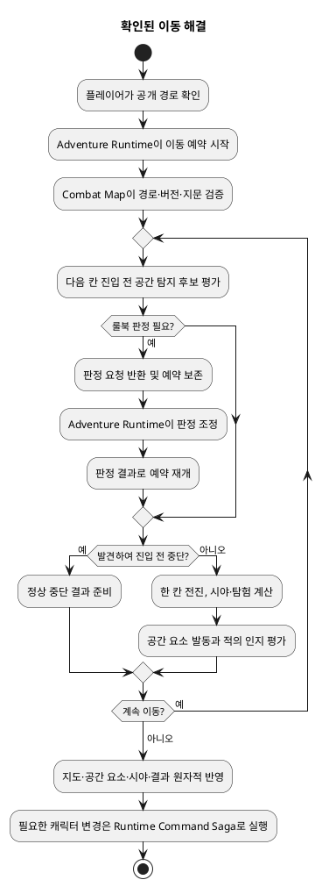
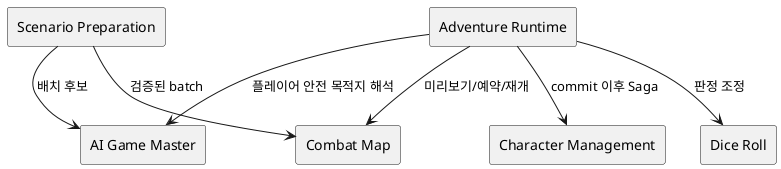
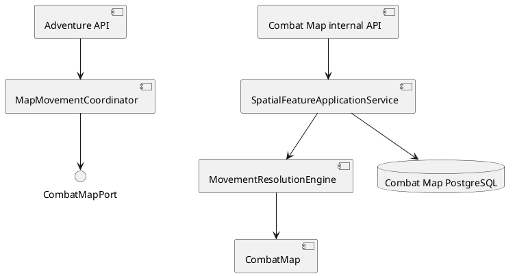

# 공간 이동 해결 Architecture Spec

- 범위 ID: `spatial-movement-resolution`
- 문서 상태: **READY — 확정 설계 직렬화 및 Architecture 다이어그램 완료**
- 기준 Product Spec: `docs/specs/spatial-movement-resolution/product-spec.md`
- 기준 결정: ADR-002, ADR-003, ADR-004, ADR-013, ADR-015, ADR-017, ADR-018

# 1. Design Scope

## 1.1 Target

| 항목 | 대상 |
| --- | --- |
| Product Spec | `docs/specs/spatial-movement-resolution/product-spec.md` |
| Use Cases | UC-01~UC-08 |
| Domain | 전술 지도 공간 요소, 이동 제안·예약·칸별 해결, 관찰, 공간 요소 준비, 토큰 시각 표현 |
| Bounded Contexts | Combat Map, Adventure Runtime, Scenario Preparation, AI Game Master, Dice Roll, Character Management |
| Existing Services | `combat-map-service`, `adventure-service`, `ai-game-master-service`, `dice-roll-service`, `character-management-service`, `web-ui` |
| External Dependencies | PostgreSQL, 동기 내부 HTTP, AI 모델 제공자 |
| Affected Data | 지도·토큰·공간 요소·시야·탐험·이동 예약·명령 이력, 대기 중인 지도 이동 확인, 공개 지도 projection |

새 Bounded Context, Gradle module, 배포 service, broker, 분산 트랜잭션은 만들지 않는다. 고정 칸을 쓰는 마법 범위 효과만 포함하며 이동·확장하는 범위 효과는 제외한다.

## 1.2 Product Spec Mapping

| Product Spec 항목 | Architecture 요소 |
| --- | --- |
| UC-01, BR-04~07, BR-18 | Combat Map의 공개 정보 기반 미리보기와 Adventure Runtime의 `PendingMapMovementConfirmation`; `MovementPlacementModelPort`는 자연어 목적지만 제안 |
| UC-02, BR-01, BR-03, BR-07~11 | `MovementResolutionEngine`, `MovementResolutionOperation`, `CombatMap`의 경로 검증·한 칸 전진 primitive |
| UC-03, BR-13~15 | `SpatialFeature` entity와 `SpatialTriggerResolver`; 종류별 상태는 Combat Map aggregate가 소유 |
| UC-04, BR-12 | Adventure Runtime의 별도 관찰 행동과 기존 플레이어 굴림 대기; 공간 탐지는 공통 resolver 재사용 |
| UC-05, BR-16 | `HostileObservationResolver`; 적→이동 중 플레이어 시선과 룰 판정 요청, 진행 결과는 Adventure Runtime 소유 |
| UC-06, BR-02, BR-19 | Scenario Preparation의 최대 3회 배치 조정, `SpatialFeaturePlacementModelPort`, Combat Map 원자적 materialization |
| UC-07, BR-17 | `SpatialFeatureApplicationService`의 근거·생성 시점·지도 버전 검증 |
| UC-08, BR-20 | `TokenVisualCatalog`, 저장소 번들 자산, 출처·라이선스 manifest, CSS 상태 overlay |
| EX-01~04, EX-08~12 | 공개 정보 필터, typed 결과, 조용한 실패, 좌표 검증, 내부 상세 비노출 |
| EX-05~07 | 예약 취소·복구, 정상 중단의 원자적 확정, 명령 ID 기반 재생 |

---

# 2. Domain Flow

## 2.1 Event Storming Flow



## 2.2 Commands

| Command | Actor | Target | Input | Preconditions | Result |
| --- | --- | --- | --- | --- | --- |
| 이동 미리보기 | Solo Player / Adventure Runtime | Combat Map | 지도·토큰·목적지/waypoint | 플레이어 소유권, 공개 지도 projection | 공개 경로·거리·기준 버전·지문 |
| 이동 예약 시작 | Adventure Runtime | Combat Map | `commandId`, 지문, 기준 버전, 확인 경로 | 현재 버전 일치, 지도별 활성 예약 없음 | 확정/정상 중단/판정 필요/재시도 필요/취소 |
| 판정 결과로 재개 | Adventure Runtime | 이동 예약 | 예약 ID, typed 판정 결과 | 요청된 판정과 결과의 소속 일치 | 다음 판정 또는 최종 결과 |
| 주변 자세히 살피기 | Solo Player | Adventure Runtime / Combat Map | 행동·지도·토큰 | 룰 비용 충족 | 공개 또는 조용한 실패 |
| 공간 요소 배치 | Scenario Preparation / GM runtime | Combat Map | 검증 근거, 공간 요소 batch | 좌표·룰·시간 정합성 | 원자적 저장 또는 검증 실패 |
| 전투 턴/시간 전달 | Adventure Runtime | Combat Map | 턴/시간 command | 명령·버전 검증 | 만료·턴 시작 발동 평가 |

## 2.3 Domain Events

| Domain Event | Producer | Trigger | Payload | Consumers |
| --- | --- | --- | --- | --- |
| 이동 해결 완료/중단 | Combat Map | 최종 로컬 commit | 요청·통과 경로, 마지막 위치, 공개 event, 결과 버전 | Adventure Runtime, web-ui |
| 공간 요소 공개/발동 | Combat Map | 탐지 성공 또는 trigger 충족 | 내부 event에는 feature ID, 플레이어 event에는 공개 사실만 | Adventure Runtime |
| 적의 신규/재인지 | Combat Map | 적→플레이어 시선과 필요한 룰 결과 충족 | 적 식별자와 중단 사실의 내부 계약 | Adventure Runtime |
| 후속 캐릭터 변경 필요 | Adventure Runtime | 확정된 공간 결과가 HP·상태·자원을 요구 | 멱등 Runtime Command | Character Management |

## 2.4 Policies

| Policy | Trigger Event | Decision | Emitted Command | Owner |
| --- | --- | --- | --- | --- |
| 룰 판정 조정 | Combat Map 판정 요청 | 적용 룰과 굴림 소유권 선택 | Dice Roll 실행 또는 플레이어 굴림 대기 | Adventure Runtime |
| 공간 결과 진행 | 이동 정상 중단 | 전투·경고·대화·추격 선택 | 해당 Adventure command | Adventure Runtime |
| 공간 요소 배치 보정 | 좌표/룰 검증 실패 | 이유를 반영해 최대 2회 보정 | AI 배치 재제안 | Scenario Preparation |
| 후속 상태 반영 | 지도 최종 commit | 필요한 HP·상태·자원 명령 실행 | Runtime Command Saga command | Adventure Runtime |

## 2.5 Read Models

| Read Model | Consumer | Source | Fields | Owner |
| --- | --- | --- | --- | --- |
| 플레이어 지도 projection | web-ui, 이동 목적지 해석 | Combat Map 정본 | 공개 지형·통행·토큰·탐험·버전 | Combat Map |
| 이동 미리보기 | web-ui, Adventure Runtime | 공개 지도 projection | 경로·거리·기준 버전·지문 | 비영속 Combat Map 계산 결과 |
| 이동 해결 결과 | Adventure Runtime, web-ui | 저장된 operation 결과 | 요청/통과 경로, 마지막 위치, 상태, 공개 event, 결과 버전 | Combat Map |
| 대기 중 이동 확인 | 재접속한 플레이어 | Adventure Runtime 저장 | 원문, 목적지, 토큰, 지도/버전, pending turn | Adventure Runtime |

## 2.6 External Interactions

| External System | Trigger | Input | Output | Failure |
| --- | --- | --- | --- | --- |
| AI Game Master | 자연어 목적지 또는 공간 요소 배치 | 플레이어 안전 projection 또는 준비 전용 근거 | 구조화된 후보 | 모호/미해결, provider/contract 실패 |
| Dice Roll | 룰 판정 필요 | 룰 판정 command | 불변 굴림 결과 | 플레이어 무기한 대기 또는 일시적 연동 실패 |
| Character Management | 지도 commit 후 상태 변경 | 멱등 character command | HP·상태·자원 결과 | Saga 재시도; 지도는 rollback하지 않음 |

## 2.7 Hotspots

| Hotspot | Options | Decision |
| --- | --- | --- |
| 외부 판정 중 지도 상태 | 선반영/복제/예약 후 최종 반영 | ADR-018에 따라 공개 상태를 바꾸지 않는 durable 예약 후 최종 반영 |
| 공간 기능 경계 | 새 context/module/service/기존 Combat Map 내부 | Combat Map 내부 entity와 application capability |
| 일반 trigger 재사용 | `TacticalTriggerApplicationService` 확장/전용 resolver | 칸 기반 공간 전용 resolver; 기존 서비스는 변경하지 않음(엄격한 호환 연결만 예외) |
| 배치 보정 | ADR-017 후보 repair/별도 제품 정책 | 최초+이유 기반 2회 보정의 별도 공간 배치 정책; Compilation Candidate의 완전성·회복 가능성 모델과 생명주기가 다름 |

---

# 3. DDD Architecture

## 3.1 Bounded Contexts

| Bounded Context | Responsibility | Ubiquitous Language | Owned Model | Owned Data |
| --- | --- | --- | --- | --- |
| Combat Map | 지도·토큰·공간 요소·시야·탐험과 공간적 이동 사실 | 공간 요소, 이동 제안, 이동 해결, 이동 예약 | `CombatMap`, `SpatialFeature` | 지도와 공간 정본, operation 기록 |
| Adventure Runtime | 룰/행동 비용, 판정 조정, 진행 결과, 후속 Saga | GM Turn, Pending Roll Gate, Runtime Command Saga | Runtime Turn, CombatEncounter | 진행·대기 확인·command lifecycle |
| Scenario Preparation | Story Plan 기반 배치와 활성화 판단 | Adventure Story Plan, 준비 시도 | 준비 작업 | 배치 시도·경고·활성화 상태 |
| AI Game Master | 저장 권한 없는 후보 생성 | 목적지/배치/서술 제안 | model contract | 직접 정본 없음 |
| Dice Roll | 굴림 결과 정본 | Roll Command/Result | Roll | 굴림 결과 |
| Character Management | 캐릭터 HP·상태·자원 | Character Command | Character | 캐릭터 상태 |

## 3.1.1 Boundary Decisions

| Capability | Owner Context | Candidate Boundary | Chosen Boundary | Why Not Weaker? | Why Not Stronger? |
| --- | --- | --- | --- | --- | --- |
| 공간 요소 | Combat Map | Entity / Aggregate / Context | `CombatMap` aggregate 내부 entity | 단순 값은 고유 identity·종류별 상태·점유 칸·trigger 수명을 보존하지 못함 | 독립 언어·수명·트랜잭션이 없고 지도와 원자적 일관성이 필요 |
| 이동 해결 | Combat Map | Domain service / Internal capability / Context | domain engine을 포함한 내부 capability | aggregate 메서드 하나만으로 외부 판정 대기·재시작을 보존할 수 없음 | 지도 상태 변경 보조 기능이며 독립 context가 아님 |
| 이동 예약 | Combat Map | Aggregate / application work record | application-layer durable saga/work record | 메모리 작업은 재시작·플레이어 대기를 보존하지 못함 | 독립 업무 aggregate/context가 아니라 지도 변경의 기술적 장기 작업 |
| 공통 이동 조정 | Adventure Runtime | application capability / module | `MapMovementCoordinator` 내부 capability | Runtime Turn과 Combat Action 두 경로의 불일치를 막는 공통 seam 필요 | 새 module/service의 독립 배포·수명 근거 없음 |

## 3.2 Context Map



| Upstream | Downstream | Relationship | Contract | Translation |
| --- | --- | --- | --- | --- |
| Combat Map | Adventure Runtime | Customer/Supplier, Published Language | 공간 판정 요청·이동 결과 | `CombatMapPort` adapter |
| Adventure Runtime | Dice Roll / Character Management | Customer/Supplier | 멱등 command/result | 기존 port/adapter |
| AI Game Master | Adventure Runtime / Scenario Preparation | 후보 provider | versioned typed proposal | 각 application validation |

## 3.3 Aggregates

| Aggregate | Root | Responsibility | Commands | Events | Invariants |
| --- | --- | --- | --- | --- | --- |
| Combat Map | `CombatMap` | 공간 정본과 원자적 최종 변경 | 경로 검증, 단계 결과 최종 반영, 공간 요소 배치/변경 | 이동 결과, 공개/발동, 적 인지 | 버전, 지도 내부 좌표, 공간 요소 identity·상태, 최종 commit 일관성 |

`MovementResolutionOperation`은 aggregate가 아니며 application 작업 기록이다.

## 3.4 Entities

| Entity | Aggregate | Identity | Responsibility | State |
| --- | --- | --- | --- | --- |
| `SpatialFeature`(공간 요소) | Combat Map | feature ID | 점유 칸, 공개 상태, 탐지 규격, trigger, 종류별 상태와 provenance | 종류, cells, `HIDDEN/DISCOVERED/REVEALED`, state, origin, source, 생성 turn/version |
| `CombatToken` | Combat Map | token ID | actor 위치와 공개 상태 | 기존 token 상태; 신규 `TRAP/OBJECT` 쓰기 금지 |

## 3.4.1 Class Diagram

- 상태: **READY — 로컬 렌더·Markdown 링크·내용 일치 검토 완료**
- 원본: `docs/specs/spatial-movement-resolution/diagrams/architecture/combat-map-spatial-resolution.class.puml`
- [SVG: Combat Map 공간 이동 해결 클래스 설계](diagrams/architecture/combat-map-spatial-resolution.class.svg)
- 범위: CombatMap aggregate, SpatialFeature entity/value types, 시선·visibility/resolver, MovementResolutionEngine, application 작업 기록·repository, Adventure/Dice/Character port와 의존 방향. 관련 UC-02~07, BR-01~19, ADR-018.

## 3.5 Value Objects

| Value Object | Aggregate | Values | Validation | Behavior |
| --- | --- | --- | --- | --- |
| 공간 요소 종류 | Combat Map | `TRAP`, `SECRET_DOOR`, `HAZARD_AREA`, `INTERACTIVE_OBJECT`, `MAGICAL_AREA_EFFECT` | 허용 값만 | 종류별 state 규칙 선택 |
| `DetectionSpec`(탐지 규격) | Combat Map | 룰/판정 참조, 난이도, mode | 시나리오 근거와 룰 참조 유효성 | 판정 요청 구성 |
| 공간 trigger | Combat Map | `ENTER_CELL`, `LEAVE_CELL`, `BECOME_VISIBLE`, `OBSERVE`, `INTERACT`, `COMBAT_TURN_START` | 허용 trigger만 | 평가 시점 표현 |
| provenance | Combat Map | `STORY_PLAN`, `GM_RUNTIME`, `SYSTEM`, sourceRef, 생성 turn/version | 근거·시간 정합성 | 소급 배치 방지 |
| 이동 해결 결과 | Combat Map | 요청/통과 경로, 마지막 위치, 상태, 공개 event, 결과 버전 | 비공개 상세 필터 | 멱등 replay |

## 3.6 Domain Services

| Domain Service | Responsibility | Input | Output | Collaborators |
| --- | --- | --- | --- | --- |
| `MovementResolutionEngine` | 저장된 cursor부터 칸별 규칙 실행 | map snapshot, operation, check result | 판정 요청/중단/commit 준비 | aggregate primitives, resolvers |
| `SpatialTriggerResolver` | 허용된 공간 trigger 평가 | step context, feature | feature transition과 내부/public event | `LineOfSightQuery` |
| `HostileObservationResolver` | 적→플레이어 시선과 신규/재인지 평가 | step context, hostile state | 룰 요청 또는 중단 사실 | `LineOfSightQuery` |
| `LineOfSightQuery` | 시선 geometry 단일 구현 | origin, target, blockers | clear/blocked | map geometry |
| `VisibilityPolicy` | 플레이어 projection 계산 | player origin, map | visible/explored cells | `LineOfSightQuery` |

## 3.7 Business Rule Ownership

| Business Rule | Owner | Enforcement Point |
| --- | --- | --- |
| BR-01, BR-07, BR-13, BR-15, BR-17 | Combat Map aggregate / spatial services | 배치·단계·최종 반영 |
| BR-03, BR-08~11, BR-16 | `MovementResolutionEngine` + operation coordinator | 단계 loop와 final commit |
| BR-04~06, BR-18 | preview service + Adventure pending confirmation | preview/confirm validation과 projection filter |
| BR-02, BR-19 | Scenario Preparation / AI ports | proposal validation과 activation gate |
| BR-12, BR-14 | Adventure Runtime | action/rule orchestration |
| BR-20 | web-ui asset/catalog build contract | catalog와 license manifest test |

## 3.8 Aggregate State Transitions

공간 요소의 종류별 업무 상태는 Product Spec의 `spatial-feature.business-state.svg`가 정본이며 여기서 중복하지 않는다. 아래 설계 상태는 aggregate 업무 상태가 아닌 durable application 작업 기록의 복구·commit 상태다.

| Current State | Command / Event | Next State | Owner | Preconditions | Emitted Event |
| --- | --- | --- | --- | --- | --- |
| `PREPARING` | 판정 필요 | `CHECK_PENDING` | operation coordinator | typed 판정 요청 저장 | 판정 요청 |
| `CHECK_PENDING` | 판정 결과 수신 | `PREPARING` | operation coordinator | 결과가 operation 요청에 속함 | 재개 |
| 활성 상태 | 일시적 연동 실패 | `RETRY_WAIT` | recovery worker | retryable 분류 | 재시도 예약 |
| `RETRY_WAIT` | 재시도 | 이전 활성 상태 | recovery worker | 기존 cursor/명령 identity | 재개 |
| `PREPARING` | 모든 단계 준비 | `READY_TO_COMMIT` | engine | 결과 완전성 | commit 준비 |
| `READY_TO_COMMIT` | 원자적 최종 반영 | `COMMITTED` | Combat Map transaction | expected version·예약 invariant | 완료 또는 정상 중단 결과 |
| commit 전 활성 상태 | 비재시도 실패/소진 | `CANCELLED` | coordinator | terminal 분류 | 취소 결과 |

## 3.8.1 State Diagram

- 상태: **READY — 로컬 렌더·Markdown 링크·내용 일치 검토 완료**
- 원본: `docs/specs/spatial-movement-resolution/diagrams/architecture/movement-resolution-operation.state.puml`
- [SVG: 이동 해결 예약 설계 상태](diagrams/architecture/movement-resolution-operation.state.svg)
- 범위: `PREPARING/CHECK_PENDING/RETRY_WAIT/READY_TO_COMMIT/COMMITTED/CANCELLED`, 무기한 플레이어 대기, retry, 원자적 commit, 정상 중단의 committed 결과. 관련 UC-02/04/05, BR-08/09, EX-05~07, ADR-018.
- Product의 공간 요소 업무 상태 다이어그램과 목적이 다르므로 중복하지 않는다.

## 3.9 Repository Boundaries

| Repository | Aggregate | Operations | Consistency Boundary |
| --- | --- | --- | --- |
| `CombatMapRepository` | Combat Map | load, expected-version final save | 지도 DB 로컬 transaction |
| `MovementResolutionOperationRepository` | application work record | reserve, loadByCommand/ID, save cursor/check/result/status, cancel | 지도별 단일 활성 예약 제약 |
| Adventure pending confirmation repository | Runtime Turn 연계 기록 | save/query/clear | Adventure DB transaction |

---

# 4. Program Design

## 4.1 Program Structure



## 4.2 Major Components and Responsibilities

| Component | Responsibility | Input | Output | Dependencies | Must Not Do |
| --- | --- | --- | --- | --- | --- |
| preview application service | 공개 정보로 결정적 최소 비용 경로 계산 | 목적지/waypoint, player projection | path/distance/version/fingerprint | view service | hidden 정보로 비용 변경, 저장 |
| `MovementResolutionEngine` | 한 칸씩 탐지→전진→시야→trigger→적 인지 실행 | operation snapshot/result | typed step outcome | domain resolvers | 직접 외부 호출·임의 저장 |
| operation coordinator | 예약 상태·재개·최종 transaction 조정 | start/resume/query/cancel | operation/result | repositories, engine | 공개 map 조기 변경 |
| `SpatialFeatureApplicationService` | batch 배치·runtime 추가·시간/턴 반영 | validated commands | versioned result | CombatMap repository | 룰 선택, 범용 전투 event 소유 |
| `MapMovementCoordinator` | 탐험/전투 이동 경로 통합 | Adventure movement | Combat Map operation result | CombatMapPort, rule/dice | 지도 정본 복제 |
| `TacticalTriggerApplicationService` | 기존 broad planned mutation | 기존 tactical trigger | 기존 결과 | 기존 구성 | ENTER_CELL·인지·적 시선 소유 |

## 4.3 Application Flow

1. Adventure가 직접 drag 목적지 또는 자연어 `RESOLVED` 목적지를 Combat Map preview에 전달한다.
2. Combat Map은 공개 통행 정보만으로 결정적 최저 이동 비용 경로를 계산한다. 동률은 안정적인 tie-break를 사용하며 공개된 통행 가능 위험 칸을 자동 회피하지 않는다.
3. 확인 시 Adventure가 기준 버전·지문·경로·명령 ID로 예약을 시작한다. 전투 경로는 먼저 턴과 자원을 검사한다.
4. engine은 현재 위치·path·budget을 검증하고 다음 칸 전 탐지 후보를 평가한다. 판정 필요 시 cursor와 요청을 저장해 반환한다.
5. 판정 결과로 재개한다. 성공 탐지는 공개하고 위험 칸 전 중단하며, 조용한 실패는 계속한다. 전진 후 시야·탐험, 공간 trigger, 적의 인지를 차례로 평가한다.
6. 목적지 도달 또는 게임 진행 중단이면 `READY_TO_COMMIT` 결과를 만든다. 하나의 Combat Map DB transaction에서 위치·공간 요소·시야·버전·결과·명령 이력을 반영한다.
7. 이후 HP·상태·자원은 ADR-003 Saga가 완료한다. 필수 downstream 완료 전 성공 narration을 확정하지 않는다.

## 4.4 Component Call Contracts

| Order | Caller | Callee | Operation | Input | Output | Failure |
| ---: | --- | --- | --- | --- | --- | --- |
| 1 | Adventure API | `MovementPlacementModelPort` | 자연어 목적지 해석 | 행동, 현재 위치, player-safe map, 전술 문맥 | `RESOLVED/AMBIGUOUS/UNRESOLVED` | 질문/drag 안내 |
| 2 | `MapMovementCoordinator` | `CombatMapPort` | preview | destination/waypoints | public preview | stale/auth/validation |
| 3 | coordinator | `CombatMapPort` | start | commandId/fingerprint/baseVersion/path | staged status | stale/conflict/check/retry/cancel |
| 4 | coordinator | rules/dice | resolve check | typed rule request | typed result | player wait/transient failure |
| 5 | coordinator | `CombatMapPort` | resume | operationId/result | next/final status | ownership/mismatch |
| 6 | Runtime Saga | Character Management | apply consequences | committed map result-derived command | state result | retryable downstream failure |

## 4.5 Major Types

| Type | Kind | Responsibility | State | Dependencies |
| --- | --- | --- | --- | --- |
| `SpatialFeature` | Entity | 공간 요소 정본 | 종류별 state | CombatMap |
| `MovementResolutionOperation` | Application work record | 장기 이동 진행·복구 | command/fingerprint/cursor/status/check/result/error | operation repository |
| `MovementResolutionEngine` | Domain service | 단계별 순수 해결 | 없음 | aggregate primitives/resolvers |
| `MovementProposal` | DTO/value | 비권위 미리보기 | path/version/fingerprint | 공개 projection |
| `MovementPlacementModelPort` | Port | 자연어 목적지 후보 | 없음 | AI adapter |
| `SpatialFeaturePlacementModelPort` | Port | 근거 기반 배치 후보 | 없음 | AI adapter |

## 4.6 Type Design

### `MovementResolutionOperation`

| 항목 | 정의 |
| --- | --- |
| Kind | Combat Map application-layer durable work record |
| Responsibility | 공개 상태 변경 없이 외부 판정 대기·재시작·멱등 replay 보존 |
| Dependencies | operation repository, serialized typed step/check/result |
| Must Not Depend On | web UI, AI model, Character Management 내부 모델 |

| Field | Meaning | Constraint |
| --- | --- | --- |
| commandId / fingerprint | 동일 의미 명령 식별 | 동일 command+다른 fingerprint 거부 |
| map/baseVersion/token/player | 소유권·동시성 기준 | start 시 검증, final expected version |
| requestedPath / cursor | 요청 경로와 처리 위치 | 인접·격자·budget 검증 |
| status / priorActiveState | 실행·재시도 상태 | 허용 전이만 |
| pendingCheck / results | 대기 판정과 typed 결과 | operation 소속 일치 |
| result / error metadata | replay와 운영 복구 | hidden payload는 player DTO/log에서 제외 |

## 4.7 Interfaces and Function Signatures

```java
interface CombatMapPort {
    MovementPreview preview(MovementPreviewRequest request);
    MovementOperationResponse start(MovementStartRequest request);
    MovementOperationResponse resume(MovementResumeRequest request);
    MovementOperationResponse query(MovementOperationQuery query);
    MovementOperationResponse cancel(MovementCancelRequest request);
}

interface MovementPlacementModelPort {
    MovementPlacementProposal interpret(MovementPlacementContext context);
}

interface SpatialFeaturePlacementModelPort {
    SpatialFeaturePlacementProposal propose(SpatialFeaturePlacementContext context);
}
```

`CombatMapPort`는 Adventure Runtime과 Combat Action 양쪽에서 `MapMovementCoordinator`를 통해 호출한다. 모든 mutation 호출은 명령 ID 멱등성과 소유권·버전 검증을 요구한다. AI port 출력은 후보일 뿐 상태 변경 부작용이 없다.

## 4.8 Error Propagation

| Failure Point | Source Error | Converted Error | Handler | Result |
| --- | --- | --- | --- | --- |
| preview/confirm | 기준 버전 불일치 | `STALE_MOVEMENT_PROPOSAL` | Adventure/UI | 재계산·재미리보기 |
| reservation | 활성 지도 mutation | `MAP_MUTATION_IN_PROGRESS` | caller | conflict 표시/후속 query |
| validation | 경로·턴·budget 위반 | `MOVEMENT_NOT_ALLOWED` | API mapper | 비재시도 거부 |
| engine | 판정 필요 | `MOVEMENT_CHECK_REQUIRED` | coordinator | typed check 수행/대기 |
| operation | terminal pre-commit failure | `MOVEMENT_OPERATION_CANCELLED` | coordinator | 공개 상태 불변 |
| integration/storage | transient failure | `INTERNAL_RESOLUTION_FAILURE` + retry metadata | recovery worker | `RETRY_WAIT` |

## 4.9 State Transition Implementation

| State Transition | Domain Owner | Method | Persistence Point | Published Event |
| --- | --- | --- | --- | --- |
| 준비→판정 대기 | operation coordinator | `requestCheck` | operation repository | typed check request |
| 판정 대기→준비 | operation coordinator | `resume` | operation repository | 없음/다음 요청 |
| 준비→commit 준비 | engine/coordinator | `prepareResult` | operation repository | 없음 |
| commit 준비→완료 | Combat Map application service | `commitResolution` | map+feature+visibility+history+operation transaction | public/internal resolution events |
| 활성→취소 | coordinator | `cancel` | operation repository | cancellation |

## 4.10 Dependency Rules

Allowed: API→application→domain, application→port, infrastructure adapter→port/domain mapping. `VisibilityPolicy`, `SpatialTriggerResolver`, `HostileObservationResolver`는 공통 `LineOfSightQuery`에 의존한다.

Forbidden: domain→HTTP/DB/AI, AI→정본 저장소, web-ui→내부 Combat Map API, Adventure→숨겨진 Combat Map 상태 복제, `TacticalTriggerApplicationService`→칸 기반 이동 해결 소유, application service→한 칸 중간 상태 임의 mutation.

---

# 5. Technical Architecture

## 5.1 Boundary Mapping

| Bounded Context | Internal Capability | Code Boundary | Deployment Unit | Boundary Rationale |
| --- | --- | --- | --- | --- |
| Combat Map | 공간 요소·이동 해결 | 기존 module의 `domain/spatial`, `application/spatial` package | 기존 `combat-map-service` | 정본·transaction 공유, package seam이면 충분 |
| Adventure Runtime | 이동 조정·확인 대기 | 기존 runtime/combat/application package | 기존 `adventure-service` | 두 진입 경로 통합, 별도 service 불필요 |
| Scenario Preparation | 공간 배치 orchestration | 기존 scenario preparation package | 기존 `adventure-service` | 준비 lifecycle에 속함 |
| AI Game Master | 목적지/배치 proposal | 기존 ports/config/controller | 기존 `ai-game-master-service` | 무상태 후보 contract |

## 5.2 Boundary Promotion Decisions

| Candidate | Owner Context | Chosen Boundary | Why Not Weaker? | Why Not Stronger? | Introduced Cost |
| --- | --- | --- | --- | --- | --- |
| spatial capability | Combat Map | package | 기존 root package에 평탄 배치하면 resolver·operation 책임 혼합 | 새 module/context/service 근거 없음 | package와 port 유지 비용 |
| movement operation | Combat Map | DB-backed application record | 메모리 객체는 장기 대기·복구 불가 | 독립 aggregate/service 수명 없음 | schema·recovery worker |
| common coordinator | Adventure Runtime | application capability | 두 이동 경로 중복 방지 필요 | 별도 module/service 불필요 | 내부 interface 유지 |

## 5.3 System Interaction Flow

Player → Adventure API → `MapMovementCoordinator` → 동기 내부 HTTP → Combat Map preview/start/resume/query/cancel → Combat Map PostgreSQL. 판정 요청은 Adventure가 기존 rules/dice 흐름으로 해결한다. 최종 commit 뒤 Character Management 명령은 기존 Runtime Command Saga가 재시도한다. broker는 없다.

## 5.4 Synchronous Communication

| Caller | Provider | Protocol | Operation | Request | Response | Timeout |
| --- | --- | --- | --- | --- | --- | --- |
| Adventure | Combat Map | 내부 HTTP | preview/start/resume/query/cancel | typed JSON + internal token | typed staged response | 기존 내부 HTTP 정책 |
| Adventure | AI Game Master | 내부 HTTP | movement/feature proposal | versioned safe context | typed proposal | 기존 AI adapter 정책 |
| Adventure | Dice/Character | 내부 HTTP | roll/command | command ID 기반 request | immutable/result state | 기존 Saga 정책 |

## 5.5 API Contracts

권장 구체 경로는 저장소 controller 관례에 맞춰 최종 이름을 조정할 수 있으나 의미와 payload는 고정한다.

| API | Contract |
| --- | --- |
| `POST /internal/combat-maps/{mapId}/movement-previews` | 공개 path, distance, `baseMapVersion`, fingerprint만 반환; 저장 없음 |
| `POST /internal/combat-maps/{mapId}/movement-operations` | confirmed path/version/command/fingerprint로 예약 시작 |
| `POST /internal/combat-maps/{mapId}/movement-operations/{operationId}/resume` | typed check result로 재개 |
| `GET /internal/combat-maps/{mapId}/movement-operations/{operationId}` | status/result 조회 |
| `DELETE /internal/combat-maps/{mapId}/movement-operations/{operationId}` | commit 전 취소 |
| `POST /api/adventures/{adventureId}/map-movement/preview` | drag 또는 자연어 목적지 미리보기 |
| `POST /api/adventures/{adventureId}/map-movement/confirm` | 확인 및 start/resume 진입 |
| `GET /api/adventures/{adventureId}/map-movement/pending` | 재접속용 대기 확인 조회 |

Start/resume 응답 상태는 `COMMITTED`, `INTERRUPTED`, `CHECK_REQUIRED`, `RETRY_REQUIRED`, `CANCELLED`와 `operationId`를 포함한다. rich 결과는 `requestedPath`, `traversedPath`, `finalPosition`, status, public events, `resultingVersion`을 포함한다. 플레이어 payload에는 공개 전 feature ID·상세를 넣지 않는다. 내부 event만 feature ID를 가질 수 있다.

`Idempotency-Key == commandId`를 강제하고 같은 command의 지문 불일치는 거부한다. 기존 `/moves` path request는 staged start로 연결하는 호환 adapter로 유지하고, 기존 내부 caller가 이관될 때까지 map ID/version 응답을 지원한다. Runtime Turn과 Combat Action이 모두 새 coordinator로 이관된 뒤 별도 변경으로 제거한다.

## 5.6 Asynchronous Communication

메시지 broker는 도입하지 않는다. durable polling/resume/recovery worker만 사용한다. 따라서 새 message contract는 해당 없음이다.

## 5.7 Message Contracts

해당 없음. 새 비동기 channel이나 message를 만들지 않으며, 저장된 operation 상태와 동기 내부 HTTP 계약이 복구 경계다.

## 5.8 Data Ownership

| Data | Owner | Storage | Readers | Writers |
| --- | --- | --- | --- | --- |
| 지도·token·공간 요소·시야·version·command history | Combat Map | PostgreSQL | Combat Map projection/API | Combat Map transaction만 |
| movement operation | Combat Map | PostgreSQL | Combat Map/Adventure query | operation coordinator |
| pending map movement confirmation | Adventure Runtime | PostgreSQL | Adventure API/runtime | Adventure Runtime |
| movement proposal | 없음(비권위) | Combat Map에 저장하지 않음; direct drag는 UI transient 가능 | UI/Adventure | 재계산 |

## 5.9 Schema Changes

Combat Map module-scoped Flyway migration에 `combat_map_spatial_feature`, `combat_map_spatial_feature_cell`, `combat_map_spatial_trigger`, `combat_map_movement_operation`과 필요한 step/check/result table을 추가한다. identity/status/version/order는 구조화 column으로, versioned rule-specific detection/effect payload만 JSONB로 둔다. 지도별 하나의 활성 예약을 보장하는 unique partial index와 commandId/map/status index를 둔다. command history snapshot 또는 저장 result를 확장해 공간 요소와 해결 결과 replay를 지원한다.

Adventure migration은 Runtime Turn/turn ID에 연결된 pending map movement confirmation만 추가한다. Combat Map proposal table은 추가하지 않는다.

Legacy migration은 현재 `TRAP` token을 표시 전용 `TRAP` feature로, `OBJECT`를 표시 전용 `INTERACTIVE_OBJECT`로 deterministic ID·위치·visibility를 재사용해 옮긴다. origin=`SYSTEM`, source=legacy이고 근거가 없는 자동 trigger/detection은 만들지 않으며 현재 token row는 migration에서 삭제한다. 역사 snapshot은 compatibility reader로 읽는다. 신규 `TRAP/OBJECT` token write는 거부하고 기존 enum 입력/읽기만 호환 기간에 허용하며 제거는 별도 변경이다.

## 5.10 Consistency Model

| Operation | Consistency | Source of Truth | Synchronization | Recovery |
| --- | --- | --- | --- | --- |
| preview | 계산 시점 snapshot | Combat Map public projection | base version/fingerprint | stale이면 재계산 |
| final movement | Strong local | Combat Map PostgreSQL | single transaction + optimistic version | pre-commit cancel; invariant conflict alert |
| post-commit character effects | Eventual Saga | 각 context | ADR-003 command journal | retry, map rollback 없음 |
| preparation placement | Strong local batch | Combat Map | validated atomic materialization | required block/optional omit |

## 5.11 Infrastructure Dependencies

PostgreSQL은 Combat Map local transaction과 operation recovery를 담당한다. 동기 내부 HTTP adapter는 context translation을 담당한다. 기존 internal token auth를 유지한다. 새 broker/cache/분산 lock은 없다.

## 5.12 External Dependency Isolation

| External Dependency | Port | Adapter | Internal Model | Conversion Point |
| --- | --- | --- | --- | --- |
| AI movement grounding | `MovementPlacementModelPort` | typed AI HTTP adapter | proposal status/destination/evidence | AI Game Master boundary |
| AI feature placement | `SpatialFeaturePlacementModelPort` | typed AI HTTP adapter | semantic plan/anchors/proposal | Scenario Preparation boundary |
| Dice/Character | 기존 Adventure ports | 기존 HTTP adapters | typed rule/result/command | `MapMovementCoordinator`/Saga |

## 5.13 File and Module Structure

기존 package root `domain/application/api/infrastructure`를 유지하며 module 전체를 다른 계층 명칭으로 바꾸지 않는다.

### File Change Map

| Path | Action | Responsibility |
| --- | --- | --- |
| `src/combat-map-service/.../domain/CombatMap.java`, `MovementPath.java` | Modify | 경로 검증·engine 전용 한 칸 전진 primitive, 최종 반영 |
| `src/combat-map-service/.../domain/VisibilityPolicy.java` | Modify | `LineOfSightQuery` 추출 후 player projection 유지 |
| `src/combat-map-service/.../domain/spatial/*` | Add | SpatialFeature, detection/trigger/provenance/state, LOS 계약 |
| `src/combat-map-service/.../application/spatial/*` | Add | application service, engine, resolvers, operation repository/coordinator |
| `src/combat-map-service/.../application/movement/CombatMapMovementService.java` | Modify | staged capability로 위임하는 compatibility path |
| `src/combat-map-service/.../application/view/CombatMapViewService.java` | Modify | 공개 projection과 hidden filter 유지 |
| `src/combat-map-service/.../application/view/TacticalTriggerApplicationService.java` | Keep | broad planned mutation 유지; 칸 이동 책임 추가 금지 |
| `src/combat-map-service/.../api/CombatMapController.java` 및 DTO | Modify/Add | preview/start/resume/query/cancel, 기존 `/moves` adapter |
| `src/combat-map-service/.../infrastructure/persistence/*Spatial*`, `*MovementOperation*` | Add | PostgreSQL mapping/repositories, atomic commit |
| `src/combat-map-service/src/main/resources/db/migration/V2_16__combat_map_spatial_movement.sql` | Add | feature/operation schema와 legacy token migration |
| `src/combat-map-service/src/test/java/com/dndmaster/combatmap/{CombatMapMovementTest,VisibilityPolicyTest,CombatMapVisibilityIntegrationTest,TacticalTriggerApplicationServiceTest}.java` | Modify | 단계 loop/LOS/visibility/호환 회귀 |
| `src/combat-map-service/src/test/.../spatial/*` | Add | feature states, operations, restart/idempotency/conflict/API/migration |
| `src/adventure-service/.../application/combat/CombatMapPort.java` | Modify | preview/start/resume/query/cancel |
| `src/adventure-service/.../application/{runtime,combat}/MapMovementCoordinator.java` | Add | Runtime Turn/Combat Action 공통 이동 capability |
| `src/adventure-service/.../application/combat/CombatActionApplicationService.java` | Modify | 턴/자원 검사 뒤 coordinator 사용 |
| `src/adventure-service/.../application/runtime/CombatMapRuntimeTurnCommandAdapter.java`, `RuntimeTurnCommitOrchestrator.java` | Modify | staged operation과 Saga 연결 |
| `src/adventure-service/.../domain/runtime/PendingMapMovementConfirmation.java` 및 persistence | Add | reconnect 가능한 자연어 확인 대기 |
| `src/adventure-service/.../api/AdventureController.java`, `CombatController.java` 및 DTO | Modify | player preview/confirm/resume/pending API |
| `src/adventure-service/src/main/resources/db/migration/V71__pending_map_movement_confirmation.sql` | Add | pending confirmation schema |
| `src/adventure-service/src/test/.../{CombatMapRuntimeTurnCommandAdapterTest,RuntimeTurnCommitOrchestratorTest}.java` | Modify | 두 경로 수렴, pre/post commit recovery |
| `src/ai-game-master-service/.../application/ports/{MovementPlacementModelPort,SpatialFeaturePlacementModelPort}.java` | Add | 자연어 목적지·공간 배치 proposal contracts |
| `src/ai-game-master-service/.../api/*Movement*Controller.java`, config/adapters/tests | Add | typed model endpoints와 contract 검증 |
| `src/ai-game-master-service/src/test/.../MapModelContractTest.java` | Modify | 새 proposal contract 회귀 |
| `contracts/**/openapi*.yaml`, `contracts/**/*.schema.json` | Modify/Add | internal/player API와 AI schemas |
| `web-ui/src/**/*Map*`, `web-ui/src/**/*Token*`, types/CSS | Modify/Add | ghost path, staged state, token frame/state overlay |
| `web-ui/public/assets/tokens/*`, `web-ui/public/assets/tokens/LICENSES.*` | Add | 번들 CC0/default assets와 정확한 출처·라이선스 |
| `web-ui/src/**/CombatMapFlow.test.tsx` | Modify | drag/자연어 preview-confirm, animation, visuals |

---

# 6. Runtime Design

## 6.1 Runtime Flow

중복 command이면 저장 operation/result를 반환한다. 신규 command는 지도별 활성 예약 unique 제약 아래 operation을 생성하고 snapshot/cursor로 engine을 실행한다. 판정 대기는 transaction을 열어 두지 않고 저장한다. 모든 단계가 준비된 경우에만 새 transaction에서 expected map version을 확인하고 지도·feature·visibility·history·operation result를 함께 commit한다. 이후 downstream Saga를 실행한다.

## 6.2 Concurrent Access / 6.3 Concurrency Control

| Target | Conflict | Strategy | Owner |
| --- | --- | --- | --- |
| 지도 mutation | 장기 예약 중 다른 write | map당 활성 reservation unique partial index; `MAP_MUTATION_IN_PROGRESS` | Combat Map |
| final commit | 예약 이후 version 변경 | optimistic expected map version | Combat Map transaction |
| 같은 command | 중복 또는 다른 payload | commandId lookup + fingerprint equality | operation repository |
| pending confirmation | reconnect/중복 확인 | turn/owner/version 검증 | Adventure Runtime |

플레이어 굴림 대기에는 자동 expiry가 없으며 시간 기반 자동 확인/취소도 없다.

## 6.4 Ordering

단계 순서는 경로 index로 고정한다: 경로/현재 위치/budget 검증 → 진입 전 탐지 → 필요한 판정 → 전진 → visibility/explored → feature trigger → 적 인지 → 중단/반복. operation step/check/result에는 order를 구조화해 저장한다.

## 6.5 Transaction Boundaries

| Transaction | Owner | Operations | Commit Condition | Rollback Condition |
| --- | --- | --- | --- | --- |
| operation step save | Combat Map application | cursor/check/result/status 저장 | step 결과 durable | DB 실패 |
| final map commit | Combat Map | token, feature, visibility/explored, version, command history, result | 모든 판정 준비·expected version 일치 | 어떤 local write 실패도 전체 rollback |
| downstream command | Adventure Runtime Saga | HP/status/resource 변경과 runtime commit | 모든 필수 command 완료 | map rollback 없음; Saga retry |

## 6.6 Idempotency

start/resume/final commit은 commandId 및 operation identity로 중복을 감지한다. 같은 command와 같은 fingerprint는 저장된 상태/결과를 반환하고, 다른 fingerprint는 거부한다. restart는 저장 cursor와 pending check/result로 이어간다.

## 6.7 Partial Failure

| Failure Situation | Persisted State | External State | Recovery |
| --- | --- | --- | --- |
| pre-final validation/integration 실패 | operation 취소 또는 retry 상태 | public map 불변 | retry 또는 `CANCELLED` |
| player roll 대기 | `CHECK_PENDING` | public map 불변 | 제출 때 resume |
| gameplay interruption | `COMMITTED` rich result | traversed path/exploration 보존 | Adventure가 다음 진행 결정 |
| post-commit Character failure | map `COMMITTED`, Saga pending | 지도 결과 유지 | ADR-003 retry, 성공 narration 대기 |
| impossible final version conflict | cancellation/repair metadata | transaction rollback | 운영 alert와 repair |

---

# 7. Error Handling and Recovery

## 7.1 Failure and Recovery

validation/stale/conflict는 caller가 재시도하지 않는 typed failure다. provider/HTTP/DB의 일시적 실패만 기존 worker 정책으로 `RETRY_WAIT`에 두고 이전 활성 상태로 복귀한다. retry 소진 또는 commit 전 terminal 실패는 `CANCELLED`다. 게임 진행 중단은 오류가 아니라 `COMMITTED` 정상 결과다.

## 7.2 Error Classification

| Error | Category | Retryable | Caller Result |
| --- | --- | --- | --- |
| `STALE_MOVEMENT_PROPOSAL` | Conflict | No | re-preview |
| `MAP_MUTATION_IN_PROGRESS` | Conflict | No | active operation 확인 |
| `MOVEMENT_NOT_ALLOWED` | Validation/Domain | No | 거부 |
| `MOVEMENT_CHECK_REQUIRED` | Control result | 판정 완료 후 resume | `CHECK_REQUIRED` |
| `MOVEMENT_OPERATION_CANCELLED` | Terminal operation | No | `CANCELLED` |
| `INTERNAL_RESOLUTION_FAILURE` | Infrastructure | transient만 Yes | `RETRY_REQUIRED` 또는 취소 |

## 7.3 Retry Policy

최대 시도 횟수와 backoff 값은 새로 정하지 않고 기존 recovery worker 정책을 따른다. 플레이어 굴림은 retry가 아니라 무기한 대기다. 결정적 validation, stale, conflict는 delivery retry 대상이 아니다.

## 7.4 Compensation / 7.5 Recovery / 7.6 Rollback

최종 commit 전에는 공개 상태를 변경하지 않으므로 operation 취소가 보상이다. 최종 commit 후 지도 보상은 하지 않고 downstream Saga를 재시도한다. crash 후 commandId로 operation을 찾고 저장 cursor에서 재개한다. schema rollback은 additive compatibility reader와 단계적 writer 전환을 전제로 하며, legacy `TRAP/OBJECT` 제거는 별도 변경으로 남긴다.

---

# 8. Security

## 8.1 Authentication and Authorization

player/UI는 Adventure API만 사용하고 Combat Map internal API를 직접 호출하지 않는다. 기존 internal token 인증, player owner, map/session 연결, expected version, 전투 턴·자원 authorization을 유지한다.

## 8.2 Input Validation

path 길이, grid 범위, 인접성, budget, waypoint, payload 크기, token/player 소유권, base version/fingerprint, check result의 operation 소속을 검증한다. 배치에는 좌표·룰 참조·근거·생성 시점/버전 검증을 추가한다.

## 8.3 Sensitive Data

hidden feature/enemy, DC, 내부 성공·실패, detection/effect payload는 player DTO, AI movement grounding input, narration input, 일반 log에서 제외한다. planning/placement는 준비 전용 hidden input을 사용할 수 있다. narration은 최종 공개 event만 받는다. 전송 보호와 secret 관리는 기존 내부 서비스 정책을 유지하며 새 secret은 없다.

---

# 9. Observability

## 9.1 Logs

operation/map/command ID, 상태 전이, failure code, retry correlation만 기록한다. DC·숨겨진 feature 상세·비공개 판정값은 기록하지 않는다. final version invariant 위반은 ERROR와 repair alert 대상이다.

## 9.2 Metrics

- preview stale 횟수
- operation 상태별 latency와 `CHECK_PENDING` gauge
- cancellation 수, 정상 중단 reason category
- placement 시도·최종 실패 수
- post-commit downstream Saga retry 수

## 9.3 Tracing

`movement.preview` → `movement.reserve` → `movement.check`(반복 가능) → `movement.final_commit` → `runtime.downstream_saga` span을 연결한다. attribute는 ID·상태·공개 가능한 failure category로 제한한다.

## 9.4 Alerts

final commit version invariant 위반, retry 소진 증가, 장기 `RETRY_WAIT`, 필수 공간 요소 배치 실패, downstream Saga backlog를 경보 대상으로 한다. 플레이어 굴림의 장기 대기는 자동 장애 경보나 만료 조건으로 취급하지 않는다.

---

# 10. Change and Verification Boundaries

## 10.1 Allowed / Forbidden / Conditional Changes

| 구분 | 범위 |
| --- | --- |
| Allowed | 기존 module 내부 package·schema·port/API 확장, additive player API, compatibility adapter, bundled token assets |
| Forbidden | 새 context/module/service/broker/분산 transaction, hidden 기반 preview, AI 직접 저장, 범용 trigger engine 확장, 중간 공개 map mutation, arbitrary runtime asset URL |
| Conditional | 기존 Tactical Trigger 연결은 호환에 꼭 필요한 최소 연결만, legacy token enum은 호환 기간 read/input만, controller 이름은 기존 관례에 맞춰 조정 가능 |

## 10.2 Verification Contract

- domain: step loop와 중간 전장의 안개 계산, 공개 전 hidden 제외, 탐지 실패의 침묵, 함정/비밀문/마법 효과 상태, 적→플레이어 LOS와 신규/재인지
- operation: 모든 상태 전이, restart, idempotency/fingerprint, 지도별 conflict, final 이전 rollback, gameplay interruption commit, post-commit Saga retry
- persistence: feature/operation schema, unique partial index, legacy `TRAP/OBJECT` migration, 역사 snapshot compatibility
- API/contracts: OpenAPI/schema, typed error/status, player payload 비누출, 기존 `/moves` 호환
- Adventure: Runtime Turn과 Combat Action의 coordinator 수렴, pending confirmation reconnect, player roll 무기한 대기
- AI/preparation: 목적지 `RESOLVED/AMBIGUOUS/UNRESOLVED`, player-safe input, 배치 3회 한도, 필수/선택 실패 정책
- UI: ghost token/path, waypoint 조정, stale re-preview, traversed animation/fog 순서, token visual과 license manifest
- security/E2E: 소유권·internal auth·hidden 비누출, 직접 drag와 자연어 이동의 end-to-end 흐름

기존 회귀 기준에는 `CombatMapMovementTest`, `VisibilityPolicyTest`, `CombatMapVisibilityIntegrationTest`, `TacticalTriggerApplicationServiceTest`, `CombatMapRuntimeTurnCommandAdapterTest`, `RuntimeTurnCommitOrchestratorTest`, `CombatMapFlow.test.tsx`, `MapModelContractTest`를 포함한다.

---

# 11. Alternatives, Trade-offs, Risks, and Open Questions

## 11.1 Rejected Alternatives

| Alternative | Rejection |
| --- | --- |
| 이동 칸마다 공개 map save | 외부 판정 실패 시 부분 반영되어 BR-08 위반 |
| Adventure가 hidden map 상태 복제 | Combat Map 정본과 비공개 경계 위반 |
| 별도 Spatial Context/service | 독립 언어·data lifecycle·배포 요구가 없고 local atomicity 비용 증가 |
| 기존 broad tactical trigger 확장 | 공간 단계/LOS/인지 책임을 범용 계획 mutation과 혼합 |
| hidden 위험 자동 회피 preview | hidden 정보가 경로 비용으로 누출 |
| 분산 transaction/broker | 기존 동기 HTTP+Saga로 충분하며 운영 복잡도만 증가 |

## 11.2 Risks and Mitigations

| Risk | Mitigation |
| --- | --- |
| 장기 player roll이 지도 mutation을 막음 | 명시적 상태 조회·취소, UI 대기 표현; 자동 만료는 금지 |
| operation payload가 hidden 정보를 노출 | internal/player DTO 분리, log 필터, contract security test |
| 두 Adventure 이동 경로가 갈라짐 | 공통 `MapMovementCoordinator` 강제 |
| legacy token migration 의미 과장 | 표시 전용 feature, trigger/detection 미생성, compatibility reader |
| 다이어그램과 문서 불일치 | 두 SVG 렌더·링크·내용 검증 전 전체 완료 게이트 보류 |

## 11.3 Open Questions and Blockers

설계 결정의 열린 질문과 차단은 없다. Architecture 다이어그램 두 건의 `.puml`/SVG는 로컬 렌더, Markdown 링크, 내용 일치 검토를 완료했다.
