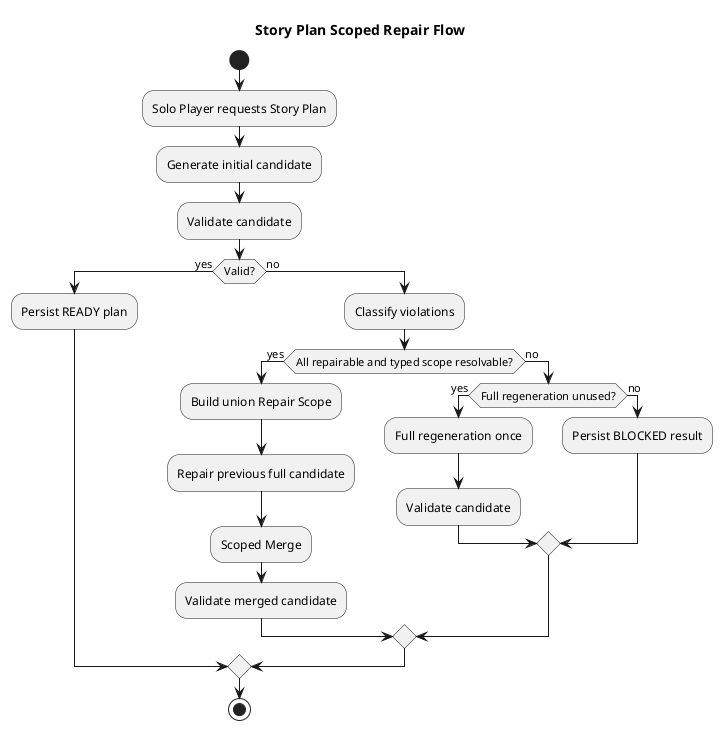
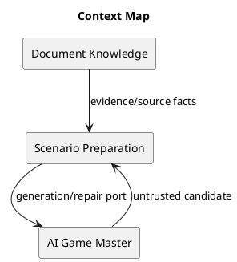
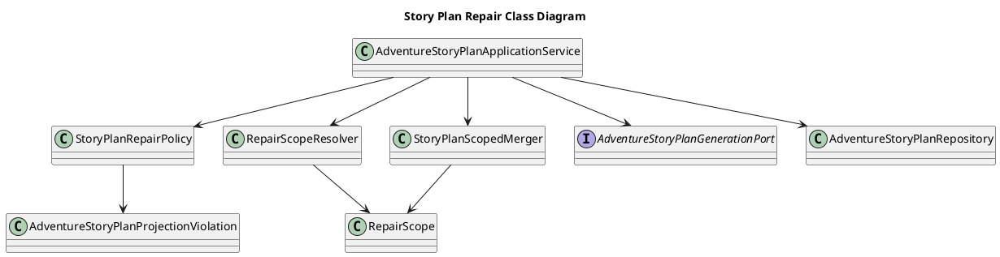
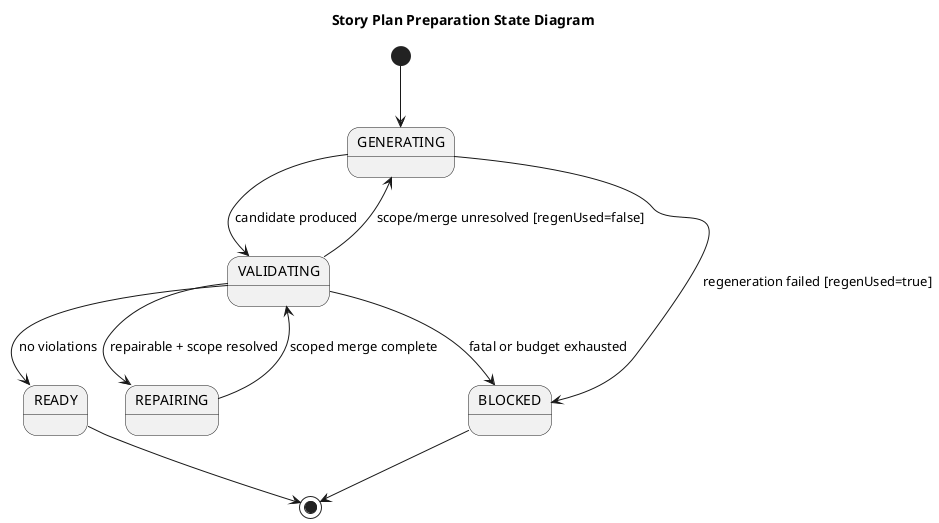
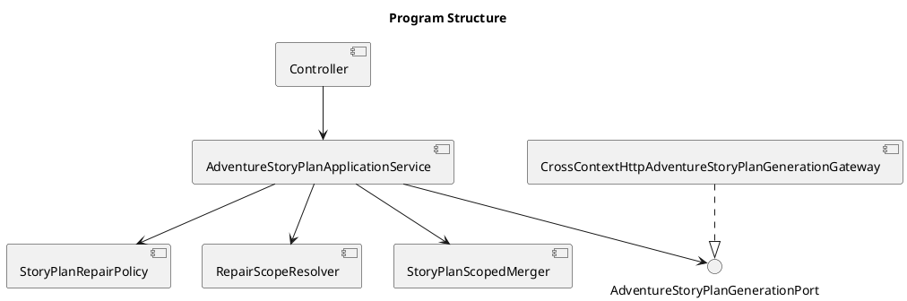
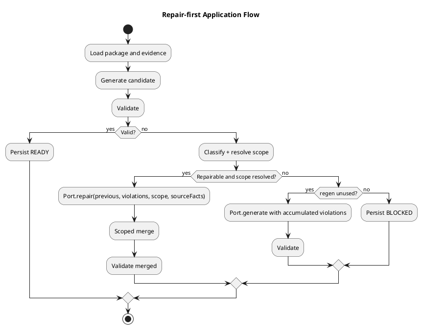
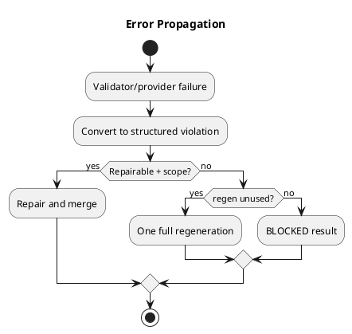
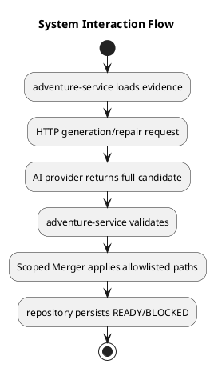
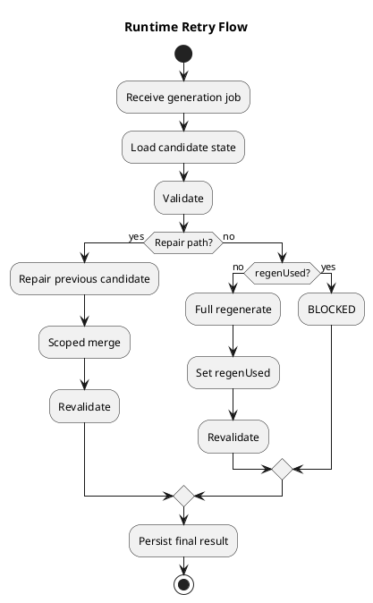
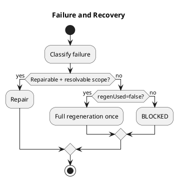

# Architecture Spec: Story Plan 최소 범위 Repair

## 1. Design Scope

### 1.1 Target

| 항목 | 대상 |
| --- | --- |
| Product Spec | `docs/specs/story-plan-scoped-repair/product-spec.md` |
| Use Cases | 최초 생성·검증, 최소 범위 repair, scoped merge, 1회 full regeneration fallback |
| Domain | Scenario Preparation / Adventure Story Plan |
| Bounded Contexts | Scenario Preparation, AI Game Master, Document Knowledge |
| Existing Services | `adventure-service`, `ai-game-master-service`, `rule-knowledge-service` |
| External Dependencies | AI Story Planner provider, Scenario Package/source evidence |
| Affected Data | Story Plan candidate, validation violations, repair scope, retry diagnostics |

### 1.2 Product Spec Mapping

| Product Spec 항목 | Architecture 요소 |
| --- | --- |
| UC-1 생성·검증 | `AdventureStoryPlanApplicationService` orchestration |
| UC-2 최소 repair | `StoryPlanRepairPolicy`, `RepairScopeResolver`, generation port `repair` |
| UC-3 제한 병합 | `StoryPlanScopedMerger` |
| UC-4 1회 재생성 | retry state in application service; `FULL_REGENERATION` branch |
| UC-5 진단 | structured attempt logging and final response |
| BR-1/4/5 | typed scope and merger |
| BR-7/8 | regeneration counter and terminal `BLOCKED` |
| BR-10/12 | accumulated violations and attempt-type logs |

## 2. Domain Flow

### 2.1 Event Storming Flow



### 2.2 Commands

| Command | Actor | Target | Input | Preconditions | Result |
| --- | --- | --- | --- | --- | --- |
| `GenerateStoryPlan` | Scenario Preparation | Story Plan preparation flow | session/package/context | adventure not started; package ready | candidate or validation result |
| `RepairStoryPlan` | Repair Policy | current candidate | previous candidate, violations, scope, source facts | all violations repairable; scope resolved | repaired candidate |
| `MergeStoryPlanScope` | Scoped Merger | candidate pair | previous and repaired candidate, typed scope | both parseable; scope valid | merged candidate |
| `PublishStoryPlan` | Application service | Story Plan repository | valid merged/full candidate | validation complete | READY plan |

### 2.3 Domain Events

| Domain Event | Producer | Trigger | Payload | Consumers |
| --- | --- | --- | --- | --- |
| `StoryPlanCandidateRejected` | Validator | violations found | candidate id, violations | retry policy, structured logger |
| `StoryPlanRepairCompleted` | Scoped Merger | merge succeeds | scope, merge outcome | validator, logger |
| `StoryPlanReady` | Application service | final validation passes | plan/version | repository/runtime |
| `StoryPlanBlocked` | Application service | retry budget exhausted | final violations, attempt summary | repository/API/logger |

### 2.4 Policies

| Policy | Trigger Event | Decision | Emitted Command | Owner |
| --- | --- | --- | --- | --- |
| `StoryPlanRepairPolicy` | `StoryPlanCandidateRejected` | repairable vs regeneration | `RepairStoryPlan` or full generation | Scenario Preparation |
| `RegenerationFallbackPolicy` | unresolved scope/merge failure | allow exactly one full regeneration | `GenerateStoryPlan` | Scenario Preparation |
| `ScopedMergePolicy` | `StoryPlanRepairCompleted` | apply only allowed paths | `MergeStoryPlanScope` | Scenario Preparation |

### 2.5 Read Models

| Read Model | Consumer | Source | Fields | Owner |
| --- | --- | --- | --- | --- |
| `StoryPlanPreparationResult` | Solo Player/API | final application result | status, plan, final violations | Scenario Preparation |
| `RetryAttemptLog` | operators/tests | structured application events | attempt type, violations, scope, outcome | logging infrastructure |

### 2.6 External Interactions

| External System | Trigger | Input | Output | Failure |
| --- | --- | --- | --- | --- |
| AI Story Planner | generate/repair command | prompt, candidate, scope, source facts | full candidate serialization | timeout, malformed candidate, provider error |
| Document Knowledge / Scenario Package | context load | package and citation IDs | canonical evidence | missing/insufficient evidence => terminal source failure |

### 2.7 Hotspots

| Hotspot | Options | Decision |
| --- | --- | --- |
| Scope representation | free text / typed paths | typed paths such as `stage[4].rules`, `claim[c].citation` |
| Out-of-scope provider edits | reject whole response / merge allowed paths | merge allowed paths, preserve previous values elsewhere |
| Diagnostics storage | durable attempt tables / structured logs | structured logs + final response in this ChangeSet |
| Citation repair | invent new IDs / choose canonical IDs | only canonical source-fact/citation IDs are allowed |

## 3. DDD Architecture

### 3.1 Bounded Contexts

| Bounded Context | Responsibility | Owned Model | Owned Data |
| --- | --- | --- | --- |
| Scenario Preparation | candidate generation, validation, repair, publish | Story Plan Candidate, Violation, Repair Scope | current plan/history |
| AI Game Master | untrusted generation/repair proposal | provider DTO | none |
| Document Knowledge | authoritative source evidence | canonical source facts/evidence | document/index data |

### 3.2 Context Map



| Upstream | Downstream | Relationship | Contract | Translation |
| --- | --- | --- | --- | --- |
| Document Knowledge | Scenario Preparation | Customer/Supplier | canonical evidence/citation IDs | source adapter |
| Scenario Preparation | AI Game Master | Published Language | generation and repair request | HTTP gateway DTO |

### 3.3 Aggregates

| Aggregate | Root | Responsibility | Commands | Invariants |
| --- | --- | --- | --- | --- |
| Story Plan Preparation | `AdventureStoryPlan` | candidate lifecycle and publish decision | generate, repair, merge, publish, block | valid-only publish; one regeneration fallback |

### 3.4 Entities

| Entity | Aggregate | Identity | Responsibility | State |
| --- | --- | --- | --- | --- |
| Story Plan Candidate | Story Plan Preparation | candidate/version id | full serialized plan under validation | serialized plan, validation status |
| Validation Violation | preparation result | code + field path | explain failed contract | code, message, path, repairability |

### 3.4.1 Class Diagram



### 3.5 Value Objects

| Value Object | Values | Validation | Behavior |
| --- | --- | --- | --- |
| `RepairScope` | typed allowed paths | canonical path syntax; no empty/unknown path | union, contains, intersect |
| `AttemptType` | `INITIAL_GENERATION`, `REPAIR`, `FULL_REGENERATION` | closed enum | logging classification |
| `ViolationCode` | validator codes | known code registry | maps to repairability/scope |

### 3.6 Domain Services

| Domain Service | Responsibility | Input | Output | Collaborators |
| --- | --- | --- | --- | --- |
| `StoryPlanRepairPolicy` | classify violations and choose retry mode | violations, candidate state | repair/full regeneration/blocked | validator codes |
| `RepairScopeResolver` | resolve typed scope and dependency union | violations, candidate | `RepairScope` or unresolved | projection dependency policy |
| `StoryPlanScopedMerger` | preserve out-of-scope values | previous, repaired, scope | merged full candidate | parser/schema validator |

### 3.7 Business Rule Ownership

| Business Rule | Owner | Enforcement Point |
| --- | --- | --- |
| Repair before regeneration | `StoryPlanRepairPolicy` | retry decision |
| Scope union and typed paths | `RepairScopeResolver` | scope resolution |
| Scope-outside preservation | `StoryPlanScopedMerger` | merge operation |
| One regeneration fallback | application service/policy | retry counter |
| Valid-only publish | application service/repository | final validation gate |

### 3.8 Aggregate State Transitions

| Current State | Command/Event | Next State | Owner | Preconditions |
| --- | --- | --- | --- | --- |
| `GENERATING` | candidate produced | `VALIDATING` | application service | parseable response |
| `VALIDATING` | no violations | `READY` | application service | all validators pass |
| `VALIDATING` | repairable + scope | `REPAIRING` | repair policy | candidate preserved |
| `REPAIRING` | merged candidate | `VALIDATING` | scoped merger | scope-valid merge |
| `VALIDATING` | unresolved scope, fallback unused | `GENERATING` | regeneration policy | one fallback remains |
| any retry state | exhausted/fatal failure | `BLOCKED` | application service | no safe retry |

### 3.8.1 State Diagram



### 3.9 Repository Boundaries

| Repository | Aggregate | Operations | Consistency Boundary |
| --- | --- | --- | --- |
| `AdventureStoryPlanRepository` | Story Plan Preparation | save ready/blocked plan, history | session + plan version transaction |

## 4. Program Design

### 4.1 Program Structure



### 4.2 Major Components and Responsibilities

| Component | Responsibility | Input | Output | Must Not Do |
| --- | --- | --- | --- | --- |
| `AdventureStoryPlanApplicationService` | orchestration and budgets | request/context | ready or blocked result | merge fields directly |
| `StoryPlanRepairPolicy` | classification and mode | violations | retry decision | call provider |
| `RepairScopeResolver` | typed scope + dependency union | violations/candidate | scope | mutate candidate |
| `StoryPlanScopedMerger` | allowlisted merge | two candidates + scope | merged candidate | accept out-of-scope edits |
| `AdventureStoryPlanGenerationPort` | provider contract | generation/repair request | untrusted full candidate | persist or validate as authority |
| `AdventureStoryPlanRepository` | durable plan state | final result | persisted plan | store invalid plan as ready |

### 4.3 Application Flow



### 4.4 Component Call Contracts

| Order | Caller | Callee | Operation | Input | Output | Failure |
| ---: | --- | --- | --- | --- | --- | --- |
| 1 | application | validator | `validate` | candidate/context | violations | parse/schema failure |
| 2 | application | policy | `decide` | violations/state | mode | terminal classification |
| 3 | application | resolver | `resolve` | violations/candidate | typed scope | unresolved scope |
| 4 | application | generation port | `repair` | previous, violations, scope, evidence | full candidate | provider/parse error |
| 5 | application | merger | `merge` | previous, repaired, scope | merged candidate | invalid path/shape |
| 6 | application | repository | `save` | final result | persisted status | transaction failure |

### 4.5 Major Types

| Type | Kind | Responsibility | State | Dependencies |
| --- | --- | --- | --- | --- |
| `RepairScope` | Value Object | allowlisted typed paths | immutable set | none |
| `RepairRequest` | DTO | provider repair input | previous candidate + scope | source/evidence DTOs |
| `RetryDecision` | Domain type | next mode and reason | mode, scope, accumulated violations | policy |
| `RetryAttemptLog` | log DTO | observability | type, violations, scope, outcome | logger |

### 4.7 Interfaces and Function Signatures

```java
interface StoryPlanRepairPolicy {
    RetryDecision decide(List<AdventureStoryPlanProjectionViolation> violations,
                         boolean regenerationUsed,
                         boolean candidateAvailable);
}

interface RepairScopeResolver {
    Optional<RepairScope> resolve(
        StoryPlanCandidate candidate,
        List<AdventureStoryPlanProjectionViolation> violations);
}

interface StoryPlanScopedMerger {
    StoryPlanCandidate merge(StoryPlanCandidate previous,
                             StoryPlanCandidate repaired,
                             RepairScope scope);
}
```

| 항목 | 정의 |
| --- | --- |
| Preconditions | candidates parseable; scope typed and non-empty |
| Postconditions | only scope paths differ; merged candidate reparsed |
| Errors | unresolved scope, out-of-shape path, parse failure |
| Idempotency | same inputs produce same merge |

### 4.8 Error Propagation



| Failure Point | Converted Error | Handler | Result |
| --- | --- | --- | --- |
| validator | structured violation | policy | repair or regeneration |
| scope resolver | unresolved scope | regeneration policy | one full regeneration |
| merger | merge failure | regeneration policy | one full regeneration |
| provider | provider/parse violation | policy | repair retry or fallback |
| final validation | budget exhausted | application service | BLOCKED, no publish |

### 4.10 Dependency Rules

| Source | Target | Contract |
| --- | --- | --- |
| application service | policy/resolver/merger | domain interfaces |
| application service | generation port | provider port |
| HTTP gateway | generation port | adapter implementation |

| Source | Forbidden Target |
| --- | --- |
| validator/policy | HTTP client or repository |
| merger | provider, repository, logger side effects |
| provider adapter | Story Plan repository |

## 5. Technical Architecture

### 5.1 Service and Module Mapping

| Bounded Context | Component | Service | Module |
| --- | --- | --- | --- |
| Scenario Preparation | application/policy/merger | `adventure-service` | `application.storyplan` |
| AI Game Master | HTTP gateway | `ai-game-master-service` | provider API |
| Document Knowledge | evidence adapter | `rule-knowledge-service` | evidence API |

### 5.2 Service and Module Boundaries

| Service / Module | Public Contract | Internal Components |
| --- | --- | --- |
| `adventure-service` | Story Plan generation API | application service, validators, repair policy, scope resolver, merger, repository |
| `ai-game-master-service` | generation/repair provider API | untrusted planner endpoint |

### 5.3 System Interaction Flow



### 5.4 Synchronous Communication

| Caller | Provider | Protocol | Operation | Request | Response | Timeout |
| --- | --- | --- | --- | --- | --- | --- |
| adventure-service | AI planner | HTTP | generate/repair | candidate/context/scope | candidate | existing provider timeout |

### 5.8 Data Ownership

| Data | Owner | Storage | Readers | Writers |
| --- | --- | --- | --- | --- |
| current Story Plan | Scenario Preparation | PostgreSQL | runtime/API | repository |
| retry diagnostics | Scenario Preparation/logging | structured application logs + final response | operators/tests/API | application service |
| canonical source facts | Document Knowledge | existing evidence store | preparation/provider adapter | knowledge pipeline |

### 5.9 Schema Changes

| Target | Action | Schema Change | Migration |
| --- | --- | --- | --- |
| Story Plan tables | None | no durable attempt entity in this ChangeSet | none |

### 5.10 Consistency Model

| Operation | Consistency | Source of Truth | Recovery |
| --- | --- | --- | --- |
| scoped merge | strong/in-process | previous candidate + allowlisted repair | reject merge, fallback |
| final publish | transactional | repository validation gate | rollback/no publish |

### 5.11 Infrastructure Dependencies

| Dependency | Responsibility | Accessed By | Isolation |
| --- | --- | --- | --- |
| PostgreSQL | plan/history persistence | repository | repository port |
| AI HTTP provider | candidate proposal | generation gateway | generation port |
| structured logger | attempt diagnostics | application service | logging facade |

### 5.13 File and Module Structure

#### Existing Structure

```text
src/adventure-service/src/main/java/com/dndmaster/adventure/application/storyplan/
  AdventureStoryPlanApplicationService.java
  AdventureStoryPlanGenerationPort.java
  AdventureStoryPlanProjectionDependencyPolicy.java
  AdventureStoryPlanProjectionRepairPolicy.java
  AdventureStoryPlanProjectionViolation.java
  AdventureStoryPlanCombatValidator.java
```

#### Target Structure

```text
.../application/storyplan/
  StoryPlanRepairPolicy.java
  RepairScope.java
  RepairScopeResolver.java
  StoryPlanScopedMerger.java
  RetryAttemptLog.java
```

#### File Change Map

| Path | Action | Responsibility |
| --- | --- | --- |
| `AdventureStoryPlanApplicationService.java` | Modify | repair-first flow, one fallback, accumulated diagnostics |
| `AdventureStoryPlanGenerationPort.java` | Modify | repair request fields and canonical source-fact contract |
| `AdventureStoryPlanProjectionRepairPolicy.java` | Modify/rename as needed | violation classification |
| `RepairScope.java` / resolver | Add or extend | typed path scope and union |
| `StoryPlanScopedMerger.java` | Add | allowlisted merge |
| storyplan tests | Modify/Add | policy, scope, merge, retry regression |

## 6. Runtime Design

### 6.1 Runtime Flow



### 6.2 Concurrent Access

| Shared Resource | Concurrent Actors | Conflict |
| --- | --- | --- |
| Story Plan session | duplicate generation jobs/retry requests | lost update |

### 6.3 Concurrency Control

| Target | Control Unit | Strategy | Owner |
| --- | --- | --- | --- |
| generation job | session | existing active-job deduplication + repository lock | job service/repository |

### 6.4 Ordering

| Operation | Ordering Scope | Ordering Key | Enforcement |
| --- | --- | --- | --- |
| repair attempts | session | `sessionId` | application loop |

### 6.5 Transaction Boundaries

| Transaction | Owner | Operations | Commit Condition | Rollback Condition |
| --- | --- | --- | --- | --- |
| final plan save | repository | current/history write | READY or BLOCKED result recorded | persistence error |

### 6.6 Idempotency

| Operation | Idempotency Key | Detection Point | Duplicate Result |
| --- | --- | --- | --- |
| generation job start | session/job key | job service | existing active job |
| scoped merge | candidate id + scope + repair result | in-process | same merged candidate |

### 6.7 Partial Failure

| Failure Situation | Persisted State | Recovery |
| --- | --- | --- |
| provider repair fails | prior plan/candidate retained | one allowed fallback if needed |
| merge fails | prior candidate retained | one full regeneration |
| final validation fails | BLOCKED only | no publish; return diagnostics |

## 7. Error Handling and Recovery

### 7.1 Failure and Recovery Flow



### 7.2 Error Classification

| Error | Classification | Recovery |
| --- | --- | --- |
| missing rule check/outcome | REPAIRABLE | stage rule/outcome scope |
| unknown citation | REPAIRABLE when canonical replacement scope exists | claim citation/source scope |
| unsupported participant source | REPAIRABLE when canonical participant exists | participant source scope |
| malformed/root structure | REGENERATION_REQUIRED | one full regeneration |
| insufficient source evidence | terminal source failure | BLOCKED, no invented evidence |
| provider unavailable | retryable provider failure | bounded retry/fallback |

### 7.3 Retry Policy

- Repair attempts use existing bounded per-candidate repair budget.
- Full regeneration has a separate boolean/counter and is allowed exactly once when scope/merge is unsafe.
- Violations are accumulated and deduplicated by code + path + message.
- A failed full regeneration cannot trigger another full regeneration.

## 8. Security and Observability

- Provider output remains untrusted and is validated before merge/persist.
- Canonical source fact IDs are allowlisted; no arbitrary citation creation.
- Logs include attempt type, violation codes, field paths, scope, outcome, and correlation/session id; exclude secrets and raw sensitive source contents.
- Metrics should distinguish repair success, fallback regeneration, blocked outcomes, and provider failures.

## 9. Change and Verification Boundaries

### Allowed

- repairability classification for the listed violations
- typed scope resolution and dependency union
- previous candidate propagation
- scoped merge and retry orchestration
- structured diagnostics and tests

### Forbidden

- publishing an unvalidated or partially merged candidate
- changing scope-outside fields
- inventing citations/source facts
- adding durable attempt-history schema in this ChangeSet
- changing GM runtime turn behavior or Bundle Lock

### Verification Evidence

- unit tests for policy and typed scope
- merger test proving out-of-scope changes are discarded
- application test proving repair path and one fallback regeneration
- citation/participant grounding regression tests
- existing Scenario Compilation regression suite
- live browser E2E: Story Plan published and 5-turn entry succeeds

## 10. Alternatives, Trade-offs, Risks, and Open Questions

| Alternative/Risk | Decision |
| --- | --- |
| reject any provider out-of-scope mutation | choose scoped merge to preserve valid result while enforcing allowlist |
| persist every attempt in DB | defer; structured logs/final response satisfy this ChangeSet |
| allow unlimited regeneration | reject; causes lottery loop and contract regressions |
| fully redesign citation subsystem | defer; enforce canonical IDs at repair boundary first |
| array/wildcard merge ambiguity | resolver must canonicalize paths and fail closed to one fallback when ambiguous |

No blocking architecture question remains after the confirmed decisions.
