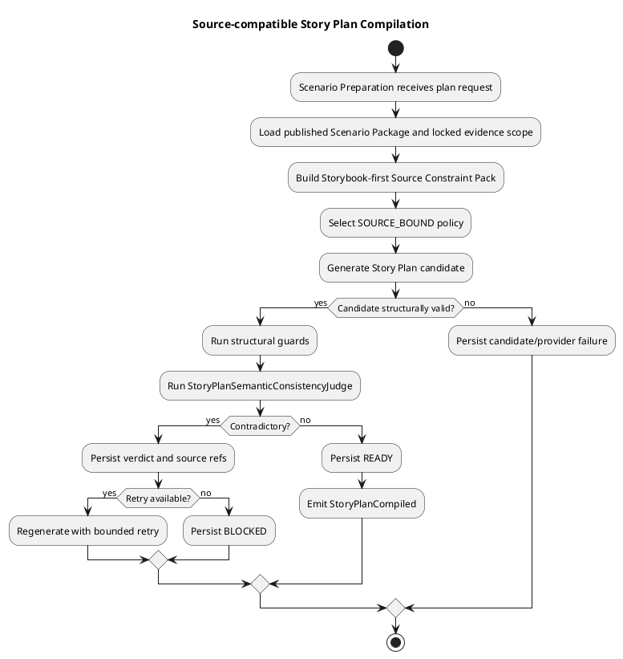
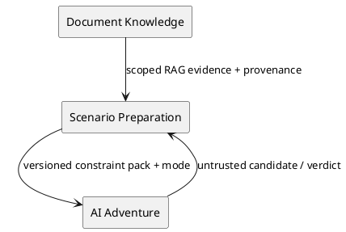
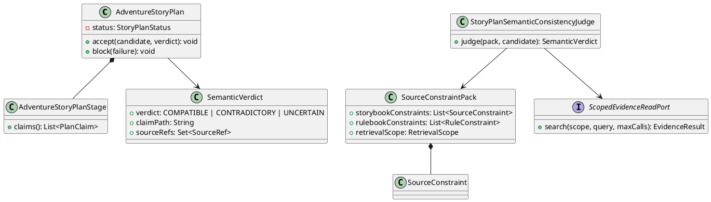
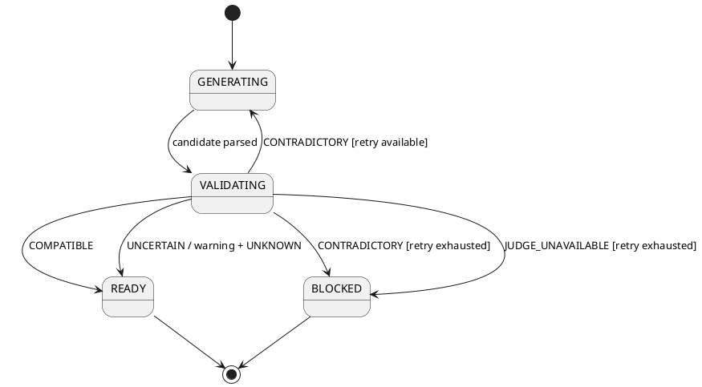
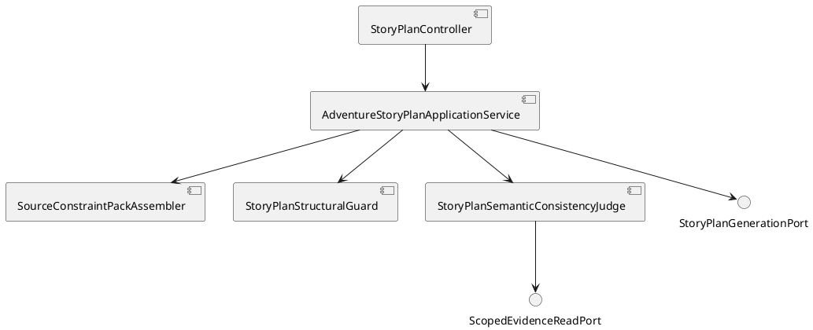

# Architecture Spec: Story Plan Source Grounding

## 1. Design Scope

### 1.1 Target

| 항목 | 대상 |
|---|---|
| Product Spec | `docs/specs/story-plan-source-grounding/product-spec.md` |
| Use Cases | source-compatible plan, elaboration, contradiction blocking, semantic diagnostics |
| Domain | Scenario Preparation / Adventure Story Plan compilation |
| Bounded Contexts | Scenario Preparation, AI Adventure, Document Knowledge |
| Existing Services | `adventure-service`, current `ai-game-master-service` (target name: `ai-adventure-service`) |
| External Dependencies | Storybook/Rulebook RAG gateway, AI provider |
| Affected Data | plan candidate, source constraints, provenance, semantic verdict, failure history |

### 1.2 Product Spec Mapping

| Product Spec | Architecture |
|---|---|
| UC-1/2 | Story Plan candidate generation with explicit constraints and elaboration context |
| UC-3 | structural guards + `StoryPlanSemanticConsistencyJudge` |
| UC-4 | `UNKNOWN/UNSPECIFIED` and warning verdict |
| UC-5 | structured semantic verdict persisted in existing plan history/failure JSON |
| BR-1/2 | application-selected generation policy |
| BR-3~9 | Storybook constraint pack, judge, and final validation |
| BR-11/12 | `CONTRADICTORY` blocks; `UNCERTAIN` warns/unknowns |
| BR-13 | GM Turn code remains outside this change |

## 2. Domain Flow

### 2.1 Event Storming Flow



### 2.2 Commands

| Command | Actor | Target | Input | Preconditions | Result |
|---|---|---|---|---|---|
| `GenerateAdventureStoryPlan` | Scenario Preparation | application service | session, package, party, difficulty | package published | compilation job |
| `GenerateStoryPlanCandidate` | application service | AI Adventure provider | mode, constraint pack, plan config | internal contract valid | untrusted candidate |
| `JudgeStoryPlanConsistency` | application service | semantic judge | Storybook pack, plan, Rulebook constraints | candidate parseable | verdict |
| `RetryStoryPlanGeneration` | compilation job | application service | prior candidate, verdict | retry budget available | next attempt |

### 2.3 Domain Events

| Event | Producer | Trigger | Payload | Consumers |
|---|---|---|---|---|
| `StoryPlanCandidateGenerated` | AI Adventure boundary | candidate returned | candidate, attempt, mode | validator |
| `StoryPlanConsistencyJudged` | Scenario Preparation | judge returns verdict | verdict, refs, claim paths | plan lifecycle |
| `StoryPlanCompiled` | Scenario Preparation | no blocking contradiction | plan id, package revision | Adventure Runtime |
| `StoryPlanCompilationBlocked` | Scenario Preparation | retry exhausted/fatal failure | diagnostics | preparation status |

### 2.4 Policies

| Policy | Decision | Owner |
|---|---|---|
| `SelectGenerationPolicy` | Scenario-backed → `SOURCE_BOUND`; Rulebook-only → `GENERATIVE` | Scenario Preparation |
| `PreferStorybookConstraints` | Storybook fact/flow wins over Rulebook conflict | Scenario Preparation |
| `ClassifyPlanConsistency` | structural guards first, semantic judge second | Scenario Preparation |
| `HandleJudgeVerdict` | compatible pass; contradiction retry/block; uncertain warning/unknown | Scenario Preparation |

### 2.5 Read Models

| Read Model | Consumer | Fields | Owner |
|---|---|---|---|
| `StoryPlanSourceConstraintPack` | planner/judge | Storybook constraints, allowed context, Rulebook constraints, refs, retrieval scope | Scenario Preparation |
| `StoryPlanSemanticVerdict` | plan lifecycle/diagnostics | verdict, confidence, claim path, summary, refs, retrieval refs | Scenario Preparation |

### 2.6 External Interactions

| System | Input | Output | Failure |
|---|---|---|---|
| Document Knowledge RAG | locked document scope, query, intent | evidence excerpts + provenance | no evidence → `UNCERTAIN`; no raw-document fallback |
| AI Adventure planner | constraint pack + config | candidate | timeout/malformed → retry, then `BLOCKED` |
| AI Adventure semantic judge | pack + candidate + RAG port | `COMPATIBLE/CONTRADICTORY/UNCERTAIN` | provider failure → `JUDGE_UNAVAILABLE`, `BLOCKED` |

### 2.7 Hotspots

| Hotspot | Decision |
|---|---|
| Source support vs invention | Do not reject invention merely for lacking citation; reject explicit contradiction. |
| Semantic validation | Hybrid: deterministic shape/identity guards plus AI semantic judge. |
| Judge input | Evidence Pack first; judge may perform at most 3 scoped RAG reads. |
| Service name | Current `ai-game-master-service` target name `ai-adventure-service`; keep Story Plan code there for now. |
| Runtime scope | GM Turn/Narrative Verifier unchanged. |

## 3. DDD Architecture

### 3.1 Bounded Contexts

| Context | Responsibility | Owned Model/Data |
|---|---|---|
| Scenario Preparation | plan lifecycle, source constraints, final verdict | `AdventureStoryPlan`, constraint/verdict history |
| AI Adventure | planner and semantic-judge provider adapters | candidate/verdict DTOs; no source authority |
| Document Knowledge | immutable documents, RAG, provenance | documents, spans, indexes |

### 3.2 Context Map



| Upstream | Downstream | Relationship | Contract |
|---|---|---|---|
| Document Knowledge | Scenario Preparation | Published Language | scoped evidence + provenance |
| Scenario Preparation | AI Adventure | Customer/Supplier | planner/judge request DTO |
| AI Adventure | Scenario Preparation | provider boundary | untrusted result only |

### 3.3 Aggregates

| Aggregate | Root | Responsibility | Invariants |
|---|---|---|---|
| `AdventureStoryPlan` | plan | candidate lifecycle and publication | READY only after structural + semantic validation |
| `ScenarioPackage` | package revision | immutable source/evidence snapshot | package revision and source scope fixed |

### 3.4 Entities

| Entity | Identity | Responsibility | State |
|---|---|---|---|
| `AdventureStoryPlanStage` | stage position/id | ordered plan claim | generated/validated |
| `SourceConstraint` | constraint id | explicit Storybook fact/flow constraint | active/unknown |
| `SemanticVerdict` | verdict id | judge result and evidence | compatible/contradictory/uncertain |

### 3.4.1 Class Diagram



### 3.5 Value Objects

| Value Object | Values/Responsibility |
|---|---|
| `StoryPlanGenerationMode` | `SOURCE_BOUND`, `GENERATIVE` |
| `ClaimOrigin` | `SOURCE`, `GENERATED`, `UNKNOWN` |
| `SemanticVerdictType` | `COMPATIBLE`, `CONTRADICTORY`, `UNCERTAIN` |
| `SourcePriority` | Storybook > Rulebook for narrative conflicts |
| `RetrievalScope` | locked package/session document IDs and max 3 judge reads |

### 3.6 Domain Services

| Service | Responsibility |
|---|---|
| `SourceConstraintPackAssembler` | Storybook-first constraints, Rulebook context, provenance, scoped retrieval |
| `StoryPlanSemanticConsistencyJudge` | semantic compatibility judgment; may call scoped evidence port |
| `StoryPlanStructuralGuard` | schema, IDs, citation keys, explicit typed invariants |
| `StoryPlanVerdictPolicy` | map verdict to accept/retry/block/warning |

### 3.7 Business Rule Ownership

| Rule | Owner | Enforcement |
|---|---|---|
| SOURCE_BOUND selection | application service | request construction |
| Storybook priority | constraint pack/policy | source precedence resolution |
| Explicit source fact preservation | semantic judge + structural guard | candidate validation |
| Compatible elaboration allowed | semantic judge | `COMPATIBLE` verdict |
| Explicit contradiction blocks | verdict policy | reject/retry/block |
| Uncertainty is not contradiction | verdict policy | warning/UNKNOWN |
| READY requires validation | `AdventureStoryPlan` | `accept` |

### 3.8 Aggregate State Transitions

| Current | Trigger | Next | Condition |
|---|---|---|---|
| `GENERATING` | candidate parsed | `VALIDATING` | structural parse succeeds |
| `VALIDATING` | compatible | `READY` | no blocking guard/judge result |
| `VALIDATING` | contradictory | `GENERATING` | retry available |
| `VALIDATING` | contradictory | `BLOCKED` | retry exhausted |
| `VALIDATING` | uncertain | `READY` | warning/UNKNOWN persisted |
| `GENERATING` | provider/judge unavailable | `BLOCKED` | retry exhausted |

### 3.8.1 State Diagram



### 3.9 Repository Boundaries

| Repository | Operations | Boundary |
|---|---|---|
| `ScenarioPackageRepository` | load published package | immutable package revision |
| `AdventureStoryPlanRepository` | save/load READY/BLOCKED/history | plan + package/party revisions |
| `AdventureStoryPlanGenerationJobRepository` | start/retry/status | compilation job |

## 4. Program Design

### 4.1 Program Structure



### 4.2 Major Components and Responsibilities

| Component | Responsibility | Must Not Do |
|---|---|---|
| `AdventureStoryPlanApplicationService` | orchestration, policy, transaction, persistence | trust provider output |
| `SourceConstraintPackAssembler` | Storybook-first evidence/constraints | read raw documents directly |
| `StoryPlanGenerationPort` | planner provider boundary | validate/persist |
| `StoryPlanStructuralGuard` | typed deterministic checks | judge open-ended meaning |
| `StoryPlanSemanticConsistencyJudge` | semantic compatibility | decide runtime turns |
| `ScopedEvidenceReadPort` | bounded RAG access | access unlocked/raw documents |
| `AdventureStoryPlanRepository` | plan/history persistence | save unvalidated READY plan |

### 4.3 Component Call Contracts

| Order | Caller | Callee | Operation | Failure |
|---:|---|---|---|---|
| 1 | application | package repository | `findPublished` | package unavailable |
| 2 | application | pack assembler | `assemble` | incomplete scope |
| 3 | application | generation port | `generate` | timeout/malformed |
| 4 | application | structural guard | `validate` | blocking typed violation |
| 5 | application | semantic judge | `judge` | `JUDGE_UNAVAILABLE` |
| 6 | application | plan repository | `save` | persistence failure |

### 4.4 Major Types and Interfaces

```java
interface StoryPlanSemanticConsistencyJudge {
    SemanticVerdict judge(SourceConstraintPack source,
                          StoryPlanCandidate candidate);
}

interface ScopedEvidenceReadPort {
    EvidenceResult search(RetrievalScope scope, String query, int maxCalls);
}

record SemanticVerdict(
    VerdictType type,
    double confidence,
    String claimPath,
    String summary,
    Set<SourceRef> sourceRefs,
    Set<String> retrievalRefs) {}
```

`ClaimOrigin`은 `SOURCE`, `GENERATED`, `UNKNOWN`만 사용한다. `COMPATIBLE`는 origin이 아니라 judge 결과다.

### 4.5 Error Propagation and Recovery

| Failure | Classification | Handler | Result |
|---|---|---|---|
| structural invalid | `CANDIDATE_INVALID` | bounded retry | exhausted → `BLOCKED` |
| semantic contradiction | `SOURCE_CONTRADICTION` | bounded retry | exhausted → `BLOCKED` |
| semantic uncertainty | `SEMANTIC_UNCERTAIN` | persist warning/unknown | `READY` |
| judge timeout/error/malformed | `JUDGE_UNAVAILABLE` | transient retry | exhausted → `BLOCKED` |
| RAG no result | `EVIDENCE_UNAVAILABLE` | judge uncertain | warning/unknown |

No raw document fallback. No chain-of-thought persistence. Store verdict, confidence, concise summary, claim/source/retrieval refs only.

### 4.6 Dependency Rules

- `ui → app → domain`; `infra → ports`.
- Domain must not depend on Spring, HTTP, provider DTO, or raw document storage.
- Scenario Preparation owns final READY/BLOCKED decision.
- AI Adventure owns provider adapters only; it has no source authority or persistence authority.
- GM Turn/Narrative Verifier remains separate from Story Plan compilation.

## 5. Technical Architecture

### 5.1 Service and Module Mapping

| Logical Context | Current/Target Service | Relevant Areas |
|---|---|---|
| Scenario Preparation | `adventure-service` | storyplan application/domain/infra |
| AI Adventure | rename `ai-game-master-service` → `ai-adventure-service` | planner, Scenario prompt, provider adapters, GM Turn |
| Document Knowledge | `rule-knowledge-service` | scoped evidence/RAG gateway |

The rename is a boundary/identity change; Story Plan code remains in the service initially. Physical extraction is not required for this slice.

### 5.2 Contract and Persistence Changes

- Extend Story Plan candidate/result schema with `ClaimOrigin`, semantic verdict, confidence, claim path, and provenance references.
- Preserve existing citation fields for `SOURCE` claims.
- Do not create a separate claim database in this slice; persist structured artifacts in existing plan/history JSON.
- RAG request must carry locked package/session document scope and intent; raw document retrieval is forbidden.
- `StoryPlanGenerationMode` is explicit in the planner request.

### 5.3 Runtime, Idempotency, and Transactions

- Public generation remains asynchronous job-based.
- Planner → structural guard → semantic judge runs sequentially inside one job attempt.
- Existing retry budget applies; semantic retry receives prior verdict summary, not hidden reasoning.
- Persist one attempt/result atomically with plan history.
- Duplicate generation follows existing job/idempotency policy.

### 5.4 Security and Observability

- Internal planner/judge/RAG calls use existing internal authentication/token contract.
- RAG scope is server-derived from locked package/session data; provider cannot widen it.
- Logs include plan/session/package revision, attempt, verdict type, claim path, and refs; never raw document or chain-of-thought.
- Metrics: judge latency, RAG calls, verdict counts, retry counts, `JUDGE_UNAVAILABLE`, final `BLOCKED`.

### 5.5 Verification Contract

- Unit: structural guards, verdict policy, origin handling, RAG max 3 calls.
- Contract/integration: planner and judge schemas, scoped RAG provenance, persistence/history.
- Acceptance: clear development DB, then actual browser flow with live provider, three independent plan-generation runs.
- Each run must demonstrate plan generation completes normally, reaches `READY`, preserves Storybook flow, and has no explicit contradiction.
- Browser start/revision-lock errors are recorded separately and do not define this feature’s success.

## 6. Alternatives, Risks, and Open Questions

| Topic | Decision/Risk |
|---|---|
| deterministic-only semantics | rejected; insufficient for open-ended meaning |
| citation-required-everywhere | rejected; blocks valid elaboration |
| raw-document judge input | rejected; violates RAG/provenance boundary |
| separate semantic-judge service | deferred; provider port remains isolated |
| service physical split | deferred; logical rename/boundary first |
| judge false positive/negative | mitigated by explicit constraints, confidence, bounded retry, and 3-run browser acceptance |

