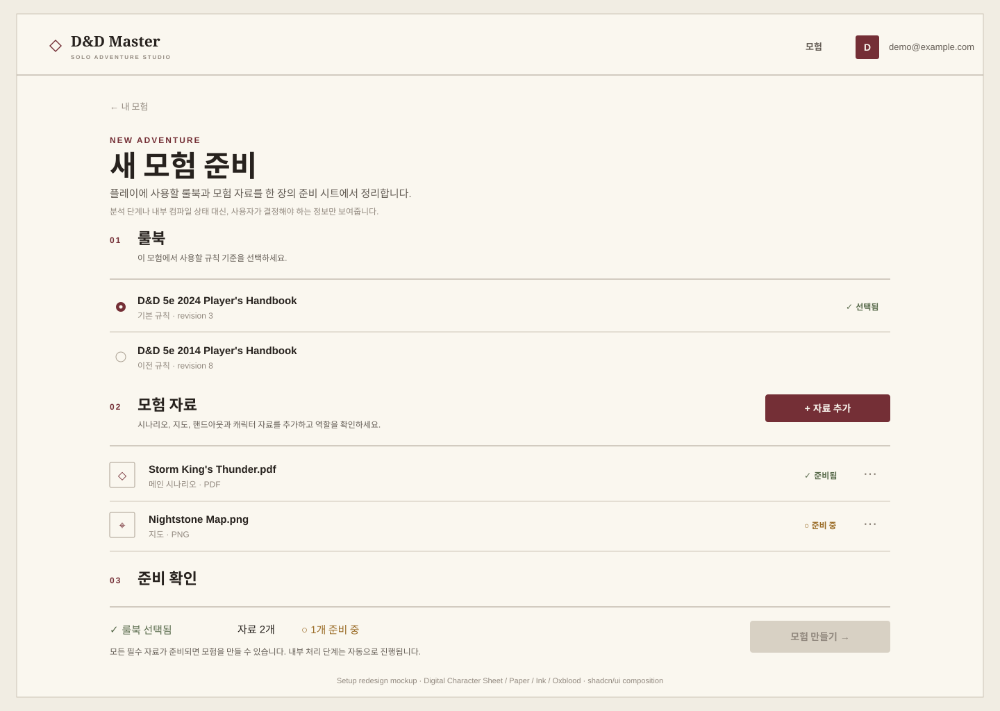

# DND Master Setup 페이지 리디자인 계획

> 대상 브랜치: `codex/ui-rework`
>
> 대상 화면: `#/setup?mode=create`
>
> 목표: 현재의 관리 콘솔형 Setup을 Adventure Workspace와 같은 정보 구조와 컴포넌트 문법을 사용하는 **새 모험 준비 화면**으로 재설계한다.



---

## 1. 왜 Setup을 다시 설계하는가

현재 `RulebookSetup`은 새 모험 생성과 직접 관계없는 기능까지 한 페이지에 동시에 노출한다. 룰북 선택, 스토리북 업로드, 업로드 처리 결과, 진행률, 기존 업로드 자료, 원문 미리보기, 저장된 Bundle 목록, 일괄 삭제, 연결 세션 관리, 게임 준비 Modal과 `ScenarioSetup` 진입이 한 화면에 섞여 있다.

`ScenarioSetup` 역시 자료 선택/역할 지정뿐 아니라 Bundle 저장, Primary Storybook 선택, Integration Prompt, Creativity, compilation 상태, package 상태, 파티 인원, 캐릭터 생성 설정, 모험 생성, 기존 세션 관리까지 담당한다.

이 구조 때문에 Setup만 다른 화면과 달리 다음 성격을 가진다.

- 같은 자료가 업로드 결과, 문서 상태, ScenarioSetup에서 반복 노출된다.
- backend 처리 단계와 식별자가 사용자 흐름에 직접 드러난다.
- `setup-panel`, `setup-subpanel`, `Card`가 중첩되어 Admin Dashboard처럼 보인다.
- Adventure Workspace의 `FileRow`, status, separator, Paper/Ink/Oxblood 문법과 별도 구현이다.
- 새 모험을 만들기 위한 화면과 기존 모험/Bundle을 관리하는 화면이 섞여 있다.

이번 리디자인의 핵심은 CSS 교체가 아니라 **Setup의 책임을 줄이고, 다른 화면에서 이미 사용하는 domain component와 interaction pattern을 공유하는 것**이다.

---

## 2. Setup의 새 역할

`#/setup?mode=create`는 앞으로 **새 모험을 하나 준비하는 화면**으로만 사용한다.

사용자가 이 화면에서 답해야 하는 질문은 세 가지뿐이다.

1. 어떤 룰북을 사용할 것인가?
2. 이 모험에 어떤 자료를 넣을 것인가?
3. 각 자료는 어떤 역할로 사용할 것인가?

그 외의 backend 처리, Bundle revision 관리, compilation 정책, package ID, 연결 세션 관리 등은 기본 Setup 화면의 책임에서 제외한다.

### 최종 사용자 흐름

```text
/adventures
   │
   └─ 모험 없음 또는 + 새 모험
            ↓
      /setup?mode=create
            ↓
      01 룰북 선택
            ↓
      02 모험 자료 추가
            ↓
      03 역할 / 준비 확인
            ↓
      [모험 만들기]
            ↓
      내부 저장 및 준비 처리
            ↓
      Adventure Workspace
```

이 흐름은 route-level wizard가 아니라 **한 장의 준비 문서 안에서 위에서 아래로 진행하는 progressive form**으로 구현하는 것을 기본값으로 한다.

목업에서 보이는 `01 / 02 / 03`은 backend pipeline stepper가 아니다. 캐릭터 시트의 section number와 같은 시각적 구획이다.

---

## 3. 다른 화면과의 일관성 원칙

Setup, Adventure Workspace, Session Runtime은 같은 제품이므로 다음 디자인 언어를 공유한다.

### 공통 시각 언어

- Canvas: warm ivory
- Paper: 밝은 종이 표면
- Ink: 거의 검정에 가까운 갈색 먹색
- Accent: Oxblood
- Section 분리: Card보다 spacing + typography + rule line
- Radius: 0~4px 위주
- Shadow: 기본 없음
- Heading: serif
- UI / body: sans
- 상태: colored pill보다 symbol + text

### Setup의 character-sheet intensity

Setup은 Adventure Workspace와 유사한 45~55% 수준으로 유지한다.

Setup이 실제 캐릭터 시트처럼 복잡해지는 것이 아니라, **아직 작성 중인 모험 준비 시트**처럼 보여야 한다.

---

## 4. 목표 페이지 구조

Desktop 기준 content max-width는 Adventure Workspace와 동일한 약 `1120~1180px`을 사용한다.

```text
App Header

← 내 모험

NEW ADVENTURE
새 모험 준비
플레이에 사용할 룰북과 모험 자료를 한 장의 준비 시트에서 정리합니다.

01  룰북
────────────────────────────────────────────
Rulebook rows

02  모험 자료                           [+ 자료 추가]
────────────────────────────────────────────
Material rows

03  준비 확인
────────────────────────────────────────────
Readiness summary                     [모험 만들기]
```

Setup 전체를 하나의 `Card`로 감싸지 않는다.

각 Section도 독립적인 `Card`가 아니라 문서의 필드 그룹처럼 배치한다.

---

## 5. Page Header

Adventure Workspace의 Header 문법을 그대로 가져온다.

```text
← 내 모험

NEW ADVENTURE
새 모험 준비
플레이에 사용할 룰북과 모험 자료를 한 장의 준비 시트에서 정리합니다.
```

### 구현 기준

- Breadcrumb는 `#/adventures?view=list` 또는 제품에서 정한 명시적 목록 route로 이동한다.
- `NEW ADVENTURE`는 작은 sans uppercase eyebrow.
- `새 모험 준비`는 serif 32~42px.
- 설명은 최대 1~2줄.
- Header 내부에 진행률, KPI, backend 상태 badge를 넣지 않는다.

---

## 6. Section Heading을 공통 컴포넌트로 만든다

Setup에서만 사용하는 `setup-panel > h2` 패턴을 중단한다.

권장 domain primitive:

```text
DocumentSectionHeading
```

Props 예시:

```text
index
label
summary?
action?
```

예:

```text
01  룰북
    이 모험에서 사용할 규칙 기준을 선택하세요.
────────────────────────────────────────────
```

이 component는 추후 Adventure Workspace의 section heading에도 재사용할 수 있다.

---

## 7. 룰북 선택 Section

현재 `RulebookSetup`은 catalog rulebook을 Checkbox 목록으로 렌더링하지만 실제 state는 `selectedCatalogRulebookId` 하나만 유지하므로 UX는 single selection이다.

따라서 화면도 single-selection 문법으로 보여야 한다.

### 목표 UI

```text
01  룰북
────────────────────────────────────────────

● D&D 5e 2024 Player's Handbook              ✓ 선택됨
  기본 규칙 · revision 3
────────────────────────────────────────────

○ D&D 5e 2014 Player's Handbook
  이전 규칙 · revision 8
```

### 구현 원칙

- 큰 `Card`를 만들지 않는다.
- 각 rulebook은 row 형태.
- 선택 상태는 Oxblood indicator + 약한 background 정도만 사용한다.
- 프로젝트에 shadcn-style `RadioGroup`이 존재한다면 사용한다.
- 없다면 기존 Checkbox primitive의 accessible behavior를 보존하면서 single-selection domain component로 감싼다.
- `revision`은 사용자가 의미를 알아야 할 때만 meta로 보여준다. 필요하지 않으면 숨긴다.

### Empty state

사용 가능한 룰북이 없을 때 거대한 empty card를 만들지 않는다.

```text
사용 가능한 룰북이 없습니다.
관리자가 룰북을 준비한 뒤 다시 시도하세요.
```

정도로 section 내부에 작게 표시한다.

---

## 8. 모험 자료 Section

현재 Setup에서는 파일이 다음 위치에서 반복된다.

- upload result
- `올려둔 자료 상태`
- selected uploaded documents
- `ScenarioSetup`의 문서 목록

새 UI에서는 **하나의 MaterialRow가 업로드 이후의 단일 표현**이 된다.

### 목표 UI

```text
02  모험 자료                            [+ 자료 추가]
────────────────────────────────────────────

◇ Storm King's Thunder.pdf                 ✓ 준비됨
  메인 시나리오 · PDF                            ⋯
────────────────────────────────────────────

⌖ Nightstone Map.png                       ○ 준비 중
  지도 · PNG                                      ⋯
────────────────────────────────────────────
```

### 공통 컴포넌트

Adventure Workspace의 `FileRow`와 Setup의 uploaded document row를 하나의 domain component 계열로 합친다.

권장 이름:

```text
AdventureMaterialRow
AdventureMaterialList
MaterialStatus
```

Variant는 시각 프레임워크가 아니라 사용 목적에 따라 최소화한다.

```text
mode="read"
mode="configure"
```

`read`는 Adventure Workspace, `configure`는 Setup에서 사용한다.

---

## 9. 자료 추가 Interaction

현재 Setup의 inline `<Input type="file">` + submit form을 주요 UI로 두지 않는다.

`+ 자료 추가`는 shadcn-style `Dialog`를 연다.

### AddMaterialDialog 구조

```text
자료 추가

파일을 선택하거나 끌어오세요.
PDF, DOCX, TXT, MD, PNG, JPG 등

선택된 파일
Nightstone Map.png

자료 역할
[메인 시나리오] [지도] [핸드아웃] [캐릭터 시트] [기타]

                                 [취소] [자료 추가]
```

### Important: 역할 모델 제약

현재 frontend의 `ScenarioBundleRole`은 문서 하나당 **단일 role**을 저장한다.

프로젝트의 장기 UX 원칙은 한 파일에 여러 역할을 허용하는 방향이지만, 이번 Setup 리디자인에서 backend contract를 암묵적으로 변경하면 안 된다.

따라서 구현 단계에서는 다음 중 하나를 명시적으로 선택해야 한다.

1. **v1 UI는 현재 API에 맞춰 단일 role 선택을 유지한다.**
2. backend/API가 multi-role을 지원하도록 별도 변경한 뒤 multi-select를 활성화한다.

현재 계획의 기본값은 1번이다.

목업의 role control은 최종 시각 방향을 나타내며, 실제 선택 방식은 현재 API 계약을 우선한다.

---

## 10. 자료 역할 편집

현재 `ScenarioSetup`이 같은 문서 목록을 다시 렌더링하면서 Select를 붙이는 구조를 제거한다.

대신 `AdventureMaterialRow mode="configure"` 안에서 역할을 확인/수정한다.

### 기본 상태

```text
Storm King's Thunder.pdf
메인 시나리오 · PDF
```

### 편집 상태

```text
Storm King's Thunder.pdf
[메인 시나리오 ▾]
```

역할 Select는 프로젝트의 기존 shadcn-style `Select`를 사용한다.

Role 변경을 위해 별도의 `ScenarioSetup` 화면을 다시 펼치지 않는다.

---

## 11. 사용자 상태 단순화

Setup에서 backend processing status를 그대로 보여주지 않는다.

사용자-facing status는 Adventure Workspace와 같은 네 종류로 통일한다.

```text
○ 준비 중
✓ 준비됨
△ 확인 필요
! 사용 불가
```

내부적으로 다음 상태를 이 네 상태로 mapping한다.

```text
UPLOADED / PROCESSING / INDEXING / ... → 준비 중
INDEXED / READY / ...                 → 준비됨
NEEDS_INPUT / PARTIAL_*               → 확인 필요
FAILED / REJECTED                     → 사용 불가
```

정확한 mapping은 현재 `KnowledgeDocumentView.status` 목록을 기준으로 구현 전에 한 번 정리한다.

### Progress

- 전체 화면 상단에 전체 Progress bar를 두지 않는다.
- 실제 처리 중인 개별 파일에만 아주 얇은 progress를 선택적으로 표시한다.
- `stage`, `attempt`, compilation ID 같은 internal 값은 기본 UI에서 숨긴다.

---

## 12. Source Preview는 Sheet로 이동

현재 `RulebookSetup`은 source preview를 inline `<ol>`과 `<pre>`로 펼친다. 이 때문에 Setup 페이지가 매우 길어지고 visual hierarchy가 깨진다.

새 구조:

```text
MaterialRow
  ⋯
   ├ 미리보기
   ├ 역할 수정
   ├ 다시 처리
   └ 삭제
```

`미리보기`를 누르면 shadcn-style `Sheet`를 연다.

### SourcePreviewSheet

```text
Storm King's Thunder.pdf
PDF · 준비됨
────────────────────────────
원문 preview
page / locator / confidence 등
────────────────────────────
첨부 자산
```

이 방식은 Character Sheet Drawer와 같은 interaction grammar를 사용한다.

---

## 13. Setup에서 제거할 기존 Bundle 관리 UI

현재 `RulebookSetup`의 `저장된 모험 자료` 영역은 새 모험 생성이라는 목적과 맞지 않는다.

다음 기능은 `/setup?mode=create`에서 제거한다.

- 저장된 Bundle 전체 목록
- 전체 선택
- 선택한 Bundle 일괄 삭제
- `연결 세션 관리`
- 기존 Bundle별 `게임 준비`
- 기존 Bundle 삭제

이미 존재하는 모험은 `/adventures` 및 `/adventures/:id`에서 관리한다.

Bundle 자체가 개발자/관리자 관점에서 별도 관리가 필요하면 기존 `/bundles/:id` 경로 또는 별도 관리 화면을 유지하되, 새 모험 생성 흐름에는 넣지 않는다.

---

## 14. Preparation / Compilation UX

현재 `ScenarioSetup`은 다음을 직접 노출한다.

- Primary Storybook
- Integration Prompt
- Creativity
- compilation status
- attempt
- percentage
- package ID / report status

이 값들은 일반적인 새 모험 생성 화면에서 사용자가 반드시 이해해야 할 정보가 아니다.

### 기본 UX

`모험 만들기`를 누르면 frontend orchestrator가 현재 API 순서에 따라 저장/준비 작업을 수행한다.

```text
모험을 준비하고 있습니다
자료를 정리하고 게임에 필요한 내용을 준비하는 중입니다.
```

정도의 사용자 메시지만 표시한다.

### Advanced options

Primary Storybook, Integration Prompt, Creativity가 실제 product requirement라면 기본 UI에서 제거하고:

```text
고급 설정
```

Disclosure 또는 별도 debug/admin surface로 이동한다.

기본 사용자에게 backend enum (`NONE`, `CONSERVATIVE`, `CREATIVE`)을 그대로 보여주지 않는다.

---

## 15. 준비 확인 Section

페이지 마지막은 별도 Dashboard가 아니라 **현재 draft의 readiness summary**다.

```text
03  준비 확인
────────────────────────────────────────────

✓ 룰북 선택됨
✓ 모험 자료 4개
✓ 메인 시나리오 지정됨
○ 지도 1개 준비 중

모든 필수 자료가 준비되면 모험을 만들 수 있습니다.

[취소]                                 [모험 만들기]
```

### CTA 규칙

- Primary CTA는 `모험 만들기` 하나.
- 필요한 자료가 아직 처리 중이면 disabled.
- 이유를 버튼 tooltip에 숨기지 않고 주변 text로 설명한다.
- `모험 자료 저장`, `게임 준비 시작`, `캐릭터 생성 시작`, `이 자료로 모험 만들기`처럼 여러 Primary CTA가 연속해서 등장하지 않게 한다.

---

## 16. Character Blueprint와 Party Size 처리

현재 backend 흐름은 `ScenarioPackage`와 character blueprint publish 상태가 session 생성의 prerequisite로 사용된다.

이번 UI 리디자인은 이 계약을 임의로 바꾸지 않는다.

따라서 구현 전에 다음을 확인한다.

- Adventure Workspace를 만들기 위해 실제로 Session 생성까지 필요한가?
- Saved Adventure와 Scenario Package 사이에 별도 생성 endpoint가 있는가?
- default blueprint를 자동 생성할 수 있는 기존 endpoint가 있는가?

### 기본 UX 원칙

캐릭터 생성 설정과 파티 구성은 Setup의 긴 하단 Section에 넣지 않는다.

가능하면:

```text
새 모험 자료 준비
      ↓
Adventure Workspace
      ↓
캐릭터 탭 / 세션 시작
```

으로 이동한다.

현재 API 제약 때문에 blueprint publish가 모험 생성 전 반드시 필요하면, 최소한의 dedicated review 화면으로 라우팅하되 Setup 본문 안에 compilation + blueprint + session management를 모두 중첩하지 않는다.

---

## 17. shadcn/ui 사용 원칙

기존 프로젝트의 `components/ui` 및 CVA / `cn()` convention을 유지한다.

### 재사용할 primitive

- `Button`
- `Dialog`
- `Sheet`
- `Checkbox` 또는 existing single-selection primitive
- `Select`
- `Separator`
- `Progress`
- `Input`
- `DropdownMenu`가 있으면 MaterialRow actions에 사용

### 하지 않을 것

- `CustomFantasyButton`
- `CustomFantasyModal`
- Setup 전용 primitive framework
- 새로운 UI library 설치
- shadcn init 재실행
- `components/ui` 전체 rewrite

---

## 18. Domain Component 구조

권장 구조:

```text
src/web-ui/src/components/
├ ui/
│  └ existing shadcn-style primitives
│
├ adventure/
│  ├ document-page-header.tsx
│  ├ document-section-heading.tsx
│  ├ adventure-material-list.tsx
│  ├ adventure-material-row.tsx
│  ├ material-status.tsx
│  ├ material-role-select.tsx
│  ├ source-preview-sheet.tsx
│  └ document-empty-state.tsx
│
└ setup/
   ├ new-adventure-setup.tsx
   ├ rulebook-section.tsx
   ├ materials-section.tsx
   ├ add-material-dialog.tsx
   └ preparation-summary.tsx
```

실제 repository convention과 맞지 않으면 directory 위치는 조정할 수 있다. 중요한 것은 **UI primitive layer와 DND domain layer를 구분하는 것**이다.

---

## 19. 기존 파일의 책임 재정리

### `RulebookSetup.tsx`

현재 거대한 page/controller 역할을 축소한다.

최종적으로는 data orchestration을 담당하거나 `NewAdventureSetup`을 조립하는 container가 된다.

분리 대상:

- RulebookSection
- MaterialsSection
- AddMaterialDialog
- SourcePreviewSheet
- PreparationSummary

### `ScenarioSetup.tsx`

현재의 모든 기능을 Setup 본문에서 직접 렌더링하지 않는다.

남길 수 있는 책임:

- current API에 맞춘 bundle save orchestration
- preparation / compilation orchestration
- backend-required validation

UI는 위 domain component를 통해 노출한다.

기존 advanced policy UI는 별도 component로 분리하거나 기본 create flow에서 숨긴다.

### `AdventureWorkspace.tsx`

FileRow / status / section heading 구현을 Setup과 공유할 수 있도록 domain component를 추출한다.

동일한 파일 데이터가 Workspace와 Setup에서 다른 모양으로 보이지 않게 한다.

---

## 20. CSS 구조

새로운 `setup-*` selector를 계속 늘리는 방향을 피한다.

공통 domain class 또는 component-local Tailwind/className을 통해 스타일을 공유한다.

우선순위:

```text
semantic token
→ typography
→ document layout
→ rule/separator
→ shared material row
→ setup-only composition
```

### Setup이 반드시 사용하는 기존 rework token

```text
Canvas      #F1EDE3
Paper       #FAF7EF
PaperMuted  #EEE8DC
Ink         #27221E
MutedInk    #655E56
Rule        #CEC5B7
RuleStrong  #AAA092
Oxblood     #742F36
```

### 삭제/격리 대상 스타일 패턴

- nested `setup-panel` card border
- large rounded surface
- setup-only floating card shadow
- global `section/article` style 침투
- admin table toolbar appearance
- giant dashed empty box

---

## 21. Responsive

### Desktop

- max-width 1120~1180px
- full-width document sections
- MaterialRow는 horizontal ledger 형태

### Tablet

- 같은 section 구조 유지
- action button은 heading 아래로 wrap 가능

### Mobile

MaterialRow:

```text
Storm King's Thunder.pdf            ✓ 준비됨
메인 시나리오 · PDF
                                           ⋯
```

- role control은 다음 줄로 이동 가능
- Preview는 full-width Sheet
- `모험 만들기`는 터치 가능한 높이를 유지
- 별도의 mobile card design을 만들지 않는다

---

## 22. Loading / Empty / Error state

모든 상태는 Adventure Workspace와 동일한 tone을 사용한다.

### Loading

```text
자료를 불러오는 중입니다.
```

페이지 전체 Skeleton dashboard를 만들지 않는다.

### Empty Materials

```text
아직 추가한 모험 자료가 없습니다.
시나리오나 지도를 추가해 모험을 준비하세요.

[+ 자료 추가]
```

거대한 점선 card를 만들지 않는다.

### Error

기술적인 status code보다 사용자의 다음 행동을 우선한다.

```text
자료를 불러오지 못했습니다.
[다시 시도]
```

---

## 23. 구현 Phase

### Phase 0 — 현재 API 계약 확인

다음 contract를 먼저 확인한다.

- catalog rulebook single-selection 여부
- document role 단일/복수 여부
- Bundle 생성 시 name/title 지원 여부
- preparation prerequisite
- character blueprint prerequisite
- Adventure Workspace를 만들기 위한 최소 backend object

확인 전 backend contract를 바꾸지 않는다.

### Phase 1 — Shared Material Components 추출

Adventure Workspace의 file representation을 공통 domain component로 추출한다.

목표:

```text
MaterialList
MaterialRow
MaterialStatus
DocumentSectionHeading
SourcePreviewSheet
```

### Phase 2 — RulebookSetup markup 재작성

기존 `setup-panel` 연속 구조를 제거하고:

```text
PageHeader
RulebookSection
MaterialsSection
PreparationSummary
```

로 조립한다.

### Phase 3 — Upload Dialog

inline file form을 `AddMaterialDialog`로 이동한다.

upload API와 polling logic 자체는 우선 유지한다.

### Phase 4 — ScenarioSetup orchestration 분리

문서 선택/역할 UI 중복을 제거한다.

Bundle save와 preparation logic을 UI component와 분리한다.

### Phase 5 — 기존 Bundle 관리 제거

`#/setup?mode=create`에서 saved bundle management UI를 제거한다.

필요한 관리 기능이 사라지지 않도록 기존 route 또는 별도 화면의 접근 가능 여부를 확인한다.

### Phase 6 — Preparation UX 단순화

컴파일 enum / id / policy를 기본 화면에서 숨기고 사용자-facing readiness로 변환한다.

### Phase 7 — Responsive / Accessibility / Tests

- keyboard navigation
- radio/checkbox accessible name
- Dialog focus trap
- Sheet focus behavior
- disabled CTA 설명
- route tests
- upload tests
- status mapping tests

---

## 24. 테스트 계획

### Component tests

`RulebookSection`

- catalog 목록을 렌더링한다.
- 한 번에 하나만 선택된다.
- 선택된 rulebook 상태가 accessible하게 표현된다.

`AdventureMaterialRow`

- filename / role / format / status를 표시한다.
- processing / review / unavailable mapping을 표시한다.
- configure mode에서 role 변경 가능하다.

`AddMaterialDialog`

- multiple file input을 받는다.
- 취소 시 draft를 commit하지 않는다.
- upload 실패를 inline error로 표시한다.

`PreparationSummary`

- 필수 조건이 부족하면 CTA disabled.
- 모든 조건 충족 시 CTA enabled.

### Flow tests

```text
모험 0개
→ /setup?mode=create
→ 룰북 선택
→ 자료 추가
→ role 확인
→ 준비 완료
→ 모험 만들기
→ 다음 정상 route
```

### Regression

- 기존 Adventure Workspace 자료 목록이 동일 MaterialRow로 정상 동작한다.
- `/sessions/:id?mode=play` Runtime과 style leakage가 없다.
- setup에서 제거한 bundle management 기능의 대체 접근 경로가 존재한다.

---

## 25. Acceptance Criteria

아래를 모두 만족해야 Setup 리디자인 완료로 판단한다.

1. `#/setup?mode=create`를 열었을 때 Admin Dashboard처럼 보이지 않는다.
2. Setup 전체가 Paper / Ink / Oxblood 기반의 한 장짜리 준비 문서처럼 보인다.
3. 동일 파일이 Setup 안에서 여러 목록에 반복 등장하지 않는다.
4. Setup과 Adventure Workspace가 같은 MaterialRow / MaterialStatus 문법을 사용한다.
5. 일반 사용자는 `compilation`, `packageId`, `attempt`, backend enum을 볼 필요가 없다.
6. 저장된 Bundle 전체 관리 기능이 새 모험 생성 화면에 나타나지 않는다.
7. Primary CTA는 기본적으로 `모험 만들기` 하나다.
8. 미리보기는 본문을 늘리지 않고 Sheet/Dialog로 열린다.
9. 기존 shadcn-style primitives와 접근성 구조를 유지한다.
10. 현재 backend/API 계약을 확인하지 않은 상태에서 multi-role, 자동 blueprint 생성 등 새로운 behavior를 임의로 도입하지 않는다.

---

## 26. Visual QA 질문

구현 후 screenshot 기준으로 확인한다.

### 실패 신호

```text
설정 패널 Card가 위에서 아래로 계속 쌓인다.
같은 파일명이 세 번 이상 반복된다.
Progress bar가 화면의 주요 시각 요소다.
Bundle ID / package ID / enum이 그대로 보인다.
버튼이 5~6개씩 같은 중요도로 나열된다.
Setup만 다른 admin tool처럼 보인다.
```

### 성공 신호

```text
Adventure Workspace의 작성 전 버전처럼 보인다.
룰북 → 자료 → 준비 확인의 흐름이 한눈에 읽힌다.
어떤 자료가 준비됐고 무엇이 부족한지 즉시 이해된다.
캐릭터 시트의 rule line과 field grammar가 느껴진다.
기능보다 장식이 먼저 보이지 않는다.
```

---

## 27. 최종 구현 방향 한 문장

> Setup을 “룰북/문서/Bundle/컴파일을 관리하는 관리자 화면”에서 “새 모험에 필요한 룰북과 자료를 작성하고 확인하는 디지털 TRPG 준비 시트”로 바꾼다.
